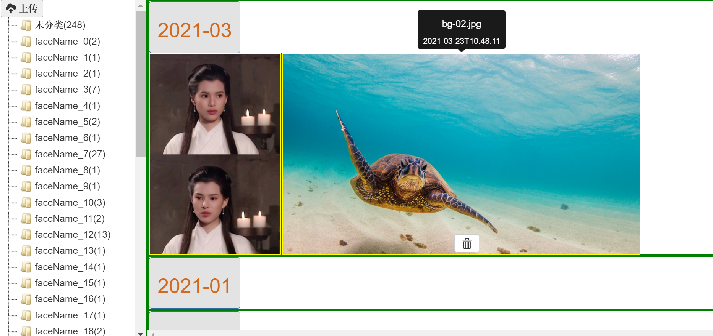
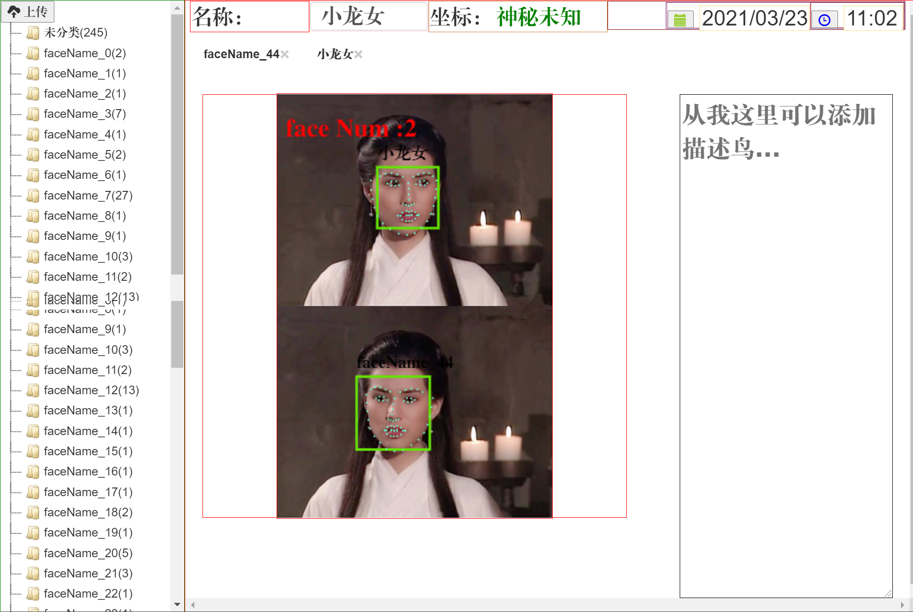

# 开发log

## 2021-07-25 二下决心

经历过微软自带相册的折腾，感觉一定得做一个听自己话的优秀相册出来

新功能

>1.可以像谷歌那样在线可视化地图，可以按时间、地点排序，热力图视觉
>
>2.规划出本人的轨迹图

## 用springboot进行改写，并使用docker部署到Linux上(undone)

# 做这个应用的初衷

​      本人喜欢定期整理自己的照片，每个月都要把手机里的照片导入到电脑，然后开始整理，这个过程就比较耗时，于是乎，调研了市面上的照片管理软件，都不近合乎朕心意，于是乎作为一个半路出家的**准程序员**，那就自己动手做一个吧。正好把刚刚学完的`ssm`框架熟悉一哈。

#  基本信息

- 开发时间：初稿 耗时410h（2021.02.01-2021.03.22）

- 技术点：ssm框架，前端的框架bootstrap，vue，jstree,python（进行人脸识别），git，maven等

# 这个应用能干啥

- 对上传的图片 按**时间**、**地点**、**人脸**进行分类
- 修改照片的时间
- 支持**自定义创建标签**，将标签拖拽到照片进行添加，将照片拖拽到标签进行添加（前端这块jstree着手折腾了好久）
- 可对照片进行人脸识别，对识别的人脸进行72个特征点的标记显示（对比了几大厂的人脸识别api，使用face_recognition人脸个数识别性能完爆他们）

# 待开发功能

- 显示历史上的今天 的照片
- 添加对图片其他形式的自动分类  如 风景，聚会，建筑等
- 搞一个超级日历，能看到所有历史时间的照片数量
- 通过人脸识别和地理位置，动态的显示 特定两人之间的距离，并通过地图生成动态的视频 

- 一键导出指定标签的照片

## 页面展示

### 主页面

### 图片上传

### 本次上传预览

### 人脸识别(待完善)

