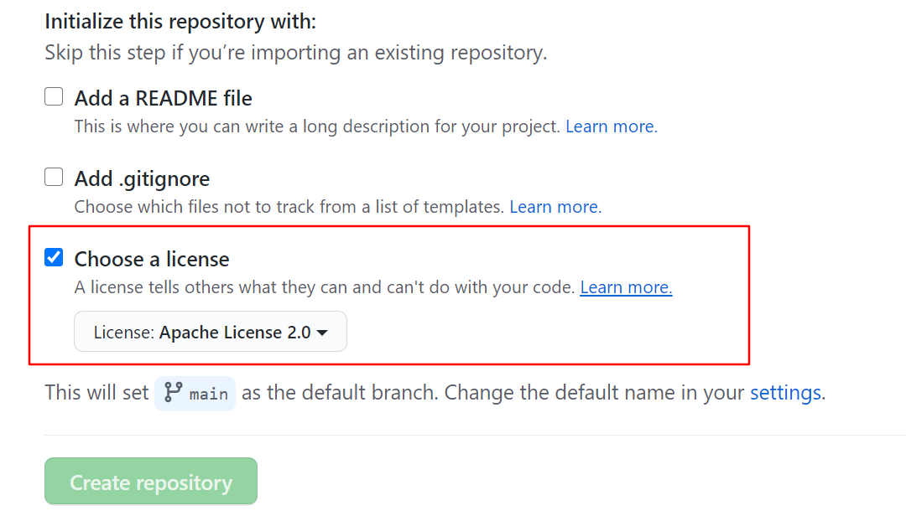

---

layout: post 
title:  jekyll+GitHubPage博客搭建记录
date: 2021-03-22 
tags: gitub，jekyll

---

# 安装 jekyll

- window需要先安装`rubyinstaller`此处为[官网](https://rubyinstaller.org/downloads/)，但下载很慢，这里是我已经下载好的[百度网盘](链接：https://pan.baidu.com/s/1Jkqyl7EZvN-QtsaKDL2c2Q 
  提取码：6666 
  复制这段内容后打开百度网盘手机App，操作更方便哦--来自百度网盘超级会员V2的分享 )
## 1.rubyinstaller

- window需要先安装`rubyinstaller`此处为[官网](https://rubyinstaller.org/downloads/)，但下载很慢，这里是我已经下载好的[百度网盘](https://pan.baidu.com/s/1V950shxdBMJwM5EBElYfsw )
- 选择安装3

## 2.打开cmd将镜像改为国内的，不然非常卡顿

```java
$ gem sources --remove https://rubygems.org/
$ gem sources -a https://gems.ruby-china.com/
$ gem sources -l
*** CURRENT SOURCES ***
https://gems.ruby-china.org/
```

## 3. 安装Jekyll

在cmd中输入:

```ruby
$ gem install jekyll
```

## 4. 安装jekyll-paginate

在cmd中输入：

```ruby
$ gem install jekyll-paginate
```

## 5. 验证安装完成

在cmd中输入：

```ruby
$ jekyll -v
```

输出版本说明安装完成：

```css
jekyll 4.2.0
```

## 6. 开启本地实时预览

切换到仓库所在目录，在cmd中输入:

```ruby
$ jekyll serve
```


# 部署到GitHub

##  1.新建仓库 注意仓库名

.jpg)


## 2.要勾选协议 不然后期有bug

