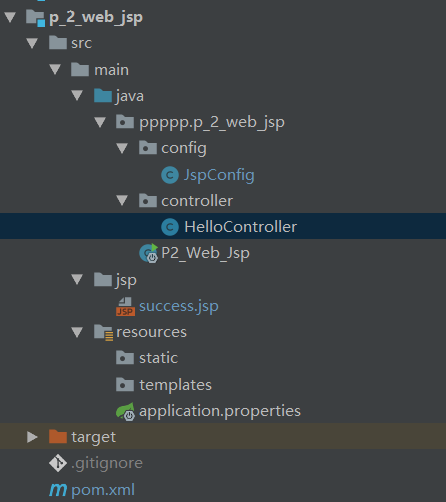
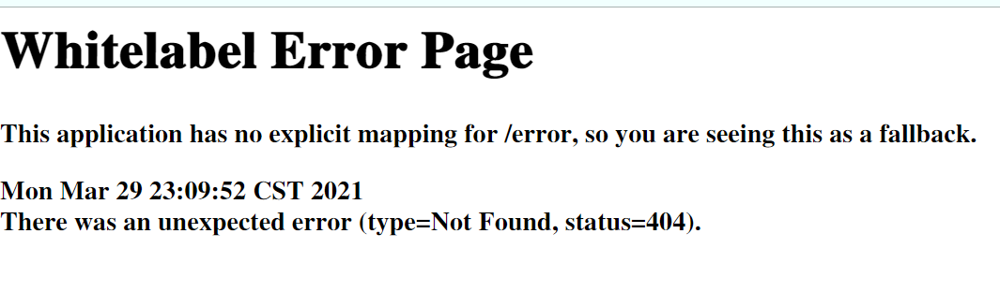

---

layout: post 
title:  springboot整合jsp
date: 2021-3-29
tags: springboot，jsp

---

#  1.目的：在springboot中使用jsp

## 整合步骤

- 导包

  ```xml
    <dependencies>
          <dependency>
              <groupId>org.springframework.boot</groupId>
              <artifactId>spring-boot-starter-web</artifactId>
          </dependency>
          <dependency>
              <groupId>org.springframework.boot</groupId>
              <artifactId>spring-boot-starter-tomcat</artifactId>
          </dependency>
          <!--注意：spring boot对jsp的支持不是很好，在使用spring boot自带tomcat的同时，还需要引入另外的一个tomcat，以来如下所示，且scope属性需要被注释掉 -->
          <dependency>
              <groupId>org.apache.tomcat.embed</groupId>
              <artifactId>tomcat-embed-jasper</artifactId> <!--<scope>provided</scope> 注意，这个scope需要被注释掉-->
          </dependency>
  
      </dependencies>
  ```

  

- 配置properties文件

  ```properties
  spring.mvc.view.prefix=/
  spring.mvc.view.suffix=.jsp
  ```

  

- 写一个简单的controller

  ```java
  @Controller
  public class HelloController {
      @GetMapping("/h")
      public String hello(){
          return "success";
      }
  }
  ```

  

- 直接访问jsp页面

module的结构图为



# 2.出现的问题：一直找不到jsp的路径



# 3.解决办法

[参考博客](https://blog.csdn.net/hp_yangpeng/article/details/89067596)

- 创建一个配置类（暂不知其所以然）

  ```java
   @Bean
      public WebServerFactoryCustomizer<TomcatServletWebServerFactory> customizer() {
          return (factory) -> {
              factory.addContextCustomizers((context) -> { //模块中webapp相对路径
                  String relativePath = "p_2_web_jsp/src/main/jsp";
                  File docBaseFile = new File(relativePath); // 如果路径不存在，则把这个路径加入进去
                  if (docBaseFile.exists()) {
                      context.setDocBase(docBaseFile.getAbsolutePath());
                  }
              });
          };
      }
  ```

  

- [完整的demo-github源码](https://github.com/u19900101/6_SpringBoot/tree/master/p_2_web_jsp)