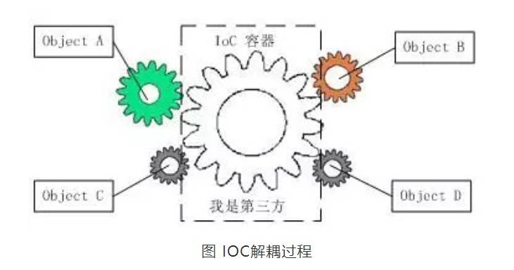
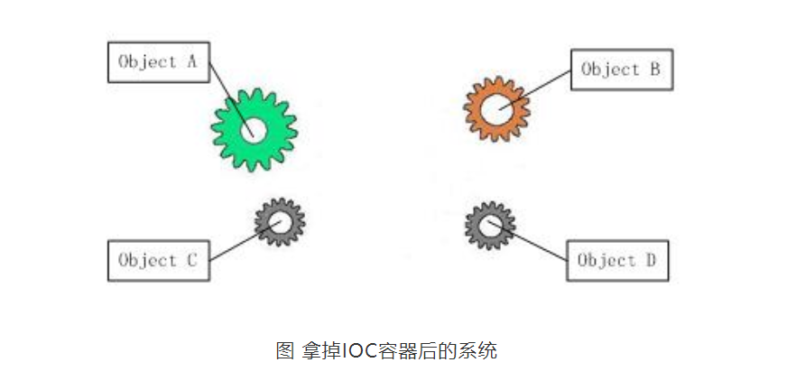

---

layout: post 
title:  IOC的解释
date: 2021-03-30
tags: spring，IOC

---

# 什么是 ioc?

[引用自](https://mp.weixin.qq.com/s?__biz=MzIwMTY0NDU3Nw==&mid=2651938436&idx=2&sn=2465bb0d7569a0c81b9b169c6e7590b0&chksm=8d0f31caba78b8dcb68610bb8203d6ec750c4cef8880c3d39c26eba595a234688d9022e0bf6c&scene=21#wechat_redirect)

IOC是Inversion of Control的缩写，多数书籍翻译成“控制反转”。

　　

​	 1996年，Michael Mattson在一篇有关探讨面向对象框架的文章中，首先提出了IOC 这个概念。对于面向对象设计及编程的基本思想，前面我们已经讲了很多了，不再赘述，简单来说就是把复杂系统分解成相互合作的对象，这些对象类通过封装以后，内部实现对外部是透明的，从而降低了解决问题的复杂度，而且可以灵活地被重用和扩展。

# 解耦

IOC理论提出的观点大体是这样的：**借助于“第三方”实现具有依赖关系的对象之间的解耦**。如下图：

​       大家看到了吧，由于引进了中间位置的“第三方”，也就是IOC容器，使得A、B、C、D这4个对象没有了耦合关系，齿轮之间的传动全部依靠“第三方”了，全部对象的控制权全部上缴给“第三方”IOC容器，所以，IOC容器成了整个系统的关键核心，它起到了一种类似“粘合剂”的作用，把系统中的所有对象粘合在一起发挥作用，如果没有这个“粘合剂”，对象与对象之间会彼此失去联系，这就是有人把IOC容器比喻成“粘合剂”的由来。

　　

我们再来做个试验：把上图中间的IOC容器拿掉，然后再来看看这套系统：

　　

​		我们现在看到的画面，就是我们要实现整个系统所需要完成的全部内容。这时候，A、B、C、D这4个对象之间已经没有了耦合关系，彼此毫无联系，这样的话，当你在实现A的时候，根本无须再去考虑B、C和D了，对象之间的依赖关系已经降低到了最低程度。所以，如果真能实现IOC容器，对于系统开发而言，这将是一件多么美好的事情，参与开发的每一成员只要实现自己的类就可以了，跟别人没有任何关系！

# 控制反转(IOC)由来

我们再来看看，控制反转(IOC)到底为什么要起这么个名字？我们来对比一下：

  

软件系统在没有引入IOC容器之前，如图1所示，对象A依赖于对象B，那么对象A在初始化或者运行到某一点的时候，自己必须主动去创建对象B或者使用已经创建的对象B。无论是创建还是使用对象B，控制权都在自己手上。

  

软件系统在引入IOC容器之后，这种情形就完全改变了，如图3所示，由于IOC容器的加入，对象A与对象B之间失去了直接联系，所以，当对象A运行到需要对象B的时候，IOC容器会主动创建一个对象B注入到对象A需要的地方。

  

通过前后的对比，我们不难看出来：对象A获得依赖对象B的过程,由主动行为变为了被动行为，控制权颠倒过来了，这就是“控制反转”这个名称的由来。