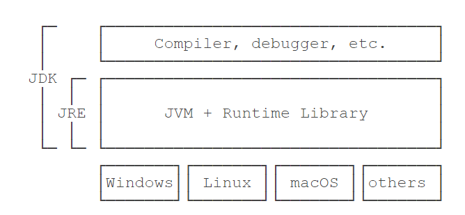

---

layout: post 
title:  java面试208题
date: 2021-03-30
tags: 

---

## **Java 基础**

# 2021-04-01 补基础

## Java简介

[懒汉式和饿汉式](https://blog.csdn.net/fly910905/article/details/79286680)

## 单例模式的线程安全性

首先要说的是单例模式的线程安全意味着：某个类的实例在多线程环境下只会被创建一次出来。单例模式有很多种的写法，我总结一下：

（1）饿汉式：线程安全

（2）懒汉式：非线程安全

（3）双检锁：线程安全

（4）静态内部类：线程安全

（5）枚举：线程安全

jdk 和 jre




stringBulider 和 stringBuffer区别

stringBulider 线程不安全

stringBuffer 线程安全


安全不安全的底层原因——


局部变量定义 stringBulider 线程是否安全--安全的

### 为什么局部变量是线程安全的？


1. 方法是如何被执行的？
   //斐波那契数列：1、1、2、3、5、8、13、21、34第一项和第二项是1，第三项开始，每一项是前两项的和
   int a=7;
   int [] b = fibonacci(a);
   int [] c =b;

当你调用fibonacci(a)的时候，cpu要先找到fibonacci()的地址，然后跳转到这个地址去执行代码，最后，cpu执行完fibonacci()后，要能够返回，也就是找到调用方法的下一条语句，也就是int[] c=b的地址，然后跳转到这个地址去执行方法


2. 调用栈结构

   


3. 局部变量存在哪里
   局部变量放在栈帧里，局部变量的作用域是方法内部局部变量是和方法同生共死的，一个变量如果想跨越方法的边界，就必须创建在堆里。

  


4. 调用栈和线程是什么关系？
   两个线程可以同时用不同的参数调用相同的方法，那调用栈和线程是什么关系呢？每个线程都有自己独立的调用栈，局部变量保存在线程各自的调用栈里面，不会共享，没有共享就没有伤害

  


5. 线程封闭是什么意思？
   线程封闭：方法里的局部变量，由于不会和其他变量共享，所以没有并发问题，叫线程封闭，官方解释为：单线程内访问数据，由于不存在共享，所以即使不同步也不会有并发问题，


final 3种用法：

- 变量
- 方法
- 类


线程池提高效率？

多线程一定能提高效率吗？  计算密集型不可以

多线程使用的业务场景


对spring的了解

http请求进来的流程

control  数据填充，二进制流 对应到  可以转化为  


mybatis的了解程度--

缓存


内部系统和IOT，图像传输，视频传输，p2p点对点传输

机械智能化


### **4. final 在 java 中有什么作用？**


- final 修饰的类叫最终类，该类不能被继承。
- final 修饰的方法不能被重写。
- final 修饰的变量叫常量，常量必须初始化，初始化之后值就不能被修改。


### **5. java 中的 Math.round(-1.5) 等于多少？**

等于 -1，因为在数轴上取值时，中间值（0.5）向右取整，所以正 0.5 是往上取整，负 0.5 是直接舍弃。


### **6. String 属于基础的数据类型吗？**


String 不属于基础类型，基础类型有 8 种：byte、boolean、char、short、int、float、long、double，而 String 属于对象。


### **7. java 中操作字符串都有哪些类？它们之间有什么区别？**


操作字符串的类有：String、StringBuffer、StringBuilder。


String 和 StringBuffer、StringBuilder 的区别在于 String 声明的是不可变的对象，每次操作都会生成新的 String 对象，然后将指针指向新的 String 对象，而 StringBuffer、StringBuilder 可以在原有对象的基础上进行操作，所以在经常改变字符串内容的情况下最好不要使用 String。


StringBuffer 和 StringBuilder 最大的区别在于，StringBuffer 是线程安全的，而 StringBuilder 是非线程安全的，但 StringBuilder 的性能却高于 StringBuffer，所以在单线程环境下推荐使用 StringBuilder，多线程环境下推荐使用 StringBuffer。


### **8. String str="i"与 String str=new String("i")一样吗？**


不一样，因为内存的分配方式不一样。String str="i"的方式，java 虚拟机会将其分配到常量池中；而 String str=new String("i") 则会被分到堆内存中。


### **11. 抽象类必须要有抽象方法吗？**


不需要，抽象类不一定非要有抽象方法。


```java
abstract class Cat {   
    public static void sayHi() {        
        System.out.println("hi~");   
    }
}
```


上面代码，抽象类并没有抽象方法但完全可以正常运行。


### **12. 普通类和抽象类有哪些区别？**


- 普通类不能包含抽象方法，抽象类可以包含抽象方法。
- 抽象类不能直接实例化，普通类可以直接实例化。


### **13. 抽象类能使用 final 修饰吗？**


不能，定义抽象类就是让其他类继承的，如果定义为 final 该类就不能被继承，这样彼此就会产生矛盾，所以 final 不能修饰抽象类，如下图所示，编辑器也会提示错误信息：


### **14. 接口和抽象类有什么区别？**


- 实现：抽象类的子类使用 extends 来继承；接口必须使用 implements 来实现接口。
- 构造函数：抽象类可以有构造函数；接口不能有。
- main 方法：抽象类可以有 main 方法，并且我们能运行它；接口不能有 main 方法。
- 实现数量：类可以实现很多个接口；但是只能继承一个抽象类。
- 访问修饰符：接口中的方法默认使用 public 修饰；抽象类中的方法可以是任意访问修饰符。


### **15. java 中 IO 流分为几种？**


按功能来分：输入流（input）、输出流（output）。


按类型来分：字节流和字符流。


字节流和字符流的区别是：字节流按 8 位传输以字节为单位输入输出数据，字符流按 16 位传输以字符为单位输入输出数据。


### **16. BIO、NIO、AIO 有什么区别？**


- BIO：Block IO 同步阻塞式 IO，就是我们平常使用的传统 IO，它的特点是模式简单使用方便，并发处理能力低。
- NIO：New IO 同步非阻塞 IO，是传统 IO 的升级，客户端和服务器端通过 Channel（通道）通讯，实现了多路复用。
- AIO：Asynchronous IO 是 NIO 的升级，也叫 NIO2，实现了异步非堵塞 IO ，异步 IO 的操作基于事件和回调机制。


### **17. Files的常用方法都有哪些？**


- Files.exists()：检测文件路径是否存在。
- Files.createFile()：创建文件。
- Files.createDirectory()：创建文件夹。
- Files.delete()：删除一个文件或目录。
- Files.copy()：复制文件。
- Files.move()：移动文件。
- Files.size()：查看文件个数。
- Files.read()：读取文件。
- Files.write()：写入文件。

### **18. java 容器都有哪些？**


 常用容器的图录：

### **19. Collection 和 Collections 有什么区别？**

- java.util.Collection 是一个集合接口（集合类的一个顶级接口）。它提供了对集合对象进行基本操作的通用接口方法。Collection接口在Java 类库中有很多具体的实现。Collection接口的意义是为各种具体的集合提供了最大化的统一操作方式，其直接继承接口有List与Set。
- Collections则是集合类的一个工具类/帮助类，其中提供了一系列静态方法，用于对集合中元素进行排序、搜索以及线程安全等各种操作。

### **20. List、Set、Map 之间的区别是什么？**


### **21. HashMap 和 Hashtable 有什么区别？**


- hashMap去掉了HashTable 的contains方法，但是加上了containsValue（）和containsKey（）方法。
- hashTable同步的，而HashMap是非同步的，效率上逼hashTable要高。
- hashMap允许空键值，而hashTable不允许。

### **22. 如何决定使用 HashMap 还是 TreeMap？**


对于在Map中**插入、删除和定位**元素这类操作，HashMap是最好的选择。然而，假如你需要对一个**有序的key集合进行遍历**，TreeMap是更好的选择。基于你的collection的大小，也许向HashMap中添加元素会更快，将map换为TreeMap进行有序key的遍历。


### **23. 说一下 HashMap 的实现原理？**


HashMap概述：HashMap是基于哈希表的Map接口的非同步实现。此实现提供所有可选的映射操作，并允许使用null值和null键。此类不保证映射的顺序，特别是它不保证该顺序恒久不变。 

HashMap的数据结构：在java编程语言中，最基本的结构就是两种，一个是数组，另外一个是模拟指针（引用），所有的数据结构都可以用这两个基本结构来构造的，HashMap也不例外。HashMap实际上是一个“链表散列”的数据结构，即数组和链表的结合体。

当我们往Hashmap中put元素时,首先根据key的hashcode重新计算hash值,根绝hash值得到这个元素在数组中的位置(下标),如果该数组在该位置上已经存放了其他元素,那么在这个位置上的元素将以链表的形式存放,新加入的放在链头,最先加入的放入链尾.如果数组中该位置没有元素,就直接将该元素放到数组的该位置上。

需要注意Jdk 1.8中对HashMap的实现做了优化,当链表中的节点数据超过八个之后,该链表会转为红黑树来提高查询效率,从原来的O(n)到O(logn)

### **24. 说一下 HashSet 的实现原理？**


- HashSet底层由HashMap实现
- HashSet的值存放于HashMap的key上
- HashMap的value统一为PRESENT


### **25. ArrayList 和 LinkedList 的区别是什么？**


最明显的区别是 ArrrayList底层的数据结构是数组，支持随机访问，而 LinkedList 的底层数据结构是双向循环链表，不支持随机访问。使用下标访问一个元素，ArrayList 的时间复杂度是 O(1)，而 LinkedList 是 O(n)。

### **26. 如何实现数组和 List 之间的转换？**


- List转换成为数组：调用ArrayList的toArray方法。
- 数组转换成为List：调用Arrays的asList方法。


### **27. ArrayList 和 Vector 的区别是什么？**


- Vector是同步的，而ArrayList不是。然而，如果你寻求在迭代的时候对列表进行改变，你应该使用CopyOnWriteArrayList。 
- ArrayList比Vector快，它因为有同步，不会过载。 
- ArrayList更加通用，因为我们可以使用Collections工具类轻易地获取同步列表和只读列表。


### **28. Array 和 ArrayList 有何区别？**


- Array可以容纳基本类型和对象，而ArrayList只能容纳对象。 
- Array是指定大小的，而ArrayList大小是固定的。 
- Array没有提供ArrayList那么多功能，比如addAll、removeAll和iterator等。


### **29. 在 Queue 中 poll()和 remove()有什么区别？**


poll() 和 remove() 都是从队列中取出一个元素，但是 poll() 在获取元素失败的时候会返回空，但是 remove() 失败的时候会抛出异常。

### **30. 哪些集合类是线程安全的？**


- vector：就比arraylist多了个同步化机制（线程安全），因为效率较低，现在已经不太建议使用。在web应用中，特别是前台页面，往往效率（页面响应速度）是优先考虑的。
- statck：堆栈类，先进后出。
- hashtable：就比hashmap多了个线程安全。
- enumeration：枚举，相当于迭代器。


### **31. 迭代器 Iterator 是什么？**


迭代器是一种设计模式，它是一个对象，它可以遍历并选择序列中的对象，而开发人员不需要了解该序列的底层结构。迭代器通常被称为“轻量级”对象，因为创建它的代价小。


### **32. Iterator 怎么使用？有什么特点？**


Java中的Iterator功能比较简单，并且只能单向移动：

　　

(1) 使用方法iterator()要求容器返回一个Iterator。第一次调用Iterator的next()方法时，它返回序列的第一个元素。注意：iterator()方法是java.lang.Iterable接口,被Collection继承。

　　

(2) 使用next()获得序列中的下一个元素。

　　

(3) 使用hasNext()检查序列中是否还有元素。

　　

(4) 使用remove()将迭代器新返回的元素删除。

　　

Iterator是Java迭代器最简单的实现，为List设计的ListIterator具有更多的功能，它可以从两个方向遍历List，也可以从List中插入和删除元素。


### **33. Iterator 和 ListIterator 有什么区别？**


- Iterator可用来遍历Set和List集合，但是ListIterator只能用来遍历List。 
- Iterator对集合只能是前向遍历，ListIterator既可以前向也可以后向。 
- ListIterator实现了Iterator接口，并包含其他的功能，比如：增加元素，替换元素，获取前一个和后一个元素的索引，等等。


##  **多线程**


## **35. 并行和并发有什么区别？**

- 并行是指两个或者多个事件在同一时刻发生；而并发是指两个或多个事件在同一时间间隔发生。
- 并行是在不同实体上的多个事件，并发是在同一实体上的多个事件。
- 在一台处理器上“同时”处理多个任务，在多台处理器上同时处理多个任务。如hadoop分布式集群。

所以并发编程的目标是充分的利用处理器的每一个核，以达到最高的处理性能。


## **36. 线程和进程的区别？**


​		在计算机中，我们把一个任务称为一个进程，浏览器就是一个进程，视频播放器是另一个进程，类似的，音乐播放器和Word都是进程。

​		某些进程内部还需要同时执行多个子任务。例如，我们在使用Word时，Word可以让我们一边打字，一边进行拼写检查，同时还可以在后台进行打印，我们把子任务称为线程。

​	进程和线程的关系就是：一个进程可以包含一个或多个线程，但至少会有一个线程。


### 进程 vs 线程

进程和线程是包含关系，但是多任务既可以由多进程实现，也可以由单进程内的多线程实现，还可以混合多进程＋多线程。

具体采用哪种方式，要考虑到进程和线程的特点。

和多线程相比，多进程的缺点在于：

- 创建进程比创建线程开销大，尤其是在Windows系统上；
- 进程间通信比线程间通信要慢，因为线程间通信就是读写同一个变量，速度很快。

而多进程的优点在于：

多进程稳定性比多线程高，因为在多进程的情况下，一个进程崩溃不会影响其他进程，而在多线程的情况下，任何一个线程崩溃会直接导致整个进程崩溃。

### 多线程

Java语言内置了多线程支持：一个Java程序实际上是一个JVM进程，JVM进程用一个主线程来执行`main()`方法，在`main()`方法内部，我们又可以启动多个线程。此外，JVM还有负责垃圾回收的其他工作线程等。

因此，对于大多数Java程序来说，我们说多任务，实际上是说如何使用多线程实现多任务。

和单线程相比，多线程编程的特点在于：多线程经常需要读写共享数据，并且需要同步。例如，播放电影时，就必须由一个线程播放视频，另一个线程播放音频，两个线程需要协调运行，否则画面和声音就不同步。因此，多线程编程的复杂度高，调试更困难。

Java多线程编程的特点又在于：

- 多线程模型是Java程序最基本的并发模型；
- 后续读写网络、数据库、Web开发等都依赖Java多线程模型。


## 线程中断

如果线程需要执行一个长时间任务，就可能需要能中断线程。中断线程就是其他线程给该线程发一个信号，该线程收到信号后结束执行`run()`方法，使得自身线程能立刻结束运行。

我们举个栗子：假设从网络下载一个100M的文件，如果网速很慢，用户等得不耐烦，就可能在下载过程中点“取消”，这时，程序就需要中断下载线程的执行。

中断一个线程非常简单，只需要在其他线程中对目标线程调用`interrupt()`方法，目标线程需要反复检测自身状态是否是interrupted状态，如果是，就立刻结束运行。

```java
public class Main {
    public static void main(String[] args) throws InterruptedException {
        Thread t = new MyThread();
        t.start();
        Thread.sleep(1000);
        t.interrupt(); // 中断t线程
        t.join(); // 等待t线程结束
        System.out.println("end");
    }
}

class MyThread extends Thread {
    public void run() {
        Thread hello = new HelloThread();
        hello.start(); // 启动hello线程
        try {
            hello.join(); // 等待hello线程结束
        } catch (InterruptedException e) {
            System.out.println("interrupted!");
        }
        hello.interrupt();
    }
}

class HelloThread extends Thread {
    public void run() {
        int n = 0;
        while (!isInterrupted()) {
            n++;
            System.out.println(n + " hello!");
            try {
                Thread.sleep(100);
            } catch (InterruptedException e) {
                break;
            }
        }
    }
}
```

### 另一个常用的中断线程的方法是设置标志位。

我们通常会用一个`running`标志位来标识线程是否应该继续运行，在外部线程中，通过把`HelloThread.running`置为`false`，就可以让线程结束：

```java
public class Main {
    public static void main(String[] args)  throws InterruptedException {
        HelloThread t = new HelloThread();
        t.start();
        Thread.sleep(1);
        t.running = false; // 标志位置为false
    }
}

class HelloThread extends Thread {
    public volatile boolean running = true;
    public void run() {
        int n = 0;
        while (running) {
            n ++;
            System.out.println(n + " hello!");
        }
        System.out.println("end!");
    }
}
```

对目标线程调用`interrupt()`方法可以请求中断一个线程，目标线程通过检测`isInterrupted()`标志获取自身是否已中断。如果目标线程处于等待状态，该线程会捕获到`InterruptedException`；

目标线程检测到`isInterrupted()`为`true`或者捕获了`InterruptedException`都应该立刻结束自身线程；

通过标志位判断需要正确使用`volatile`关键字；

`volatile`关键字解决了共享变量在线程间的可见性问题。

## **37. 守护线程是什么？**

如何创建守护线程呢？方法和普通线程一样，只是在调用`start()`方法前，调用`setDaemon(true)`把该线程标记为守护线程：

```java
Thread t = new MyThread();
t.setDaemon(true);
t.start();
```

守护线程（即daemon thread），是个服务线程，准确地来说就是服务其他的线程。

- 守护线程是为其他线程服务的线程；

- 所有非守护线程都执行完毕后，虚拟机退出；

- 守护线程不能持有需要关闭的资源（如打开文件等）。


## **38. 创建线程有哪几种方式？**


### ①. 继承Thread类创建线程类


- 定义Thread类的子类，并重写该类的run方法，该run方法的方法体就代表了线程要完成的任务。因此把run()方法称为执行体。
- 创建Thread子类的实例，即创建了线程对象。
- 调用线程对象的start()方法来启动该线程。

```java
/**
 * @author lppppp
 * @create 2020-12-05 19:16
 *
 *多线程
 * 1.创建一个继承线程的类
 * 2.重写 run方法
 * 3.创建线程并运行.start()方法
 *
 * yield():释放当前使用权
 * join(): 阻塞当前的线程，让调用的线程立马执行，执行完后再执行当前线程
 * sleep();
 * isAlive();
 *
 */

/* 模拟多线程 */
public class ThreadTest {
    public static void main(String[] args) {

//        System.out.println(Thread.currentThread().getName());
        MyThread myThread = new MyThread();
        myThread.setName("分线程：");
        myThread.setPriority(10);
        myThread.start();

        Thread.currentThread().setName("主线程：");
        Thread.currentThread().setPriority(1);
//        MyThread2 myThread1 = new MyThread2();
//        myThread1.start();
//
        for (int i = 0; i <100; i++) {
            System.out.println(Thread.currentThread().getName()+i+"**********");
//            if(i == 10){
//                try {
//                    myThread.join();
//                } catch (InterruptedException e) {
//                    e.printStackTrace();
//                }
//            }
        }
        System.out.println(Thread.currentThread().getName());
        System.out.println(myThread.isAlive());
        /** 匿名子类 */
//        new Thread("myThread1"){
//            @Override
//            public void run() {
//                for (int i = 0; i < 100; i+=2) {
//                    System.out.println(Thread.currentThread().getName()+" : "+i+"\t");
//                }
//            }
//        }.start();
//
//        new Thread("礼让："){
//            @Override
//            public void run() {
//                for (int i = 0; i < 100; i+=2) {
//                    System.out.println(Thread.currentThread().getName()+" : "+i+"\t");
//                    if(i%10 == 0){
////                        Thread.currentThread().yield();
////                        Thread.yield();
////                        yield();
//                    }
//                }
//            }
//        }.start();

        /**

         48**********
         49**********
         13	14	50**********
         51**********
         15	52**********
         53**********

         */
    }
}
/**遍历100以内的偶数*/
class MyThread extends Thread{

    @Override
    public void run() {
        for (int i = 0; i < 100; i+=2) {
            System.out.println(Thread.currentThread().getName()+" : "+i+"\t");
        }
    }
}

/**遍历100以内的偶数*/
class MyThread2 extends Thread{
    @Override
    public void run() {
        for (int i = 1; i < 100; i+=2) {
            System.out.print(Thread.currentThread().getName()+" : "+i+"\t");
        }
    }
}
```


### ②. 通过Runnable接口创建线程类


- 定义runnable接口的实现类，并重写该接口的run()方法，该run()方法的方法体同样是该线程的线程执行体。

- 创建 Runnable实现类的实例，并依此实例作为Thread的target来创建Thread对象，该Thread对象才是真正的线程对象。

- 调用线程对象的start()方法来启动该线程。

  ```java
  /**
   * @author lppppp
   * @create 2020-12-06 11:10
   *
   * 存在问题，依然出现了第一张票被卖多次的情况
   */
  public class Window2 implements Runnable{
      private static int ticket =50;
      @Override
      public void run() {
          while (true){
              if(ticket>0){
                  try {
                      Thread.sleep(100);
                  } catch (InterruptedException e) {
                      e.printStackTrace();
                  }
                  System.out.println(Thread.currentThread().getName()+":sell ticket "+ticket);
                  ticket--;
              }else {
                  break;
              }
          }
      }
  }
  
  class  Test{
      public static void main(String[] args) {
          Window2 w = new Window2();
          Thread t1 = new Thread(w);
          Thread t2 = new Thread(w);
          Thread t3 = new Thread(w);
          t1.setName("T1 ");
          t2.setName("T2 ");
          t3.setName("T3 ");
          t1.start();
          t2.start();
          t3.start();
      }
  }
  ```

  


### ③. 通过Callable和Future创建线程


- 创建Callable接口的实现类，并实现call()方法，该call()方法将作为线程执行体，并且有返回值。

- 创建Callable实现类的实例，使用FutureTask类来包装Callable对象，该FutureTask对象封装了该Callable对象的call()方法的返回值。

- 使用FutureTask对象作为Thread对象的target创建并启动新线程。

- 调用FutureTask对象的get()方法来获得子线程执行结束后的返回值。

  ```java
  import java.util.concurrent.Callable;
  import java.util.concurrent.ExecutionException;
  import java.util.concurrent.FutureTask;
  
  /**
   * @author lppppp
   * @create 2020-12-08 15:23
   *
   * jdk5.0后 创建线程的新方法
   */
  public class _5_callableDemo {
      public static void main(String[] args) {
          MyCallable myCallable = new MyCallable();
          FutureTask futureTask = new FutureTask(myCallable);
          new Thread(futureTask).start();
          try {
              System.out.println("总和为： "+futureTask.get());
          } catch (InterruptedException e) {
              e.printStackTrace();
          } catch (ExecutionException e) {
              e.printStackTrace();
          }
      }
  }
  
  class MyCallable implements Callable{
      int sum;
      @Override
      public Object call() throws Exception {
          for (int i = 1; i <= 100; i++) {
              System.out.println(i);
              sum+=i;
          }
          return sum;
      }
  }
  ```

  

### ④ 使用线程池

- 创建指定数量的线程池

- 将实现了runnable或者callable接口的类给service调用

- 关闭线程池

  ```java
  import java.util.concurrent.ExecutorService;
  import java.util.concurrent.Executors;
  public class _6_ThreadPool {
      public static void main(String[] args) {
          ExecutorService executorService = Executors.newFixedThreadPool(10);
  		//MyCallable myCallable = new MyCallable();
          //executorService.submit(myCallable);//适用于 实现了callable接口的类
          MyRunnable myRunnable = new MyRunnable();
          executorService.execute(myRunnable);//适用于 实现了runnable接口的类
  
          MyRunnable2 myRunnable2 = new MyRunnable2();
          executorService.execute(myRunnable2);//适用于 实现了runnable接口的类
          executorService.shutdown();//关闭连接池
      }
  }
  
  class  MyRunnable implements Runnable{
      int sum;
      @Override
      public void run() {
          for (int i = 1; i <= 100; i+=2) {
              System.out.println(Thread.currentThread().getName()+" : "+i);
              sum+=i;
          }
      }
  }
  
  class  MyRunnable2 implements Runnable{
      int sum;
      @Override
      public void run() {
          for (int i = 2; i <= 100; i+=2) {
              System.out.println(Thread.currentThread().getName()+" : "+i);
              sum+=i;
          }
      }
  }
  ```

  


## **39. 说一下 runnable 和 callable 有什么区别？**


有点深的问题了，也看出一个Java程序员学习知识的广度。

- Runnable接口中的run()方法的返回值是**void**，它做的事情只是**纯粹**地去执行run()方法中的代码而已；
- Callable接口中的call()方法是**有返回值的**，是一个泛型，和Future、FutureTask配合可以用来获取异步执行的结果。


## **40. 线程有哪些状态？**


在Java程序中，一个线程对象只能调用一次`start()`方法启动新线程，并在新线程中执行`run()`方法。一旦`run()`方法执行完毕，线程就结束了。因此，Java线程的状态有以下几种：

- New：新创建的线程，尚未执行；
- Runnable：运行中的线程，正在执行`run()`方法的Java代码；
- Blocked：运行中的线程，因为某些操作被阻塞而挂起；
- Waiting：运行中的线程，因为某些操作在等待中；
- Timed Waiting：运行中的线程，因为执行`sleep()`方法正在计时等待；
- Terminated：线程已终止，因为`run()`方法执行完毕。

用一个状态转移图表示如下：

## **41. sleep() 和 wait() 有什么区别？**


sleep()：方法是线程类（Thread）的**静态方法**，让调用线程进入睡眠状态，让出执行机会给其他线程，等到休眠时间结束后，线程进入就绪状态和其他线程一起竞争cpu的执行时间。因为sleep() 是static静态的方法，他不能改变对象的机锁，当一个synchronized块中调用了sleep() 方法，线程虽然进入休眠，但是对象的机锁没有被释放，其他线程依然**无法访问**这个对象。


wait()：wait()是**Object类的方法**，当一个线程执行到wait方法时，它就进入到一个和该对象相关的等待池，同时**释放对象的机锁，使得其他线程能够访问**，可以通过notify，notifyAll方法来**唤醒等待的线程**


## **42. notify()和 notifyAll()有什么区别？**


- 如果线程调用了对象的 wait()方法，那么线程便会处于该对象的等待池中，等待池中的线程不会去竞争该对象的锁。
- 当有线程调用了对象的 notifyAll()方法（唤醒所有 wait 线程）或 notify()方法（只随机唤醒一个 wait 线程），被唤醒的的线程便会进入该对象的**锁池**中，锁池中的线程会去竞争该对象锁。也就是说，调用了notify后只有一个线程会由等待池进入锁池，而notifyAll会将该对象等待池内的所有线程移动到锁池中，等待锁竞争。
- 优先级高的线程竞争到对象锁的概率大，假若某线程没有竞争到该对象锁，它还会留在锁池中，唯有线程再次调用 wait()方法，它才会重新回到等待池中。而竞争到对象锁的线程则继续往下执行，直到执行完了 synchronized 代码块，它会释放掉该对象锁，这时锁池中的线程会继续竞争该对象锁。


## **43. 线程的 run()和 start()有什么区别？**


每个线程都是通过某个特定Thread对象所对应的方法run()来完成其操作的，方法run()称为线程体。通过调用Thread类的start()方法来启动一个线程。


start()方法来启动一个线程，真正实现了多线程运行。这时无需等待run方法体代码执行完毕，可以直接继续执行下面的代码； 这时此线程是处于**就绪状态， 并没有运行**。 然后通过此Thread类调用方法run()来完成其运行状态， 这里方法run()称为线程体，它包含了要执行的这个线程的内容， Run方法运行结束， 此线程终止。然后CPU再调度其它线程。


run()方法是在本线程里的，只是线程里的一个函数,而不是多线程的。 如果直接调用run(),其实就相当于是调用了一个普通函数而已，直接待用run()方法必须等待run()方法执行完毕才能执行下面的代码，所以执行路径还是只有一条，根本就没有线程的特征，所以在多线程执行时要使用start()方法而不是run()方法。


## ~~44. 创建线程池有哪几种方式？~~


①. newFixedThreadPool(int nThreads)


创建一个固定长度的线程池，每当提交一个任务就创建一个线程，直到达到线程池的最大数量，这时线程规模将不再变化，当线程发生未预期的错误而结束时，线程池会补充一个新的线程。


②. newCachedThreadPool()


创建一个可缓存的线程池，如果线程池的规模超过了处理需求，将自动回收空闲线程，而当需求增加时，则可以自动添加新线程，线程池的规模不存在任何限制。


③. newSingleThreadExecutor()


这是一个单线程的Executor，它创建单个工作线程来执行任务，如果这个线程异常结束，会创建一个新的来替代它；它的特点是能确保依照任务在队列中的顺序来串行执行。


④. newScheduledThreadPool(int corePoolSize)


创建了一个固定长度的线程池，而且以延迟或定时的方式来执行任务，类似于Timer。


## **45. 线程池都有哪些状态？**


线程池有5种状态：Running、ShutDown、Stop、Tidying、Terminated。

线程池各个状态切换框架图：


## **46. 线程池中 submit()和 execute()方法有什么区别？**

- 接收的参数不一样
- submit有返回值，而execute没有
- submit方便Exception处理


## **47. 在 java 程序中怎么保证多线程的运行安全？**


线程安全在三个方面体现：


- 原子性：提供互斥访问，同一时刻只能有一个线程对数据进行操作，（atomic,synchronized）；
- 可见性：一个线程对主内存的修改可以及时地被其他线程看到，（synchronized,volatile）；
- 有序性：一个线程观察其他线程中的指令执行顺序，由于指令重排序，该观察结果一般杂乱无序，（happens-before原则）。


## **48. 多线程锁的升级原理是什么？**


在Java中，锁共有4种状态，级别从低到高依次为：无状态锁，偏向锁，轻量级锁和重量级锁状态，这几个状态会随着竞争情况逐渐升级。锁可以升级但不能降级。


锁升级的图示过程： 


## **49. 什么是死锁？**

### Java的线程锁是可重入的锁。

什么是可重入的锁？我们还是来看例子：

```java
public class Counter {
    private int count = 0;

    public synchronized void add(int n) {
        if (n < 0) {
            dec(-n);
        } else {
            count += n;
        }
    }

    public synchronized void dec(int n) {
        count += n;
    }
}
```

观察`synchronized`修饰的`add()`方法，一旦线程执行到`add()`方法内部，说明它已经获取了当前实例的`this`锁。如果传入的`n < 0`，将在`add()`方法内部调用`dec()`方法。由于`dec()`方法也需要获取`this`锁，现在问题来了：

对同一个线程，能否在获取到锁以后继续获取同一个锁？

答案是肯定的。JVM允许同一个线程重复获取同一个锁，这种能被同一个线程反复获取的锁，就叫做可重入锁。

由于Java的线程锁是可重入锁，所以，获取锁的时候，不但要判断是否是第一次获取，还要记录这是第几次获取。每获取一次锁，记录+1，每退出`synchronized`块，记录-1，减到0的时候，才会真正释放锁。

一个线程可以获取一个锁后，再继续获取另一个锁。例如：

```java
public void add(int m) {
    synchronized(lockA) { // 获得lockA的锁
        this.value += m;
        synchronized(lockB) { // 获得lockB的锁
            this.another += m;
        } // 释放lockB的锁
    } // 释放lockA的锁
}

public void dec(int m) {
    synchronized(lockB) { // 获得lockB的锁
        this.another -= m;
        synchronized(lockA) { // 获得lockA的锁
            this.value -= m;
        } // 释放lockA的锁
    } // 释放lockB的锁
}
```

在获取多个锁的时候，不同线程获取多个不同对象的锁可能导致死锁。对于上述代码，线程1和线程2如果分别执行`add()`和`dec()`方法时：

- 线程1：进入`add()`，获得`lockA`；
- 线程2：进入`dec()`，获得`lockB`。

随后：

- 线程1：准备获得`lockB`，失败，等待中；
- 线程2：准备获得`lockA`，失败，等待中。

此时，两个线程各自持有不同的锁，然后各自试图获取对方手里的锁，造成了双方无限等待下去，这就是死锁。

死锁发生后，没有任何机制能解除死锁，只能强制结束JVM进程。

因此，在编写多线程应用时，要特别注意防止死锁。因为死锁一旦形成，就只能强制结束进程。

那么我们应该如何避免死锁呢？答案是：**线程获取锁的顺序要一致**。即严格按照先获取`lockA`，再获取`lockB`的顺序，改写`dec()`方法如下：

```java
public void dec(int m) {
    synchronized(lockA) { // 获得lockA的锁
        this.value -= m;
        synchronized(lockB) { // 获得lockB的锁
            this.another -= m;
        } // 释放lockB的锁
    } // 释放lockA的锁
}
```

死锁是指**两个或两个以上**的进程在执行过程中，由于竞争资源或者由于彼此通信而造成的一种**阻塞**的现象，若无外力作用，它们都将无法推进下去。此时称系统处于死锁状态或系统产生了死锁，这些永远在互相等待的进程称为死锁进程。是操作系统层面的一个错误，是进程死锁的简称，最早在 1965 年由 Dijkstra 在研究银行家算法时提出的，它是计算机操作系统乃至整个并发程序设计领域最难处理的问题之一。


## 50. 怎么防止死锁？


死锁的四个必要条件：


- 互斥条件：进程对所分配到的资源不允许其他进程进行访问，若其他进程访问该资源，只能等待，直至占有该资源的进程使用完成后释放该资源
- 请求和保持条件：进程获得一定的资源之后，又对其他资源发出请求，但是该资源可能被其他进程占有，此时**请求阻塞**，但又对自己获得的资源**保持不放**
- 不可剥夺条件：是指进程已获得的资源，在未完成使用之前，**不可被剥夺**，只能在使用完后自己释放
- 环路等待条件：是指进程发生死锁后，若干进程之间形成一种头尾相接的循环等待资源关系


这四个条件是死锁的必要条件，只要系统发生死锁，这些条件必然成立，而只要上述条件之 一不满足，就不会发生死锁。


理解了死锁的原因，尤其是产生死锁的四个必要条件，就可以最大可能地避免、预防和 解除死锁。


所以，在系统设计、进程调度等方面注意如何不让这四个必要条件成立，如何确 定资源的合理分配算法，避免进程永久占据系统资源。


此外，也要防止进程在处于等待状态的情况下占用资源。因此，对资源的分配要给予合理的规划。


## **51. ThreadLocal 是什么？有哪些使用场景？**


线程局部变量是**局限于线程内部的变量**，属于线程自身所有，不在多个线程间共享。Java提供ThreadLocal类来支持线程局部变量，**是一种实现线程安全的方式**。但是在管理环境下（如 web 服务器）使用线程局部变量的时候要特别小心，在这种情况下，工作线程的生命周期比任何应用变量的生命周期都要长。任何线程局部变量一旦在工作完成后没有释放，Java 应用就存在**内存泄露的风险**。


## **52.说一下 synchronized 底层实现原理？**


synchronized可以保证方法或者代码块在运行时，同一时刻只有一个方法可以进入到临界区，同时它还可以保证共享变量的内存可见性。


**Java中每一个对象都可以作为锁**，这是synchronized实现同步的基础：


- 普通同步方法，锁是当前实例对象
- 静态同步方法，锁是当前类的class对象
- 同步方法块，锁是括号里面的对象

## **53. synchronized 和 volatile 的区别是什么？**

注意到`HelloThread`的标志位`boolean running`是一个线程间共享的变量。线程间共享变量需要使用`volatile`关键字标记，确保每个线程都能读取到更新后的变量值。

为什么要对线程间共享的变量用关键字`volatile`声明？这涉及到Java的内存模型。在Java虚拟机中，变量的值保存在主内存中，但是，当线程访问变量时，它会先获取一个副本，并保存在自己的工作内存中。如果线程修改了变量的值，虚拟机会在某个时刻把修改后的值回写到主内存，但是，这个时间是不确定的！


这会导致如果一个线程更新了某个变量，另一个线程读取的值可能还是更新前的。例如，主内存的变量`a = true`，

线程1执行`a = false`时，它在此刻仅仅是把变量`a`的副本变成了`false`，主内存的变量`a`还是`true`，在JVM把修改后的`a`回写到主内存之前，其他线程读取到的`a`的值仍然是`true`，这就造成了多线程之间共享的变量不一致。

因此，`volatile`关键字的目的是告诉虚拟机：

- 每次访问变量时，总是获取主内存的最新值；
- 每次修改变量后，立刻回写到主内存。

`volatile`关键字解决的是可见性问题：当一个线程修改了某个共享变量的值，其他线程能够立刻看到修改后的值。

如果我们去掉`volatile`关键字，运行上述程序，发现效果和带`volatile`差不多，这是因为在x86的架构下，JVM回写主内存的速度非常快，但是，换成ARM的架构，就会有显著的延迟。


- volatile本质是在告诉jvm当前变量在寄存器（工作内存）中的值是不确定的，需要从主存中读取； synchronized则是锁定当前变量，只有当前线程可以访问该变量，其他线程被阻塞住。
- volatile仅能使用在变量级别；synchronized则可以使用在变量、方法、和类级别的。
- volatile仅能实现变量的修改可见性，不能保证原子性；而synchronized则可以保证变量的修改可见性和原子性。
- volatile不会造成线程的阻塞；synchronized可能会造成线程的阻塞。
- volatile标记的变量不会被编译器优化；synchronized标记的变量可以被编译器优化。


## **54. synchronized 和 Lock 有什么区别？**


- 首先synchronized是java内置关键字，在**jvm层面**，Lock是个**java类**；
- synchronized无法判断是否获取锁的状态，Lock可以判断是否获取到锁；
- synchronized会**自动释放锁**(a 线程执行完同步代码会释放锁 ；b 线程执行过程中发生异常会释放锁)，Lock需在finally中**手工释放锁**（unlock()方法释放锁），否则容易造成线程死锁；
- 用synchronized关键字的两个线程1和线程2，如果当前线程1获得锁，线程2线程等待。如果线程1阻塞，线程2则**会一直等待**下去，而Lock锁就不一定会等待下去，如果尝试获取不到锁，线程可以**不用一直等待**就结束了；
- synchronized的锁可重入、不可中断、非公平，而Lock锁可重入、可判断、可公平（两者皆可）；
- Lock锁**适合大量同步的代码**的同步问题，synchronized锁**适合代码少量**的同步问题。


## 55. synchronized 和 ReentrantLock 区别是什么？


###  ReentrantLock

从Java 5开始，引入了一个高级的处理并发的`java.util.concurrent`包，它提供了大量更高级的并发功能，能大大简化多线程程序的编写。

我们知道Java语言直接提供了`synchronized`关键字用于加锁，但这种锁一是很重，二是获取时必须一直等待，没有额外的尝试机制。

`java.util.concurrent.locks`包提供的`ReentrantLock`用于替代`synchronized`加锁，我们来看一下传统的`synchronized`代码：

```java
public class Counter {
    private int count;

    public void add(int n) {
        synchronized(this) {
            count += n;
        }
    }
}
```

如果用`ReentrantLock`替代，可以把代码改造为：

```java
public class Counter {
    private final Lock lock = new ReentrantLock();
    private int count;

    public void add(int n) {
        lock.lock();
        try {
            count += n;
        } finally {
            lock.unlock();
        }
    }
}
```

因为`synchronized`是Java语言层面提供的语法，所以我们不需要考虑异常，而`ReentrantLock`是Java代码实现的锁，我们就必须先获取锁，然后在`finally`中正确释放锁。

顾名思义，`ReentrantLock`是可重入锁，它和`synchronized`一样，一个线程可以多次获取同一个锁。

和`synchronized`不同的是，`ReentrantLock`可以尝试获取锁：

```java
if (lock.tryLock(1, TimeUnit.SECONDS)) {
    try {
        ...
    } finally {
        lock.unlock();
    }
}
```

上述代码在尝试获取锁的时候，最多等待1秒。如果1秒后仍未获取到锁，`tryLock()`返回`false`，程序就可以做一些额外处理，而不是无限等待下去。

所以，使用`ReentrantLock`比直接使用`synchronized`更安全，线程在`tryLock()`失败的时候不会导致死锁。

#### 小结

`ReentrantLock`可以替代`synchronized`进行同步；

`ReentrantLock`获取锁更安全；

必须先获取到锁，再进入`try {...}`代码块，最后使用`finally`保证释放锁；

可以使用`tryLock()`尝试获取锁。

####  使用Condition

------

使用`ReentrantLock`比直接使用`synchronized`更安全，可以替代`synchronized`进行线程同步。

但是，`synchronized`可以配合`wait`和`notify`实现线程在条件不满足时等待，条件满足时唤醒，用`ReentrantLock`我们怎么编写`wait`和`notify`的功能呢？

答案是使用`Condition`对象来实现`wait`和`notify`的功能。

我们仍然以`TaskQueue`为例，把前面用`synchronized`实现的功能通过`ReentrantLock`和`Condition`来实现：

```java
class TaskQueue {
    private final Lock lock = new ReentrantLock();
    private final Condition condition = lock.newCondition();
    private Queue<String> queue = new LinkedList<>();

    public void addTask(String s) {
        lock.lock();
        try {
            queue.add(s);
            condition.signalAll();
        } finally {
            lock.unlock();
        }
    }

    public String getTask() {
        lock.lock();
        try {
            while (queue.isEmpty()) {
                condition.await();
            }
            return queue.remove();
        } finally {
            lock.unlock();
        }
    }
}
```

可见，使用`Condition`时，引用的`Condition`对象必须从`Lock`实例的`newCondition()`返回，这样才能获得一个绑定了`Lock`实例的`Condition`实例。

`Condition`提供的`await()`、`signal()`、`signalAll()`原理和`synchronized`锁对象的`wait()`、`notify()`、`notifyAll()`是一致的，并且其行为也是一样的：

- `await()`会释放当前锁，进入等待状态；
- `signal()`会唤醒某个等待线程；
- `signalAll()`会唤醒所有等待线程；
- 唤醒线程从`await()`返回后需要重新获得锁。

此外，和`tryLock()`类似，`await()`可以在等待指定时间后，如果还没有被其他线程通过`signal()`或`signalAll()`唤醒，可以自己醒来：

```java
if (condition.await(1, TimeUnit.SECOND)) {
    // 被其他线程唤醒
} else {
    // 指定时间内没有被其他线程唤醒
}
```

可见，使用`Condition`配合`Lock`，我们可以实现更灵活的线程同步。

#### 小结

`Condition`可以替代`wait`和`notify`；

`Condition`对象必须从`Lock`对象获取。

###  使用ReadWriteLock--悲观锁

使用`ReadWriteLock`可以解决这个问题，它保证：

- 只允许一个线程写入（其他线程既不能写入也不能读取）；
- 没有写入时，多个线程允许同时读（提高性能）。

用`ReadWriteLock`实现这个功能十分容易。我们需要创建一个`ReadWriteLock`实例，然后分别获取读锁和写锁：

```java
public class Counter {
    private final ReadWriteLock rwlock = new ReentrantReadWriteLock();
    private final Lock rlock = rwlock.readLock();
    private final Lock wlock = rwlock.writeLock();
    private int[] counts = new int[10];

    public void inc(int index) {
        wlock.lock(); // 加写锁
        try {
            counts[index] += 1;
        } finally {
            wlock.unlock(); // 释放写锁
        }
    }

    public int[] get() {
        rlock.lock(); // 加读锁
        try {
            return Arrays.copyOf(counts, counts.length);
        } finally {
            rlock.unlock(); // 释放读锁
        }
    }
}
```

把读写操作分别用读锁和写锁来加锁，在读取时，多个线程可以同时获得读锁，这样就大大提高了并发读的执行效率。

使用`ReadWriteLock`时，适用条件是同一个数据，有大量线程读取，但仅有少数线程修改。

例如，一个论坛的帖子，回复可以看做写入操作，它是不频繁的，但是，浏览可以看做读取操作，是非常频繁的，这种情况就可以使用`ReadWriteLock`。

#### 小结

使用`ReadWriteLock`可以提高读取效率：

- `ReadWriteLock`只允许一个线程写入；

- `ReadWriteLock`允许多个线程在没有写入时同时读取；

- `ReadWriteLock`适合读多写少的场景。

  如果我们深入分析`ReadWriteLock`，会发现它有个潜在的问题：如果有线程正在读，写线程需要等待读线程释放锁后才能获取写锁，即读的过程中不允许写，这是一种悲观的读锁。


### 乐观锁--StampedLock

`StampedLock`和`ReadWriteLock`相比，改进之处在于：**读的过程中也允许获取写锁后写入**！这样一来，我们读的数据就可能不一致，所以，需要一点额外的代码来判断读的过程中是否有写入，这种读锁是一种乐观锁。

乐观锁的意思就是乐观地估计读的过程中大概率不会有写入，因此被称为乐观锁。反过来，悲观锁则是读的过程中拒绝有写入，也就是写入必须等待。显然乐观锁的并发效率更高，但一旦有小概率的写入导致读取的数据不一致，**需要能检测出来，再读一遍就行**。

我们来看例子：

```java
public class Point {
    private final StampedLock stampedLock = new StampedLock();

    private double x;
    private double y;

    public void move(double deltaX, double deltaY) {
        long stamp = stampedLock.writeLock(); // 获取写锁
        try {
            x += deltaX;
            y += deltaY;
        } finally {
            stampedLock.unlockWrite(stamp); // 释放写锁
        }
    }

    public double distanceFromOrigin() {
        long stamp = stampedLock.tryOptimisticRead(); // 获得一个乐观读锁
        // 注意下面两行代码不是原子操作
        // 假设x,y = (100,200)
        double currentX = x;
        // 此处已读取到x=100，但x,y可能被写线程修改为(300,400)
        double currentY = y;
        // 此处已读取到y，如果没有写入，读取是正确的(100,200)
        // 如果有写入，读取是错误的(100,400)
        if (!stampedLock.validate(stamp)) { // 检查乐观读锁后是否有其他写锁发生
            stamp = stampedLock.readLock(); // 获取一个悲观读锁
            try {
                currentX = x;
                currentY = y;
            } finally {
                stampedLock.unlockRead(stamp); // 释放悲观读锁
            }
        }
        return Math.sqrt(currentX * currentX + currentY * currentY);
    }
}
```

和`ReadWriteLock`相比，写入的加锁是完全一样的，不同的是读取。注意到首先我们通过`tryOptimisticRead()`获取一个乐观读锁，并返回**版本号**。接着进行读取，读取完成后，我们通过`validate()`去**验证版本号**，如果在读取过程中没有写入，版本号不变，验证成功，我们就可以放心地继续后续操作。如果在读取过程中有写入，版本号会发生变化，验证将失败。在失败的时候，我们再通过**获取悲观读锁再次读取**。由于写入的概率不高，程序在绝大部分情况下可以通过乐观读锁获取数据，极少数情况下使用悲观读锁获取数据。

可见，`StampedLock`把读锁细分为乐观读和悲观读，能进一步提升并发效率。但这也是有代价的：一是代码更加复杂，二是`StampedLock`是**不可重入锁**，不能在一个线程中反复获取同一个锁。

`StampedLock`还提供了更复杂的将悲观读锁升级为写锁的功能，它主要使用在if-then-update的场景：即先读，如果读的数据满足条件，就返回，如果读的数据不满足条件，再尝试写。

#### 小结

`StampedLock`提供了乐观读锁，可取代`ReadWriteLock`以进一步提升并发性能；

`StampedLock`是不可重入锁。

### concurrent

当我们需要多线程访问时，把：

```
Map<String, String> map = new HashMap<>();
```

改为：

```
Map<String, String> map = new ConcurrentHashMap<>();
```

就可以了。

使用`java.util.concurrent`包提供的线程安全的并发集合可以大大简化多线程编程：

多线程同时读写并发集合是安全的；

尽量使用Java标准库提供的并发集合，避免自己编写同步代码。


### 使用ThreadLocal

`ThreadLocal`表示线程的“局部变量”，它确保每个线程的`ThreadLocal`变量都是各自独立的；

`ThreadLocal`适合在一个线程的处理流程中保持上下文（避免了同一参数在所有方法中传递）；

使用`ThreadLocal`要用`try ... finally`结构，并在`finally`中清除。


各位面试官大家好，我是刘攀，首先感谢烽火通信给我这次面试的机会。

现介绍一下我的基本情况：

1.基本信息：湖北武汉人，28岁，2015年毕业于华中科技大学自动化学院，随后来部队服役，今年退伍，无java相关工作经验。

2.技术掌握：通过4个多月的自学，完成了以下技术点的掌握：

- java基础
- javaWeb
- 前端基本知识，bootstrap，Vue框架
- Spring、SpringMVC，MyBatis、SpringBoot、MySQL、(分布式，中间件，jvm，linux等相关技能树在后期也会一一点亮)

3.项目经历：

- 图书商城--尚硅谷网课项目采用 ssm 框架改写了该项目 (用时 157h)

- 图片管理 app(闭门造车 400h)，后期会继续完善，终极目标是可以对自己整个人生进行循迹，知道自己什么时间，在哪里，在做什么。该应用以图片和视频为基础，记录用户整个生命过程中的各种事件，进行智能的分析，总结，（如：聚合聚餐的时间，地点，参与人，自己各个年龄段容貌的变化，自己某一时间段的轨迹） 

1. 对上传的图片 按时间、地点、人脸进行分类、修改照片的时间
2. 支持自定义创建标签，将标签拖拽到照片进行添加，将照片拖拽到标签进行
添加（前端这块 jstree 着手折腾了好久）
3. 人脸识别，对识别的人脸进行 72 个特征点的标记显示（对比了几大厂的人
脸识别 api，使用 face_recognition 人脸个数识别性能完爆他们）

选择java开发的原因：

1.兴趣--本科时对c语言比较感兴趣，大二时用c语言做个一个关于ETC小项目课程设计，代码量(2000行)

2.java天花板很高，可以深耕下去

3.自我驱动能力强，学习积极性高，可以保持持续学习

## **56. 说一下 atomic 的原理？**


Atomic包中的类基本的特性就是在多线程环境下，当有多个线程同时对单个（包括基本类型及引用类型）变量进行操作时，具有排他性，即当多个线程同时对该变量的值进行更新时，仅有一个线程能成功，而未成功的线程可以向自旋锁一样，继续尝试，一直等到执行成功。


Atomic系列的类中的核心方法都会调用unsafe类中的几个本地方法。我们需要先知道一个东西就是Unsafe类，全名为：sun.misc.Unsafe，这个类包含了大量的对C代码的操作，包括很多直接内存分配以及原子操作的调用，而它之所以标记为非安全的，是告诉你这个里面大量的方法调用都会存在安全隐患，需要小心使用，否则会导致严重的后果，例如在通过unsafe分配内存的时候，如果自己指定某些区域可能会导致一些类似C++一样的指针越界到其他进程的问题。

#  JVM

## 194. 说一下 jvm 的主要组成部分？及其作用？

- 类加载器（ClassLoader）
- 运行时数据区（Runtime Data Area）
- 执行引擎（Execution Engine）
- 本地库接口（Native Interface）


组件的作用： 首先通过类加载器（ClassLoader）会把 Java 代码转换成字节码，运行时数据区（Runtime Data Area）再把字节码加载到内存中，而字节码文件只是 JVM 的一套指令集规范，并不能直接交个底层操作系统去执行，因此需要特定的命令解析器执行引擎（Execution Engine），将字节码翻译成底层系统指令，再交由 CPU 去执行，而这个过程中需要调用其他语言的本地库接口（Native Interface）来实现整个程序的功能。

##  195. 说一下 jvm 运行时数据区？

- 程序计数器
- 虚拟机栈
- 本地方法栈
- 堆
- 方法区

有的区域随着虚拟机进程的启动而存在，有的区域则依赖用户进程的启动和结束而创建和销毁。

## **196. 说一下堆栈的区别？**

- 栈内存存储的是局部变量而堆内存存储的是实体；
- 栈内存的更新速度要快于堆内存，因为局部变量的生命周期很短；
- 栈内存存放的变量生命周期一旦结束就会被释放，而堆内存存放的实体会被垃圾回收机制不定时的回收。

## **197. 队列和栈是什么？有什么区别？**

- 队列和栈都是被用来预存储数据的。
- 队列允许先进先出检索元素，但也有例外的情况，Deque 接口允许从两端检索元素。
- 栈和队列很相似，但它运行对元素进行后进先出进行检索。

## 198.什么是双亲委派模型？

在介绍双亲委派模型之前先说下类加载器。对于任意一个类，都需要由加载它的类加载器和这个类本身一同确立在 JVM 中的唯一性，每一个类加载器，都有一个独立的类名称空间。类加载器就是根据指定全限定名称将 class 文件加载到 JVM 内存，然后再转化为 class 对象。

类加载器分类：

- 启动类加载器（Bootstrap ClassLoader），是虚拟机自身的一部分，用来加载Java_HOME/lib/目录中的，或者被 -Xbootclasspath 参数所指定的路径中并且被虚拟机识别的类库；
- 其他类加载器：
- 扩展类加载器（Extension ClassLoader）：负责加载\lib\ext目录或Java. ext. dirs系统变量指定的路径中的所有类库；
- 应用程序类加载器（Application ClassLoader）。负责加载用户类路径（classpath）上的指定类库，我们可以直接使用这个类加载器。一般情况，如果我们没有自定义类加载器默认就是用这个加载器。

双亲委派模型：如果一个类加载器收到了类加载的请求，它**首先不会自己去加载这个类**，而是把这个请求委派给父类加载器去完成，每一层的类加载器都是如此，这样所有的加载请求都会被传送到**顶层的启动类**加载器中，只有当父加载无法完成加载请求（它的搜索范围中没找到所需的类）时，子加载器才会尝试去加载类。

## **199. 说一下类加载的执行过程？**

类加载分为以下 5 个步骤：

1. 加载：根据查找路径找到相应的 class 文件然后导入；
2. 检查：检查加载的 class 文件的正确性；
3. 准备：给类中的静态变量分配内存空间；
4. 解析：虚拟机将常量池中的符号引用替换成直接引用的过程。符号引用就理解为一个标示，而在直接引用直接指向内存中的地址；
5. 初始化：对静态变量和静态代码块执行初始化工作。

## **200. 怎么判断对象是否可以被回收？**

一般有两种方法来判断：

- 引用计数器：为每个对象创建一个引用计数，有对象引用时计数器 +1，引用被释放时计数 -1，当计数器为 0 时就可以被回收。它有一个缺点不能解决循环引用的问题；

- 可达性分析：从 GC Roots 开始向下搜索，搜索所走过的路径称为引用链。当一个对象到 GC Roots 没有任何引用链相连时，则证明此对象是可以被回收的。