---

layout: post 
title:  JVM学习
date: 2021-04-09
tags: jvm

---

## 介绍

学习视频来自Bilibili尚硅谷2020最新版宋红康JVM教程][硅谷2020最新版宋红康JVM教程](https://www.bilibili.com/video/BV1PJ411n7xZ)

笔记整理来自[陌溪](https://gitee.com/moxi159753) https://gitee.com/moxi159753/LearningNotes

学习时长**56h/9d**，2021-04-01——04-09

# 1.JVM与Java体系结构

## 前言

作为Java工程师的你曾被伤害过吗？你是否也遇到过这些问题？

运行着的线上系统突然卡死，系统无法访问，甚至直接OOMM！

- 想解决线上JVM GC问题，但却无从下手。
- 新项目上线，对各种JVM参数设置一脸茫然，直接默认吧然后就JJ了
- 每次面试之前都要重新背一遍JVM的一些原理概念性的东西，然而面试官却经常问你在实际项目中如何调优VM参数，如何解决GC、OOM等问题，一脸懵逼。


大部分Java开发人员，除会在项目中使用到与Java平台相关的各种高精尖技术，对于Java技术的核心Java虚拟机了解甚少。

一些有一定工作经验的开发人员，打心眼儿里觉得SSM、微服务等上层技术才是重点，基础技术并不重要，这其实是一种本末倒置的“病态”。如果我们把核心类库的API比做数学公式的话，那么Java虚拟机的知识就好比公式的推导过程。

计算机系统体系对我们来说越来越远，在不了解底层实现方式的前提下，通过高级语言很容易编写程序代码。但事实上计算机并不认识高级语言


## 架构师每天都在思考什么？

- 应该如何让我的系统更快？
- 如何避免系统出现瓶颈？

知乎上有条帖子：应该如何看招聘信息，直通年薪50万+？

- 参与现有系统的性能优化，重构，保证平台性能和稳定性
- 根据业务场景和需求，决定技术方向，做技术选型
- 能够独立架构和设计海量数据下高并发分布式解决方案，满足功能和非功能需求
- 解决各类潜在系统风险，核心功能的架构与代码编写
- 分析系统瓶颈，解决各种疑难杂症，性能调优等

## 为什么要学习JVM

- 面试的需要（BATJ、TMD，PKQ等面试都爱问）
- 中高级程序员必备技能
  - 项目管理、调优的需求

- 追求极客的精神
  - 比如：垃圾回收算法、JIT（及时编译器）、底层原理

## Java vs C++

垃圾收集机制为我们打理了很多繁琐的工作，大大提高了开发的效率，但是，垃圾收集也不是万能的，懂得JVM内部的内存结构、工作机制，是设计高扩展性应用和诊断运行时问题的基础，也是Java工程师进阶的必备能力。

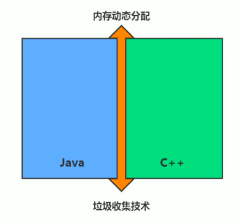

C语言需要自己来分配内存和回收内存，Java全部交给JVM进行分配和回收。

## 推荐书籍

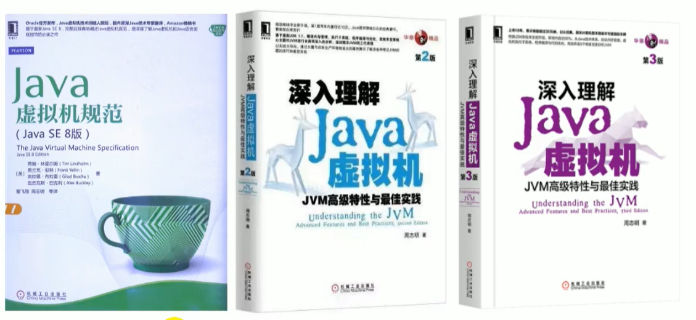

## Java生态圈

Java是目前应用最为广泛的软件开发平台之一。随着Java以及Java社区的不断壮大Java 也早已不再是简简单单的一门计算机语言了，它更是一个平台、一种文化、一个社区。

- 作为一个平台，Java虚拟机扮演着举足轻重的作用
  - Groovy、Scala、JRuby、Kotlin等都是Java平台的一部分

- 作为灯种文化，Java几乎成为了“开源”的代名词。
  - 第三方开源软件和框架。如Tomcat、Struts，MyBatis，Spring等。
  - 就连JDK和JVM自身也有不少开源的实现，如openJDK、Harmony。
- 作为一个社区，Java拥有全世界最多的技术拥护者和开源社区支持，有数不清的论坛和资料。从桌面应用软件、嵌入式开发到企业级应用、后台服务器、中间件，都可以看到Java的身影。其应用形式之复杂、参与人数之众多也令人咋舌。

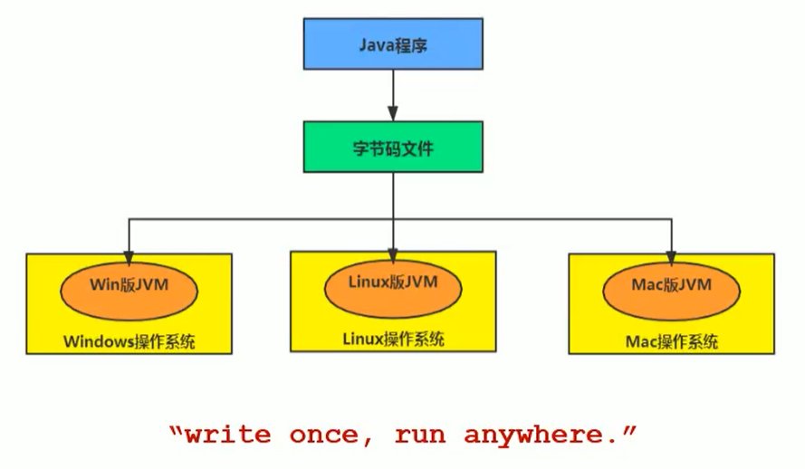

每个语言都需要转换成字节码文件，最后转换的字节码文件都能通过Java虚拟机进行运行和处理


随着Java7的正式发布，Java虚拟机的设计者们通过JSR-292规范基本实现在Java虚拟机平台上运行非Java语言编写的程序。

Java虚拟机根本不关心运行在其内部的程序到底是使用何种编程语言编写的，它只关心“字节码”文件。也就是说Java虚拟机拥有语言无关性，并不会单纯地与Java语言“终身绑定”，只要其他编程语言的编译结果满足并包含Java虚拟机的内部指令集、符号表以及其他的辅助信息，它就是一个有效的字节码文件，就能够被虚拟机所识别并装载运行。

## 字节码

我们平时说的java字节码，指的是用java语言编译成的字节码。准确的说任何能在jvm平台上执行的字节码格式都是一样的。所以应该统称为：jvm字节码。

不同的编译器，可以编译出相同的字节码文件，字节码文件也可以在不同的JVM上运行。

Java虚拟机与Java语言并没有必然的联系，它只与特定的二进制文件格式—Class文件格式所关联，Class文件中包含了Java虚拟机指令集（或者称为字节码、Bytecodes）和符号表，还有一些其他辅助信息。

## 多语言混合编程

Java平台上的多语言混合编程正成为主流，通过特定领域的语言去解决特定领域的问题是当前软件开发应对日趋复杂的项目需求的一个方向。

试想一下，在一个项目之中，并行处理用clojure语言编写，展示层使用JRuby/Rails，中间层则是Java，每个应用层都将使用不同的编程语言来完成，而且，接口对每一层的开发者都是透明的，各种语言之间的交互不存在任何困难，就像使用自己语言的原生API一样方便，因为它们最终都运行在一个虚拟机之上。

对这些运行于Java虚拟机之上、Java之外的语言，来自系统级的、底层的支持正在迅速增强，以JSR-292为核心的一系列项目和功能改进（如Da Vinci Machine项目、Nashorn引擎、InvokeDynamic指令、java.lang.invoke包等），推动Java虚拟机从“Java语言的虚拟机”向 “多语言虚拟机”的方向发展。

## Java发展的重大事件

- 1990年，在Sun计算机公司中，由Patrick Naughton、MikeSheridan及James Gosling领导的小组Green Team，开发出的新的程序语言，命名为oak，后期命名为Java
- 1995年，Sun正式发布Java和HotJava产品，Java首次公开亮相。
- 1996年1月23日sun Microsystems发布了JDK 1.0。
- 1998年，JDK1.2版本发布。同时，sun发布了JSP/Servlet、EJB规范，以及将Java分成了J2EE、J2SE和J2ME。这表明了Java开始向企业、桌面应用和移动设备应用3大领域挺进。
- 2000年，JDK1.3发布，Java HotSpot Virtual Machine正式发布，成为Java的默认虚拟机。
- 2002年，JDK1.4发布，古老的Classic虚拟机退出历史舞台。
- 2003年年底，Java平台的scala正式发布，同年Groovy也加入了Java阵营。
- 2004年，JDK1.5发布。同时JDK1.5改名为JavaSE5.0。
- 2006年，JDK6发布。同年，Java开源并建立了openJDK。顺理成章，Hotspot虚拟机也成为了openJDK中的默认虚拟机。

- 2007年，Java平台迎来了新伙伴Clojure。
- 2008年，oracle收购了BEA，得到了JRockit虚拟机。
- 2009年，Twitter宣布把后台大部分程序从Ruby迁移到scala，这是Java平台的又一次大规模应用。
- 2010年，oracle收购了sun，获得Java商标和最真价值的HotSpot虚拟机。此时，oracle拥有市场占用率最高的两款虚拟机HotSpot和JRockit，并计划在未来对它们进行整合：HotRockit
- 2011年，JDK7发布。在JDK1.7u4中，正式启用了新的垃圾回收器G1。
- 2017年，JDK9发布。将G1设置为默认Gc，替代CMS
- 同年，IBM的J9开源，形成了现在的open J9社区
- 2018年，Android的Java侵权案判决，Google赔偿oracle计88亿美元
- 同年，oracle宣告JavagE成为历史名词JDBC、JMS、Servlet赠予Eclipse基金会
- 同年，JDK11发布，LTS版本的JDK，发布革命性的zGc，调整JDK授权许可
- 2019年，JDK12发布，加入RedHat领导开发的shenandoah GC


在JDK11之前，oracleJDK中还会存在一些openJDK中没有的、闭源的功能。但在JDK11中，我们可以认为openJDK和oracleJDK代码实质上已经完全一致的程度。

## 虚拟机与Java虚拟机

### 虚拟机

所谓虚拟机（Virtual Machine），就是一台虚拟的计算机。它是一款软件，用来执行一系列虚拟计算机指令。大体上，虚拟机可以分为**系统虚拟机和程序虚拟机**。

- 大名鼎鼎的Visual Box，VMware就属于系统虚拟机，它们完全是对物理计算机的仿真，提供了一个可运行完整操作系统的软件平台。
- 程序虚拟机的典型代表就是Java虚拟机，它专门为执行单个计算机程序而设计，在Java虚拟机中执行的指令我们称为**Java字节码指令**。

无论是系统虚拟机还是程序虚拟机，在上面运行的软件都被限制于虚拟机提供的资源中。

### Java虚拟机

Java虚拟机是一台执行Java字节码的虚拟计算机，它拥有独立的运行机制，其运行的Java字节码也未必由Java语言编译而成。

JVM平台的各种语言可以共享Java虚拟机带来的跨平台性、优秀的垃圾回器，以及可靠的即时编译器。

Java技术的核心就是Java虚拟机（JVM，Java Virtual Machine），因为所有的Java程序都运行在Java虚拟机内部。

Java虚拟机就是二进制字节码的运行环境，负责装载字节码到其内部，解释/编译为对应平台上的机器指令执行。每一条Java指令，Java虚拟机规范中都有详细定义，如怎么取操作数，怎么处理操作数，处理结果放在哪里。

特点：

- 一次编译，到处运行
- 自动内存管理
- 自动垃圾回收功能

## JVM的位置

JVM是运行在操作系统之上的，它与硬件没有直接的交互


Java的体系结构


## JVM整体结构

- HotSpot VM是目前市面上高性能虚拟机的代表作之一。
- 它采用解释器与即时编译器并存的架构。
- 在今天，Java程序的运行性能早已脱胎换骨，已经达到了可以和C/C++程序一较高下的地步。


### 执行引擎包含三部分：解释器，及时编译器，垃圾回收器

## Java代码执行流程


只是能生成被Java虚拟机所能解释的字节码文件，那么理论上就可以自己设计一套代码了

## JVM的架构模型

Java编译器输入的指令流基本上是一种基于**栈**的指令集架构，另外一种指令集架构则是基于寄存器的指令集架构。具体来说：这两种架构之间的区别：

基于栈式架构的特点

- 设计和实现更简单，**适用于资源受限的系统**；
- 避开了寄存器的分配难题：使用零地址指令方式分配。
- 指令流中的指令大部分是零地址指令，其执行过程依赖于操作栈。指令集更小，编译器容易实现。
- 不需要硬件支持，可移植性更好，更好实现跨平台

基于寄存器架构的特点

- 典型的应用是x86的二进制指令集：比如传统的PC以及Android的Davlik虚拟机。
- 指令集架构则完全依赖硬件，可移植性差
- 性能优秀和执行更高效
- 花费更少的指令去完成一项操作。
- 在大部分情况下，基于寄存器架构的指令集往往都以一地址指令、二地址指令和三地址指令为主，而基于栈式架构的指令集却是以零地址指令为主方水洋

### 举例

同样执行2+3这种逻辑操作，其指令分别如下：

基于栈的计算流程（以Java虚拟机为例）：

```bash
iconst_2 //常量2入栈
istore_1
iconst_3 // 常量3入栈
istore_2
iload_1
iload_2
iadd //常量2/3出栈，执行相加
istore_0 // 结果5入栈
```

而基于寄存器的计算流程

```bash
mov eax,2 //将eax寄存器的值设为1
add eax,3 //使eax寄存器的值加3
```

### 字节码反编译

我们编写一个简单的代码，然后查看一下字节码的反编译后的结果

```java
/**
 * @author: 陌溪
 * @create: 2020-07-04-21:17
 */
public class StackStruTest {
    public static void main(String[] args) {
        int i = 2 + 3;
    }
}
```

然后我们找到编译后的 class文件，使用下列命令进行反编译

```bash
javap -v StackStruTest.class
```

得到的文件为:

```bash
  public static void main(java.lang.String[]);
    descriptor: ([Ljava/lang/String;)V
    flags: ACC_PUBLIC, ACC_STATIC
    Code:
      stack=2, locals=4, args_size=1
         0: iconst_2
         1: istore_1
         2: iconst_3
         3: istore_2
         4: iload_1
         5: iload_2
         6: iadd
         7: istore_3
         8: return
      LineNumberTable:
        line 9: 0
        line 10: 2
        line 11: 4
        line 12: 8
      LocalVariableTable:
        Start  Length  Slot  Name   Signature
            0       9     0  args   [Ljava/lang/String;
            2       7     1     i   I
            4       5     2     j   I
            8       1     3     k   I
```

## 总结

由于跨平台性的设计，Java的指令都是根据栈来设计的。不同平台CPU架构不同，所以不能设计为基于寄存器的。优点是跨平台，指令集小，编译器容易实现，缺点是性能下降，实现同样的功能需要更多的指令。

时至今日，尽管嵌入式平台已经不是Java程序的主流运行平台了（准确来说应该是HotSpotVM的宿主环境已经不局限于嵌入式平台了），那么为什么不将架构更换为基于寄存器的架构呢？

### 栈

- 跨平台性
- 指令集小
- 指令多
- 执行性能比寄存器差

## JVM生命周期

### 虚拟机的启动

Java虚拟机的启动是通过引导类加载器（bootstrap class loader）创建一个初始类（initial class）来完成的，这个类是由虚拟机的具体实现指定的。

### 虚拟机的执行

- 一个运行中的Java虚拟机有着一个清晰的任务：执行Java程序。
- 程序开始执行时他才运行，程序结束时他就停止。
- 执行一个所谓的Java程序的时候，真真正正在执行的是一个叫做Java虚拟机的进程。

### 虚拟机的退出

有如下的几种情况：

- 程序正常执行结束

- 程序在执行过程中遇到了异常或错误而异常终止
- 由于操作系统用现错误而导致Java虚拟机进程终止
- 某线程调用Runtime类或system类的exit方法，或Runtime类的halt方法，并且Java安全管理器也允许这次exit或halt操作。
- 除此之外，JNI（Java Native Interface）规范描述了用JNI Invocation API来加载或卸载 Java虚拟机时，Java虚拟机的退出情况。

## JVM发展历程

### Sun Classic VM

- 早在1996年Java1.0版本的时候，Sun公司发布了一款名为sun classic VM的Java虚拟机，它同时也是世界上第一款商用Java虚拟机，JDK1.4时完全被淘汰。
- 这款虚拟机内部只提供解释器。现在还有及时编译器，因此效率比较低，而及时编译器会把热点代码缓存起来，那么以后使用热点代码的时候，效率就比较高。
- 如果使用JIT编译器，就需要进行外挂。但是一旦使用了JIT编译器，JIT就会接管虚拟机的执行系统。解释器就不再工作。解释器和编译器不能配合工作。
- 现在hotspot内置了此虚拟机。

### Exact VM

为了解决上一个虚拟机问题，jdk1.2时，sun提供了此虚拟机。
Exact Memory Management：准确式内存管理

- 也可以叫Non-Conservative/Accurate Memory Management
- 虚拟机可以知道内存中某个位置的数据具体是什么类型。|

具备现代高性能虚拟机的维形

- 热点探测（寻找出热点代码进行缓存）
- 编译器与解释器混合工作模式

只在solaris平台短暂使用，其他平台上还是classic vm，英雄气短，终被Hotspot虚拟机替换

### HotSpot VM

HotSpot历史

- 最初由一家名为“Longview Technologies”的小公司设计
- 1997年，此公司被sun收购；2009年，Sun公司被甲骨文收购。
- JDK1.3时，HotSpot VM成为默认虚拟机

目前Hotspot占有绝对的市场地位，称霸武林。

- 不管是现在仍在广泛使用的JDK6，还是使用比例较多的JDK8中，默认的虚拟机都是HotSpot
- Sun/oracle JDK和openJDK的默认虚拟机
- 因此本课程中默认介绍的虚拟机都是HotSpot，相关机制也主要是指HotSpot的Gc机制。（比如其他两个商用虚机都没有方法区的概念）

从服务器、桌面到移动端、嵌入式都有应用。

名称中的HotSpot指的就是它的热点代码探测技术。

- 通过计数器找到最具编译价值代码，触发即时编译或栈上替换
- 通过编译器与解释器协同工作，在最优化的程序响应时间与最佳执行性能中取得平衡

### JRockit

专注于服务器端应用

- 它可以不太关注程序启动速度，因此JRockit内部不包含解析器实现，全部代码都靠即时编译器编译后执行。

大量的行业基准测试显示，JRockit JVM是世界上最快的JVM。

- 使用JRockit产品，客户已经体验到了显著的性能提高（一些超过了70%）和硬件成本的减少（达50%）。

优势：全面的Java运行时解决方案组合

- JRockit面向延迟敏感型应用的解决方案JRockit Real Time提供以毫秒或微秒级的JVM响应时间，适合财务、军事指挥、电信网络的需要
- MissionControl服务套件，它是一组以极低的开销来监控、管理和分析生产环境中的应用程序的工具。

2008年，JRockit被oracle收购。

oracle表达了整合两大优秀虚拟机的工作，大致在JDK8中完成。整合的方式是在HotSpot的基础上，移植JRockit的优秀特性。

高斯林：目前就职于谷歌，研究人工智能和水下机器人

### IBM的J9

全称：IBM Technology for Java Virtual Machine，简称IT4J，内部代号：J9

市场定位与HotSpot接近，服务器端、桌面应用、嵌入式等多用途VM广泛用于IBM的各种Java产品。

目前，有影响力的三大商用虚拟机之一，也号称是世界上最快的Java虚拟机。

2017年左右，IBM发布了开源J9VM，命名为openJ9，交给EClipse基金会管理，也称为Eclipse OpenJ9

OpenJDK   -> 是JDK开源了，包括了虚拟机

### KVM和CDC / CLDC  Hotspot

oracle在Java ME产品线上的两款虚拟机为：CDC/CLDC HotSpot Implementation VM KVM（Kilobyte）是CLDC-HI早期产品目前移动领域地位尴尬，智能机被Angroid和ioS二分天下。

KVM简单、轻量、高度可移植，面向更低端的设备上还维持自己的一片市场

- 智能控制器、传感器
- 老人手机、经济欠发达地区的功能手机

所有的虚拟机的原则：一次编译，到处运行。

### Azul VM

前面三大“高性能Java虚拟机”使用在通用硬件平台上这里Azu1VW和BEALiquid VM是与特定硬件平台绑定、软硬件配合的专有虚拟机I

- 高性能Java虚拟机中的战斗机。

Azul VM是Azu1Systems公司在HotSpot基础上进行大量改进，运行于Azul Systems公司的专有硬件Vega系统上的ava虚拟机。

每个Azu1VM实例都可以管理至少数十个CPU和数百GB内存的硬件资源，并提供在巨大内存范围内实现可控的GC时间的垃圾收集器、专有硬件优化的线程调度等优秀特性。

2010年，AzulSystems公司开始从硬件转向软件，发布了自己的zing JVM，可以在通用x86平台上提供接近于Vega系统的特性。

### Liquid VM

高性能Java虚拟机中的战斗机。

BEA公司开发的，直接运行在自家Hypervisor系统上Liquid VM即是现在的JRockit VE（Virtual Edition），

Liquid VM不需要操作系统的支持，或者说它自己本身实现了一个专用操作系统的必要功能，如线程调度、文件系统、网络支持等。

随着JRockit虚拟机终止开发，Liquid vM项目也停止了。

### Apache Marmony

Apache也曾经推出过与JDK1.5和JDK1.6兼容的Java运行平台Apache Harmony。

它是IElf和Inte1联合开发的开源JVM，受到同样开源的openJDK的压制，Sun坚决不让Harmony获得JCP认证，最终于2011年退役，IBM转而参与OpenJDK

虽然目前并没有Apache Harmony被大规模商用的案例，但是它的Java类库代码吸纳进了Android SDK。

### Micorsoft JVM

微软为了在IE3浏览器中支持Java Applets，开发了Microsoft JVM。

只能在window平台下运行。但确是当时Windows下性能最好的Java VM。

1997年，sun以侵犯商标、不正当竞争罪名指控微软成功，赔了sun很多钱。微软windowsXPSP3中抹掉了其VM。现在windows上安装的jdk都是HotSpot。

### Taobao JVM

由AliJVM团队发布。阿里，国内使用Java最强大的公司，覆盖云计算、金融、物流、电商等众多领域，需要解决高并发、高可用、分布式的复合问题。有大量的开源产品。

基于openJDK开发了自己的定制版本AlibabaJDK，简称AJDK。是整个阿里Java体系的基石。

基于openJDK Hotspot VM发布的国内第一个优化、深度定制且开源的高性能服务器版Java虚拟机。

- 创新的GCIH（GCinvisible heap）技术实现了off-heap，即将生命周期较长的Java对象从heap中移到heap之外，并且Gc不能管理GCIH内部的Java对象，以此达到降低GC的回收频率和提升Gc的回收效率的目的。
- GCIH中的对象还能够在多个Java虚拟机进程中实现共享
- 使用crc32指令实现JvM intrinsic降低JNI的调用开销
- PMU hardware的Java profiling tool和诊断协助功能
- 针对大数据场景的ZenGc 

taobao vm应用在阿里产品上性能高，硬件严重依赖inte1的cpu，损失了兼容性，但提高了性能

目前已经在淘宝、天猫上线，把oracle官方JvM版本全部替换了。

### Dalvik VM

谷歌开发的，应用于Android系统，并在Android2.2中提供了JIT，发展迅猛。

Dalvik y只能称作虚拟机，而不能称作“Java虚拟机”，它没有遵循 Java虚拟机规范

不能直接执行Java的Class文件

基于寄存器架构，不是jvm的栈架构。

执行的是编译以后的dex（Dalvik Executable）文件。执行效率比较高。

- 它执行的dex（Dalvik Executable）文件可以通过class文件转化而来，使用Java语法编写应用程序，可以直接使用大部分的Java API等。

Android 5.0使用支持提前编译（Ahead of Time Compilation，AoT）的ART VM替换Dalvik VM。

### Graal VM

2018年4月，oracle Labs公开了GraalvM，号称 "Run Programs Faster Anywhere"，勃勃野心。与1995年java的”write once，run anywhere"遥相呼应。

GraalVM在HotSpot VM基础上增强而成的跨语言全栈虚拟机，可以作为“任何语言”
的运行平台使用。语言包括：Java、Scala、Groovy、Kotlin；C、C++、Javascript、Ruby、Python、R等

支持不同语言中混用对方的接口和对象，支持这些语言使用已经编写好的本地库文件

工作原理是将这些语言的源代码或源代码编译后的中间格式，通过解释器转换为能被Graal VM接受的中间表示。Graal VM提供Truffle工具集快速构建面向一种新语言的解释器。在运行时还能进行即时编译优化，获得比原生编译器更优秀的执行效率。

如果说HotSpot有一天真的被取代，Graalvm希望最大。但是Java的软件生态没有丝毫变化。

### 总结

具体JVM的内存结构，其实取决于其实现，不同厂商的JVM，或者同一厂商发布的不同版本，都有可能存在一定差异。主要以oracle HotSpot VM为默认虚拟机。


#  2.类加载子系统


## 概述

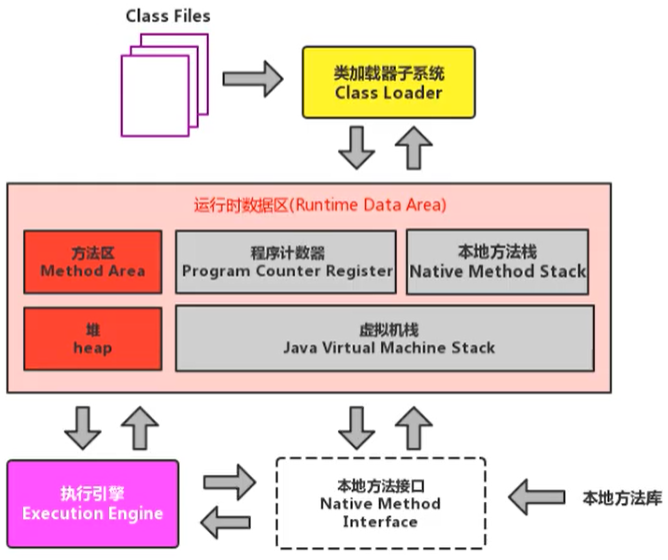

完整图如下


如果自己想手写一个Java虚拟机的话，主要考虑哪些结构呢？

- 类加载器
- 执行引擎

## 类加载器子系统作用

类加载器子系统负责从文件系统或者网络中加载Class文件，class文件在文件开头有特定的文件标识。

ClassLoader只负责class文件的加载，至于它是否可以运行，则由Execution Engine决定。

加载的类信息存放于一块称为方法区的内存空间。除了类的信息外，方法区中还会存放运行时常量池信息，可能还包括字符串字面量和数字常量（这部分常量信息是Class文件中常量池部分的内存映射）


- class file存在于本地硬盘上，可以理解为设计师画在纸上的模板，而最终这个模板在执行的时候是要加载到JVM当中来根据这个文件实例化出n个一模一样的实例。
- class file加载到JVM中，被称为DNA元数据模板，放在方法区。
- 在.class文件->JVM->最终成为元数据模板，此过程就要一个运输工具（类装载器Class Loader），扮演一个快递员的角色。


## 类的加载过程

例如下面的一段简单的代码

```java
/**
 * 类加载子系统
 * @author: 陌溪
 * @create: 2020-07-05-8:24
 */
public class HelloLoader {
    public static void main(String[] args) {
        System.out.println("我已经被加载啦");
    }
}
```

它的加载过程是怎么样的呢?


完整的流程图如下所示


## 加载阶段

通过一个类的全限定名获取定义此类的二进制字节流

将这个字节流所代表的静态存储结构转化为方法区的运行时数据结构

在内存中生成一个代表这个类的java.lang.Class对象，作为方法区这个类的各种数据的访问入口

### 加载class文件的方式

- 从本地系统中直接加载
- 通过网络获取，典型场景：Web Applet
- 从zip压缩包中读取，成为日后jar、war格式的基础
- 运行时计算生成，使用最多的是：动态代理技术
- 由其他文件生成，典型场景：JSP应用从专有数据库中提取.class文件，比较少见
- 从加密文件中获取，典型的防Class文件被反编译的保护措施

### 链接阶段

#### 验证 Verify

目的在于确保Class文件的字节流中包含信息符合当前虚拟机要求，保证被加载类的正确性，不会危害虚拟机自身安全。

主要包括四种验证，文件格式验证，元数据验证，字节码验证，符号引用验证。

> 工具：Binary Viewer查看


如果出现不合法的字节码文件，那么将会验证不通过

同时我们可以通过安装IDEA的插件，来查看我们的Class文件

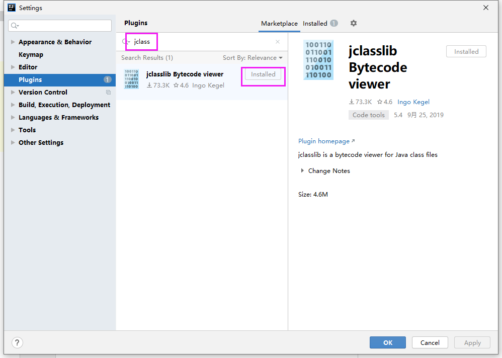

安装完成后，我们编译完一个class文件后，点击view即可显示我们安装的插件来查看字节码方法了

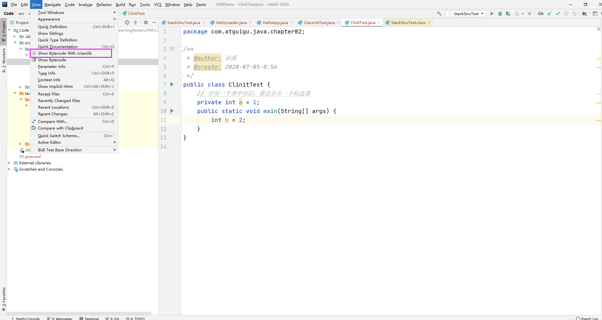

### 准备 Prepare

为类变量分配内存并且设置该类变量的默认初始值，即零值。

```java
/**
 * @author: 陌溪
 * @create: 2020-07-05-8:42
 */
public class HelloApp {
    private static int a = 1;  // 准备阶段为0，在下个阶段，也就是初始化的时候才是1
    public static void main(String[] args) {
        System.out.println(a);
    }
}
```

上面的变量a在准备阶段会赋初始值，但不是1，而是0。

这里不包含用final修饰的static，因为final在编译的时候就会分配了，准备阶段会显式初始化；

这里不会为实例变量分配初始化，类变量会分配在方法区中，而实例变量是会随着对象一起分配到Java堆中。

例如下面这段代码

### 解析 Resolve

将常量池内的符号引用转换为直接引用的过程。

事实上，解析操作往往会伴随着JVM在执行完初始化之后再执行。

符号引用就是一组符号来描述所引用的目标。符号引用的字面量形式明确定义在《java虚拟机规范》的class文件格式中。直接引用就是直接指向目标的指针、相对偏移量或一个间接定位到目标的句柄。

解析动作主要针对类或接口、字段、类方法、接口方法、方法类型等。对应常量池中的CONSTANT Class info、CONSTANT Fieldref info、CONSTANT Methodref info等

### 初始化阶段

初始化阶段就是执行类构造器法`<clinit>（）`的过程。

此方法不需定义，是javac编译器自动收集类中的所有类变量的赋值动作和静态代码块中的语句合并而来。

- 也就是说，当我们代码中包含static变量的时候，就会有clinit方法

构造器方法中指令按语句在源文件中出现的顺序执行。

`<clinit>（）`不同于类的构造器。（关联：构造器是虚拟机视角下的`<init>（）`）若该类具有父类，JVM会保证子类的`<clinit>（）`执行前，父类的`<clinit>（）`已经执行完毕。

- 任何一个类在声明后，都有生成一个构造器，默认是空参构造器

```java
/**
 * @author: 陌溪
 * @create: 2020-07-05-8:47
 */
public class ClassInitTest {
    private static int num = 1;
    static {
        num = 2;
        number = 20;
        System.out.println(num);
        System.out.println(number);  //报错，非法的前向引用
    }

    private static int number = 10;

    public static void main(String[] args) {
        System.out.println(ClassInitTest.num); // 2
        System.out.println(ClassInitTest.number); // 10
    }
}
```

关于涉及到父类时候的变量赋值过程

```java
/**
 * @author: 陌溪
 * @create: 2020-07-05-9:06
 */
public class ClinitTest1 {
    static class Father {
        public static int A = 1;
        static {
            A = 2;
        }
    }

    static class Son extends Father {
        public static int b = A;
    }

    public static void main(String[] args) {
        System.out.println(Son.b);
    }
}
```

我们输出结果为 2，也就是说首先加载ClinitTest1的时候，会找到main方法，然后执行Son的初始化，但是Son继承了Father，因此还需要执行Father的初始化，同时将A赋值为2。我们通过反编译得到Father的加载过程，首先我们看到原来的值被赋值成1，然后又被复制成2，最后返回

```bash
iconst_1
putstatic #2 <com/atguigu/java/chapter02/ClinitTest1$Father.A>
iconst_2
putstatic #2 <com/atguigu/java/chapter02/ClinitTest1$Father.A>
return
```

虚拟机必须保证一个类的<clinit>（）方法在多线程下被同步加锁。

```java
/**
 * @author: 陌溪
 * @create: 2020-07-05-9:14
 */
public class DeadThreadTest {
    public static void main(String[] args) {
        new Thread(() -> {
            System.out.println(Thread.currentThread().getName() + "\t 线程t1开始");
            new DeadThread();
        }, "t1").start();

        new Thread(() -> {
            System.out.println(Thread.currentThread().getName() + "\t 线程t2开始");
            new DeadThread();
        }, "t2").start();
    }
}
class DeadThread {
    static {
        if (true) {
            System.out.println(Thread.currentThread().getName() + "\t 初始化当前类");
            while(true) {

            }
        }
    }
}
```

上面的代码，输出结果为

```
线程t1开始
线程t2开始
线程t2 初始化当前类
```

从上面可以看出初始化后，只能够执行一次初始化，这也就是同步加锁的过程

## 类加载器的分类

JVM支持两种类型的类加载器 。分别为引导类加载器（Bootstrap ClassLoader）和自定义类加载器（User-Defined ClassLoader）。

从概念上来讲，自定义类加载器一般指的是程序中由开发人员自定义的一类类加载器，但是Java虚拟机规范却没有这么定义，而是将所有派生于抽象类ClassLoader的类加载器都划分为自定义类加载器。

无论类加载器的类型如何划分，在程序中我们最常见的类加载器始终只有3个，如下所示：


这里的四者之间是包含关系，不是上层和下层，也不是子系统的继承关系。

我们通过一个类，获取它不同的加载器

```java
/**
 * @author: 陌溪
 * @create: 2020-07-05-9:47
 */
public class ClassLoaderTest {
    public static void main(String[] args) {
        // 获取系统类加载器
        ClassLoader systemClassLoader = ClassLoader.getSystemClassLoader();
        System.out.println(systemClassLoader);

        // 获取其上层的：扩展类加载器
        ClassLoader extClassLoader = systemClassLoader.getParent();
        System.out.println(extClassLoader);

        // 试图获取 根加载器
        ClassLoader bootstrapClassLoader = extClassLoader.getParent();
        System.out.println(bootstrapClassLoader);

        // 获取自定义加载器
        ClassLoader classLoader = ClassLoaderTest.class.getClassLoader();
        System.out.println(classLoader);
        
        // 获取String类型的加载器
        ClassLoader classLoader1 = String.class.getClassLoader();
        System.out.println(classLoader1);
    }
}
```

得到的结果，从结果可以看出 根加载器无法直接通过代码获取，同时目前用户代码所使用的加载器为系统类加载器。同时我们通过获取String类型的加载器，发现是null，那么说明String类型是通过根加载器进行加载的，也就是说Java的核心类库都是使用根加载器进行加载的。

```java
sun.misc.Launcher$AppClassLoader@18b4aac2
sun.misc.Launcher$ExtClassLoader@1540e19d
null
sun.misc.Launcher$AppClassLoader@18b4aac2
null 
```

### 虚拟机自带的加载器

#### 启动类加载器（引导类加载器，Bootstrap ClassLoader）

- 这个类加载使用C/C++语言实现的，嵌套在JVM内部。
- 它用来加载Java的核心库（JAVAHOME/jre/1ib/rt.jar、resources.jar或sun.boot.class.path路径下的内容），用于提供JVM自身需要的类
- 并不继承自ava.lang.ClassLoader，没有父加载器。
- 加载扩展类和应用程序类加载器，并指定为他们的父类加载器。
- 出于安全考虑，Bootstrap启动类加载器只加载包名为java、javax、sun等开头的类

### 扩展类加载器（Extension ClassLoader）

- Java语言编写，由sun.misc.Launcher$ExtClassLoader实现。
- 派生于ClassLoader类
- 父类加载器为启动类加载器
- 从java.ext.dirs系统属性所指定的目录中加载类库，或从JDK的安装目录的jre/1ib/ext子目录（扩展目录）下加载类库。如果用户创建的JAR放在此目录下，也会自动由扩展类加载器加载。

### 应用程序类加载器（系统类加载器，AppClassLoader）

- javI语言编写，由sun.misc.LaunchersAppClassLoader实现
- 派生于ClassLoader类
- 父类加载器为扩展类加载器
- 它负责加载环境变量classpath或系统属性java.class.path指定路径下的类库
- 该类加载是程序中默认的类加载器，一般来说，Java应用的类都是由它来完成加载
- 通过classLoader#getSystemclassLoader（）方法可以获取到该类加载器

### 用户自定义类加载器

在Java的日常应用程序开发中，类的加载几乎是由上述3种类加载器相互配合执行的，在必要时，我们还可以自定义类加载器，来定制类的加载方式。
为什么要自定义类加载器？

- 隔离加载类
- 修改类加载的方式
- 扩展加载源
- 防止源码泄漏

用户自定义类加载器实现步骤：

- 开发人员可以通过继承抽象类ava.1ang.ClassLoader类的方式，实现自己的类加载器，以满足一些特殊的需求
- 在JDK1.2之前，在自定义类加载器时，总会去继承ClassLoader类并重写1oadClass（）方法，从而实现自定义的类加载类，但是在JDK1.2之后已不再建议用户去覆盖1oadclass（）方法，而是建议把自定义的类加载逻辑写在findclass（）方法中
- 在编写自定义类加载器时，如果没有太过于复杂的需求，可以直接继承URIClassLoader类，这样就可以避免自己去编写findclass（）方法及其获取字节码流的方式，使自定义类加载器编写更加简洁。

### 查看根加载器所能加载的目录

刚刚我们通过概念了解到了，根加载器只能够加载 java /lib目录下的class，我们通过下面代码验证一下

```java
/**
 * @author: 陌溪
 * @create: 2020-07-05-10:17
 */
public class ClassLoaderTest1 {
    public static void main(String[] args) {
        System.out.println("*********启动类加载器************");
        // 获取BootstrapClassLoader 能够加载的API的路径
        URL[] urls = sun.misc.Launcher.getBootstrapClassPath().getURLs();
        for (URL url : urls) {
            System.out.println(url.toExternalForm());
        }

        // 从上面路径中，随意选择一个类，来看看他的类加载器是什么：得到的是null，说明是  根加载器
        ClassLoader classLoader = Provider.class.getClassLoader();
    }
}
```

得到的结果

```
*********启动类加载器************
file:/E:/Software/JDK1.8/Java/jre/lib/resources.jar
file:/E:/Software/JDK1.8/Java/jre/lib/rt.jar
file:/E:/Software/JDK1.8/Java/jre/lib/sunrsasign.jar
file:/E:/Software/JDK1.8/Java/jre/lib/jsse.jar
file:/E:/Software/JDK1.8/Java/jre/lib/jce.jar
file:/E:/Software/JDK1.8/Java/jre/lib/charsets.jar
file:/E:/Software/JDK1.8/Java/jre/lib/jfr.jar
file:/E:/Software/JDK1.8/Java/jre/classes
null
```

### 关于ClassLoader

ClassLoader类，它是一个抽象类，其后所有的类加载器都继承自ClassLoader（不包括启动类加载器）


sun.misc.Launcher 它是一个java虚拟机的入口应用


获取ClassLoader的途径

- 获取当前ClassLoader：clazz.getClassLoader()
- 获取当前线程上下文的ClassLoader：Thread.currentThread().getContextClassLoader()
- 获取系统的ClassLoader：ClassLoader.getSystemClassLoader()
- 获取调用者的ClassLoader：DriverManager.getCallerClassLoader()

## 双亲委派机制

Java虚拟机对class文件采用的是按需加载的方式，也就是说当需要使用该类时才会将它的class文件加载到内存生成class对象。而且加载某个类的class文件时，Java虚拟机采用的是双亲委派模式，即把请求交由父类处理，它是一种任务委派模式。

### 工作原理

- 如果一个类加载器收到了类加载请求，它并不会自己先去加载，而是把这个请求委托给父类的加载器去执行；
- 如果父类加载器还存在其父类加载器，则进一步向上委托，依次递归，请求最终将到达顶层的启动类加载器；
- 如果父类加载器可以完成类加载任务，就成功返回，倘若父类加载器无法完成此加载任务，子加载器才会尝试自己去加载，这就是双亲委派模式。


### 双亲委派机制举例

当我们加载jdbc.jar 用于实现数据库连接的时候，首先我们需要知道的是 jdbc.jar是基于SPI接口进行实现的，所以在加载的时候，会进行双亲委派，最终从根加载器中加载 SPI核心类，然后在加载SPI接口类，接着在进行反向委派，通过线程上下文类加载器进行实现类 jdbc.jar的加载。


### 沙箱安全机制

自定义string类，但是在加载自定义String类的时候会**率先使用引导类加载器加载**，而引导类加载器在加载的过程中会先加载jdk自带的文件（rt.jar包中java\lang\String.class），报错信息说没有main方法，就是因为加载的是rt.jar包中的string类。这样可以保证对java核心源代码的保护，这就是沙箱安全机制。

### 双亲委派机制的优势

通过上面的例子，我们可以知道，双亲机制可以

- 避免类的重复加载
- 保护程序安全，防止核心API被随意篡改
  - 自定义类：java.lang.String
  - 自定义类：java.lang.ShkStart（报错：阻止创建 java.lang开头的类）

## 其它

###  如何判断两个class对象是否相同

在JVM中表示两个class对象是否为同一个类存在两个必要条件：

- 类的完整类名必须一致，包括包名。
- 加载这个类的ClassLoader（指ClassLoader实例对象）必须相同。

换句话说，在JvM中，即使这两个类对象（class对象）来源同一个Class文件，被同一个虚拟机所加载，但只要加载它们的ClassLoader实例对象不同，那么这两个类对象也是不相等的。

JVM必须知道一个类型是由启动加载器加载的还是由用户类加载器加载的。如果一个类型是由用户类加载器加载的，那么JVM会将这个类加载器的一个引用作为类型信息的一部分保存在方法区中。当解析一个类型到另一个类型的引用的时候，JVM需要保证这两个类型的类加载器是相同的。

### 类的主动使用和被动使用

Java程序对类的使用方式分为：王动使用和被动使用。
主动使用，又分为七种情况：

- 创建类的实例
- 访问某个类或接口的静态变量，或者对该静态变量赋值
- 调用类的静态方法I
- 反射（比如：Class.forName（"com.atguigu.Test"））
- 初始化一个类的子类
- Java虚拟机启动时被标明为启动类的类
- JDK7开始提供的动态语言支持：
- java.lang.invoke.MethodHandle实例的解析结果REF getStatic、REF putStatic、REF invokeStatic句柄对应的类没有初始化，则初始化

除了以上七种情况，其他使用Java类的方式都被看作是对类的被动使用，都不会导致类的初始化。

#  3.运行时数据区概述及线程

## 前言

本节主要讲的是运行时数据区，也就是下图这部分，它是在类加载完成后的阶段


当我们通过前面的：类的加载-> 验证 -> 准备 -> 解析 -> 初始化 这几个阶段完成后，就会用到执行引擎对我们的类进行使用，同时执行引擎将会使用到我们运行时数据区


也就是大厨做饭，我们把大厨后面的东西（切好的菜，刀，调料），比作是运行时数据区。而厨师可以类比于执行引擎，将通过准备的东西进行制作成精美的菜品


内存是非常重要的系统资源，是硬盘和CPU的中间仓库及桥梁，承载着操作系统和应用程序的实时运行JVM内存布局规定了Java在运行过程中内存申请、分配、管理的策略，保证了JVM的高效稳定运行。不同的JVM对于内存的划分方式和管理机制存在着部分差异。结合JVM虚拟机规范，来探讨一下经典的JVM内存布局。

> 我们通过磁盘或者网络IO得到的数据，都需要先加载到内存中，然后CPU从内存中获取数据进行读取，也就是说内存充当了CPU和磁盘之间的桥梁

运行时数据区的完整图


Java虚拟机定义了若干种程序运行期间会使用到的运行时数据区，其中有一些会随着虚拟机启动而创建，随着虚拟机退出而销毁。另外一些则是与线程一一对应的，这些与线程对应的数据区域会随着线程开始和结束而创建和销毁。

灰色的为单独线程私有的，红色的为多个线程共享的。即：

- 每个线程：独立包括程序计数器、栈、本地栈。
- 线程间共享：堆、堆外内存（永久代或元空间、代码缓存）


## 线程

线程是一个程序里的运行单元。JVM允许一个应用有多个线程并行的执行。
在Hotspot JVM里，每个线程都与操作系统的本地线程直接映射。

- 当一个Java线程准备好执行以后，此时一个操作系统的本地线程也同时创建。Java线程执行终止后，本地线程也会回收。

操作系统负责所有线程的安排调度到任何一个可用的CPU上。一旦本地线程初始化成功，它就会调用Java线程中的run（）方法。

### JVM系统线程

如果你使用console或者是任何一个调试工具，都能看到在后台有许多线程在运行。这些后台线程不包括调用public static void main（String[]）的main线程以及所有这个main线程自己创建的线程。|
这些主要的后台系统线程在Hotspot JVM里主要是以下几个：

- 虚拟机线程：这种线程的操作是需要JVM达到安全点才会出现。这些操作必须在不同的线程中发生的原因是他们都需要JVM达到安全点，这样堆才不会变化。这种线程的执行类型包括"stop-the-world"的垃圾收集，线程栈收集，线程挂起以及偏向锁撤销。
- 周期任务线程：这种线程是时间周期事件的体现（比如中断），他们一般用于周期性操作的调度执行。
- GC线程：这种线程对在JVM里不同种类的垃圾收集行为提供了支持。
- 编译线程：这种线程在运行时会将字节码编译成到本地代码。
- 信号调度线程：这种线程接收信号并发送给JVM，在它内部通过调用适当的方法进行处理。


#  4.程序计数器

## 介绍

JVM中的程序计数寄存器（Program Counter Register）中，Register的命名源于CPU的寄存器，寄存器存储指令相关的现场信息。CPU只有把数据装载到寄存器才能够运行。这里，并非是广义上所指的物理寄存器，或许将其翻译为PC计数器（或指令计数器）会更加贴切（也称为程序钩子），并且也不容易引起一些不必要的误会。JVM中的PC寄存器是对物理PC寄存器的一种抽象模拟。


它是一块很小的内存空间，几乎可以忽略不记。也是运行速度最快的存储区域。

在JVM规范中，每个线程都有它自己的程序计数器，是线程私有的，生命周期与线程的生命周期保持一致。

任何时间一个线程都只有一个方法在执行，也就是所谓的当前方法。程序计数器会存储当前线程正在执行的Java方法的JVM指令地址；或者，如果是在执行native方法，则是未指定值（undefned）。

它是程序控制流的指示器，分支、循环、跳转、异常处理、线程恢复等基础功能都需要依赖这个计数器来完成。字节码解释器工作时就是通过改变这个计数器的值来选取下一条需要执行的字节码指令。

它是唯一一个在Java虚拟机规范中没有规定任何outotMemoryError情况的区域。

## 作用

PC寄存器用来存储指向下一条指令的地址，也即将要执行的指令代码。由执行引擎读取下一条指令。


## 代码演示

我们首先写一个简单的代码

```java
/**程序计数器
 * @author: 陌溪
 * @create: 2020-07-05-16:01
 */
public class PCRegisterTest {
    public static void main(String[] args) {
        int i = 10;
        int j = 20;
        int k = i + j;
    }
}
```

然后将代码进行编译成字节码文件，我们再次查看 ，发现在字节码的左边有一个行号标识，它其实就是指令地址，用于指向当前执行到哪里。

```bash
0: bipush        10
2: istore_1
3: bipush        20
5: istore_2
6: iload_1
7: iload_2
8: iadd
9: istore_3
10: return
```

通过PC寄存器，我们就可以知道当前程序执行到哪一步了 


## 使用PC寄存器存储字节码指令地址有什么用呢？

因为CPU需要不停的切换各个线程，这时候切换回来以后，就得知道接着从哪开始继续执行。

JVM的字节码解释器就需要通过改变PC寄存器的值来明确下一条应该执行什么样的字节码指令。


## PC寄存器为什么被设定为私有的？

我们都知道所谓的多线程在一个特定的时间段内只会执行其中某一个线程的方法，CPU会不停地做任务切换，这样必然导致经常中断或恢复，如何保证分毫无差呢？为了能够准确地记录各个线程正在执行的当前字节码指令地址，最好的办法自然是为每一个线程都分配一个PC寄存器，这样一来各个线程之间便可以进行独立计算，从而不会出现相互干扰的情况。

由于CPU时间片轮限制，众多线程在并发执行过程中，任何一个确定的时刻，一个处理器或者多核处理器中的一个内核，只会执行某个线程中的一条指令。

这样必然导致经常中断或恢复，如何保证分毫无差呢？每个线程在创建后，都会产生自己的程序计数器和栈帧，程序计数器在各个线程之间互不影响。


## CPU时间片

CPU时间片即CPU分配给各个程序的时间，每个线程被分配一个时间段，称作它的时间片。

在宏观上：俄们可以同时打开多个应用程序，每个程序并行不悖，同时运行。

但在微观上：由于只有一个CPU，一次只能处理程序要求的一部分，如何处理公平，一种方法就是引入时间片，每个程序轮流执行。


#  5.虚拟机栈

## 虚拟机栈概述

由于跨平台性的设计，Java的指令都是根据栈来设计的。不同平台CPU架构不同，所以不能设计为基于寄存器的。
**优点是跨平台，指令集小，编译器容易实现**，缺点是性能下降，实现同样的功能需要更多的指令。

有不少Java开发人员一提到Java内存结构，就会非常粗粒度地将JVM中的内存区理解为仅有Java堆（heap）和Java战（stack）？为什么？

首先**栈是运行时的单位**，而**堆是存储的单位**

- 栈解决程序的运行问题，即程序如何执行，或者说如何处理数据。
- 堆解决的是数据存储的问题，即数据怎么放，放哪里


### Java虚拟机栈是什么

Java虚拟机栈（Java Virtual Machine Stack），早期也叫Java栈。每个线程在创建时都会创建一个虚拟机栈，其内部保存一个个的栈帧（Stack Frame），对应着一次次的Java方法调用。

>是线程私有的

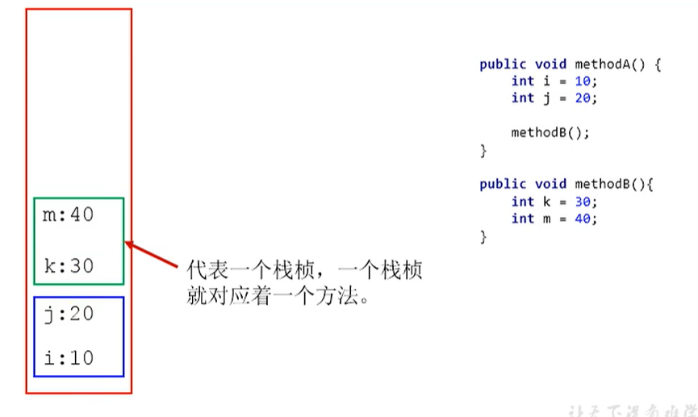

### 生命周期

生命周期和线程一致，也就是线程结束了，该虚拟机栈也销毁了

### 作用

主管Java程序的运行，它**保存方法的局部变量、部分结果，并参与方法的调用和返回**。

> 局部变量，它是相比于成员变量来说的（或属性）
>
> 基本数据类型变量 VS  引用类型变量（类、数组、接口）

### 栈的特点

栈是一种快速有效的分配存储方式，访问速度仅次于程序计数器。JVM直接对Java栈的操作只有两个：

- 每个方法执行，伴随着进栈（入栈、压栈）
- 执行结束后的出栈工作

对于栈来说不存在垃圾回收问题（栈存在溢出的情况）


### 开发中遇到哪些异常？

栈中可能出现的异常

Java 虚拟机规范允许Java栈的大小是**动态的或者是固定**不变的。

如果采用固定大小的Java虚拟机栈，那每一个线程的Java虚拟机栈容量可以在线程创建的时候独立选定。如果线程请求分配的栈容量超过Java虚拟机栈允许的最大容量，Java虚拟机将会抛出一个**StackoverflowError** 异常。

如果Java虚拟机栈可以动态扩展，并且在尝试扩展的时候无法申请到足够的内存，或者在创建新的线程时没有足够的内存去创建对应的虚拟机栈，那Java虚拟机将会抛出一个 outofMemoryError 异常。

```java
/**
 * 演示栈中的异常：StackOverflowError
 * @author: 陌溪
 * @create: 2020-07-05-17:11
 */
public class StackErrorTest {
    private static int count = 1;
    public static void main(String[] args) {
        System.out.println(count++);
        main(args);
    }
}
```

当栈深度达到9803的时候，就出现栈内存空间不足

### 设置栈内存大小

我们可以使用参数 **-Xss**选项来设置线程的最大栈空间，栈的大小直接决定了函数调用的最大可达深度

```java
-Xss1m
-Xss1k
```

## 栈的存储单位

每个线程都有自己的栈，栈中的数据都是以栈帧（Stack Frame）的格式存在。

在这个线程上正在执行的每个方法都各自对应一个栈帧（Stack Frame）。

栈帧是一个内存区块，是一个数据集，维系着方法执行过程中的各种数据信息。

### 栈中存储什么？

每个线程都有自己的栈，栈中的数据都是以栈帧（Stack Frame）的格式存在。在这个线程上正在执行的每个方法都各自对应一个栈帧（Stack Frame）。栈帧是一个内存区块，是一个数据集，维系着方法执行过程中的各种数据信息。

> OOP的基本概念：类和对象
>
> 类中基本结构：field（属性、字段、域）、method

JVM直接对Java栈的操作只有两个，就是对栈帧的压栈和出栈，遵循“先进后出”/“后进先出”原则。

在一条活动线程中，一个时间点上，只会有一个活动的栈帧。即只有当前正在执行的方法的栈帧（栈顶栈帧）是有效的，这个栈帧被称为当前栈帧（Current Frame），与当前栈帧相对应的方法就是当前方法（Current Method），定义这个方法的类就是当前类（Current Class）。

执行引擎运行的所有字节码指令只针对当前栈帧进行操作。

如果在该方法中调用了其他方法，对应的新的栈帧会被创建出来，放在栈的顶端，成为新的当前帧。


下面写一个简单的代码

```java
/**
 * 栈帧
 *
 * @author: 陌溪
 * @create: 2020-07-05-20:33
 */
public class StackFrameTest {
    public static void main(String[] args) {
        method01();
    }

    private static int method01() {
        System.out.println("方法1的开始");
        int i = method02();
        System.out.println("方法1的结束");
        return i;
    }

    private static int method02() {
        System.out.println("方法2的开始");
        int i = method03();;
        System.out.println("方法2的结束");
        return i;
    }
    private static int method03() {
        System.out.println("方法3的开始");
        int i = 30;
        System.out.println("方法3的结束");
        return i;
    }
}
```

输出结果为

```bash
方法1的开始
方法2的开始
方法3的开始
方法3的结束
方法2的结束
方法1的结束
```

满足栈先进后出的概念，通过Idea的 DEBUG，能够看到栈信息

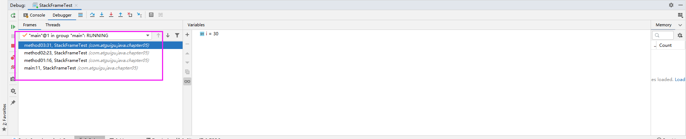

### 栈运行原理

不同线程中所包含的栈帧是不允许存在相互引用的，即不可能在一个栈帧之中引用另外一个线程的栈帧。

如果当前方法调用了其他方法，方法返回之际，当前栈帧会传回此方法的执行结果给前一个栈帧，接着，虚拟机会丢弃当前栈帧，使得前一个栈帧重新成为当前栈帧。

Java方法有两种返回函数的方式，一种是正常的函数返回，使用return指令；另外一种是抛出异常。不管使用哪种方式，都会导致**栈帧被弹出**。

### 栈帧的内部结构

每个栈帧中存储着：

- 局部变量表（Local Variables）
- 操作数栈（operand Stack）（或表达式栈）
- 动态链接（DynamicLinking）（或指向运行时常量池的方法引用）
- 方法返回地址（Return Address）（或方法正常退出或者异常退出的定义）
- 一些附加信息


并行每个线程下的栈都是私有的，因此每个线程都有自己各自的栈，并且每个栈里面都有很多栈帧，栈帧的大小主要由局部变量表 和 操作数栈决定的


## 局部变量表

局部变量表：Local Variables，被称之为局部变量数组或本地变量表

定义为一个数字数组，主要用于存储方法参数和定义在方法体内的局部变量这些数据类型包括各类基本数据类型、对象引用（reference），以及returnAddress类型。

由于局部变量表是建立在线程的栈上，是线程的私有数据，因此不存在数据安全问题

局部变量表所需的容量大小是在编译期确定下来的，并保存在方法的Code属性的maximum local variables数据项中。在方法运行期间是不会改变局部变量表的大小的。

方法嵌套调用的次数由栈的大小决定。一般来说，栈越大，方法嵌套调用次数越多。对一个函数而言，它的参数和局部变量越多，使得局部变量表膨胀，它的栈帧就越大，以满足方法调用所需传递的信息增大的需求。进而函数调用就会占用更多的栈空间，导致其嵌套调用次数就会减少。

局部变量表中的变量只在当前方法调用中有效。在方法执行时，虚拟机通过使用局部变量表完成参数值到参数变量列表的传递过程。当方法调用结束后，随着方法栈帧的销毁，局部变量表也会随之销毁。

### 关于Slot的理解

参数值的存放总是在局部变量数组的index0开始，到数组长度-1的索引结束。

局部变量表，最基本的存储单元是Slot（变量槽）局部变量表中存放编译期可知的各种基本数据类型（8种），引用类型（reference），returnAddress类型的变量。

在局部变量表里，32位以内的类型只占用一个slot（包括returnAddress类型），64位的类型（1ong和double）占用两个slot。

>byte、short、char 在存储前被转换为int，boolean也被转换为int，0表示false，非0表示true。
>1ong和double则占据两个slot。

JVM会为局部变量表中的每一个Slot都分配一个访问索引，通过这个索引即可成功访问到局部变量表中指定的局部变量值

当一个实例方法被调用的时候，它的方法参数和方法体内部定义的局部变量将会按照顺序被复制到局部变量表中的每一个slot上

如果需要访问局部变量表中一个64bit的局部变量值时，只需要使用前一个索引即可。（比如：访问1ong或doub1e类型变量）

如果当前帧是由构造方法或者实例方法创建的，那么该对象引用this将会存放在index为0的s1ot处，其余的参数按照参数表顺序继续排列。


### Slot的重复利用

栈帧中的局部变量表中的槽位是可以重用的，如果一个局部变量过了其作用域，那么在其作用域之后申明的新的局部变就很有可能会复用过期局部变量的槽位，从而达到节省资源的目的。


### 静态变量与局部变量的对比

变量的分类：

- 按数据类型分：基本数据类型、引用数据类型
- 按类中声明的位置分：成员变量（类变量，实例变量）、局部变量
  - 类变量：linking的pepare阶段，给类变量默认赋值，init阶段给类变量显示赋值即静态代码块
  - 实例变量：随着对象创建，会在堆空间中分配实例变量空间，并进行默认赋值
  - 局部变量：在使用前必须进行**显式赋值**，不然编译不通过。

参数表分配完毕之后，再根据方法体内定义的变量的顺序和作用域分配。

我们知道类变量表有两次初始化的机会，第一次是在“准备阶段”，执行**系统初始化**，对类变量设置零值，另一次则是在“初始化”阶段，赋予程序员在代码中定义的初始值。

和类变量初始化不同的是，局部变量表不存在系统初始化的过程，这意味着一旦定义了局部变量则必须人为的初始化，否则无法使用。

在栈帧中，与性能调优关系最为密切的部分就是前面提到的局部变量表。在方法执行时，虚拟机使用局部变量表完成方法的传递。

局部变量表中的变量也是重要的垃圾回收根节点，只要被局部变量表中直接或间接引用的对象都不会被回收。

## 操作数栈

### 概念

操作数栈：Operand Stack

每一个独立的栈帧除了包含局部变量表以外，还包含一个后进先出（Last - In - First -Out）的 **操作数栈**，也可以称之为 **表达式栈**（Expression Stack）

操作数栈，在方法执行过程中，根据字节码指令，往栈中写入数据或提取数据，即入栈（push）和 出栈（pop）

- 某些字节码指令将值压入操作数栈，其余的字节码指令将操作数取出栈。使用它们后再把结果压入栈
- 比如：执行复制、交换、求和等操作


代码举例


操作数栈，***主要用于保存计算过程的中间结果***，同时作为计算过程**中变量临时的存储空间。**

操作数栈就是JVM执行引擎的一个工作区，当一个方法刚开始执行的时候，一个新的栈帧也会随之被创建出来，这个方法的操作数栈是空的。.

> 这个时候数组是有长度的，因为数组一旦创建，那么就是不可变的

每一个操作数栈都会拥有一个明确的栈深度用于存储数值，其所需的最大深度在编译期就定义好了，保存在方法的Code属性中，为maxstack的值。

栈中的任何一个元素都是可以任意的Java数据类型

- 32bit的类型占用**一个栈单位深度**
- 64bit的类型占用两个栈单位深度

操作数栈并非采用访问索引的方式来进行数据访问的，而是只能通过标准的入栈和出栈操作来完成一次数据访问

如果被调用的方法带有返回值的话，其返回值将会被压入当前栈帧的操作数栈中，并更新PC寄存器中下一条需要执行的字节码指令。

操作数栈中元素的数据类型必须与字节码指令的序列严格匹配，这由编译器在编译器期间进行验证，同时在类加载过程中的类检验阶段的数据流分析阶段要再次验证。|

另外，我们说Java虚拟机的**解释引擎**是基于栈的执行引擎，其中的栈指的就是操作数栈。

### 代码追踪

我们给定代码

```java
public void testAddOperation() {
    byte i = 15;
    int j = 8;
    int k = i + j;
}
```

使用javap 命令反编译class文件： javap -v 类名.class

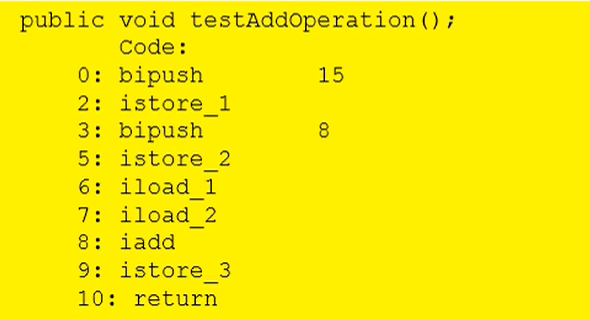

> byte、short、char、boolean 内部都是使用int型来进行保存的
>
> 从上面的代码我们可以知道，我们都是通过bipush对操作数 15 和  8进行入栈操作
>
> 同时使用的是 iadd方法进行相加操作，i -> 代表的就是 int，也就是int类型的加法操作

执行流程如下所示：

首先执行第一条语句，PC寄存器指向的是0，也就是指令地址为0，然后使用bipush让操作数15入栈。


执行完后，让PC + 1，指向下一行代码，下一行代码就是**将操作数栈的元素存储到局部变量表**1的位置，我们可以看到局部变量表的已经增加了一个元素


> 为什么局部变量表不是从0开始的呢？
>
> 其实局部变量表也是从0开始的，但是因为0号位置存储的是**this指针**，所以说就直接省略了~

然后PC+1，指向的是下一行。让操作数8也入栈，同时执行store操作，存入局部变量表中


然后从局部变量表中，依次将数据放在操作数栈中


然后将操作数栈中的两个元素执行相加操作，并存储在局部变量表3的位置


最后PC寄存器的位置指向10，也就是return方法，则直接退出方法

i++和++i的区别

## 栈顶缓存技术

栈顶缓存技术：Top Of Stack Cashing

前面提过，基于栈式架构的虚拟机所使用的零地址指令更加紧凑，但完成一项操作的时候必然需要使用更多的入栈和出栈指令，这同时也就意味着将需要更多的指令分派（instruction dispatch）次数和内存读/写次数。

由于操作数是存储在内存中的，因此频繁地执行内存读/写操作必然会影响执行速度。为了解决这个问题，HotSpot JVM的设计者们提出了栈顶缓存（Tos，Top-of-Stack Cashing）技术，将栈顶元素全部缓存在物理CPU的寄存器中，以此降低对内存的读/写次数，提升执行引擎的执行效率。

> 寄存器：指令更少，执行速度快

## 动态链接

动态链接：Dynamic Linking

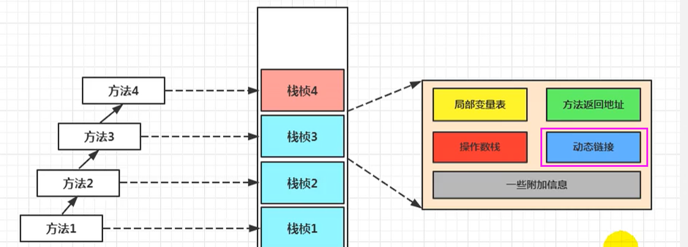

> 动态链接、方法返回地址、附加信息 ： 有些地方被称为帧数据区

每一个栈帧内部都包含一个指向**运行时常量池**中该栈帧所属方法的引用包含这个引用的目的就是为了支持当前方法的代码能够实现动态链接（Dynamic Linking）。比如：invokedynamic指令

在Java源文件被编译到字节码文件中时，所有的变量和方法引用都作为符号引用（symbolic Reference）保存在class文件的常量池里。

比如：描述一个方法调用了另外的其他方法时，就是通过常量池中指向方法的符号引用来表示的，那么动态链接的作用就是为了将这些符号引用转换为调用方法的直接引用。


> 为什么需要运行时常量池？
>
> 因为在不同的方法，都可能调用常量或者方法，所以只需要存储一份即可，节省了空间
>
> 常量池的作用：就是为了提供一些符号和常量，便于指令的识别

## 方法调用：解析与分配

在JVM中，将符号引用转换为调用方法的直接引用与方法的绑定机制相关

### 链接

#### 静态链接

当一个字节码文件被装载进JVM内部时，如果被调用的目标方法在编译期确定，且运行期保持不变时，这种情况下降调用方法的符号引用转换为直接引用的过程称之为静态链接

#### 动态链接

如果被调用的方法在编译期**无法被确定**下来，也就是说，只能够在程序运行期将调用的方法的符号转换为直接引用，由于这种引用转换过程具备动态性，因此也被称之为动态链接。

### 绑定机制

对应的方法的绑定机制为：早期绑定（Early Binding）和晚期绑定（Late Binding）。绑定是一个字段、方法或者类在符号引用被替换为直接引用的过程，这仅仅发生一次。

#### 早期绑定

早期绑定就是指被调用的目标方法如果在编译期可知，且运行期保持不变时，即可将这个方法与所属的类型进行绑定，这样一来，由于明确了被调用的目标方法究竟是哪一个，因此也就可以使用静态链接的方式将符号引用转换为直接引用。

#### 晚期绑定

如果被调用的方法在编译期无法被确定下来，只能够在程序运行期根据实际的类型绑定相关的方法，这种绑定方式也就被称之为晚期绑定。

### 早晚期绑定的发展历史

随着高级语言的横空出世，类似于Java一样的基于面向对象的编程语言如今越来越多，尽管这类编程语言在语法风格上存在一定的差别，但是它们彼此之间始终保持着一个共性，那就是都支持封装、继承和多态等面向对象特性，既然这一类的编程语言具备多态特性，那么自然也就具备早期绑定和晚期绑定两种绑定方式。

Java中任何一个普通的方法其实都具备虚函数的特征，它们相当于C++语言中的虚函数（C++中则需要使用关键字virtual来显式定义）。如果在Java程序中不希望某个方法拥有虚函数的特征时，则可以使用关键字final来标记这个方法。

### 虚方法和非虚方法

- 如果方法在编译期就确定了具体的调用版本，这个版本在运行时是不可变的。这样的方法称为非虚方法。
- 静态方法、私有方法、final方法、实例构造器、父类方法都是非虚方法。
- 其他方法称为虚方法。

> 子类对象的多态的使用前提
>
> - 类的继承关系
> - 方法的重写


虚拟机中提供了以下几条方法调用指令：

#### 普通调用指令：

- invokestatic：调用静态方法，解析阶段确定唯一方法版本
- invokespecial：调用<init>方法、私有及父类方法，解析阶段确定唯一方法版本
- invokevirtual：调用所有虚方法
- invokeinterface：调用接口方法

#### 动态调用指令：

- invokedynamic：动态解析出需要调用的方法，然后执行

前四条指令固化在虚拟机内部，方法的调用执行不可人为干预，而invokedynamic指令则支持由用户确定方法版本。其中invokestatic指令和invokespecial指令调用的方法称为非虚方法，其余的（fina1修饰的除外）称为虚方法。

### invokednamic指令

JVM字节码指令集一直比较稳定，一直到Java7中才增加了一个invokedynamic指令，这是Java为了实现动态类型语言】支持而做的一种改进。

但是在Java7中并没有提供直接生成invokedynamic指令的方法，需要借助ASM这种底层字节码工具来产生invokedynamic指令。直到Java8的Lambda表达式的出现，invokedynamic指令的生成，在Java中才有了直接的生成方式。

Java7中增加的动态语言类型支持的本质是对Java虚拟机规范的修改，而不是对Java语言规则的修改，这一块相对来讲比较复杂，增加了虚拟机中的方法调用，最直接的受益者就是运行在Java平台的动态语言的编译器。

### 动态类型语言和静态类型语言

动态类型语言和静态类型语言两者的区别就在于对类型的检查是在编译期还是在运行期，满足前者就是静态类型语言，反之是动态类型语言。

说的再直白一点就是，静态类型语言是判断变量自身的类型信息；动态类型语言是判断变量值的类型信息，变量没有类型信息，变量值才有类型信息，这是动态语言的一个重要特征。

> Java：String info = "mogu blog";     (Java是静态类型语言的，会先编译就进行类型检查)
>
> JS：var name = "shkstart";    var name = 10;    （运行时才进行检查）

### 方法重写的本质

#### Java 语言中方法重写的本质：

- 找到操作数栈顶的第一个元素所执行的对象的实际类型，记作C。
- 如果在类型C中找到与常量中的描述符合简单名称都相符的方法，则进行访问权限校验，如果通过则返回这个方法的直接引用，查找过程结束；如果不通过，则返回java.1ang.I1legalAccessError 异常。
- 否则，按照继承关系从下往上依次对C的各个父类进行第2步的搜索和验证过程。
- 如果始终没有找到合适的方法，则抛出java.1ang.AbstractMethodsrror异常。

#### IllegalAccessError介绍

程序试图访问或修改一个属性或调用一个方法，这个属性或方法，你没有权限访问。一般的，这个会引起编译器异常。这个错误如果发生在运行时，就说明一个类发生了不兼容的改变。

### 方法的调用：虚方法表

在面向对象的编程中，会很频繁的使用到动态分派，如果在每次动态分派的过程中都要重新在类的方法元数据中搜索合适的目标的话就可能影响到执行效率。因此，为了提高性能，JVM采用在类的方法区建立一个虚方法表
（virtual method table）（非虚方法不会出现在表中）来实现。使用索引表来代替查找。

每个类中都有一个虚方法表，表中存放着各个方法的实际入口。

虚方法表是什么时候被创建的呢？

虚方法表会在类加载的链接阶段被创建并开始初始化，类的变量初始值准备完成之后，JVM会把该类的方法表也初始化完毕。


如上图所示：如果类中重写了方法，那么调用的时候，就会直接在虚方法表中查找，否则将会直接连接到Object的方法中。

## 方法返回地址

存放调用该方法的pc寄存器的值。一个方法的结束，有两种方式：

- 正常执行完成

- 出现未处理的异常，非正常退出

无论通过哪种方式退出，在方法退出后都返回到该方法被调用的位置。方法正常退出时，调用者的pc计数器的值作为返回地址，即调用该方法的指令的下一条指令的地址。而通过异常退出的，返回地址是要通过异常表来确定，栈帧中一般不会保存这部分信息。

当一个方法开始执行后，只有两种方式可以退出这个方法：

执行引擎遇到任意一个方法返回的字节码指令（return），会有返回值传递给上层的方法调用者，简称正常完成出口；

- 一个方法在正常调用完成之后，究竟需要使用哪一个返回指令，还需要根据方法返回值的实际数据类型而定。
- 在字节码指令中，返回指令包含ireturn（当返回值是boolean，byte，char，short和int类型时使用），lreturn（Long类型），freturn（Float类型），dreturn（Double类型），areturn。另外还有一个return指令声明为void的方法，实例初始化方法，类和接口的初始化方法使用。

在方法执行过程中遇到异常（Exception），并且这个异常没有在方法内进行处理，也就是只要在本方法的异常表中没有搜索到匹配的异常处理器，就会导致方法退出，简称异常完成出口。

方法执行过程中，抛出异常时的异常处理，存储在一个异常处理表，方便在发生异常的时候找到处理异常的代码


本质上，方法的退出就是当前栈帧出栈的过程。此时，需要恢复上层方法的局部变量表、操作数栈、将返回值压入调用者栈帧的操作数栈、设置PC寄存器值等，让调用者方法继续执行下去。

正常完成出口和异常完成出口的区别在于：通过异常完成出口退出的不会给他的上层调用者产生任何的返回值。

## 一些附加信息

栈帧中还允许携带与Java虚拟机实现相关的一些附加信息。例如：对程序调试提供支持的信息。

## 栈的相关面试题

- 举例栈溢出的情况？（StackOverflowError）
  - 通过 -Xss设置栈的大小
- 调整栈大小，就能保证不出现溢出么？
  - 不能保证不溢出
- 分配的栈内存越大越好么？
  - 不是，一定时间内降低了OOM概率，但是会挤占其它的线程空间，因为整个空间是有限的。
- 垃圾回收是否涉及到虚拟机栈？
  - 不会
- 方法中定义的局部变量是否线程安全？
  - 具体问题具体分析

```java
/**
 * 面试题
 * 方法中定义局部变量是否线程安全？具体情况具体分析
 * 何为线程安全？
 *    如果只有一个线程才可以操作此数据，则必是线程安全的
 *    如果有多个线程操作，则此数据是共享数据，如果不考虑共享机制，则为线程不安全
 * @author: 陌溪
 * @create: 2020-07-06-16:08
 */
public class StringBuilderTest {

    // s1的声明方式是线程安全的
    public static void method01() {
        // 线程内部创建的，属于局部变量
        StringBuilder s1 = new StringBuilder();
        s1.append("a");
        s1.append("b");
    }

    // 这个也是线程不安全的，因为有返回值，有可能被其它的程序所调用
    public static StringBuilder method04() {
        StringBuilder stringBuilder = new StringBuilder();
        stringBuilder.append("a");
        stringBuilder.append("b");
        return stringBuilder;
    }

    // stringBuilder 是线程不安全的，操作的是共享数据
    public static void method02(StringBuilder stringBuilder) {
        stringBuilder.append("a");
        stringBuilder.append("b");
    }


    /**
     * 同时并发的执行，会出现线程不安全的问题
     */
    public static void method03() {
        StringBuilder stringBuilder = new StringBuilder();
        new Thread(() -> {
            stringBuilder.append("a");
            stringBuilder.append("b");
        }, "t1").start();

        method02(stringBuilder);
    }

    // StringBuilder是线程安全的，但是String也可能线程不安全的
    public static String method05() {
        StringBuilder stringBuilder = new StringBuilder();
        stringBuilder.append("a");
        stringBuilder.append("b");
        return stringBuilder.toString();
    }
}
```

总结一句话就是：如果对象是在内部产生，并在内部消亡，没有返回到外部，那么它就是线程安全的，反之则是线程不安全的。

运行时数据区，是否存在Error和GC？

| 运行时数据区 | 是否存在Error | 是否存在GC |
| ------------ | ------------- | ---------- |
| 程序计数器   | 否            | 否         |
| 虚拟机栈     | 是            | 否         |
| 本地方法栈   | 是            | 否         |
| 方法区       | 是（OOM）     | 是         |
| 堆           | 是            | 是         |


# 6.本地方法接口

## 什么是本地方法

简单地讲，一个Native Methodt是一个Java调用非Java代码的接囗。一个Native Method是这样一个Java方法：该方法的实现由非Java语言实现，比如C。这个特征并非Java所特有，很多其它的编程语言都有这一机制，比如在C++中，你可以用extern "c" 告知c++编译器去调用一个c的函数。

"A native method is a Java method whose implementation is provided by non-java code."（本地方法是一个非Java的方法，它的具体实现是非Java代码的实现）

在定义一个native method时，并不提供实现体（有些像定义一个Java interface），因为其实现体是由非java语言在外面实现的。

本地接口的作用是融合不同的编程语言为Java所用，它的初衷是融合C/C++程序。


代码举例说明Native方法是如何编写的

```java
/**
 * 本地方法
 *
 * @author: 陌溪
 * @create: 2020-07-06-16:45
 */
public class IhaveNatives {
    public native void Native1(int x);
    native static public long Native2();
    native synchronized private float Native3(Object o);
    native void Natives(int[] ary) throws Exception;
}
```

> 需要注意的是：标识符native可以与其它java标识符连用，但是abstract除外

## 为什么使用Native Method？

Java使用起来非常方便，然而有些层次的任务用Java实现起来不容易，或者我们对程序的效率很在意时，问题就来了。

### 与Java环境的交互

有时Java应用需要与Java外面的环境交互，这是本地方法存在的主要原因。你可以想想Java需要与一些底层系统，如操作系统或某些硬件交换信息时的情况。本地方法正是这样一种交流机制：它为我们提供了一个非常简洁的接口，而且我们无需去了解Java应用之外的繁琐的细节。

### 与操作系统的交互

JVM支持着Java语言本身和运行时库，它是Java程序赖以生存的平台，它由一个解释器（解释字节码）和一些连接到本地代码的库组成。然而不管怎样，它毕竟不是一个完整的系统，它经常依赖于一底层系统的支持。这些底层系统常常是强大的操作系统。通过使用本地方法，我们得以用Java实现了jre的与底层系统的交互，甚至JVM的一些部分就是用c写的。还有，如果我们要使用一些Java语言本身没有提供封装的操作系统的特性时，我们也需要使用本地方法。

### Sun's Java

Sun的解释器是用C实现的，这使得它能像一些普通的C一样与外部交互。jre大部分是用Java实现的，它也通过一些本地方法与外界交互。例如：类java.lang.Thread的setpriority（）方法是用Java实现的，但是它实现调用的是该类里的本地方法setpriorityo（）。这个本地方法是用C实现的，并被植入JVM内部，在Windows 95的平台上，这个本地方法最终将调用Win32 setpriority（）ApI。这是一个本地方法的具体实现由JVM直接提供，更多的情况是本地方法由外部的动态链接库（external dynamic link library）提供，然后被JVw调用。

## 现状

目前该方法使用的越来越少了，除非是与硬件有关的应用，比如通过Java程序驱动打印机或者Java系统管理生产设备，在企业级应用中已经比较少见。因为现在的异构领域间的通信很发达，比如可以使用Socket通信，也可以使用Web Service等等，不多做介绍。


# 7.本地方法栈

Java虚拟机栈于管理Java方法的调用，而**本地方法栈用于管理本地方法的调用**。

本地方法栈，也是线程私有的。

允许被实现成固定或者是可动态扩展的内存大小。（在内存溢出方面是相同的）

- 如果线程请求分配的栈容量超过本地方法栈允许的最大容量，Java虚拟机将会抛出一个stackoverflowError 异常。
- 如果本地方法栈可以动态扩展，并且在尝试扩展的时候无法申请到足够的内存，或者在创建新的线程时没有足够的内存去创建对应的本地方法栈，那么Java虚拟机将会抛出一个outofMemoryError异常。

本地方法是使用C语言实现的。

它的具体做法是Native Method Stack中登记native方法，在Execution Engine 执行时加载本地方法库。

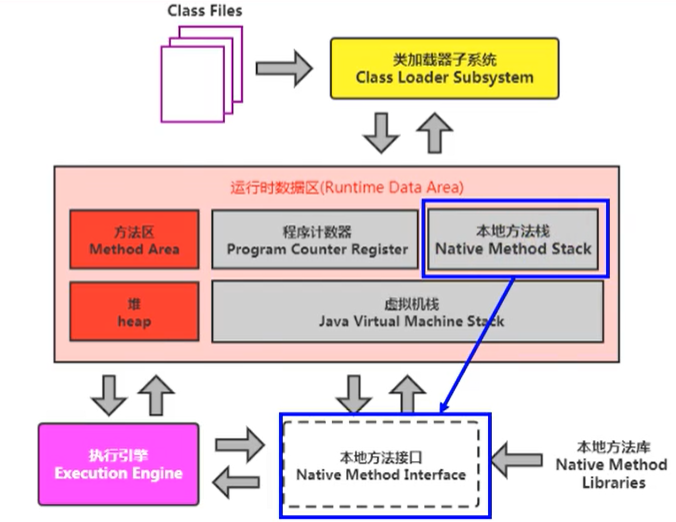

当某个线程调用一个本地方法时，它就进入了一个全新的并且不再受虚拟机限制的世界。它和虚拟机拥有同样的权限。

- 本地方法可以通过本地方法接口来访问虚拟机内部的运行时数据区。
- 它甚至可以直接使用本地处理器中的寄存器
- 直接从本地内存的堆中分配任意数量的内存。

并不是所有的JVM都支持本地方法。因为Java虚拟机规范并没有明确要求本地方法栈的使用语言、具体实现方式、数据结构等。如果JVM产品不打算支持native方法，也可以无需实现本地方法栈。

在Hotspot JVM中，直接将本地方法栈和虚拟机栈合二为一。


# 8.堆

## 堆的核心概念

堆针对一个JVM进程来说是唯一的，也就是一个进程只有一个JVM，但是进程包含多个线程，他们是共享同一堆空间的。


一个JVM实例只存在一个堆内存，堆也是Java内存管理的核心区域。

Java堆区在**JVM启动的时候即被创建**，其空间大小也就确定了。是JVM管理的最大一块内存空间。

- 堆内存的大小是可以调节的。

《Java虚拟机规范》规定，**堆可以处于物理上不连续的内存空间中**，但在逻辑上它应该被视为连续的。

所有的线程共享Java堆，在这里还可以划分**线程私有的缓冲区**（Thread Local Allocation Buffer，TLAB）。

> -Xms10m：最小堆内存
>
> -Xmx10m：最大堆内存

下图就是使用：Java VisualVM查看堆空间的内容，通过 jdk bin提供的插件


《Java虚拟机规范》中对Java堆的描述是：所有的对象实例以及数组都应当在运行时分配在堆上。（The heap is the run-time data area from which memory for all class instances and arrays is allocated）

我要说的是：“几乎”所有的对象实例都在这里分配内存。—从实际使用角度看的。

- 因为**还有一些对象是在栈上分配的**

数组和对象可能永远不会存储在栈上，因为栈帧中保存引用，这个引用指向对象或者数组在堆中的位置。

在方法结束后，堆中的对象**不会马上被移除**，仅仅在垃圾收集的时候才会被移除。

- 也就是**触发了GC**的时候，才会进行回收
- 如果堆中对象马上被回收，那么**用户线程**就会收到影响，因为有stop the word

堆，是GC（Garbage Collection，垃圾收集器）执行垃圾回收的重点区域。


### 堆内存细分

Java 7及之前堆内存逻辑上分为三部分：新生区+养老区+永久区

- Young Generation Space 新生区  Young/New   又被划分为Eden区和Survivor区
- Tenure generation space 养老区 Old/Tenure
- Permanent Space永久区   Perm

Java 8及之后堆内存逻辑上分为三部分：新生区养老区+元空间

- Young Generation Space新生区  Young/New  又被划分为Eden区和Survivor区
- Tenure generation space 养老区  Old/Tenure
- Meta Space  元空间   Meta

约定：新生区 -> 新生代 -> 年轻代   、  养老区 -> 老年区 -> 老年代、 永久区 -> 永久代


堆空间内部结构，JDK1.8之前从永久代  替换成 元空间


## 设置堆内存大小与OOM

Java堆区用于存储Java对象实例，那么堆的大小在JVM启动时就已经设定好了，大家可以通过选项"-Xmx"和"-Xms"来进行设置。

- “-Xms"用于表示堆区的起始内存，等价于-xx:InitialHeapSize
- “-Xmx"则用于表示堆区的最大内存，等价于-XX:MaxHeapSize

一旦堆区中的内存大小超过“-xmx"所指定的最大内存时，将会抛出outofMemoryError异常。

通常会将-Xms和-Xmx两个参数配置相同的值，其目的是**为了能够在ava垃圾回收机制清理完堆区后不需要重新分隔计算堆区的大小，从而提高性能**。

默认情况下

- 初始内存大小：物理电脑内存大小/64

- 最大内存大小：物理电脑内存大小/4

```java
/**
 * -Xms 用来设置堆空间（年轻代+老年代）的初始内存大小
 *  -X：是jvm运行参数
 *  ms：memory start
 * -Xmx：用来设置堆空间（年轻代+老年代）的最大内存大小
 *
 * @author: 陌溪
 * @create: 2020-07-06-20:44
 */
public class HeapSpaceInitial {
    public static void main(String[] args) {
        // 返回Java虚拟机中的堆内存总量
        long initialMemory = Runtime.getRuntime().totalMemory() / 1024 / 1024;
        // 返回Java虚拟机试图使用的最大堆内存
        long maxMemory = Runtime.getRuntime().maxMemory() / 1024 / 1024;
        System.out.println("-Xms:" + initialMemory + "M");
        System.out.println("-Xmx:" + maxMemory + "M");
    }
}
```

输出结果

```bash
-Xms:245M
-Xmx:3614M
```

如何查看堆内存的内存分配情况

```bash
jps  ->  jstat -gc 进程id
```


```bash
-XX:+PrintGCDetails
```


### OutOfMemory举例


我们简单的写一个OOM例子

```java
/**
 * OOM测试
 *
 * @author: 陌溪
 * @create: 2020-07-06-21:11
 */
public class OOMTest {
    public static void main(String[] args) {
        List<Integer> list = new ArrayList<>();
        while(true) {
            list.add(999999999);
        }
    }
}

```

然后设置启动参数

```
-Xms10m -Xmx:10m
```

运行后，就出现OOM了，那么我们可以通过 VisualVM这个工具查看具体是什么参数造成的OOM


## 年轻代与老年代

存储在JVM中的Java对象可以被划分为两类：

- 一类是生命周期较短的瞬时对象，这类对象的创建和消亡都非常迅速
  - 生命周期短的，及时回收即可
- 另外一类对象的生命周期却非常长，在某些极端的情况下还能够与JVM的生命周期保持一致

Java堆区进一步细分的话，可以划分为年轻代（YoungGen）和老年代（oldGen）

其中年轻代又可以划分为Eden空间、Survivor0空间和Survivor1空间（有时也叫做from区、to区）


下面这参数开发中一般不会调：


- Eden：From：to ->  8:1:1
- 新生代：老年代  - >  1 : 2

配置新生代与老年代在堆结构的占比。

- 默认-XX:NewRatio=2，表示新生代占1，老年代占2，新生代占整个堆的1/3

- 可以修改-XX:NewRatio=4，表示新生代占1，老年代占4，新生代占整个堆的1/5

> 当发现在整个项目中，生命周期长的对象偏多，那么就可以通过调整 老年代的大小，来进行调优

在HotSpot中，Eden空间和另外两个survivor空间缺省所占的比例是8：1：1当然开发人员可以通过选项“-xx:SurvivorRatio”调整这个空间比例。比如-xx:SurvivorRatio=8

几乎所有的Java对象都是在Eden区被new出来的。绝大部分的Java对象的销毁都在新生代进行了。（有些大的对象在Eden区无法存储时候，将直接进入老年代）

>IBM公司的专门研究表明，新生代中80%的对象都是“朝生夕死”的。
>
>可以使用选项"-Xmn"设置新生代最大内存大小
>
>这个参数一般使用默认值就可以了。


## 图解对象分配过程

### 概念

为新对象分配内存是一件非常严谨和复杂的任务，JM的设计者们不仅需要考虑内存如何分配、在哪里分配等问题，并且由于内存分配算法与内存回收算法密切相关，所以还需要考虑GC执行完内存回收后是否会在内存空间中产生内存碎片。

- new的对象先放伊甸园区。此区有大小限制。
- 当伊甸园的空间填满时，程序又需要创建对象，JVM的垃圾回收器将对伊甸园区进行垃圾回收（MinorGC），将伊甸园区中的不再被其他对象所引用的对象进行销毁。再加载新的对象放到伊甸园区
- 然后将伊甸园中的剩余对象移动到幸存者0区。
- 如果再次触发垃圾回收，此时上次幸存下来的放到幸存者0区的，如果没有回收，就会放到幸存者1区。
- 如果再次经历垃圾回收，此时会重新放回幸存者0区，接着再去幸存者1区。
- 啥时候能去养老区呢？可以设置次数。默认是15次。
- 在养老区，相对悠闲。当养老区内存不足时，再次触发GC：Major GC，进行养老区的内存清理
- 若养老区执行了Major GC之后，发现依然无法进行对象的保存，就会产生OOM异常。

可以设置参数：-Xx:MaxTenuringThreshold= N进行设置

### 图解过程

我们创建的对象，一般都是存放在Eden区的，当我们Eden区满了后，就会触发GC操作，一般被称为 YGC / Minor GC操作


当我们进行一次垃圾收集后，红色的将会被回收，而绿色的还会被占用着，存放在S0(Survivor From)区。同时我们给每个对象设置了一个年龄计数器，一次回收后就是1。

同时Eden区继续存放对象，当Eden区再次存满的时候，又会触发一个MinorGC操作，此时GC将会把 Eden和Survivor From中的对象 进行一次收集，把存活的对象放到 Survivor To区，同时让年龄 + 1


我们继续不断的进行对象生成 和 垃圾回收，当Survivor中的对象的年龄达到15的时候，将会触发一次 Promotion晋升的操作，也就是将年轻代中的对象  晋升到 老年代中


### 思考：幸存区区满了后？

特别注意，在Eden区满了的时候，才会触发MinorGC，而幸存者区满了后，不会触发MinorGC操作

如果Survivor区满了后，将会触发一些特殊的规则，也就是可能直接晋升老年代

> 举例：以当兵为例，正常人的晋升可能是 ：  新兵 -> 班长 -> 排长 -> 连长
>
> 但是也有可能有些人因为做了非常大的贡献，直接从  新兵 -> 排长

### 对象分配的特殊情况


### 代码演示对象分配过程

我们不断的创建大对象

```java
/**
 * 代码演示对象创建过程
 *
 * @author: 陌溪
 * @create: 2020-07-07-9:16
 */
public class HeapInstanceTest {
    byte [] buffer = new byte[new Random().nextInt(1024 * 200)];
    public static void main(String[] args) throws InterruptedException {
        ArrayList<HeapInstanceTest> list = new ArrayList<>();
        while (true) {
            list.add(new HeapInstanceTest());
            Thread.sleep(10);
        }
    }
}
```

然后设置JVM参数

```bash
-Xms600m -Xmx600m
```

然后cmd输入下面命令，打开VisualVM图形化界面

```
jvisualvm
```

然后通过执行上面代码，通过VisualGC进行动态化查看


最终，在老年代和新生代都满了，就出现OOM

```
Exception in thread "main" java.lang.OutOfMemoryError: Java heap space
	at com.atguigu.java.chapter08.HeapInstanceTest.<init>(HeapInstanceTest.java:13)
	at com.atguigu.java.chapter08.HeapInstanceTest.main(HeapInstanceTest.java:17)
```

### 常用的调优工具

- JDK命令行
- Eclipse：Memory Analyzer Tool
- Jconsole
- Visual VM（实时监控  推荐~）
- Jprofiler（推荐~）
- Java Flight Recorder（实时监控）
- GCViewer
- GCEasy

### 总结

- 针对幸存者s0，s1区的总结：复制之后有交换，谁空谁是to
- 关于垃圾回收：频繁在新生区收集，很少在老年代收集，几乎不再永久代和元空间进行收集
- 新生代采用复制算法的目的：是为了减少内碎片

## Minor GC，MajorGC、Full GC

- Minor GC：新生代的GC
- Major GC：老年代的GC
- Full GC：整堆收集，收集整个Java堆和方法区的垃圾收集

>我们都知道，JVM的调优的一个环节，也就是垃圾收集，我们需要尽量的避免垃圾回收，因为在垃圾回收的过程中，容易出现STW的问题
>
>而 Major GC 和 Full GC出现STW的时间，是Minor GC的10倍以上

JVM在进行GC时，并非每次都对上面三个内存区域一起回收的，大部分时候回收的都是指新生代。针对Hotspot VM的实现，它里面的GC按照回收区域又分为两大种类型：一种是部分收集（Partial GC），一种是整堆收集（FullGC）

部分收集：不是完整收集整个Java堆的垃圾收集。其中又分为：

- 新生代收集（MinorGC/YoungGC）：只是新生代的垃圾收集
- 老年代收集（MajorGC/o1dGC）：只是老年代的圾收集。
  - 目前，只有CMSGC会有单独收集老年代的行为。
  - 注意，很多时候Major GC会和Fu11GC混淆使用，需要具体分辨是老年代回收还是整堆回收。
- 混合收集（MixedGC）：收集整个新生代以及部分老年代的垃圾收集。
  - 目前，只有G1 GC会有这种行为

整堆收集（FullGC）：收集整个java堆和方法区的垃圾收集。

### Minor GC

当年轻代空间不足时，就会触发MinorGC，这里的年轻代满指的是Eden代满，Survivor满不会引发GC。（每次Minor GC会清理年轻代的内存。）

因为Java对象大多都具备 **朝生夕灭** 的特性，所以Minor GC非常频繁，一般回收速度也比较快。这一定义既清晰又易于理解。

Minor GC会引发STW，暂停其它用户的线程，等垃圾回收结束，用户线程才恢复运行

> STW：stop the word


### Major GC

指发生在老年代的GC，对象从老年代消失时，我们说 “Major Gc” 或 “Full GC” 发生了

出现了MajorGc，经常会伴随至少一次的Minor GC（但非绝对的，在Paralle1 Scavenge收集器的收集策略里就有直接进行MajorGC的策略选择过程）

- 也就是在老年代空间不足时，会先尝试触发MinorGc。如果之后空间还不足，则触发Major GC

Major GC的速度一般会比MinorGc慢1e倍以上，STW的时间更长，如果Major GC后，内存还不足，就报OOM了

### Full GC

触发Fu11GC执行的情况有如下五种：

- 调用System.gc（）时，系统建议执行Fu11GC，但是不必然执行
- 老年代空间不足
- 方法区空间不足
- 通过Minor GC后进入老年代的平均大小大于老年代的可用内存
- 由Eden区、survivor spacee（From Space）区向survivor spacel（To Space）区复制时，对象大小大于To Space可用内存，则把该对象转存到老年代，且老年代的可用内存小于该对象大小

说明：Full GC 是开发或调优中尽量要避免的。这样暂时时间会短一些


### GC 举例

我们编写一个OOM的异常，因为我们在不断的创建字符串，是存放在元空间的

```java
/**
 * GC测试
 *
 * @author: 陌溪
 * @create: 2020-07-07-10:01
 */
public class GCTest {
    public static void main(String[] args) {
        int i = 0;
        try {
            List<String> list = new ArrayList<>();
            String a = "mogu blog";
            while(true) {
                list.add(a);
                a = a + a;
                i++;
            }
        }catch (Exception e) {
            e.getStackTrace();
        }
    }
}
```

设置JVM启动参数

```bash
-Xms10m -Xmx10m -XX:+PrintGCDetails
```

打印出的日志

```
[GC (Allocation Failure) [PSYoungGen: 2038K->500K(2560K)] 2038K->797K(9728K), 0.3532002 secs] [Times: user=0.01 sys=0.00, real=0.36 secs] 
[GC (Allocation Failure) [PSYoungGen: 2108K->480K(2560K)] 2405K->1565K(9728K), 0.0014069 secs] [Times: user=0.00 sys=0.00, real=0.00 secs] 
[Full GC (Ergonomics) [PSYoungGen: 2288K->0K(2560K)] [ParOldGen: 6845K->5281K(7168K)] 9133K->5281K(9728K), [Metaspace: 3482K->3482K(1056768K)], 0.0058675 secs] [Times: user=0.00 sys=0.00, real=0.01 secs] 
[GC (Allocation Failure) [PSYoungGen: 0K->0K(2560K)] 5281K->5281K(9728K), 0.0002857 secs] [Times: user=0.00 sys=0.00, real=0.00 secs] 
[Full GC (Allocation Failure) [PSYoungGen: 0K->0K(2560K)] [ParOldGen: 5281K->5263K(7168K)] 5281K->5263K(9728K), [Metaspace: 3482K->3482K(1056768K)], 0.0058564 secs] [Times: user=0.00 sys=0.00, real=0.01 secs] 
Heap
 PSYoungGen      total 2560K, used 60K [0x00000000ffd00000, 0x0000000100000000, 0x0000000100000000)
  eden space 2048K, 2% used [0x00000000ffd00000,0x00000000ffd0f138,0x00000000fff00000)
  from space 512K, 0% used [0x00000000fff00000,0x00000000fff00000,0x00000000fff80000)
  to   space 512K, 0% used [0x00000000fff80000,0x00000000fff80000,0x0000000100000000)
 ParOldGen       total 7168K, used 5263K [0x00000000ff600000, 0x00000000ffd00000, 0x00000000ffd00000)
  object space 7168K, 73% used [0x00000000ff600000,0x00000000ffb23cf0,0x00000000ffd00000)
 Metaspace       used 3514K, capacity 4498K, committed 4864K, reserved 1056768K
  class space    used 388K, capacity 390K, committed 512K, reserved 1048576K
  
  Exception in thread "main" java.lang.OutOfMemoryError: Java heap space
	at java.util.Arrays.copyOfRange(Arrays.java:3664)
	at java.lang.String.<init>(String.java:207)
	at java.lang.StringBuilder.toString(StringBuilder.java:407)
	at com.atguigu.java.chapter08.GCTest.main(GCTest.java:20)
```

触发OOM的时候，一定是进行了一次Full GC，因为只有在老年代空间不足时候，才会爆出OOM异常

## 堆空间分代思想

 为什么要把Java堆分代？不分代就不能正常工作了吗？经研究，不同对象的生命周期不同。70%-99%的对象是临时对象。

>新生代：有Eden、两块大小相同的survivor（又称为from/to，s0/s1）构成，to总为空。
>老年代：存放新生代中经历多次GC仍然存活的对象。


其实不分代完全可以，分代的唯一理由就是优化GC性能。如果没有分代，那所有的对象都在一块，就如同把一个学校的人都关在一个教室。GC的时候要找到哪些对象没用，这样就会对堆的所有区域进行扫描。而很多对象都是朝生夕死的，如果分代的话，把新创建的对象放到某一地方，当GC的时候先把这块存储“朝生夕死”对象的区域进行回收，这样就会腾出很大的空间出来。


## 内存分配策略

如果对象在Eden出生并经过第一次Minor GC后仍然存活，并且能被Survivor容纳的话，将被移动到survivor空间中，并将对象年龄设为1。对象在survivor区中每熬过一次MinorGC，年龄就增加1岁，当它的年龄增加到一定程度（默认为15岁，其实每个JVM、每个GC都有所不同）时，就会被晋升到老年代

对象晋升老年代的年龄阀值，可以通过选项-xx:MaxTenuringThreshold来设置

针对不同年龄段的对象分配原则如下所示：

- 优先分配到Eden
  - 开发中比较长的字符串或者数组，会直接存在老年代，但是因为新创建的对象 都是 朝生夕死的，所以这个大对象可能也很快被回收，但是因为老年代触发Major GC的次数比 Minor GC要更少，因此可能回收起来就会比较慢
- 大对象直接分配到老年代
  - 尽量避免程序中出现过多的大对象
- 长期存活的对象分配到老年代
- 动态对象年龄判断
  - 如果survivor区中相同年龄的所有对象大小的总和大于Survivor空间的一半，年龄大于或等于该年龄的对象可以直接进入老年代，无须等到MaxTenuringThreshold 中要求的年龄。

空间分配担保： -Xx:HandlePromotionFailure

- 也就是经过Minor GC后，所有的对象都存活，因为Survivor比较小，所以就需要将Survivor无法容纳的对象，存放到老年代中。

## 为对象分配内存：TLAB

### 问题：堆空间都是共享的么？

不一定，因为还有TLAB这个概念，在堆中划分出一块区域，为每个线程所独占

### 为什么有TLAB？

TLAB：Thread Local Allocation Buffer，也就是为每个线程单独分配了一个缓冲区

堆区是线程共享区域，任何线程都可以访问到堆区中的共享数据

由于对象实例的创建在JVM中非常频繁，因此在并发环境下从堆区中划分内存空间是线程不安全的

为避免多个线程操作同一地址，需要使用加锁等机制，进而影响分配速度。

### 什么是TLAB

从内存模型而不是垃圾收集的角度，对Eden区域继续进行划分，JVM为每个线程分配了一个私有缓存区域，它包含在**Eden空间**内。

多线程同时分配内存时，使用TLAB可以避免一系列的非线程安全问题，同时还能够提升内存分配的吞吐量，因此我们可以将这种内存分配方式称之为快速分配策略。

据我所知所有OpenJDK衍生出来的JVM都提供了TLAB的设计。


尽管不是所有的对象实例都能够在TLAB中成功分配内存，但JVM确实是将TLAB作为内存分配的首选。

在程序中，开发人员可以通过选项“-Xx:UseTLAB”设置是否开启TLAB空间。

默认情况下，TLAB空间的内存非常小，仅占有整个Eden空间的1，当然我们可以通过选项“-Xx:TLABWasteTargetPercent”设置TLAB空间所占用Eden空间的百分比大小。

一旦对象在TLAB空间分配内存失败时，JVM就会尝试着通过使用加锁机制确保数据操作的原子性，从而直接在Eden空间中分配内存。

### TLAB分配过程

对象首先是通过TLAB开辟空间，如果不能放入，那么需要通过Eden来进行分配


## 小结：堆空间的参数设置

- -XX：+PrintFlagsInitial：查看所有的参数的默认初始值
- -XX：+PrintFlagsFinal：查看所有的参数的最终值（可能会存在修改，不再是初始值）
- -Xms：初始堆空间内存（默认为物理内存的1/64）
- -Xmx：最大堆空间内存（默认为物理内存的1/4）
- -Xmn：设置新生代的大小。（初始值及最大值）
- -XX:NewRatio：配置新生代与老年代在堆结构的占比

- -XX:SurvivorRatio：设置新生代中Eden和S0/S1空间的比例
- -XX:MaxTenuringThreshold：设置新生代垃圾的最大年龄
- -XX：+PrintGCDetails：输出详细的GC处理日志
  - 打印gc简要信息：①-Xx：+PrintGC  ② - verbose:gc
- -XX:HandlePromotionFalilure：是否设置空间分配担保


在发生Minor GC之前，虚拟机会检查老年代最大可用的连续空间是否大于新生代所有对象的总空间。I

- 如果大于，则此次Minor GC是安全的
- 如果小于，则虚拟机会查看-xx:HandlePromotionFailure设置值是否允担保失败。
  - 如果HandlePromotionFailure=true，那么会继续检查老年代最大可用连续空间是否大于历次晋升到老年代的对象的平均大小。
  - 如果大于，则尝试进行一次Minor GC，但这次Minor GC依然是有风险的；
  - 如果小于，则改为进行一次FullGC。
  - 如果HandlePromotionFailure=false，则改为进行一次Ful1 Gc。

在JDK6 Update24之后，HandlePromotionFailure参数不会再影响到虚拟机的空间分配担保策略，观察openJDK中的源码变化，虽然源码中还定义了HandlePromotionFailure参数，但是在代码中已经不会再使用它。JDK6 Update 24之后的规则变为只要老年代的连续空间大于新生代对象总大小或者历次晋升的平均大小就会进行Minor GC，否则将进行FullGC。

## 堆是分配对象的唯一选择么？

### 逃逸分析

在《深入理解Java虚拟机》中关于Java堆内存有这样一段描述：

随着JIT编译期的发展与逃逸分析技术逐渐成熟，栈上分配、标量替换优化技术将会导致一些微妙的变化，所有的对象都分配到堆上也渐渐变得不那么“绝对”了。

在Java虚拟机中，对象是在Java堆中分配内存的，这是一个普遍的常识。但是，有一种特殊情况，那就是如果经过逃逸分析（Escape Analysis）后发现，一个对象并没有逃逸出方法的话，那么就可能被优化成栈上分配。这样就无需在堆上分配内存，也无须进行垃圾回收了。这也是最常见的堆外存储技术。

此外，前面提到的基于openJDk深度定制的TaoBaovm，其中创新的GCIH（GC invisible heap）技术实现off-heap，将生命周期较长的Java对象从heap中移至heap外，并且GC不能管理GCIH内部的Java对象，以此达到降低GC的回收频率和提升GC的回收效率的目的。

如何将堆上的对象分配到栈，需要使用逃逸分析手段。

这是一种可以有效减少Java程序中同步负载和内存堆分配压力的跨函数全局数据流分析算法。通过逃逸分析，Java Hotspot编译器能够分析出一个新的对象的引用的使用范围从而决定是否要将这个对象分配到堆上。逃逸分析的基本行为就是分析对象动态作用域：

- 当一个对象在方法中被定义后，对象只在方法内部使用，则认为没有发生逃逸。
- 当一个对象在方法中被定义后，它被外部方法所引用，则认为发生逃逸。例如作为调用参数传递到其他地方中。

#### 逃逸分析举例

没有发生逃逸的对象，则可以分配到栈上，随着方法执行的结束，栈空间就被移除，每个栈里面包含了很多栈帧，也就是发生逃逸分析

```java
public void my_method() {
    V v = new V();
    // use v
    // ....
    v = null;
}
```

针对下面的代码

```java
public static StringBuffer createStringBuffer(String s1, String s2) {
    StringBuffer sb = new StringBuffer();
    sb.append(s1);
    sb.append(s2);
    return sb;
}
```

如果想要StringBuffer sb不发生逃逸，可以这样写

```java
public static String createStringBuffer(String s1, String s2) {
    StringBuffer sb = new StringBuffer();
    sb.append(s1);
    sb.append(s2);
    return sb.toString();
}
```

完整的逃逸分析代码举例

```java
/**
 * 逃逸分析
 * 如何快速的判断是否发生了逃逸分析，大家就看new的对象是否在方法外被调用。
 * @author: 陌溪
 * @create: 2020-07-07-20:05
 */
public class EscapeAnalysis {

    public EscapeAnalysis obj;

    /**
     * 方法返回EscapeAnalysis对象，发生逃逸
     * @return
     */
    public EscapeAnalysis getInstance() {
        return obj == null ? new EscapeAnalysis():obj;
    }

    /**
     * 为成员属性赋值，发生逃逸
     */
    public void setObj() {
        this.obj = new EscapeAnalysis();
    }

    /**
     * 对象的作用于仅在当前方法中有效，没有发生逃逸
     */
    public void useEscapeAnalysis() {
        EscapeAnalysis e = new EscapeAnalysis();
    }

    /**
     * 引用成员变量的值，发生逃逸
     */
    public void useEscapeAnalysis2() {
        EscapeAnalysis e = getInstance();
        // getInstance().XXX  发生逃逸
    }
}
```

#### 参数设置

在JDK 1.7 版本之后，HotSpot中默认就已经开启了逃逸分析

如果使用的是较早的版本，开发人员则可以通过：

- 选项“-xx：+DoEscapeAnalysis"显式开启逃逸分析
- 通过选项“-xx：+PrintEscapeAnalysis"查看逃逸分析的筛选结果

#### 结论

开发中能使用局部变量的，就不要使用在方法外定义。

使用逃逸分析，编译器可以对代码做如下优化：

- 栈上分配：将堆分配转化为栈分配。如果一个对象在子程序中被分配，要使指向该对象的指针永远不会发生逃逸，对象可能是栈上分配的候选，而不是堆上分配
- 同步省略：如果一个对象被发现只有一个线程被访问到，那么对于这个对象的操作可以不考虑同步。
- 分离对象或标量替换：有的对象可能不需要作为一个连续的内存结构存在也可以被访问到，那么对象的部分（或全部）可以不存储在内存，而是存储在CPU寄存器中。

### 栈上分配

JIT编译器在编译期间根据逃逸分析的结果，发现如果一个对象并没有逃逸出方法的话，就可能被优化成栈上分配。分配完成后，继续在调用栈内执行，最后线程结束，栈空间被回收，局部变量对象也被回收。这样就无须进行垃圾回收了。

常见的栈上分配的场景

> 在逃逸分析中，已经说明了。分别是给成员变量赋值、方法返回值、实例引用传递。

#### 举例

我们通过举例来说明 开启逃逸分析 和 未开启逃逸分析时候的情况

```java
/**
 * 栈上分配
 * -Xmx1G -Xms1G -XX:-DoEscapeAnalysis -XX:+PrintGCDetails
 * @author: 陌溪
 * @create: 2020-07-07-20:23
 */
class User {
    private String name;
    private String age;
    private String gender;
    private String phone;
}
public class StackAllocation {
    public static void main(String[] args) throws InterruptedException {
        long start = System.currentTimeMillis();
        for (int i = 0; i < 100000000; i++) {
            alloc();
        }
        long end = System.currentTimeMillis();
        System.out.println("花费的时间为：" + (end - start) + " ms");

        // 为了方便查看堆内存中对象个数，线程sleep
        Thread.sleep(10000000);
    }

    private static void alloc() {
        // 未发生逃逸
        User user = new User(); 
    }
}
```

设置JVM参数，表示未开启逃逸分析

```
-Xmx1G -Xms1G -XX:-DoEscapeAnalysis -XX:+PrintGCDetails
```

运行结果，同时还触发了GC操作

```
花费的时间为：664 ms
```

然后查看内存的情况，发现有大量的User存储在堆中


我们在开启逃逸分析

```
-Xmx1G -Xms1G -XX:+DoEscapeAnalysis -XX:+PrintGCDetails
```

然后查看运行时间，我们能够发现花费的时间快速减少，同时不会发生GC操作

```
花费的时间为：5 ms
```

在看内存情况，我们发现只有很少的User对象，说明User未发生逃逸，因为它存储在栈中，随着栈的销毁而消失


### 同步省略

线程同步的代价是相当高的，同步的后果是降低并发性和性能。

在动态编译同步块的时候，JIT编译器可以借助逃逸分析来判断同步块所使用的锁对象是否只能够被一个线程访问而没有被发布到其他线程。如果没有，那么JIT编译器在编译这个同步块的时候就会取消对这部分代码的同步。这样就能大大提高并发性和性能。这个取消同步的过程就叫同步省略，也叫锁消除。

例如下面的代码

```java
public void f() {
    Object hellis = new Object();
    synchronized(hellis) {
        System.out.println(hellis);
    }
}
```

代码中对hellis这个对象加锁，但是hellis对象的生命周期只在f()方法中，并不会被其他线程所访问到，所以在JIT编译阶段就会被优化掉，优化成：

```java
public void f() {
    Object hellis = new Object();
	System.out.println(hellis);
}
```

我们将其转换成字节码


### 分离对象和标量替换

标量（scalar）是指一个无法再分解成更小的数据的数据。Java中的原始数据类型就是标量。

相对的，那些还可以分解的数据叫做聚合量（Aggregate），Java中的对象就是聚合量，因为他可以分解成其他聚合量和标量。

在JIT阶段，如果经过逃逸分析，发现一个对象不会被外界访问的话，那么经过JIT优化，就会把这个对象拆解成若干个其中包含的若干个成员变量来代替。这个过程就是标量替换。

```java
public static void main(String args[]) {
    alloc();
}
class Point {
    private int x;
    private int y;
}
private static void alloc() {
    Point point = new Point(1,2);
    System.out.println("point.x" + point.x + ";point.y" + point.y);
}
```

以上代码，经过标量替换后，就会变成

```java
private static void alloc() {
    int x = 1;
    int y = 2;
    System.out.println("point.x = " + x + "; point.y=" + y);
}
```

可以看到，Point这个聚合量经过逃逸分析后，发现他并没有逃逸，就被替换成两个标量了。那么标量替换有什么好处呢？就是可以大大减少堆内存的占用。因为一旦不需要创建对象了，那么就不再需要分配堆内存了。
标量替换为栈上分配提供了很好的基础。

### 代码优化之标量替换

上述代码在主函数中进行了1亿次alloc。调用进行对象创建，由于User对象实例需要占据约16字节的空间，因此累计分配空间达到将近1.5GB。如果堆空间小于这个值，就必然会发生GC。使用如下参数运行上述代码：

```bash
-server -Xmx100m -Xms100m -XX:+DoEscapeAnalysis -XX:+PrintGC -XX:+EliminateAllocations
```

这里设置参数如下：

- 参数-server：启动Server模式，因为在server模式下，才可以启用逃逸分析。
- 参数-XX:+DoEscapeAnalysis：启用逃逸分析
- 参数-Xmx10m：指定了堆空间最大为10MB
- 参数-XX:+PrintGC：将打印Gc日志
- 参数一xx：+EliminateAllocations：开启了标量替换（默认打开），允许将对象打散分配在栈上，比如对象拥有id和name两个字段，那么这两个字段将会被视为两个独立的局部变量进行分配

### 逃逸分析的不足

关于逃逸分析的论文在1999年就已经发表了，但直到JDK1.6才有实现，而且这项技术到如今也并不是十分成熟。

其根本原因就是无法保证逃逸分析的性能消耗一定能高于他的消耗。虽然经过逃逸分析可以做标量替换、栈上分配、和锁消除。但是逃逸分析自身也是需要进行一系列复杂的分析的，这其实也是一个相对耗时的过程。
一个极端的例子，就是经过逃逸分析之后，发现没有一个对象是不逃逸的。那这个逃逸分析的过程就白白浪费掉了。

虽然这项技术并不十分成熟，但是它也是即时编译器优化技术中一个十分重要的手段。注意到有一些观点，认为通过逃逸分析，JVM会在栈上分配那些不会逃逸的对象，这在理论上是可行的，但是取决于JvM设计者的选择。据我所知，oracle Hotspot JVM中并未这么做，这一点在逃逸分析相关的文档里已经说明，所以可以明确所有的对象实例都是创建在堆上。

目前很多书籍还是基于JDK7以前的版本，JDK已经发生了很大变化，intern字符串的缓存和静态变量曾经都被分配在永久代上，而永久代已经被元数据区取代。但是，intern字符串缓存和静态变量并不是被转移到元数据区，而是直接在堆上分配，所以这一点同样符合前面一点的结论：对象实例都是分配在堆上。

## 小结

年轻代是对象的诞生、成长、消亡的区域，一个对象在这里产生、应用，最后被垃圾回收器收集、结束生命。

老年代放置长生命周期的对象，通常都是从survivor区域筛选拷贝过来的Java对象。当然，也有特殊情况，我们知道普通的对象会被分配在TLAB上；如果对象较大，JVM会试图直接分配在Eden其他位置上；如果对象太大，完全无法在新生代找到足够长的连续空闲空间，JVM就会直接分配到老年代。当GC只发生在年轻代中，回收年轻代对象的行为被称为MinorGc。

当GC发生在老年代时则被称为MajorGc或者FullGC。一般的，MinorGc的发生频率要比MajorGC高很多，即老年代中垃圾回收发生的频率将大大低于年轻代。


# 9.方法区

## 前言

这次所讲述的是运行时数据区的最后一个部分

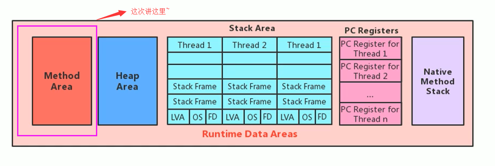

从线程共享与否的角度来看

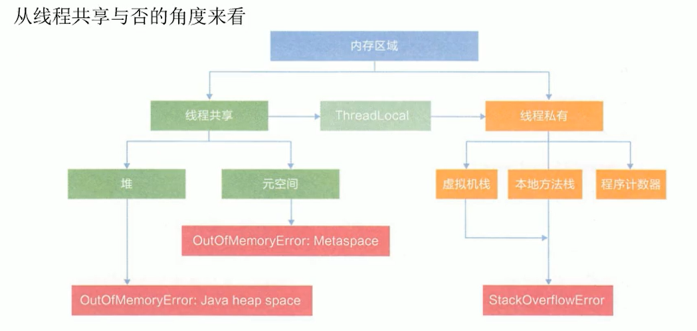

ThreadLocal：如何保证多个线程在并发环境下的安全性？典型应用就是数据库连接管理，以及会话管理

## 栈、堆、方法区的交互关系

下面就涉及了对象的访问定位


- Person：存放在元空间，也可以说方法区
- person：存放在Java栈的局部变量表中
- new Person()：存放在Java堆中

## 方法区的理解

《Java虚拟机规范》中明确说明：“尽管所有的方法区在逻辑上是属于堆的一部分，但一些简单的实现可能不会选择去进行垃圾收集或者进行压缩。”但对于HotSpotJVM而言，方法区还有一个别名叫做Non-Heap（非堆），目的就是要和堆分开。

所以，方法区看作是一块独立于Java堆的内存空间。


方法区主要存放的是 Class，而堆中主要存放的是 实例化的对象

- 方法区（Method Area）与Java堆一样，是各个线程共享的内存区域。
- 方法区在JVM启动的时候被创建，并且它的实际的物理内存空间中和Java堆区一样都可以是不连续的。
- 方法区的大小，跟堆空间一样，可以选择固定大小或者可扩展。
- 方法区的大小决定了系统可以保存多少个类，如果系统定义了太多的类，导致方法区溢出，虚拟机同样会抛出内存溢出错误：ava.lang.OutofMemoryError：PermGen space 或者java.lang.OutOfMemoryError:Metaspace
  - 加载大量的第三方的jar包
  - Tomcat部署的工程过多（30~50个）
  - 大量动态的生成反射类
- 关闭JVM就会释放这个区域的内存。

### HotSpot中方法区的演进

在jdk7及以前，习惯上把方法区，称为永久代。jdk8开始，使用元空间取代了永久代。

- JDK 1.8后，元空间存放在堆外内存中

本质上，方法区和永久代并不等价。仅是对hotspot而言的。《Java虚拟机规范》对如何实现方法区，不做统一要求。例如：BEAJRockit / IBM J9 中不存在永久代的概念。            

>现在来看，当年使用永久代，不是好的idea。导致Java程序更容易oom（超过-XX:MaxPermsize上限）


而到了JDK8，终于完全废弃了永久代的概念，改用与JRockit、J9一样在本地内存中实现的元空间（Metaspace）来代替


元空间的本质和永久代类似，都是对JVM规范中方法区的实现。不过元空间与永久代最大的区别在于：元空间不在虚拟机设置的内存中，而是使用本地内存

永久代、元空间二者并不只是名字变了，内部结构也调整了

根据《Java虚拟机规范》的规定，如果方法区无法满足新的内存分配需求时，将抛出OOM异常

## 设置方法区大小与OOM

方法区的大小不必是固定的，JVM可以根据应用的需要动态调整。 

### jdk7及以前

- 通过-xx:Permsize来设置永久代初始分配空间。默认值是20.75M
- -XX:MaxPermsize来设定永久代最大可分配空间。32位机器默认是64M，64位机器模式是82M
- 当JVM加载的类信息容量超过了这个值，会报异常OutofMemoryError:PermGen space。


### JDK8以后

元数据区大小可以使用参数 -XX:MetaspaceSize 和 -XX:MaxMetaspaceSize指定

默认值依赖于平台。

windows下，

- -XX:MetaspaceSize是21M，
- -XX:MaxMetaspaceSize的值是-1，即没有限制。

与永久代不同，如果不指定大小，默认情况下，虚拟机会耗尽所有的可用系统内存。如果元数据区发生溢出，虚拟机一样会抛出异常OutOfMemoryError:Metaspace

#### 设置

-XX:MetaspaceSize：设置初始的元空间大小。对于一个64位的服务器端JVM来说，其默认的-xx:MetaspaceSize值为21MB。这就是初始的高水位线，一旦触及这个水位线，Ful1GC将会被触发并卸载没用的类（即这些类对应的类加载器不再存活）然后这个高水位线将会重置。新的高水位线的值取决于GC后释放了多少元空间。如果释放的空间不足，那么在不超过MaxMetaspaceSize时，适当提高该值。如果释放空间过多，则适当降低该值。

如果初始化的高水位线设置过低，上述高水位线调整情况会发生很多次。通过垃圾回收器的日志可以观察到Ful1GC多次调用。为了避免频繁地GC，建议将-XX:MetaspaceSize设置为一个相对较高的值。

### 如何解决这些OOM

- 要解决ooM异常或heap space的异常，一般的手段是首先通过内存映像分析工具（如Ec1ipse Memory Analyzer）对dump出来的堆转储快照进行分析，重点是确认内存中的对象是否是必要的，也就是要先分清楚到底是出现了内存泄漏（Memory Leak）还是内存溢出（Memory Overflow）
  - 内存泄漏就是 有大量的引用指向某些对象，但是这些对象以后不会使用了，但是因为它们还和GC ROOT有关联，所以导致以后这些对象也不会被回收，这就是内存泄漏的问题

- 如果是内存泄漏，可进一步通过工具查看泄漏对象到GC Roots的引用链。于是就能找到泄漏对象是通过怎样的路径与GCRoots相关联并导致垃圾收集器无法自动回收它们的。掌握了泄漏对象的类型信息，以及GCRoots引用链的信息，就可以比较准确地定位出泄漏代码的位置。

- 如果不存在内存泄漏，换句话说就是内存中的对象确实都还必须存活着，那就应当检查虚拟机的堆参数（-Xmx与-Xms），与机器物理内存对比看是否还可以调大，从代码上检查是否存在某些对象生命周期过长、持有状态时间过长的情况，尝试减少程序运行期的内存消耗。

## 方法区的内部结构


《深入理解Java虚拟机》书中对方法区（Method Area）存储内容描述如下：它用于存储已被虚拟机加载的类型信息、常量、静态变量、即时编译器编译后的代码缓存等。


### 类型信息

对每个加载的类型（类class、接口interface、枚举enum、注解annotation），JVM必须在**方法区**中存储以下类型信息：

- 这个类型的完整有效名称（全名=包名.类名）
- 这个类型直接父类的完整有效名（对于interface或是java.lang.object，都没有父类）
- 这个类型的修饰符（public，abstract，final的某个子集）
- 这个类型直接接口的一个有序列表

### 域信息

JVM必须在方法区中保存类型的所有域的相关信息以及域的声明顺序。

域的相关信息包括：域名称、域类型、域修饰符（public，private，protected，static，final，volatile，transient的某个子集）

### 方法（Method）信息

JVM必须保存所有方法的以下信息，同域信息一样包括声明顺序：

- 方法名称
- 方法的返回类型（或void）
- 方法参数的数量和类型（按顺序）
- 方法的修饰符（public，private，protected，static，final，synchronized，native，abstract的一个子集）
- 方法的字节码（bytecodes）、操作数栈、局部变量表及大小（abstract和native方法除外）
- 异常表（abstract和native方法除外）

>每个异常处理的开始位置、结束位置、代码处理在程序计数器中的偏移地址、被捕获的异常类的常量池索引

### non-final的类变量

静态变量和类关联在一起，随着类的加载而加载，他们成为类数据在逻辑上的一部分

类变量被类的所有实例共享，即使没有类实例时，你也可以访问它

```java
/**
 * non-final的类变量
 *
 * @author: 陌溪
 * @create: 2020-07-08-16:54
 */
public class MethodAreaTest {
    public static void main(String[] args) {
        Order order = new Order();
        order.hello();
        System.out.println(order.count);
    }
}
class Order {
    public static int count = 1;
    public static final int number = 2;
    public static void hello() {
        System.out.println("hello!");
    }
}
```

如上代码所示，即使我们把order设置为null，也不会出现空指针异常

### 全局常量

全局常量就是使用 static final 进行修饰

被声明为final的类变量的处理方法则不同，每个全局常量在编译的时候就会被分配了。 

### 运行时常量池 VS 常量池

运行时常量池，就是运行时常量池


- 方法区，内部包含了运行时常量池
- 字节码文件，内部包含了常量池
- 要弄清楚方法区，需要理解清楚ClassFile，因为加载类的信息都在方法区。
- 要弄清楚方法区的运行时常量池，需要理解清楚classFile中的常量池。

### 常量池


一个有效的字节码文件中除了包含类的版本信息、字段、方法以及接口等描述符信息外，还包含一项信息就是常量池表（Constant Pool Table），包括各种字面量和对类型、域和方法的符号引用

#### 为什么需要常量池

一个java源文件中的类、接口，编译后产生一个字节码文件。而Java中的字节码需要数据支持，通常这种数据会很大以至于不能直接存到字节码里，换另一种方式，可以存到常量池，这个字节码包含了指向常量池的引用。在动态链接的时候会用到运行时常量池，之前有介绍。

比如：如下的代码：

```java
public class SimpleClass {
    public void sayHello() {
        System.out.println("hello");
    }
}
```

虽然上述代码只有194字节，但是里面却使用了String、System、PrintStream及Object等结构。这里的代码量其实很少了，如果代码多的话，引用的结构将会更多，这里就需要用到常量池了。

#### 常量池中有什么

- 数量值
- 字符串值
- 类引用
- 字段引用
- 方法引用

例如下面这段代码

```java
public class MethodAreaTest2 {
    public static void main(String args[]) {
        Object obj = new Object();
    }
}
```

将会被翻译成如下字节码

```bash
new #2  
dup
invokespecial
```

#### 小结

常量池、可以看做是一张表，虚拟机指令根据这张常量表找到要执行的类名、方法名、参数类型、字面量等类型

### 运行时常量池

运行时常量池（Runtime Constant Pool）是**方法区**的一部分。

常量池表（Constant Pool Table）是Class文件的一部分，用于存放编译期生成的各种字面量与符号引用，这部分内容将在类加载后存放到方法区的运行时常量池中。

运行时常量池，在加载类和接口到虚拟机后，就会创建对应的运行时常量池。

JVM为每个已加载的类型（类或接口）都维护一个常量池。池中的数据项像数组项一样，是通过**索引**访问的。

运行时常量池中包含多种不同的常量，包括编译期就已经明确的数值字面量，也包括到运行期解析后才能够获得的方法或者字段引用。此时不再是常量池中的符号地址了，这里**换为真实地址**。

运行时常量池，相对于Class文件常量池的另一重要特征是：具备**动态性**。

运行时常量池类似于传统编程语言中的符号表（symboltable），但是它所包含的数据却比符号表要更加丰富一些。

当创建类或接口的运行时常量池时，如果构造运行时常量池所需的内存空间超过了方法区所能提供的最大值，则JVM会抛outofMemoryError异常。

## 方法区使用举例

如下代码

```java
public class MethodAreaDemo {
    public static void main(String args[]) {
        int x = 500;
        int y = 100;
        int a = x / y;
        int b = 50;
        System.out.println(a+b);
    }
}
```

字节码执行过程展示


首先现将操作数500放入到操作数栈中


然后存储到局部变量表中


然后重复一次，把100放入局部变量表中，最后再将变量表中的500 和 100 取出，进行操作

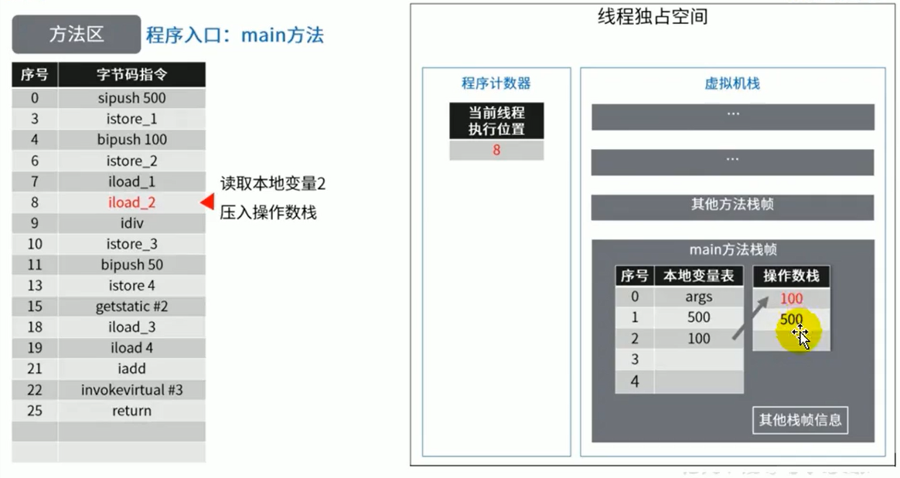

将500 和 100 进行一个除法运算，在把结果入栈


在最后就是输出流，需要调用运行时常量池的常量


最后调用invokevirtual（虚方法调用），然后返回


返回时


程序计数器始终计算的都是当前代码运行的位置，目的是为了方便记录 方法调用后能够正常返回，或者是进行了CPU切换后，也能回来到原来的代码进行执行。

## 方法区的演进细节

首先明确：只有Hotspot才有永久代。BEA JRockit、IBMJ9等来说，是不存在永久代的概念的。原则上如何实现方法区属于虚拟机实现细节，不受《Java虚拟机规范》管束，并不要求统一

Hotspot中方法区的变化：

| JDK1.6及以前 | 有永久代，静态变量存储在永久代上                             |
| ------------ | ------------------------------------------------------------ |
| JDK1.7       | 有永久代，但已经逐步 “去永久代”，**字符串常量池，静态变量移除，保存在堆中** |
| JDK1.8       | 无永久代，类型信息，字段，方法，常量保存在本地内存的元空间，但**字符串常量池、静态变量仍然在堆中。** |

JDK6的时候


JDK7的时候


JDK8的时候，元空间大小只受物理内存影响


### 为什么永久代要被元空间替代？

JRockit是和HotSpot融合后的结果，因为JRockit没有永久代，所以他们不需要配置永久代

随着Java8的到来，HotSpot VM中再也见不到永久代了。但是这并不意味着类的元数据信息也消失了。这些数据被移到了一个与堆不相连的本地内存区域，这个区域叫做元空间（Metaspace）。

由于类的元数据分配在本地内存中，元空间的最大可分配空间就是系统可用内存空间，这项改动是很有必要的，原因有：

- **永久代设置空间大小是很难确定的**。

在某些场景下，如果动态加载类过多，容易产生Perm区的oom。比如某个实际Web工
程中，因为功能点比较多，在运行过程中，要不断动态加载很多类，经常出现致命错误。

“Exception in thread‘dubbo client x.x connector'java.lang.OutOfMemoryError:PermGen space”

而元空间和永久代之间最大的区别在于：元空间并不在虚拟机中，而是使用本地内存。
因此，默认情况下，元空间的大小仅受本地内存限制。

- **对永久代进行调优是很困难的**。
  - 主要是为了降低Full GC

有些人认为方法区（如HotSpot虚拟机中的元空间或者永久代）是没有垃圾收集行为的，其实不然。《Java虚拟机规范》对方法区的约束是非常宽松的，提到过可以不要求虚拟机在方法区中实现垃圾收集。事实上也确实有未实现或未能完整实现方法区类型卸载的收集器存在（如JDK11时期的ZGC收集器就不支持类卸载）。
一般来说这个区域的回收效果比较难令人满意，尤其是类型的卸载，条件相当苛刻。但是这部分区域的回收有时又确实是必要的。以前sun公司的Bug列表中，曾出现过的若干个严重的Bug就是由于低版本的HotSpot虚拟机对此区域未完全回收而导致内存泄漏

方法区的垃圾收集主要回收两部分内容：**常量池中废弃的常量和不在使用的类型**

### StringTable为什么要调整位置

jdk7中将StringTable放到了堆空间中。因为**永久代的回收效率很低**，在**full gc**的时候才会触发。而full-gc是老年代的空间不足、永久代不足时才会触发。

这就导致**stringTable回收效率不高**。而我们开发中会有大量的字符串被创建，回收效率低，导致永久代内存不足。放到堆里，能及时回收内存。

### 静态变量存放在那里？

静态引用对应的对象实体始终都存在堆空间

可以使用 jhsdb.ext，需要在jdk9的时候才引入的

staticobj随着Test的类型信息存放在方法区，instanceobj随着Test的对象实例存放在Java堆，localobject则是存放在foo（）方法栈帧的局部变量表中。


测试发现：三个对象的数据在内存中的地址都落在Eden区范围内，所以结论：**只要是对象实例必然会在Java堆中分配**。

接着，找到了一个引用该staticobj对象的地方，是在一个java.lang.Class的实例里，并且给出了这个实例的地址，通过Inspector查看该对象实例，可以清楚看到这确实是一个java.lang.Class类型的对象实例，里面有一个名为staticobj的实例字段：


从《Java虚拟机规范》所定义的概念模型来看，所有Class相关的信息都应该存放在方法区之中，但方法区该如何实现，《Java虚拟机规范》并未做出规定，这就成了一件允许不同虚拟机自己灵活把握的事情。JDK7及其以后版本的HotSpot虚拟机选择把静态变量与类型在Java语言一端的映射class对象存放在一起，存储于Java堆之中，从我们的实验中也明确验证了这一点

## 方法区的垃圾回收

有些人认为方法区（如Hotspot虚拟机中的元空间或者永久代）是没有垃圾收集行为的，其实不然。《Java虚拟机规范》对方法区的约束是非常宽松的，提到过可以不要求虚拟机在方法区中实现垃圾收集。事实上也确实有未实现或未能完整实现方法区类型卸载的收集器存在（如JDK11时期的zGC收集器就不支持类卸载）。

一般来说这个区域的回收效果比较难令人满意，尤其是类型的卸载，条件相当苛刻。但是这部分区域的回收有时又确实是必要的。以前sun公司的Bug列表中，曾出现过的若干个严重的Bug就是由于低版本的HotSpot虚拟机对此区域未完全回收而导致内存泄漏。

方法区的垃圾收集主要回收两部分内容：**常量池中废弃的常量和不再使用的类型**。

先来说说方法区内常量池之中主要存放的两大类常量：字面量和符号引用。字面量比较接近Java语言层次的常量概念，如文本字符串、被声明为final的常量值等。而符号引用则属于编译原理方面的概念，包括下面三类常量：

- 类和接口的全限定名
- 字段的名称和描述符
- 方法的名称和描述符

HotSpot虚拟机对常量池的回收策略是很明确的，只要常量池中的常量没有被任何地方引用，就可以被回收。

回收废弃常量与回收Java堆中的对象非常类似。（关于常量的回收比较简单，重点是类的回收）

判定一个常量是否“废弃”还是相对简单，而要判定一个类型是否属于“**不再被使用的类**”的条件就比较苛刻了。需要同时满足下面三个条件：

- 该类所有的实例都已经被回收，也就是Java堆中不存在该类及其任何派生子类的实例。
  加载该类的类加载器已经被回收，这个条件除非是经过精心设计的可替换类加载器的场景，如osGi、JSP的重加载等，否则通常是很难达成的。
- 该类对应的java.lang.C1ass对象没有在任何地方被引用，无法在任何地方通过反射访问该类的方法。I Java虚拟机被允许对满足上述三个条件的无用类进行回收，这里说的仅仅是“被允许”，而并不是和对象一样，没有引用了就必然会回收。关于是否要对类型进行回收，HotSpot虚拟机提供了-Xnoclassgc参数进行控制，还可以使用-verbose:class 以及 -XX：+TraceClass-Loading、-XX：+TraceClassUnLoading查看类加载和卸载信息
- 在大量使用反射、动态代理、CGLib等字节码框架，动态生成JSP以及oSGi这类频繁自定义类加载器的场景中，通常都需要Java虚拟机具备类型卸载的能力，以保证不会对方法区造成过大的内存压力。

## 总结


### 常见面试题

百度
三面：说一下JVM内存模型吧，有哪些区？分别干什么的？

蚂蚁金服：
Java8的内存分代改进
JVM内存分哪几个区，每个区的作用是什么？
一面：JVM内存分布/内存结构？栈和堆的区别？堆的结构？为什么两个survivor区？
二面：Eden和survior的比例分配

小米：
jvm内存分区，为什么要有新生代和老年代

字节跳动：
二面：Java的内存分区
二面：讲讲vm运行时数据库区
什么时候对象会进入老年代？

京东：
JVM的内存结构，Eden和Survivor比例。
JVM内存为什么要分成新生代，老年代，持久代。新生代中为什么要分为Eden和survivor。

天猫：
一面：Jvm内存模型以及分区，需要详细到每个区放什么。
一面：JVM的内存模型，Java8做了什么改

拼多多：
JVM内存分哪几个区，每个区的作用是什么？

美团：
java内存分配
jvm的永久代中会发生垃圾回收吗？
一面：jvm内存分区，为什么要有新生代和老年代？

# 10.对象实例化内存布局与访问定位

## 对象实例化

### 面试题

- 对象在JVM中是怎么存储的？
- 对象头信息里面有哪些东西？
- Java对象头有什么？

从对象创建的方式 和 步骤开始说


### 对象创建方式

- new：最常见的方式、单例类中调用getInstance的静态类方法，XXXFactory的静态方法
- Class的newInstance方法：在JDK9里面被标记为过时的方法，因为只能调用空参构造器
- Constructor的newInstance(XXX)：反射的方式，可以调用空参的，或者带参的构造器
- 使用clone()：不调用任何的构造器，要求当前的类需要实现Cloneable接口中的clone接口
- 使用序列化：序列化一般用于Socket的网络传输
- 第三方库 Objenesis

### 创建对象的步骤

#### 判断对象对应的类是否加载、链接、初始化

虚拟机遇到一条new指令，首先去检查这个指令的参数能否在Metaspace的常量池中定位到一个类的符号引用，并且检查这个符号引用代表的类是否已经被加载，解析和初始化。（即判断类元信息是否存在）。如果没有，那么在双亲委派模式下，使用当前类加载器以ClassLoader + 包名 + 类名为key进行查找对应的 .class文件，如果没有找到文件，则抛出ClassNotFoundException异常，如果找到，则进行类加载，并生成对应的Class对象。

#### 为对象分配内存

首先计算对象占用空间的大小，接着在堆中划分一块内存给新对象。如果实例成员变量是引用变量，仅分配引用变量空间即可，即4个字节大小

- 如果内存规整：指针碰撞

- 如果内存不规整
  - 虚拟表需要维护一个列表
  - 空闲列表分配

如果内存是规整的，那么虚拟机将采用的是指针碰撞法（Bump The Point）来为对象分配内存。

意思是所有用过的内存在一边，空闲的内存放另外一边，中间放着一个指针作为分界点的指示器，分配内存就仅仅是把指针指向空闲那边挪动一段与对象大小相等的距离罢了。如果垃圾收集器选择的是Serial ，ParNew这种基于压缩算法的，虚拟机采用这种分配方式。一般使用带Compact（整理）过程的收集器时，使用指针碰撞。

如果内存不是规整的，已使用的内存和未使用的内存相互交错，那么虚拟机将采用的是空闲列表来为对象分配内存。意思是虚拟机维护了一个列表，记录上那些内存块是可用的，再分配的时候从列表中找到一块足够大的空间划分给对象实例，并更新列表上的内容。这种分配方式成为了 “空闲列表（Free List）”

选择哪种分配方式由Java堆是否规整所决定，而Java堆是否规整又由所采用的垃圾收集器是否带有压缩整理功能决定。

#### 处理并发问题

- 采用CAS配上失败重试保证更新的原子性
- 每个线程预先分配TLAB - 通过设置 -XX:+UseTLAB参数来设置（区域加锁机制）
  - 在Eden区给每个线程分配一块区域

#### 初始化分配到的内存

给对象属性赋值的操作

- 属性的默认初始化
- 显示初始化
- 代码块中的初始化
- 构造器初始化

- 所有属性设置默认值，保证对象实例字段在不赋值可以直接使用

#### 设置对象的对象头

将对象的所属类（即类的元数据信息）、对象的HashCode和对象的GC信息、锁信息等数据存储在对象的对象头中。这个过程的具体设置方式取决于JVM实现。

#### 执行init方法进行初始化

在Java程序的视角看来，初始化才正式开始。初始化成员变量，执行实例化代码块，调用类的构造方法，并把堆内对象的首地址赋值给引用变量

因此一般来说（由字节码中跟随invokespecial指令所决定），new指令之后会接着就是执行方法，把对象按照程序员的意愿进行初始化，这样一个真正可用的对象才算完成创建出来。

### 对象实例化的过程

- 加载类元信息
- 为对象分配内存
- 处理并发问题
- 属性的默认初始化（零值初始化）
- 设置对象头信息
- 属性的显示初始化、代码块中初始化、构造器中初始化

## 对象内存布局


### 对象头

对象头包含了两部分，分别是 运行时元数据（Mark Word）和 类型指针

> 如果是数组，还需要记录数组的长度

#### 运行时元数据

- 哈希值（HashCode）
- GC分代年龄
- 锁状态标志
- 线程持有的锁
- 偏向线程ID
- 翩向时间戳

#### 类型指针

指向类元数据InstanceKlass，确定该对象所属的类型。指向的其实是方法区中存放的类元信息

### 实例数据（Instance Data）

#### 说明

不是必须的，也没有特别的含义，仅仅起到占位符的作用

### 小结


## 对象的访问定位

### 图示

JVM是如何通过栈帧中的对象引用访问到其内部的对象实例呢？


### 对象访问的两种方式

#### 句柄访问


句柄访问就是说栈的局部变量表中，记录的对象的引用，然后在堆空间中开辟了一块空间，也就是句柄池

#### 优点

reference中存储稳定句柄地址，对象被移动（垃圾收集时移动对象很普遍）时只会改变句柄中实例数据指针即可，reference本身不需要被修改

#### 直接指针（HotSpot采用）


直接指针是局部变量表中的引用，直接指向堆中的实例，在对象实例中有类型指针，指向的是方法区中的对象类型数据


# 11.直接内存 Direct Memory

不是虚拟机运行时数据区的一部分，也不是《Java虚拟机规范》中定义的内存区域。

直接内存是在Java堆外的、直接向系统申请的内存区间。

来源于NIO，通过存在堆中的DirectByteBuffer操作Native内存

通常，访问直接内存的速度会优于Java堆。即读写性能高。

- 因此出于性能考虑，读写频繁的场合可能会考虑使用直接内存。
- Java的NIO库允许Java程序使用直接内存，用于数据缓冲区

使用下列代码，直接分配本地内存空间

```java
int BUFFER = 1024*1024*1024; // 1GB
ByteBuffer byteBuffer = ByteBuffer.allocateDirect(BUFFER);
```

## 非直接缓存区和缓存区

原来采用BIO的架构，我们需要从用户态切换成内核态

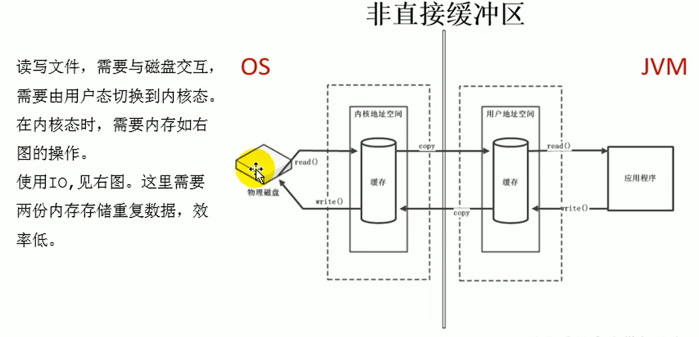

NIO的方式使用了缓存区的概念

## 存在的问题

也可能导致outofMemoryError异常

由于直接内存在Java堆外，因此它的大小不会直接受限于-xmx指定的最大堆大小，但是系统内存是有限的，Java堆和直接内存的总和依然受限于操作系统能给出的最大内存。
缺点

- 分配回收成本较高
- 不受JVM内存回收管理

直接内存大小可以通过MaxDirectMemorySize设置

如果不指定，默认与堆的最大值-xmx参数值一致


# 12.执行引擎

## 执行引擎概述

执行引擎属于JVM的下层，里面包括 解释器、及时编译器、垃圾回收器


执行引擎是Java虚拟机核心的组成部分之一。“虚拟机”是一个相对于“物理机”的概念，这两种机器都有代码执行能力，其区别是物理机的执行引擎是直接建立在处理器、缓存、指令集和操作系统层面上的，而虚拟机的执行引擎则是由软件自行实现的，因此可以不受物理条件制约地定制指令集与执行引擎的结构体系，能够执行那些不被硬件直接支持的指令集格式。

JVM的主要任务是负责装载字节码到其内部，但字节码并不能够直接运行在操作系统之上，因为字节码指令并非等价于本地机器指令，它内部包含的仅仅只是一些能够被JVM所识别的字节码指令、符号表，以及其他辅助信息。


那么，如果想要让一个Java程序运行起来，执行引擎（Execution Engine）的任务就是将字节码指令解释/编译为对应平台上的本地机器指令才可以。简单来说，JVM中的执行引擎充当了将高级语言翻译为机器语言的译者。


### 执行引擎的工作流程

- 执行引擎在执行的过程中究竟需要执行什么样的字节码指令完全依赖于PC寄存器。
- 每当执行完一项指令操作后，PC寄存器就会更新下一条需要被执行的指令地址。
- 当然方法在执行的过程中，执行引擎有可能会通过存储在局部变量表中的对象引用准确定位到存储在Java堆区中的对象实例信息，以及通过对象头中的元数据指针定位到目标对象的类型信息。


从外观上来看，所有的Java虚拟机的执行引擎输入，输出都是一致的：输入的是字节码二进制流，处理过程是字节码解析执行的等效过程，输出的是执行过程。

## Java代码编译和执行过程

大部分的程序代码转换成物理机的目标代码或虚拟机能执行的指令集之前，都需要经过上图中的各个步骤

- 前面橙色部分是生成字节码文件的过程，和JVM无关
- 后面蓝色和绿色才是JVM需要考虑的过程


Java代码编译是由Java源码编译器来完成，流程图如下所示：


Java字节码的执行是由JVM执行引擎来完成，流程图 如下所示


我们用一个总的图，来说说 解释器和编译器


### 什么是解释器（Interpreter）

当Java虚拟机启动时会根据预定义的规范对字节码采用逐行解释的方式执行，将每条字节码文件中的内容“翻译”为对应平台的本地机器指令执行。

### 什么是IT编译器

JIT（Just In Time Compiler）编译器：就是虚拟机将源代码直接编译成和本地机器平台相关的机器语言。

### 为什么Java是半编译半解释型语言

JDK1.e时代，将Java语言定位为“解释执行”还是比较准确的。再后来，Java也发展出可以直接生成本地代码的编译器。现在JVM在执行Java代码的时候，通常都会将解释执行与编译执行二者结合起来进行。

翻译成本地代码后，就可以做一个缓存操作，存储在方法区中

## 机器码、指令、汇编语言

### 机器码

各种用二进制编码方式表示的指令，叫做机器指令码。开始，人们就用它采编写程序，这就是机器语言。

机器语言虽然能够被计算机理解和接受，但和人们的语言差别太大，不易被人们理解和记忆，并且用它编程容易出差错。

用它编写的程序一经输入计算机，CPU直接读取运行，因此和其他语言编的程序相比，执行速度最快。

机器指令与CPU紧密相关，所以不同种类的CPU所对应的机器指令也就不同。

### 指令

由于机器码是有0和1组成的二进制序列，可读性实在太差，于是人们发明了指令。

指令就是把机器码中特定的0和1序列，简化成对应的指令（一般为英文简写，如mov，inc等），可读性稍好

由于不同的硬件平台，执行同一个操作，对应的机器码可能不同，所以不同的硬件平台的同一种指令（比如mov），对应的机器码也可能不同。

### 指令集

不同的硬件平台，各自支持的指令，是有差别的。因此每个平台所支持的指令，称之为对应平台的指令集。
如常见的

- x86指令集，对应的是x86架构的平台
- ARM指令集，对应的是ARM架构的平台

### 汇编语言

由于指令的可读性还是太差，于是人们又发明了汇编语言。

在汇编语言中，用助记符（Mnemonics）代替机器指令的操作码，用地址符号（Symbo1）或标号（Labe1）代替指令或操作数的地址。在不同的硬件平台，汇编语言对应着不同的机器语言指令集，通过汇编过程转换成机器指令。

>由于计算机只认识指令码，所以用汇编语言编写的程序还必须翻译成机器指令码，计算机才能识别和执行。

### 高级语言

为了使计算机用户编程序更容易些，后来就出现了各种高级计算机语言。

高级语言比机器语言、汇编语言更接近人的语言当计算机执行高级语言编写的程序时，仍然需要把程序解释和编译成机器的指令码。完成这个过程的程序就叫做解释程序或编译程序。


高级语言也不是直接翻译成 机器指令，而是翻译成汇编语言吗，如下面说的C和C++

### C、C++源程序执行过程

编译过程又可以分成两个阶段：编译和汇编。

编译过程：是读取源程序（字符流），对之进行词法和语法的分析，将高级语言指令转换为功能等效的汇编代码

汇编过程：实际上指把汇编语言代码翻译成目标机器指令的过程。


### 字节码

字节码是一种中间状态（中间码）的二进制代码（文件），它比机器码更抽象，需要直译器转译后才能成为机器码

字节码主要为了实现特定软件运行和软件环境、与硬件环境无关。

字节码的实现方式是通过编译器和虚拟机器。编译器将源码编译成字节码，特定平台上的虚拟机器将字节码转译为可以直接执行的指令。

- 字节码典型的应用为：Java bytecode

## 解释器

JVM设计者们的初衷仅仅只是单纯地为了满足Java程序实现跨平台特性，因此避免采用静态编译的方式直接生成本地机器指令，从而诞生了实现解释器在运行时采用逐行解释字节码执行程序的想法。


为什么Java源文件不直接翻译成JMV，而是翻译成字节码文件？可能是因为直接翻译的代码是比较大的

解释器真正意义上所承担的角色就是一个运行时“翻译者”，将字节码文件中的内容“翻译”为对应平台的本地机器指令执行。

当一条字节码指令被解释执行完成后，接着再根据PC寄存器中记录的下一条需要被执行的字节码指令执行解释操作。

### 解释器分类

在Java的发展历史里，一共有两套解释执行器，即古老的字节码解释器、现在普遍使用的模板解释器。

字节码解释器在执行时通过纯软件代码模拟字节码的执行，效率非常低下。

而模板解释器将每一条字节码和一个模板函数相关联，模板函数中直接产生这条字节码执行时的机器码，从而很大程度上提高了解释器的性能。

在HotSpot VM中，解释器主要由Interpreter模块和Code模块构成。

- Interpreter模块：实现了解释器的核心功能
- Code模块：用于管理HotSpot VM在运行时生成的本地机器指令

### 现状

由于解释器在设计和实现上非常简单，因此除了Java语言之外，还有许多高级语言同样也是基于解释器执行的，比如Python、Per1、Ruby等。但是在今天，基于解释器执行已经沦落为低效的代名词，并且时常被一些C/C++程序员所调侃。

为了解决这个问题，JVM平台支持一种叫作即时编译的技术。即时编译的目的是避免函数被解释执行，而是将整个函数体编译成为机器码，每次函数执行时，只执行编译后的机器码即可，这种方式可以使执行效率大幅度提升。

不过无论如何，基于解释器的执行模式仍然为中间语言的发展做出了不可磨灭的贡献。

## JIT编译器

### Java代码的执行分类

第一种是将源代码编译成字节码文件，然后在运行时通过解释器将字节码文件转为机器码执行

第二种是编译执行（直接编译成机器码）。现代虚拟机为了提高执行效率，会使用即时编译技术（JIT，Just In Time）将方法编译成机器码后再执行

HotSpot VM是目前市面上高性能虚拟机的代表作之一。它采用解释器与即时编译器并存的架构。在Java虚拟机运行时，解释器和即时编译器能够相互协作，各自取长补短，尽力去选择最合适的方式来权衡编译本地代码的时间和直接解释执行代码的时间。

在今天，Java程序的运行性能早已脱胎换骨，已经达到了可以和C/C++ 程序一较高下的地步。

### 问题来了

有些开发人员会感觉到诧异，既然HotSpot VM中已经内置JIT编译器了，那么为什么还需要再使用解释器来“拖累”程序的执行性能呢？比如JRockit VM内部就不包含解释器，字节码全部都依靠即时编译器编译后执行。

- JRockit虚拟机是砍掉了解释器，也就是只采及时编译器。那是因为呢JRockit只部署在服务器上，一般已经有时间让他进行指令编译的过程了，对于响应来说要求不高，等及时编译器的编译完成后，就会提供更好的性能

首先明确：
当程序启动后，解释器可以马上发挥作用，省去编译的时间，立即执行。
编译器要想发挥作用，把代码编译成本地代码，需要一定的执行时间。但编译为本地代码后，执行效率高。

所以：
尽管JRockit VM中程序的执行性能会非常高效，但程序在启动时必然需要花费更长的时间来进行编译。对于服务端应用来说，启动时间并非是关注重点，但对于那些看中启动时间的应用场景而言，或许就需要采用解释器与即时编译器并存的架构来换取一个平衡点。

在此模式下，当Java虚拟器启动时，解释器可以首先发挥作用，而不必等待即时编译器全部编译完成后再执行，这样可以省去许多不必要的编译时间。随着时间的推移，编译器发挥作用，把越来越多的代码编译成本地代码，获得更高的执行效率。

同时，解释执行在编译器进行激进优化不成立的时候，作为编译器的“逃生门”。

### HotSpot JVM执行方式

当虚拟机启动的时候，解释器可以首先发挥作用，而不必等待即时编译器全部编译完成再执行，这样可以省去许多不必要的编译时间。并且随着程序运行时间的推移，即时编译器逐渐发挥作用，根据热点探测功能，将有价值的字节码编译为本地机器指令，以换取更高的程序执行效率。

### 案例

注意解释执行与编译执行在线上环境微妙的辩证关系。机器在热机状态可以承受的负载要大于冷机状态。如果以热机状态时的流量进行切流，可能使处于冷机状态的服务器因无法承载流量而假死。

在生产环境发布过程中，以分批的方式进行发布，根据机器数量划分成多个批次，每个批次的机器数至多占到整个集群的1/8。曾经有这样的故障案例：某程序员在发布平台进行分批发布，在输入发布总批数时，误填写成分为两批发布。如果是热机状态，在正常情况下一半的机器可以勉强承载流量，但由于刚启动的JVM均是解释执行，还没有进行热点代码统计和JIT动态编译，导致机器启动之后，当前1/2发布成功的服务器马上全部宕机，此故障说明了JIT的存在。—阿里团队


### 概念解释

- Java 语言的“编译期”其实是一段“不确定”的操作过程，因为它可能是指一个前端编译器（其实叫“编译器的前端”更准确一些）把.java文件转变成.class文件的过程；也可能是指虚拟机的后端运行期编译器（JIT编译器，Just In Time Compiler）
- 把字节码转变成机器码的过程。
- 还可能是指使用静态提前编译器（AOT编译器，Ahead of Time Compiler）直接把.java文件编译成本地机器代码的过程。

前端编译器：Sun的Javac、Eclipse JDT中的增量式编译器（ECJ）。

JIT编译器：HotSpot VM的C1、C2编译器。

AOT 编译器：GNU Compiler for the Java（GCJ）、Excelsior JET。

### 热点探测技术

一个被多次调用的方法，或者是一个方法体内部循环次数较多的循环体都可以被称之为“热点代码”，因此都可以通过JIT编译器编译为本地机器指令。由于这种编译方式发生在方法的执行过程中，因此被称之为栈上替换，或简称为OSR（On Stack Replacement）编译。

一个方法究竟要被调用多少次，或者一个循环体究竟需要执行多少次循环才可以达到这个标准？必然需要一个明确的阈值，JIT编译器才会将这些“热点代码”编译为本地机器指令执行。这里主要依靠热点探测功能。

目前HotSpot VM所采用的热点探测方式是基于计数器的热点探测。

采用基于计数器的热点探测，HotSpot V将会为每一个方法都建立2个不同类型的计数器，分别为方法调用计数器（Invocation Counter）和回边计数器（Back Edge Counter）。

- 方法调用计数器用于统计方法的调用次数
- 回边计数器则用于统计循环体执行的循环次数

### 方法调用计数器

这个计数器就用于统计方法被调用的次数，它的默认阀值在Client模式下是1500次，在Server模式下是10000次。超过这个阈值，就会触发JIT编译。

这个阀值可以通过虚拟机参数 -XX:CompileThreshold 来人为设定。

当一个方法被调用时，会先检查该方法是否存在被JIT编译过的版本，如果存在，则优先使用编译后的本地代码来执行。如果不存在已被编译过的版本，则将此方法的调用计数器值加1，然后判断方法调用计数器与回边计数器值之和是否超过方法调用计数器的阀值。如果已超过阈值，那么将会向即时编译器提交一个该方法的代码编译请求。


### 热点衰减

 如果不做任何设置，方法调用计数器统计的并不是方法被调用的绝对次数，而是一个相对的执行频率，即一段时间之内方法被调用的次数。当超过一定的时间限度，如果方法的调用次数仍然不足以让它提交给即时编译器编译，那这个方法的调用计数器就会被减少一半，这个过程称为方法调用计数器热度的衰减（Counter Decay），而这段时间就称为此方法统计的半衰周期（Counter Half Life Time）

- 半衰周期是化学中的概念，比如出土的文物通过查看C60来获得文物的年龄

进行热度衰减的动作是在虚拟机进行垃圾收集时顺便进行的，可以使用虚拟机参数
-XX:-UseCounterDecay 来关闭热度衰减，让方法计数器统计方法调用的绝对次数，这样，只要系统运行时间足够长，绝大部分方法都会被编译成本地代码。

另外，可以使用-XX:CounterHalfLifeTime参数设置半衰周期的时间，单位是秒。

### 回边计数器

它的作用是统计一个方法中循环体代码执行的次数，在字节码中遇到控制流向后跳转的指令称为“回边”（Back Edge）。显然，建立回边计数器统计的目的就是为了触发OSR编译。


### HotSpotVM 可以设置程序==执行方法==

缺省情况下HotSpot VM是采用==解释器与即时编译器并存==的架构，当然开发人员可以根据具体的应用场景，通过命令显式地为Java虚拟机指定在运行时到底是完全采用解释器执行，还是完全采用即时编译器执行。如下所示：

- -Xint：完全采用解释器模式执行程序；
- -Xcomp：完全采用即时编译器模式执行程序。如果即时编译出现问题，解释器会介入执行
- -Xmixed：采用解释器+即时编译器的混合模式共同执行程序。


### HotSpotVM中 JIT 分类

JIT的编译器还分为了两种，分别是C1和C2，在HotSpot VM中内嵌有两个JIT编译器，分别为Client Compiler和Server Compiler，但大多数情况下我们简称为C1编译器 和 C2编译器。开发人员可以通过如下命令显式指定Java虚拟机在运行时到底使用哪一种即时编译器，如下所示：

- -client：指定Java虚拟机运行在Client模式下，并使用C1编译器；
  - C1编译器会对字节码进行简单和可靠的优化，耗时短。以达到更快的编译速度。

- -server：指定Java虚拟机运行在server模式下，并使用C2编译器。
  - C2进行耗时较长的优化，以及激进优化。但优化的代码执行效率更高。（使用C++）

### C1 和 C2编译器不同的优化策略

在不同的编译器上有不同的优化策略，C1编译器上主要有方法内联，去虚拟化、元余消除。

- 方法内联：将引用的函数代码编译到引用点处，这样可以减少栈帧的生成，减少参数传递以及跳转过程
- 去虚拟化：对唯一的实现樊进行内联
- 冗余消除：在运行期间把一些不会执行的代码折叠掉

C2的优化主要是在全局层面，逃逸分析是优化的基础。基于逃逸分析在C2上有如下几种优化：

- 标量替换：用标量值代替聚合对象的属性值
- 栈上分配：对于未逃逸的对象分配对象在栈而不是堆
- 同步消除：清除同步操作，通常指synchronized

### 分层编译策略

分层编译（Tiered Compilation）策略：程序解释执行（不开启性能监控）可以触发C1编译，将字节码编译成机器码，可以进行简单优化，也可以加上性能监控，C2编译会根据性能监控信息进行激进优化。

不过在Java7版本之后，一旦开发人员在程序中显式指定命令“-server"时，默认将会开启分层编译策略，由C1编译器和C2编译器相互协作共同来执行编译任务。

### 总结

- 一般来讲，JIT编译出来的机器码性能比解释器搞
- C2编译器启动时长比C1慢，系统稳定执行以后，C2编译器执行速度远快于C1编译器

### AOT编译器

jdk9引入了AoT编译器（静态提前编译器，Ahead of Time Compiler）

Java 9引入了实验性AOT编译工具aotc。它借助了Graal编译器，将所输入的Java类文件转换为机器码，并存放至生成的动态共享库之中。

所谓AOT编译，是与即时编译相对立的一个概念。我们知道，即时编译指的是在程序的运行过程中，将字节码转换为可在硬件上直接运行的机器码，并部署至托管环境中的过程。而AOT编译指的则是，在程序运行之前，便将字节码转换为机器码的过程。

```
.java -> .class -> (使用jaotc) -> .so
```

最大的好处：Java虚拟机加载已经预编译成二进制库，可以直接执行。不必等待及时编译器的预热，减少Java应用给人带来“第一次运行慢” 的不良体验

缺点：

- 破坏了 java  “ 一次编译，到处运行”，必须为每个不同的硬件，OS编译对应的发行包
- 降低了Java链接过程的动态性，加载的代码在编译器就必须全部已知。
- 还需要继续优化中，最初只支持Linux X64 java base

### 写到最后

- 自JDK10起，HotSpot又加入了一个全新的及时编译器：Graal编译器
- 编译效果短短几年时间就追评了G2编译器，未来可期
- 目前，带着实验状态标签，需要使用开关参数去激活才能使用

```
-XX:+UnlockExperimentalvMOptions -XX:+UseJVMCICompiler
```

# 13.StringTable

## String的基本特性

- String：字符串，使用一对 ”” 引起来表示
  - String s1 = "mogublog" ;   // 字面量的定义方式
  - String s2 =  new String("moxi"); 
- string声明为final的，不可被继承
- String实现了Serializable接口：表示字符串是支持序列化的。实现了Comparable接口：表示string可以比较大小
- string在jdk8及以前内部定义了final char[] value用于存储字符串数据。JDK9时改为byte[]

### 为什么JDK9改变了结构

String类的当前实现将字符存储在char数组中，每个字符使用两个字节(16位)。从许多不同的应用程序收集的数据表明，字符串是堆使用的主要组成部分，而且，大多数字符串对象只包含拉丁字符。这些字符只需要一个字节的存储空间，因此这些字符串对象的内部char数组中有一半的空间将不会使用。

我们建议改变字符串的内部表示clasš从utf - 16字符数组到字节数组+一个encoding-flag字段。新的String类将根据字符串的内容存储编码为ISO-8859-1/Latin-1(每个字符一个字节)或UTF-16(每个字符两个字节)的字符。编码标志将指示使用哪种编码。

结论：String再也不用char[] 来存储了，改成了**byte [] 加上编码标记**，节约了一些空间

```java
// 之前
private final char value[];
// 之后
private final byte[] value
```

同时基于String的数据结构，例如StringBuffer和StringBuilder也同样做了修改

### String的不可变性

String：代表不可变的字符序列。简称：不可变性。

>当对字符串重新赋值时，需要重写指定内存区域赋值，不能使用原有的value进行赋值。
>当对现有的字符串进行连接操作时，也需要重新指定内存区域赋值，不能使用原有的value进行赋值。
>当调用string的replace（）方法修改指定字符或字符串时，也需要重新指定内存区域赋值，不能使用原有的value进行赋值。
>通过字面量的方式（区别于new）给一个字符串赋值，此时的字符串值声明在字符串常量池中。

代码

```java
/**
 * String的不可变性
 *
 * @author: 陌溪
 * @create: 2020-07-11-8:57
 */
public class StringTest1 {

    public static void test1() {
        // 字面量定义的方式，“abc”存储在字符串常量池中
        String s1 = "abc";
        String s2 = "abc";
        System.out.println(s1 == s2);
        s1 = "hello";
        System.out.println(s1 == s2);
        System.out.println(s1);
        System.out.println(s2);
        System.out.println("----------------");
    }

    public static void test2() {
        String s1 = "abc";
        String s2 = "abc";
        // 只要进行了修改，就会重新创建一个对象，这就是不可变性
        s2 += "def";
        System.out.println(s1);
        System.out.println(s2);
        System.out.println("----------------");
    }

    public static void test3() {
        String s1 = "abc";
        String s2 = s1.replace('a', 'm');
        System.out.println(s1);
        System.out.println(s2);
    }

    public static void main(String[] args) {
        test1();
        test2();
        test3();
    }
}
```

运行结果

```
true
false
hello
abc
----------------
abc
abcdef
----------------
abc
mbc
```

### 面试题

```java
/**
 * 面试题
 *
 * @author: 陌溪
 * @create: 2020-07-11-9:05
 */
public class StringExer {
    String str = new String("good");
    char [] ch = {'t','e','s','t'};

    public void change(String str, char ch []) {
        str = "test ok";
        ch[0] = 'b';
    }

    public static void main(String[] args) {
        StringExer ex = new StringExer();
        ex.change(ex.str, ex.ch);
        System.out.println(ex.str);
        System.out.println(ex.ch);
    }
}
```

输出结果

```
good
best
```

### 注意

**字符串常量池是不会存储相同内容的字符串的**

String的stringPool是一个固定大小的，默认值大小长度是1009。如果放进string Pool的string非常多，就会造成Hash冲突严重，从而导致链表会很长，而链表长了后直接会造成的影响就是当调用string.intern时性能会大幅下降。

使用-XX:StringTableSize可设置StringTable的长度

在jdk6中stringTable是固定的，就是1009的长度，所以如果常量池中的字符串过多就会导致效率下降很快。stringTablesize设置没有要求

在jdk7中，stringTable的长度默认值是60013，

在JDK8中，StringTable可以设置的最小值为1009

## String的内存分配

在Java语言中有8种基本数据类型和一种比较特殊的类型string。这些类型为了使它们在运行过程中速度更快、更节省内存，都提供了一种常量池的概念。

常量池就类似一个Java系统级别提供的缓存。8种基本数据类型的常量池都是系统协调的，string类型的常量池比较特殊。它的主要使用方法有两种。

直接使用双引号声明出来的String对象会直接存储在常量池中。

- 比如：string info="atguigu.com"；

如果不是用双引号声明的string对象，可以使用string提供的intern（）方法。

Java 6及以前，字符串常量池存放在永久代

Java 7中 oracle的工程师对字符串池的逻辑做了很大的改变，即将字符串常量池的位置调整到Java堆内

>所有的字符串都保存在堆（Heap）中，和其他普通对象一样，这样可以让你在进行调优应用时仅需要调整堆大小就可以了。
>
>字符串常量池概念原本使用得比较多，但是这个改动使得我们有足够的理由让我们重新考虑在Java 7中使用string.intern（）。

Java8元空间，字符串常量在堆


### 为什么StringTable从永久代调整到堆中

在JDK 7中，interned字符串不再在Java堆的永久生成中分配，而是在Java堆的主要部分(称为年轻代和年老代)中分配，与应用程序创建的其他对象一起分配。此更改将导致驻留在主Java堆中的数据更多，驻留在永久生成中的数据更少，因此可能需要调整堆大小。由于这一变化，大多数应用程序在堆使用方面只会看到相对较小的差异，但加载许多类或大量使用字符串的较大应用程序会出现这种差异。intern()方法会看到更显著的差异。

- 永久代的默认比较小
- 永久代垃圾回收频率低

## String的基本操作

Java语言规范里要求完全相同的字符串字面量，应该包含同样的Unicode字符序列（包含同一份码点序列的常量），并且必须是指向同一个String类实例。

## 字符串拼接操作

- 常量与常量的拼接结果在常量池，原理是编译期优化
- 常量池中不会存在相同内容的变量
- 只要其中有一个是变量，结果就在堆中。变量拼接的原理是StringBuilder
- 如果拼接的结果调用intern()方法，则主动将常量池中还没有的字符串对象放入池中，并返回此对象地址

```java
    public static void test1() {
        String s1 = "a" + "b" + "c";  // 得到 abc的常量池
        String s2 = "abc"; // abc存放在常量池，直接将常量池的地址返回
        /**
         * 最终java编译成.class，再执行.class
         */
        System.out.println(s1 == s2); // true，因为存放在字符串常量池
        System.out.println(s1.equals(s2)); // true
    }

	public static void test2() {
        String s1 = "javaEE";
        String s2 = "hadoop";
        String s3 = "javaEEhadoop";
        String s4 = "javaEE" + "hadoop";    
        String s5 = s1 + "hadoop";
        String s6 = "javaEE" + s2;
        String s7 = s1 + s2;

        System.out.println(s3 == s4); // true
        System.out.println(s3 == s5); // false
        System.out.println(s3 == s6); // false
        System.out.println(s3 == s7); // false
        System.out.println(s5 == s6); // false
        System.out.println(s5 == s7); // false
        System.out.println(s6 == s7); // false

        String s8 = s6.intern();
        System.out.println(s3 == s8); // true
    }
```

从上述的结果我们可以知道：

如果拼接符号的前后出现了变量，则相当于在堆空间中new String()，具体的内容为拼接的结果

而调用**intern方法**，则会判断字符串常量池中是否存在JavaEEhadoop值，如果存在则返回常量池中的值，否者就在常量池中创建,并**返回此对象的地址**。

### 底层原理

拼接操作的底层其实使用了StringBuilder


s1 + s2的执行细节

- StringBuilder s = new StringBuilder();
- s.append(s1);
- s.append(s2);
- s.toString();  -> 类似于new String("ab");

在JDK5之后，使用的是StringBuilder，在JDK5之前使用的是StringBuffer

| String                                                       | StringBuffer                                                 | StringBuilder    |
| ------------------------------------------------------------ | ------------------------------------------------------------ | ---------------- |
| String的值是不可变的，这就导致每次对String的操作都会生成新的String对象，不仅效率低下，而且浪费大量优先的内存空间 | StringBuffer是可变类，和线程安全的字符串操作类，任何对它指向的字符串的操作都不会产生新的对象。每个StringBuffer对象都有一定的缓冲区容量，当字符串大小没有超过容量时，不会分配新的容量，当字符串大小超过容量时，会自动增加容量 | 可变类，速度更快 |
| 不可变                                                       | 可变                                                         | 可变             |
|                                                              | 线程安全                                                     | 线程不安全       |
|                                                              | 多线程操作字符串                                             | 单线程操作字符串 |

注意，我们左右两边如果是变量的话，就是需要new StringBuilder进行拼接，但是如果使用的是final修饰，则是从常量池中获取。所以说拼接符号左右两边都是字符串常量或常量引用 则仍然使用编译器优化。也就是说被final修饰的变量，将会变成常量，类和方法将不能被继承、

- 在开发中，能够使用final的时候，建议使用上

```java
public static void test4() {
    final String s1 = "a";
    final String s2 = "b";
    String s3 = "ab";
    String s4 = s1 + s2;
    System.out.println(s3 == s4);
}
```

运行结果

```
true
```

### 拼接操作和append性能对比

```java
    public static void method1(int highLevel) {
        String src = "";
        for (int i = 0; i < highLevel; i++) {
            src += "a"; // 每次循环都会创建一个StringBuilder对象
        }
    }

    public static void method2(int highLevel) {
        StringBuilder sb = new StringBuilder();
        for (int i = 0; i < highLevel; i++) {
            sb.append("a");
        }
    }
```

方法1耗费的时间：4005ms，方法2消耗时间：7ms

结论：

- 通过StringBuilder的append()方式添加字符串的效率，要远远高于String的字符串拼接方法

好处

- StringBuilder的append的方式，自始至终只创建一个StringBuilder的对象
- 对于字符串拼接的方式，还需要创建很多StringBuilder对象和 调用toString时候创建的String对象
- 内存中由于创建了较多的StringBuilder和String对象，内存占用过大，如果进行GC那么将会耗费更多的时间

改进的空间

- 我们使用的是StringBuilder的空参构造器，默认的字符串容量是16，然后将原来的字符串拷贝到新的字符串中， 我们也可以默认初始化更大的长度，减少扩容的次数
- 因此在实际开发中，我们能够确定，前前后后需要添加的字符串不高于某个限定值，那么建议使用构造器创建一个阈值的长度

## intern()的使用

intern是一个native方法，调用的是底层C的方法

字符串池最初是空的，由String类私有地维护。在调用intern方法时，如果池中已经包含了由equals(object)方法确定的与该字符串对象相等的字符串，则返回池中的字符串。否则，该字符串对象将被添加到池中，并返回对该字符串对象的引用。

如果不是用双引号声明的string对象，可以使用string提供的intern方法：intern方法会从字符串常量池中查询当前字符串是否存在，若不存在就会将当前字符串放入常量池中。

比如：

```
String myInfo = new string("I love atguigu").intern();
```

也就是说，如果在任意字符串上调用string.intern方法，那么其返回结果所指向的那个类实例，必须和直接以常量形式出现的字符串实例完全相同。因此，下列表达式的值必定是true

```java
（"a"+"b"+"c"）.intern（）=="abc"
```

通俗点讲，Interned string就是确保字符串在内存里只有一份拷贝，这样可以节约内存空间，加快字符串操作任务的执行速度。注意，这个值会被存放在字符串内部池（String Intern Pool）

### intern的空间效率测试

我们通过测试一下，使用了intern和不使用的时候，其实相差还挺多的

```java
/**
 * 使用Intern() 测试执行效率
 * @author: 陌溪
 * @create: 2020-07-11-15:19
 */
public class StringIntern2 {
    static final int MAX_COUNT = 1000 * 10000;
    static final String[] arr = new String[MAX_COUNT];

    public static void main(String[] args) {
        Integer [] data = new Integer[]{1,2,3,4,5,6,7,8,9,10};
        long start = System.currentTimeMillis();
        for (int i = 0; i < MAX_COUNT; i++) {
            arr[i] = new String(String.valueOf(data[i%data.length])).intern();
        }
        long end = System.currentTimeMillis();
        System.out.println("花费的时间为：" + (end - start));

        try {
            Thread.sleep(1000000);
        } catch (Exception e) {
            e.getStackTrace();
        }
    }
}
```

**结论**：对于程序中大量使用存在的字符串时，尤其存在很多已经重复的字符串时，使用intern()方法能够节省内存空间。

大的网站平台，需要内存中存储大量的字符串。比如社交网站，很多人都存储：北京市、海淀区等信息。这时候如果字符串都调用intern() 方法，就会很明显降低内存的大小。

## 面试题

### new String("ab")会创建几个对象

```java
/**
 * new String("ab") 会创建几个对象？ 看字节码就知道是2个对象
 *
 * @author: 陌溪
 * @create: 2020-07-11-11:17
 */
public class StringNewTest {
    public static void main(String[] args) {
        String str = new String("ab");
    }
}
```

我们转换成字节码来查看

```
 0 new #2 <java/lang/String>
 3 dup
 4 ldc #3 <ab>
 6 invokespecial #4 <java/lang/String.<init>>
 9 astore_1
10 return
```

这里面就是两个对象

- 一个对象是：new关键字在堆空间中创建
- 另一个对象：字符串常量池中的对象

### new String("a") + new String("b") 会创建几个对象

```java
/**
 * new String("ab") 会创建几个对象？ 看字节码就知道是2个对象
 *
 * @author: 陌溪
 * @create: 2020-07-11-11:17
 */
public class StringNewTest {
    public static void main(String[] args) {
        String str = new String("a") + new String("b");
    }
}
```

字节码文件为

```
 0 new #2 <java/lang/StringBuilder>
 3 dup
 4 invokespecial #3 <java/lang/StringBuilder.<init>>
 7 new #4 <java/lang/String>
10 dup
11 ldc #5 <a>
13 invokespecial #6 <java/lang/String.<init>>
16 invokevirtual #7 <java/lang/StringBuilder.append>
19 new #4 <java/lang/String>
22 dup
23 ldc #8 <b>
25 invokespecial #6 <java/lang/String.<init>>
28 invokevirtual #7 <java/lang/StringBuilder.append>
31 invokevirtual #9 <java/lang/StringBuilder.toString>
34 astore_1
35 return
```

我们创建了6个对象

- 对象1：new StringBuilder()
- 对象2：new String("a")
- 对象3：常量池的 a
- 对象4：new String("b")
- 对象5：常量池的 b
- 对象6：toString中会创建一个 new String("ab")
  - 调用toString方法，不会在常量池中生成ab

### intern的使用：JDK6和JDK7

#### JDK6中

```java
String s = new String("1");  // 在常量池中已经有了
s.intern(); // 将该对象放入到常量池。但是调用此方法没有太多的区别，因为已经存在了1
String s2 = "1";
System.out.println(s == s2); // false

String s3 = new String("1") + new String("1");
s3.intern();
String s4 = "11";
System.out.println(s3 == s4); // true
```

输出结果

```
false
true
```

为什么对象会不一样呢？

- 一个是new创建的对象，一个是常量池中的对象，显然不是同一个

如果是下面这样的，那么就是true

```
String s = new String("1");
s = s.intern();
String s2 = "1";
System.out.println(s == s2); // true
```

而对于下面的来说，因为 s3变量记录的地址是  new String("11")，然后这段代码执行完以后，常量池中不存在 "11"，这是JDK6的关系，然后执行 s3.intern()后，就会在常量池中生成 "11"，最后 s4用的就是s3的地址

> 为什么最后输出的 s3 == s4  会为false呢？
>
> 这是因为在JDK6中创建了一个新的对象 "11"，也就是有了新的地址， s2 = 新地址
>
> 而在JDK7中，在JDK7中，并没有创新一个新对象，而是指向常量池中的新对象

#### JDK7中

```
String s = new String("1");
s.intern();
String s2 = "1";
System.out.println(s == s2); // true

String s3 = new String("1") + new String("1");
s3.intern();
String s4 = "11";
System.out.println(s3 == s4); // true
```


### 扩展

```java
String s3 = new String("1") + new String("1");
String s4 = "11";  // 在常量池中生成的字符串
s3.intern();  // 然后s3就会从常量池中找，发现有了，就什么事情都不做
System.out.println(s3 == s4);
```

我们将 s4的位置向上移动一行，发现变化就会很大，最后得到的是 false

### 总结

总结string的intern（）的使用：

JDK1.6中，将这个字符串对象尝试放入串池。

- 如果串池中有，则并不会放入。返回已有的串池中的对象的地址
- 如果没有，会把此**对象复制一份**，放入串池，并返回串池中的对象地址

JDK1.7起，将这个字符串对象尝试放入串池。

- 如果串池中有，则并不会放入。返回已有的串池中的对象的地址
- 如果没有，则会把**对象的引用地址**复制一份，放入串池，并返回串池中的引用地址

练习：

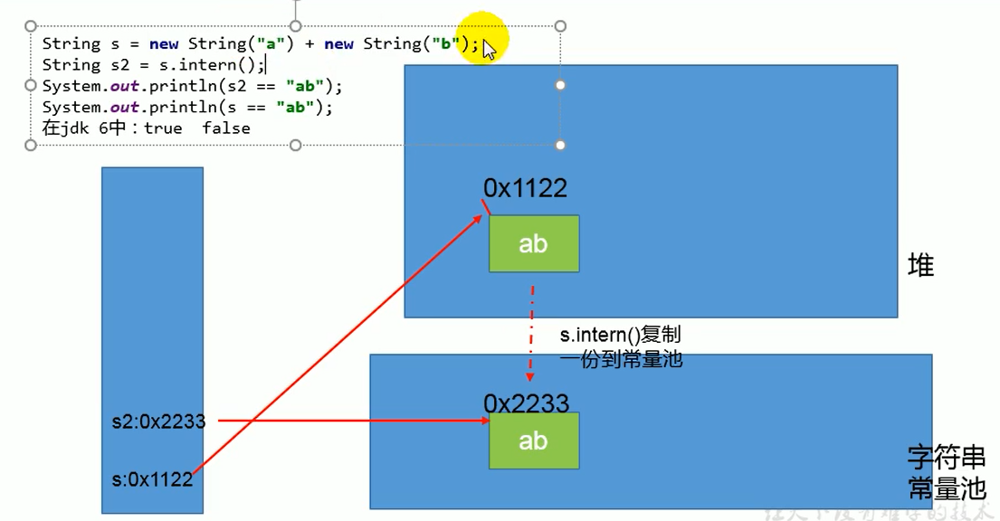

- 在JDK6中，在字符串常量池中创建一个字符串 “ab”
- 在JDK8中，在字符串常量池中没有创建 “ab”，而是将堆中的地址复制到 串池中。

所以上述结果，在JDK6中是：

```
true
false
```

在JDK8中是

```
false
true
```


针对下面这题，在JDK6和8中表现的是一样的


## StringTable的垃圾回收

```java
/**
 * String的垃圾回收
 * -Xms15m -Xmx15m -XX:+PrintStringTableStatistics -XX:+PrintGCDetails
 * @author: 陌溪
 * @create: 2020-07-11-16:55
 */
public class StringGCTest {
    public static void main(String[] args) {
        for (int i = 0; i < 100000; i++) {
            String.valueOf(i).intern();
        }
    }
}
```

## G1中的String去重操作

注意这里说的重复，指的是在堆中的数据，而不是常量池中的，因为常量池中的本身就不会重复

### 描述

背景：对许多Java应用（有大的也有小的）做的测试得出以下结果：

- 堆存活数据集合里面string对象占了25%
- 堆存活数据集合里面重复的string对象有13.5%

- string对象的平均长度是45

许多大规模的Java应用的瓶颈在于内存，测试表明，在这些类型的应用里面，Java堆中存活的数据集合差不多25%是string对象。更进一步，这里面差不多一半string对象是重复的，重复的意思是说：
stringl.equals（string2）= true。堆上存在重复的string对象必然是一种内存的浪费。这个项目将在G1垃圾收集器中实现自动持续对重复的string对象进行去重，这样就能避免浪费内存。

### 实现

- 当垃圾收集器工作的时候，会访问堆上存活的对象。对每一个访问的对象都会检查是否是候选的要去重的string对象。
- 如果是，把这个对象的一个引用插入到队列中等待后续的处理。一个去重的线程在后台运行，处理这个队列。处理队列的一个元素意味着从队列删除这个元素，然后尝试去重它引用的string对象。
- 使用一个hashtab1e来记录所有的被string对象使用的不重复的char数组。当去重的时候，会查这个hashtable，来看堆上是否已经存在一个一模一样的char数组。
- 如果存在，string对象会被调整引用那个数组，释放对原来的数组的引用，最终会被垃圾收集器回收掉。
- 如果查找失败，char数组会被插入到hashtable，这样以后的时候就可以共享这个数组了。

### 开启

命令行选项

>UsestringDeduplication（bool）：开启string去重，默认是不开启的，需要手动开启。
>Printstringbeduplicationstatistics（bool）：打印详细的去重统计信息
>stringpeduplicationAgeThreshold（uintx）：达到这个年龄的string对象被认为是去重的候选对象

# 14.垃圾回收概述

## 概念

这次我们主要关注的是黄色部分，内存的分配与回收


## 什么是垃圾

在提到什么是垃圾之前，我们先看下面一张图

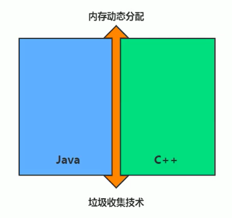

从上图我们可以很明确的知道，Java 和 C++语言的区别，就在于垃圾收集技术和内存动态分配上，C语言没有垃圾收集技术，需要我们手动的收集。

垃圾收集，不是Java语言的伴生产物。早在1960年，第一门开始使用内存动态分配和垃圾收集技术的Lisp语言诞生。
关于垃圾收集有三个经典问题：

- 哪些内存需要回收？
- 什么时候回收？
- 如何回收？

垃圾收集机制是Java的招牌能力，极大地提高了开发效率。如今，垃圾收集几乎成为现代语言的标配，即使经过如此长时间的发展，Java的垃圾收集机制仍然在不断的演进中，不同大小的设备、不同特征的应用场景，对垃圾收集提出了新的挑战，这当然也是面试的热点。

### 什么是垃圾？

垃圾是指在运行程序中没有任何指针指向的对象，这个对象就是需要被回收的垃圾。

如果不及时对内存中的垃圾进行清理，那么，这些垃圾对象所占的内存空间会一直保留到应用程序的结束，被保留的空间无法被其它对象使用，甚至可能导致内存溢出。

### 磁盘碎片整理

机械硬盘需要进行磁盘整理，同时还有坏道


### 大厂面试题

#### 蚂蚁金服

- 你知道哪几种垃圾回收器，各自的优缺点，重点讲一下cms和G1？
- JVM GC算法有哪些，目前的JDK版本采用什么回收算法？
- G1回收器讲下回收过程GC是什么？为什么要有GC？
- GC的两种判定方法？CMS收集器与G1收集器的特点

#### 百度

- 说一下GC算法，分代回收说下
- 垃圾收集策略和算法

#### 天猫

- JVM GC原理，JVM怎么回收内存
- CMS特点，垃圾回收算法有哪些？各自的优缺点，他们共同的缺点是什么？

#### 滴滴

Java的垃圾回收器都有哪些，说下g1的应用场景，平时你是如何搭配使用垃圾回收器的

#### 京东

- 你知道哪几种垃圾收集器，各自的优缺点，重点讲下cms和G1，
- 包括原理，流程，优缺点。垃圾回收算法的实现原理

#### 阿里

- 讲一讲垃圾回收算法。
- 什么情况下触发垃圾回收？
- 如何选择合适的垃圾收集算法？
- JVM有哪三种垃圾回收器？

#### 字节跳动

- 常见的垃圾回收器算法有哪些，各有什么优劣？
- System.gc（）和Runtime.gc（）会做什么事情？
- Java GC机制？GC Roots有哪些？
- Java对象的回收方式，回收算法。
- CMS和G1了解么，CMS解决什么问题，说一下回收的过程。
- CMS回收停顿了几次，为什么要停顿两次?

## 为什么需要GC

对于高级语言来说，一个基本认知是如果不进行垃圾回收，内存迟早都会被消耗完，因为不断地分配内存空间而不进行回收，就好像不停地生产生活垃圾而从来不打扫一样。

除了释放没用的对象，垃圾回收也可以清除内存里的记录碎片。碎片整理将所占用的堆内存移到堆的一端，以便JVM将整理出的内存分配给新的对象。

随着应用程序所应付的业务越来越庞大、复杂，用户越来越多，没有GC就不能保证应用程序的正常进行。而经常造成STW的GC又跟不上实际的需求，所以才会不断地尝试对GC进行优化。

## 早期垃圾回收

在早期的C/C++时代，垃圾回收基本上是手工进行的。开发人员可以使用new关键字进行内存申请，并使用delete关键字进行内存释放。比如以下代码：

```c++
MibBridge *pBridge= new cmBaseGroupBridge（）；
//如果注册失败，使用Delete释放该对象所占内存区域
if（pBridge->Register（kDestroy）！=NO ERROR）
	delete pBridge；
```

这种方式可以灵活控制内存释放的时间，但是会给开发人员带来频繁申请和释放内存的管理负担。倘若有一处内存区间由于程序员编码的问题忘记被回收，那么就会产生内存泄漏，垃圾对象永远无法被清除，随着系统运行时间的不断增长，垃圾对象所耗内存可能持续上升，直到出现内存溢出并造成应用程序崩溃。 

有了垃圾回收机制后，上述代码极有可能变成这样

```c++
MibBridge *pBridge=new cmBaseGroupBridge(); 
pBridge->Register(kDestroy);
```

现在，除了Java以外，C#、Python、Ruby等语言都使用了自动垃圾回收的思想，也是未来发展趋势，可以说这种自动化的内存分配和来及回收方式已经成为了线代开发语言必备的标准。

## Java垃圾回收机制

### 优点

自动内存管理，无需开发人员手动参与内存的分配与回收，这样降低内存泄漏和内存溢出的风险

没有垃圾回收器，java也会和cpp一样，各种悬垂指针，野指针，泄露问题让你头疼不已。

自动内存管理机制，将程序员从繁重的内存管理中释放出来，可以更专心地专注于业务开发

oracle官网关于垃圾回收的介绍
https://docs.oracle.com/javase/8/docs/technotes/guides/vm/gctuning/toc.html

### 担忧

对于Java开发人员而言，自动内存管理就像是一个黑匣子，如果过度依赖于“自动”，那么这将会是一场灾难，最严重的就会弱化Java开发人员在程序出现内存溢出时定位问题和解决问题的能力。

此时，了解JVM的自动内存分配和内存回收原理就显得非常重要，只有在真正了解JVM是如何管理内存后，我们才能够在遇见outofMemoryError时，快速地根据错误异常日志定位问题和解决问题。

当需要排查各种内存溢出、内存泄漏问题时，当垃圾收集成为系统达到更高并发量的瓶颈时，我们就必须对这些“自动化”的技术实施必要的监控和调节。

### GC主要关注的区域

GC主要关注于 方法区 和堆中的垃圾收集

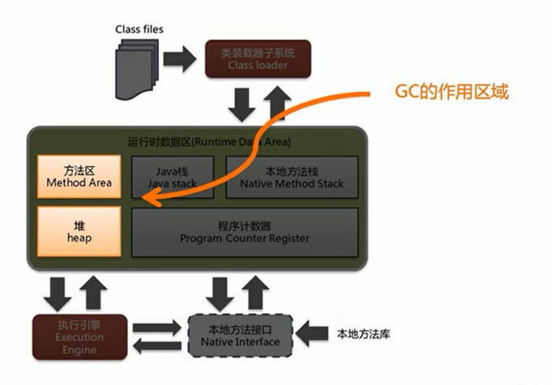

垃圾收集器可以对年轻代回收，也可以对老年代回收，甚至是全栈和方法区的回收

- 其中，Java堆是垃圾收集器的工作重点

从次数上讲：

- 频繁收集Young区
- 较少收集Old区
- 基本不收集Perm区（元空间）

#  15.垃圾回收相关算法

## 标记阶段：引用计数算法

在堆里存放着几乎所有的Java对象实例，在GC执行垃圾回收之前，首先需要区分出内存中哪些是存活对象，哪些是已经死亡的对象。只有被标记为己经死亡的对象，GC才会在执行垃圾回收时，释放掉其所占用的内存空间，因此这个过程我们可以称为垃圾标记阶段。

那么在JVM中究竟是如何标记一个死亡对象呢？简单来说，当一个对象已经不再被任何的存活对象继续引用时，就可以宣判为已经死亡。

判断对象存活一般有两种方式：**引用计数算法**和**可达性分析算法。**

引用计数算法（Reference Counting）比较简单，对每个对象保存一个整型的引用计数器属性。用于记录对象被引用的情况。

对于一个对象A，只要有任何一个对象引用了A，则A的引用计数器就加1；当引用失效时，引用计数器就减1。只要对象A的引用计数器的值为0，即表示对象A不可能再被使用，可进行回收。

优点：实现简单，垃圾对象便于辨识；判定效率高，回收没有延迟性。

缺点：它需要单独的字段存储计数器，这样的做法增加了存储空间的开销。

>每次赋值都需要更新计数器，伴随着加法和减法操作，这增加了时间开销。
>引用计数器有一个严重的问题，即无法处理循环引用的情况。这是一条致命缺陷，导致在Java的垃圾回收器中没有使用这类算法。

### 循环引用

当p的指针断开的时候，内部的引用形成一个循环，这就是循环引用，从而造成内存泄漏


### 举例

我们使用一个案例来测试Java中是否采用的是引用计数算法

```java
/**
 * 引用计数算法测试
 *
 * @author: 陌溪
 * @create: 2020-07-12-10:26
 */
public class RefCountGC {
    // 这个成员属性的唯一作用就是占用一点内存
    private byte[] bigSize = new byte[5*1024*1024];
    // 引用
    Object reference = null;

    public static void main(String[] args) {
        RefCountGC obj1 = new RefCountGC();
        RefCountGC obj2 = new RefCountGC();
        obj1.reference = obj2;
        obj2.reference = obj1;
        obj1 = null;
        obj2 = null;
        // 显示的执行垃圾收集行为，判断obj1 和 obj2是否被回收？
        System.gc();
    }
}
```

运行结果

```bash
[GC (System.gc()) [PSYoungGen: 15490K->808K(76288K)] 15490K->816K(251392K), 0.0061980 secs] [Times: user=0.00 sys=0.00, real=0.36 secs] 
[Full GC (System.gc()) [PSYoungGen: 808K->0K(76288K)] [ParOldGen: 8K->672K(175104K)] 816K->672K(251392K), [Metaspace: 3479K->3479K(1056768K)], 0.0045983 secs] [Times: user=0.00 sys=0.00, real=0.00 secs] 
Heap
 PSYoungGen      total 76288K, used 655K [0x000000076b500000, 0x0000000770a00000, 0x00000007c0000000)
  eden space 65536K, 1% used [0x000000076b500000,0x000000076b5a3ee8,0x000000076f500000)
  from space 10752K, 0% used [0x000000076f500000,0x000000076f500000,0x000000076ff80000)
  to   space 10752K, 0% used [0x000000076ff80000,0x000000076ff80000,0x0000000770a00000)
 ParOldGen       total 175104K, used 672K [0x00000006c1e00000, 0x00000006cc900000, 0x000000076b500000)
  object space 175104K, 0% used [0x00000006c1e00000,0x00000006c1ea8070,0x00000006cc900000)
 Metaspace       used 3486K, capacity 4496K, committed 4864K, reserved 1056768K
  class space    used 385K, capacity 388K, committed 512K, reserved 1048576K
```

我们能够看到，上述进行了GC收集的行为，将上述的新生代中的两个对象都进行回收了

```
PSYoungGen: 15490K->808K(76288K)] 15490K->816K(251392K)
```

如果使用引用计数算法，那么这两个对象将会无法回收。而现在两个对象被回收了，说明Java使用的不是引用计数算法来进行标记的。


### 小结

引用计数算法，是很多语言的资源回收选择，例如因人工智能而更加火热的Python，它更是同时支持引用计数和垃圾收集机制。

具体哪种最优是要看场景的，业界有大规模实践中仅保留引用计数机制，以提高吞吐量的尝试。

Java并没有选择引用计数，是因为其存在一个基本的难题，也就是很难处理循环引用关系。Python如何解决循环引用？

>手动解除：很好理解，就是在合适的时机，解除引用关系。
>使用弱引用weakref，weakref是Python提供的标准库，旨在解决循环引用。

## 标记阶段：可达性分析算法

### 概念

可达性分析算法：也可以称为 根搜索算法、追踪性垃圾收集

相对于引用计数算法而言，可达性分析算法不仅同样具备实现简单和执行高效等特点，更重要的是该算法可以有效地解决在引用计数算法中循环引用的问题，防止内存泄漏的发生。

相较于引用计数算法，这里的可达性分析就是Java、C#选择的。这种类型的垃圾收集通常也叫作追踪性垃圾收集（Tracing Garbage Collection）

### 思路

所谓"GCRoots”根集合就是一组必须活跃的引用。

基本思路：

- 可达性分析算法是以根对象集合（GCRoots）为起始点，按照从上至下的方式搜索被根对象集合所连接的目标对象是否可达。
- 使用可达性分析算法后，内存中的存活对象都会被根对象集合直接或间接连接着，搜索所走过的路径称为引用链（Reference Chain）
- 如果目标对象没有任何引用链相连，则是不可达的，就意味着该对象己经死亡，可以标记为垃圾对象。
- 在可达性分析算法中，只有能够被根对象集合直接或者间接连接的对象才是存活对象。


官场上的裙带关系，可达性分析在人类关系网中


### GC Roots可以是哪些？

- 虚拟机栈中引用的对象
  - 比如：各个线程被调用的方法中使用到的参数、局部变量等。
- 本地方法栈内JNI（通常说的本地方法）引用的对象方法区中类静态属性引用的对象
  - 比如：Java类的引用类型静态变量
- 方法区中常量引用的对象
  - 比如：字符串常量池（string Table）里的引用
- 所有被同步锁synchronized持有的对象
- Java虚拟机内部的引用。
  - 基本数据类型对应的Class对象，一些常驻的异常对象（如：Nu11PointerException、outofMemoryError），系统类加载器。
- 反映java虚拟机内部情况的JMXBean、JVMTI中注册的回调、本地代码缓存等。


#### 总结

总结一句话就是，除了堆空间外的一些结构，比如 虚拟机栈、本地方法栈、方法区、字符串常量池 等地方对堆空间进行引用的，都可以作为GC Roots进行可达性分析

除了这些固定的GC Roots集合以外，根据用户所选用的垃圾收集器以及当前回收的内存区域不同，还可以有其他对象“临时性”地加入，共同构成完整GC Roots集合。比如：分代收集和局部回收（PartialGC）。

如果只针对Java堆中的某一块区域进行垃圾回收（比如：典型的只针对新生代），必须考虑到内存区域是虚拟机自己的实现细节，更不是孤立封闭的，这个区域的对象完全有可能被其他区域的对象所引用，这时候就需要一并将关联的区域对象也加入GCRoots集合中去考虑，才能保证可达性分析的准确性。

#### 小技巧

由于Root采用栈方式存放变量和指针，所以如果一个指针，它保存了堆内存里面的对象，但是自己又不存放在堆内存里面，那它就是一个Root。

### 注意

如果要使用可达性分析算法来判断内存是否可回收，那么分析工作必须在一个能保障一致性的快照中进行。这点不满足的话分析结果的准确性就无法保证。

这点也是导致GC进行时必须“stop The World”的一个重要原因。

即使是号称（几乎）不会发生停顿的CMS收集器中，枚举根节点时也是必须要停顿的。

## 对象的finalization机制

Java语言提供了对象终止（finalization）机制来允许开发人员提供对象被销毁之前的自定义处理逻辑。

当垃圾回收器发现没有引用指向一个对象，即：垃圾回收此对象之前，总会先调用这个对象的finalize()方法。

finalize() 方法允许在子类中被重写，用于在对象被回收时进行资源释放。通常在这个方法中进行一些资源释放和清理的工作，比如关闭文件、套接字和数据库连接等。

### 注意

永远不要主动调用某个对象的finalize（）方法I应该交给垃圾回收机制调用。理由包括下面三点：

- 在finalize（）时可能会导致对象复活。
- finalize（）方法的执行时间是没有保障的，它完全由Gc线程决定，极端情况下，若不发生GC，则finalize（）方法将没有执行机会。
  - 因为优先级比较低，即使主动调用该方法，也不会因此就直接进行回收
- 一个糟糕的finalize（）会严重影响Gc的性能。

从功能上来说，finalize（）方法与c++中的析构函数比较相似，但是Java采用的是基于垃圾回收器的自动内存管理机制，所以finalize（）方法在本质上不同于C++中的析构函数。

由于finalize（）方法的存在，虚拟机中的对象一般处于三种可能的状态。

### 生存还是死亡？

如果从所有的根节点都无法访问到某个对象，说明对象己经不再使用了。一般来说，此对象需要被回收。但事实上，也并非是“非死不可”的，这时候它们暂时处于“缓刑”阶段。**一个无法触及的对象有可能在某一个条件下“复活”自己**，如果这样，那么对它的回收就是不合理的，为此，定义虚拟机中的对象可能的三种状态。如下：

- 可触及的：从根节点开始，可以到达这个对象。
- 可复活的：对象的所有引用都被释放，但是对象有可能在finalize（）中复活。
- 不可触及的：对象的finalize（）被调用，并且没有复活，那么就会进入不可触及状态。不可触及的对象不可能被复活，因为**finalize()只会被调用一次**。

以上3种状态中，是由于finalize（）方法的存在，进行的区分。只有在对象不可触及时才可以被回收。

### 具体过程

判定一个对象objA是否可回收，至少要经历两次标记过程：

- 如果对象objA到GC Roots没有引用链，则进行第一次标记。

- 进行筛选，判断此对象是否有必要执行finalize（）方法
  - 如果对象objA没有重写finalize（）方法，或者finalize（）方法已经被虚拟机调用过，则虚拟机视为“没有必要执行”，objA被判定为不可触及的。
  - 如果对象objA重写了finalize（）方法，且还未执行过，那么objA会被插入到F-Queue队列中，由一个虚拟机自动创建的、低优先级的Finalizer线程触发其finalize（）方法执行。
  - finalize（）方法是对象逃脱死亡的最后机会，稍后GC会对F-Queue队列中的对象进行第二次标记。如果objA在finalize（）方法中与引用链上的任何一个对象建立了联系，那么在第二次标记时，objA会被移出“即将回收”集合。之后，对象会再次出现没有引用存在的情况。在这个情况下，finalize方法不会被再次调用，对象会直接变成不可触及的状态，也就是说，一个对象的finalize方法只会被调用一次。


上图就是我们看到的Finalizer线程

### 代码演示

我们使用重写 finalize()方法，然后在方法的内部，重写将其存放到GC Roots中

```java
/**
 * 测试Object类中finalize()方法
 * 对象复活场景
 *
 * @author: 陌溪
 * @create: 2020-07-12-11:06
 */
public class CanReliveObj {
    // 类变量，属于GC Roots的一部分
    public static CanReliveObj canReliveObj;

    @Override
    protected void finalize() throws Throwable {
        super.finalize();
        System.out.println("调用当前类重写的finalize()方法");
        canReliveObj = this;
    }

    public static void main(String[] args) throws InterruptedException {
        canReliveObj = new CanReliveObj();
        canReliveObj = null;
        System.gc();
        System.out.println("-----------------第一次gc操作------------");
        // 因为Finalizer线程的优先级比较低，暂停2秒，以等待它
        Thread.sleep(2000);
        if (canReliveObj == null) {
            System.out.println("obj is dead");
        } else {
            System.out.println("obj is still alive");
        }

        System.out.println("-----------------第二次gc操作------------");
        canReliveObj = null;
        System.gc();
        // 下面代码和上面代码是一样的，但是 canReliveObj却自救失败了
        Thread.sleep(2000);
        if (canReliveObj == null) {
            System.out.println("obj is dead");
        } else {
            System.out.println("obj is still alive");
        }

    }
}
```

最后运行结果

```
-----------------第一次gc操作------------
调用当前类重写的finalize()方法
obj is still alive
-----------------第二次gc操作------------
obj is dead
```

在进行第一次清除的时候，我们会执行finalize方法，然后 对象 进行了一次自救操作，但是因为finalize()方法只会被调用一次，因此第二次该对象将会被垃圾清除。

## MAT与JProfiler的GC Roots溯源

### MAT是什么？

MAT是Memory Analyzer的简称，它是一款功能强大的Java堆内存分析器。用于查找内存泄漏以及查看内存消耗情况。

MAT是基于Eclipse开发的，是一款免费的性能分析工具。

大家可以在http://www.eclipse.org/mat/下载并使用MAT

### 命令行使用 jmap


### 使用JVIsualVM

捕获的heap dump文件是一个临时文件，关闭JVisualVM后自动删除，若要保留，需要将其另存为文件。可通过以下方法捕获heap dump：

在左侧“Application"（应用程序）子窗口中右击相应的应用程序，选择Heap Dump（堆Dump）。

在Monitor（监视）子标签页中点击Heap Dump（堆Dump）按钮。本地应用程序的Heap dumps作为应用程序标签页的一个子标签页打开。同时，heap dump在左侧的Application（应用程序）栏中对应一个含有时间戳的节点。

右击这个节点选择save as（另存为）即可将heap dump保存到本地。

### 使用MAT打开Dump文件

打开后，我们就可以看到有哪些可以作为GC Roots的对象


里面我们能够看到有一些常用的Java类，然后Thread线程。

### JProfiler的GC Roots溯源

我们在实际的开发中，一般不会查找全部的GC Roots，可能只是查找某个对象的整个链路，或者称为GC Roots溯源，这个时候，我们就可以使用JProfiler

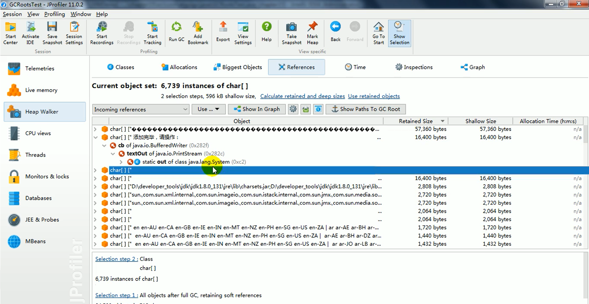

### 如何判断什么原因造成OOM

当我们程序出现OOM的时候，我们就需要进行排查，我们首先使用下面的例子进行说明

```java
/**
 * 内存溢出排查
 * -Xms8m -Xmx8m -XX:+HeapDumpOnOutOfMemoryError
 */
public class HeapOOM {
    // 创建1M的文件
    byte [] buffer = new byte[1 * 1024 * 1024];

    public static void main(String[] args) {
        ArrayList<HeapOOM> list = new ArrayList<>();
        int count = 0;
        try {
            while (true) {
                list.add(new HeapOOM());
                count++;
            }
        } catch (Exception e) {
            e.getStackTrace();
            System.out.println("count:" + count);
        }
    }
}
```

上述代码就是不断的创建一个1M小字节数组，然后让内存溢出，我们需要限制一下内存大小，同时使用HeapDumpOnOutOfMemoryError将出错时候的dump文件输出

```
-Xms8m -Xmx8m -XX:HeapDumpOnOutOfMemoryError
```

我们将生成的dump文件打开，然后点击Biggest Objects就能够看到超大对象

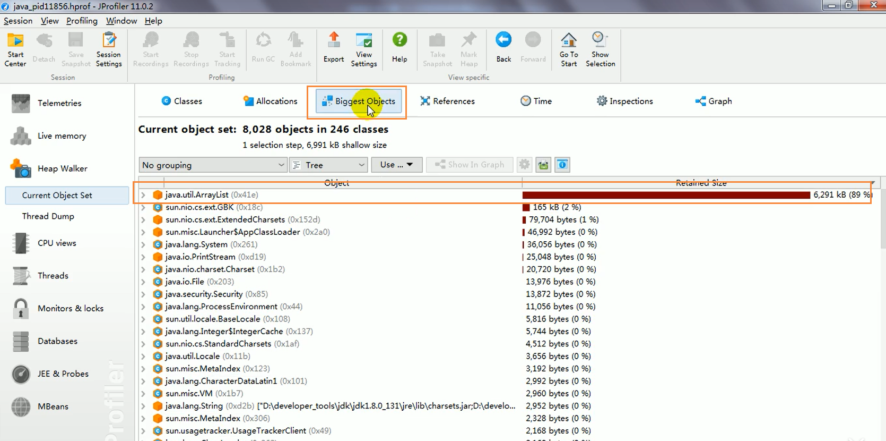

然后我们通过线程，还能够定位到哪里出现OOM


## 清除阶段：标记-清除算法

当成功区分出内存中存活对象和死亡对象后，GC接下来的任务就是执行垃圾回收，释放掉无用对象所占用的内存空间，以便有足够的可用内存空间为新对象分配内存。目前在JVM中比较常见的三种垃圾收集算法是

- 标记一清除算法（Mark-Sweep）
- 复制算法（copying）
- 标记-压缩算法（Mark-Compact）

标记-清除算法（Mark-Sweep）是一种非常基础和常见的垃圾收集算法，该算法被J.McCarthy等人在1960年提出并并应用于Lisp语言。

### 执行过程

当堆中的有效内存空间（available memory）被耗尽的时候，就会停止整个程序（也被称为stop the world），然后进行两项工作，第一项则是标记，第二项则是清除

- **标记**：Collector从引用根节点开始遍历，**标记所有被引用的对象**。一般是在对象的Header中记录为可达对象。
  - **标记的是引用的对象，不是垃圾！！**
- **清除**：Collector对堆内存从头到尾进行线性的遍历，如果发现某个对象在其Header中没有标记为可达对象，则将其回收


### 什么是清除？

这里所谓的清除并不是真的置空，而是把需要清除的对象地址保存在空闲的地址列表里。下次有新对象需要加载时，判断垃圾的位置空间是否够，如果够，就存放覆盖原有的地址。

关于空闲列表是在为对象分配内存的时候 提过

- 如果内存规整
  - 采用指针碰撞的方式进行内存分配
- 如果内存不规整
  - 虚拟机需要维护一个列表
  - 空闲列表分配

###  缺点

- 标记清除算法的效率不算高
- 在进行GC的时候，需要停止整个应用程序，用户体验较差
- 这种方式清理出来的空闲内存是不连续的，产生内碎片，需要维护一个空闲列表

## 清除阶段：复制算法

### 背景

为了解决标记-清除算法在垃圾收集效率方面的缺陷，M.L.Minsky于1963年发表了著名的论文，“使用双存储区的Lisp语言垃圾收集器CA LISP Garbage Collector Algorithm Using Serial Secondary Storage）”。M.L.Minsky在该论文中描述的算法被人们称为复制（Copying）算法，它也被M.L.Minsky本人成功地引入到了Lisp语言的一个实现版本中。

### 核心思想

将活着的内存空间分为两块，每次只使用其中一块，在垃圾回收时将正在使用的内存中的存活对象复制到未被使用的内存块中，之后清除正在使用的内存块中的所有对象，交换两个内存的角色，最后完成垃圾回收


把可达的对象，直接复制到另外一个区域中复制完成后，A区就没有用了，里面的对象可以直接清除掉，其实里面的新生代里面就用到了复制算法


### 优点

- 没有标记和清除过程，实现简单，运行高效
- 复制过去以后保证空间的连续性，不会出现“碎片”问题。

### 缺点

- 此算法的缺点也是很明显的，就是需要两倍的内存空间。
- 对于G1这种分拆成为大量region的GC，复制而不是移动，意味着GC需要维护region之间对象引用关系，不管是内存占用或者时间开销也不小

### 注意

如果系统中的垃圾对象很多，复制算法需要复制的存活对象数量并不会太大，或者说非常低才行（老年代大量的对象存活，那么复制的对象将会有很多，效率会很低）

在新生代，对常规应用的垃圾回收，一次通常可以回收70% - 99% 的内存空间。回收性价比很高。所以现在的商业虚拟机都是用这种收集算法回收新生代。

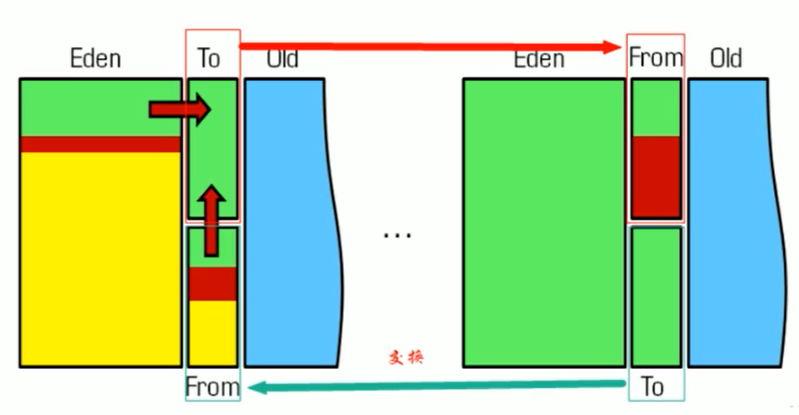

## 清除阶段：标记-整理算法

### 背景

复制算法的高效性是建立在存活对象少、垃圾对象多的前提下的。这种情况在新生代经常发生，但是在老年代，更常见的情况是大部分对象都是存活对象。如果依然使用复制算法，由于存活对象较多，复制的成本也将很高。因此，基于老年代垃圾回收的特性，需要使用其他的算法。

标记一清除算法的确可以应用在老年代中，但是该算法不仅执行效率低下，而且在执行完内存回收后还会产生内存碎片，所以JvM的设计者需要在此基础之上进行改进。标记-压缩（Mark-Compact）算法由此诞生。

1970年前后，G.L.Steele、C.J.Chene和D.s.Wise等研究者发布标记-压缩算法。在许多现代的垃圾收集器中，人们都使用了标记-压缩算法或其改进版本。

### 执行过程

第一阶段和标记清除算法一样，从根节点开始标记所有被引用对象

第二阶段将所有的存活对象压缩到内存的一端，按顺序排放。之后，清理边界外所有的空间。


### 标清和标整的区别

标记-压缩算法的最终效果等同于标记-清除算法执行完成后，再进行一次内存碎片整理，因此，也可以把它称为标记-清除-压缩（Mark-Sweep-Compact）算法。

二者的本质差异在于标记-清除算法是一种非移动式的回收算法，标记-压缩是移动式的。是否移动回收后的存活对象是一项优缺点并存的风险决策。可以看到，标记的存活对象将会被整理，按照内存地址依次排列，而未被标记的内存会被清理掉。如此一来，当我们需要给新对象分配内存时，JVM只需要持有一个内存的起始地址即可，这比维护一个空闲列表显然少了许多开销。

### 标整的优缺点

#### 优点

- 消除了标记-清除算法当中，内存区域分散的缺点，我们需要给新对象分配内存时，JVM只需要持有一个内存的起始地址即可。
- 消除了复制算法当中，内存减半的高额代价。

#### 缺点

- 从效率上来说，标记-整理算法要低于复制算法。
- 移动对象的同时，如果对象被其他对象引用，则还需要调整引用的地址
- 移动过程中，需要全程暂停用户应用程序。即：STW

## 小结

效率上来说，复制算法是当之无愧的老大，但是却浪费了太多内存。

而为了尽量兼顾上面提到的三个指标，标记-整理算法相对来说更平滑一些，但是效率上不尽如人意，它比复制算法多了一个标记的阶段，比标记-清除多了一个整理内存的阶段。

|              | 标记清除           | 标记整理         | 复制                                  |
| ------------ | ------------------ | ---------------- | ------------------------------------- |
| **速率**     | 中等               | 最慢             | 最快                                  |
| **空间开销** | 少（但会堆积碎片） | 少（不堆积碎片） | 通常需要活对象的2倍空间（不堆积碎片） |
| **移动对象** | 否                 | 是               | 是                                    |

综合我们可以找到，没有最好的算法，只有最合适的算法

### 分代收集算法

前面所有这些算法中，并没有一种算法可以完全替代其他算法，它们都具有自己独特的优势和特点。分代收集算法应运而生。

分代收集算法，是基于这样一个事实：不同的对象的生命周期是不一样的。因此，不同生命周期的对象可以采取不同的收集方式，以便提高回收效率。一般是把Java堆分为新生代和老年代，这样就可以根据各个年代的特点使用不同的回收算法，以提高垃圾回收的效率。

在Java程序运行的过程中，会产生大量的对象，其中有些对象是与业务信息相关，比如Http请求中的Session对象、线程、Socket连接，这类对象跟业务直接挂钩，因此生命周期比较长。但是还有一些对象，主要是程序运行过程中生成的临时变量，这些对象生命周期会比较短，比如：string对象，由于其不变类的特性，系统会产生大量的这些对象，有些对象甚至只用一次即可回收。

目前几乎所有的GC都采用分代手机算法执行垃圾回收的

在HotSpot中，基于分代的概念，GC所使用的内存回收算法必须结合年轻代和老年代各自的特点。

- 年轻代（Young Gen）

年轻代特点：区域相对老年代较小，对象生命周期短、存活率低，回收频繁。

这种情况复制算法的回收整理，速度是最快的。复制算法的效率只和当前存活对象大小有关，因此很适用于年轻代的回收。而复制算法内存利用率不高的问题，通过hotspot中的两个survivor的设计得到缓解。

- 老年代（Tenured Gen）

老年代特点：区域较大，对象生命周期长、存活率高，回收不及年轻代频繁。

这种情况存在大量存活率高的对象，复制算法明显变得不合适。一般是由标记-清除或者是标记-清除与标记-整理的混合实现。

- Mark阶段的开销与存活对象的数量成正比。
- Sweep阶段的开销与所管理区域的大小成正相关。
- compact阶段的开销与存活对象的数据成正比。

以HotSpot中的CMS回收器为例，CMS是基于Mark-Sweep实现的，对于对象的回收效率很高。而对于碎片问题，CMS采用基于Mark-Compact算法的Serial old回收器作为补偿措施：当内存回收不佳（碎片导致的Concurrent Mode Failure时），将采用serial old执行FullGC以达到对老年代内存的整理。

分代的思想被现有的虚拟机广泛使用。几乎所有的垃圾回收器都区分新生代和老年代

## 增量收集算法

### 概述

上述现有的算法，在垃圾回收过程中，应用软件将处于一种stop the World的状态。在stop the World状态下，应用程序所有的线程都会挂起，暂停一切正常的工作，等待垃圾回收的完成。如果垃圾回收时间过长，应用程序会被挂起很久，将严重影响用户体验或者系统的稳定性。为了解决这个问题，即对实时垃圾收集算法的研究直接导致了增量收集（Incremental Collecting）算法的诞生。

如果一次性将所有的垃圾进行处理，需要造成系统长时间的停顿，那么就可以让垃圾收集线程和应用程序线程交替执行。每次，垃圾收集线程只收集一小片区域的内存空间，接着切换到应用程序线程。依次反复，直到垃圾收集完成。

总的来说，增量收集算法的基础仍是传统的标记-清除和复制算法。**增量收集算法通过对线程间冲突的妥善处理**，允许垃圾收集线程以分阶段的方式完成标记、清理或复制工作

### 缺点

使用这种方式，由于在垃圾回收过程中，间断性地还执行了应用程序代码，所以能减少系统的停顿时间。但是，因为线程切换和上下文转换的消耗，会使得垃圾回收的总体成本上升，造成系统吞吐量的下降。

## 分区算法

一般来说，在相同条件下，堆空间越大，一次Gc时所需要的时间就越长，有关GC产生的停顿也越长。为了更好地控制GC产生的停顿时间，将一块大的内存区域分割成多个小块，根据目标的停顿时间，每次合理地回收若干个小区间，而不是整个堆空间，从而减少一次GC所产生的停顿。

分代算法将按照对象的生命周期长短划分成两个部分，分区算法将整个堆空间划分成连续的不同小区间。
每一个小区间都独立使用，独立回收。这种算法的好处是可以控制一次回收多少个小区间。


## 写到最后

注意，这些只是基本的算法思路，实际GC实现过程要复杂的多，目前还在发展中的前沿GC都是复合算法，并且并行和并发兼备。

# 16.垃圾回收相关概念

## System.gc()的理解

在默认情况下，通过system.gc（）者Runtime.getRuntime().gc() 的调用，会显式触发FullGC，同时对老年代和新生代进行回收，尝试释放被丢弃对象占用的内存。

然而system.gc() )调用附带一个免责声明，无法保证对垃圾收集器的调用。(不能确保立即生效)

JVM实现者可以通过system.gc() 调用来决定JVM的GC行为。而一般情况下，垃圾回收应该是自动进行的，无须手动触发，否则就太过于麻烦了。在一些特殊情况下，如我们正在编写一个性能基准，我们可以在运行之间调用System.gc() 

代码演示是否出发GC操作

```java
/**
 * System.gc()
 *
 * @author: 陌溪
 * @create: 2020-07-12-19:07
 */
public class SystemGCTest {
    public static void main(String[] args) {
        new SystemGCTest();
        // 提醒JVM进行垃圾回收
        System.gc();
        //System.runFinalization();
    }

    @Override
    protected void finalize() throws Throwable {
        super.finalize();
        System.out.println("SystemGCTest 执行了 finalize方法");
    }
}
```

运行结果，但是不一定会触发销毁的方法，调用System.runFinalization()会强制调用 失去引用对象的finalize()

```
SystemGCTest 执行了 finalize方法
```

### 手动GC来理解不可达对象的回收

代码如下所示：

```java
/**
 * 局部变量回收
 *
 * @author: 陌溪
 * @create: 2020-07-12-19:12
 */
public class LocalVarGC {

    /**
     * 触发Minor GC没有回收对象，然后在触发Full GC将该对象存入old区
     */
    public void localvarGC1() {
        byte[] buffer = new byte[10*1024*1024];
        System.gc();
    }

    /**
     * 触发YoungGC的时候，已经被回收了
     */
    public void localvarGC2() {
        byte[] buffer = new byte[10*1024*1024];
        buffer = null;
        System.gc();
    }

    /**
     * 不会被回收，因为它还存放在局部变量表索引为1的槽中
     */
    public void localvarGC3() {
        {
            byte[] buffer = new byte[10*1024*1024];
        }
        System.gc();
    }

    /**
     * 会被回收，因为它还存放在局部变量表索引为1的槽中，但是后面定义的value把这个槽给替换了
     */
    public void localvarGC4() {
        {
            byte[] buffer = new byte[10*1024*1024];
        }
        int value = 10;
        System.gc();
    }

    /**
     * localvarGC5中的数组已经被回收
     */
    public void localvarGC5() {
        localvarGC1();
        System.gc();
    }

    public static void main(String[] args) {
        LocalVarGC localVarGC = new LocalVarGC();
        localVarGC.localvarGC3();
    }
}
```

## 内存溢出

内存溢出相对于内存泄漏来说，尽管更容易被理解，但是同样的，内存溢出也是引发程序崩溃的罪魁祸首之一。

由于GC一直在发展，所有一般情况下，除非应用程序占用的内存增长速度非常快，造成垃圾回收已经跟不上内存消耗的速度，否则不太容易出现ooM的情况。

大多数情况下，GC会进行各种年龄段的垃圾回收，实在不行了就放大招，来一次独占式的Fu11GC操作，这时候会回收大量的内存，供应用程序继续使用。

javadoc中对outofMemoryError的解释是，没有空闲内存，并且垃圾收集器也无法提供更多内存。

首先说没有空闲内存的情况：说明Java虚拟机的堆内存不够。原因有二：

- Java虚拟机的堆内存设置不够。

比如：可能存在内存泄漏问题；也很有可能就是堆的大小不合理，比如我们要处理比较可观的数据量，但是没有显式指定JVM堆大小或者指定数值偏小。我们可以通过参数-Xms 、-Xmx来调整。

- 代码中创建了大量大对象，并且长时间不能被垃圾收集器收集（存在被引用）

对于老版本的oracle JDK，因为永久代的大小是有限的，并且JVM对永久代垃圾回收（如，常量池回收、卸载不再需要的类型）非常不积极，所以当我们不断添加新类型的时候，永久代出现OutOfMemoryError也非常多见，尤其是在运行时存在大量动态类型生成的场合；类似intern字符串缓存占用太多空间，也会导致OOM问题。对应的异常信息，会标记出来和永久代相关：“java.lang.OutOfMemoryError:PermGen space"。

随着元数据区的引入，方法区内存已经不再那么窘迫，所以相应的ooM有所改观，出现ooM，异常信息则变成了：“java.lang.OutofMemoryError:Metaspace"。直接内存不足，也会导致OOM。

这里面隐含着一层意思是，在抛出OutofMemoryError之前，通常垃圾收集器会被触发，尽其所能去清理出空间。

>例如：在引用机制分析中，涉及到JVM会去尝试回收软引用指向的对象等。
>在java.nio.BIts.reserveMemory（）方法中，我们能清楚的看到，System.gc（）会被调用，以清理空间。

当然，也不是在任何情况下垃圾收集器都会被触发的

比如，我们去分配一个超大对象，类似一个超大数组超过堆的最大值，JVM可以判断出垃圾收集并不能解决这个问题，所以直接抛出OutofMemoryError。

## 内存泄漏

也称作“存储渗漏”。严格来说，只有对象不会再被程序用到了，但是GC又不能回收他们的情况，才叫内存泄漏。

但实际情况很多时候一些不太好的实践（或疏忽）会导致对象的生命周期变得很长甚至导致00M，也可以叫做宽泛意义上的“内存泄漏”。

尽管内存泄漏并不会立刻引起程序崩溃，但是一旦发生内存泄漏，程序中的可用内存就会被逐步蚕食，直至耗尽所有内存，最终出现outofMemory异常，导致程序崩溃。

注意，这里的存储空间并不是指物理内存，而是指虚拟内存大小，这个虚拟内存大小取决于磁盘交换区设定的大小。

> 买房子：80平的房子，但是有10平是公摊的面积，我们是无法使用这10平的空间，这就是所谓的内存泄漏

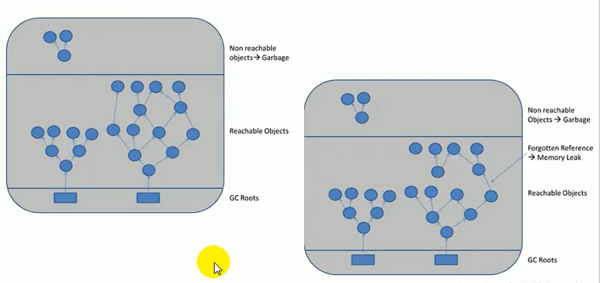

Java使用可达性分析算法，最上面的数据不可达，就是需要被回收的。后期有一些对象不用了，按道理应该断开引用，但是存在一些链没有断开，从而导致没有办法被回收。

### 举例

- 单例模式

单例的生命周期和应用程序是一样长的，所以单例程序中，如果持有对外部对象的引用的话，那么这个外部对象是不能被回收的，则会导致内存泄漏的产生。

- 一些提供close的资源未关闭导致内存泄漏

数据库连接（dataSourse.getConnection() ），网络连接（socket）和io连接必须手动close，否则是不能被回收的。

## Stop The World

 stop-the-world，简称STw，指的是GC事件发生过程中，会产生应用程序的停顿。停顿产生时整个应用程序线程都会被暂停，没有任何响应，有点像卡死的感觉，这个停顿称为STW。

可达性分析算法中枚举根节点（GC Roots）会导致所有Java执行线程停顿。

- 分析工作必须在一个能确保一致性的快照中进行
- 一致性指整个分析期间整个执行系统看起来像被冻结在某个时间点上

- 如果出现分析过程中对象引用关系还在不断变化，则分析结果的准确性无法保证

被STW中断的应用程序线程会在完成GC之后恢复，频繁中断会让用户感觉像是网速不快造成电影卡带一样，所以我们需要减少STw的发生。

STW事件和采用哪款GC无关所有的GC都有这个事件。

哪怕是G1也不能完全避免Stop-the-world情况发生，只能说垃圾回收器越来越优秀，回收效率越来越高，尽可能地缩短了暂停时间。

STW是JVM在后台自动发起和自动完成的。在用户不可见的情况下，把用户正常的工作线程全部停掉。

开发中不要用system.gc() 会导致stop-the-world的发生。

## 垃圾回收的并行与并发

### 并发

在操作系统中，是指一个时间段中有几个程序都处于已启动运行到运行完毕之间，且这几个程序都是在同一个处理器上运行。

并发不是真正意义上的“同时进行”，只是CPU把一个时间段划分成几个时间片段（时间区间），然后在这几个时间区间之间来回切换，由于CPU处理的速度非常快，只要时间间隔处理得当，即可让用户感觉是多个应用程序同时在进行。


### 并行

当系统有一个以上CPU时，当一个CPU执行一个进程时，另一个CPU可以执行另一个进程，两个进程互不抢占CPU资源，可以同时进行，我们称之为并行（Paralle1）。

其实决定并行的因素不是CPU的数量，而是CPU的核心数量，比如一个CPU多个核也可以并行。

适合科学计算，后台处理等弱交互场景


### 并发和并行对比

**并发**，指的是多个事情，在同一时间段内同时发生了。

**并行**，指的是多个事情，在同一时间点上同时发生了。

并发的多个任务之间是互相抢占资源的。并行的多个任务之间是不互相抢占资源的。

只有在多CPU或者一个CPU多核的情况中，才会发生并行。

否则，看似同时发生的事情，其实都是并发执行的。

### 垃圾回收的并行与并发

并发和并行，在谈论垃圾收集器的上下文语境中，它们可以解释如下：

- 并行（Paralle1）：指多条垃圾收集线程并行工作，但此时用户线程仍处于等待状态。如ParNew、Parallel Scavenge、Parallel old；

- 串行（Serial）
  - 相较于并行的概念，单线程执行。
  - 如果内存不够，则程序暂停，启动JM垃圾回收器进行垃圾回收。回收完，再启动程序的线程。


并发和并行，在谈论垃圾收集器的上下文语境中，它们可以解释如下：

并发（Concurrent）：指用户线程与垃圾收集线程同时执行（但不一定是并行的，可能会交替执行），垃圾回收线程在执行时不会停顿用户程序的运行。>用户程序在继续运行，而垃圾收集程序线程运行于另一个CPU上；

>如：CMS、G1


## 安全点与安全区域

### 安全点

程序执行时并非在所有地方都能停顿下来开始GC，只有在特定的位置才能停顿下来开始GC，这些位置称为“安全点（Safepoint）”。

Safe Point的选择很重要，如果太少可能导致GC等待的时间太长，如果太频繁可能导致运行时的性能问题。大部分指令的执行时间都非常短暂，通常会根据“是否具有让程序长时间执行的特征”为标准。比如：选择一些执行时间较长的指令作为Safe Point，如方法调用、循环跳转和异常跳转等。

如何在cc发生时，检查所有线程都跑到最近的安全点停顿下来呢？

- **抢先式中断**：（目前没有虚拟机采用了）首先中断所有线程。如果还有线程不在安全点，就恢复线程，让线程跑到安全点。
- **主动式中断**：设置一个中断标志，各个线程运行到Safe Point的时候主动轮询这个标志，如果中断标志为真，则将自己进行中断挂起。（有轮询的机制）

### 安全区域

Safepoint 机制保证了程序执行时，在不太长的时间内就会遇到可进入GC的Safepoint。但是，程序“不执行”的时候呢？例如线程处于sleep-状态或Blocked 状态，这时候线程无法响应JVM的中断请求，“走”到安全点去中断挂起，JVM也不太可能等待线程被唤醒。对于这种情况，就需要安全区域（Safe Region）来解决。

安全区域是指在一段代码片段中，对象的引用关系不会发生变化，在这个区域中的任何位置开始Gc都是安全的。我们也可以把Safe Region看做是被扩展了的Safepoint。

**执行流程：**

- 当线程运行到Safe Region的代码时，首先标识已经进入了Safe Relgion，如果这段时间内发生GC，JVM会忽略标识为Safe Region状态的线程
- 当线程即将离开Safe Region时，会检查JVM是否已经完成GC，如果完成了，则继续运行，否则线程必须等待直到收到可以安全离开Safe Region的信号为止；

## 再谈引用

我们希望能描述这样一类对象：当内存空间还足够时，则能保留在内存中；如果内存空间在进行垃圾收集后还是很紧张，则可以抛弃这些对象。

【既偏门又非常高频的面试题】强引用、软引用、弱引用、虚引用有什么区别？具体使用场景是什么？
在JDK1.2版之后，Java对引用的概念进行了扩充，将引用分为：

- 强引用（Strong Reference）
- 软引用（Soft Reference）
- 弱引用（Weak Reference）
- 虚引用（Phantom Reference）l

这4种引用强度依次逐渐减弱。除强引用外，其他3种引用均可以在java.lang.ref包中找到它们的身影。如下图，显示了这3种引用类型对应的类，开发人员可以在应用程序中直接使用它们。

.

Reference子类中只有终结器引用是包内可见的，其他3种引用类型均为public，可以在应用程序中直接使用

- 强引用（StrongReference）：最传统的“引用”的定义，是指在程序代码之中普遍存在的引用赋值，即类似“object obj=new Object（）”这种引用关系。无论任何情况下，==只要强引用关系还存在，垃圾收集器就永远不会回收掉被引用的对象==。
- 软引用（SoftReference）：在系统将要发生内存溢出之前，将会把这些对象列入回收范围之中进行第二次回收。如果这次回收后还没有足够的内存，才会抛出内存流出异常。
- 弱引用（WeakReference）：被弱引用关联的对象只能生存到下一次垃圾收集之前。当垃圾收集器工作时，无论内存空间是否足够，都会回收掉被弱引用关联的对象。
- 虚引用（PhantomReference）：一个对象是否有虚引用的存在，完全不会对其生存时间构成影响，也无法通过虚引用来获得一个对象的实例。==为一个对象设置虚引用关联的唯一目的就是能在这个对象被收集器回收时收到一个系统通知==。

## 再谈引用：强引用

在Java程序中，最常见的引用类型是强引用（普通系统99%以上都是强引用），也就是我们最常见的普通对象引用，也是默认的引用类型。

当在Java语言中使用new操作符创建一个新的对象，并将其赋值给一个变量的时候，这个变量就成为指向该对象的一个强引用。

强引用的对象是可触及的，垃圾收集器就==永远不会==回收掉被引用的对象。

对于一个普通的对象，如果没有其他的引用关系，只要超过了引用的作用域或者显式地将相应（强）引用赋值为null，就是可以当做垃圾被收集了，当然具体回收时机还是要看垃圾收集策略。

相对的，软引用、弱引用和虚引用的对象是软可触及、弱可触及和虚可触及的，在一定条件下，都是可以被回收的。所以，强引用是造成Java内存泄漏的主要原因之一。

### 举例

强引用的案例说明

```java
StringBuffer str = new StringBuffer("hello mogublog");
```

局部变量str指向stringBuffer实例所在堆空间，通过str可以操作该实例，那么str就是stringBuffer实例的强引用对应内存结构：


如果此时，在运行一个赋值语句

```java
StringBuffer str = new StringBuffer("hello mogublog");
StringBuffer str1 = str;
```

对应的内存结构为:


那么我们将 str = null; 则 原来堆中的对象也不会被回收，因为还有其它对象指向该区域

### 总结

本例中的两个引用，都是强引用，强引用具备以下特点：

- 强引用可以直接访问目标对象。
- 强引用所指向的对象在任何时候都不会被系统回收，虚拟机宁愿抛出OOM异常，也不会回收强引用所指向对象。
- 强引用可能导致内存泄漏。

## 再谈引用： 软引用

软引用是用来描述一些还有用，但非必需的对象。只被软引用关联着的对象，在系统将要发生内存溢出异常前，会把这些对象列进回收范围之中进行第二次回收，如果这次回收还没有足够的内存，才会抛出内存溢出异常。

> 注意，这里的第一次回收是==不可达==的对象

软引用通常用来实现内存敏感的缓存。比如：高速缓存就有用到软引用。如果还有空闲内存，就可以暂时保留缓存，当内存不足时清理掉，这样就保证了使用缓存的同时，不会耗尽内存。

垃圾回收器在某个时刻决定回收软可达的对象的时候，会清理软引用，并可选地把引用存放到一个引用队列（Reference Queue）。

类似弱引用，只不过Java虚拟机会尽量让软引用的存活时间长一些，迫不得已才清理。

> 一句话概括：当内存足够时，不会回收软引用可达的对象。内存不够时，会回收软引用的可达对象

在JDK1.2版之后提供了SoftReference类来实现软引用

```java
// 声明强引用
Object obj = new Object();
// 创建一个软引用
SoftReference<Object> sf = new SoftReference<>(obj);
obj = null; //销毁强引用，这是必须的，不然会存在强引用和软引用
```

## 再谈引用：弱引用

> 发现即回收

弱引用也是用来描述那些非必需对象，被弱引用关联的对象只能生存到下一次垃圾收集发生为止。在系统GC时，只要发现弱引用，不管系统堆空间使用是否充足，都会回收掉只被弱引用关联的对象。

但是，由于垃圾回收器的线程通常优先级很低，因此，并不一定能很快地发现持有弱引用的对象。在这种情况下，弱引用对象可以存在较长的时间。

弱引用和软引用一样，在构造弱引用时，也可以指定一个引用队列，当弱引用对象被回收时，就会加入指定的引用队列，通过这个队列可以跟踪对象的回收情况。

软引用、弱引用都非常适合来保存那些可有可无的缓存数据。如果这么做，当系统内存不足时，这些缓存数据会被回收，不会导致内存溢出。而当内存资源充足时，这些缓存数据又可以存在相当长的时间，从而起到加速系统的作用。

在JDK1.2版之后提供了WeakReference类来实现弱引用

```java
// 声明强引用
Object obj = new Object();
// 创建一个弱引用
WeakReference<Object> sf = new WeakReference<>(obj);
obj = null; //销毁强引用，这是必须的，不然会存在强引用和弱引用
```

弱引用对象与软引用对象的最大不同就在于，当GC在进行回收时，需要通过算法检查是否回收软引用对象，而对于弱引用对象，GC总是进行回收。弱引用对象更容易、更快被GC回收。

面试题：你开发中使用过WeakHashMap吗？

WeakHashMap用来存储图片信息，可以在内存不足的时候，及时回收，避免了OOM

## 再谈引用：虚引用

也称为“幽灵引用”或者“幻影引用”，是所有引用类型中最弱的一个

一个对象是否有虚引用的存在，完全不会决定对象的生命周期。如果一个对象仅持有虚引用，那么它和没有引用几乎是一样的，随时都可能被垃圾回收器回收。

它不能单独使用，也无法通过虚引用来获取被引用的对象。当试图通过虚引用的get（）方法取得对象时，总是null

为一个对象设置虚引用关联的唯一目的在于跟踪垃圾回收过程。比如：能在这个对象被收集器回收时收到一个系统通知。

虚引用必须和引用队列一起使用。虚引用在创建时必须提供一个引用队列作为参数。当垃圾回收器准备回收一个对象时，如果发现它还有虚引用，就会在回收对象后，将这个虚引用加入引用队列，以通知应用程序对象的回收情况。

由于虚引用可以跟踪对象的回收时间，因此，也可以将一些资源释放操作放置在虚引用中执行和记录。

> 虚引用无法获取到我们的数据

在JDK1.2版之后提供了PhantomReference类来实现虚引用。

```java
// 声明强引用
Object obj = new Object();
// 声明引用队列
ReferenceQueue phantomQueue = new ReferenceQueue();
// 声明虚引用（还需要传入引用队列）
PhantomReference<Object> sf = new PhantomReference<>(obj, phantomQueue);
obj = null; 
```

### 案例

我们使用一个案例，来结合虚引用，引用队列，finalize进行讲解

```java
/**
 * @author: 陌溪
 * @create: 2020-07-12-21:42
 */
public class PhantomReferenceTest {
    // 当前类对象的声明
    public static PhantomReferenceTest obj;
    // 引用队列
    static ReferenceQueue<PhantomReferenceTest> phantomQueue = null;

    @Override
    protected void finalize() throws Throwable {
        super.finalize();
        System.out.println("调用当前类的finalize方法");
        obj = this;
    }

    public static void main(String[] args) {
        Thread thread = new Thread(() -> {
            while(true) {
                if (phantomQueue != null) {
                    PhantomReference<PhantomReferenceTest> objt = null;
                    try {
                        objt = (PhantomReference<PhantomReferenceTest>) phantomQueue.remove();
                    } catch (Exception e) {
                        e.getStackTrace();
                    }
                    if (objt != null) {
                        System.out.println("追踪垃圾回收过程：PhantomReferenceTest实例被GC了");
                    }
                }
            }
        }, "t1");
        thread.setDaemon(true);
        thread.start();

        phantomQueue = new ReferenceQueue<>();
        obj = new PhantomReferenceTest();
        // 构造了PhantomReferenceTest对象的虚引用，并指定了引用队列
        PhantomReference<PhantomReferenceTest> phantomReference = new PhantomReference<>(obj, phantomQueue);
        try {
            System.out.println(phantomReference.get());
            // 去除强引用
            obj = null;
            // 第一次进行GC，由于对象可复活，GC无法回收该对象
            System.out.println("第一次GC操作");
            System.gc();
            Thread.sleep(1000);
            if (obj == null) {
                System.out.println("obj 是 null");
            } else {
                System.out.println("obj 不是 null");
            }
            System.out.println("第二次GC操作");
            obj = null;
            System.gc();
            Thread.sleep(1000);
            if (obj == null) {
                System.out.println("obj 是 null");
            } else {
                System.out.println("obj 不是 null");
            }
        } catch (Exception e) {
            e.printStackTrace();
        } finally {

        }
    }
}
```

最后运行结果

```java
null
第一次GC操作
调用当前类的finalize方法
obj 不是 null
第二次GC操作
追踪垃圾回收过程：PhantomReferenceTest实例被GC了
obj 是 null
```

从上述运行结果我们知道，第一次尝试获取虚引用的值，发现无法获取的，这是因为虚引用是无法直接获取对象的值，然后进行第一次gc，因为会调用finalize方法，将对象复活了，所以对象没有被回收，但是调用第二次gc操作的时候，因为finalize方法只能执行一次，所以就触发了GC操作，将对象回收了，同时将会触发第二个操作就是 将回收的值存入到引用队列中。

## 终结器引用

它用于实现对象的finalize() 方法，也可以称为终结器引用

无需手动编码，其内部配合引用队列使用

在GC时，终结器引用入队。由Finalizer线程通过终结器引用找到被引用对象调用它的finalize()方法，第二次GC时才回收被引用的对象


# 17.垃圾回收器

## GC分类与性能指标

垃圾收集器没有在规范中进行过多的规定，可以由不同的厂商、不同版本的JVM来实现。

由于JDK的版本处于高速迭代过程中，因此Java发展至今已经衍生了众多的GC版本。

从不同角度分析垃圾收集器，可以将GC分为不同的类型。

> Java不同版本新特性
>
> - 语法层面：Lambda表达式、switch、自动拆箱装箱、enum
> - API层面：Stream API、新的日期时间、Optional、String、集合框架
> - 底层优化：JVM优化、GC的变化、元空间、静态域、字符串常量池位置变化

### 垃圾收集器分类

#### **按线程数分**

**按线程数分**（垃圾回收线程数），可以分为串行垃圾回收器和并行垃圾回收器。


串行回收指的是在同一时间段内只允许有一个CPU用于执行垃圾回收操作，此时工作线程被暂停，直至垃圾收集工作结束。

- 在诸如单CPU处理器或者较小的应用内存等硬件平台不是特别优越的场合，串行回收器的性能表现可以超过并行回收器和并发回收器。所以，串行回收默认被应用在客户端的Client模式下的JVM中
- 在并发能力比较强的CPU上，并行回收器产生的停顿时间要短于串行回收器。

和串行回收相反，并行收集可以运用多个CPU同时执行垃圾回收，因此提升了应用的吞吐量，不过并行回收仍然与串行回收一样，采用独占式，使用了“stop-the-world”机制。

#### 按工作模式分

按照工作模式分，可以分为并发式垃圾回收器和独占式垃圾回收器。

- 并发式垃圾回收器与应用程序线程交替工作，以尽可能减少应用程序的停顿时间。
- 独占式垃圾回收器（Stop the world）一旦运行，就停止应用程序中的所有用户线程，直到垃圾回收过程完全结束。


#### 按碎片处理方式分

按碎片处理方式分，可分为压缩武垃圾回收器和非压缩式垃圾回收器。

- 压缩式垃圾回收器会在回收完成后，对存活对象进行压缩整理，消除回收后的碎片。
- 非压缩式的垃圾回收器不进行这步操作。

按工作的内存区间分，又可分为年轻代垃圾回收器和老年代垃圾回收器。

### 评估GC的性能指标

- **吞吐量**：运行用户代码的时间占总运行时间的比例（总运行时间 = 程序的运行时间 + 内存回收的时间）
- **垃圾收集开销**：吞吐量的补数，垃圾收集所用时间与总运行时间的比例。
- **暂停时间**：执行垃圾收集时，程序的工作线程被暂停的时间。
- **收集频率**：相对于应用程序的执行，收集操作发生的频率。
- **内存占用**：Java堆区所占的内存大小。
- **快速**：一个对象从诞生到被回收所经历的时间。

吞吐量、暂停时间、内存占用 这三者共同构成一个“不可能三角”。三者总体的表现会随着技术进步而越来越好。一款优秀的收集器通常最多同时满足其中的两项。
这三项里，暂停时间的重要性日益凸显。因为随着硬件发展，内存占用多些越来越能容忍，硬件性能的提升也有助于降低收集器运行时对应用程序的影响，即提高了吞吐量。而内存的扩大，对延迟反而带来负面效果。
简单来说，主要抓住两点：

这三项里，暂停时间的重要性日益凸显。因为随着硬件发展，内存占用多些越来越能容忍，硬件性能的提升也有助于降低收集器运行时对应用程序的影响，即提高了吞吐量。而内存的扩大，对延迟反而带来负面效果。
简单来说，主要抓住两点：

- 吞吐量
- 暂停时间

### 性能指标：吞吐量

吞吐量就是CPU用于运行用户代码的时间与CPU总消耗时间的比值，即吞吐量=运行用户代码时间 /（运行用户代码时间+垃圾收集时间）

>比如：虚拟机总共运行了100分钟，其中垃圾收集花掉1分钟，那吞吐量就是99%。

这种情况下，应用程序能容忍较高的暂停时间，因此，高吞吐量的应用程序有更长的时间基准，快速响应是不必考虑的

吞吐量优先，意味着在单位时间内，STW的时间最短：0.2+0.2=e.4

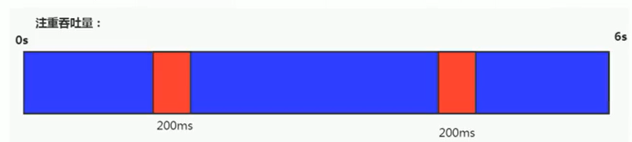

### 性能指标：暂停时间

“暂停时间”是指一个时间段内应用程序线程暂停，让Gc线程执行的状态

例如，GC期间1ee毫秒的暂停时间意味着在这1e0毫秒期间内没有应用程序线程是活动的。暂停时间优先，意味着尽可能让单次STW的时间最短：0.1+0.1 + 0.1+ 0.1+ 0.1=0.5

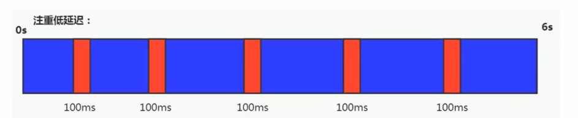

### 吞吐量vs暂停时间

高吞吐量较好因为这会让应用程序的最终用户感觉只有应用程序线程在做“生产性”工作。直觉上，吞吐量越高程序运行越快。

低暂停时间（低延迟）较好因为从最终用户的角度来看不管是GC还是其他原因导致一个应用被挂起始终是不好的。这取决于应用程序的类型，有时候甚至短暂的200毫秒暂停都可能打断终端用户体验。因此，具有低的较大暂停时间是非常重要的，特别是对于一个交互式应用程序。

不幸的是”高吞吐量”和”低暂停时间”是一对相互竞争的目标（矛盾）。

因为如果选择以吞吐量优先，那么必然需要降低内存回收的执行频率，但是这样会导致GC需要更长的暂停时间来执行内存回收。

相反的，如果选择以低延迟优先为原则，那么为了降低每次执行内存回收时的暂停时间，也只能频繁地执行内存回收，但这又引起了年轻代内存的缩减和导致程序吞吐量的下降。

在设计（或使用）GC算法时，我们必须确定我们的目标：一个GC算法只可能针对两个目标之一（即只专注于较大吞吐量或最小暂停时间），或尝试找到一个二者的折衷。

现在标准：**在最大吞吐量优先的情况下，降低停顿时间**

## 不同的垃圾回收器概述

垃圾收集机制是Java的招牌能力，极大地提高了开发效率。这当然也是面试的热点。

那么，Java常见的垃圾收集器有哪些？

> GC垃圾收集器是和JVM一脉相承的，它是和JVM进行搭配使用，在不同的使用场景对应的收集器也是有区别

### 垃圾回收器发展史

有了虚拟机，就一定需要收集垃圾的机制，这就是Garbage Collection，对应的产品我们称为Garbage Collector。

- 1999年随JDK1.3.1一起来的是串行方式的serialGc，它是第一款GC。ParNew垃圾收集器是Serial收集器的多线程版本
- 2002年2月26日，Parallel GC和Concurrent Mark Sweep GC跟随JDK1.4.2一起发布·
- Parallel GC在JDK6之后成为HotSpot默认GC。
- 2012年，在JDK1.7u4版本中，G1可用。
- 2017年，JDK9中G1变成默认的垃圾收集器，以替代CMS。
- 2018年3月，JDK10中G1垃圾回收器的并行完整垃圾回收，实现并行性来改善最坏情况下的延迟。
- 2018年9月，JDK11发布。引入Epsilon 垃圾回收器，又被称为 "No-Op(无操作)“ 回收器。同时，引入ZGC：可伸缩的低延迟垃圾回收器（Experimental）
- 2019年3月，JDK12发布。增强G1，自动返回未用堆内存给操作系统。同时，引入Shenandoah GC：低停顿时间的GC（Experimental）。·2019年9月，JDK13发布。增强zGC，自动返回未用堆内存给操作系统。
- 2020年3月，JDK14发布。删除cMs垃圾回收器。扩展zGC在macos和Windows上的应用

### 7种经典的垃圾收集器

- 串行回收器：Serial、Serial old
- 并行回收器：ParNew、Parallel Scavenge、Parallel old
- 并发回收器：CMS、G11


### 7款经典收集器与垃圾分代之间的关系


新生代收集器：Serial、ParNew、Paralle1 Scavenge；

老年代收集器：Serial old、Parallel old、CMS；

整堆收集器：G1；

### 垃圾收集器的组合关系


- 两个收集器间有连线，表明它们可以搭配使用：Serial/Serial old、Serial/CMS、ParNew/Serial old、ParNew/CMS、Parallel Scavenge/Serial 0ld、Parallel Scavenge/Parallel 01d、G1；
- 其中Serial o1d作为CMs出现"Concurrent Mode Failure"失败的后备预案。
- （红色虚线）由于维护和兼容性测试的成本，在JDK 8时将Serial+CMS、ParNew+Serial old这两个组合声明为废弃（JEP173），并在JDK9中完全取消了这些组合的支持（JEP214），即：移除。
- （绿色虚线）JDK14中：弃用Paralle1 Scavenge和Serialold GC组合（JEP366）
- （青色虚线）JDK14中：删除CMs垃圾回收器（JEP363）

为什么要有很多收集器，一个不够吗？因为Java的使用场景很多，移动端，服务器等。所以就需要针对不同的场景，提供不同的垃圾收集器，提高垃圾收集的性能。

虽然我们会对各个收集器进行比较，但并非为了挑选一个最好的收集器出来。没有一种放之四海皆准、任何场景下都适用的完美收集器存在，更加没有万能的收集器。所以我们选择的只是对具体应用最合适的收集器。

### 如何查看默认垃圾收集器

-XX:+PrintCommandLineFlags：查看命令行相关参数（包含使用的垃圾收集器）

使用命令行指令：jinfo -flag  相关垃圾回收器参数  进程ID

## Serial回收器：串行回收

Serial收集器是最基本、历史最悠久的垃圾收集器了。JDK1.3之前回收新生代唯一的选择。

Serial收集器作为HotSpot中client模式下的默认新生代垃圾收集器。

Serial收集器采用复制算法、串行回收和"stop-the-World"机制的方式执行内存回收。

除了年轻代之外，Serial收集器还提供用于执行老年代垃圾收集的Serial old收集器。Serial old收集器同样也采用了串行回收和"stop the World"机制，只不过内存回收算法使用的是标记-压缩算法。

- Serial old是运行在Client模式下默认的老年代的垃圾回收器
- Serial 0ld在Server模式下主要有两个用途：
  - 与新生代的Parallel scavenge配合使用
  - 作为老年代CMS收集器的后备垃圾收集方案


这个收集器是一个单线程的收集器，但它的“单线程”的意义并不仅仅说明它只会使用一个CPU或一条收集线程去完成垃圾收集工作，更重要的是在它进行垃圾收集时，必须暂停其他所有的工作线程，直到它收集结束（Stop The World）

优势：简单而高效（与其他收集器的单线程比），对于限定单个cPU的环境来说，Serial收集器由于没有线程交互的开销，专心做垃圾收集自然可以获得最高的单线程收集效率。

运行在client模式下的虚拟机是个不错的选择。

在用户的桌面应用场景中，可用内存一般不大（几十MB至一两百MB），可以在较短时间内完成垃圾收集（几十ms至一百多ms），只要不频繁发生，使用串行回收器是可以接受的。

在HotSpot虚拟机中，使用-XX：+UseSerialGC参数可以指定年轻代和老年代都使用串行收集器。

等价于新生代用Serial GC，且老年代用Serial old GC

### 总结

这种垃圾收集器大家了解，现在已经不用串行的了。而且在限定单核cpu才可以用。现在都不是单核的了。

对于交互较强的应用而言，这种垃圾收集器是不能接受的。一般在Java web应用程序中是不会采用串行垃圾收集器的。

## ParNew回收器：并行回收

如果说serialGC是年轻代中的单线程垃圾收集器，那么ParNew收集器则是serial收集器的多线程版本。

- Par是Parallel的缩写，New：只能处理的是新生代

ParNew 收集器除了采用并行回收的方式执行内存回收外，两款垃圾收集器之间几乎没有任何区别。ParNew收集器在年轻代中同样也是采用复制算法、"stop-the-World"机制。

ParNew 是很多JVM运行在Server模式下新生代的默认垃圾收集器。

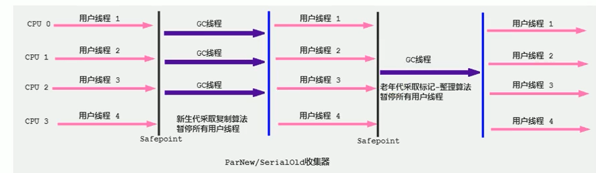

- 对于新生代，回收次数频繁，使用并行方式高效。
- 对于老年代，回收次数少，使用串行方式节省资源。（CPU并行需要切换线程，串行可以省去切换线程的资源）

由于ParNew收集器是基于并行回收，那么是否可以断定ParNew收集器的回收效率在任何场景下都会比serial收集器更高效？

-  

因为除Serial外，目前只有ParNew GC能与CMS收集器配合工作

在程序中，开发人员可以通过选项"-XX：+UseParNewGC"手动指定使用ParNew收集器执行内存回收任务。它表示年轻代使用并行收集器，不影响老年代。

-XX:ParallelGCThreads限制线程数量，默认开启和CPU数据相同的线程数。

## Parallel回收器：吞吐量优先

HotSpot的年轻代中除了拥有ParNew收集器是基于并行回收的以外，Parallel Scavenge收集器同样也采用了复制算法、并行回收和"Stop the World"机制。

那么Parallel 收集器的出现是否多此一举？

- 和ParNew收集器不同，ParallelScavenge收集器的目标则是达到一个可控制的吞吐量（Throughput），它也被称为吞吐量优先的垃圾收集器。
- 自适应调节策略也是Paralle1 Scavenge与ParNew一个重要区别。

高吞吐量则可以高效率地利用CPU时间，尽快完成程序的运算任务，主要适合在后台运算而不需要太多交互的任务。因此，常见在服务器环境中使用。例如，那些执行批量处理、订单处理、工资支付、科学计算的应用程序。

Paralle1收集器在JDK1.6时提供了用于执行老年代垃圾收集的Paralle1o1d收集器，用来代替老年代的serialold收集器。

Parallel old收集器采用了标记-压缩算法，但同样也是基于并行回收和"stop-the-World"机制。


在程序吞吐量优先的应用场景中，IParalle1收集器和Parallel old收集器的组合，在server模式下的内存回收性能很不错。在Java8中，默认是此垃圾收集器。

### 参数配置

-XX：+UseParallelGC 手动指定年轻代使用Paralle1并行收集器执行内存回收任务。

-XX：+UseParalleloldcc 手动指定老年代都是使用并行回收收集器。

- 分别适用于新生代和老年代。默认jdk8是开启的。
- 上面两个参数，默认开启一个，另一个也会被开启。（互相激活）

-XX:ParallelGcrhreads设置年轻代并行收集器的线程数。一般地，最好与CPU数量相等，以避免过多的线程数影响垃圾收集性能。

在默认情况下，当CPU数量小于8个，ParallelGcThreads的值等于CPU数量。

当CPU数量大于8个，ParallelGCThreads的值等于3+[5*CPU Count]/8]

-XX:MaxGCPauseMillis 设置垃圾收集器最大停顿时间（即STw的时间）。单位是毫秒。

为了尽可能地把停顿时间控制在MaxGCPauseMi11s以内，收集器在工作时会调整Java堆大小或者其他一些参数。
对于用户来讲，停顿时间越短体验越好。但是在服务器端，我们注重高并发，整体的吞吐量。所以服务器端适合Parallel，进行控制。该参数使用需谨慎。

-XX:GCTimeRatio垃圾收集时间占总时间的比例（=1/（N+1））。用于衡量吞吐量的大小。

取值范围（0，100）。默认值99，也就是垃圾回收时间不超过1。

与前一个-xx:MaxGCPauseMillis参数有一定矛盾性。暂停时间越长，Radio参数就容易超过设定的比例。

-XX:+UseAdaptivesizepplicy 设置Parallel scavenge收集器具有自适应调节策略

在这种模式下，年轻代的大小、Eden和Survivor的比例、晋升老年代的对象年龄等参数会被自动调整，已达到在堆大小、吞吐量和停顿时间之间的平衡点。

在手动调优比较困难的场合，可以直接使用这种自适应的方式，仅指定虚拟机的最大堆、目标的吞吐量（GCTimeRatio）和停顿时间（MaxGCPauseMil1s），让虚拟机自己完成调优工作。

## CMS回收器：低延迟

在JDK1.5时期，Hotspot推出了一款在强交互应用中几乎可认为有划时代意义的垃圾收集器：cMS（Concurrent-Mark-Sweep）收集器，这款收集器是HotSpot虚拟机中第一款真正意义上的并发收集器，**它第一次实现了让垃圾收集线程与用户线程同时工作**。

CMS收集器的关注点是尽可能缩短垃圾收集时用户线程的停顿时间。停顿时间越短（低延迟）就越适合与用户交互的程序，良好的响应速度能提升用户体验。

目前很大一部分的Java应用集中在互联网站或者B/S系统的服务端上，这类应用尤其重视服务的响应速度，希望系统停顿时间最短，以给用户带来较好的体验。CMS收集器就非常符合这类应用的需求。

CMS的垃圾收集算法采用标记-清除算法，并且也会"stop-the-world"

不幸的是，CMS作为老年代的收集器，却无法与JDK1.4.0中已经存在的新生代收集器Parallel Scavenge配合工作，所以在JDK1.5中使用CMS来收集老年代的时候，新生代只能选择ParNew或者Serial收集器中的一个。

在G1出现之前，CMS使用还是非常广泛的。一直到今天，仍然有很多系统使用CMS GC。


CMS整个过程比之前的收集器要复杂，整个过程分为4个主要阶段，即初始标记阶段、并发标记阶段、重新标记阶段和并发清除阶段。(涉及STW的阶段主要是：初始标记 和 重新标记)

- **初始标记**（Initial-Mark）阶段：在这个阶段中，程序中所有的工作线程都将会因为“stop-the-world”机制而出现短暂的暂停，这个阶段的主要任务仅仅只是**标记出GCRoots能直接关联到的对象**。一旦标记完成之后就会恢复之前被暂停的所有应用线程。由于直接关联对象比较小，所以这里的速度非常快。
- **并发标记**（Concurrent-Mark）阶段：从Gc Roots的直接关联对象开始遍历整个对象图的过程，这个过程耗时较长但是不需要停顿用户线程，可以与垃圾收集线程一起并发运行。
- **重新标记**（Remark）阶段：由于在并发标记阶段中，程序的工作线程会和垃圾收集线程同时运行或者交叉运行，因此为了修正并发标记期间，因用户程序继续运作而导致标记产生变动的那一部分对象的标记记录，这个阶段的停顿时间通常会比初始标记阶段稍长一些，但也远比并发标记阶段的时间短。
- **并发清除**（Concurrent-Sweep）阶段：此阶段清理删除掉标记阶段判断的已经死亡的对象，释放内存空间。由于不需要移动存活对象，所以这个阶段也是可以与用户线程同时并发的

尽管CMS收集器采用的是并发回收（非独占式），但是在其初始化标记和再次标记这两个阶段中仍然需要执行“Stop-the-World”机制暂停程序中的工作线程，不过暂停时间并不会太长，因此可以说明目前所有的垃圾收集器都做不到完全不需要“stop-the-World”，只是尽可能地缩短暂停时间。

由于最耗费时间的并发标记与并发清除阶段都不需要暂停工作，所以整体的回收是低停顿的。

另外，由于在垃圾收集阶段用户线程没有中断，所以在CMS回收过程中，还应该确保应用程序用户线程有足够的内存可用。因此，CMS收集器不能像其他收集器那样等到老年代几乎完全被填满了再进行收集，而是当堆内存使用率达到某一阈值时，便开始进行回收，以确保应用程序在CMS工作过程中依然有足够的空间支持应用程序运行。要是CMS运行期间预留的内存无法满足程序需要，就会出现一次“Concurrent Mode Failure”
失败，这时虚拟机将启动后备预案：临时启用Serial old收集器来重新进行老年代的垃圾收集，这样停顿时间就很长了。

CMS收集器的垃圾收集算法采用的是**标记清除算法**，这意味着每次执行完内存回收后，由于被执行内存回收的无用对象所占用的内存空间极有可能是不连续的一些内存块，不可避免地将会产生一些内存碎片。那么CMS在为新对象分配内存空间时，将无法使用指针碰撞（Bump the Pointer）技术，而只能够选择空闲列表（Free List）执行内存分配。

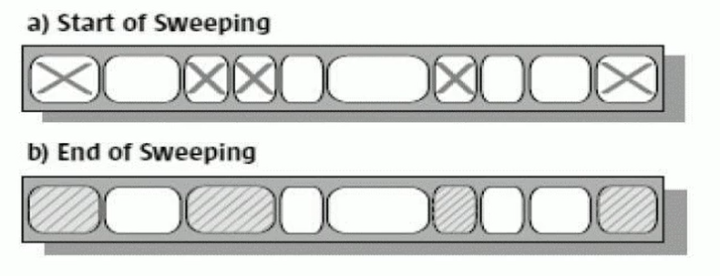

### CMS为什么不使用标记整理算法？

答案其实很简答，因为当并发清除的时候，用Compact整理内存的话，原来的用户线程使用的内存还怎么用呢？要保证用户线程能继续执行，前提的它运行的资源不受影响嘛。Mark Compact更适合“stop the world”
这种场景下使用

### 优点

- 并发收集
- 低延迟

### 缺点

- 会产生内存碎片，导致并发清除后，用户线程可用的空间不足。在无法分配大对象的情况下，不得不提前触发FullGC。

- CMS收集器对CPU资源非常敏感。在并发阶段，它虽然不会导致用户停顿，但是会因为占用了一部分线程而导致应用程序变慢，总吞吐量会降低。
- CMS收集器无法处理浮动垃圾。可能出现“Concurrent Mode Failure"失败而导致另一次Full GC的产生。在并发标记阶段由于程序的工作线程和垃圾收集线程是同时运行或者交叉运行的，那么在并发标记阶段如果产生新的垃圾对象，CMS将无法对这些垃圾对象进行标记，最终会导致这些新产生的垃圾对象没有被及时回收，从而只能在下一次执行GC时释放这些之前未被回收的内存空间。

### 设置的参数

- -XX：+UseConcMarkSweepGC手动指定使用CMS收集器执行内存回收任务。

开启该参数后会自动将-xx：+UseParNewGC打开。即：ParNew（Young区用）+CMS（01d区用）+Serial old的组合。

- -XX:CMSInitiatingoccupanyFraction 设置堆内存使用率的阈值，一旦达到该阈值，便开始进行回收。

JDK5及以前版本的默认值为68，即当老年代的空间使用率达到68%时，会执行一次cMs回收。JDK6及以上版本默认值为92%

如果内存增长缓慢，则可以设置一个稍大的值，大的阀值可以有效降低CMS的触发频率，减少老年代回收的次数可以较为明显地改善应用程序性能。反之，如果应用程序内存使用率增长很快，则应该降低这个阈值，以避免频繁触发老年代串行收集器。因此通过该选项便可以有效降低Ful1Gc的执行次数。

- -XX：+UseCMSCompactAtFullCollection用于指定在执行完Ful1

GC后对内存空间进行压缩整理，以此避免内存碎片的产生。不过由于内存压缩整理过程无法并发执行，所带来的问题就是停顿时间变得更长了。

- -XX:CMSFullGCsBeforecompaction 设置在执行多少次Ful1GC后对内存空间进行压缩整理。

- -XX:ParallelcMSThreads 设置cMs的线程数量。

CMs默认启动的线程数是（Paralle1GCThreads+3）/4，ParallelGCThreads是年轻代并行收集器的线程数。当CPU资源比较紧张时，受到CMS收集器线程的影响，应用程序的性能在垃圾回收阶段可能会非常糟糕。

### 小结

HotSpot有这么多的垃圾回收器，那么如果有人问，Serial GC、Parallel GC、Concurrent Mark Sweep GC这三个Gc有什么不同呢？

请记住以下口令：

- 如果你想要最小化地使用内存和并行开销，请选Serial GC；
- 如果你想要最大化应用程序的吞吐量，请选Parallel GC；
- 如果你想要最小化GC的中断或停顿时间，请选CMs GC。

### JDK后续版本中CMS的变化

**JDK9新特性**：CMS被标记为eprecate了（JEP291）>如果对JDK9及以上版本的HotSpot虚拟机使用参数-XX：
+UseConcMarkSweepGC来开启CMS收集器的话，用户会收到一个警告信息，提示CMS未来将会被废弃。

JDK14新特性：删除CMs垃圾回收器（JEP363）移除了CMS垃圾收集器，如果在JDK14中使用
XX：+UseConcMarkSweepGC的话，JVM不会报错，只是给出一个warning信息，但是不会exit。JVM会自动回退以默认GC方式启动JVM

## G1回收器：区域化分代式

### 既然我们已经有了前面几个强大的GC，为什么还要发布Garbage First（G1）？

原因就在于应用程序所应对的业务越来越庞大、复杂，用户越来越多，没有GC就不能保证应用程序正常进行，而经常造成STW的GC又跟不上实际的需求，所以才会不断地尝试对GC进行优化。G1（Garbage-First）垃圾回收器是在Java7 update4之后引入的一个新的垃圾回收器，是当今收集器技术发展的最前沿成果之一。

与此同时，为了适应现在不断扩大的内存和不断增加的处理器数量，进一步降低暂停时间（pause time），同时兼顾良好的吞吐量。

**官方给G1设定的目标是在延迟可控的情况下获得尽可能高的吞吐量，所以才担当起“全功能收集器”的重任与期望**。

### 为什么名字叫 Garbage First(G1)呢？

因为G1是一个并行回收器，它把堆内存分割为很多不相关的区域（Region）（物理上不连续的）。使用不同的Region来表示Eden、幸存者0区，幸存者1区，老年代等。

G1 GC有计划地避免在整个Java堆中进行全区域的垃圾收集。G1跟踪各个Region里面的垃圾堆积的价值大小（回收所获得的空间大小以及回收所需时间的经验值），在后台维护一个优先列表，每次根据允许的收集时间，优先回收价值最大的Region。

由于这种方式的侧重点在于回收垃圾最大量的区间（Region），所以我们给G1一个名字：垃圾优先（Garbage First）。

G1（Garbage-First）是一款面向服务端应用的垃圾收集器，主要针对配备多核CPU及大容量内存的机器，以极高概率满足GC停顿时间的同时，还兼具高吞吐量的性能特征。

在JDK1.7版本正式启用，移除了Experimenta1的标识，是JDK9以后的默认垃圾回收器，取代了CMS回收器以及Paralle1+Parallel old组合。被orac1e官方称为“全功能的垃圾收集器”。

与此同时，CMS已经在JDK9中被标记为废弃（deprecated）。在jdk8中还不是默认的垃圾回收器，需要使用-xx：+UseG1GC来启用。

### G1垃圾收集器的优点

与其他GC收集器相比，G1使用了全新的分区算法，其特点如下所示：

**并行与并发**

- 并行性：G1在回收期间，可以有多个GC线程同时工作，有效利用多核计算能力。此时用户线程STW
- 并发性：G1拥有与应用程序交替执行的能力，部分工作可以和应用程序同时执行，因此，一般来说，不会在整个回收阶段发生完全阻塞应用程序的情况

**分代收集**

- 从分代上看，G1依然属于分代型垃圾回收器，它会区分年轻代和老年代，年轻代依然有Eden区和Survivor区。但从堆的结构上看，它不要求整个Eden区、年轻代或者老年代都是连续的，也不再坚持固定大小和固定数量。
- 将堆空间分为若干个区域（Region），这些区域中包含了逻辑上的年轻代和老年代。
- 和之前的各类回收器不同，它同时兼顾年轻代和老年代。对比其他回收器，或者工作在年轻代，或者工作在老年代；

G1所谓的分代，已经不是下面这样的了


而是这样的一个区域


**空间整合**

- CMS：“标记-清除”算法、内存碎片、若干次Gc后进行一次碎片整理
- G1将内存划分为一个个的region。内存的回收是以region作为基本单位的。Region之间是复制算法，但整体上实际可看作是标记-压缩（Mark-Compact）算法，两种算法都可以避免内存碎片。这种特性有利于程序长时间运行，分配大对象时不会因为无法找到连续内存空间而提前触发下一次GC。尤其是当Java堆非常大的时候，G1的优势更加明显。

**可预测的停顿时间模型（即：软实时soft real-time）**
这是G1相对于CMS的另一大优势，G1除了追求低停顿外，还能建立可预测的停顿时间模型，能让使用者明确指定在一个长度为M毫秒的时间片段内，消耗在垃圾收集上的时间不得超过N毫秒。

- 由于分区的原因，G1可以只选取部分区域进行内存回收，这样缩小了回收的范围，因此对于全局停顿情况的发生也能得到较好的控制。
- G1跟踪各个Region里面的垃圾堆积的价值大小（回收所获得的空间大小以及回收所需时间的经验值），在后台维护一个优先列表，每次根据允许的收集时间，优先回收价值最大的Region。保证了G1收集器在有限的时间内可以获取尽可能高的收集效率。
- 相比于CMSGC，G1未必能做到CMS在最好情况下的延时停顿，但是最差情况要好很多。

### G1垃圾收集器的缺点

相较于CMS，G1还不具备全方位、压倒性优势。比如在用户程序运行过程中，G1无论是为了垃圾收集产生的内存占用（Footprint）还是程序运行时的额外执行负载（overload）都要比CMS要高。

从经验上来说，在小内存应用上CMS的表现大概率会优于G1，而G1在大内存应用上则发挥其优势。平衡点在6-8GB之间。

### G1参数设置

- -XX:+UseG1GC：手动指定使用G1垃圾收集器执行内存回收任务
- -XX:G1HeapRegionSize设置==每个Region的大小==。值是2的幂，范围是1MB到32MB之间，目标是根据最小的Java堆大小划分出约2048个区域。默认是堆内存的1/2000。
- -XX:MaxGCPauseMillis 设置期望达到的最大Gc停顿时间指标（JVM会尽力实现，但不保证达到）。默认值是200ms
- -XX:+ParallelGcThread 设置STW工作线程数的值。最多设置为8
- -XX:ConcGCThreads 设置并发标记的线程数。将n设置为并行垃圾回收线程数（ParallelGcThreads）的1/4左右。
- -XX:InitiatingHeapoccupancyPercent 设置触发并发Gc周期的Java堆占用率阈值。超过此值，就触发GC。默认值是45。

### G1收集器的常见操作步骤

G1的设计原则就是简化JVM性能调优，开发人员只需要简单的三步即可完成调优：

- 第一步：开启G1垃圾收集器
- 第二步：设置堆的最大内存
- 第三步：设置最大的停顿时间

G1中提供了三种垃圾回收模式：YoungGC、Mixed GC和Fu11GC，在不同的条件下被触发。

### G1收集器的适用场景

面向服务端应用，针对具有大内存、多处理器的机器。（在普通大小的堆里表现并不惊喜）

最主要的应用是需要低GC延迟，并具有大堆的应用程序提供解决方案；

如：在堆大小约6GB或更大时，可预测的暂停时间可以低于e.5秒；（G1通过每次只清理一部分而不是全部的Region的增量式清理来保证每次Gc停顿时间不会过长）。
用来替换掉JDK1.5中的CMS收集器；在下面的情况时，使用61可能比CMS好：

- 超过5e%的Java堆被活动数据占用；
- 对象分配频率或年代提升频率变化很大；
- GC停顿时间过长（长于e.5至1秒）

HotSpot垃圾收集器里，除了61以外，其他的垃圾收集器使用内置的JVM线程执行Gc的多线程操作，而G1GC可以采用应用线程承担后台运行的GC工作，即当JVM的GC线程处理速度慢时，系统会调用应用程序线程帮助加速垃圾回收过程。

### 分区Region：化整为零

使用G1收集器时，它将整个Java堆划分成约==2048个大小==相同的独立Region块，每个Region块大小根据堆空间的实际大小而定，整体被控制在1MB到32MB之间，且为2的N次幂，即1MB，2MB，4MB，8MB，16MB，32MB。可以通过

XX:G1HeapRegionsize设定。所有的Region大小相同，且在JVM生命周期内不会被改变。

虽然还保留有新生代和老年代的概念，但新生代和老年代不再是物理隔离的了，它们都是一部分Region（不需要连续）的集合。通过Region的动态分配方式实现逻辑上的连续。


一个region有可能属于Eden，Survivor或者old/Tenured内存区域。但是一个region只可能属于一个角色。图中的E表示该region属于Eden内存区域，s表示属于survivor内存区域，o表示属于01d内存区域。图中空白的表示未使用的内存空间。

G1垃圾收集器还增加了一种新的内存区域，叫做Humongous内存区域，如图中的H块。主要用于存储大对象，如果超过1.5个region，就放到H。

**设置H的原因：**对于堆中的对象，默认直接会被分配到老年代，但是如果它是一个短期存在的大对象就会对垃圾收集器造成负面影响。为了解决这个问题，G1划分了一个Humongous区，它用来专门存放大对象。如果一个H区装不下一个大对象，那么G1会寻找连续的H区来存储。为了能找到连续的H区，有时候不得不启动Fu11Gc。G1的大多数行为都把H区作为老年代的一部分来看待。

每个Region都是通过指针碰撞来分配空间

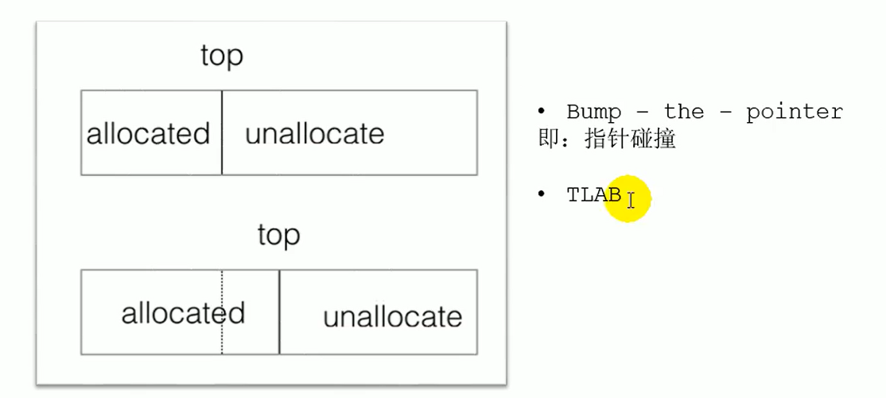

### G1垃圾回收器的回收过程

G1GC的垃圾回收过程主要包括如下三个环节：

- 年轻代GC（Young GC）
- 老年代并发标记过程（Concurrent Marking）
- 混合回收（Mixed GC）

（如果需要，单线程、独占式、高强度的Fu11GC还是继续存在的。它针对GC的评估失败提供了一种失败保护机制，即强力回收。）


顺时针，young gc->young gc+concurrent mark->Mixed GC顺序，进行垃圾回收。

应用程序分配内存，当年轻代的Eden区用尽时开始年轻代回收过程；G1的年轻代收集阶段是一个并行的独占式收集器。在年轻代回收期，G1GC暂停所有应用程序线程，启动多线程执行年轻代回收。然后从年轻代区间移动存活对象到Survivor区间或者老年区间，也有可能是两个区间都会涉及。

当堆内存使用达到一定值（默认45%）时，开始老年代并发标记过程。

标记完成马上开始混合回收过程。对于一个混合回收期，G1GC从老年区间移动存活对象到空闲区间，这些空闲区间也就成为了老年代的一部分。和年轻代不同，老年代的G1回收器和其他GC不同，G1的老年代回收器不需要整个老年代被回收，一次只需要扫描/回收一小部分老年代的Region就可以了。同时，这个老年代Region是和年轻代一起被回收的。

举个例子：一个Web服务器，Java进程最大堆内存为4G，每分钟响应1500个请求，每45秒钟会新分配大约2G的内存。G1会每45秒钟进行一次年轻代回收，每31个小时整个堆的使用率会达到45%，会开始老年代并发标记过程，标记完成后开始四到五次的混合回收。

### Remembered Set（记忆集）

一个对象被不同区域引用的问题

一个Region不可能是孤立的，一个Region中的对象可能被其他任意Region中对象引用，判断对象存活时，是否需要扫描整个Java堆才能保证准确？

在其他的分代收集器，也存在这样的问题（而G1更突出）回收新生代也不得不同时扫描老年代？这样的话会降低MinorGC的效率；

**解决方法：**

无论G1还是其他分代收集器，JVM都是使用Remembered Set来避免全局扫描：

每个Region都有一个对应的Remembered Set；每次Reference类型数据写操作时，都会产生一个Write Barrier暂时中断操作；

然后检查将要写入的引用指向的对象是否和该Reference类型数据在不同的Region（其他收集器：检查老年代对象是否引用了新生代对象）；如果不同，通过cardTable把相关引用信息记录到引用指向对象的所在Region对应的Remembered Set中；当进行垃圾收集时，在GC根节点的枚举范围加入Remembered Set；就可以保证不进行全局扫描，也不会有遗漏。


### G1回收过程-年轻代GC

JVM启动时，G1先准备好Eden区，程序在运行过程中不断创建对象到Eden区，当Eden空间耗尽时，G1会启动一次年轻代垃圾回收过程。

YGC时，首先G1停止应用程序的执行（stop-The-Wor1d），G1创建回收集（Collection Set），回收集是指需要被回收的内存分段的集合，年轻代回收过程的回收集包含年轻代Eden区和Survivor区所有的内存分段。


然后开始如下回收过程：

- 第一阶段，扫描根

根是指static变量指向的对象，正在执行的方法调用链条上的局部变量等。根引用连同RSet记录的外部引用作为扫描存活对象的入口。

- 第二阶段，更新RSet

处理dirty card queue（见备注）中的card，更新RSet。此阶段完成后，RSet可以准确的反映老年代对所在的内存分段中对象的引用。

- 第三阶段，处理RSet

识别被老年代对象指向的Eden中的对象，这些被指向的Eden中的对象被认为是存活的对象。

- 第四阶段，复制对象。

此阶段，对象树被遍历，Eden区内存段中存活的对象会被复制到Survivor区中空的内存分段，Survivor区内存段中存活的对象如果年龄未达阈值，年龄会加1，达到阀值会被会被复制到o1d区中空的内存分段。如果Survivor空间不够，Eden空间的部分数据会直接晋升到老年代空间。

- 第五阶段，处理引用

处理Soft，Weak，Phantom，Final，JNI Weak 等引用。最终Eden空间的数据为空，GC停止工作，而目标内存中的对象都是连续存储的，没有碎片，所以复制过程可以达到内存整理的效果，减少碎片。

### G1回收过程-并发标记过程

- 初始标记阶段：标记从根节点直接可达的对象。这个阶段是sTw的，并且会触发一次年轻代GC。
- 根区域扫描（Root Region Scanning）：G1 Gc扫描survivor区直接可达的老年代区域对象，并标记被引用的对象。这一过程必须在youngGC之前完成。
- 并发标记（Concurrent Marking）：在整个堆中进行并发标记（和应用程序并发执行），此过程可能被youngGC中断。在并发标记阶段，若发现区域对象中的所有对象都是垃圾，那这个区域会被立即回收。同时，并发标记过程中，会计算每个区域的对象活性（区域中存活对象的比例）。
- 再次标记（Remark）：由于应用程序持续进行，需要修正上一次的标记结果。是STW的。G1中采用了比CMS更快的初始快照算法：snapshot-at-the-beginning（SATB）。
- 独占清理（cleanup，STW）：计算各个区域的存活对象和GC回收比例，并进行排序，识别可以混合回收的区域。为下阶段做铺垫。是sTw的。这个阶段并不会实际上去做垃圾的收集
- 并发清理阶段：识别并清理完全空闲的区域。

### G1回收过程 - 混合回收

当越来越多的对象晋升到老年代o1d region时，为了避免堆内存被耗尽，虚拟机会触发一个混合的垃圾收集器，即Mixed GC，该算法并不是一个old GC，除了回收整个Young Region，还会回收一部分的old Region。这里需要注意：**是一部分老年代，而不是全部老年代**。可以选择哪些o1d Region进行收集，从而可以对垃圾回收的耗时时间进行控制。也要注意的是Mixed GC并不是Full GC。


并发标记结束以后，老年代中百分百为垃圾的内存分段被回收了，部分为垃圾的内存分段被计算了出来。默认情况下，这些老年代的内存分段会分8次（可以通过-XX:G1MixedGCCountTarget设置）被回收

混合回收的回收集（Collection Set）包括八分之一的老年代内存分段，Eden区内存分段，Survivor区内存分段。混合回收的算法和年轻代回收的算法完全一样，只是回收集多了老年代的内存分段。具体过程请参考上面的年轻代回收过程。

由于老年代中的内存分段默认分8次回收，G1会优先回收垃圾多的内存分段。垃圾占内存分段比例越高的，越会被先回收。并且有一个阈值会决定内存分段是否被回收，

XX:G1MixedGCLiveThresholdPercent，默认为65%，意思是垃圾占内存分段比例要达到65%才会被回收。如果垃圾占比太低，意味着存活的对象占比高，在复制的时候会花费更多的时间。

混合回收并不一定要进行8次。有一个阈值-XX:G1HeapWastePercent，默认值为1e%，意思是允许整个堆内存中有10%的空间被浪费，意味着如果发现可以回收的垃圾占堆内存的比例低于1e%，则不再进行混合回收。因为GC会花费很多的时间但是回收到的内存却很少。

### G1回收可选的过程4 - Full GC

G1的初衷就是要避免Fu11GC的出现。但是如果上述方式不能正常工作，G1会停止应用程序的执行（stop-The-world），使用单线程的内存回收算法进行垃圾回收，性能会非常差，应用程序停顿时间会很长。

要避免Fu11GC的发生，一旦发生需要进行调整。什么时候会发生Ful1GC呢？比如堆内存太小，当G1在复制存活对象的时候没有空的内存分段可用，则会回退到ful1gc，这种情况可以通过增大内存解决。
导致61Fu11GC的原因可能有两个：

- EVacuation的时候没有足够的to-space来存放晋升的对象；
- 并发处理过程完成之前空间耗尽。

### G1回收的优化建议

 从oracle官方透露出来的信息可获知，回收阶段（Evacuation）其实本也有想过设计成与用户程序一起并发执行，但这件事情做起来比较复杂，考虑到G1只是回一部分Region，停顿时间是用户可控制的，所以并不迫切去实现，而选择把这个特性放到了G1之后出现的低延迟垃圾收集器（即ZGC）中。另外，还考虑到G1不是仅仅面向低延迟，停顿用户线程能够最大幅度提高垃圾收集效率，为了保证吞吐量所以才选择了完全暂停用户线程的实现方案。

年轻代大小

- 避免使用-Xmn或-XX:NewRatio等相关选项显式设置年轻代大小
- 固定年轻代的大小会覆盖

暂停时间目标暂停时间目标不要太过严苛

- G1 GC的吞吐量目标是90%的应用程序时间和10%的垃圾回收时间
- 评估G1GC的吞吐量时，暂停时间目标不要太严苛。目标太过严苛表示你愿意承受更多的垃圾回收开销，而这些会直接影响到吞吐量。

## 垃圾回收器总结

截止JDK1.8，一共有7款不同的垃圾收集器。每一款的垃圾收集器都有不同的特点，在具体使用的时候，需要根据具体的情况选用不同的垃圾收集器。


GC发展阶段：Seria l=> Parallel（并行）=> CMS（并发）=> G1 => ZGC

不同厂商、不同版本的虚拟机实现差距比较大。HotSpot虚拟机在JDK7/8后所有收集器及组合如下图


### 怎么选择垃圾回收器

Java垃圾收集器的配置对于JVM优化来说是一个很重要的选择，选择合适的垃圾收集器可以让JVM的性能有一个很大的提升。怎么选择垃圾收集器？

- 优先调整堆的大小让JVM自适应完成。
- 如果内存小于100M，使用串行收集器
- 如果是单核、单机程序，并且没有停顿时间的要求，串行收集器
- 如果是多CPU、需要高吞吐量、允许停顿时间超过1秒，选择并行或者JVM自己选择
- 如果是多CPU、追求低停顿时间，需快速响应（比如延迟不能超过1秒，如互联网应用），使用并发收集器
- 官方推荐G1，性能高。现在互联网的项目，基本都是使用G1。

最后需要明确一个观点：

- 没有最好的收集器，更没有万能的收集
- 调优永远是针对特定场景、特定需求，不存在一劳永逸的收集器

### 面试

对于垃圾收集，面试官可以循序渐进从理论、实践各种角度深入，也未必是要求面试者什么都懂。但如果你懂得原理，一定会成为面试中的加分项。
这里较通用、基础性的部分如下：

垃圾收集的算法有哪些？如何判断一个对象是否可以回收？

垃圾收集器工作的基本流程。

另外，大家需要多关注垃圾回收器这一章的各种常用的参数

## GC日志分析

通过阅读Gc日志，我们可以了解Java虚拟机内存分配与回收策略。
内存分配与垃圾回收的参数列表

- -XX:+PrintGc输出GC日志。类似：-verbose:gc
- -XX:+PrintGcDetails输出Gc的详细日志
- -XX:+PrintGcTimestamps 输出Gc的时间戳（以基准时间的形式）
- -XX:+PrintGCDatestamps 输出Gc的时间戳（以日期的形式，如2013-05-04T21：53：59.234+0800）
- -XX:+PrintHeapAtGC在进行Gc的前后打印出堆的信息
- -Xloggc:../logs/gc.1og日志文件的输出路径

### verbose:gc

打开GC日志

```bash
-verbose:gc
```

这个只会显示总的GC堆的变化，如下：


参数解析


### PrintGCDetails

打开GC日志

```bash
-verbose:gc -XX:+PrintGCDetails
```

输入信息如下


参数解析

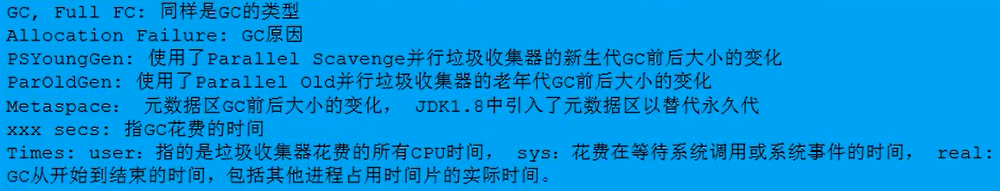

### 补充

- [GC"和"[Fu11GC"说明了这次垃圾收集的停顿类型，如果有"Fu11"则说明GC发生了"stop The World"
- 使用Seria1收集器在新生代的名字是Default New Generation，因此显示的是"[DefNew"
- 使用ParNew收集器在新生代的名字会变成"[ParNew"，意思是"Parallel New Generation"
- 使用Paralle1 scavenge收集器在新生代的名字是”[PSYoungGen"
- 老年代的收集和新生代道理一样，名字也是收集器决定的
- 使用G1收集器的话，会显示为"garbage-first heap"

Allocation Failure表明本次引起GC的原因是因为在年轻代中没有足够的空间能够存储新的数据了。

[PSYoungGen：5986K->696K（8704K）]5986K->704K（9216K）中括号内：GC回收前年轻代大小，回收后大小，（年轻代总大小）括号外：GC回收前年轻代和老年代大小，回收后大小，（年轻代和老年代总大小）

user代表用户态回收耗时，sys内核态回收耗时，rea实际耗时。由于多核的原因，时间总和可能会超过rea1时间

### Young GC图片


### FullGC图片、


### GC回收举例

我们编写一个程序，用来说明GC收集的过程

```java
/**
 * GC垃圾收集过程
 * @author: 陌溪
 * @create: 2020-07-14-8:35
 */
public class GCUseTest {
    static final Integer _1MB = 1024 * 1024;
    public static void main(String[] args) {
        byte [] allocation1, allocation2, allocation3, allocation4;
        allocation1 = new byte[2 *_1MB];
        allocation2 = new byte[2 *_1MB];
        allocation3 = new byte[2 *_1MB];
        allocation4 = new byte[4 *_1MB];
    }
}
```

我们设置JVM启动参数

```bash
-Xms10m -Xmx10m -XX:+PrintGCDetails
```

首先我们会将3个2M的数组存放到Eden区，然后后面4M的数组来了后，将无法存储，因为Eden区只剩下2M的剩余空间了，那么将会进行一次Young GC操作，将原来Eden区的内容，存放到Survivor区，但是Survivor区也存放不下，那么就会直接晋级存入Old 区


然后我们将4M对象存入到Eden区中


可以用一些工具去分析这些GC日志

常用的日志分析工具有：GCViewer、GCEasy、GCHisto、GCLogViewer、Hpjmeter、garbagecat等

**GCViewer**


**GC easy**

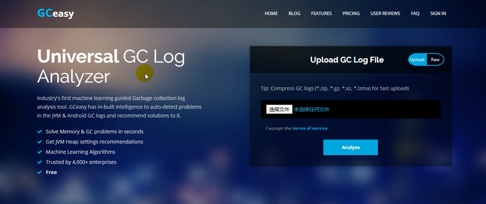


## 垃圾回收器的新发展

GC仍然处于飞速发展之中，目前的默认选项G1GC在不断的进行改进，很多我们原来认为的缺点，例如串行的Fu11GC、Card Table扫描的低效等，都已经被大幅改进，例如，JDK10以后，Fu11GC已经是并行运行，在很多场景下，其表现还略优于ParallelGC的并行Ful1GC实现。

即使是SerialGC，虽然比较古老，但是简单的设计和实现未必就是过时的，它本身的开销，不管是GC相关数据结构的开销，还是线程的开销，都是非常小的，所以随着云计算的兴起，在serverless等新的应用场景下，Serial Gc找到了新的舞台。

比较不幸的是CMSGC，因为其算法的理论缺陷等原因，虽然现在还有非常大的用户群体，但在JDK9中已经被标记为废弃，并在JDK14版本中移除

Epsilon:A No-Op GarbageCollector（Epsilon垃圾回收器，"No-Op（无操作）"回收器）http://openidk.iava.net/iep s/318

ZGC:A Scalable Low-Latency Garbage Collector（Experimental）（ZGC：可伸缩的低延迟垃圾回收器，处于实验性阶段）

现在G1回收器已成为默认回收器好几年了。我们还看到了引入了两个新的收集器：ZGC（JDK11出现）和Shenandoah（Open JDK12）

>主打特点：低停顿时间

### Open JDK12的Shenandoash GC

Open JDK12的shenandoash GC：低停顿时间的GC（实验性）

Shenandoah，无疑是众多GC中最孤独的一个。是第一款不由oracle公司团队领导开发的Hotspot垃圾收集器。不可避免的受到官方的排挤。比如号称openJDK和OracleJDk没有区别的Oracle公司仍拒绝在oracleJDK12中支持Shenandoah。

Shenandoah垃圾回收器最初由RedHat进行的一项垃圾收集器研究项目Pauseless GC的实现，旨在针对JVM上的内存回收实现低停顿的需求。在2014年贡献给OpenJDK。

Red Hat研发Shenandoah团队对外宣称，Shenandoah垃圾回收器的暂停时间与堆大小无关，这意味着无论将堆设置为200MB还是200GB，99.9%的目标都可以把垃圾收集的停顿时间限制在十毫秒以内。不过实际使用性能将取决于实际工作堆的大小和工作负载。


这是RedHat在2016年发表的论文数据，测试内容是使用Es对200GB的维基百科数据进行索引。从结果看：

>停顿时间比其他几款收集器确实有了质的飞跃，但也未实现最大停顿时间控制在十毫秒以内的目标。
>而吞吐量方面出现了明显的下降，总运行时间是所有测试收集器里最长的。

总结

- shenandoah Gc的弱项：高运行负担下的吞吐量下降。
- shenandoah GC的强项：低延迟时间。

### 革命性的ZGC

zGC与shenandoah目标高度相似，在尽可能对吞吐量影响不大的前提下，实现在任意堆内存大小下都可以把垃圾收集的停颇时间限制在十毫秒以内的低延迟。

《深入理解Java虚拟机》一书中这样定义zGC：2GC收集器是一款基于Region内存布局的，（暂时）不设分代的，使用了读屏障、染色指针和内存多重映射等技术来实现可并发的标记-压缩算法的，以低延迟为首要目标的一款垃圾收集器。

ZGC的工作过程可以分为4个阶段：**并发标记 - 并发预备重分配 - 并发重分配 - 并发重映射** 等。

ZGC几乎在所有地方并发执行的，除了初始标记的是STw的。所以停顿时间几乎就耗费在初始标记上，这部分的实际时间是非常少的。


停顿时间对比


虽然ZGC还在试验状态，没有完成所有特性，但此时性能已经相当亮眼，用“令人震惊、革命性”来形容，不为过。
未来将在服务端、大内存、低延迟应用的首选垃圾收集器。

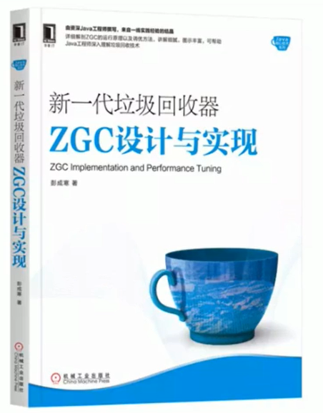

JDK14之前，2GC仅Linux才支持。

尽管许多使用zGc的用户都使用类Linux的环境，但在Windows和macos上，人们也需要zGC进行开发部署和测试。许多桌面应用也可以从ZGC中受益。因此，2GC特性被移植到了Windows和macos上。

现在mac或Windows上也能使用zGC了，示例如下：

```bash
-XX:+UnlockExperimentalVMOptions-XX：+UseZGC
```

### AliGC 

AliGC是阿里巴巴JVM团队基于G1算法，面向大堆（LargeHeap）应用场景。指定场景下的对比：


当然，其它厂商也提供了各种别具一格的GC实现，例如比较有名的低延迟GC Zing


# 字节码与类的加载篇

## 性能监控与调优篇

## 大厂面试篇