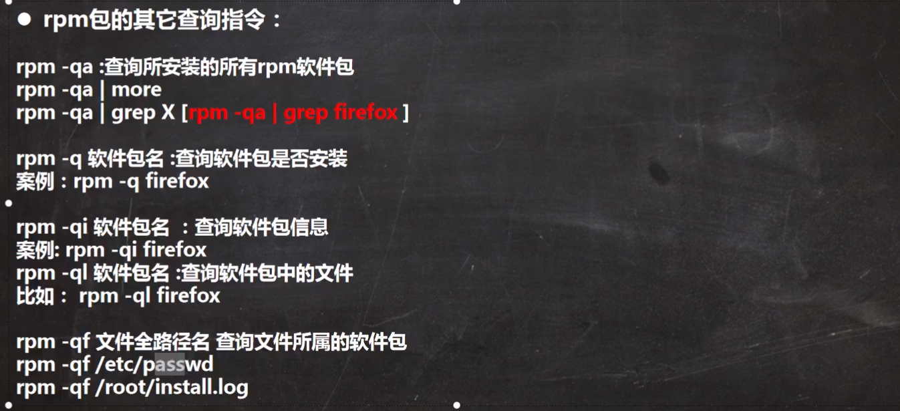
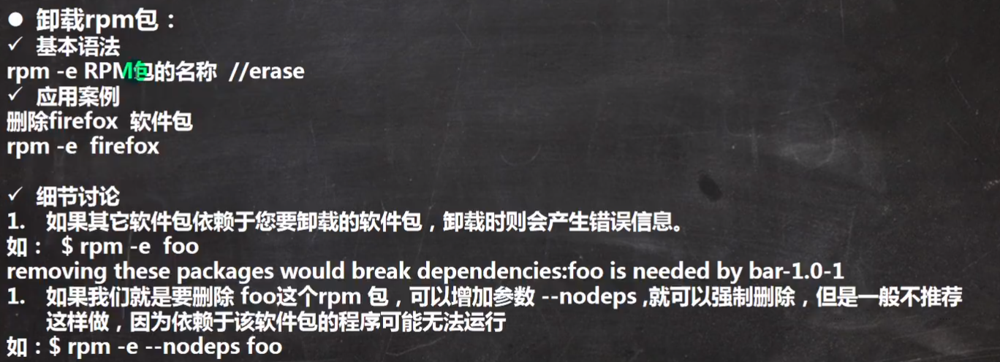
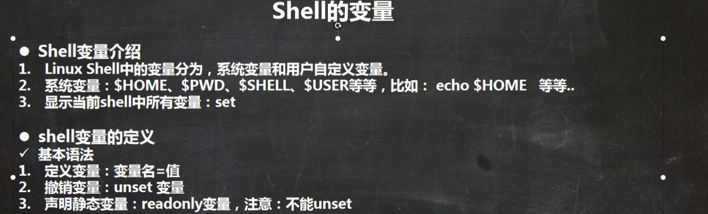

---

# Linux 学习笔记(31h/4d   4.10-14)

# 1. 安装-发展历史-快照功能

## 安装Vm-tools--让linux与CentOs共享数据

- vmtools安装后,可以让我们在 windows下更好的管理vm虚拟机

- 可以设置 windows和 centos的共享文件夹

- 在root用户下将 ` VMwareTools-10.1.6-5214329.tar.gz `复制到 opt文件夹

- `cd /opt`文件夹下
- 执行解压命令`tar -zxvf VMwareTools-10.1.6-5214329.tar.gz `
- 得到解压包，进入`cd vmware-tools-distrib/`
- `  ./vmware-install.pl `一直enter进行安装

在centos设置中，指定需要共享的文件夹


# 2.linux目录

- **/bin**：
  bin 是 Binaries (二进制文件) 的缩写, 这个目录存放着最经常使用的命令。

- **/boot：**
  这里存放的是启动 Linux 时使用的一些核心文件，包括一些连接文件以及镜像文件。

- **/dev ：**
  dev 是 Device(设备) 的缩写, 该目录下存放的是 Linux 的外部设备，在 Linux 中访问设备的方式和访问文件的方式是相同的。

- **/etc：**
  etc 是 Etcetera(等等) 的缩写,这个目录用来存放所有的系统管理所需要的配置文件和子目录。

- **/home**：
  用户的主目录，在 Linux 中，每个用户都有一个自己的目录，一般该目录名是以用户的账号命名的，如上图中的 alice、bob 和 eve。

- **/lib**：
  lib 是 Library(库) 的缩写这个目录里存放着系统最基本的动态连接共享库，其作用类似于 Windows 里的 DLL 文件。几乎所有的应用程序都需要用到这些共享库。

- **/lost+found**：
  这个目录一般情况下是空的，当系统非法关机后，这里就存放了一些文件。

- **/media**：
  linux 系统会自动识别一些设备，例如U盘、光驱等等，当识别后，Linux 会把识别的设备挂载到这个目录下。

- **/mnt**：
  系统提供该目录是为了让用户临时挂载别的文件系统的，我们可以将光驱挂载在 /mnt/ 上，然后进入该目录就可以查看光驱里的内容了。

- **/opt**：
  opt 是 optional(可选) 的缩写，这是给主机额外安装软件所摆放的目录。比如你安装一个ORACLE数据库则就可以放到这个目录下。默认是空的。

- **/proc**：
  proc 是 Processes(进程) 的缩写，/proc 是一种伪文件系统（也即虚拟文件系统），存储的是当前内核运行状态的一系列特殊文件，这个目录是一个虚拟的目录，它是系统内存的映射，我们可以通过直接访问这个目录来获取系统信息。
  这个目录的内容不在硬盘上而是在内存里，我们也可以直接修改里面的某些文件，比如可以通过下面的命令来屏蔽主机的ping命令，使别人无法ping你的机器：

  ```bash
  echo 1 > /proc/sys/net/ipv4/icmp_echo_ignore_all
  ```

- **/root**：
  该目录为系统管理员，也称作超级权限者的用户主目录。

- **/sbin**：
  s 就是 Super User 的意思，是 Superuser Binaries (超级用户的二进制文件) 的缩写，这里存放的是系统管理员使用的系统管理程序。

- **/selinux**：
   这个目录是 Redhat/CentOS 所特有的目录，Selinux 是一个安全机制，类似于 windows 的防火墙，但是这套机制比较复杂，这个目录就是存放selinux相关的文件的。

- **/srv**：
   该目录存放一些服务启动之后需要提取的数据。

- **/sys**：

  这是 Linux2.6 内核的一个很大的变化。该目录下安装了 2.6 内核中新出现的一个文件系统 sysfs 。

  sysfs 文件系统集成了下面3种文件系统的信息：针对进程信息的 proc 文件系统、针对设备的 devfs 文件系统以及针对伪终端的 devpts 文件系统。

  该文件系统是内核设备树的一个直观反映。

  当一个内核对象被创建的时候，对应的文件和目录也在内核对象子系统中被创建。

- **/tmp**：
  tmp 是 temporary(临时) 的缩写这个目录是用来存放一些临时文件的。

- **/usr**：
   usr 是 unix shared resources(共享资源) 的缩写，这是一个非常重要的目录，用户的很多应用程序和文件都放在这个目录下，类似于 windows 下的 program files 目录。

- **/usr/bin：**
  系统用户使用的应用程序。

- **/usr/sbin：**
  超级用户使用的比较高级的管理程序和系统守护程序。

- **/usr/src：**
  内核源代码默认的放置目录。

- **/var**：
  var 是 variable(变量) 的缩写，这个目录中存放着在不断扩充着的东西，我们习惯将那些经常被修改的目录放在这个目录下。包括各种日志文件。

- **/run**：
  是一个临时文件系统，存储系统启动以来的信息。当系统重启时，这个目录下的文件应该被删掉或清除。如果你的系统上有 /var/run 目录，应该让它指向 run。

在 Linux 系统中，有几个目录是比较重要的，平时需要注意不要误删除或者随意更改内部文件。

**/etc**： 上边也提到了，这个是系统中的配置文件，如果你更改了该目录下的某个文件可能会导致系统不能启动。

**/bin, /sbin, /usr/bin, /usr/sbin**: 这是系统预设的执行文件的放置目录，比如 ls 就是在 /bin/ls 目录下的。

值得提出的是，/bin, /usr/bin 是给系统用户使用的指令（除root外的通用户），而/sbin, /usr/sbin 则是给 root 使用的指令。

**/var**： 这是一个非常重要的目录，系统上跑了很多程序，那么每个程序都会有相应的日志产生，而这些日志就被记录到这个目录下，具体在 /var/log 目录下，另外 mail 的预设放置也是在这里。


# 3.远程登陆和文件上传下载

使用两款软件 xshell & xftp

# 4.vim 和 linux指令

## 关机和重启

- shutdown -h now   马上关机
- shutdown -h 1   1min后关机
- reboot  重启
- sync  将内存的数据同步到磁盘（重启或者关机之前操作一波）

## 登录和注销,切换用户

- su - root 切换到root权限的用户
- loginout 注销当前用户

## 用户添加和删除(root权限下操作)

- adduser newUserName

- deluser existedUserName  此时该用户的`home` 目录会保留
- deluser -r existedUserName  此时该用户的`home` 目录**不会**保留


- id username  查看用户信息

## 切换用户

- su - userName

由权限高的用户 切换到权限低的用户，不需要输入密码，可以使用`logout/exit`**返回**到原高级权限的用户

## 查看当前用户（登录用户）

```bash
who am i
```


## 用户组（便于对用户进行统一的权限管理）

默认情况下是，创建一个新的用户时，就自动为该用户创建一个同名的组

### 给新建用户添加组

- groupadd groupName  添加组
- groupdel groupName   删除组
- useradd -g groupName userName  将用户添加到组中

### 修改用户组

- usermod -g 组名  用户名

## 与用户账号有关的系统文件

### /etc/passwd文件是用户管理工作涉及的最重要的一个文件。

Linux系统中的每个用户都在/etc/passwd文件中有一个对应的记录行，它记录了这个用户的一些基本属性。

这个文件对所有用户都是可读的。

### /etc/shadow

### /etc/group 用户组的所有信息

# 5.实用指令

## 指定运行级别

- 0： 系统停机（关机）模式，系统默认运行级别不能设置为0，否则不能正常启动，一开机就自动关机。
- 1：单用户模式，root权限，用于系统维护，禁止远程登陆，就像Windows下的安全模式登录。
- 2：多用户模式，没有NFS网络支持。
- 3：完整的多用户文本模式，有NFS，登陆后进入控制台命令模式。
- 4：系统未使用，保留一般不用，在一些特殊情况下可以用它来做一些事情。例如在笔记本电脑的电池用尽时，以切换到这个模式来做一些设置。
- 5：图形化模式，登陆后进入图形GUI模式或GNOME、KDE图形化界面，如X Window系统。
- 6：重启模式，默认运行级别不能设为6，否则不能正常启动，就会一直开机重启开机重启。

## 获取运行级别

```bash
systemctl get-default
graphical.target
```

## 设置默认运行时级别

- systemctl set-default multi-user.target   设置为命令行模式（3）
- systemctl set-default graphical.target    设置为命令行模式（5）

## 找回root密码

- 重启linux系统，然后输入e
- **进入单用户模式**--找到以 Linux16 开头内容所在的行数 ，在行的最后面输入：`init=/bin/sh`，并按住ctrl+x
- 输入 `mount -o remount,rw /`
- 输入`passwd`回车后开始重置密码
- 连续两次输入密码
- `touch / .autorelabel`
- `exec /sbin/init`

## 帮助指令

man ls  查看`ls`命令用法


## 文件目录类

`pwd`  查看当前目录的绝对路径 

`cd ~`定位到**当前用户**的home目录

`mkdir  文件路径`	创建一级目录

`mkdir -p  文件路径` 	创建多级目录

`rmdir  文件路径` 删除空目录

`rm -rf 文件路径` 删除多级目录

`touch 文件名.tex`  创建空文件

`cp [-r] 源文件 目的地` 拷贝文件

`cp -r 源文件夹路径 目的文件夹路劲` 拷贝文件夹

`/cp -r 源文件夹路径 目的文件夹路劲`  强制覆盖 不提示  拷贝文件夹


`mv [source] [dest]`  重命名或者移动文件

`cat [-n] [文件路径]` 只能查看文件，不能修改文件 -n 为可选，表示显示行号 

`less [文件路径]` 查看**较大文件**

`echo [想要输出的内容]` 向控制台输出  或者 重定向写入到文件中  `echo [想要输出的内容] > [文件路径]`

`head` 显示文件开头的内容(**默认前10行**) 	`head -n 5` 查看前5行

`tail [文件路径]` 显示文件最后内容(**默认最后10行**)

`tail -f [文件路径]` 实时监控文件 


### 写入和追加

覆盖写入`echo [想要输出的内容] > [文件路径] `

追加写入`ls -l  > [文件路径] ` 若文件不存在则创建


### 显示日历信息


`In -s [源文件] [链接名称]` 软连接

`history`  查看历史指令  `history10 ` 查看最近的10条指令  `!num`执行编号为num的该条历史命令

### 时间指令

`date`

```bash
2021年 04月 11日 星期日 22:34:50 CST
```

### 搜索查找指令


` find /opt -user root`  按用户查找

`find / size +200M` 查找大于200M的文件

`locate [文件路径]`  查找文件路径 ，在执行之前，运行 `updatedb `

`which [指令名称]` 查看命令在哪个路径下

`cat [文件路径] | grep [要查找的内容]`  

### 压缩和解压

`gzip  [压缩名称.gz] [待压缩的文件]`  只能将文件压缩为 *.gz

`gunzip[待解压文件名称.gz] `  解压

`zip [-r] [压缩名称.zip] [待压缩的文件]`    -r 递归压缩

`unzip [-d]  [destDir] [xx.zip]`  -d 解压到指定文件夹下


`tar -zcvf xxx.tar.gz `   

`tar -zxvf xxx.tar.gz`  解压

# 6.组管理和权限管理

## 查看文件的所有者

`ls -lha`

`chown [用户名]  [文件名]`  修改文件所有者


## 组的创建以及添加用户

`groupadd [组名]`  创建组

`useradd -g [组名] [用户名]`  将用户添加到组


## 修改用户所在组

`usermod -g [组名] [用户名]`

## 文件权限信息 一共10位


##  修改文件所在的组

`chgrp [组名] [文件名]`

## 修改文件权限


### 用数字的方式修改权限


## 用户的登录权限修改后 再次登录才生效

# 7.定时任务调度

### crond任务调度

crontab [选项]

- crontab -e  编辑定时任务
-  crontab -l  查看定时任务
-  crontab -r  删除当前用户所有的定时任务

我们用**crontab -e**进入当前用户的工作表编辑，是常见的vim界面。每行是一条命令。

crontab的命令构成为 时间+动作，其时间有**分、时、日、月、周**五种，操作符有

- ***** 取值范围内的所有数字
- **/** 每过多少个数字
- **-** 从X到Z
- **，**散列数字

每隔1min 向文件中添加信息

- crontab -e
- `*/1 * * * * cal >> a.txt` `*`之间要有空格

定时执行 .sh 文件

- 创建a.sh 文件 内容为  `cal >>a.txt`
- `crontab -e` 后写入  `*/1 * * * * ./a.sh`


## 实例

###  实例1：每1分钟执行一次myCommand

```
* * * * * myCommand
```

###  实例2：每小时的第3和第15分钟执行

```
3,15 * * * * myCommand
```

### 实例3：在上午8点到11点的第3和第15分钟执行

```
3,15 8-11 * * * myCommand
```

### 实例4：每隔两天的上午8点到11点的第3和第15分钟执行

```
3,15 8-11 */2  *  * myCommand
```

### 实例5：每周一上午8点到11点的第3和第15分钟执行

```
3,15 8-11 * * 1 myCommand
```

### 实例6：每晚的21:30重启smb

```
30 21 * * * /etc/init.d/smb restart
```

### 实例7：每月1、10、22日的4 : 45重启smb

```
45 4 1,10,22 * * /etc/init.d/smb restart
```

### 实例8：每周六、周日的1 : 10重启smb

```
10 1 * * 6,0 /etc/init.d/smb restart
```

### 实例9：每天18 : 00至23 : 00之间每隔30分钟重启smb

```
0,30 18-23 * * * /etc/init.d/smb restart
```

### 实例10：每星期六的晚上11 : 00 pm重启smb

```
0 23 * * 6 /etc/init.d/smb restart
```

### 实例11：每一小时重启smb

```
0 */1 * * * /etc/init.d/smb restart
```

### 实例12：晚上11点到早上7点之间，每隔一小时重启smb

```
0 23-7/1 * * * /etc/init.d/smb restart
```

### at 定时任务

- 一次性执行的任务
- `at [选项] [时间]`   at 5pm + 2 day  ，输入完待执行的命令后，按两次 ctrl + d 退出
- 查看具体任务 `atq` 
- 删除任务 `atrm [编号]`
- 

### demo

# 8.linux磁盘分区和挂载

## 给系统添加硬盘并挂载到文件夹

- 1.在vm中创建硬盘默认scsi
- 2.给硬盘设置分区(分1个区即可)  `fdisk /dev/sdb`  .选择 `n` ,选则主分区`p`，数量为 `1`
- 3.格式化磁盘 ` mkfs -t ext4 /dev/sdb1`  完成后会给该磁盘分配一个uuid

- 4.将硬盘挂载到一个指定的目录  `mount /dev/sdb1 /newDisk` 成功后，会在新建的硬盘下面出现挂载点

  卸载指令 `unmount /dev/sdb1`

  **重启后 挂载失效**

- 5.永久挂载  

  - 修改 vim  /ect/fstab

  - 

  - 执行 mount -a

    这样的话，重启后也挂载

  ## 磁盘情况查询

  `df -h`

  

# 9.网络配置

## 网络环境配置，固定ip

关闭了本机的专用网络防火墙，才能在 虚拟机上ping上vmnet8，不然一直处于阻塞状态 


- 指定 IP `vi /etc/sysconfig/network-scripts/ifcfg-ens33`
- BOOTPROTO="static"
  IPADDR=192.168.204.130
  GATEWAY=192.168.204.2
  DNS1=192.168.204.2

## 设置主机名和host映射

- 查看主机名  `hostname`

- 修改主机名 `vim /etc/host`  修改里面的名称保存，然后**重启**即可

- 给 host 设置别名   修改  `C:/Windows/System32/drivers/etc/host` 文件，添加

  192.168.204.130     linux

  然后就可以用 ping linux  进行连接

##  在虚拟机下 使用名称ping主机

- 添加主机ip  `vim /etc/hosts`  添加  192.168.204.1  [主机名]

  域名查找的过程

  

# 10.进程管理

## 显示系统执行的进程

- ps -aux
- 

## 父子进程

- `ps -ef` 查看全进程，包含了进程间的子父类关系

    

## 终止进程


再次启动  sshd服务 `/bin/systemctl start sshd.service`

## 查看进程树


## 服务管理

### 开启和关闭 sshd的远程连接服务

`service network [start | stop]`


###  设置是否开机启动该服务


### chkconfig 设置自启动


### firewall 打开或者关闭端口


## 动态监控进程


##  监控网络状态


# 11.rpm和yum

rpm——**Red Hat Package Manager**

YUM，全称Yellow dog Updater, Modifier，是一个自由、开源的命令行软件包管理工具，运行在基于RPM包管理的的Linux操作系统（例如RedHat、CentOS、Suse等）。
 基于 RPM 包管理，能够从指定的服务器自动下载 RPM 包并且安装，可以自动处理依赖性关系，并且一次安装所有依赖的软件包，无须繁琐地一次次下载、安装。

## 简单查询




### 卸载与安装




## yum简介


`yum install firefox`

# 12.搭建JavaEE环境

## 安装jdk

- 上传源文件，解压到指定目录  tar -zxvf jdkxxx

- 将解压后的bin目录，加入到环境变量

  export JAVA_HOME=/usr/local/java/jdk1.8.0_281
  export PATH=/$JAVA_HOME/bin:$PATH

- javac 测试

## 安装tomcat

- 解压安装文件  tar -zxvf xxxx
- 启动 bin下的 ./start.sh 文件
- 开启8080端口  
  - firewall-cmd --permanent --add-port=8080/tcp
  - firewall-cmd --query-port=8080/tcp
  - firewall-cmd --reload   重新加载
- 在浏览器 访问  linux:8080  或   192.168.204.130/8080
- 

## 安装idea2020

要在 vm的虚拟机界面进行安装

- 创建文件夹 解压
- 在bin目录下执行 ./idea.sh 进行安装
- bug  黑屏解决方案https://blog.csdn.net/woSHIxiaobai2/article/details/104222073
  - cmd中 输入`netsh winsock reset` 重启

## 安装mysql

1. 运行tar -xvf mysql-5.7.26-1.el7.x86_64.rpm-bundle.tar （或者 联网下载 wget http://dev.mysql.com/get/mysql-5.7.26-1.el7.x86_64.rpm-bundle.tar，下载mysql安装包）

2. 运行rpm -qa|grep mari，查询mariadb相关安装包

3.  运行rpm -e --nodeps mariadb-libs，rpm -e --nodeps marisa  卸载  

4. 然后开始真正安装mysql，依次运行以下几条

   - rpm -ivh mysql-community-common-5.7.26-1.el7.x86_64.rpm

   - rpm -ivh mysql-community-libs-5.7.26-1.el7.x86_64.rpm

   - rpm -ivh mysql-community-client-5.7.26-1.el7.x86_64.rpm

   - rpm -ivh mysql-community-server-5.7.26-1.el7.x86_64.rpm

5.  运行systemctl start mysqld.service，启动mysql

6.  然后开始设置root用户密

7. Mysql自动给root用户设置随机密码，运行grep "password" /var/log/mysqld.log可看到当前密码

8.  运行mysql -u root -p，用root用户登录，提示输入密码可用上述的，可以成功登陆进入mysql命令行

9. 设置root密码，对于个人开发环境，如果要设比较简单的密码（**生产环境服务器要设复杂密码**），可以运行set global validate_password_policy=0; 提示密码设置策略（validate_password_policy默认值1，）

10. set password for 'root'@'localhost' =password('lpkkkkkk');

11. 运行flush privileges;使密码设置生效


## vmware虚拟机运行卡慢的解决办法

[https://blog.csdn.net/weixin_40612082/article/details/81023088]（没啥效果）


# 13.Shell编程

## 目的：管理服务器


## 编写shell的Hello，world

 	1. 创建 d.sh 文件  vim d.sh，此时的文件没有 可执行权限

```bash
#!/bin/bash
echo "hello,world!"
```

2. 开启可执行权限  `chmod u+x d.sh`
3. 运行脚本  `./d.sh`    （或者  不加执行权限，直接 执行 `sh d.sh`）

## 变量的使用



```bash
#!/bin/bash
#1. 定义一个变量A  变量于值之间不能有空格
A=100
echo A=$A
#2.撤销变量A
unset A
echo A=$A
#3.声明为静态变量的不能被撤销
readonly B=2
unset B
```

## 变量的定义


```bash
#4.变量与命令
C=`date`
D=$(date)
echo $C
echo $D		
#2021年 04月 13日 星期二 20:43:12 CST
#2021年 04月 13日 星期二 20:43:12 CST
```

## 设置环境变量

目的：类似于全局变量，一经设置，随处可用

1. 在 /etc/profile 添加环境变量的信息

   ```bash
   export JIMI_HOME=/home/jimi
   ```

2. 刷新文件 source /etc/profile
3. 查看新的环境变量 echo /$JIMI_HOME

## 多行注释

### 格式

`:<<!`

需要注释的代码

!

### 示例

```bash
#5.演示多行注释
:<<!  # 开始
C=`date`
D=$(date)
echo $C
echo $D
!  # 结束
echo kkkkk
```

## 位置参数变量

简介

```bash
#!/bin/bash
# 1.演示传参 
# 第一位置为 命令本身  接下来的为各个参数
echo 0=$0 1=$1 2=$2
# 
echo 参数为=$*
echo 参数的个数为=$#
echo 参数为=$@
```


## 运算符

3种基本的用法

- /$((运算表达式))
- /$[运算表达式]
- /$/` expr 运算表达式`  此时的 * 要写为  //*  且运算符之间要有空格

```bash
#!/bin/bash
#1. 运算的3种基本方式
#A:
R1=$(((2+3)*4))
echo R1=$R1
R2=$[(2+3)*4]
echo R2=$R2
TEMP=`expr 2 + 3`
echo TEMP=$TEMP
R3=`expr $TEMP /* 4`
echo R3=$R3

#2.计算输入和两个数的和
M=$[$1 + $2]
echo $1 + $2 =$M
```

## 条件判断

if else-if else 语法格式：

```bash
if condition1
then
    command1
elif condition2 
then 
    command2
else
    commandN
fi
```

## case语句

**case ... esac** 为多选择语句，与其他语言中的 switch ... case 语句类似，是一种多分枝选择结构，每个 case 分支用右圆括号开始，用两个分号 **;;** 表示 break，即执行结束，跳出整个 case ... esac 语句，esac（就是 case 反过来）作为结束标记。

可以用 case 语句匹配一个值与一个模式，如果匹配成功，执行相匹配的命令。

**case ... esac** 语法格式如下：

```bash
case 值 in
模式1)
    command1
    command2
    ...
    commandN
    ;;
模式2）
    command1
    command2
    ...
    commandN
    ;;
esac
```

## for循环

与其他编程语言类似，Shell支持for循环。

for循环一般格式为：

```bash
for var in item1 item2 ... itemN
do
    command1
    command2
    ...
    commandN
done
```

写成一行：

```bash
for var in item1 item2 ... itemN; do command1; command2… done;
```

### 结合 /$*  和  /$@  区别的演示

```bash
# 演示 $* 与   $@  的区别   一个将其当作整体    一个分开

for i in "$*"
do
   echo "num is $i"
done


for j in $@
do
   echo num is $j
done
```


### 另一种for  求和

```bash
# 求和
SUM=0
for (( i=0; i<=$1; i++))
do
        SUM=$[$SUM+$i]
done
echo $SUM
```

## while 语句

while 循环用于不断执行一系列命令，也用于从输入文件中读取数据。其语法格式为：

```bash
while condition
do
    command
done
```

以下是一个基本的 while 循环，测试条件是：如果 int 小于等于 5，那么条件返回真。int 从 1 开始，每次循环处理时，int 加 1。运行上述脚本，返回数字 1 到 5，然后终止。

```bash
#!/bin/bash
int=1
while(( $int<=5 ))
do
    echo $int
    let "int++"
done
```

## read读取控制台输入

- -p  指定读取时的提示符
- -t   指定等待的时间(s),若在指定时间内未输入，则程序退出

```bash
#!/bin/bash
read -p "请输入一个数 num = " NUM
echo $NUM

# 等待 3s 后若没有输入 则程序退出
read -t 3 -p "请输入一个数 num2 = " NUM2
echo $NUM2
```

## 函数

- basename  目的： 获取文件名
- dirname      目的：获取文件夹


### 自定义函数

```bash
[ function ] funname ()

{

    action;

    [return int;]

}
```

说明：

- 1、可以带function fun() 定义，也可以直接fun() 定义,不带任何参数。
- 2、参数返回，可以显示加：return 返回，如果不加，将以最后一条命令运行结果，作为返回值。 return后跟数值n(0-255

```bash
#!/bin/bash
# 自定义一个函数，实现  传入的两个数进行求和
getSum(){
#function getSum(){
        read -p "请输入n1 " n1
        read -p "请输入n2 " n2
        echo $n1 "+" $n2 "=" $[$n1 + $n2]
}

getSum $n1 $n2
```


## 定时备份数据库demo


# 14.Ubuntu

## start

- 安装
- 给root用户设置密码   `sudo passwd`  设置完后就可以切换到 root   `sudo root`
- 内置了python环境，可以直接运行python程序

## apt 软件管理和远程登录

apt--advanced packaging tool 

### 更新为清华镜像

https://mirrors.tuna.tsinghua.edu.cn/

找到Ubuntu对应版本的信息

```bash
# 默认注释了源码镜像以提高 apt update 速度，如有需要可自行取消注释
deb https://mirrors.tuna.tsinghua.edu.cn/ubuntu/ focal main restricted universe multiverse
# deb-src https://mirrors.tuna.tsinghua.edu.cn/ubuntu/ focal main restricted universe multiverse
deb https://mirrors.tuna.tsinghua.edu.cn/ubuntu/ focal-updates main restricted universe multiverse
# deb-src https://mirrors.tuna.tsinghua.edu.cn/ubuntu/ focal-updates main restricted universe multiverse
deb https://mirrors.tuna.tsinghua.edu.cn/ubuntu/ focal-backports main restricted universe multiverse
# deb-src https://mirrors.tuna.tsinghua.edu.cn/ubuntu/ focal-backports main restricted universe multiverse
deb https://mirrors.tuna.tsinghua.edu.cn/ubuntu/ focal-security main restricted universe multiverse
# deb-src https://mirrors.tuna.tsinghua.edu.cn/ubuntu/ focal-security main restricted universe multiverse

# 预发布软件源，不建议启用
# deb https://mirrors.tuna.tsinghua.edu.cn/ubuntu/ focal-proposed main restricted universe multiverse
# deb-src https://mirrors.tuna.tsinghua.edu.cn/ubuntu/ focal-proposed main restricted universe multiverse
```

### 备份默认地址

sudo cp /etc/apt/sources.list /etc/apt/sources.list.backup

### 更新源服务器列表

切换到root用户   su root

清空 sources.list     echo ‘’> sources.list

拷贝镜像文件到 sources.list种

### 更新源

sudo apt-get update

### apt 语法

```
  apt [options] [command] [package ...]
```

- **options：**可选，选项包括 -h（帮助），-y（当安装过程提示选择全部为"yes"），-q（不显示安装的过程）等等。
- **command：**要进行的操作。
- **package**：安装的包名。

### 常用指令

- 列出所有可更新的软件清单命令：**sudo apt update**

- 升级软件包：**sudo apt upgrade**

  列出可更新的软件包及版本信息：**apt list --upgradeable**

  升级软件包，升级前先删除需要更新软件包：**sudo apt full-upgrade**

- 安装指定的软件命令：**sudo apt install **

  安装多个软件包：**sudo apt install   **

- 更新指定的软件命令：**sudo apt update **

- 显示软件包具体信息,例如：版本号，安装大小，依赖关系等等：**sudo apt show **

- 删除软件包命令：**sudo apt remove **

- 清理不再使用的依赖和库文件: **sudo apt autoremove**

- 移除软件包及配置文件: **sudo apt purge **

- 查找软件包命令： **sudo apt search **

- 列出所有已安装的包：**apt list --installe**d

- 列出所有已安装的包的版本信息：**apt list --all-versions**

## 远程登录

### 安装ssh客户端和服务器

sudo apt-get install openssh-server

## 启动服务

service sshd restart

### 从一台linux登录到另一台linux

ssh 用户名 @ IP


# 待补充

## 日志管理

## 备份与恢复

## 可视化


