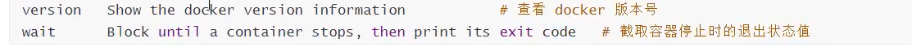
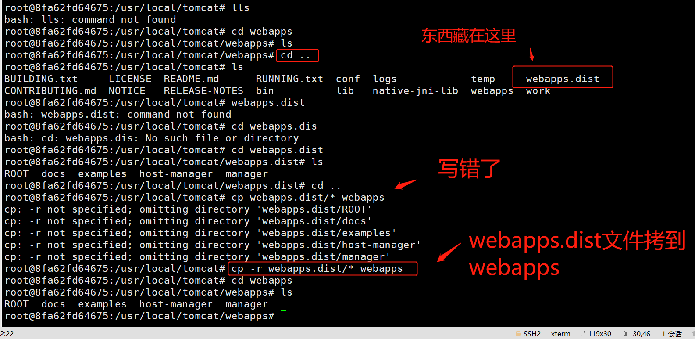
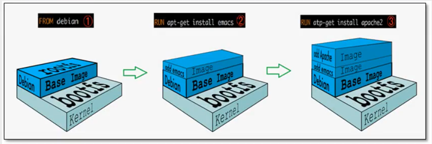
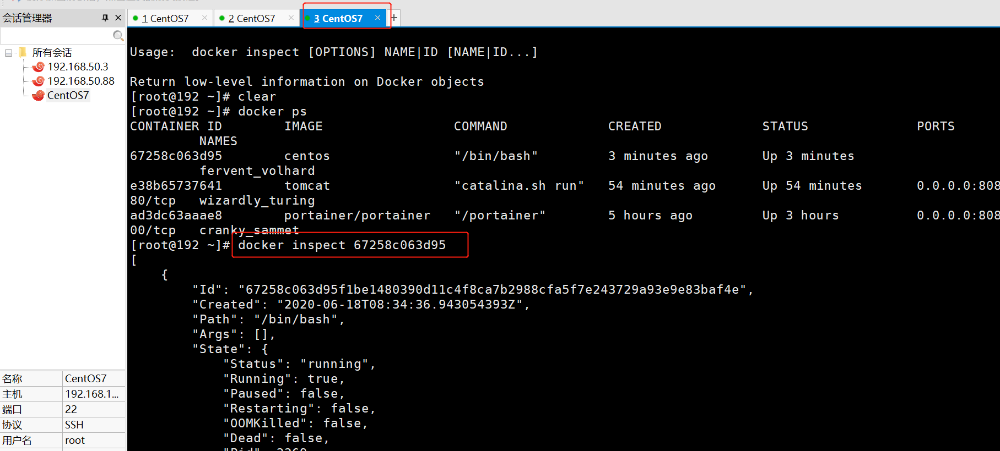
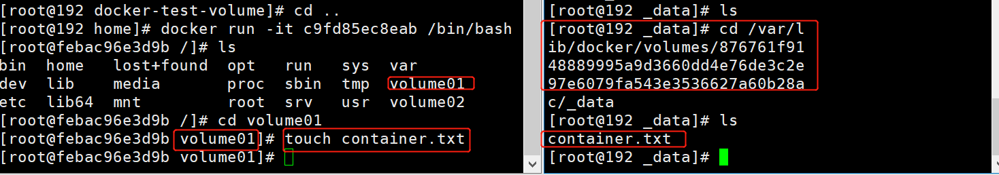
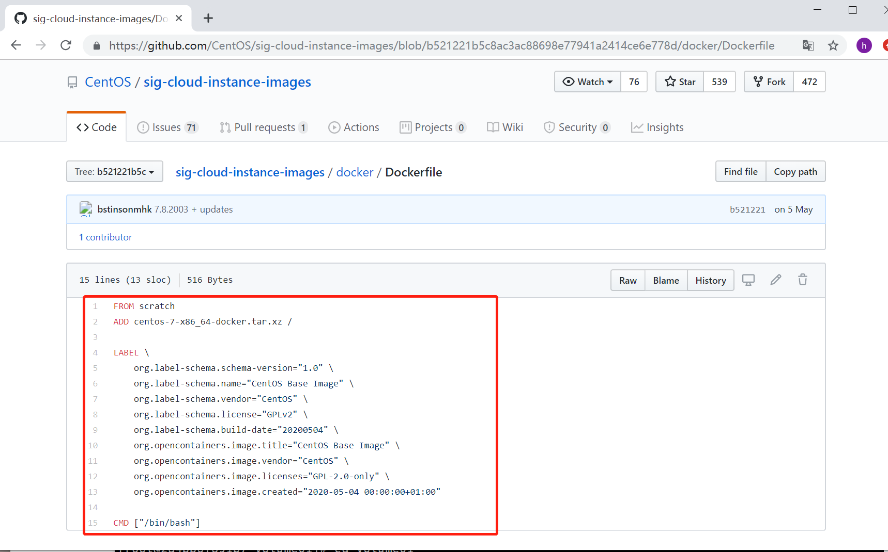
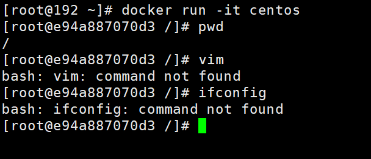
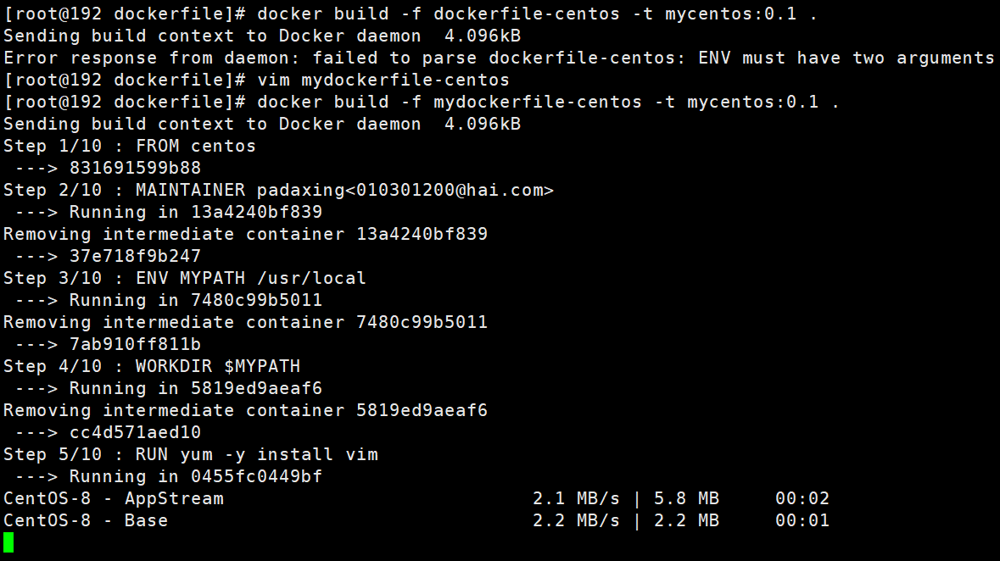
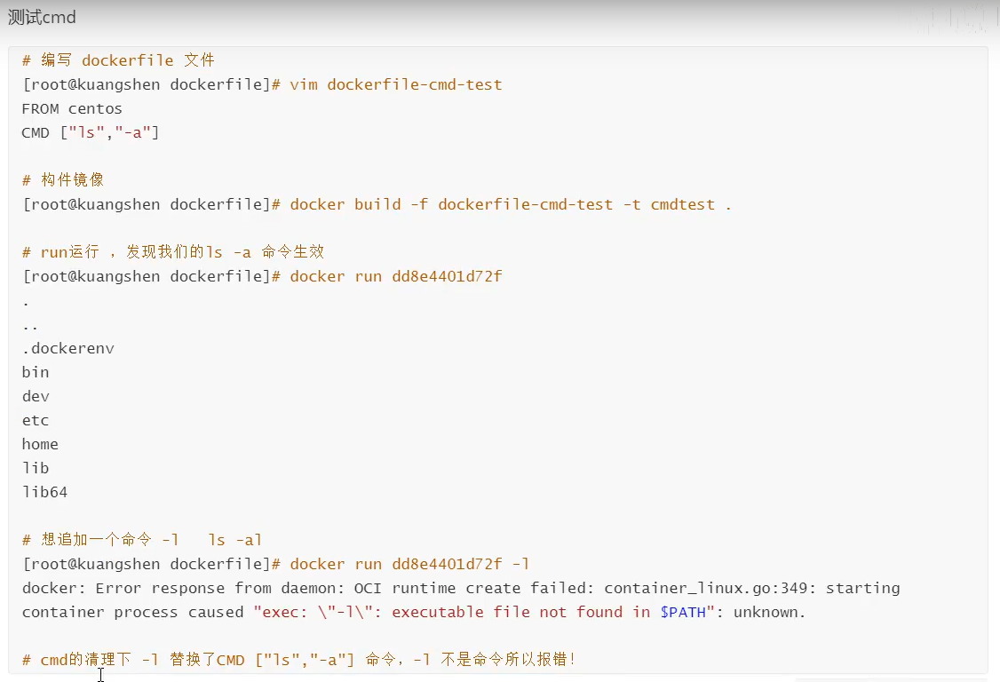
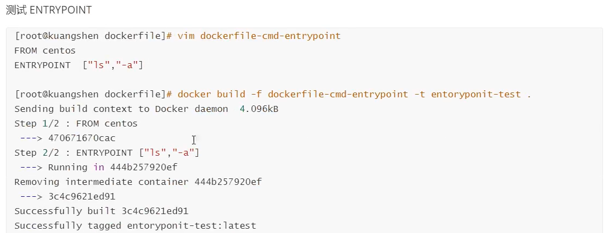

[笔记主体来自gitee小伙伴的参考](https://gitee.com/nasheishei/docker_learning)

# Docker


## 前期基础

linux基本命令，类似cd，mkdir等


## Docker概述

### Docker为什么会出现

一款产品，开发和上线两套环境，应用环境配置费时费力，而且容易出问题

尤其对于机器学习和深度学习的库更是如此，很可能存在版本问题、底层依赖冲突问题

所以发布项目时，不只是一套代码过去，而是代码+环境整体打包过去

所谓开发即运维，保证系统稳定性，提高部署效率

使用Docker后的流程：

开发：建立模型--环境--打包带上环境，即镜像--放到Docker仓库

部署：下载Docker中的镜像，直接运行即可


Docker的思想来自于集装箱

隔离：Docker核心思想，打包集装箱，每个箱子是隔离的。

Docker通过隔离机制，可以将服务器利用到极致。

### Docker的历史

2010年，几个搞IT的人，在美国成立一家公司`dotCloud`

做一些pass的云计算服务

他们将自己的容器化技术命名为Docker

Docker基于Go语言开发

Docker刚刚诞生的时候，没有引起行业的注意，dotCloud活不下去

然后他们决定开源

2013年，创始人将Docker开源，不开则以，一开惊人，刚开源的时候，每个月都会更新一个版本

2014年4月9日，Docker 1.0发布

 docker优点--十分**轻量**

**容器vs虚拟机**

在容器技术出来之前，用的是虚拟机技术

虚拟机:在 window中装一个 Vmware,通过这个软件我们可以虚拟出来一台或者多台电脑!笨重!

虚拟机也是属于虚拟化技术, Docker容器技术,也是一种**虚拟化技术!**

- vm: linux centos原生镜像(一个电脑!)隔离,需要开启多个虚拟机!     **几个G    几分钟**
- docker：隔离,镜像(最核心的环境4M+jdk+mysq1)十分的小巧,运行镜像就可以了**几个M Kb     秒级启动**

- 基于go语言开发

- 开源

  官方文档：https://docs.docker.com/docker-for-windows/ 

  仓库地址：https://hub.docker.com/	【发布到仓库，git pull push】

  b站教程：https://www.bilibili.com/video/BV1og4y1q7M4?

  【这个教程非常简洁！且深入！基于企业应用场景！推荐！以下笔记都基于该课程】

### 能干吗


#### 之前的虚拟机原理示意图


缺点：

1. 资源占用多
2. 冗余步骤多
3. 启动很慢

#### 容器化技术示意图

不是模拟的完整的操作系统


#### 二者对比

比较虚拟机和Docker的不同

|          | 传统虚拟机               | Docker        |
| -------- | ------------------------ | ------------- |
| 虚拟内容 | 硬件+完整的操作系统+软件 | APP+LIB       |
| 大小     | 笨重，通常几个G          | 轻便几个M或KB |
| 启动速度 | 慢，分钟级               | 快，秒级      |
|          |                          |               |

比较 Docker和虚拟机技术的不同:

- 传统虚拟机,虛拟出一条硬件,运行一个完整的操作系统,然后在这个系统上安装和运行软件
- docker  容器内的应用直接运行在宿主机的内容,容器是**没有自己的内核的,也没有虛拟我们的硬件**,所以就轻便了
- 每个容器间是**互相隔离**,每个容器内都有个属于自己的文件系统,互不影响。


#### Devops(开发、运维)

##### 应用更快速的交付和部署

传统:一堆帮助文档,安装程序

Docker:打包镜像发布测试

#####  一键运行更便捷的升级和扩缩容

使用了 Docker之后,我们部署应用就和搭积木一样

项目打包为一个镜像,扩展服务器A!服务器B

#####  更简单的系统运维

在容器化之后,我们的开发,测试环境都是高度一致的

#####  更高效的计算资源利用

Docker是内核级别的虚拟化,可以再一个物理机上可以运行很多的容器实例!服务器的性能可以被压榨到极致。


## Docker安装

### Docker的基本组成


明确几个概念：

####  镜像(image)

docker镜像就好比是个==模板==,可以通过这个模板来创建容器服务, tomcat镜像==>run=> tomcat1容器(提供务器),

通过这个镜像可以创建多个容器(最终服务运行或者项目运行就是在容器中的)。

#### 容器(container)

Docker利用容器技术,独立运行一个或者一个组应用通过镜像来创建的

启动,停止,删除,基本命令!

目前就可以把这个容器理解为就是一个简易的 llinux系统

####  仓库(repository)：

仓库就是存放镜像的地方

- 仓库分为公有仓库和私有仓库
- Docker hub(默认是国外的)
- 阿里云…都有容器服务器(配置镜像加速!)


### 环境准备

我们要有一台服务器，并且可以操作它

1. Linux命令基础，购买linux阿里云的服务器
2. CentOS 7
3. 使用Xshell链接远程服务器
4. 安装docker

```bash
# 1.卸载旧的版本
$ sudo yum remove docker \
                  docker-client \
                  docker-client-latest \
                  docker-common \
                  docker-latest \
                  docker-latest-logrotate \
                  docker-logrotate \
                  docker-engine
  #2.# 安装基本的安装包
$ sudo yum install -y yum-utils

#3.设置镜像仓库
$ sudo yum-config-manager \
    --add-repo \
    https://download.docker.com/linux/centos/docker-ce.repo # 默认是国外的

# 换成下面的
$ sudo yum-config-manager --add-repo https://mirrors.aliyun.com/docker-ce/linux/centos/docker-ce.repo # 阿里云镜像
 # 更像软件包索引  
  yum makecache fast  
  
  # 4.安装docker引擎
  yum install docker-ce docker-ce-cli containerd.io # docker-ce 社区版 ee 企业版
  
  #5. 启动Docker
  systemctl start docker # 代表启动成功
  
  #查看是否安装成功
  docker version
  
  #6.hello,world   本地没有，从仓库拉取
  docker run hello-world
  
  #7.查看下载的镜像
docker  images
REPOSITORY    TAG       IMAGE ID       CREATED       SIZE
hello-world   latest    d1165f221234   5 weeks ago   13.3kB

#8.卸载Docker
# 卸载依赖
yum remove docker-ce docker-ce-cli containerd.io

# 删除资源
rm -rf /var/lib/docker # docker 的默认工作路径
```

**设置镜像仓库**

创建或修改 /etc/docker/daemon.json 文件，修改为如下形式

```bash
# vi /etc/docker/daemon.json
{
   "registry-mirrors": ["http://hub-mirror.c.163.com"]
}

systemctl restart docker.service
```

国内加速地址有：

> Docker中国区官方镜像 https://registry.docker-cn.com
>
> 网易  http://hub-mirror.c.163.com
>
>  中国科技大学  https://docker.mirrors.ustc.edu.cn
>
>  阿里云容器 服务  https://cr.console.aliyun.com/


run的运行流程图


```bash
sudo mkdir -p /etc/docker

sudo tee /etc/docker/daemon.json <<-'EOF'
{
  "registry-mirrors": ["https://tthyng4r.mirror.aliyuncs.com"]
}
EOF

sudo systemctl daemon-reload # 重启服务

sudo systemctl restart docker # 重启docker
```


[在线画图软件ProcessOn](https://www.processon.com/)

[服务器及购买相关介绍](https://www.bilibili.com/video/BV177411K7bH)

## 底层原理

Docker是真么工作的？

Docker是一个Client-Server结构的系统，Docker的守护进程在主机上。通过Socket从客户端访问！

DockerServer接受到Docker-Client的指令，


Docker为什么比VM快？

1. Docker有着比虚拟机更少的抽象层
2. docker主要用的是宿主机的**内核**，vm需要**Guest OS**


所以说新建一个容器的时候，docker不需要像虚拟机一样重新加载一个操作系统内核，避免引导


## Docker命令

### 帮助命令

```shell
docker version # 显示docker的基本信息
docker info # 系统信息，镜像和容器的数量
docker 命令 --help # 全部信息
```

[官网文档](https://docs.docker.com/reference/)

### 镜像命令

#### docker images

查看所有本地主机上的镜像

```bash
[root@192 ~]# docker images
--all , -a		Show all images (default hides intermediate images) # 显示所有
--digests		Show digests
--filter , -f		Filter output based on conditions provided
--format		Pretty-print images using a Go template
--no-trunc		Don’t truncate output
--quiet , -q		Only show numeric IDs 
```

#### docker search

搜索仓库中的镜像，相当于网页搜索

[网页搜索](http://hub.docker.com)

```
docker search mysql
```

```
docker search --help
```


```bash
# 解释
Options:
  -f, --filter filter   Filter output based on conditions provided
      --format string   Pretty-print search using a Go template
      --limit int       Max number of search results (default 25)
      --no-trunc        Don't truncate output

```

```
docker search mysql --filter=STARS=3000 # 搜索出Stars大于3000的
```


#### docker pull

下载镜像

```bash
docker pull mysql # 下载mysql镜像，default tag，默认最新版latest
```

```bash
[root@192 ~]# sudo systemctl daemon-reload
[root@192 ~]# sudo systemctl restart docker
[root@192 ~]# docker pull mysql
Using default tag: latest # 不写tag默认最新版
latest: Pulling from library/mysql
8559a31e96f4: Pull complete  # layer 分层下载，docker image的核心 联合文件系统
d51ce1c2e575: Pull complete 
c2344adc4858: Pull complete 
fcf3ceff18fc: Pull complete 
16da0c38dc5b: Pull complete 
b905d1797e97: Pull complete 
4b50d1c6b05c: Pull complete 
c75914a65ca2: Pull complete 
1ae8042bdd09: Pull complete 
453ac13c00a3: Pull complete 
9e680cd72f08: Pull complete 
a6b5dc864b6c: Pull complete 
Digest: sha256:8b7b328a7ff6de46ef96bcf83af048cb00a1c86282bfca0cb119c84568b4caf6#签名
Status: Downloaded newer image for mysql:latest
docker.io/library/mysql:latest # 真实地址

# 即
docker pull mysql
# 等价于
docker pull docker.io/library/mysql:latest

```

```bash

# 指定版本下载 
docker pull mysql:5.7
```


```
docker images
```

此时查看镜像，可以看到新下载的两个

#### docker rmi

remove images

```bash
# 删除一个 可以通过名称 也可以指定id -f表示删除所有
docker rmi -f 9cfcce23593a
# 删除多个 用空格分隔id
docker rmi -f id id id
# 删除所有 
docker rmi -f $(docker images -aq) # images -aq就是查所有镜像id，从而递归删除
```


### 容器命令

说明：有了镜像才能创建容器，linux，下载一个centos镜像来测试学习

```bash
docker pull centos
```


#### 新建容器并启动

```shell
docker run [可选参数] image

# 参数说明
--name=“Name” # 容器名字，用于区分容器
-d 后台方式运行
-it 使用交互方式运行，进入容器查看内容
-p 指定容器的端口 如-p 8080::8080
	-p ip:主机端口：容器端口
	-p 主机端口:容器端口
	-p 容器端口
	
-p 随机指定端口
```

#### 启动退出容器

```bash
# 进入
docker run -it centos /bin/bash 
# 查看目录
ls
# 退出
exit
```

安装的centos就是一个独立的系统，相比较上层的centos，这里更轻量了，少了一个boot文件夹 

#### 启动后修改容器端口

- 应用场景

   在启动tomcat时使用`docker run -it tomcat`  此时==未指明端口==，但是却==已经修改==了容器里面的内容，这种情况下外界一直==无法访问==到tomcat

```sh
 # 1.停止容器
# 2.停止docker服务(systemctl stop docker)
# 3. 修改这个容器的hostconfig.json文件中的端口
cd /var/lib/docker/containers/3b6ef264a040* #这里是CONTAINER ID
vim hostconfig.json
如果之前没有端口映射, 应该有这样的一段:
"PortBindings":{}
增加一个映射, 这样写:
"PortBindings":{"8080/tcp":[{"HostIp":"","HostPort":"8080"}]}

```


注意这里面主机名,**随机分配的id**

这里面就是一个容器

#### 查看运行的容器

```bash
# 查看正在运行的容器
docker ps
# 查看曾经运行的容器
docker ps -a
# 显示最近创建的容器，设置显示个数
docker ps -a -n=2 
# 只显示容器的编号
docker ps -aq
```

```shell
[root@192 ~]# docker ps
CONTAINER ID        IMAGE               COMMAND             CREATED             STATUS              PORTS               NAMES
[root@192 ~]# docker ps -a
CONTAINER ID        IMAGE               COMMAND             CREATED             STATUS                     PORTS               NAMES
9939864fa2e6        centos              "bin/bash"          4 minutes ago       Exited (0) 4 minutes ago                       unruffled_knuth
5f42e9930435        centos              "/bin/bash"         8 minutes ago       Exited (0) 4 minutes ago                       lucid_cannon
a89ddb393d3d        bf756fb1ae65        "/hello"            19 hours ago        Exited (0) 19 hours ago                        gracious_bhabha
[root@192 ~]# docker ps -a -n=2
CONTAINER ID        IMAGE               COMMAND             CREATED             STATUS                     PORTS               NAMES
9939864fa2e6        centos              "bin/bash"          6 minutes ago       Exited (0) 6 minutes ago                       unruffled_knuth
5f42e9930435        centos              "/bin/bash"         10 minutes ago      Exited (0) 7 minutes ago 
[root@192 ~]# docker ps -aq
9939864fa2e6
5f42e9930435
a89ddb393d3d

```

#### 退出容器

```shell
# 容器停止退出
exit
# 容器不停止退出 注意必须在英文输入法下，中文输入法不行
Ctrl + P + Q
```

```shell
[root@192 ~]# docker run -it centos /bin/bash
[root@bfcea13c40cd /]# [root@192 ~]# docker ps ##注意这里会自动给个命令，删掉
CONTAINER ID        IMAGE               COMMAND             CREATED              STATUS              PORTS               NAMES
bfcea13c40cd        centos              "/bin/bash"         About a minute ago   Up About a minute                       stoic_wilson
edbd9366d959        centos              "/bin/bash"         7 minutes ago        Up 7 minutes                            affectionate_bartik
[root@192 ~]# docker exec -it edbd9366d959 /bin/bash ## 再次进入
[root@edbd9366d959 /]# exit ##停止并推出
exit

```

#### 删除容器

```shell
# 删除指定容器 不能删除正在运行的容器，如果强制删除 rm -f
docker rm 容器id
# 删除所有容器
docker rm -f $(docker ps -aq)
# 删除所有容器
docker ps -a -q|xargs docker rm
```

```shell
[root@192 ~]# docker ps -a
CONTAINER ID        IMAGE               COMMAND             CREATED             STATUS                      PORTS               NAMES
bfcea13c40cd        centos              "/bin/bash"         29 minutes ago      Up 29 minutes                                   stoic_wilson
edbd9366d959        centos              "/bin/bash"         35 minutes ago      Up 35 minutes                                   affectionate_bartik
9939864fa2e6        centos              "bin/bash"          48 minutes ago      Exited (0) 48 minutes ago                       unruffled_knuth
5f42e9930435        centos              "/bin/bash"         52 minutes ago      Exited (0) 49 minutes ago                       lucid_cannon
a89ddb393d3d        bf756fb1ae65        "/hello"            20 hours ago        Exited (0) 20 hours ago                         gracious_bhabha
[root@192 ~]# docker rm 5f42e9930435
5f42e9930435
[root@192 ~]# docker rm edbd9366d959      # 注意正在运行的容器不能删除
Error response from daemon: You cannot remove a running container edbd9366d9596c744dd449119269b04de2f2a494e7fc471f6396bcefd94c33fe. Stop the container before attempting removal or force remove

```

```shell
[root@192 ~]# docker ps -aq # 所有容器id
bfcea13c40cd
edbd9366d959
9939864fa2e6
a89ddb393d3d
[root@192 ~]# docker rm -f $(docker ps -aq) # 全部删除
bfcea13c40cd
edbd9366d959
9939864fa2e6
a89ddb393d3d

```

#### 启动和停止容器的操作

```shell
docker start
docker restart
docker stop
docker kill
```

```shell
[root@192 ~]# docker run -it centos /bin/bash
[root@7b1a7dd10ea4 /]# exit
exit
[root@192 ~]# docker ps #查看正在运行的
CONTAINER ID        IMAGE               COMMAND             CREATED             STATUS              PORTS               NAMES
[root@192 ~]# docker ps -a # 查看历史运行过的
CONTAINER ID        IMAGE               COMMAND             CREATED             STATUS                      PORTS               NAMES
7b1a7dd10ea4        centos              "/bin/bash"         54 seconds ago      Exited (0) 42 seconds ago                       fervent_mirzakhani
[root@192 ~]# docker start 7b1a7dd10ea4 # 启动当前这个容器 container id 粘过 来
7b1a7dd10ea4
[root@192 ~]# docker ps # 查看当前运行容器 发现启动成功
CONTAINER ID        IMAGE               COMMAND             CREATED             STATUS              PORTS               NAMES
7b1a7dd10ea4        centos              "/bin/bash"         2 minutes ago       Up 28 seconds                           fervent_mirzakhani
[root@192 ~]# docker stop 7b1a7dd10ea4 # 停止运行
7b1a7dd10ea4
[root@192 ~]# docker ps # 再次查看 没有这个容器了
CONTAINER ID        IMAGE               COMMAND             CREATED             STATUS              PORTS               NAMES


```

#### 后台启动docker

```shell
docker run -d 镜像名
# 用docker ps 查看的时候 发现停止了

# 后台运行，docker发现前台没有，容器启动后，发现自己没有提供服务，会立刻停止
```

```shell
Last login: Wed Jun 17 19:47:35 2020
[root@192 ~]# systemctl start docker # 关机后重启了，需要启动docker
[root@192 ~]# docker run -d centos # 运行
8ce188e5fee31c2fac93c0a405ee1a95c38dbc50cb47c35b19c0039c27558ded
[root@192 ~]# docker ps -a # 查看正在运行的
CONTAINER ID        IMAGE               COMMAND             CREATED             STATUS                      PORTS               NAMES
8ce188e5fee3        centos              "/bin/bash"         19 seconds ago      Exited (0) 18 seconds ago                       tender_dirac
7b1a7dd10ea4        centos              "/bin/bash"         8 hours ago         Exited (0) 8 hours ago                          fervent_mirzakhani

```


#### 查看日志

```shell
docker logs
docker logs -tf -t --tail n 【id】

```


```shell
[root@192 ~]# docker logs --help

Usage:	docker logs [OPTIONS] CONTAINER

Fetch the logs of a container

Options:
      --details        Show extra details provided to logs
  -f, --follow         Follow log output
      --since string   Show logs since timestamp (e.g.
                       2013-01-02T13:23:37) or relative
                       (e.g. 42m for 42 minutes)
      --tail string    Number of lines to show from the
                       end of the logs (default "all")
  -t, --timestamps     Show timestamps # 时间戳
      --until string   Show logs before a timestamp (e.g.
                       2013-01-02T13:23:37) or relative
                       (e.g. 42m for 42 minutes)

```

```shell
whiel true;do echo shenzai;sleep 
```


```shell
# 运行一个
[root@192 ~]# docker run -it centos /bin/bash

[root@c2887d35c71d /]# [root@192 ~]# docker ps
CONTAINER ID        IMAGE               COMMAND             CREATED             STATUS              PORTS               NAMES
c2887d35c71d        centos              "/bin/bash"         57 seconds ago      Up 56 seconds                           vigorous_kare

# 查看日志，由于没有运行脚本，所以啥也没显示
[root@192 ~]# docker logs -f -t --tail 10 c2887d35c71d
^C # ctrl+c退出

# 运行centos里面加个脚本
[root@192 ~]# docker run -d centos /bin/sh -c "while true;do echo shenzai;sleep 1;done"
cb6d7fbc3f27a064137d58282de97b97365dea2705211ebfbad642079cc1b388

[root@192 ~]# docker ps
CONTAINER ID        IMAGE               COMMAND                  CREATED             STATUS              PORTS               NAMES
cb6d7fbc3f27        centos              "/bin/sh -c 'while t…"   7 seconds ago       Up 6 seconds                            dreamy_almeida
c2887d35c71d        centos              "/bin/bash"              3 minutes ago       Up 3 minutes                            vigorous_kare

# 查看日志 发现隔一秒打印一条
[root@192 ~]# docker logs -f -t --tail 10 cb6d7fbc3f27
2020-06-17T12:02:11.293765084Z shenzai
2020-06-17T12:02:12.297675608Z shenzai

```

####  查看容器中的进程信息

```shell
[root@kk /]# docker top [容器id]
UID                 PID                 PPID                C                   STIME               TTY                 TIME                CMD
root                32452               32428               0                   09:36               pts/0               00:00:00            /bin/bash

```


#### 查看正在运行的容器信息

```shell
[root@kk /]# docker inspect 3931971f88f5
[
    {
        "Id": "3931971f88f5c256568887e359391b718f31e685d62e54daea4d102762abb4ed",
        "Created": "2021-04-15T01:36:11.828403546Z",
        "Path": "/bin/bash",
        "Args": [],
        "State": {
            "Status": "running",
            "Running": true,
            "Paused": false,
            "Restarting": false,
            "OOMKilled": false,
            "Dead": false,
            "Pid": 32452,
            "ExitCode": 0,
            "Error": "",
            "StartedAt": "2021-04-15T01:36:12.457022372Z",
            "FinishedAt": "0001-01-01T00:00:00Z"
        },
        "Image": "sha256:300e315adb2f96afe5f0b2780b87f28ae95231fe3bdd1e16b9ba606307728f55",
        "ResolvConfPath": "/var/lib/docker/containers/3931971f88f5c256568887e359391b718f31e685d62e54daea4d102762abb4ed/resolv.conf",
        "HostnamePath": "/var/lib/docker/containers/3931971f88f5c256568887e359391b718f31e685d62e54daea4d102762abb4ed/hostname",
        "HostsPath": "/var/lib/docker/containers/3931971f88f5c256568887e359391b718f31e685d62e54daea4d102762abb4ed/hosts",
        "LogPath": "/var/lib/docker/containers/3931971f88f5c256568887e359391b718f31e685d62e54daea4d102762abb4ed/3931971f88f5c256568887e359391b718f31e685d62e54daea4d102762abb4ed-json.log",
        "Name": "/intelligent_banach",
        "RestartCount": 0,
        "Driver": "overlay2",
        "Platform": "linux",
        "MountLabel": "",
        "ProcessLabel": "",
        "AppArmorProfile": "",
        "ExecIDs": null,
        "HostConfig": {
            "Binds": null,
            "ContainerIDFile": "",
            "LogConfig": {
                "Type": "json-file",
                "Config": {}
            },
            "NetworkMode": "default",
            "PortBindings": {},
            "RestartPolicy": {
                "Name": "no",
                "MaximumRetryCount": 0
            },
            "AutoRemove": false,
            "VolumeDriver": "",
            "VolumesFrom": null,
            "CapAdd": null,
            "CapDrop": null,
            "CgroupnsMode": "host",
            "Dns": [],
            "DnsOptions": [],
            "DnsSearch": [],
            "ExtraHosts": null,
            "GroupAdd": null,
            "IpcMode": "private",
            "Cgroup": "",
            "Links": null,
            "OomScoreAdj": 0,
            "PidMode": "",
            "Privileged": false,
            "PublishAllPorts": false,
            "ReadonlyRootfs": false,
            "SecurityOpt": null,
            "UTSMode": "",
            "UsernsMode": "",
            "ShmSize": 67108864,
            "Runtime": "runc",
            "ConsoleSize": [
                0,
                0
            ],
            "Isolation": "",
            "CpuShares": 0,
            "Memory": 0,
            "NanoCpus": 0,
            "CgroupParent": "",
            "BlkioWeight": 0,
            "BlkioWeightDevice": [],
            "BlkioDeviceReadBps": null,
            "BlkioDeviceWriteBps": null,
            "BlkioDeviceReadIOps": null,
            "BlkioDeviceWriteIOps": null,
            "CpuPeriod": 0,
            "CpuQuota": 0,
            "CpuRealtimePeriod": 0,
            "CpuRealtimeRuntime": 0,
            "CpusetCpus": "",
            "CpusetMems": "",
            "Devices": [],
            "DeviceCgroupRules": null,
            "DeviceRequests": null,
            "KernelMemory": 0,
            "KernelMemoryTCP": 0,
            "MemoryReservation": 0,
            "MemorySwap": 0,
            "MemorySwappiness": null,
            "OomKillDisable": false,
            "PidsLimit": null,
            "Ulimits": null,
            "CpuCount": 0,
            "CpuPercent": 0,
            "IOMaximumIOps": 0,
            "IOMaximumBandwidth": 0,
            "MaskedPaths": [
                "/proc/asound",
                "/proc/acpi",
                "/proc/kcore",
                "/proc/keys",
                "/proc/latency_stats",
                "/proc/timer_list",
                "/proc/timer_stats",
                "/proc/sched_debug",
                "/proc/scsi",
                "/sys/firmware"
            ],
            "ReadonlyPaths": [
                "/proc/bus",
                "/proc/fs",
                "/proc/irq",
                "/proc/sys",
                "/proc/sysrq-trigger"
            ]
        },
        "GraphDriver": {
            "Data": {
                "LowerDir": "/var/lib/docker/overlay2/3088d2051d43d0787f8e27ab09fd05bf19f472a9ae455d33b6885cd0f25f6fa9-init/diff:/var/lib/docker/overlay2/bcb1826dc66ce736bf7eb1ec037ca997a73a35d4b0f43319c9257947eee32304/diff",
                "MergedDir": "/var/lib/docker/overlay2/3088d2051d43d0787f8e27ab09fd05bf19f472a9ae455d33b6885cd0f25f6fa9/merged",
                "UpperDir": "/var/lib/docker/overlay2/3088d2051d43d0787f8e27ab09fd05bf19f472a9ae455d33b6885cd0f25f6fa9/diff",
                "WorkDir": "/var/lib/docker/overlay2/3088d2051d43d0787f8e27ab09fd05bf19f472a9ae455d33b6885cd0f25f6fa9/work"
            },
            "Name": "overlay2"
        },
        "Mounts": [],
        "Config": {
            "Hostname": "3931971f88f5",
            "Domainname": "",
            "User": "",
            "AttachStdin": true,
            "AttachStdout": true,
            "AttachStderr": true,
            "Tty": true,
            "OpenStdin": true,
            "StdinOnce": true,
            "Env": [
                "PATH=/usr/local/sbin:/usr/local/bin:/usr/sbin:/usr/bin:/sbin:/bin"
            ],
            "Cmd": [
                "/bin/bash"
            ],
            "Image": "centos",
            "Volumes": null,
            "WorkingDir": "",
            "Entrypoint": null,
            "OnBuild": null,
            "Labels": {
                "org.label-schema.build-date": "20201204",
                "org.label-schema.license": "GPLv2",
                "org.label-schema.name": "CentOS Base Image",
                "org.label-schema.schema-version": "1.0",
                "org.label-schema.vendor": "CentOS"
            }
        },
        "NetworkSettings": {
            "Bridge": "",
            "SandboxID": "ba7c0e192a34f97799cd377f87a912dabdcf0279406f8359099ed88e6f815e92",
            "HairpinMode": false,
            "LinkLocalIPv6Address": "",
            "LinkLocalIPv6PrefixLen": 0,
            "Ports": {},
            "SandboxKey": "/var/run/docker/netns/ba7c0e192a34",
            "SecondaryIPAddresses": null,
            "SecondaryIPv6Addresses": null,
            "EndpointID": "981c4d80a60f3b29bb5250683c92c5a60af411f58bd41ec07c0cc06bb0e50553",
            "Gateway": "172.17.0.1",
            "GlobalIPv6Address": "",
            "GlobalIPv6PrefixLen": 0,
            "IPAddress": "172.17.0.2",
            "IPPrefixLen": 16,
            "IPv6Gateway": "",
            "MacAddress": "02:42:ac:11:00:02",
            "Networks": {
                "bridge": {
                    "IPAMConfig": null,
                    "Links": null,
                    "Aliases": null,
                    "NetworkID": "d492c5bbfd636000826a5e0fd5faeaf5041447311e538703ea2079fe167dcfe3",
                    "EndpointID": "981c4d80a60f3b29bb5250683c92c5a60af411f58bd41ec07c0cc06bb0e50553",
                    "Gateway": "172.17.0.1",
                    "IPAddress": "172.17.0.2",
                    "IPPrefixLen": 16,
                    "IPv6Gateway": "",
                    "GlobalIPv6Address": "",
                    "GlobalIPv6PrefixLen": 0,
                    "MacAddress": "02:42:ac:11:00:02",
                    "DriverOpts": null
                }
            }
        }
    }
]
```

#### 进入当前正在运行的容器

```shell
# 我们通常容器都是使用后台方式运行的e

docker exec -it 容器id bashSHELL

# 测试
[root@192 ~]# docker ps
CONTAINER ID        IMAGE               COMMAND             CREATED             STATUS              PORTS               NAMES
c2887d35c71d        centos              "/bin/bash"         35 minutes ago      Up 35 minutes                           vigorous_kare
[root@192 ~]# docker exec -it c2887d35c71d /bin/bash
[root@c2887d35c71d /]# ls
bin  etc   lib	  lost+found  mnt  proc  run   srv  tmp  var
dev  home  lib64  media       opt  root  sbin  sys  usr
[root@c2887d35c71d /]# ps -ef
UID         PID   PPID  C STIME TTY          TIME CMD
root          1      0  0 11:57 pts/0    00:00:00 /bin/bash
root         14      0  0 12:32 pts/1    00:00:00 /bin/bash
root         28     14  0 12:32 pts/1    00:00:00 ps -ef
[root@c2887d35c71d /]# c2887d35c71d
[root@c2887d35c71d /]# exit
exit

# 方式二
[root@192 ~]# docker attach c2887d35c71d
[root@c2887d35c71d /]# 

# 区别
# docker exec # 进入容器后开启一个新的终端，可以在里面操作(常用)
# docker attach 进入容器正在执行的终端，不会启动新的进程

```


#### 从容器内拷贝文件到主机上

```shell
# 运行
[root@192 ~]# docker run -it centos
# ctrl P Q 不关闭退出，查看
[root@0569081aa89c /]# [root@192 ~]# docker ps
CONTAINER ID        IMAGE               COMMAND             CREATED             STATUS              PORTS               NAMES
0569081aa89c        centos              "/bin/bash"         19 seconds ago      Up 19 seconds    
hopeful_chebyshev

# 容器虽然被停止，但是数据都会保留
[root@192 home]# docker ps -a
CONTAINER ID        IMAGE               COMMAND                  CREATED             STATUS                         PORTS               NAMES
0569081aa89c        centos              "/bin/bash"              3 minutes ago       Exited (0) 8 seconds ago                           hopeful_chebyshev
f589e5684a01        centos              "/bin/bash"              44 minutes ago      Exited (0) 44 minutes ago                          cranky_easley
cb6d7fbc3f27        centos              "/bin/sh -c 'while t…"   54 minutes ago      Exited (137) 42 minutes ago                        dreamy_almeida
c2887d35c71d        centos              "/bin/bash"              58 minutes ago      Exited (127) 16 minutes ago                        vigorous_kare
8ce188e5fee3        centos              "/bin/bash"              About an hour ago   Exited (0) About an hour ago                       tender_dirac
7b1a7dd10ea4        centos              "/bin/bash"              9 hours ago         Exited (0) 9 hours ago                             fervent_mirzakhani

# 容器数据拷贝到主机
[root@192 home]# docker cp 0569081aa89c:/home/test.java /home
[root@192 home]# ls
test.java

# 拷贝是一个手动过程，未来我们使用 -v 卷的技术，可以实现自动同步 /home /home
```

#### 查看内存占用

```shell
docker stats

```


#### 小结


```shell
[root@192 home]# docker --help

Usage:	docker [OPTIONS] COMMAND

A self-sufficient runtime for containers

Options:
      --config string      Location of client config
                           files (default "/root/.docker")
  -c, --context string     Name of the context to use to
                           connect to the daemon
                           (overrides DOCKER_HOST env var
                           and default context set with
                           "docker context use")
  -D, --debug              Enable debug mode
  -H, --host list          Daemon socket(s) to connect to
  -l, --log-level string   Set the logging level
                           ("debug"|"info"|"warn"|"error"|"fatal") (default "info")
      --tls                Use TLS; implied by --tlsverify
      --tlscacert string   Trust certs signed only by
                           this CA (default
                           "/root/.docker/ca.pem")
      --tlscert string     Path to TLS certificate file
                           (default "/root/.docker/cert.pem")
      --tlskey string      Path to TLS key file (default
                           "/root/.docker/key.pem")
      --tlsverify          Use TLS and verify the remote
  -v, --version            Print version information and quit

Management Commands:
  builder     Manage builds
  config      Manage Docker configs
  container   Manage containers
  context     Manage contexts
  engine      Manage the docker engine
  image       Manage images
  network     Manage networks
  node        Manage Swarm nodes
  plugin      Manage plugins
  secret      Manage Docker secrets
  service     Manage services
  stack       Manage Docker stacks
  swarm       Manage Swarm
  system      Manage Docker
  trust       Manage trust on Docker images
  volume      Manage volumes

Commands:
  attach      Attach local standard input, output, and error streams to a running container
  build       Build an image from a Dockerfile
  commit      Create a new image from a container's changes
  cp          Copy files/folders between a container and the local filesystem
  create      Create a new container
  diff        Inspect changes to files or directories on a container's filesystem
  events      Get real time events from the server
  exec        Run a command in a running container
  export      Export a container's filesystem as a tar archive
  history     Show the history of an image
  images      List images
  import      Import the contents from a tarball to create a filesystem image
  info        Display system-wide information
  inspect     Return low-level information on Docker objects
  kill        Kill one or more running containers
  load        Load an image from a tar archive or STDIN
  login       Log in to a Docker registry
  logout      Log out from a Docker registry
  logs        Fetch the logs of a container
  pause       Pause all processes within one or more containers
  port        List port mappings or a specific mapping for the container
  ps          List containers
  pull        Pull an image or a repository from a registry
  push        Push an image or a repository to a registry
  rename      Rename a container
  restart     Restart one or more containers
  rm          Remove one or more containers
  rmi         Remove one or more images
  run         Run a command in a new container
  save        Save one or more images to a tar archive (streamed to STDOUT by default)
  search      Search the Docker Hub for images
  start       Start one or more stopped containers
  stats       Display a live stream of container(s) resource usage statistics
  stop        Stop one or more running containers
  tag         Create a tag TARGET_IMAGE that refers to SOURCE_IMAGE
  top         Display the running processes of a container
  unpause     Unpause all processes within one or more containers
  update      Update configuration of one or more containers
  version     Show the Docker version information
  wait        Block until one or more containers stop, then print their exit codes

```




#### 作业练习

##### 部署Nginx


```shell
# 官网搜索nginx，可以看到帮助文档

# 下载镜像
[root@192 home]# docker pull nginx
Using default tag: latest
latest: Pulling from library/nginx
8559a31e96f4: Pull complete 
8d69e59170f7: Pull complete 
3f9f1ec1d262: Pull complete 
d1f5ff4f210d: Pull complete 
1e22bfa8652e: Pull complete 
Digest: sha256:21f32f6c08406306d822a0e6e8b7dc81f53f336570e852e25fbe1e3e3d0d0133
Status: Downloaded newer image for nginx:latest
docker.io/library/nginx:latest

# 查看镜像
[root@192 home]# docker images
REPOSITORY          TAG                 IMAGE ID            CREATED             SIZE
centos              latest              831691599b88        13 hours ago        215MB
nginx               latest              2622e6cca7eb        7 days ago          132MB

# 运行测试
# -d 后台运行，--name 命名，-p 暴露端口，3344服务器、宿主机的端口：容器内部端口
[root@192 home]# docker run -d --name nginx01 -p 3344:80 nginx
38dbf7bdcaef232d269b7184d91e44e06087181b5ee929494e177ad526810fa8
[root@192 home]# docker ps
CONTAINER ID        IMAGE               COMMAND                  CREATED             STATUS              PORTS                  NAMES
38dbf7bdcaef        nginx               "/docker-entrypoint.…"   7 seconds ago       Up 6 seconds        0.0.0.0:3344->80/tcp   nginx01

# 使用3344可以访问成功
[root@192 home]# curl localhost:3344
<!DOCTYPE html>
<html>
<head>
<title>Welcome to nginx!</title>
<style>
    body {
        width: 35em;
        margin: 0 auto;
        font-family: Tahoma, Verdana, Arial, sans-serif;
    }
</style>
</head>
<body>
<h1>Welcome to nginx!</h1>
<p>If you see this page, the nginx web server is successfully installed and
working. Further configuration is required.</p>

<p>For online documentation and support please refer to
<a href="http://nginx.org/">nginx.org</a>.<br/>
Commercial support is available at
<a href="http://nginx.com/">nginx.com</a>.</p>

<p><em>Thank you for using nginx.</em></p>
</body>
</html>

```

端口暴露


浏览器输入 http://192.168.204.130:3344/


```shell
[root@192 home]# docker ps
CONTAINER ID        IMAGE               COMMAND                  CREATED             STATUS              PORTS                  NAMES
38dbf7bdcaef        nginx               "/docker-entrypoint.…"   21 minutes ago      Up 21 minutes       0.0.0.0:3344->80/tcp   nginx01

# 进入容器
[root@192 home]# docker exec -it nginx01 /bin/bash

# 查一下nginx在哪
root@38dbf7bdcaef:/# whereis nginx
nginx: /usr/sbin/nginx /usr/lib/nginx /etc/nginx /usr/share/nginx

# 到这个目录
root@38dbf7bdcaef:/# cd /etc/nginx
root@38dbf7bdcaef:/etc/nginx# ls
conf.d		koi-utf  mime.types  nginx.conf   uwsgi_params
fastcgi_params	koi-win  modules     scgi_params  win-utf

# 退出
root@38dbf7bdcaef:/etc/nginx# exit
exit

# 停止
[root@192 home]# docker stop 38dbf7bdcaef
38dbf7bdcaef


```


再次刷新网页，服务关闭

思考问题：每次改动nginx配置文件，都需要进入容器内部，十分麻烦，要是可以在容器外部提供一个映射路径，达到在容器修改文件名，容器内部就可以自动修改？**-v 数据卷技术**！

##### 部署tomcat


在docker hub上查看版本号和使用方法


官方文档一定要翻烂，超多版本，我的天呐~

###### 官方方法

```shell
docker run -it --rm tomcat:9.0

# docker run 可以不用pull，能自动下载
# -it 直接进去运行
# --rm 是什么意思？入门的意思？
# 我们之前的启动都是后台，停止了容器之后，容器还是可以查到
# 写了--rm，类似阅后即焚模式，用完即删除，这种通常用来测试

# 最后冒号查好的版本号
```


ctrl+c退出

```shell
docker ps -a
```


可以看到并没有tomcat，印证**阅后即焚模式**，==容器会删除，镜像不会删除==

平时不建议这样搞

###### 正常方法

```shell
docker pull tomcat:9.0 # 之前下过了，应该不用下了，这里老师讲错了
```


```shell
# 启动运行，应该加上版本号  以及端口号  不然一直无法访问到  或者参考上面的方法，停止docker，然后修改容器的端口号
docker run -d -p 3355:8080 --name tomcat01 tomcat
```


```shell
# 进入容器
docker exec -it tomcat01 /bin/bash
```


发现问题

1. linux命令少了
2. 没有webapps


这是阿里云镜像的原因：默认使用最小镜像，所有不必要的都剔除了，保证最小可运行环境

将文件拷贝到**webapp** 目录下

cp -r webapps.dist/\*  webapps



再次找到结构

在浏览器中输入：http://192.168.204.130:3355/


思考问题：我们以后部署项目，如果每次都要进入容器是不是身份麻烦？我要是可以在容器外部提供一个映射路径，webapps，我们在外部放置项目，就自动同步到内部就好了！

docker容器 tomcat+网站 

docker mysql

##### 部署es+kibana


```shell
# es 暴露的端口很多
# es 十分耗内存
# es 的数据一般需要放置到安全目录！挂载

# 启动 elasticsearch
$ docker run -d --name elasticsearch01 -p 9200:9200 -p 9300:9300 -e "discovery.type=single-node" elasticsearch:7.6.2

# 查看内存占用情况
docker stats
```


```shell
# 先感觉stop一下
docker stop ba18713ca536
```


```shell
# 通过 -e 限制内存
$ docker run -d --name elasticsearch02 -p 9200:9200 -p 9300:9300 -e "discovery.type=single-node" -e ES_JAVA_OPTS=“-Xms64m -Xmx512m” elasticsearch:7.6.2
```


没成功啊，SEI能告诉我为啥！！

```shell
docker run -d --name elasticsearch02 -p 9200:9200 -p 9300:9300 -e "discovery.type=single-node" -e ES_JAVA_OPTS="-Xms64m -Xmx512m" elasticsearch:7.6.2
```

>py0003null大佬:
>“ES_JAVA_OPTS=-Xms64m -Xmx512m” 
>
>py0003null大佬:
>引号提前试试

原因是引号！！你没觉得怪怪的嘛


此时查看stats，发现内存占用在控制范围内


ctrl + C退出，记得stop


##### 思考：用kibana链接elasticsearch


### 可视化

- portainer(先用这个)
- Rancher(CI/CD时用)

#### portainer

Docker图像化界面管理工具，提供一个后台面板供我们操作！

```shell
docker run -d -p 8088:9000 --restart=always -v /var/run/docker.sock:/var/run/docker.sock --privileged=true portainer/portainer
```


访问外网8088


选则本地连接


## Docker镜像

### 原理

UnionFS **联合文件系统**



bootfs：boot file system  引导文件(类似 电脑启动时需要加载的文件)

rootfs：root file system    

### 分层理解


Docker镜像都是只读的，当容器启动时，一个新的可写层被加到镜像的顶部，这一层就是我们通常说的容器层，容器层之下的都叫**镜像层**


### commit提交镜像

```shell
docker commit # 提交容器成为一个新的副本
docker commit -m="提交的描述信息" -a="作者" 容器id 目标镜像名：[TAG]
```

```shell
docker images
docker run -it -p 8080:8080 目标镜像名：[TAG]  --container_name 
```

```shell
docker commit -a="lppppp" -m="add webapps app" 当前容器的id mytomcat:1.0
docker run -it -p 8888:8080  mytomcat:1.0
# 此时就可以将自己提交的镜像进行启动，然后在浏览器可以正常访问
```


发现新的版本，比之前的大了一些，因为里面记录了我们的改动

如果你想要保存当前容器的状态,就可以通过 commit来提交,获得一个镜像就好比我们以前学习WM时候,**快照**。


## 容器数据卷

### 什么是容器卷

docker是要将应用和环境打包成一个镜像

这样，数据就不应该在容器中，否则容器删除，数据就会丢失，这就是删库跑路

故容器之间要有一个数据共享技术

在Docker容器中产生的数据，同步到本地，这就是卷技术

本质上是一个目录挂载，将容器内的目录挂载到虚拟机上


目的：容器的持久化和同步操作

容器间可以数据共享

### 使用数据卷

方式一：直接使用命令来挂载

```shell
docker run -it -v 本机目录：容器目录 -p
# -it 交互式进入
# -v volume卷技术
# -p 主机端口

# 例
docker run -it -v /home/demo:/home centos /bin/bash 
```


新开一个窗口

```shell
docker inspect 容器id
```




找到挂载信息Mounts


测试


容器停止后，修改主机文件，再启动容器的时候，数据同样改变

双向同步

### 实战安装mysql

MySQL的数据持久化命令

```shell
docker search mysql

# 拉取
docker pull mysql:5.7

# 挂载
docker run -d -p 3310:3306 -v /home/mysql/conf:/etc/mysql/conf.d -v /home/mysql/data:/var/lib/mysql -e MYSQL_ROOT_PASSWORD=kk --name mysql01 mysql:5.7

-d 后台运行
-p 端口映射
-v 卷挂载
-e 环境配置 安装启动mysql需要配置密码
--name 容器名字

```


链接测试：打开SQLyog

点 测试链接

### 具名和匿名挂载

不指定主机路径的挂载

语法：  -v   [卷名：] 容器内路径


DockerFile是用来构建docker镜像的文件


```shell
# 镜像是一层一层的，脚本是一行一行的
# 指令都是大写的
# 这里的每个命令可以理解为镜像的一层

FROM centos

VOLUME ["volume01","volume02"] # 再创建镜像的时候就挂载出来

CMD echo "---end---"
CMD /bin/bash

```

```shell
cat dockerfile1

docker build -f dockerfile1 -t padaxing/centos:1.0 .  # 最后的点很重要 镜像名不能有/
```


```shell
docker images
```


启动生成的镜像


在容器内部创建一个文件


查看Mounts，Source对应容器外目录，匿名挂载卷


测试一下，在container volume01下生成文件



在主机挂载路径下，也同样生成

### 多个容器数据共享


看一下有啥images


启动docker01，用之前建的centos 镜像，**此处一定要指定挂载点**

```shell
# 匿名挂载
docker run -it --name docker01  -v /a1  centos  # 此处一定要指定挂载点，因为 --volumes-from 只会同步挂载点

# 在该 容器的home目录下新建一个文件
touch dockerfile01.txt
```

当前这个ctrl+p+q不停止退出

依次启动docker02、docker03

```shell
docker run -it --name docker02 --volumes-from docker01 centos
```

docker02继承docker01的volumes

创建docker03，同样继承docker01

即通过--volumes-from 可以实现不同容器间的数据共享

删除docker01，数据还在

```shell
docker rm -f 
```


可以看到，删除docker01，进入docker02，数据依然在

结论：

容器之间配置信息的传递，数据卷容器的生命周期一直持续到没有容器使用位置

但是如果持久化到了本地，即使所有容器删除了，本地数据是不会删除的

------

## DockerFile

是用来构建docker镜像的文件，可以理解为命令参数脚本

构建步骤：

1. 编写一个dockerfile文件
2. docker build 构建成为一个镜像
3. docker run运行镜像
4. docker push 发布镜像（DockerHub、阿里云镜像仓库 私有/共有）

这个写一个项目时一样的

### 官方DockerFile示例

看一下官方的DockerFile



可以看到官方镜像都是基础包，很多功能没有，我们通常会自己搭建自己的镜像

官方既然可以制作镜像，我们亦可以

-----

### DockerFile基础知识

1. 每个指令都必须是大写字母
2. 按照从上到下顺序执行
3.  *#*表示注释
4. 每一个指令都会创建体检一个新的**镜像层**，并提交


docker是面向开发的，我们以后要发布项目，做镜像，就要编写dockerfile文件，这个文件十分简单！

Docker镜像逐渐成为企业的交付标准，必须掌握！

---

### DockerFile命令


```shell
FROM # 基础镜像 比如centos
MAINTAINER # 镜像是谁写的 姓名+邮箱
RUN # 镜像构建时需要运行的命令
ADD # 添加，比如添加一个tomcat压缩包
WORKDIR # 镜像的工作目录
VOLUME # 挂载的目录
EXPOSE # 指定暴露端口，跟-p一个道理
RUN # 最终要运行的
CMD # 指定这个容器启动的时候要运行的命令，只有最后一个会生效，而且可被替代
ENTRYPOINT # 指定这个容器启动的时候要运行的命令，可以追加命令
ONBUILD # 当构建一个被继承Dockerfile 这个时候运行ONBUILD指定，触发指令
COPY # 将文件拷贝到镜像中
ENV # 构建的时候设置环境变量
```

### 实战构建自己的centos

Docker Hub中99%的镜像都是从FROM scratch开始的

添加centos7的压缩包

```shell
# 创建一个自己的centos
# 进入home目录
cd /home

# 创建一个目录，之后的东西都保存到这里
mkdir dockerfile
# 进入这个目录
cd dockerfile/
# 创建一个dockerfile，名字叫mydockerfile
vim mydockerfile-centos
```

xshell新开一个界面

```shell
# 官方默认centos
docker run -it centos
pwd # 官方默认有pwd命令
vim # 官方默认没有vim命令
ifconfig # 官方默认没有ifconfig命令
```



回到mydockerfile


```shell
# 下面给官方centos加上自定义的内容
FROM centos
MAINTAINER padaxing<010301200@hai.com>

ENV MYPATH /usr/local
WORKDIR $MYPATH

RUN yum -y install vim
RUN yum -y install net-tools

EXPOSE 80

CMD echo $MYPATH
CMD echo "---end---"
CMD /bin/bash
```

下面通过这个这个文件创建镜像 最后面的==.== 要写

```shell
docker build -f dockerfile-centos -t mycentos:0.1 .
```



依次执行命令


最终返回Successfully表示成功


```shell
docker run -it mycentos:0.1 # 版本号必须写，不然他会去找最新的
pwd
vim
ifconfig
```


这时可以看到这些功能都有了

可以通过查看docker构建历史


可以看到当前这个镜像是怎么一步一步构建起来的

我们平时拿到一个镜像也可以通过这个方法研究一下他是怎么做的

### CMD与ENTRYPOINT

```shell
FROM centos
CMD ["ls","-a"] # 启动centos展示目录
```



测试ENTRYPOINT



run的时候可以直接加命令


Docker中许多命令都十分相似，我们需要了解他们的区别，最好的方式就是这样对比测试

---

### 实战Tomcat镜像


1. 准备镜像文件 tomcat压缩包,jdk压缩包

   

2. 编写Dockerfile文件，官方命名 ==Dockerfile==, build会自动寻找这个文件,就不需要   **-f**  指定了!

   

   ```shell
   FROM centos
   
   MAINTAINER lppppp<815000342@qq.com>
   
   COPY readme.txt  /usr/local/readme.txt  
   
   ADD jdk-8u281-linux-x64.tar.gz    /usr/local/
   ADD apache-tomcat-8.5.59.tar.gz /usr/local/
   
   RUN yum -y install vim
   ENV MYPATH /usr/local
   
   WORKDIR $MYPATH
   
   ENV JAVA_HOME /usr/local/jdk1.8.0_281
   
   ENV CLASSPATH $JAVA_HOME/lib/dt.jar:$JAVA_HOME/lib/tools.jar
   
   ENV CATALINA_HOME /usr/local/apache-tomcat-8.5.59
   ENV CATALINA_BASH /usr/local/apache-tomcat-8.5.59
   
   ENV PATH $PATH:$JAVA_HOME/bin:$CATALINA_HOME/lib:$CATALINA_HOME/bin
   EXPOSE 8080
   CMD /usr/local/apache-tomcat-8.5.59/bin/startup.sh && tail -F /usr/local/apache-tomcat-8.5.59/bin/logs/catalina.out
   ```

   之后目录为

   

3. 使用build命令编译  ,由于命名为 ==Dockerfile==可以不加 -f 命令

   ```shell
   # 1.构建镜像
   docker build -t diytomcat .
   
   # 2.挂载目录
   docker run -d -p 9090:8080 --name ptomcat -v /home/tomcat/test:/usr/local/apache-tomcat-8.5.59/webapps/test -v /home/tomcat/build/tomcat/tomcatlogs/:/usr/local/apache-tomcat-8.5.59/logs diytomcat
   
   ```

4. 启动镜像，访问测试

```shell
docker exec -it 2c0a0fe71f7c /bin/bash
```

5. 验证挂载的文件夹是否可以共享文件

   ```shell
   # 1.在容器内  创建 a.txt文件
   [root@d71b2bb938ac test]# touch a.txt
   [root@d71b2bb938ac test]# ls
   a.txt
   
   #2.在主机    创建b.txt 文件
   [root@kk test]# touch b.txt
   [root@kk test]# ls
   a.txt  b.txt
   
   #3.再次切回到容器  发现容器中也出现了 主机创建的文件
   [root@d71b2bb938ac test]# ls
   a.txt  b.txt
   ```

6. 在主机创建 index.html 页面 直接同步部署到tomcat

   

   ```html
   # 在test目录下创建 index.html文件
   <!DOCTYPE html>
   <html>
   <head>
   <meta charset="utf-8">
   </head>
   <body>
   
       <h1>hhhh</h1>
       <h1>memeda.jingjing</h1>
   
   </body>
   </html>
   ```

   在浏览器进行访问


小结：视频中提到了要创建web.xml 文件，此处我未创建同样可以访问


### 发布镜像到DockerHub

- 注册dockerhub[账号](https://hub.docker.com/)
- 在xshell中登录   docker login -u [用户名]  回车后输入密码
- 给本地镜像按照指定格式进行命名，将本地镜像发布  

```shell
# 1.使用 tag 命令进行命名  
[root@kk tomcatlogs]# docker tag 8dec2ff80250 u19900101/diytomcat:0.0
[root@kk tomcatlogs]# docker images
REPOSITORY            TAG       IMAGE ID       CREATED        SIZE
diytomcat             latest    8dec2ff80250   5 hours ago    639MB
u19900101/diytomcat   0.0       8dec2ff80250   5 hours ago    639MB

#2.发布 docker push  [镜像名称]:[版本号]
[root@kk tomcatlogs]# docker push u19900101/diytomcat:0.0
The push refers to repository [docker.io/u19900101/diytomcat]
695ac2c9d6b3: Pushed 
652839341dc1: Pushed 
83a7fb7f65e9: Pushed 
3c6cbad0cfce: Pushed 
2653d992f4ef: Pushed 
0.0: digest: sha256:51cad4a88f74a3c6acc275f9dab4b1104402c7aeb4675219066d61f10797393c size: 1373


```

### 发布镜像到阿里云

- 在阿里云中创建一个命名空间  u19900101

- 创建一个镜像仓库，选则本地仓库

- 远程登录到阿里云镜像

  ```shell
   # 1.登录
   docker login --username=815000342@qq.com registry.cn-hangzhou.aliyuncs.com
  # 2.将镜像推送到Registry
  $ sudo docker tag [ImageId] registry.cn-hangzhou.aliyuncs.com/u19900101/[镜像名称]:[镜像版本号]
  $ sudo docker push registry.cn-hangzhou.aliyuncs.com/u19900101/[镜像名称]:[镜像版本号]
  ```

在镜像仓库中可以找到自己上传的镜像，诡异的是，不能必须要打包为阿里网址开头的才能push上，自己下单无法push上去


### 小结


## Docker网络

解决的问题：docker如何处理容器之间的网络访问

### 查看本机的 ip addr

```shell
[root@kk ~]# ip addr
1: lo: <LOOPBACK,UP,LOWER_UP> mtu 65536 qdisc noqueue state UNKNOWN group default qlen 1000
    link/loopback 00:00:00:00:00:00 brd 00:00:00:00:00:00
    inet 127.0.0.1/8 scope host lo
       valid_lft forever preferred_lft forever
    inet6 ::1/128 scope host 
       valid_lft forever preferred_lft forever
2: ens33: <BROADCAST,MULTICAST,UP,LOWER_UP> mtu 1500 qdisc pfifo_fast state UP group default qlen 1000
    link/ether 00:0c:29:c1:13:6d brd ff:ff:ff:ff:ff:ff
    inet 192.168.204.130/24 brd 192.168.204.255 scope global noprefixroute ens33
       valid_lft forever preferred_lft forever
    inet6 fe80::62dc:f8a3:a777:e321/64 scope link noprefixroute 
       valid_lft forever preferred_lft forever
3: virbr0: <NO-CARRIER,BROADCAST,MULTICAST,UP> mtu 1500 qdisc noqueue state DOWN group default qlen 1000
    link/ether 52:54:00:c3:d5:6c brd ff:ff:ff:ff:ff:ff
    inet 192.168.122.1/24 brd 192.168.122.255 scope global virbr0
       valid_lft forever preferred_lft forever
4: virbr0-nic: <BROADCAST,MULTICAST> mtu 1500 qdisc pfifo_fast master virbr0 state DOWN group default qlen 1000
    link/ether 52:54:00:c3:d5:6c brd ff:ff:ff:ff:ff:ff
  
# 给 docker分配了一个ip
5: docker0: <BROADCAST,MULTICAST,UP,LOWER_UP> mtu 1500 qdisc noqueue state UP group default 
    link/ether 02:42:00:eb:57:0d brd ff:ff:ff:ff:ff:ff
    inet 172.17.0.1/16 brd 172.17.255.255 scope global docker0
       valid_lft forever preferred_lft forever
    inet6 fe80::42:ff:feeb:570d/64 scope link 
       valid_lft forever preferred_lft forever

```


### 启动tomcat，并查看容器内部的 ip addr

```shell
# 1.下载tomcat  以后台的方式进行运行
docker run -d -it -P --name tomcat01 tomcat

#2. 进入tomcat 容器 执行 ip addr 命令       eth0@if27 此地址为 docker自动生成
[root@kk ~]# docker exec  -it tomcat01 ip addr
1: lo: <LOOPBACK,UP,LOWER_UP> mtu 65536 qdisc noqueue state UNKNOWN group default qlen 1000
    link/loopback 00:00:00:00:00:00 brd 00:00:00:00:00:00
    inet 127.0.0.1/8 scope host lo
       valid_lft forever preferred_lft forever
26: eth0@if27: <BROADCAST,MULTICAST,UP,LOWER_UP> mtu 1500 qdisc noqueue state UP group default 
    link/ether 02:42:ac:11:00:02 brd ff:ff:ff:ff:ff:ff link-netnsid 0
    inet 172.17.0.2/16 brd 172.17.255.255 scope global eth0
       valid_lft forever preferred_lft forever
       
 #3. 测试ip地址能否通信   ping 172.17.0.2
[root@kk ~]# ping 172.17.0.2
PING 172.17.0.2 (172.17.0.2) 56(84) bytes of data.
64 bytes from 172.17.0.2: icmp_seq=1 ttl=64 time=0.070 ms
64 bytes from 172.17.0.2: icmp_seq=2 ttl=64 time=0.048 ms


```

### 在主机中再次 ip addr 发现 多了一个 网卡

```shell
[root@kk ~]# ip addr
5: docker0: <BROADCAST,MULTICAST,UP,LOWER_UP> mtu 1500 qdisc noqueue state UP group default 
    link/ether 02:42:00:eb:57:0d brd ff:ff:ff:ff:ff:ff
    inet 172.17.0.1/16 brd 172.17.255.255 scope global docker0
       valid_lft forever preferred_lft forever
    inet6 fe80::42:ff:feeb:570d/64 scope link 
       valid_lft forever preferred_lft forever
 # 此处即是  启动容器后  产生的新的网卡
27: veth8a743b7@if26: <BROADCAST,MULTICAST,UP,LOWER_UP> mtu 1500 qdisc noqueue master docker0 state UP group default 
    link/ether 02:9f:47:48:82:cc brd ff:ff:ff:ff:ff:ff link-netnsid 0
    inet6 fe80::9f:47ff:fe48:82cc/64 scope link 
       valid_lft forever preferred_lft forever
  
 # 再次启动第二个tomcat容器后，又多了一对网卡 
29: veth56293aa@if28: <BROADCAST,MULTICAST,UP,LOWER_UP> mtu 1500 qdisc noqueue master docker0 state UP group default 
    link/ether 36:ec:01:06:de:d7 brd ff:ff:ff:ff:ff:ff link-netnsid 1
    inet6 fe80::34ec:1ff:fe06:ded7/64 scope link 
       valid_lft forever preferred_lft forever

```

### 测试两个容器之间的通信

```sh
[root@kk ~]# docker exec tomcat02 ip addr
1: lo: <LOOPBACK,UP,LOWER_UP> mtu 65536 qdisc noqueue state UNKNOWN group default qlen 1000
    link/loopback 00:00:00:00:00:00 brd 00:00:00:00:00:00
    inet 127.0.0.1/8 scope host lo
       valid_lft forever preferred_lft forever
28: eth0@if29: <BROADCAST,MULTICAST,UP,LOWER_UP> mtu 1500 qdisc noqueue state UP group default 
    link/ether 02:42:ac:11:00:03 brd ff:ff:ff:ff:ff:ff link-netnsid 0
    inet 172.17.0.3/16 brd 172.17.255.255 scope global eth0
       valid_lft forever preferred_lft forever
[root@kk ~]# docker exec tomcat01 ip addr
1: lo: <LOOPBACK,UP,LOWER_UP> mtu 65536 qdisc noqueue state UNKNOWN group default qlen 1000
    link/loopback 00:00:00:00:00:00 brd 00:00:00:00:00:00
    inet 127.0.0.1/8 scope host lo
       valid_lft forever preferred_lft forever
26: eth0@if27: <BROADCAST,MULTICAST,UP,LOWER_UP> mtu 1500 qdisc noqueue state UP group default 
    link/ether 02:42:ac:11:00:02 brd ff:ff:ff:ff:ff:ff link-netnsid 0
    inet 172.17.0.2/16 brd 172.17.255.255 scope global eth0
       valid_lft forever preferred_lft forever
# 两个容器之间可以完美通信
[root@kk ~]# docker exec tomcat02 ping 172.17.0.2
PING 172.17.0.2 (172.17.0.2) 56(84) bytes of data.
64 bytes from 172.17.0.2: icmp_seq=1 ttl=64 time=0.170 ms
64 bytes from 172.17.0.2: icmp_seq=2 ttl=64 time=0.074 ms

```


### 原理


- 我们发现这个容器带来网卡,都是==一对对的==

- **veth-pair**就是一对的虚拟设备接口,他们都是成对出现的
- 一段连着协议,一段彼此相连正因为有这个特性,veth-pair充当一个**桥梁**,连接各种虚拟网络设备的


### 小结

 tomcat01和 tomcat02是公用的一个路由器, docker0所有的容器不指定网络的情况下,都是 docker0路由的, docker会给我们的容器分配一个默认的可用。


Docker中的所有的网络接囗都是虚拟的。虚拟的转发效率高!(内网传递文件!|)

只要容器删除,对应网桥一对就没了!


### --link

思考一个场景,我们编写了一个微服务, database url:=ip:,项目不重启,数据库ip换掉了,我们希望可以处理这个问题,可以**名字**来进行访问容器?

```sh
# 1.直接用容器名称ping  不通
[root@kk ~]# docker exec -it tomcat01 ping tomcat02
ping: tomcat02: Name or service not known

#2. 用  --link  命令启动    单向可以ping 通
[root@kk ~]# docker run -d -it -P --name tomcat03 --link tomcat01 tomcat
02978b9e75c3d8c094ecc8cb74cb32ed4fbf92ef2f6eb53331eff5677c2a47ab
[root@kk ~]#  docker exec -it tomcat01 ping tomcat03
ping: tomcat03: Name or service not known
[root@kk ~]#  docker exec -it tomcat03 ping tomcat01
PING tomcat01 (172.17.0.2) 56(84) bytes of data.
64 bytes from tomcat01 (172.17.0.2): icmp_seq=1 ttl=64 time=0.325 ms
64 bytes from tomcat01 (172.17.0.2): icmp_seq=2 ttl=64 time=0.085 ms

```

#### 单向联通的原因

```sh
[root@kk ~]#  docker exec -it tomcat03 cat /etc/hosts
127.0.0.1	localhost
::1	localhost ip6-localhost ip6-loopback
fe00::0	ip6-localnet
ff00::0	ip6-mcastprefix
ff02::1	ip6-allnodes
ff02::2	ip6-allrouters
172.17.0.2	tomcat01 2b05ac88444c #  tomcat03 中直接指明了  tomcat01 的ip
172.17.0.4	02978b9e75c3
[root@kk ~]#  docker exec -it tomcat01 cat /etc/hosts
127.0.0.1	localhost
::1	localhost ip6-localhost ip6-loopback
fe00::0	ip6-localnet
ff00::0	ip6-mcastprefix
ff02::1	ip6-allnodes
ff02::2	ip6-allrouters
172.17.0.2	2b05ac88444c   #  tomcat01 中没有 tomcat03的地址

```

#### 本质探究

link就是我们在 tomcat03 的 hosts配置中**增加**了一个172.17.0.2	tomcat01 2b05ac88444c

我们现在玩 Docker已经**不建议使用link**了

==自定义网络==!不适用 docker0!

docker问题:他**不支持容器名连接访问**


### 自定义网络连接

#### 网络模式

- bridge:桥接   docker(默认,自己创建也使用 bridge模式)
- none:不配置网络
- host:和宿主机共享网络
- container:容器网络连通!(用的少!局限很大)

```sh
#我们可以自定义一个网络
# --driver bridge	
#-- subnet192.168.0.0/16
#-- gateway192.168.0.1
[root@kk ~]# docker network create --driver bridge --subnet 192.168.0.0/16 --gateway 192.168.0.1 mynet
21501df4c37c77fcbb0c61b3bdd776ede7a29802c8234413bbb85e525722a087
[root@kk ~]# docker network ls
NETWORK ID     NAME      DRIVER    SCOPE
275762873e27   bridge    bridge    local
9293b8c12edf    host      host      local
21501df4c37c   mynet     bridge    local
dca3d5c20357   none      null      local

# 查看自定义网络的信息
[root@kk ~]# docker network inspect mynet
[
    {
        "Name": "mynet",
        "Id": "21501df4c37c77fcbb0c61b3bdd776ede7a29802c8234413bbb85e525722a087",
        "Created": "2021-04-16T20:30:22.78506401+08:00",
        "Scope": "local",
        "Driver": "bridge",
        "EnableIPv6": false,
        "IPAM": {
            "Driver": "default",
            "Options": {},
            "Config": [
                {
                    "Subnet": "192.168.0.0/16",
                    "Gateway": "192.168.0.1"
                }
            ]
        },
        "Internal": false,
        "Attachable": false,
        "Ingress": false,
        "ConfigFrom": {
            "Network": ""
        },
        "ConfigOnly": false,
        "Containers": {},
        "Options": {},
        "Labels": {}
    }
]
```

#### 在自定义的网络里启动两个tomcat

```sh
[root@kk ~]# docker run -d -P --name tomcat-net-01 --net mynet tomcat
6f693e658afec4ac39c6c7f762c0bfa5be5da2bfe1730b7a8ae059e441edb1d5
[root@kk ~]# docker run -d -P --name tomcat-net-02 --net mynet tomcat
38934ce91b2b6ddf51ae3933b7733818ce4319620cf520d88c262ed403b49459

# 查看自定义的网络，发现里面多了两个容器的信息
[root@kk ~]# docker network inspect mynet
[
   ...
        "Containers": {
            "38934ce91b2b6ddf51ae3933b7733818ce4319620cf520d88c262ed403b49459": {
                "Name": "tomcat-net-02",
                "EndpointID": "2a1baa06127e83037dfbc53523f7a749b3246026489de88a1c566739c7a315eb",
                "MacAddress": "02:42:c0:a8:00:03",
                "IPv4Address": "192.168.0.3/16",
                "IPv6Address": ""
            },
            "......: {
                "Name": "tomcat-net-01",
                "EndpointID": "........",
                "MacAddress": "02:42:c0:a8:00:03",
                "IPv4Address": "192.168.0.2/16",
                "IPv6Address": ""
            },
       ...
]

# 两个容器之间相互用 名称 ping
[root@kk ~]# docker exec tomcat-net-01 ping tomcat-net-02
PING tomcat-net-02 (192.168.0.3) 56(84) bytes of data.
64 bytes from tomcat-net-02.mynet (192.168.0.3): icmp_seq=1 ttl=64 time=0.073 ms
64 bytes from tomcat-net-02.mynet (192.168.0.3): icmp_seq=2 ttl=64 time=0.066 ms

[root@kk ~]# docker exec tomcat-net-02 ping tomcat-net-01
PING tomcat-net-01 (192.168.0.2) 56(84) bytes of data.
64 bytes from tomcat-net-01.mynet (192.168.0.2): icmp_seq=1 ttl=64 time=0.055 ms
64 bytes from tomcat-net-01.mynet (192.168.0.2): icmp_seq=2 ttl=64 time=0.078 ms

```

##### 小结

我们自定义的网络 docke都已经帮我们维护好了对应的关系

推荐我们平时这样使用网络!

好处：

redis      不同的集群使用不同的网络,保证**集群是安全和健康的**

mysql    不同的集群使用不同的网络,保证**集群是安全和健康的**


#### 网络之间的联通

```sh
# 1.在默认的 dockers0 下开启一个 tomcat
[root@kk ~]# docker run -d -P --name tomcat01 tomcat
4d46cb8b8200848e6ba095d7d0fb76a73470653b72efbbf7a480fce6c4070d8b

#2.测试  该 docker0 下的 tomcat 与 mynet 下的 tomcat-net-02  之间的通信   无法联通
[root@kk ~]# docker exec tomcat01 ping tomcat-net-02
ping: tomcat-net-02: Name or service not known

[root@kk ~]# docker network connect --help
Usage:  docker network connect [OPTIONS] NETWORK CONTAINER

Connect a container to a network

Options:
      --alias strings           Add network-scoped alias for the container
      --driver-opt strings      driver options for the network
      --ip string               IPv4 address (e.g., 172.30.100.104)
      --ip6 string              IPv6 address (e.g., 2001:db8::33)
      --link list               Add link to another container
      --link-local-ip strings   Add a link-local address for the container
   
 #3.使用  docker network connect   将容器和网络联通
[root@kk ~]# docker network connect mynet tomcat01
[root@kk ~]# docker network inspect mynet
[
 		...
        "Containers": {
            "38934ce91b2b6ddf51ae3933b7733818ce4319620cf520d88c262ed403b49459": {
                "Name": "tomcat-net-02",
                "EndpointID": "2a1baa06127e83037dfbc53523f7a749b3246026489de88a1c566739c7a315eb",
                "MacAddress": "02:42:c0:a8:00:03",
                "IPv4Address": "192.168.0.3/16",
                "IPv6Address": ""
            },
   #4. 发现此处多了一个 容器    即   tomcat01 有两个地址，一个在网络  docker0   一个就是 mynet
            "4d46cb8b8200848e6ba095d7d0fb76a73470653b72efbbf7a480fce6c4070d8b": {
                "Name": "tomcat01",
                "EndpointID": "39f637c20175499052aa4474ba9022de1bf23ffe2a86fbcdd5155ac5f3f7309a",
                "MacAddress": "02:42:c0:a8:00:04",
                "IPv4Address": "192.168.0.4/16",
                "IPv6Address": ""
            },
            "6f693e658afec4ac39c6c7f762c0bfa5be5da2bfe1730b7a8ae059e441edb1d5": {
                "Name": "tomcat-net-01",
                "EndpointID": "ecc240f9051d0d64ee773eba961761e739cd31d4d83e1f6a4d04df4f712c75d8",
                "MacAddress": "02:42:c0:a8:00:02",
                "IPv4Address": "192.168.0.2/16",
                "IPv6Address": ""
            }
    ...
]
# 5.再次测试 两者之间的联通情况   成功ping通，相互均可访问
[root@kk ~]# docker exec tomcat01 ping tomcat-net-02
PING tomcat-net-02 (192.168.0.3) 56(84) bytes of data.
64 bytes from tomcat-net-02.mynet (192.168.0.3): icmp_seq=1 ttl=64 time=0.148 ms
64 bytes from tomcat-net-02.mynet (192.168.0.3): icmp_seq=2 ttl=64 time=0.066 ms

[root@kk ~]# docker exec tomcat-net-01 ping tomcat01
PING tomcat01 (192.168.0.4) 56(84) bytes of data.
64 bytes from tomcat01.mynet (192.168.0.4): icmp_seq=1 ttl=64 time=0.076 ms
64 bytes from tomcat01.mynet (192.168.0.4): icmp_seq=2 ttl=64 time=0.080 ms

```

##### 结论:  假设要跨网络操作别人,就需要使用 docker network connect连通!。


#### 实战 部署redis集群

快速部署，高可用，主机故障后从机可以使用


### 实战springboot微服务打包镜像

1. 构建springboot项目并打包为jar包  **demo-0.0.1-SNAPSHOT.jar**
2. 创建 Dockerfile

```sh
FROM java:8

COPY *.jar /app.jar

CMD ["server.port=8080"]

EXPOSE 8080

ENTRYPOINT ["java","-jar","/app.jar"]
```

3. 生成镜像

```sh
#1.将.jar 包和  Dockerfile 一起上传到 虚拟机
[root@kk home]# cd idea/
[root@kk idea]# ls
demo-0.0.1-SNAPSHOT.jar  Dockerfile

#2.构建镜像
[root@kk idea]# docker build -t my-idea-demo .
Sending build context to Docker daemon  17.06MB
Step 1/5 : FROM java:8
8: Pulling from library/java
5040bd298390: Pull complete 
fce5728aad85: Pull complete 
76610ec20bf5: Pull complete 
60170fec2151: Pull complete 
e98f73de8f0d: Pull complete 
11f7af24ed9c: Pull complete 
49e2d6393f32: Pull complete 
bb9cdec9c7f3: Pull complete 
Digest: sha256:c1ff613e8ba25833d2e1940da0940c3824f03f802c449f3d1815a66b7f8c0e9d
Status: Downloaded newer image for java:8
 ---> d23bdf5b1b1b
Step 2/5 : COPY *.jar /app.jar
 ---> 103c736032ff
Step 3/5 : CMD ["server.port=8080"]
 ---> Running in 80643f3cb072
Removing intermediate container 80643f3cb072
 ---> f6ac4cc5eb46
Step 4/5 : EXPOSE 8080
 ---> Running in f931831d5f80
Removing intermediate container f931831d5f80
 ---> 4d07f342bb21
Step 5/5 : ENTRYPOINT ["java","-jar","/app.jar"]
 ---> Running in b1f581f7450d
Removing intermediate container b1f581f7450d
 ---> 5666b3ab4eec
Successfully built 5666b3ab4eec
Successfully tagged my-idea-demo:latest

#3.查看新生成的镜像
[root@kk idea]# docker images
REPOSITORY     TAG       IMAGE ID       CREATED          SIZE
my-idea-demo   latest    5666b3ab4eec   43 seconds ago   660MB

#4.运行容器
[root@kk idea]# docker run -d -P --name idea-hello my-idea-demo
4121f0b3b285bf7035302a6c54386423fc8c59179abde75038c4c7b51a8e23fd
[root@kk idea]# docker ps
CONTAINER ID   IMAGE          COMMAND                  CREATED             STATUS             PORTS                                         NAMES
4121f0b3b285   my-idea-demo   "java -jar /app.jar …"   17 seconds ago      Up 12 seconds      0.0.0.0:49160->8080/tcp, :::49160->8080/tcp   idea-hello

#5.访问
[root@kk idea]# curl localhost:49160
hello,docker...
[root@kk idea]# curl localhost:49160/k
{"timestamp":"2021-04-16T14:28:24.866+00:00","status":404,"error":"Not Found","message":"","path":"/k"}
[root@kk idea]# curl localhost:491
curl: (7) Failed connect to localhost:491; 拒绝连接
```

## IDEA整合Docker

## Docker 整合Docker

## Docker Compose

## Docker Swarm


