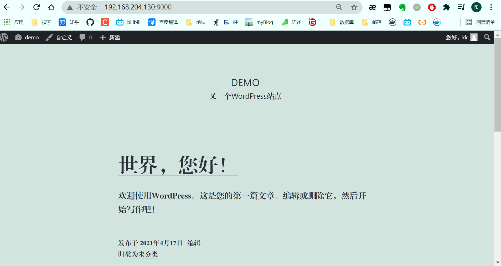
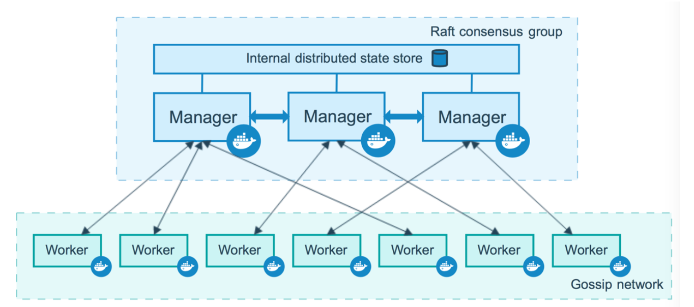
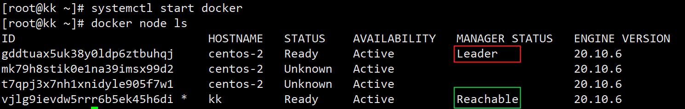
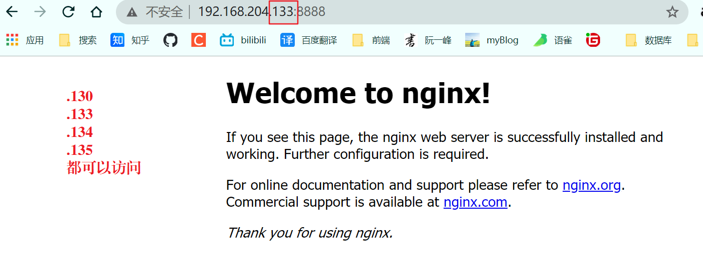
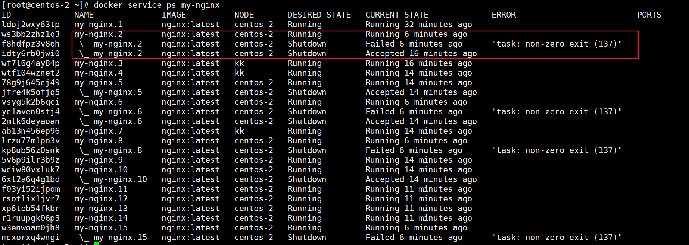

# Docker Compose

## 简介

Dockerfile build run手动操作,单个容器微服务。

100个微服务!

依赖关系Docker Compose来轻松高效的**管理容器**。定义运行多个容器。

### 官方定义

- 定义、运行多个容器
- YAML file配置文件
- single command。命令有哪些?

### Overview of Docker Compose

Compose is a tool for defining and running multi-container Docker applications. With Compose, you use a YAML file to configure your application’s services. Then, with a single command, you create and start all the services from your configuration. To learn more about all the features of Compose, see [the list of features](https://docs.docker.com/compose/#features).

Compose works in all environments: production, staging, development, testing, as well as CI workflows. You can learn more about each case in [Common Use Cases](https://docs.docker.com/compose/#common-use-cases).

Using Compose is basically a three-step process:

1. Define your app’s environment with a `Dockerfile` so it can be reproduced anywhere.
2. Define the services that make up your app in `docker-compose.yml` so they can be run together in an isolated environment.
3. Run `docker compose up` and the [Docker compose command](https://docs.docker.com/compose/cli-command/) starts and runs your entire app. You can alternatively run `docker-compose up` using the docker-compose binary.

### **作用:批量容器编排**

Compose是 Docker官方的**开源项目**。需要安装。

Dockerfile让程序在任何地方运行。web服务。 redis、 mysql、 nginx….多个容器。run

A `docker-compose.yml` looks like this:

```yaml
version: "3.9"  # optional since v1.27.0
services:
  web:
    build: .
    ports:
      - "5000:5000"
    volumes:
      - .:/code
      - logvolume01:/var/log
    links:  # 连接作用
      - redis
  redis:
    image: redis
volumes:
  logvolume01: {}
```

docker- compose up100个服务。

Compose:重要的概念服务 

- services,容器。应用。(web、 redis、 mysql.)
- 项目 project。一组关联的容器。博客。web、 mysql,Wp

## 安装

```sh
# 1.使用国内的镜像下载
curl -L https://get.daocloud.io/docker/compose/releases/download/1.29.1/docker-compose-`uname -s`-`uname -m`  >/usr/local/bin/docker-compose

#2.Apply executable permissions to the binary:
[root@kk bin]# chmod +x /usr/local/bin/docker-compose

  #3.使用  命令 查看版本信息
[root@kk bin]# docker-compose version
docker-compose version 1.25.5, build 8a1c60f6
docker-py version: 4.1.0
CPython version: 3.7.5
OpenSSL version: OpenSSL 1.1.0l  10 Sep 2019

```

### start

1. #### 创建目录

   ```sh
   [root@kk ] #mkdir composetest
   [root@kk ] #cd composetest
   ```

2. #### 创建 vim app.py

   ```python
   import time
   import redis
   from flask import Flask
   app = Flask(__name__)
   cache = redis.Redis(host='redis', port=6379)
   def get_hit_count():
       retries = 5
       while True:
           try:
               return cache.incr('hits')
           except redis.exceptions.ConnectionError as exc:
               if retries == 0:
                   raise exc
               retries -= 1
               time.sleep(0.5)
   @app.route('/')
   def hello():
       count = get_hit_count()
       return 'Hello World! I have been seen {} times./n'.format(count)
   ```

   3. #### 创建 vim requirements.txt

      ```
      flask
      redis
      ```

   4.  #### 创建 vim Dockerfile

      ```sh
      FROM python:3.7-alpine
      # RUN echo -e http://mirrors.ustc.edu.cn/alpine/v3.12/main/ > /etc/apk/repositories  # 修改镜像地址，否则报错
      # 执行RUN apk add --no-cache gcc musl-dev linux-headers命令时，使用的是国外源，因此我们使用国内源将其覆盖就行
      WORKDIR /code
      ENV FLASK_APP=app.py
      ENV FLASK_RUN_HOST=0.0.0.0
      RUN apk add --no-cache gcc musl-dev linux-headers
      COPY requirements.txt requirements.txt
      RUN pip install -r requirements.txt
      EXPOSE 5000
      COPY . .
      CMD ["flask", "run"]
      ```

   5. #### 创建 docker-compose.yml  

      ```yaml
      version: "3.9"
      services:
        web:
          build: .
          ports:
            - "5000:5000"
        redis:
          image: "redis:alpine"
      ```

   6. #### 启动

```sh
[root@kk composetest]# docker-compose up
ERROR: Version in "./docker-compose.yml" is unsupported. You might be seeing this error because you're using the wrong Compose file version. Either specify a supported version (e.g "2.2" or "3.3") and place your service definitions under the `services` key, or omit the `version` key and place your service definitions at the root of the file to use version 1.
#2. 报错的原因是没有启动docker  启动docker
[root@kk composetest]# systemctl start docker
[root@kk composetest]# docker-compose up

#3.启动再次报错
fetch https://dl-cdn.alpinelinux.org/alpine/v3.13/main/x86_64/APKINDEX.tar.gz
WARNING: Ignoring https://dl-cdn.alpinelinux.org/alpine/v3.13/main: Permission denied
fetch https://dl-cdn.alpinelinux.org/alpine/v3.13/community/x86_64/APKINDEX.tar.gz
WARNING: Ignoring https://dl-cdn.alpinelinux.org/alpine/v3.13/community: Permission denied
ERROR: unable to select packages:
  gcc (no such package):
    required by: world[gcc]
  linux-headers (no such package):
    required by: world[linux-headers]
  musl-dev (no such package):
    required by: world[musl-dev]
The command '/bin/sh -c apk add --no-cache gcc musl-dev linux-headers' returned a non-zero code: 3
ERROR: Service 'web' failed to build : Build failed

# 解决办法：在Dockerfile中修改镜像源
[root@kk composetest]# vim Dockerfile 

# # RUN echo -e http://mirrors.ustc.edu.cn/alpine/v3.12/main/ > /etc/apk/repositories  # 修改镜像地址，否则报错
[root@kk composetest]# docker-compose up  
# 5.成功启动
....
Successfully built MarkupSafe
Installing collected packages: MarkupSafe, Werkzeug, Jinja2, itsdangerous, click, redis, flask
Successfully installed Jinja2-2.11.3 MarkupSafe-1.1.1 Werkzeug-1.0.1 click-7.1.2 flask-1.1.2 itsdangerous-1.1.0 redis-3.5.3
...
#6. 生成了两个服务
Creating composetest_web_1   ... done
Creating composetest_redis_1 ... done
....

#7. 可以先 build
[root@kk composetest]# docker-compose build
redis uses an image, skipping
Building web
Sending build context to Docker daemon  5.632kB
Step 1/11 : FROM python:3.7-alpine
 ---> c46f62f378d7
Step 2/11 : RUN echo -e http://mirrors.ustc.edu.cn/alpine/v3.12/main/ > /etc/apk/repositories
 ---> Using cache
 ---> 2288d3233857
Step 3/11 : WORKDIR /code
 ---> Using cache
 ---> 48a5cb6b412e
Step 4/11 : ENV FLASK_APP=app.py
 ---> Using cache
 ---> 12271f83faf7
Step 5/11 : ENV FLASK_RUN_HOST=0.0.0.0
 ---> Using cache
 ---> 7b3d68a7332c
Step 6/11 : RUN apk add --no-cache gcc musl-dev linux-headers
 ---> Using cache
 ---> bb36f9b43fda
Step 7/11 : COPY requirements.txt requirements.txt
 ---> Using cache
 ---> 56ad32305467
Step 8/11 : RUN pip install -r requirements.txt
 ---> Using cache
 ---> 11f6c3cf4705
Step 9/11 : EXPOSE 5000
 ---> Using cache
 ---> 2fa8e443ab62
Step 10/11 : COPY . .
 ---> Using cache
 ---> d5e1b3da9b1d
Step 11/11 : CMD ["flask", "run"]
 ---> Using cache
 ---> 9e25b810ff0f
Successfully built 9e25b810ff0f
Successfully tagged composetest_web:latest

```

7.访问  http://192.168.204.130:5000/  每刷新一次，计数 **+1**

```sh
# 项目成功启动后 有两个服务 并且可以访问
[root@kk ~]# docker ps
CONTAINER ID   IMAGE             COMMAND                  CREATED          STATUS         PORTS                                       NAMES
fdc547b29bdd   redis:alpine      "docker-entrypoint.s…"   15 minutes ago   Up 8 seconds   6379/tcp                                    composetest_redis_1
25d2b12db8d2   composetest_web   "flask run"              15 minutes ago   Up 8 seconds   0.0.0.0:5000->5000/tcp, :::5000->5000/tcp   composetest_web_1
[root@kk ~]# curl localhost:5000
Hello World! I have been seen 5 times.
[root@kk ~]# curl localhost:5000
Hello World! I have been seen 11 times.
```

8. #### 停止  ctrl + c  或   docker-compose down

   ```sh
   [root@kk composetest]# docker-compose down
   Stopping composetest_redis_1 ... done
   Stopping composetest_web_1   ... done
   Removing composetest_redis_1 ... done
   Removing composetest_web_1   ... done
   Removing network composetest_default
   ```

   

### 小结

docker-compose以前都是**单个** docker run启动容器

docker-compose.通过 docker-compose编写yaml配置文件、可以通过 compose一键启动/停止所有服务!

1. Docker镜像 run=>容器
2. Docker file构建镜像(服务打包)
3. docker- compose启动项目(编排、多个微服务/环境)
4. Docker网络

## yaml

docker 与 docker-compose版本的对应关系 [官网](https://docs.docker.com/compose/compose-file/)

| **Compose file format** | **Docker Engine release** |
| :---------------------- | :------------------------ |
| Compose specification   | 19.03.0+                  |
| 3.8                     | 19.03.0+                  |
| 3.7                     | 18.06.0+                  |
| 3.6                     | 18.02.0+                  |
| 3.5                     | 17.12.0+                  |
| 3.4                     | 17.09.0+                  |
| 3.3                     | 17.06.0+                  |
| 3.2                     | 17.04.0+                  |
| 3.1                     | 1.13.1+                   |
| 3.0                     | 1.13.0+                   |
| 2.4                     | 17.12.0+                  |
| 2.3                     | 17.06.0+                  |
| 2.2                     | 1.13.0+                   |
| 2.1                     | 1.12.0+                   |
| 2.0                     | 1.10.0+                   |
| 1.0                     | 1.9.1.+                   |

docker-compose.yml  文件的编写规则

```yaml
#3层
version:'#版本
services: #服务
    服务1: web
        #服务配置
        images
        build
        network
    服务2: redis
    服务3: redis
#其他配置网络/卷、全局规则
volumes:
networks:
configs:
```

#### depends_on

Express dependency between services. Service dependencies cause the following behaviors:

docker-compose up starts services in dependency order. In the following example, ==db and redis== are started **before** ==web==.
docker-compose up SERVICE automatically includes SERVICE’s dependencies. In the example below, docker-compose up web also creates and starts db and redis.
docker-compose stop stops services in dependency order. In the following example, web is stopped before db and redis.
Simple example:

```yaml
version: "3.9"
services:
  web:
    build: .
    depends_on:
      - db
      - redis
  redis:
    image: redis
  db:
    image: postgres
```

## 搭建开源wordpress博客


1. 创建文件夹  my_wordpress

2. 创建 docker-compose.yaml文件

   ```yaml
   version: "3.9"
       
   services:
     db:
       image: mysql:5.7
       volumes:
         - db_data:/var/lib/mysql
       restart: always
       environment:
         MYSQL_ROOT_PASSWORD: somewordpress
         MYSQL_DATABASE: wordpress
         MYSQL_USER: wordpress
         MYSQL_PASSWORD: wordpress
       
     wordpress:
       depends_on:
         - db
       image: wordpress:latest
       ports:
         - "8000:80"
       restart: always
       environment:
         WORDPRESS_DB_HOST: db:3306
         WORDPRESS_DB_USER: wordpress
         WORDPRESS_DB_PASSWORD: wordpress
         WORDPRESS_DB_NAME: wordpress
   volumes:
     db_data: {}
   ```

   3. Build the project     `docker-compose up -d`  (后台启动)
   4. 访问 http://192.168.204.130:8000/ 

## 实战 搭建 redis + web

1. 编写微服务

```java
@RestController
public class RedisDemo {
    @Autowired
    StringRedisTemplate redisTemplate;
    @GetMapping("/")
    public String hello(){
        Long views = redisTemplate.opsForValue().increment("views");

        return "访问量为 + " + views;
    }
}
在application.properties中添加
server.port=8080
#通过域名进行访问
spring.redis.host=redis
```

2. 构建镜像  **Dockerfile** 文件

```sh
FROM java:8

COPY *.jar ./app.jar

EXPOSE 8080

CMD ["--server.port=8080"]

ENTRYPOINT ["java","-jar","app.jar"]
```

3. docker-compose.yaml 编排镜像

```yaml
version: "3.9"
services:
  lpapp:
    build: .
    image: lpapp
    depends_on:
      - redis
    ports:
      - "8080:8080"
  redis:
    image: "redis:alpine"
```

4. 将 jar,Dockerfile,docker-compose.yml上传到服务器进启动

   docker-compose up

   ```sh
   Successfully built d7adccf185e2
   Successfully tagged lpapp:latest
   WARNING: Image for service lpapp was built because it did not already exist. To rebuild this image you must use `docker-compose build` or `docker-compose up --build`.
   Creating my-web-redis_redis_1 ... done
   Creating my-web-redis_lpapp_1 ... done
   [root@kk my-web-redis]# curl localhost:8080
   访问量为 + 5
   [root@kk my-web-redis]# curl localhost:8080
   访问量为 + 6
   [root@kk my-web-redis]# curl localhost:8080
   访问量为 + 7
   ```

   

5.  访问 http://192.168.204.130:8080/

   

若项目需要重新部署 使用 命令 `docker-compose up --build`

### 小结

**工程、服务、容器**

项目 compose:三层

- 工程 Porject
- 服务服务
- 容器运行实例! docker k8s容器

## docker-swarm


### 创建4个Linux主机

使用vm创建4个虚拟机 centos-1、 centos-2、 centos-3、 centos-4

- 新建一个虚拟机，这样占的内存比较小
- 关机，创建完整克隆
- 开机克隆后的虚拟机，使用ssh 连接测试,查看分配的ip addr

```sh
#1.centos-1
[root@kk ~]# clear
[root@kk ~]# ip addr
1: lo: <LOOPBACK,UP,LOWER_UP> mtu 65536 qdisc noqueue state UNKNOWN group default qlen 1000
    link/loopback 00:00:00:00:00:00 brd 00:00:00:00:00:00
    inet 127.0.0.1/8 scope host lo
       valid_lft forever preferred_lft forever
    inet6 ::1/128 scope host 
       valid_lft forever preferred_lft forever
2: ens33: <BROADCAST,MULTICAST,UP,LOWER_UP> mtu 1500 qdisc pfifo_fast state UP group default qlen 1000
    link/ether 00:0c:29:c1:13:6d brd ff:ff:ff:ff:ff:ff
    inet 192.168.204.130/24 brd 192.168.204.255 scope global noprefixroute ens33
       valid_lft forever preferred_lft forever
    inet6 fe80::62dc:f8a3:a777:e321/64 scope link noprefixroute 
       valid_lft forever preferred_lft forever

#2.centos-2
[root@centos-2 ~]# ip addr
...
2: ens33: <BROADCAST,MULTICAST,UP,LOWER_UP> mtu 1500 qdisc pfifo_fast state UP group default qlen 1000
    link/ether 00:0c:29:bf:f3:5a brd ff:ff:ff:ff:ff:ff
    inet 192.168.204.133/24 brd 192.168.204.255 scope global noprefixroute dynamic ens33
       valid_lft 1508sec preferred_lft 1508sec
    inet6 fe80::596f:b1e2:3240:2316/64 scope link tentative noprefixroute dadfailed 
       valid_lft forever preferred_lft forever
    inet6 fe80::3885:216e:351:70a1/64 scope link noprefixroute 
       valid_lft forever preferred_lft forever

#3.centos-3
[root@centos-2 ~]# ip addr
....
2: ens33: <BROADCAST,MULTICAST,UP,LOWER_UP> mtu 1500 qdisc pfifo_fast state UP group default qlen 1000
    link/ether 00:0c:29:dd:75:4c brd ff:ff:ff:ff:ff:ff
    inet 192.168.204.134/24 brd 192.168.204.255 scope global noprefixroute dynamic ens33
       valid_lft 1247sec preferred_lft 1247sec
    inet6 fe80::596f:b1e2:3240:2316/64 scope link noprefixroute 
       valid_lft forever preferred_lft forever

#4.centos-4
[root@centos-2 ~]# ip addr
...
2: ens33: <BROADCAST,MULTICAST,UP,LOWER_UP> mtu 1500 qdisc pfifo_fast state UP group default qlen 1000
    link/ether 00:0c:29:c7:7a:f7 brd ff:ff:ff:ff:ff:ff
    inet 192.168.204.135/24 brd 192.168.204.255 scope global noprefixroute dynamic ens33
       valid_lft 1474sec preferred_lft 1474sec
    inet6 fe80::596f:b1e2:3240:2316/64 scope link tentative noprefixroute dadfailed 
       valid_lft forever preferred_lft forever
    inet6 fe80::3885:216e:351:70a1/64 scope link tentative noprefixroute dadfailed 
       valid_lft forever preferred_lft forever
    inet6 fe80::2984:5159:a582:25ee/64 scope link noprefixroute 
       valid_lft forever preferred_lft forever

```

可以看到四台虚拟机都在一个网段，他们之间可以相互ping 通

- 192.168.204.130/24
- 192.168.204.133/24 
- 192.168.204.134/24 
- 192.168.204.135/24 

### 给主机安装 docker

- 在xshell中右键，选中同时发送所有会话
- 4台机器同时安装 docker


### 工作模式

Docker Engine 1.12 introduces swarm mode that enables you to create a cluster of one or more Docker Engines called a swarm. A swarm consists of one or more nodes: physical or virtual machines running Docker Engine 1.12 or later in swarm mode.

There are two types of nodes: [**managers**](https://docs.docker.com/engine/swarm/how-swarm-mode-works/nodes/#manager-nodes) and [**workers**](https://docs.docker.com/engine/swarm/how-swarm-mode-works/nodes/#worker-nodes).

- 管理节点  操作都在管理节点
- 工作节点



### 搭建集群

查看 **swarm**  命令 

```sh
[root@centos-2 ~]# docker swarm --help

Usage:  docker swarm COMMAND

Manage Swarm

Commands:
  ca          Display and rotate the root CA
  init        Initialize a swarm
  join        Join a swarm as a node and/or manager
  join-token  Manage join tokens
  leave       Leave the swarm
  unlock      Unlock swarm
  unlock-key  Manage the unlock key
  update      Update the swarm

[root@centos-2 ~]# docker swarm init --help

Usage:  docker swarm init [OPTIONS]

Initialize a swarm

Options:
      --advertise-addr string                  Advertised address (format: <ip|interface>[:port])
      --autolock                               Enable manager autolocking (requiring an unlock key to start a stopped
                                               manager)
      --availability string                    Availability of the node ("active"|"pause"|"drain") (default "active")
      --cert-expiry duration                   Validity period for node certificates (ns|us|ms|s|m|h) (default 2160h0m0s)
      --data-path-addr string                  Address or interface to use for data path traffic (format: <ip|interface>)
      --data-path-port uint32                  Port number to use for data path traffic (1024 - 49151). If no value
                                               is set or is set to 0, the default port (4789) is used.
      --default-addr-pool ipNetSlice           default address pool in CIDR format (default [])
      --default-addr-pool-mask-length uint32   default address pool subnet mask length (default 24)
      --dispatcher-heartbeat duration          Dispatcher heartbeat period (ns|us|ms|s|m|h) (default 5s)
      --external-ca external-ca                Specifications of one or more certificate signing endpoints
      --force-new-cluster                      Force create a new cluster from current state
      --listen-addr node-addr                  Listen address (format: <ip|interface>[:port]) (default 0.0.0.0:2377)
      --max-snapshots uint                     Number of additional Raft snapshots to retain
      --snapshot-interval uint                 Number of log entries between Raft snapshots (default 10000)
      --task-history-limit int                 Task history retention limit (default 5)


```

#### 选中任意一台虚拟机，初始化节点

```sh
[root@kk ~]# docker swarm init --advertise-addr 192.168.204.130
Swarm initialized: current node (vjlg9ievdw5rrr6b5ek45h6di) is now a manager.

To add a worker to this swarm, run the following command:

    docker swarm join --token SWMTKN-1-3q0mut10c9433xut1wztbx4tdm5p8yd38lqx4gaswl9jp68nj3-2yqhijkdaeo1t33m0t4f3i75w 192.168.204.130:2377

To add a manager to this swarm, run 'docker swarm join-token manager' and follow the instructions.
# 获取令牌
docker swarm join-token manager
docker swarm join-token worker
```

####  加入worker 节点

```sh
# 1.在另一台虚拟机上 将其作为 worker 加入集群时报错
[root@kk ~]# docker swarm join --token SWMTKN-1-3q0mut10c9433xut1wztbx4tdm5p8yd38lqx4gaswl9jp68nj3-2yqhijkdaeo1t33m0t4f3i75w 192.168.204.130:2377
Error response from daemon: rpc error: code = Unavailable desc = connection error: desc = "transport: Error while dialing dial tcp 192.168.204.130:2377: connect: no route to host

# 2.解决办法 关闭 初始化节点的防火墙即可
[root@kk ~]# systemctl status firewalld.service
● firewalld.service - firewalld - dynamic firewall daemon
   Loaded: loaded (/usr/lib/systemd/system/firewalld.service; enabled; vendor preset: enabled)
   Active: active (running) since 日 2021-04-18 08:52:23 CST; 1h 1min ago
     Docs: man:firewalld(1)
...
[root@kk ~]# systemctl stop firewalld.service
[root@kk ~]# systemctl status firewalld.service
● firewalld.service - firewalld - dynamic firewall daemon
   Loaded: loaded (/usr/lib/systemd/system/firewalld.service; enabled; vendor preset: enabled)
   Active: inactive (dead) since 日 2021-04-18 09:54:30 CST; 9s ago
# 3.回到 worker中 再次 join 成功
[root@centos-2 ~]# docker swarm join --token SWMTKN-1-3q0mut10c9433xut1wztbx4tdm5p8yd38lqx4gaswl9jp68nj3-2yqhijkdaeo1t33m0t4f3i75w 192.168.204.130:2377
This node joined a swarm as a worker.

```

#### 加入 manager节点

```sh
# 1.在 manager 节点创建 令牌
[root@kk ~]# docker swarm join-token manager
To add a manager to this swarm, run the following command:

    docker swarm join --token SWMTKN-1-3q0mut10c9433xut1wztbx4tdm5p8yd38lqx4gaswl9jp68nj3-emcymqon1tv3axobrmvc7ncr2 192.168.204.130:2377

# 2.在 centos-2中加入 报错
[root@centos-2 ~]# docker swarm join --token SWMTKN-1-3q0mut10c9433xut1wztbx4tdm5p8yd38lqx4gaswl9jp68nj3-emcymqon1tv3axobrmvc7ncr2 192.168.204.130:2377
Error response from daemon: manager stopped: can't initialize raft node: rpc error: code = Unknown desc = could not connect to prospective new cluster member using its advertised address: rpc error: code = Unavailable desc = connection error: desc = "transport: Error while dialing dial tcp 192.168.204.133:2377: connect: no route to host"

# 3.解决办法  在将要成为 manager节点的虚拟机上 关闭防火墙
[root@centos-2 ~]# systemctl stop firewalld.service
[root@centos-2 ~]# docker swarm join --token SWMTKN-1-3q0mut10c9433xut1wztbx4tdm5p8yd38lqx4gaswl9jp68nj3-emcymqon1tv3axobrmvc7ncr2 192.168.204.130:2377
This node joined a swarm as a manager.

```

思考： 成为 worker节点不用关闭 防火墙，要成为 manager节点 则需要关闭本机防火墙

查看集群中node的所有状态

```sh
[root@centos-2 ~]# docker node ls
ID                                             HOSTNAME   STATUS    AVAILABILITY   MANAGER STATUS   ENGINE VERSION                    
gddtuax5uk38y0ldp6ztbuhqj *    centos-2   Ready     Active         Reachable        20.10.6
mk79h8stik0e1na39imsx99d2      centos-2   Ready     Active                          20.10.6
t7qpj3x7nh1xnidyle905f7w1        centos-2   Ready     Active                          20.10.6
vjlg9ievdw5rrr6b5ek45h6di         kk         Ready     Active         Leader           20.10.6

```

#### 小结 

- 生成主节点 init
- 加入(manager /worker)


### Raft

- Raft协议 ：保证==大多数==节点存活才可以用，集群至少大于==3台==。

#### 双主双从的模型时，关闭一个manager，另一个也无法使用

```sh
#  centos-1
[root@kk ~]# systemctl stop docker
Warning: Stopping docker.service, but it can still be activated by:
  docker.socket
#  centos-2  
[root@centos-2 ~]# docker node ls
Error response from daemon: This node is not a swarm manager. Worker nodes can't be used to view or modify cluster state. Please run this command on a manager node or promote the current node to a manager.
```

再次启动  centos-1 发现 leader 变成了 centos-2


#### 3主1从的模型时，关闭一个manager，另2个可以==正常使用==


### Swarm 集群弹性创建服务


- 以后告别 docker run docker- compose up!启动一个项目。**单机!**

- 集群: swarm docker serivce容器=>服务!容器=>服务!=>副本
- redis服务=>10个副本!(同时开启10个 redis容器
- 体验:创建服务、动态扩展服务、动态更新服务、

查看 service命令

```sh
[root@centos-2 ~]# docker service --help

Usage:  docker service COMMAND

Manage services

Commands:
  create      Create a new service
  inspect     Display detailed information on one or more services
  logs        Fetch the logs of a service or task
  ls          List services
  ps          List the tasks of one or more services
  rm          Remove one or more services
  rollback    Revert changes to a service's configuration
  scale       Scale one or multiple replicated services
  update      Update a service

```

灰度发布，金丝雀发布

- docker run容器启动!不具有扩缩容器
- docker service服务!具有**扩缩容器,滚动更新**

#### 创建服务、查看服务副本

- docker service create -p 8888:80 --name my-nginx nginx
- docker service ls

```sh
[root@centos-2 ~]# docker service create -p 8888:80 --name my-nginx nginx
gj20rsfsazimvrmqgm6agheup
overall progress: 1 out of 1 tasks 
1/1: running   [==================================================>] 
verify: Service converged 
#1.Usage:  docker service ps [OPTIONS] SERVICE [SERVICE...]
[root@centos-2 ~]# docker service ps my-nginx   
ID             NAME         IMAGE          NODE       DESIRED STATE   CURRENT STATE           ERROR     PORTS
ldoj2wxy63tp   my-nginx.1   nginx:latest   centos-2   Running         Running 3 minutes ago             
#2.
[root@centos-2 ~]# docker service ls
ID                     NAME       MODE         REPLICAS   IMAGE          PORTS
gj20rsfsazim   my-nginx   replicated   1/1        nginx:latest   *:8888->80/tcp
[root@centos-2 ~]#
```

#### 进行扩容操作

- docker service update --replicas 15 my-nginx
- docker ps

```sh
# 3主1从  服务随机分配到几台机器上
[root@centos-2 ~]# docker service update --replicas 15 my-nginx
my-nginx
overall progress: 15 out of 15 tasks 
1/15: running   [==================================================>] 
....
15/15: running   [==================================================>] 
verify: Service converged 

# 查看运行的容器
[root@centos-2 ~]# docker ps
CONTAINER ID   IMAGE          COMMAND                  CREATED              STATUS              PORTS     NAMES
7de5088c9833   nginx:latest   "/docker-entrypoint.…"   About a minute ago   Up About a minute   80/tcp    my-nginx.15.mcxorxq4wngip2mpd1zvnxtxo
73663469fe85   nginx:latest   "/docker-entrypoint.…"   3 minutes ago        Up 3 minutes        80/tcp    my-nginx.6.yc1aven0stj4r2h5kc5o4c3m3
```

##### 使用  ==scale== 命令

```sh
[root@centos-2 ~]# docker service scale my-nginx=3
my-nginx scaled to 3
overall progress: 3 out of 3 tasks 
1/3: running   [==================================================>] 
2/3: running   [==================================================>] 
3/3: running   [==================================================>] 
verify: Service converged 

```

##### 回滚

```sh
[root@centos-2 ~]# docker service update --replicas 1 my-nginx
my-nginx
overall progress: 1 out of 1 tasks 
1/1: task: non-zero exit (137) 
verify: Service converged 
```


#### 访问

集群中的任意ip,均可以访问到



将 .133中运行的 nginx容器**移除**，依然可以通过133访问到

```sh
[root@centos-2 ~]# docker rm -f $(docker ps -aq)
7de5088c9833
73663469fe85
84361adae3ed
1d178fd2e809
[root@centos-2 ~]# docker service ls
ID             NAME       MODE         REPLICAS   IMAGE          PORTS
gj20rsfsazim   my-nginx   replicated   15/15      nginx:latest   *:8888->80/tcp

[root@centos-2 ~]# docker service ps my-nginx
```



服务,集群中任意的节点都可以访问。服务可以有多个副本动态扩缩容实现高可用!


#### 服务移除

```sh
[root@centos-2 ~]# docker service rm my-nginx
my-nginx
[root@centos-2 ~]# docker service ls
ID        NAME      MODE      REPLICAS   IMAGE     PORTS

# 所有的服务停止
```

## 概念总结

### swarm

集群的管理和编号。docker可以初始化一个 swarn集群,其他节点可以加入。(管理、工作者)

### Node

就是一个 docker节点。多个节点就组成了一个网络集群。(管理、工作者)

### Service

任务,可以在管理节点或者工作节点来运行。核心。!用户访问!

## Task

容器内的命令,细节任务!


