#  Redis

- noSql讲解
- 阿里巴巴架构演进
- nosql数据模型
- Nosq四大分类
- CAP
- BASE
- Redis入门
- Redis安装( Window& Linux服务器)
- 五大基本数据类型
  - String
  - List
  - Set
  - Hash
  - Zset
- 三种特殊数据类型
  - geo
  - hyperloglog
  - bitmap
- Redis配置详解
- Redis持久化 
  - RDB
  - AOF
- Redis事务操作
- Redis实现订阅发布
- Redis主从复制
- Redis哨兵模式(现在公司中所有的集群都用哨兵模式)
- 缓存穿透及解决方案
- 缓存击穿及解决方案
- 缓存雪崩及解决方案
- 基础API之 Jedis详解
- Spring Boot集成 Redis操作
- Redis的实践分析

## 历史发展：

###  1.单机MySQL时代（90年代）


一个网站的访问量一般不会太大，单个数据库完全够用


问题：

- 数据量增加到一定程度，单机数据库就放不下了
- 数据的索引（B+ Tree）,一个机器内存也存放不下
- 访问量变大后（读写混合），一台服务器承受不住。

### 2.MySQL垂直拆分+MemCache

​       网站80%的情况都是在读,毎次都要去査询数据库的话就十分的麻烦!所以说我们希望减轻数据的压力,我们可以使用缓存来保证效率!

​	  发展过程:优化数据结构和索引->文件缓存(O)->- Memcached(当时最热门的技术!)

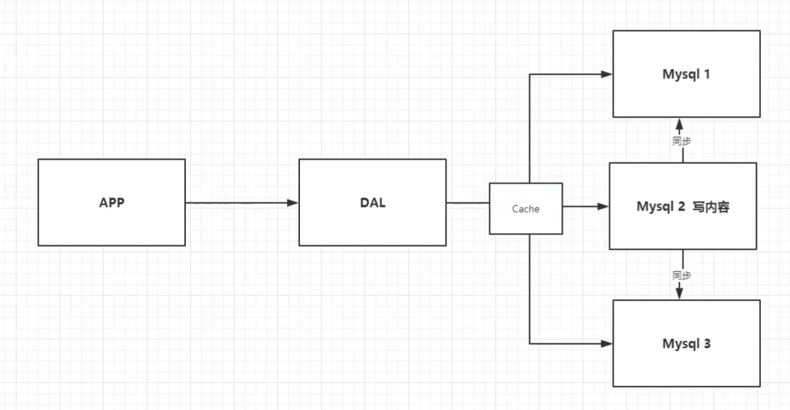

### 3.分库分表+水平拆分+ MYSQL集群

技术和业务在发展的同时,对人的要求也越来越高!

==本质:数据库(读,写)==

- 早些年 MYISAM:表锁,十分影响效率!高并发下就会出现严重的锁问题

- 转战 Innodb:**行锁**
- 慢慢的就开始使用分库分表来解决写的压力!
-  MYSQL在那个年代推出了表分区!这个并没有多少公司使用!
- MYSQL的集群,很好满足哪个年代的所有需求!

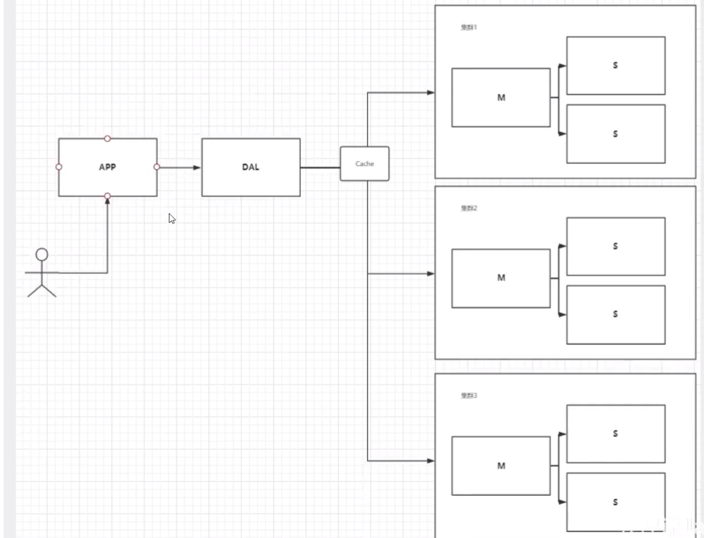

### 4、如今最近的年代

2010-2020十年之间,世界已经发生了翻天覆地的变化;(定位,也是一种数据,音乐,热榜!）

MySQL等**关系型数据库**就不够用了!数据量很多,变化很快

MySQL有的使用它来存储一些比较大的文件,博客,图片!数据库表很大,效率就低了!如果有一种数据库来专门处理这种数据,MYSQL压力就变得十分小(研究如何处理这些问题!)大数据的IO压力下,表几乎没法更大!

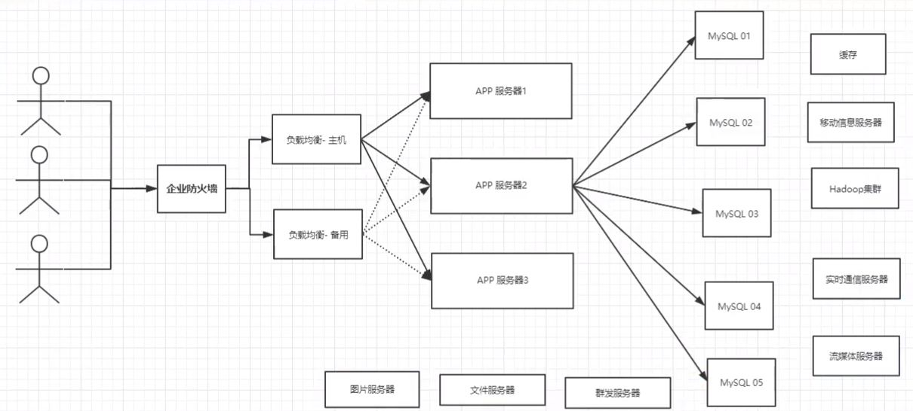


# NoSQL概述

## 为什么要用 NOSQL

大数据时代！！普通的数据库无法进行数据分析！Hadoop(2006)。

用户的个人信息,社交网络,地理位置。用户自己产生的数据,用户日志等等爆发式增长

这时候我们就需要使用NOSQL数据库的,Nosq可以很好的处理以上的情况


## 什么是 NOSQL

NOSQL= Not Only SQL(不仅仅是SQL)

​	  关系型数据库:表格,行,列

​	  泛指非关系型数据库的,随着**web2.0**互联网的诞生!传统的关系型数据库很难对付web2.0时代!尤其是**超大规模的髙并发**的社区!暴露岀来很多难以克服的问题,NoSQL在当今大数据环境下发展的十分迅速, Redis是发展最快的,而且是我们当下必须要掌握的一个技术!

​       很多的数据类型用户的个人信息,社交网络,地理位雪。这些数据类型的存储不需要一个固定的格式!不需要多月的操作就可以横向扩展的!Map< String, Object>使用键值对来控制!


### NOSQL特点

解耦

1、方便扩展(数据之间没有关系,很好扩展!)

2、大数据量高性能( Redis一秒写8万次,读取11万,NoSQL的缓存记录级,是一种**细粒度的缓存**,性能会比较高!

3、数据类型是多样型的!(不需要事先设计数据库!随取随用!如果是数据量十分大的表,很多人就无法设计了!)

4、传统 RDBMS和 NOSQL

- 传统的 RDBMS
  - 结构化组织
  - SQL
  - 数据和关系都存在单独的表中操作
  - 数据定义语言
  - 严格的一致性
  - 基础的事务
  - .....
- NoSQL
  - 不仅仅是数据
  - 没有固定的查询语言键值对存储,列存储,文档存储,图形数据库(社交关系)
  - 最终一致性
  - CAP定理和BASE(异地多活)初级架构师!
  - 高性能,高可用,高可扩
  - .....


### 了解:3V+3高

大数据时代的3V:主要是描述问题的

- 1.海量 Volume
- 2.多样 Variety
- 3.实时 Velocity

大数据时代的3高:主要是对程序的要求

- 1.高并发
- 2.高可扩
- 3.高性能

真正在公司中的实践: ==NOSQL+ RDBMS==一起使用才是最强的,阿里巴巴的架构演进

技术没有高低之分,就看你如何去使用!(提升内功,思维的提高!)


## 阿里巴巴演进分析

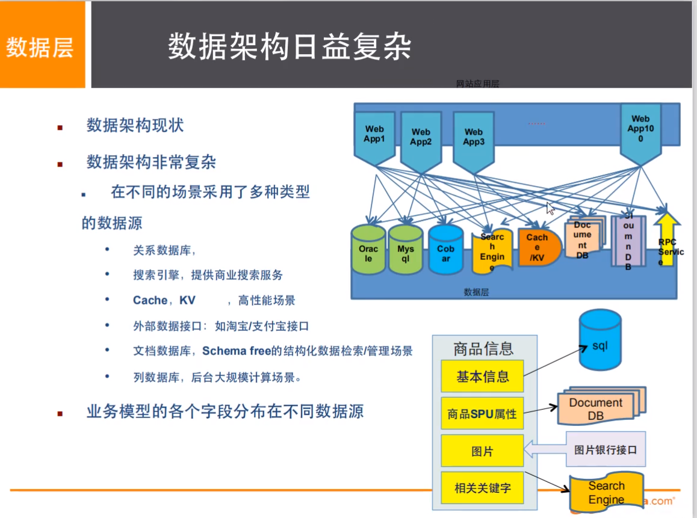

如果你未来相当一个架构师:没有什么是加一层解決不了的!

1.商品的基本信息

- 名称、价格、商家信息:关系型数据库就可以解决了! MYSQL/ oracle(淘宝早年就去IOE了!-王坚:推荐文章:阿里云的这群疯子:40分钟重要!
- 淘宝内部的 MYSQL不是大家用的 MYSQL

2、商品的描述、评论(文字比较多)文档型数据库中, Mongodb

3、图片

- 分布式文件系统 FastDFS
- 淘宝自己的        TFS
- Google的          GFS
- Hadoop            HDFS
- 阿里云的           Oss

4、商品的关键字(搜索)

- 搜索引擎solr elasticsearch
- ISearch:多隆(多去了解一下这些技术大佬!)所有牛過的人都有一段苦遍的岁月!但是你只要像SB一样的去坚持,终将牛通!

5、商品热门的波段信息内存数据库Redis Tair、 Memache

6、商品的交易,外部的支付接口


## NOSQL的四大分类

### KV键值对:

- 新浪: Redis
- 美团Redis Tair
- 阿里、百度: Redis+ memcache

### 文档型数据库(bson格式和json一样)·

- Mongodb(一般必须要掌握)
  - Mongodb是个基于分布式文件存储的数据库,C+编写,主要用来处理大量的文档
  - Mongodb是一个**介于**关系型数据库和非关系型数据的**中间的产品**! Mongodb是非关系型数据库中功能最丰富,最像关系型数据库的!
- ConthDB

### 列存储数据库

- Hbase
- 分布式文件系统

### 图关系数据库


特点：

- 他不是存图形,放的是关系,比如:朋友圈社交网络,广告推荐!
- Neo4j, Infogrid

### 四种分类的对比

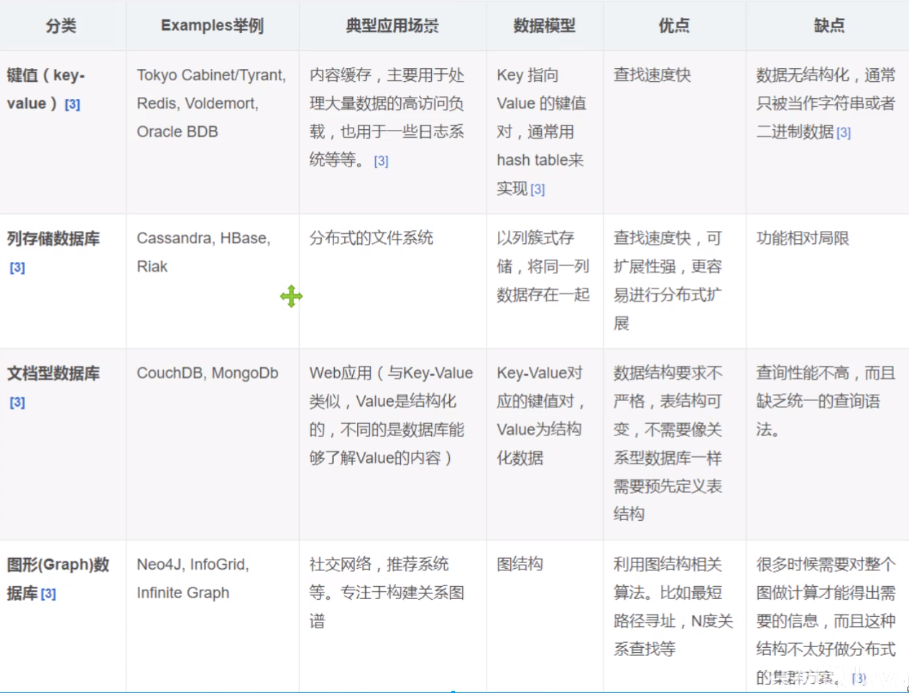

# Redis入门

## 概述

### Reds是什么

Redis( ==Remote Dictionary Server==)

即远程字典服务是一个开源的使用ANSI C语言编写、支持网络、可基于内存亦可持久化的日志型、 Key-value数据库,并提供多种语言的API。

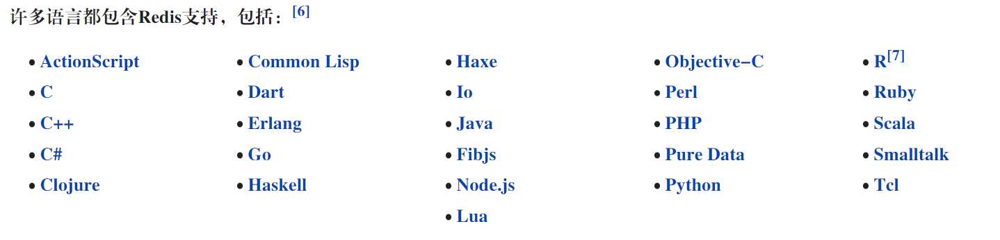

免费和开源

redis会周期性的把更新的数据写入磁盘或者把修改操作写入追加的记录文件,并且在此基础上实现了 master-slave(主从同步。免费和开源!是当下最热门的Nosql技术之一!也被人们称之为结构化数据库!

### Reds能干嘛

- 1、内存存储、持久化,内存中是断电即失、所以说持久化很重要(rdb、aof)
- 2、效率高,可以用于==高速缓存==
- 3、发布订阅系统
- 4、地图信息分析
- 5、计时器、计数器(浏览量!)
- ...

### 特性

- 1、多样的数据类型
- 2、持久化
- 3、集群
- 4、事务

## redis安装

### window安装

官方推荐使用linux或者mac os

 ```
Redis is written in ANSI C and works in most POSIX systems like Linux, *BSD, and OS X, without external dependencies. Linux and OS X are the two operating systems where Redis is developed and tested the most, and we recommend using Linux for deployment. Redis may work in Solaris-derived systems like SmartOS, but the support is best effort. There is no official support for Windows builds.
 ```

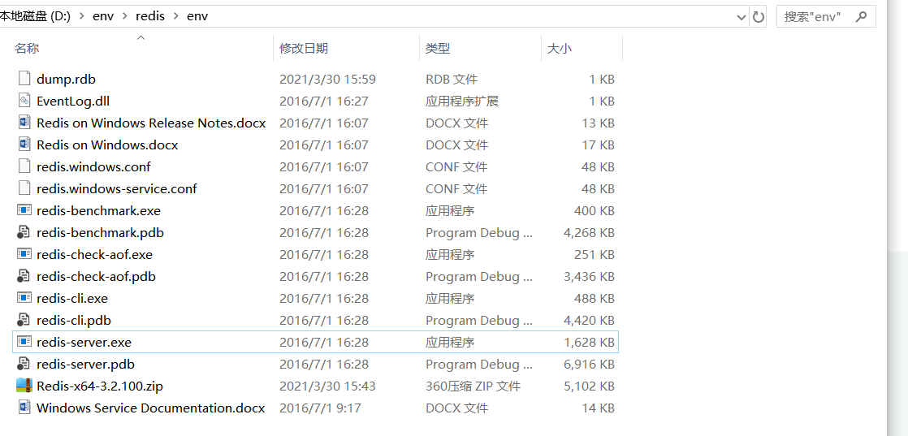

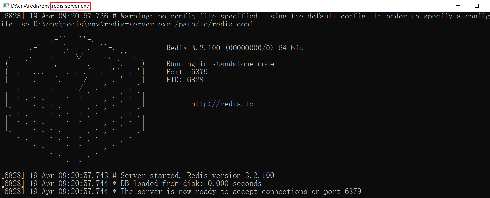

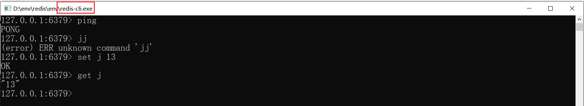

### linux安装

```sh
#1. 下载压缩包
#2.上传并解压  到  tar -zxvf  xxx
#3.进入解压的目录  安装环境 gcc-c++     yum install gcc-c++
#4.执行 make 命令
#5.make install 再次确认一下
[root@centos-2 redis-6.2.1]# make install
cd src && make install
make[1]: 进入目录“/home/redis-6.2.1/src”
    CC Makefile.dep
make[1]: 离开目录“/home/redis-6.2.1/src”
make[1]: 进入目录“/home/redis-6.2.1/src”
Hint: It's a good idea to run 'make test' ;)
    INSTALL install
    INSTALL install
    INSTALL install
make[1]: 离开目录“/home/redis-6.2.1/src”

#6.默认安装目录   /usr/local/bin
[root@centos-2 bin]# cd /usr/local/bin
[root@centos-2 bin]# ll
总用量 31276
-rwxr-xr-x. 1 root root 12728384 4月  18 16:33 docker-compose
-rwxr-xr-x. 1 root root  4833424 4月    19 15:54 redis-benchmark
lrwxrwxrwx. 1 root root       12 4月       19 15:54 redis-check-aof -> redis-server
lrwxrwxrwx. 1 root root       12 4月  	  19 15:54 redis-check-rdb -> redis-server
-rwxr-xr-x. 1 root root  5003472 4月    19 15:54 redis-cli
lrwxrwxrwx. 1 root root       12 4月        19 15:54 redis-sentinel -> redis-server
-rwxr-xr-x. 1 root root  9450304 4月     19 15:54 redis-server

#7.将配置文件 复制到 自建的 redis-config 目录下
[root@centos-2 local]# cp /home/redis-6.2.1/redis.conf /usr/local/bin/redis-config/
[root@centos-2 local]# cd /usr/local/bin/redis-config/
[root@centos-2 redis-config]# ls
redis.conf

#8.redis 默认不是后台启动的   修改配置文件为后台启动    由 no  改为  yes
# By default Redis does not run as a daemon. Use 'yes' if you need it.
# Note that Redis will write a pid file in /var/run/redis.pid when daemonized.
# When Redis is supervised by upstart or systemd, this parameter has no impact.
daemonize yes

#9.指定配置文件  使用redis-server进行启动 
[root@centos-2 bin]# redis-server redis-config/redis.conf 

#10.使用  redis-cli 指定端口 进行测试
[root@centos-2 bin]# redis-cli -p 6379
127.0.0.1:6379> set j 18
OK
127.0.0.1:6379> get j
"18"
127.0.0.1:6379> keys *
1) "j"
2) "p"

#11. 查看 redis的进程信息
[root@centos-2 ~]# ps -ef | grep redis
root      18516      1  0 16:12 ?        00:00:00 redis-server 127.0.0.1:6379
root      18534  13944  0 16:21 pts/2    00:00:00 redis-cli -p 6379
root      18536  13965  0 16:21 pts/3    00:00:00 grep --color=auto redis

#12.关闭 redis
[root@centos-2 local]# redis-cli -p 6379
127.0.0.1:6379> shutdown
not connected> exit
[root@centos-2 ~]# ps -ef | grep redis
root      18541  13965  0 16:23 pts/3    00:00:00 grep --color=auto redis


```

### 使用docker 安装

可以安装但是 启动的时候需要使用docker exec命令 有点小麻烦

```sh
# 1.docker search redis 命令来查看可用版本
[root@localhost ppppp]# docker search redis
NAME                             DESCRIPTION                                     STARS     OFFICIAL   AUTOMATED
redis                            Redis is an open source key-value store that…   9414      [OK]       
bitnami/redis                    Bitnami Redis Docker Image                      178                  [OK]
sameersbn/redis                                                                  83                   ....

# 2.查看本地镜像
使用以下命令来查看是否已安装了 redis：

$ docker images

# 3.运行容器
安装完成后，我们可以使用以下命令来运行 redis 容器：

$ docker run -itd --name redis-test -p 6379:6379 redis

# 4.安装成功
最后我们可以通过 docker ps 命令查看容器的运行信息：

# 5.接着我们通过 redis-cli 连接测试使用 redis 服务。

$ docker exec -it redis-test /bin/bash
```


## 测试性能

redis- benchmark是一个压力测试工具!

redis 性能测试工具可选参数如下所示：

| 序号 | 选项      | 描述                                       | 默认值    |
| :--- | :-------- | :----------------------------------------- | :-------- |
| 1    | **-h**    | 指定服务器主机名                           | 127.0.0.1 |
| 2    | **-p**    | 指定服务器端口                             | 6379      |
| 3    | **-s**    | 指定服务器 socket                          |           |
| 4    | **-c**    | ==指定并发连接数==                         | 50        |
| 5    | **-n**    | 指定请求数                                 | 10000     |
| 6    | **-d**    | 以字节的形式指定 SET/GET 值的数据大小      | 2         |
| 7    | **-k**    | 1=keep alive 0=reconnect                   | 1         |
| 8    | **-r**    | SET/GET/INCR 使用随机 key, SADD 使用随机值 |           |
| 9    | **-P**    | 通过管道传输 <numreq> 请求                 | 1         |
| 10   | **-q**    | 强制退出 redis。仅显示 query/sec 值        |           |
| 11   | **--csv** | 以 CSV 格式输出                            |           |
| 12   | **-l**    | 生成循环，永久执行测试                     |           |
| 13   | **-t**    | 仅运行以逗号分隔的测试命令列表。           |           |
| 14   | **-I**    | Idle 模式。仅打开 N 个 idle 连接并等待。   |           |


来简单测试下则试:

```sh
#100个并发连接10w请求

#1.开启 redis-server
[root@centos-2 ~]# redis-server /usr/local/bin/redis-config/redis.conf 

#2.开启 redis-cli
[root@centos-2 ~]# redis-cli -p 6379
127.0.0.1:6379> ping
PONG

#3.开始测试 redis-benchmark -h localhost -p 6379 -c 100 -n 100000
[root@centos-2 bin]# redis-benchmark -h localhost -p 6379 -c 100 -n 100000
....
Summary:
  throughput summary: 46750.82 requests per second
  latency summary (msec):
          avg       min       p50       p95       p99       max
        1.116     0.256     1.055     1.615     2.159     3.791


```

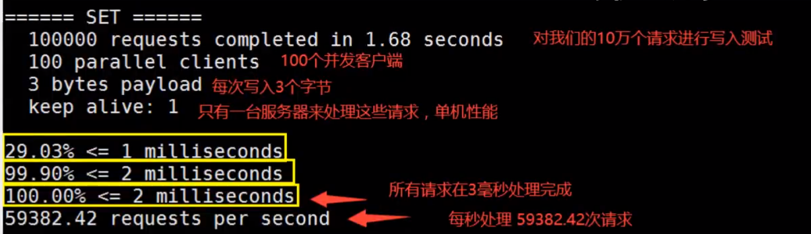


## 基础知识


### 基本数据库操作

默认有是**16**个数据库，默认使用DB0

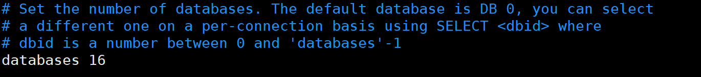


```sh
127.0.0.1:6379> select 1   # 切换数据库
OK
127.0.0.1:6379[1]> dbsize # 查看db大小
(integer) 0

127.0.0.1:6379[1]> select 0
OK
127.0.0.1:6379> keys *
1) "mylist"
2) "myhash"
3) "counter:__rand_int__"
4) "key:__rand_int__"
127.0.0.1:6379> flushdb  # 清空当前数据库
OK
127.0.0.1:6379> keys *
(empty array)
127.0.0.1:6379[3]> select 1
OK
127.0.0.1:6379[1]> keys *
1) "j"
127.0.0.1:6379[1]> select 7
OK
127.0.0.1:6379[7]> flushall  # 清空所有数据库数据
OK
127.0.0.1:6379[7]> select 1
OK
127.0.0.1:6379[1]> keys *
(empty array)


```

### redis的单线程与多线程

明白 Redis是很快的,官方表示，Redis是基于**内存操作**,CPU==不是== Redis性能瓶颈, Redis的瓶颈是根据机器的内存和网络带宽,既然可以使用单线程来实现,就使用单线程了!所有就使用了单线程了! ==6.0变成了多线程==

Redis是C语言写的,官方提供的数据为100000的QPS,完全不比同样是使用key-vale的 Memcache差！

Redis为什么单线程还这么快?

- 1、误区1:高性能的服务器一定是多线程的?

- 2、误区2:多线程(CPU上下文会切換!)一定比单线程效率高!

  速度：CPU>内存>硬盘的速度要有所了解!

核心：redis是将所有的数据**全部放在内存中**的,所以说使用单线程去操作效率就是最高的,多线程(CPU上下文会切换:耗操作!!!),对于内存系统来说,如果没有上下文切换效率就是最高的!多次读写都是在一个CPU上的,在内存情况这个就是最佳的方案!


# 五大数据类型

​		Redis是一个开源(BSD许可)的,内存中的数据结构存储系统,它可以用作==数据库==、==缓存==和==消息中间件MQ==。

​        它支持多种类型的数据结构,如字符串( strings),散列( hashes),列表(ists),集合(sets),有序集合( sorted sets)与范围查询,bitmaps, hyperloglogs和地理空间( geospatial)索引半径查询。 

​		Redis内置了复制( replication),LUA脚本(Luascripting),LRU驱动事件( LRU eviction),事务( transactions)和不同级别的磁盘持久化( persistence),并通过Reds哨兵( Sentinel)和自动分区( Cluster)提供高可用性( high availability)。


## String

- set	get 	move  type
- select   移动到数据库
- keys *
- expire   ttl   设置过期时间（秒）

```sh
[root@centos-2 ~]# redis-cli -p 6379
127.0.0.1:6379> mingkeys *
(empty array)
127.0.0.1:6379> set name jing
OK
127.0.0.1:6379> get name  # 获取值
"jing"
127.0.0.1:6379> set age 19
OK
127.0.0.1:6379> move name 1 #移动到数据库
(integer) 1
127.0.0.1:6379> keys *
1) "age"
127.0.0.1:6379> select 1
OK
127.0.0.1:6379[1]> keys *
1) "name"
127.0.0.1:6379[1]> expire name 5  # 设置过期时间（秒）
(integer) 1
127.0.0.1:6379[1]> ttl name   # 查看剩余时间
(integer) -2
127.0.0.1:6379[1]> keys *
(empty array)
127.0.0.1:6379[1]> select 0
OK
127.0.0.1:6379> type age  #查看类型
string

```

- append
- strlen
- incr   decr   incrby    decrby

```sh
127.0.0.1:6379> keys *
1) "age"
127.0.0.1:6379> append age memeda
(integer) 8
127.0.0.1:6379> get age
"19memeda"
127.0.0.1:6379> strlen age
(integer) 8
127.0.0.1:6379> exists age  # 返回存在的个数 若 多个 key一起判断 则返回 存在的总数
(integer) 1

127.0.0.1:6379> set views 0
OK
127.0.0.1:6379> incr views  # 自增 1
(integer) 1
127.0.0.1:6379> get views
"1"
127.0.0.1:6379> incr views
(integer) 2
127.0.0.1:6379> incr views
(integer) 3
127.0.0.1:6379> incr views
(integer) 4
127.0.0.1:6379> get views
"4"
127.0.0.1:6379> decr views
(integer) 3
######################################################
# setrange     
# getrange
127.0.0.1:6379> getrange age 1 -1   [start,end]
"9memeda"
127.0.0.1:6379> setrange age 1 --   # 在指定位置修改
(integer) 8
127.0.0.1:6379> get age
"1--emeda"
######################################################
#  setex   设置过期时间
#  setnx  不存在   则设置   不会覆盖掉之前的值
127.0.0.1:6379> setex k1 20 v1  # 设置过期时间
OK
127.0.0.1:6379> ttl k1
(integer) 16
127.0.0.1:6379> set age 1
OK
127.0.0.1:6379> get age
"1"
127.0.0.1:6379> set age 111   # set    会直接覆盖掉之前的值
OK
127.0.0.1:6379> setnx age 1  #不存在   则设置   不会覆盖掉之前的值
(integer) 0
127.0.0.1:6379> get age
"111"

######################################################
#  mset        [key value ...]  设置多个值 
#  mget       [key ...]
# msetnx    [key value ...]  设置多个值 --原子性操作
127.0.0.1:6379> mset k1 v1 k2 v2 k3 v3
OK
127.0.0.1:6379> mget k1 k2 k3
1) "v1"
2) "v2"
3) "v3"
127.0.0.1:6379> mget k1 k2 k4
1) "v1"
2) "v2"
3) (nil)
127.0.0.1:6379> msetnx k1 v1 k4 v4  # 原子性操作
(integer) 0
127.0.0.1:6379> 

######################################################
#对象
set user:1 {name: zhangsan,age:3}
#设置一个user:1对象值为json字符来保存一个对象!
#这里的key是一个巧妙的设计 user: {id} : {filed},如此设计在 Redis中是完全ok了!
127.0.0.1:6379> mset user:1:name zhangsan user:1:age 15
OK
127.0.0.1:6379> mget user:1:name user:1:age
1) "zhangsan"
2) "15"

######################################################
# getset    先get 后 set   
127.0.0.1:6379> keys *
1) "p"
2) "j"
127.0.0.1:6379> getset p newp
"18"
127.0.0.1:6379> get p
"newp"
127.0.0.1:6379> getset po newp
(nil)
127.0.0.1:6379> get po
"newp"

```


## List

```sh
######################################################
# lpush   向左添加
# rpush   向右添加
# lrange  查看
# lpop     左边出栈
# rpop     右边出栈
# lindex   通过下标获取值
# llen       获取list的长度
# lrem   key  count    element 从索引0开始移除
#  ltrim key start stop    截取list
# rpoplpush source destination   将一个列表的元素移动到另一个列表中
从索引1开始移除
127.0.0.1:6379> keys *
(empty array)
127.0.0.1:6379> lpush list 1
(integer) 1
127.0.0.1:6379> lpush list 2
(integer) 2
127.0.0.1:6379> lpush list 3
(integer) 3
127.0.0.1:6379> lrange list 0 -1
1) "3"
2) "2"
3) "1"
127.0.0.1:6379> lrange list 0 0
1) "3"
127.0.0.1:6379> rpush list right
(integer) 4
127.0.0.1:6379> lrange list 0 -1
1) "3"
2) "2"
3) "1"
4) "right"
127.0.0.1:6379> lpop list
"3"
127.0.0.1:6379> rpop list
"right"
127.0.0.1:6379> lrange list 0 -1 
1) "2"
2) "1"
######################################################
127.0.0.1:6379> lindex list 0
"2"
127.0.0.1:6379> lindex list 1
"1"
127.0.0.1:6379> lindex list 2
(nil)
127.0.0.1:6379> llen list
(integer) 2

######################################################
# lrem
127.0.0.1:6379> lpush list 1
(integer) 3
127.0.0.1:6379> lrange list 0 -1
1) "1"
2) "2"
3) "1"
127.0.0.1:6379> lrem list 1 1
(integer) 1
127.0.0.1:6379> lrange list 0 -1
1) "2"
2) "1"

######################################################
#  ltrim key start stop   
127.0.0.1:6379> lrange list 0 -1
1) "4"
2) "3"
3) "2"
4) "1"
127.0.0.1:6379> ltrim list 1 2
OK
127.0.0.1:6379> lrange list 0 -1
1) "3"
2) "2"

######################################################
# rpoplpush source destination   将一个列表的元素移动到另一个列表中
127.0.0.1:6379> lrange list 0 -1
1) "4"
2) "3"
3) "2"
4) "1"
127.0.0.1:6379> rpoplpush list newlist
"1"
127.0.0.1:6379> lrange list 0 -1
1) "4"
2) "3"
3) "2"
127.0.0.1:6379> lrange newlist 0 -1
1) "1"

######################################################
# lset key index element  更新一个已经存在的列表的 指定下标的值
127.0.0.1:6379> exists list
(integer) 0
127.0.0.1:6379> lset list 0 0
(error) ERR no such key
127.0.0.1:6379> lpush list 0
(integer) 1
127.0.0.1:6379> lset list 0 updateValue
OK
127.0.0.1:6379> lrange list 0 -1
1) "updateValue"

######################################################
# linsert key BEFORE|AFTER pivot element   在 列表指定的 key 之前或者之后插入值 

127.0.0.1:6379> lrange list 0 -1
1) "1"
127.0.0.1:6379> linsert list before 1 b-1
(integer) 2
127.0.0.1:6379> linsert list after 1 aft-1
(integer) 3
127.0.0.1:6379> lrange list 0 -1
1) "b-1"
2) "1"
3) "aft-1"
127.0.0.1:6379> linsert list after 1 1
(integer) 4
127.0.0.1:6379> lrange list 0 -1
1) "b-1"
2) "1"
3) "1"
4) "aft-1"
127.0.0.1:6379> linsert list after 1 aft-2  # 以找到的第一个值为基准 进行插入
(integer) 5
127.0.0.1:6379> lrange list 0 -1
1) "b-1"
2) "1"
3) "aft-2"
4) "1"
5) "aft-1"
127.0.0.1:6379> linsert list before 1 bef-2
(integer) 6
127.0.0.1:6379> lrange list 0 -1
1) "b-1"
2) "bef-2"
3) "1"
4) "aft-2"
5) "1"
6) "aft-1"

```

### 小结

小结

- 实际上是一个==链表==, before Node after,left, right都可以插入值
- 如果key不存在,创建新的链表
- 如果key存在,新增内容
- 如果移除了所有值,空链表,也代表不存在!
- 在两边插入或者改动值,效率最高!中间元素,相对来说效率会低一点

消息排队!消息队列( Push Rpop),栈( Push Pop)

## Set

存储不重复的值

```sh
######################################################
#  sadd key member [member ...]    设置 set的值
#  smembers key								查看set中的所有值   不分顺序
#  sismember key member				判断是否包含某个值

127.0.0.1:6379> sadd set a b c d
(integer) 4
127.0.0.1:6379> smembers set
1) "b"
2) "a"
3) "d"
4) "c"
127.0.0.1:6379> sadd set a    # 插入已经存在的 元素 就会  失败
(integer) 0
127.0.0.1:6379> sadd set A  #区分大小写
(integer) 1
127.0.0.1:6379> smembers set  # 无序
1) "d"
2) "c"
3) "A"
4) "a"
5) "b"
#
127.0.0.1:6379> sismember set a
(integer) 1
127.0.0.1:6379> sismember set M
(integer) 0

######################################################
# srandmember key [count]   	随机产生  
# scard key									查看 set的大小
# srem key member [member ...]  移除

127.0.0.1:6379> srandmember set 1
1) "b"
127.0.0.1:6379> 
127.0.0.1:6379> srandmember set 1
1) "c"
127.0.0.1:6379> srandmember set 1
1) "c"
127.0.0.1:6379> srandmember set 1
1) "A"
127.0.0.1:6379> srandmember set 1
1) "a"
127.0.0.1:6379> scard set
(integer) 5
127.0.0.1:6379> srem set a
(integer) 1
127.0.0.1:6379> smembers set
1) "A"
2) "c"
3) "d"
4) "b"

######################################################
# spop key [count]    随机删除元素

127.0.0.1:6379> smembers set
1) "A"
2) "c"
3) "d"
4) "b"
127.0.0.1:6379> spop set
"d"
127.0.0.1:6379> spop set
"b"
127.0.0.1:6379> smembers set
1) "A"
2) "c"


######################################################
#smove source destination member   移动 set集合中的元素到另一个集合中

127.0.0.1:6379> smembers set
1) "A"
2) "c"
127.0.0.1:6379> sadd set2 1
(integer) 1
127.0.0.1:6379> smove set set2 c
(integer) 1
127.0.0.1:6379> smembers set
1) "A"
127.0.0.1:6379> smembers set2
1) "1"
2) "c"

######################################################
# set 的集合运算   差 并 交
#sdiff        key [key ...]
#sunions  key [key ...]
#sinter     key [key ...]
127.0.0.1:6379> sadd s1 a b c
(integer) 3
127.0.0.1:6379> sadd s2 c d e
(integer) 3
127.0.0.1:6379> sdiff s1 s2
1) "a"
2) "b"
127.0.0.1:6379> sunion s1 s2
1) "a"
2) "b"
3) "c"
4) "e"
5) "d"
127.0.0.1:6379> sinter s1 s2
1) "c"

```

共同关注,共同爱好,二度好友,推荐好友

微博,A用户将所有关注的人放在一个set集合中!将它的粉丝也放在一个集合中，然后做交集就是共同的xx。

## Hash

Map集合, key-map!时候这个值是一个map集合!本质和 String类型没有太大区别,还是一个简单的 key-value!

```sh
######################################################
# hset key field value [field value ...]  
# hgetall key										获取所有

127.0.0.1:6379> hset hash k1 v1
(integer) 1
127.0.0.1:6379> hget hash k1
"v1"
127.0.0.1:6379> hgetall hash
1) "k1"
2) "v1"

######################################################
# hdel key field [field ...]   					删除指令

127.0.0.1:6379> hgetall hash
1) "k1"
2) "v1"
3) "k2"
4) "v2"
127.0.0.1:6379> hdel hash k1
(integer) 1
127.0.0.1:6379> hgetall hash
1) "k2"
2) "v2"
######################################################
# hexists key field
127.0.0.1:6379> hgetall hash
1) "k2"
2) "v2"
127.0.0.1:6379> hlen hash
(integer) 1
127.0.0.1:6379> hexists hash k1
(integer) 0
127.0.0.1:6379> hexists hash k2
(integer) 1

######################################################
# hvals key    获取 指定key的 所有 field
#hkeys key    获取 指定key的 所有 value

127.0.0.1:6379> hkeys hash
1) "k2"
127.0.0.1:6379> hvals hash
1) "v2"

######################################################
# hincrby key field increment

127.0.0.1:6379> hgetall hash
1) "k2"
2) "v2"
3) "k3"
4) "0"
127.0.0.1:6379> hincrby hash k3 1
(integer) 1
127.0.0.1:6379> hgetall hash
1) "k2"
2) "v2"
3) "k3"
4) "1"
127.0.0.1:6379> hdecrby hash k3 1   # 没有decrby
(error) ERR unknown command `hdecrby`, with args beginning with: `hash`, `k3`, `1`, 
127.0.0.1:6379> hincrby hash k3 -3
(integer) -2
127.0.0.1:6379> hgetall hash
1) "k2"
2) "v2"
3) "k3"
4) "-2"

######################################################
# hsetnx key field value   不存在 则 设置成功   存在 则失败

127.0.0.1:6379> hsetnx hash f1 v1
(integer) 1
127.0.0.1:6379> hsetnx hash f1 v1
(integer) 0
```


## Zset(有序集合)

```sh
######################################################
#  zadd key [NX|XX] [GT|LT] [CH] [INCR] score member [score member ...]
#  zrangebyscore key min max [WITHSCORES] [LIMIT offset count]
127.0.0.1:6379> zadd salary 5000 name1
(integer) 1
127.0.0.1:6379> zadd salary 500 name2
(integer) 1
127.0.0.1:6379> zadd salary 50000 name3
(integer) 1
127.0.0.1:6379> zrange salary 0 -1
1) "name2"
2) "name1"
3) "name3"
127.0.0.1:6379> zrangebyscore salary -inf +inf
1) "name2"
2) "name1"
3) "name3"
127.0.0.1:6379> zrangebyscore salary -inf +inf withscores  # 带上 scores信息
1) "name2"
2) "500"
3) "name1"
4) "5000"
5) "name3"
6) "50000"

redis> ZADD myzset 1 "one"
(integer) 1
redis> ZADD myzset 2 "two"
(integer) 1
redis> ZADD myzset 3 "three"
(integer) 1
redis> ZRANGEBYSCORE myzset 1 2     #   1<=X  <=  2
1) "one"
2) "two"
redis> ZRANGEBYSCORE myzset (1 2   #   1<   X  <=  2
1) "two"
redis> ZRANGEBYSCORE myzset (1 (2  #   1<   X  <   2
(empty list or set)

######################################################
#zrem key member [member ...]

127.0.0.1:6379> zrange salary 0 -1
1) "name2"
2) "name1"
3) "name3"
127.0.0.1:6379> zrem salary name2
(integer) 1
127.0.0.1:6379> zrange salary 0 -1
1) "name1"
2) "name3"

######################################################
#  zcard key  返回 数量

127.0.0.1:6379> zcard salary
(integer) 2

######################################################
# zrevrange key start stop [WITHSCORES]   逆序排列

127.0.0.1:6379> zrange salary 0 -1 withscores
1) "name1"
2) "5000"
3) "name3"
4) "50000"
127.0.0.1:6379> zrevrange salary 1 0
(empty array)
127.0.0.1:6379> zrevrange salary +inf -inf
(error) ERR value is not an integer or out of range
127.0.0.1:6379> zrevrange salary 0 -1
1) "name3"
2) "name1"

######################################################
#  zcount key min max   获取区间包含的个数

127.0.0.1:6379> zrange salary 0 -1 withscores
1) "name1"
2) "5000"
3) "name3"
4) "50000"
127.0.0.1:6379> zcount salary 0 1
(integer) 0
127.0.0.1:6379> zcount salary 5000 500000
(integer) 2
127.0.0.1:6379> zcount salary 5000 5000
(integer) 1

```


# 三种特殊数据类型

## geospatial

地理位置

- 朋友的定位
- 附近的人
- 打车距离计算

Redis的Geo在 Redis3.2版本就推出了

```sh
######################################################
#
127.0.0.1:6379> geoadd china 114.30 30.6 wuhan  # 加入 城市的经纬度
(integer) 1
127.0.0.1:6379> geoadd china 112.93 28.23 changsha
(integer) 1
127.0.0.1:6379> georadius china 114 30 50 km  # 查看指定 经纬度  指定半径内的元素
(empty array)
127.0.0.1:6379> georadius china 114 30 500 km
1) "changsha"
2) "wuhan"
127.0.0.1:6379> GEORADIUSBYMEMBER china wuhan 100 km
1) "wuhan"
127.0.0.1:6379> GEORADIUSBYMEMBER china wuhan 200 km
1) "wuhan"
127.0.0.1:6379> GEORADIUSBYMEMBER china wuhan 500 km
1) "changsha"
2) "wuhan"
127.0.0.1:6379> GEOPOS china wuhan   #查看指定 城市的信息
1) 1) "114.30000096559524536"
   2) "30.59999916504646222"
127.0.0.1:6379> geodist china wuhan changsha  # 计算两者之间的距离
"295130.6265"
127.0.0.1:6379> geodist china wuhan changsha ft
"968276.3338"
127.0.0.1:6379> geodist china wuhan changsha km # 以 公里度量
"295.1306"
```

GEO底层的实现原理其实就是Zset!我们可以使用==Zset命令==来操作geo,进行查看或删除均可

## Hyperloglog


### 什么是基数？

- A{1,3,5,7,8,7}
- B{1,3,5,7,18}
- 基数(不重复的元素)={1，3，5，7}可以接受误差

### 简介

- Reds2.8.9版本就更新了 Hyperloglog数据结构!

- Redis Hyperloglog基数统计的算法
- 优点:占用的内存是==固定==,2^64不同的元素的基数,只需要耗费==12KB内存==!如果要从内存角度来比较的话

**网页的UV(一个人访问一个网站多次,但是还是算作一个人!)**

传统的方式,set保存用户的id,然后就可以统计set中的元素数量作为标准判断

这个方式如果保存大量的用户id,就会比较麻烦!我们的目的是为了计数,而不是保存用户id;


### 使用场景--网站计数

```sh
######################################################
# PFADD key element [element ...]						 添加元素
# PFCOUNT key [key ...]   										可以合并计数
# PFMERGE destkey sourcekey [sourcekey ...]	   	  合并两者

127.0.0.1:6379> pfadd p1 1 2 3
(integer) 1
127.0.0.1:6379> PFCOUNT p1
(integer) 3
127.0.0.1:6379> PFADD p2 3 4 5
(integer) 1
127.0.0.1:6379> PFCOUNT p1 p2
(integer) 5
127.0.0.1:6379> PFMERGE p3 p1 p2
OK
127.0.0.1:6379> PFCOUNT p3
(integer) 5
```

如果==允许容错==,那么一定可以使用 Hyperloglog!

如果==不==允许容错,就使用set或者自己的数据类型即可


## bitmap

**位存储**

使用场景

- 统计用户信息,活跃,不活跃!
- 登录、未登录!打卡,365打卡!两个状态的,都可以使用 Bitmaps

Bitmaps位图,数据结构!都是操作二进制位来进行记录,就只有0和1两个状态!

- 例：365天=365bt1字节=8bt46个字节左右!

```sh
127.0.0.1:6379> SETBIT bit 0 1
(integer) 0
127.0.0.1:6379> SETBIT bit 2 0
(integer) 0
127.0.0.1:6379> SETBIT bit 1 1
(integer) 0
127.0.0.1:6379> SETBIT bit 3 0
(integer) 0
127.0.0.1:6379> SETBIT bit 4 0
(integer) 0
127.0.0.1:6379> SETBIT bit 5 0
(integer) 0
127.0.0.1:6379> SETBIT bit 6 0
(integer) 0
127.0.0.1:6379> GETBIT bit 5  # 查看某一天是否打卡
(integer) 0
127.0.0.1:6379> BITCOUNT bit  #统计所有打卡的次数
(integer) 2
127.0.0.1:6379> SETBIT bit 0 0 # 设置
(integer) 1
127.0.0.1:6379> BITCOUNT bit
(integer) 1

```

# 事务

Redis事务本质:一组命令的集合!—个事务中的所有命令都会被序列化,在事务执行过程的中,会按照顺序执行!

一次性、顺序性、排他性!

执行一些列的命令

---------队列 set   set    set     执行 --------------

Redis事务==没有隔离级别==的概念!

所有的命令在事务中,并没有直接被执行!只有发起执行命令 `Exec` 的时候才会执行!

Redis**单条命令式保存原子性**的,但是**事务不保证原子性**

redis的事务:

- 开启事务( multi)
- 命令入队( 正常执行后 queued)
- 执行事务（exec）

```sh
######################################################
#
127.0.0.1:6379> multi   # 开启事务
OK
127.0.0.1:6379(TX)> set k1 va  # 入队列
QUEUED
127.0.0.1:6379(TX)> set k2 v2
QUEUED
127.0.0.1:6379(TX)> get k2
QUEUED
127.0.0.1:6379(TX)> set k3 v3
QUEUED
127.0.0.1:6379(TX)> EXEC  #执行事务
1) OK
2) OK
3) "v2"
4) OK


######################################################
#  取消事务   未执行 
127.0.0.1:6379> multi 
OK
127.0.0.1:6379(TX)> set k1 v1
QUEUED
127.0.0.1:6379(TX)> set k2 v2
QUEUED
127.0.0.1:6379(TX)> set k3 v3
QUEUED
127.0.0.1:6379(TX)> DISCARD
OK
127.0.0.1:6379> get k1
(nil)
127.0.0.1:6379> 

```

## 编译型异常

代码有问题!命令有错!事务中**所有的命令都不会被执行**

```sh
127.0.0.1:6379> multi 
OK
127.0.0.1:6379(TX)> set k1 v1
QUEUED
127.0.0.1:6379(TX)> setm k2 v2
(error) ERR unknown command `setm`, with args beginning with: `k2`, `v2`, 
127.0.0.1:6379(TX)> set k3 v3
QUEUED
127.0.0.1:6379(TX)> exec
(error) EXECABORT Transaction discarded because of previous errors.
127.0.0.1:6379> get k3
(nil)
127.0.0.1:6379> 

```

## 运行时异常

> ## ==运行时异常(1/0)==,如果事务队列中存在语法性,那么执行命令的时候,其他命令是可以正常执行的,错误命令抛出异常!

```sh
127.0.0.1:6379> keys *
(empty array)
127.0.0.1:6379> multi
OK
127.0.0.1:6379(TX)> set k1 v1
QUEUED
127.0.0.1:6379(TX)> incr k1
QUEUED
127.0.0.1:6379(TX)> set k2 v3
QUEUED
127.0.0.1:6379(TX)> exec
1) OK
2) (error) ERR value is not an integer or out of range
3) OK
127.0.0.1:6379> get k1
"v1"
127.0.0.1:6379> get k2
"v3"

```

## 监控!  Watch 

### 应用——可以**实现乐观锁**

- 悲观锁:·很悲观,认为什么时候都会出问题,无论做什么都会加锁
- 乐观锁:·很乐观,认为什么时候都不会出问题,所以不会上锁!更新数据的时候去判断一下,在此期间是否有人修改过这个数据
  - 获取 **version**
  - 更新的时候比较 version,若不变，则进行更新操纵

Redis测监视测试

 ```sh
######################################################
# 正常情况   使用 watch 监视值   
127.0.0.1:6379> set money 100
OK
127.0.0.1:6379> set out 0
OK
127.0.0.1:6379> watch money  # 开启监视
OK
127.0.0.1:6379> multi
OK
127.0.0.1:6379(TX)> DECRBY money 20
QUEUED
127.0.0.1:6379(TX)> INCRBY out 20
QUEUED
127.0.0.1:6379(TX)> exec
1) (integer) 80
2) (integer) 20
127.0.0.1:6379> 

######################################################
#   模拟多线程情况  在  一个线程操作时 ， 另一个线程对同一个值进行了修改 则当前的操作将会失败
127.0.0.1:6379> set money 100
OK
127.0.0.1:6379> set out 0
OK
127.0.0.1:6379> watch money
OK
127.0.0.1:6379> multi
OK
127.0.0.1:6379(TX)> DECRBY money 20
QUEUED
127.0.0.1:6379(TX)> INCRBY out 20   # 在exec执行之前，开启另一个线程  对同一个值进行操作
QUEUED
127.0.0.1:6379(TX)> exec 					# 此时操作失败
(nil)
127.0.0.1:6379> 

127.0.0.1:6379> UNWATCH   			 # 解锁命令
OK


[root@centos-2 ~]# redis-cli			# 开启另一个线程  对同一个值进行操作
127.0.0.1:6379> get money
"80"
127.0.0.1:6379> get money
"100"
127.0.0.1:6379> set money 1000
OK
127.0.0.1:6379> 

 ```

测试多线程修改值,使用 watch可以当做 redis的**乐观锁**操作!

# Jedis

我们要**使用Java来操作Redis**,知其然并知其所以然,授人以渔!学习不能急躁,慢慢来会很快!

## 什么是Jedis

 是 Redis官方推荐的==java连接开发工具==!使用ava操作 Redis**中间件**!如果你要使用java操作 redis,那么一定要对Jedis十分的熟悉!


测试连接

```sh
# 1.创建一个空的工程
# 2.创建一个maven 模块
# 3.导入Jedis依赖 和 json 依赖
<dependencies>
        <!-- https://mvnrepository.com/artifact/redis.clients/jedis -->
        <dependency>
            <groupId>redis.clients</groupId>
            <artifactId>jedis</artifactId>
            <version>3.5.2</version>
        </dependency>

        <!-- 导入 fastjson-->
        <dependency>
            <groupId>com.alibaba</groupId>
            <artifactId>fastjson</artifactId>
            <version>1.2.59</version>
        </dependency>
    </dependencies>
######################################################
#  4. 在 window上 开启 redis-server服务
[15308] 21 Apr 09:47:19.422 # Warning: no config file specified, using the default config. In order to specify a config file use D:\2021.5.10-java\java\env\redis\env\redis-server.exe /path/to/redis.conf

      _.-``    `.  `_.  ''-._           Redis 3.2.100 (00000000/0) 64 bit
  .-`` .-```.  ```\/    _.,_ ''-._
 (    '      ,       .-`  | `,    )     Running in standalone mode
 |`-._`-...-` __...-.``-._|'` _.-'|     Port: 6379
 |    `-._   `._    /     _.-'    |     PID: 15308
  `-._    `-._  `-./  _.-'    _.-'
 |`-._`-._    `-.__.-'    _.-'_.-'|
 |    `-._`-._        _.-'_.-'    |           http://redis.io
[15308] 21 Apr 09:47:19.434 # Server started, Redis version 3.2.100
[15308] 21 Apr 09:47:19.456 * DB loaded from disk: 0.021 seconds
[15308] 21 Apr 09:47:19.456 * The server is now ready to accept connections on port 6379


######################################################
# 5.编写测试的 java程序
public class 测试连接 {
    public static void main(String[] args) {
        Jedis jedis = new Jedis("127.0.0.1", 6379);
        String ping = jedis.ping();
        System.out.println(ping);
    }
}

# 6.控制台结果输出
D:\2021.5.10-java\java\Javainstall\jdk1.8\bin\java.exe "-javaagent:D:\newsoft\IntelliJ IDEA 2018.3.3\lib\idea_rt.jar=52301:D:\newsoft\IntelliJ IDEA 2018.3.3\bin" -Dfile.encoding=UTF-8 -classpath ...2.6.2.jar;D:\LocalRepository\com\alibaba\fastjson\1.2.59\fastjson-1.2.59.jar 测试连接
PONG


######################################################
#    如何  连接到 本机开启的 虚拟机上？
C:\Users\Administrator>curl ipinfo.io
{
  "ip": "112.67.105.80",
  "city": "Haikou",
  "region": "Hainan",
  "country": "CN",
  "loc": "20.0458,110.3417",
  "org": "AS4134 CHINANET-BACKBONE",
  "timezone": "Asia/Shanghai",
  "readme": "https://ipinfo.io/missingauth"
}
```

## 测试事务

```java
package ppppp;

import com.alibaba.fastjson.JSONObject;
import redis.clients.jedis.Jedis;
import redis.clients.jedis.Response;
import redis.clients.jedis.Transaction;

/**
 * @author lppppp
 * @create 2021-04-21 10:11
 */
public class TxTest {
    public static void main(String[] args) {
        Jedis jedis = new Jedis("127.0.0.1", 6379);

        jedis.flushDB();
        JSONObject jsonObject = new JSONObject();
        jsonObject.put("k1", "v1");
        jsonObject.put("k2", "v2");

        String s = jsonObject.toJSONString();
        Transaction multi = jedis.multi();
        try {
            Response<String> user1 = multi.set("user1", s);
            Response<String> user2 = multi.set("user2", s);
            // 模拟 出现异常
            int i = 1/0;
            multi.exec();
        } catch (Exception e) {
            multi.discard();
            e.printStackTrace();
        } finally {
            String user1 = jedis.get("user1");
            String user2 = jedis.get("user2");
            System.out.println(user1);
            System.out.println(user2);
            jedis.close();
        }
    }
}
// 正常结果
{"k1":"v1","k2":"v2"}
{"k1":"v1","k2":"v2"}


// 异常时的结果
java.lang.ArithmeticException: / by zero
	at ppppp.TxTest.main(TxTest.java:29)
null
null

```

# Spring Boot 整合

- Spring Boot操作数据: spring-data jpa jdbc mongodb redis
- Spring data也是和 Springboot齐名的项目!
- 说明:在 Spring Boot2.x之后,原来使用的 Redis被替换为了 **lettuce**
- jedis:采用的直连,多个线程操作的话,==是不安全的==,如果想要避免不安全的,使用 jedis pool连接池!更像 `BOI `模式
- lettuce:采用netty,实例可以再多个线程中进行共享,==不存在线程不安全==的情况!可以减少线程数据了,更像 `NOI `模式整合测试一下

创建一个springboot项目，加入 `nosql`中的 redis

查看配置文件的源码

## 测试redis

```java
# 1.打开本地的 redis-server.exe

# 2. 在test中加入以下测试文件
@SpringBootTest
class DemoApplicationTests {


    @Autowired
    private RedisTemplate redisTemplate;

    @Test
    void contextLoads() {

        // redisTemplate 操作不同的数据类型，api和我们的指令是一样的
        // opsForValue 操作字符串 类似String
        // opsForList 操作List 类似List
        // opsForHah

        // 除了基本的操作，我们常用的方法都可以直接通过redisTemplate操作，比如事务和基本的CRUD

        // 获取连接对象
        //RedisConnection connection = redisTemplate.getConnectionFactory().getConnection();
        //connection.flushDb();
        //connection.flushAll();

        redisTemplate.opsForValue().set("mykey","kuangshen");
        System.out.println(redisTemplate.opsForValue().get("mykey"));
    }

    #3. 出现乱码  原因  默认的序列化为 jdk序列化
    @Nullable
    private RedisSerializer keySerializer = null;
    @Nullable
    private RedisSerializer valueSerializer = null;
    @Nullable
    private RedisSerializer hashKeySerializer = null;
    @Nullable
    private RedisSerializer hashValueSerializer = null; 
    
    # 默认的序列化方式是jdk序列化
    if (this.defaultSerializer == null) {
            this.defaultSerializer = new JdkSerializationRedisSerializer(this.classLoader != null ? this.classLoader : this.getClass().getClassLoader());
        }
```


### 序列化

```java
#1. 创建pojo对象
@AllArgsConstructor
@Data
@NoArgsConstructor

public class User {
    private String name;
    private int age;
}

# 2.编写测试类，要进行序列化 无法直接将类作为 value 进行保存
@Test
    public  void T_k() throws JsonProcessingException {
        User user = new User("静静", 18);
//        将对象转化为 json
        String suser = new ObjectMapper().writeValueAsString(user);

        redisTemplate.opsForValue().set("user",suser);
        System.out.println(redisTemplate.opsForValue().get("user"));
    //     {"name":"静静","age":18}
    }

# 3.第二种序列化的方式
    将pojo对象 实现 Serialization 接口
@AllArgsConstructor
@Data
@NoArgsConstructor

public class User implements Serializable {
    private String name;
    private int age;
}

 @Test
    public  void T_k() throws JsonProcessingException {
        User user = new User("静静", 18);
        redisTemplate.opsForValue().set("user",user);
        System.out.println(redisTemplate.opsForValue().get("user"));
    }
```

### 解决key的乱码问题

```java
# 1. 编写自定义的redis配置类 
@Configuration
public class RedisConfig {
    @Bean
    public RedisTemplate<String, Object> redisTemplate(RedisConnectionFactory redisConnectionFactory) throws UnknownHostException {
        // 将template 泛型设置为 <String, Object>
        RedisTemplate<String, Object> template = new RedisTemplate();
        // 连接工厂，不必修改
        template.setConnectionFactory(redisConnectionFactory);
        /*
         * 序列化设置
         */
        // key、hash的key 采用 String序列化方式
        template.setKeySerializer(RedisSerializer.string());
        template.setHashKeySerializer(RedisSerializer.string());
        // value、hash的value 采用 Jackson 序列化方式
        template.setValueSerializer(RedisSerializer.json());
        template.setHashValueSerializer(RedisSerializer.json());
        template.afterPropertiesSet();

        return template;
    }
}    

# 2.导入当前配置的redis
    @Autowired
    @Qualifier("redisTemplate")
    private RedisTemplate redisTemplate;
    @Test
    public  void T_k() throws JsonProcessingException {
        User user = new User("静静", 18);
        redisTemplate.opsForValue().set("user",user);
        System.out.println(redisTemplate.opsForValue().get("user"));
    }
# 3.乱码问题解决
127.0.0.1:6379> keys *
1) "\xac\xed\x00\x05t\x00\x05"
127.0.0.1:6379> flushdb
OK
127.0.0.1:6379> keys *
(empty list or set)
127.0.0.1:6379> keys *
1) "user"
127.0.0.1:6379>
```

## 写一个Redis工具类

  直接用RedisTemplate操作Redis，需要很多行代码，因此直接封装好一个RedisUtils，这样写代码更方便点。这个RedisUtils交给Spring容器实例化，使用时直接注解注入。

​    工具类代码如下：


```java
package com.example.demo.util;
import org.springframework.beans.factory.annotation.Autowired;
import org.springframework.data.redis.connection.DataType;
import org.springframework.data.redis.core.Cursor;
import org.springframework.data.redis.core.ScanOptions;
import org.springframework.data.redis.core.StringRedisTemplate;
import org.springframework.data.redis.core.ZSetOperations.TypedTuple;
import org.springframework.stereotype.Component;

import java.util.Collection;
import java.util.Date;
import java.util.List;
import java.util.Map;
import java.util.Map.Entry;
import java.util.Set;
import java.util.concurrent.TimeUnit;

/**
 * Redis工具类*/
@Component
public final class RedisUtil {
    @Autowired
    private StringRedisTemplate redisTemplate;


    public void setRedisTemplate(StringRedisTemplate redisTemplate) {
        this.redisTemplate = redisTemplate;
    }

    public StringRedisTemplate getRedisTemplate() {
        return this.redisTemplate;
    }

    /** -------------------key相关操作--------------------- */

    /**
     * 删除key
     *
     * @param key
     */
    public void delete(String key) {
        redisTemplate.delete(key);
    }

    /**
     * 批量删除key
     *
     * @param keys
     */
    public void delete(Collection<String> keys) {
        redisTemplate.delete(keys);
    }

    /**
     * 序列化key
     *
     * @param key
     * @return
     */
    public byte[] dump(String key) {
        return redisTemplate.dump(key);
    }

    /**
     * 是否存在key
     *
     * @param key
     * @return
     */
    public Boolean hasKey(String key) {
        return redisTemplate.hasKey(key);
    }

    /**
     * 设置过期时间
     *
     * @param key
     * @param timeout
     * @param unit
     * @return
     */
    public Boolean expire(String key, long timeout, TimeUnit unit) {
        return redisTemplate.expire(key, timeout, unit);
    }

    /**
     * 设置过期时间
     *
     * @param key
     * @param date
     * @return
     */
    public Boolean expireAt(String key, Date date) {
        return redisTemplate.expireAt(key, date);
    }

    /**
     * 查找匹配的key
     *
     * @param pattern
     * @return
     */
    public Set<String> keys(String pattern) {
        return redisTemplate.keys(pattern);
    }

    /**
     * 将当前数据库的 key 移动到给定的数据库 db 当中
     *
     * @param key
     * @param dbIndex
     * @return
     */
    public Boolean move(String key, int dbIndex) {
        return redisTemplate.move(key, dbIndex);
    }

    /**
     * 移除 key 的过期时间，key 将持久保持
     *
     * @param key
     * @return
     */
    public Boolean persist(String key) {
        return redisTemplate.persist(key);
    }

    /**
     * 返回 key 的剩余的过期时间
     *
     * @param key
     * @param unit
     * @return
     */
    public Long getExpire(String key, TimeUnit unit) {
        return redisTemplate.getExpire(key, unit);
    }

    /**
     * 返回 key 的剩余的过期时间
     *
     * @param key
     * @return
     */
    public Long getExpire(String key) {
        return redisTemplate.getExpire(key);
    }

    /**
     * 从当前数据库中随机返回一个 key
     *
     * @return
     */
    public String randomKey() {
        return redisTemplate.randomKey();
    }

    /**
     * 修改 key 的名称
     *
     * @param oldKey
     * @param newKey
     */
    public void rename(String oldKey, String newKey) {
        redisTemplate.rename(oldKey, newKey);
    }

    /**
     * 仅当 newkey 不存在时，将 oldKey 改名为 newkey
     *
     * @param oldKey
     * @param newKey
     * @return
     */
    public Boolean renameIfAbsent(String oldKey, String newKey) {
        return redisTemplate.renameIfAbsent(oldKey, newKey);
    }

    /**
     * 返回 key 所储存的值的类型
     *
     * @param key
     * @return
     */
    public DataType type(String key) {
        return redisTemplate.type(key);
    }

    /** -------------------string相关操作--------------------- */

    /**
     * 设置指定 key 的值
     * @param key
     * @param value
     */
    public void set(String key, String value) {
        redisTemplate.opsForValue().set(key, value);
    }

    /**
     * 获取指定 key 的值
     * @param key
     * @return
     */
    public String get(String key) {
        return redisTemplate.opsForValue().get(key);
    }

    /**
     * 返回 key 中字符串值的子字符
     * @param key
     * @param start
     * @param end
     * @return
     */
    public String getRange(String key, long start, long end) {
        return redisTemplate.opsForValue().get(key, start, end);
    }

    /**
     * 将给定 key 的值设为 value ，并返回 key 的旧值(old value)
     *
     * @param key
     * @param value
     * @return
     */
    public String getAndSet(String key, String value) {
        return redisTemplate.opsForValue().getAndSet(key, value);
    }

    /**
     * 对 key 所储存的字符串值，获取指定偏移量上的位(bit)
     *
     * @param key
     * @param offset
     * @return
     */
    public Boolean getBit(String key, long offset) {
        return redisTemplate.opsForValue().getBit(key, offset);
    }

    /**
     * 批量获取
     *
     * @param keys
     * @return
     */
    public List<String> multiGet(Collection<String> keys) {
        return redisTemplate.opsForValue().multiGet(keys);
    }

    /**
     * 设置ASCII码, 字符串'a'的ASCII码是97, 转为二进制是'01100001', 此方法是将二进制第offset位值变为value
     *
     * @param key 位置
     * @param value
     *            值,true为1, false为0
     * @return
     */
    public boolean setBit(String key, long offset, boolean value) {
        return redisTemplate.opsForValue().setBit(key, offset, value);
    }

    /**
     * 将值 value 关联到 key ，并将 key 的过期时间设为 timeout
     *
     * @param key
     * @param value
     * @param timeout
     *            过期时间
     * @param unit
     *            时间单位, 天:TimeUnit.DAYS 小时:TimeUnit.HOURS 分钟:TimeUnit.MINUTES
     *            秒:TimeUnit.SECONDS 毫秒:TimeUnit.MILLISECONDS
     */
    public void setEx(String key, String value, long timeout, TimeUnit unit) {
        redisTemplate.opsForValue().set(key, value, timeout, unit);
    }

    /**
     * 只有在 key 不存在时设置 key 的值
     *
     * @param key
     * @param value
     * @return 之前已经存在返回false,不存在返回true
     */
    public boolean setIfAbsent(String key, String value) {
        return redisTemplate.opsForValue().setIfAbsent(key, value);
    }

    /**
     * 用 value 参数覆写给定 key 所储存的字符串值，从偏移量 offset 开始
     *
     * @param key
     * @param value
     * @param offset
     *            从指定位置开始覆写
     */
    public void setRange(String key, String value, long offset) {
        redisTemplate.opsForValue().set(key, value, offset);
    }

    /**
     * 获取字符串的长度
     *
     * @param key
     * @return
     */
    public Long size(String key) {
        return redisTemplate.opsForValue().size(key);
    }

    /**
     * 批量添加
     *
     * @param maps
     */
    public void multiSet(Map<String, String> maps) {
        redisTemplate.opsForValue().multiSet(maps);
    }

    /**
     * 同时设置一个或多个 key-value 对，当且仅当所有给定 key 都不存在
     *
     * @param maps
     * @return 之前已经存在返回false,不存在返回true
     */
    public boolean multiSetIfAbsent(Map<String, String> maps) {
        return redisTemplate.opsForValue().multiSetIfAbsent(maps);
    }

    /**
     * 增加(自增长), 负数则为自减
     *
     * @param key
     * @return
     */
    public Long incrBy(String key, long increment) {
        return redisTemplate.opsForValue().increment(key, increment);
    }

    /**
     *
     * @param key
     * @return
     */
    public Double incrByFloat(String key, double increment) {
        return redisTemplate.opsForValue().increment(key, increment);
    }

    /**
     * 追加到末尾
     *
     * @param key
     * @param value
     * @return
     */
    public Integer append(String key, String value) {
        return redisTemplate.opsForValue().append(key, value);
    }

    /** -------------------hash相关操作------------------------- */

    /**
     * 获取存储在哈希表中指定字段的值
     *
     * @param key
     * @param field
     * @return
     */
    public Object hGet(String key, String field) {
        return redisTemplate.opsForHash().get(key, field);
    }

    /**
     * 获取所有给定字段的值
     *
     * @param key
     * @return
     */
    public Map<Object, Object> hGetAll(String key) {
        return redisTemplate.opsForHash().entries(key);
    }

    /**
     * 获取所有给定字段的值
     *
     * @param key
     * @param fields
     * @return
     */
    public List<Object> hMultiGet(String key, Collection<Object> fields) {
        return redisTemplate.opsForHash().multiGet(key, fields);
    }

    public void hPut(String key, String hashKey, String value) {
        redisTemplate.opsForHash().put(key, hashKey, value);
    }

    public void hPutAll(String key, Map<String, String> maps) {
        redisTemplate.opsForHash().putAll(key, maps);
    }

    /**
     * 仅当hashKey不存在时才设置
     *
     * @param key
     * @param hashKey
     * @param value
     * @return
     */
    public Boolean hPutIfAbsent(String key, String hashKey, String value) {
        return redisTemplate.opsForHash().putIfAbsent(key, hashKey, value);
    }

    /**
     * 删除一个或多个哈希表字段
     *
     * @param key
     * @param fields
     * @return
     */
    public Long hDelete(String key, Object... fields) {
        return redisTemplate.opsForHash().delete(key, fields);
    }

    /**
     * 查看哈希表 key 中，指定的字段是否存在
     *
     * @param key
     * @param field
     * @return
     */
    public boolean hExists(String key, String field) {
        return redisTemplate.opsForHash().hasKey(key, field);
    }

    /**
     * 为哈希表 key 中的指定字段的整数值加上增量 increment
     *
     * @param key
     * @param field
     * @param increment
     * @return
     */
    public Long hIncrBy(String key, Object field, long increment) {
        return redisTemplate.opsForHash().increment(key, field, increment);
    }

    /**
     * 为哈希表 key 中的指定字段的整数值加上增量 increment
     *
     * @param key
     * @param field
     * @param delta
     * @return
     */
    public Double hIncrByFloat(String key, Object field, double delta) {
        return redisTemplate.opsForHash().increment(key, field, delta);
    }

    /**
     * 获取所有哈希表中的字段
     *
     * @param key
     * @return
     */
    public Set<Object> hKeys(String key) {
        return redisTemplate.opsForHash().keys(key);
    }

    /**
     * 获取哈希表中字段的数量
     *
     * @param key
     * @return
     */
    public Long hSize(String key) {
        return redisTemplate.opsForHash().size(key);
    }

    /**
     * 获取哈希表中所有值
     *
     * @param key
     * @return
     */
    public List<Object> hValues(String key) {
        return redisTemplate.opsForHash().values(key);
    }

    /**
     * 迭代哈希表中的键值对
     *
     * @param key
     * @param options
     * @return
     */
    public Cursor<Entry<Object, Object>> hScan(String key, ScanOptions options) {
        return redisTemplate.opsForHash().scan(key, options);
    }

    /** ------------------------list相关操作---------------------------- */

    /**
     * 通过索引获取列表中的元素
     *
     * @param key
     * @param index
     * @return
     */
    public String lIndex(String key, long index) {
        return redisTemplate.opsForList().index(key, index);
    }

    /**
     * 获取列表指定范围内的元素
     *
     * @param key
     * @param start
     *            开始位置, 0是开始位置
     * @param end
     *            结束位置, -1返回所有
     * @return
     */
    public List<String> lRange(String key, long start, long end) {
        return redisTemplate.opsForList().range(key, start, end);
    }

    /**
     * 存储在list头部
     *
     * @param key
     * @param value
     * @return
     */
    public Long lLeftPush(String key, String value) {
        return redisTemplate.opsForList().leftPush(key, value);
    }

    /**
     *
     * @param key
     * @param value
     * @return
     */
    public Long lLeftPushAll(String key, String... value) {
        return redisTemplate.opsForList().leftPushAll(key, value);
    }

    /**
     *
     * @param key
     * @param value
     * @return
     */
    public Long lLeftPushAll(String key, Collection<String> value) {
        return redisTemplate.opsForList().leftPushAll(key, value);
    }

    /**
     * 当list存在的时候才加入
     *
     * @param key
     * @param value
     * @return
     */
    public Long lLeftPushIfPresent(String key, String value) {
        return redisTemplate.opsForList().leftPushIfPresent(key, value);
    }

    /**
     * 如果pivot存在,再pivot前面添加
     *
     * @param key
     * @param pivot
     * @param value
     * @return
     */
    public Long lLeftPush(String key, String pivot, String value) {
        return redisTemplate.opsForList().leftPush(key, pivot, value);
    }

    /**
     *
     * @param key
     * @param value
     * @return
     */
    public Long lRightPush(String key, String value) {
        return redisTemplate.opsForList().rightPush(key, value);
    }

    /**
     *
     * @param key
     * @param value
     * @return
     */
    public Long lRightPushAll(String key, String... value) {
        return redisTemplate.opsForList().rightPushAll(key, value);
    }

    /**
     *
     * @param key
     * @param value
     * @return
     */
    public Long lRightPushAll(String key, Collection<String> value) {
        return redisTemplate.opsForList().rightPushAll(key, value);
    }

    /**
     * 为已存在的列表添加值
     *
     * @param key
     * @param value
     * @return
     */
    public Long lRightPushIfPresent(String key, String value) {
        return redisTemplate.opsForList().rightPushIfPresent(key, value);
    }

    /**
     * 在pivot元素的右边添加值
     *
     * @param key
     * @param pivot
     * @param value
     * @return
     */
    public Long lRightPush(String key, String pivot, String value) {
        return redisTemplate.opsForList().rightPush(key, pivot, value);
    }

    /**
     * 通过索引设置列表元素的值
     *
     * @param key
     * @param index
     *            位置
     * @param value
     */
    public void lSet(String key, long index, String value) {
        redisTemplate.opsForList().set(key, index, value);
    }

    /**
     * 移出并获取列表的第一个元素
     *
     * @param key
     * @return 删除的元素
     */
    public String lLeftPop(String key) {
        return redisTemplate.opsForList().leftPop(key);
    }

    /**
     * 移出并获取列表的第一个元素， 如果列表没有元素会阻塞列表直到等待超时或发现可弹出元素为止
     *
     * @param key
     * @param timeout
     *            等待时间
     * @param unit
     *            时间单位
     * @return
     */
    public String lBLeftPop(String key, long timeout, TimeUnit unit) {
        return redisTemplate.opsForList().leftPop(key, timeout, unit);
    }

    /**
     * 移除并获取列表最后一个元素
     *
     * @param key
     * @return 删除的元素
     */
    public String lRightPop(String key) {
        return redisTemplate.opsForList().rightPop(key);
    }

    /**
     * 移出并获取列表的最后一个元素， 如果列表没有元素会阻塞列表直到等待超时或发现可弹出元素为止
     *
     * @param key
     * @param timeout
     *            等待时间
     * @param unit
     *            时间单位
     * @return
     */
    public String lBRightPop(String key, long timeout, TimeUnit unit) {
        return redisTemplate.opsForList().rightPop(key, timeout, unit);
    }

    /**
     * 移除列表的最后一个元素，并将该元素添加到另一个列表并返回
     *
     * @param sourceKey
     * @param destinationKey
     * @return
     */
    public String lRightPopAndLeftPush(String sourceKey, String destinationKey) {
        return redisTemplate.opsForList().rightPopAndLeftPush(sourceKey,
                destinationKey);
    }

    /**
     * 从列表中弹出一个值，将弹出的元素插入到另外一个列表中并返回它； 如果列表没有元素会阻塞列表直到等待超时或发现可弹出元素为止
     *
     * @param sourceKey
     * @param destinationKey
     * @param timeout
     * @param unit
     * @return
     */
    public String lBRightPopAndLeftPush(String sourceKey, String destinationKey,
                                        long timeout, TimeUnit unit) {
        return redisTemplate.opsForList().rightPopAndLeftPush(sourceKey,
                destinationKey, timeout, unit);
    }

    /**
     * 删除集合中值等于value得元素
     *
     * @param key
     * @param index
     *            index=0, 删除所有值等于value的元素; index>0, 从头部开始删除第一个值等于value的元素;
     *            index<0, 从尾部开始删除第一个值等于value的元素;
     * @param value
     * @return
     */
    public Long lRemove(String key, long index, String value) {
        return redisTemplate.opsForList().remove(key, index, value);
    }

    /**
     * 裁剪list
     *
     * @param key
     * @param start
     * @param end
     */
    public void lTrim(String key, long start, long end) {
        redisTemplate.opsForList().trim(key, start, end);
    }

    /**
     * 获取列表长度
     *
     * @param key
     * @return
     */
    public Long lLen(String key) {
        return redisTemplate.opsForList().size(key);
    }

    /** --------------------set相关操作-------------------------- */

    /**
     * set添加元素
     *
     * @param key
     * @param values
     * @return
     */
    public Long sAdd(String key, String... values) {
        return redisTemplate.opsForSet().add(key, values);
    }

    /**
     * set移除元素
     *
     * @param key
     * @param values
     * @return
     */
    public Long sRemove(String key, Object... values) {
        return redisTemplate.opsForSet().remove(key, values);
    }

    /**
     * 移除并返回集合的一个随机元素
     *
     * @param key
     * @return
     */
    public String sPop(String key) {
        return redisTemplate.opsForSet().pop(key);
    }

    /**
     * 将元素value从一个集合移到另一个集合
     *
     * @param key
     * @param value
     * @param destKey
     * @return
     */
    public Boolean sMove(String key, String value, String destKey) {
        return redisTemplate.opsForSet().move(key, value, destKey);
    }

    /**
     * 获取集合的大小
     *
     * @param key
     * @return
     */
    public Long sSize(String key) {
        return redisTemplate.opsForSet().size(key);
    }

    /**
     * 判断集合是否包含value
     *
     * @param key
     * @param value
     * @return
     */
    public Boolean sIsMember(String key, Object value) {
        return redisTemplate.opsForSet().isMember(key, value);
    }

    /**
     * 获取两个集合的交集
     *
     * @param key
     * @param otherKey
     * @return
     */
    public Set<String> sIntersect(String key, String otherKey) {
        return redisTemplate.opsForSet().intersect(key, otherKey);
    }

    /**
     * 获取key集合与多个集合的交集
     *
     * @param key
     * @param otherKeys
     * @return
     */
    public Set<String> sIntersect(String key, Collection<String> otherKeys) {
        return redisTemplate.opsForSet().intersect(key, otherKeys);
    }

    /**
     * key集合与otherKey集合的交集存储到destKey集合中
     *
     * @param key
     * @param otherKey
     * @param destKey
     * @return
     */
    public Long sIntersectAndStore(String key, String otherKey, String destKey) {
        return redisTemplate.opsForSet().intersectAndStore(key, otherKey,
                destKey);
    }

    /**
     * key集合与多个集合的交集存储到destKey集合中
     *
     * @param key
     * @param otherKeys
     * @param destKey
     * @return
     */
    public Long sIntersectAndStore(String key, Collection<String> otherKeys,
                                   String destKey) {
        return redisTemplate.opsForSet().intersectAndStore(key, otherKeys,
                destKey);
    }

    /**
     * 获取两个集合的并集
     *
     * @param key
     * @param otherKeys
     * @return
     */
    public Set<String> sUnion(String key, String otherKeys) {
        return redisTemplate.opsForSet().union(key, otherKeys);
    }

    /**
     * 获取key集合与多个集合的并集
     *
     * @param key
     * @param otherKeys
     * @return
     */
    public Set<String> sUnion(String key, Collection<String> otherKeys) {
        return redisTemplate.opsForSet().union(key, otherKeys);
    }

    /**
     * key集合与otherKey集合的并集存储到destKey中
     *
     * @param key
     * @param otherKey
     * @param destKey
     * @return
     */
    public Long sUnionAndStore(String key, String otherKey, String destKey) {
        return redisTemplate.opsForSet().unionAndStore(key, otherKey, destKey);
    }

    /**
     * key集合与多个集合的并集存储到destKey中
     *
     * @param key
     * @param otherKeys
     * @param destKey
     * @return
     */
    public Long sUnionAndStore(String key, Collection<String> otherKeys,
                               String destKey) {
        return redisTemplate.opsForSet().unionAndStore(key, otherKeys, destKey);
    }

    /**
     * 获取两个集合的差集
     *
     * @param key
     * @param otherKey
     * @return
     */
    public Set<String> sDifference(String key, String otherKey) {
        return redisTemplate.opsForSet().difference(key, otherKey);
    }

    /**
     * 获取key集合与多个集合的差集
     *
     * @param key
     * @param otherKeys
     * @return
     */
    public Set<String> sDifference(String key, Collection<String> otherKeys) {
        return redisTemplate.opsForSet().difference(key, otherKeys);
    }

    /**
     * key集合与otherKey集合的差集存储到destKey中
     *
     * @param key
     * @param otherKey
     * @param destKey
     * @return
     */
    public Long sDifference(String key, String otherKey, String destKey) {
        return redisTemplate.opsForSet().differenceAndStore(key, otherKey,
                destKey);
    }

    /**
     * key集合与多个集合的差集存储到destKey中
     *
     * @param key
     * @param otherKeys
     * @param destKey
     * @return
     */
    public Long sDifference(String key, Collection<String> otherKeys,
                            String destKey) {
        return redisTemplate.opsForSet().differenceAndStore(key, otherKeys,
                destKey);
    }

    /**
     * 获取集合所有元素
     *
     * @param key
     * @return
     */
    public Set<String> setMembers(String key) {
        return redisTemplate.opsForSet().members(key);
    }

    /**
     * 随机获取集合中的一个元素
     *
     * @param key
     * @return
     */
    public String sRandomMember(String key) {
        return redisTemplate.opsForSet().randomMember(key);
    }

    /**
     * 随机获取集合中count个元素
     *
     * @param key
     * @param count
     * @return
     */
    public List<String> sRandomMembers(String key, long count) {
        return redisTemplate.opsForSet().randomMembers(key, count);
    }

    /**
     * 随机获取集合中count个元素并且去除重复的
     *
     * @param key
     * @param count
     * @return
     */
    public Set<String> sDistinctRandomMembers(String key, long count) {
        return redisTemplate.opsForSet().distinctRandomMembers(key, count);
    }

    /**
     *
     * @param key
     * @param options
     * @return
     */
    public Cursor<String> sScan(String key, ScanOptions options) {
        return redisTemplate.opsForSet().scan(key, options);
    }

    /**------------------zSet相关操作--------------------------------*/

    /**
     * 添加元素,有序集合是按照元素的score值由小到大排列
     *
     * @param key
     * @param value
     * @param score
     * @return
     */
    public Boolean zAdd(String key, String value, double score) {
        return redisTemplate.opsForZSet().add(key, value, score);
    }

    /**
     *
     * @param key
     * @param values
     * @return
     */
    public Long zAdd(String key, Set<TypedTuple<String>> values) {
        return redisTemplate.opsForZSet().add(key, values);
    }

    /**
     *
     * @param key
     * @param values
     * @return
     */
    public Long zRemove(String key, Object... values) {
        return redisTemplate.opsForZSet().remove(key, values);
    }

    /**
     * 增加元素的score值，并返回增加后的值
     *
     * @param key
     * @param value
     * @param delta
     * @return
     */
    public Double zIncrementScore(String key, String value, double delta) {
        return redisTemplate.opsForZSet().incrementScore(key, value, delta);
    }

    /**
     * 返回元素在集合的排名,有序集合是按照元素的score值由小到大排列
     *
     * @param key
     * @param value
     * @return 0表示第一位
     */
    public Long zRank(String key, Object value) {
        return redisTemplate.opsForZSet().rank(key, value);
    }

    /**
     * 返回元素在集合的排名,按元素的score值由大到小排列
     *
     * @param key
     * @param value
     * @return
     */
    public Long zReverseRank(String key, Object value) {
        return redisTemplate.opsForZSet().reverseRank(key, value);
    }

    /**
     * 获取集合的元素, 从小到大排序
     *
     * @param key
     * @param start
     *            开始位置
     * @param end
     *            结束位置, -1查询所有
     * @return
     */
    public Set<String> zRange(String key, long start, long end) {
        return redisTemplate.opsForZSet().range(key, start, end);
    }

    /**
     * 获取集合元素, 并且把score值也获取
     *
     * @param key
     * @param start
     * @param end
     * @return
     */
    public Set<TypedTuple<String>> zRangeWithScores(String key, long start,
                                                    long end) {
        return redisTemplate.opsForZSet().rangeWithScores(key, start, end);
    }

    /**
     * 根据Score值查询集合元素
     *
     * @param key
     * @param min
     *            最小值
     * @param max
     *            最大值
     * @return
     */
    public Set<String> zRangeByScore(String key, double min, double max) {
        return redisTemplate.opsForZSet().rangeByScore(key, min, max);
    }

    /**
     * 根据Score值查询集合元素, 从小到大排序
     *
     * @param key
     * @param min
     *            最小值
     * @param max
     *            最大值
     * @return
     */
    public Set<TypedTuple<String>> zRangeByScoreWithScores(String key,
                                                           double min, double max) {
        return redisTemplate.opsForZSet().rangeByScoreWithScores(key, min, max);
    }

    /**
     *
     * @param key
     * @param min
     * @param max
     * @param start
     * @param end
     * @return
     */
    public Set<TypedTuple<String>> zRangeByScoreWithScores(String key,
                                                           double min, double max, long start, long end) {
        return redisTemplate.opsForZSet().rangeByScoreWithScores(key, min, max,
                start, end);
    }

    /**
     * 获取集合的元素, 从大到小排序
     *
     * @param key
     * @param start
     * @param end
     * @return
     */
    public Set<String> zReverseRange(String key, long start, long end) {
        return redisTemplate.opsForZSet().reverseRange(key, start, end);
    }

    /**
     * 获取集合的元素, 从大到小排序, 并返回score值
     *
     * @param key
     * @param start
     * @param end
     * @return
     */
    public Set<TypedTuple<String>> zReverseRangeWithScores(String key,
                                                           long start, long end) {
        return redisTemplate.opsForZSet().reverseRangeWithScores(key, start,
                end);
    }

    /**
     * 根据Score值查询集合元素, 从大到小排序
     *
     * @param key
     * @param min
     * @param max
     * @return
     */
    public Set<String> zReverseRangeByScore(String key, double min,
                                            double max) {
        return redisTemplate.opsForZSet().reverseRangeByScore(key, min, max);
    }

    /**
     * 根据Score值查询集合元素, 从大到小排序
     *
     * @param key
     * @param min
     * @param max
     * @return
     */
    public Set<TypedTuple<String>> zReverseRangeByScoreWithScores(
            String key, double min, double max) {
        return redisTemplate.opsForZSet().reverseRangeByScoreWithScores(key,
                min, max);
    }

    /**
     *
     * @param key
     * @param min
     * @param max
     * @param start
     * @param end
     * @return
     */
    public Set<String> zReverseRangeByScore(String key, double min,
                                            double max, long start, long end) {
        return redisTemplate.opsForZSet().reverseRangeByScore(key, min, max,
                start, end);
    }

    /**
     * 根据score值获取集合元素数量
     *
     * @param key
     * @param min
     * @param max
     * @return
     */
    public Long zCount(String key, double min, double max) {
        return redisTemplate.opsForZSet().count(key, min, max);
    }

    /**
     * 获取集合大小
     *
     * @param key
     * @return
     */
    public Long zSize(String key) {
        return redisTemplate.opsForZSet().size(key);
    }

    /**
     * 获取集合大小
     *
     * @param key
     * @return
     */
    public Long zZCard(String key) {
        return redisTemplate.opsForZSet().zCard(key);
    }

    /**
     * 获取集合中value元素的score值
     *
     * @param key
     * @param value
     * @return
     */
    public Double zScore(String key, Object value) {
        return redisTemplate.opsForZSet().score(key, value);
    }

    /**
     * 移除指定索引位置的成员
     *
     * @param key
     * @param start
     * @param end
     * @return
     */
    public Long zRemoveRange(String key, long start, long end) {
        return redisTemplate.opsForZSet().removeRange(key, start, end);
    }

    /**
     * 根据指定的score值的范围来移除成员
     *
     * @param key
     * @param min
     * @param max
     * @return
     */
    public Long zRemoveRangeByScore(String key, double min, double max) {
        return redisTemplate.opsForZSet().removeRangeByScore(key, min, max);
    }

    /**
     * 获取key和otherKey的并集并存储在destKey中
     *
     * @param key
     * @param otherKey
     * @param destKey
     * @return
     */
    public Long zUnionAndStore(String key, String otherKey, String destKey) {
        return redisTemplate.opsForZSet().unionAndStore(key, otherKey, destKey);
    }

    /**
     *
     * @param key
     * @param otherKeys
     * @param destKey
     * @return
     */
    public Long zUnionAndStore(String key, Collection<String> otherKeys,
                               String destKey) {
        return redisTemplate.opsForZSet()
                .unionAndStore(key, otherKeys, destKey);
    }

    /**
     * 交集
     *
     * @param key
     * @param otherKey
     * @param destKey
     * @return
     */
    public Long zIntersectAndStore(String key, String otherKey,
                                   String destKey) {
        return redisTemplate.opsForZSet().intersectAndStore(key, otherKey,
                destKey);
    }

    /**
     * 交集
     *
     * @param key
     * @param otherKeys
     * @param destKey
     * @return
     */
    public Long zIntersectAndStore(String key, Collection<String> otherKeys,
                                   String destKey) {
        return redisTemplate.opsForZSet().intersectAndStore(key, otherKeys,
                destKey);
    }

    /**
     *
     * @param key
     * @param options
     * @return
     */
    public Cursor<TypedTuple<String>> zScan(String key, ScanOptions options) {
        return redisTemplate.opsForZSet().scan(key, options);
    }
}


```

#### 工具类的使用

```java
//    测试redisUtil
    @Autowired
    RedisUtil redisUtil;
    @Test
    public  void T_redisUtil(){
        redisUtil.set("k","v");
        redisUtil.set("k2","v2");
        String k = redisUtil.get("k");
        System.out.println(k); // v
       
    }
```

# Redis.conf

## 容量单位不区分大小写

```shell
# Note on units: when memory size is needed, it is possible to specify
# it in the usual form of 1k 5GB 4M and so forth:
#
# 1k => 1000 bytes
# 1kb => 1024 bytes
# 1m => 1000000 bytes
# 1mb => 1024*1024 bytes
# 1g => 1000000000 bytes
# 1gb => 1024*1024*1024 bytes
#
# units are case insensitive so 1GB 1Gb 1gB are all the same.

```

## 可以使用 include 组合多个配置问题

```sh
################################## INCLUDES ###################################

# Include one or more other config files here.  This is useful if you
# have a standard template that goes to all Redis servers but also need
# to customize a few per-server settings.  Include files can include
# other files, so use this wisely.
#
# Note that option "include" won't be rewritten by command "CONFIG REWRITE"
# from admin or Redis Sentinel. Since Redis always uses the last processed
# line as value of a configuration directive, you'd better put includes
# at the beginning of this file to avoid overwriting config change at runtime.
#
# If instead you are interested in using includes to override configuration
# options, it is better to use include as the last line.
#
# include /path/to/local.conf
# include /path/to/other.conf
```

## 网络配置

```sh
# IF YOU ARE SURE YOU WANT YOUR INSTANCE TO LISTEN TO ALL THE INTERFACES
# JUST COMMENT OUT THE FOLLOWING LINE.
# ~~~~~~~~~~~~~~~~~~~~~~~~~~~~~~~~~~~~~~~~~~~~~~~~~~~~~~~~~~~~~~~~~~~~~~~~
bind 127.0.0.1 -::1

# Protected mode is a layer of security protection, in order to avoid that
# Redis instances left open on the internet are accessed and exploited.
#
# When protected mode is on and if:
#
# 1) The server is not binding explicitly to a set of addresses using the
#    "bind" directive.
# 2) No password is configured.
#
# The server only accepts connections from clients connecting from the
# IPv4 and IPv6 loopback addresses 127.0.0.1 and ::1, and from Unix domain
# sockets.
#
# By default protected mode is enabled. You should disable it only if
# you are sure you want clients from other hosts to connect to Redis
# even if no authentication is configured, nor a specific set of interfaces
# are explicitly listed using the "bind" directive.
protected-mode yes

# Accept connections on the specified port, default is 6379 (IANA #815344).
# If port 0 is specified Redis will not listen on a TCP socket.
port 6379

```


### 日志输出级别

```sh
# Specify the server verbosity level.
# This can be one of:
# debug (a lot of information, useful for development/testing)
# verbose (many rarely useful info, but not a mess like the debug level)
# notice (moderately verbose, what you want in production probably)
# warning (only very important / critical messages are logged)
loglevel notice
```


## 持久化规则

由于Redis是基于内存的数据库，需要将数据由内存持久化到文件中

持久化方式：

- RDB
- AOF

```bash
################################ SNAPSHOTTING  ################################

# Save the DB to disk.
#
# save <seconds> <changes>
#
# Redis will save the DB if both the given number of seconds and the given
# number of write operations against the DB occurred.
#
# Snapshotting can be completely disabled with a single empty string argument
# as in following example:
#
# save ""
#
# Unless specified otherwise, by default Redis will save the DB:
#   * After 3600 seconds (an hour) if at least 1 key changed
#   * After 300 seconds (5 minutes) if at least 100 keys changed
#   * After 60 seconds if at least 10000 keys changed
#
# You can set these explicitly by uncommenting the three following lines.
#
# save 3600 1
# save 300 100
# save 60 10000

# However if you have setup your proper monitoring of the Redis server
# and persistence, you may want to disable this feature so that Redis will
# continue to work as usual even if there are problems with disk,
# permissions, and so forth.
stop-writes-on-bgsave-error yes   # 持久化出错 是否要继续工作
rdbcompression yes                       # 是否压缩rdb文件,需要消耗一些cpu资源!

rdbchecksum yes							#保存rdb文件的时候,进行错误的检查校验!
dir ./											   #rdb文件保存的目录!
```


## SECURITY 安全

可以在这里设置 redis的密码,默认是没有密码

```sh
127.0.0.1:6379> config get requirepass
1) "requirepass"
2) ""
127.0.0.1:6379> config set requirepass kk
OK
127.0.0.1:6379> config get requirepass
1) "requirepass"
2) "kk"
127.0.0.1:6379> ping
PONG
127.0.0.1:6379> exit
[root@localhost bin]# redis-cli
127.0.0.1:6379> ping
(error) NOAUTH Authentication required.
127.0.0.1:6379> auth kk
OK
127.0.0.1:6379> ping
PONG
127.0.0.1:6379> 

```

## 限制CLIENTS

```bash
maxclients 10000  						   # 设置能连接 redis 客户端数量的最大值为  1w

maxmemory< bytes>					 # redis配置最大的内存容量

maxmemory-policy eviction		#内存到达上限之后的处理策略
1、 volati1e-lru:只对设置了过期时间的key进行LRU(默认值)
2、a1 Ikeys-1ru:删除1ru算法的key
3、 volatile- random:随机删除即将过期key
4、a1 Ikeys- random:随机删除
5、Vo1ati1e-ttl:删除即将过期的
6、 eviction:水不过期,返回错误
```

## APPEND ONLY模式aof配置

```sh
appendonly no  	#默认是不开启aof模式的,默认是使用rdb方式持久化的,在大部分所有的情况下,rdb完全够用!
appendfilename" appendonly.aof"		#持久化的文件的名字
appendfsync always		  #每次修改都会sync。消耗性能
appendfsync everysec	#每秒执行一次sync,可能会丢失这1s的数据
appendfsync no				#不执行sync,这个时候操作系统自己同步数据,速度最快!
```

# Redis持久化

​	面试和工作,持久化都是重点

​	Redis==内存数据库==,如果不将内存中的数据库状态保存到磁盘,那么一旦服务器进程退出,服务器中的数据库状态也会消失。所以 Redis提供了持久化功能!

## RDB(Redis Data Base)

### 什么是RDB

### 工作原理

在进行 RDB 的时候，redis 的主线程是不会做 io 操作的，主线程会调用一个子线程来完成该操作；

- 1.Redis 调用forks。同时拥有父进程和子进程。
- 2.子进程将数据集写入到一个临时 RDB 文件中。

- 3.当子进程完成对新 RDB 文件的写入时，Redis 用新 RDB 文件替换原来的 RDB 文件，并删除旧的 RDB 文件。

这种工作方式使得 Redis 可以从写时复制（copy-on-write）机制中获益(因为是使用子进程进行写操作，而父进程依然可以接收来自客户端的请求。)


### 触发机制

- 1.save的规则满足的情况下,会自动触发rdb规则

- 2.执行 flushall命令,也会触发我们的rdb规则

- 3.退出 redis,也会产生rdb文件!备份就自动生成一个dump

### 恢复rdb文件

1. 只需将rdb文件放置在redis==启动目录==下,redis启动时就会自动检查dump.rdb文件，并恢复数据.

2. 查看安装目录

    ```sh
    127.0.0.1:6379> config get dir
    1) "dir"
    2) "/usr/local/bin"
    ```

    


### save

使用 `save` 命令，会==立刻==对当前内存中的数据进行持久化 ,但是会阻塞，也就是不接受其他操作了；

由于 `save` 命令是同步命令，会占用Redis的主进程。若Redis数据非常多时，`save`命令执行速度会非常慢，阻塞所有客户端的请求。


### flushall命令

Flushall 命令用于==清空整个 Redis 服务器的数据(删除所有数据库的所有 key )==。

`flushall` 命令也会触发持久化 ；

### 触发持久化规则

满足配置条件中的触发条件 ；可以通过配置文件对 Redis 进行设置， 让它在“ N 秒内数据集至少有 M 个改动”这一条件被满足时， 自动进行数据集保存操作。

```sh
# Unless specified otherwise, by default Redis will save the DB:
#   * After 3600 seconds (an hour) if at least 1 key changed
#   * After 300 seconds (5 minutes) if at least 100 keys changed
#   * After 60 seconds if at least 10000 keys changed
#
# You can set these explicitly by uncommenting the three following lines.
#
# save 3600 1
# save 300 100
# save 60 10000
save 60 5

```


### bgsave

`bgsave` 是==异步==进行，进行持久化的时候，`redis` 还可以将继续响应客户端请求 ；


```sh
# 用法
redis 127.0.0.1:6379> BGSAVE
```

**bgsave和save对比**

| 命令   | save               | bgsave                             |
| ------ | ------------------ | ---------------------------------- |
| IO类型 | 同步               | 异步                               |
| 阻塞？ | 是                 | 是（阻塞发生在fock()，通常非常快） |
| 复杂度 | O(n)               | O(n)                               |
| 优点   | 不会消耗额外的内存 | 不阻塞客户端命令                   |
| 缺点   | 阻塞客户端命令     | 需要fock子进程，==消耗内存==       |

### 优缺点

**优点：**

1. 适合大规模的数据恢复
2. 对数据的完整性要求不高

**缺点：**

1. 需要一定的时间间隔进行操作，如果redis意外宕机了，这个最后一次修改的数据就没有了。
2. fork进程的时候，会占用一定的内容空间。

## 持久化AOF

​		将我们所有的命令都记录下来，history，恢复的时候就把这个文件全部再执行一遍,以**日志**的形式来记录每个写的操作，将Redis执行过的所有指令记录下来（读操作不记录），**只许追加文件但不可以改写文件**，redis启动之初会读取该文件重新构建数据，换言之，redis重启的话就根据日志文件的内容将写指令从前到后执行一次以完成数据的恢复工作


### 什么是AOF(**Append Only File**)

 	  快照功能（RDB）并不是非常耐久（durable）： 如果 Redis 因为某些原因而造成故障停机， 那么服务器将丢失最近写入、以及未保存到快照中的那些数据。 从 1.1 版本开始， Redis 增加了一种完全耐久的持久化方式： AOF 持久化。


如果要使用AOF，需要修改配置文件：

```sh
############################# APPEND ONLY MODE ##############################
#1.修改  配置文件 appendonly 为 yes  默认是不开启的，我们需要手动配置，然后重启redis，就可以生效了！
appendonly yes

#2.关闭redis，并重新启动
127.0.0.1:6379> shutdown
not connected> exit
[root@localhost bin]# ls
dump.rdb         redis-check-aof  redis-cli     redis-sentinel
redis-benchmark  redis-check-rdb  redis-config  redis-server
[root@localhost bin]# redis-server redis-config/redis.conf 
[root@localhost bin]# redis-cli
127.0.0.1:6379> 

#3.查看安装目录  发现多了一个  appendonly.aof 文件
[root@localhost bin]# ls
appendonly.aof  redis-benchmark  redis-check-rdb  redis-config    redis-server
dump.rdb        redis-check-aof  redis-cli        redis-sentinel
```

### 文件的修复

```sh
#1.关闭redis
127.0.0.1:6379> shutdown
not connected> exit

#2.手动修改 appendonly.aof ，在文件末尾加上“MMMMMMMMM”模拟文件遭破坏
[root@localhost bin]# vim appendonly.aof 
*2
$6
SELECT
$1
0
*3
$3
set
$2
k1
$2
v1
MMMMMMMMMMMMM

#3.启动redis，发现出现错误
[root@localhost bin]# redis-server redis-config/redis.conf 
[root@localhost bin]# redis-cli
Could not connect to Redis at 127.0.0.1:6379: Connection refused
not connected>

#4.使用 redis-check-aof 进行修复
[root@localhost bin]# redis-check-aof --fix appendonly.aof 
0x              34: Expected prefix '*', got: 'M'
AOF analyzed: size=67, ok_up_to=52, diff=15
This will shrink the AOF from 67 bytes, with 15 bytes, to 52 bytes
Continue? [y/N]: y
Successfully truncated AOF

#5.重启  数据恢复
[root@localhost bin]# redis-server redis-config/redis.conf 
[root@localhost bin]# redis-cli
127.0.0.1:6379> ping
PONG
127.0.0.1:6379> keys *
1) "k1"

```

AOF的配置

```sh
appendonly no  	#默认是不开启aof模式的,默认是使用rdb方式持久化的,在大部分所有的情况下,rdb完全够用!
appendfilename" appendonly.aof"		#持久化的文件的名字
#appendfsync always		  #每次修改都会sync。消耗性能
appendfsync everysec	#每秒执行一次sync,可能会丢失这1s的数据
#appendfsync no				#不执行sync,这个时候操作系统自己同步数据,速度最快!
```


**优点**

1. 每一次修改都会同步，文件的完整性会更加好
2. 每秒同步一次，可能会丢失一秒的数据
3. 从不同步，效率最高

**缺点**

1. 相对于数据文件来说，aof远远大于rdb，修复速度比rdb慢！
2. aof运行效率也要比rdb慢，所以我们redis默认的配置就是rdb持久化

### RDB 和 AOF 对比

|            | RDB    | AOF          |
| ---------- | ------ | ------------ |
| 启动优先级 | 低     | 高           |
| 体积       | 小     | 大           |
| 恢复速度   | 快     | 慢           |
| 数据安全性 | 丢数据 | 根据策略决定 |

1、RDB持久化方式能够在指定的时间间隔内对你的数据迸行快照存储

2、AOF持久化方式记录每次对服务器写的操作,当服务器重启的时候会更新执行这些命令来恢复原始的数据,AOF命令以 Redis协议迫加保存每次写的操作到文件未尾, Redis还能对AOF文件进行后台重写,使得AF文件的体积不至于过大。

3、==只做缓存,如果你只希望你的数据在服务器运行的时候存在,你也可以不使用任何持久化==

4、同时开启两种持久化方式

- 在这种情况下,当 redis重启的时候会优先载入AOF文件来恢复原始的数据,因为在通常凊况下AF文件保存的数据集要比RDB文件保存的数据集要完整。
- RDB的数据不实时,同时使用两者时服务器重启也只会找AOF文件,那要不要只使用ACF呢?作者建议不要,因为RDB更适合用于备份数据库(AOF在不断变化不好备份),快速重启,而且不会有AOF可能潜在的Bug,留着作为一个万一的手段。

5、性能建议

- 因为RDB文件只用作后备用途,建议只在Save上持久化RDB文件,而且只要15分钟备份一次就够了,只保留`save  900  1`这条规则。

- 如果 Enable Aof,好处是在最恶劣情况下也只会丢失不超过两秒数据,启动脚本较简单只load自己的AOF文件就可以了,代价一是带来了持续的O,二是 AOF rewrite的最后将 rewrite过程中产生的新数据写到新文件造成的阻塞几乎是不可避免的。只婁硬盘许可,应该尽量减少 AOF rewrite的频率,AOF重写的基础大小默认值64M太小了,可以设到5G以上,默认超过原大小100%大小重写可以改到适当的数值
- 如果不 Enable aof,仅靠 Master- Slave Replication实现高可用性也可以,能省掉一大笔IO,也减少了 rewrite时带来的系统波动。代价是如果 Master/ Slave同时倒掉,会丢失十几分钟的数据,启动脚本也要比较两个 Master/ Slave中的RDB文件,载入较新的那个,==微博==就是这种架构。

# Redis发布与订阅

Redis 发布订阅(pub/sub)是一种消息通信模式：发送者(pub)发送消息，订阅者(sub)接收消息。


| 序号 | 命令及描述                                                   |
| ---- | ------------------------------------------------------------ |
| 1    | [PSUBSCRIBE pattern [pattern ...\]] 订阅一个或多个符合给定模式的频道。 |
| 2    | [PUBSUB subcommand [argument [argument ...\]]] 查看订阅与发布系统状态。 |
| 3    | [PUBLISH channel message] 将信息发送到指定的频道。           |
| 4    | [PUNSUBSCRIBE [pattern [pattern ...\]]]退订所有给定模式的频道。 |
| 5    | [SUBSCRIBE channel [channel ...\]]订阅给定的一个或多个频道的信息。 |
| 6    | [UNSUBSCRIBE [channel [channel ...\]]] 指退订给定的频道。    |

## 使用

```sh
# 1.订阅
127.0.0.1:6379> SUBSCRIBE c1
Reading messages... (press Ctrl-C to quit)
1) "subscribe"
2) "c1"
3) (integer) 1

# 等待读取推送的信息
1) "message"
2) "c1"
3) "hello"

#2.发布消息 发布后订阅的可以自动收到
127.0.0.1:6379> PUBLISH c1 hello
(integer) 1
127.0.0.1:6379> 

```

## 原理

​		每个 Redis 服务器进程都维持着一个表示服务器状态的 redis.h/redisServer 结构， 结构的pubsub_channels 属性是一个字典， 这个字典就用于保存订阅频道的信息，其中，字典的键为正在被订阅的频道， 而字典的值则是一个链表， 链表中保存了所有订阅这个频道的客户端。


客户端订阅，就被链接到对应频道的==链表==的尾部，退订则就是将客户端节点从链表中移除。

## 缺点

​		如果一个客户端订阅了频道，但自己读取消息的速度却不够快的话，那么不断积压的消息会使redis输出缓冲区的体积变得越来越大，这可能使得redis本身的速度变慢，甚至直接崩溃。
这和数据传输可靠性有关，如果在订阅方断线，那么他将会丢失所有在短线期间发布者发布的消息。

## 应用

消息订阅：公众号订阅，微博关注等等（起始更多是使用消息队列来进行实现）
多人在线聊天室。
稍微复杂的场景，我们就会使用==消息中间件MQ==处理。

# Redis主从复制

## 概念

​		主从复制，是指将一台Redis服务器的数据，复制到其他的Redis服务器。前者称为主节点（Master/Leader）,后者称为从节点（Slave/Follower）， 数据的复制是==单向的==！只能由主节点复制到从节点（主节点以写为主、从节点以读为主）。

​		默认情况下，每台Redis服务器都是主节点，一个主节点可以有0个或者多个从节点，但每个从节点只能由一个主节点。

## 作用

1. 数据冗余：主从复制实现了数据的**热备份**，是持久化之外的一种数据冗余的方式。
2. 故障恢复：当主节点故障时，从节点可以暂时替代主节点提供服务，是一种服务冗余的方式
3. 负载均衡：在主从复制的基础上，配合读写分离，由主节点进行写操作，从节点进行读操作，分担服务器的负载；尤其是在多读少写的场景下，通过多个从节点分担负载，提高并发量。
4. 高可用基石：主从复制还是哨兵和集群能够实施的基础。

## 为什么使用集群

1. 单台服务器难以负载大量的请求
2. 单台服务器故障率高，系统崩坏概率大
3. 单台服务器内存容量有限。

## 环境配置

我们在讲解配置文件的时候，注意到有一个replication模块 (见Redis.conf中第8条)

查看当前库的信息：info replication

```sh
127.0.0.1:6379> info replication
# Replication
role:master  # 角色
connected_slaves:0  # 从机数量
master_failover_state:no-failover
master_replid:fdeb1b235ca19f8dcc8a12e661aacaa00f584d22
master_replid2:0000000000000000000000000000000000000000
master_repl_offset:0
second_repl_offset:-1
repl_backlog_active:0
repl_backlog_size:1048576
repl_backlog_first_byte_offset:0
repl_backlog_histlen:0

```

既然需要启动多个服务，就需要多个配置文件。每个配置文件对应修改以下信息：

- 端口号
- pid文件名
- 日志文件名
- rdb文件名

启动单机多服务集群：

```sh
[root@localhost bin]# ps -ef | grep redis
root      11830      1  0 00:37 ?        00:00:11 redis-server 127.0.0.1:6379
root      12678      1  0 01:47 ?        00:00:00 redis-server 127.0.0.1:6380
root      12684      1  0 01:47 ?        00:00:00 redis-server 127.0.0.1:6381
root      12698  11111  0 01:48 pts/0    00:00:00 grep --color=auto redis
```

### 一主二从配置

==默认情况下，每台Redis服务器都是主节点；==我们一般情况下只用配置从机就好了！

认老大！一主（79）二从（80，81）

使用`SLAVEOF host port`就可以为从机配置主机了。

```sh
# 主机
127.0.0.1:6379> info replication
# Replication
role:master
connected_slaves:2
slave0:ip=127.0.0.1,port=6380,state=online,offset=140,lag=1
slave1:ip=127.0.0.1,port=6381,state=online,offset=140,lag=0
master_failover_state:no-failover
master_replid:df2f644d3e14eeadacf414b56637ae8732f812c6
master_replid2:0000000000000000000000000000000000000000
master_repl_offset:140
second_repl_offset:-1
repl_backlog_active:1
repl_backlog_size:1048576
repl_backlog_first_byte_offset:1
repl_backlog_histlen:140
127.0.0.1:6379> 

# 从机1
127.0.0.1:6380> slaveof 127.0.0.1 6379
OK
127.0.0.1:6380> info replication
# Replication
role:slave
master_host:127.0.0.1
master_port:6379
master_link_status:up
master_last_io_seconds_ago:3
master_sync_in_progress:0
slave_repl_offset:42
slave_priority:100
slave_read_only:1
connected_slaves:0
master_failover_state:no-failover
master_replid:df2f644d3e14eeadacf414b56637ae8732f812c6
master_replid2:0000000000000000000000000000000000000000
master_repl_offset:42
second_repl_offset:-1
repl_backlog_active:1
repl_backlog_size:1048576
repl_backlog_first_byte_offset:1
repl_backlog_histlen:42
127.0.0.1:6380> 

# 从机2
127.0.0.1:6381> SLAVEOF 127.0.0.1 6379
OK
127.0.0.1:6381> INFO replication
# Replication
role:slave
master_host:127.0.0.1
master_port:6379
master_link_status:up
master_last_io_seconds_ago:10
master_sync_in_progress:0
slave_repl_offset:126
slave_priority:100
slave_read_only:1
connected_slaves:0
master_failover_state:no-failover
master_replid:df2f644d3e14eeadacf414b56637ae8732f812c6
master_replid2:0000000000000000000000000000000000000000
master_repl_offset:126
second_repl_offset:-1
repl_backlog_active:1
repl_backlog_size:1048576
repl_backlog_first_byte_offset:85
repl_backlog_histlen:42

```

我们这里是使用命令搭建，是暂时的，==真实开发中应该在从机的配置文件中进行配置，==这样的话是永久的。

### 使用规则

1. 从机只能读，不能写，主机可读可写但是多用于写。

    ```sh
    # 1.从机不可写入
    127.0.0.1:6381> set k1 v1
    (error) READONLY You can't write against a read only replica.
    
    # 2.主机写入
    127.0.0.1:6379> set k1 v1
    OK
    
    # 3.从机可以读取
    127.0.0.1:6380> get k1
    "v1"
    
    ```

    

2. 当主机断电宕机后，默认情况下从机的角色不会发生变化 ，集群中只是失去了写操作，当主机恢复以后，又会连接上从机恢复原状。

3. 当从机断电宕机后，若不使用配置文件配置的从机，再次启动后作为==主机==是无法获取之前主机的数据的，若此时==重新配置==成为从机，又可以获取到主机的所有数据。这里就要提到一个同步原理。

4. 第二条中提到，默认情况下，主机故障后，不会出现新的主机，有两种方式可以产生新的主机：

    - 从机手动执行命令slaveof no one,这样执行以后从机会独立出来成为一个主机

    - 使用哨兵模式（自动选举）

      如果没有老大了，这个时候能不能选择出来一个老大呢？手动！

如果主机断开了连接，我们可以使用`SLAVEOF no one`让自己变成主机！其他的节点就可以手动连接到最新的主节点（手动）！如果这个时候老大修复了，那么就重新连接！

## 哨兵模式

(自动选举老大的模式)

### 概述

​		主从切換技术的方法是:当主服务器宕机后,需要==手动==把一台从服务器切换为主服务器,这就需要人工干预,费事费力,还会造成一段时间内服务不可用。这不是一种推荐的方式,更多时候,我们优先考虑哨兵模式。 

​		Redis从2.8开始正式提供了 Sentinel(哨兵)架构来解决这个问题。谋朝篡位的自动版,能够后台监控主机是否故障,如果故障了根据**投票数**自动**将从库转换为主库**。

​		哨兵模式是一种特殊的模式,首先 Redis提供了哨兵的命令,哨兵是一个独立的**进程**,作为进程,它会独立运行。其原理是**哨兵通过发送命令,等待 Redis服务器响应,从而监控运行的多个 Redis实例**。

### 单机单个哨兵

这里的哨兵有两个作用

- 通过发送命令,让 Redis服务器返回监控其运行状态,包括主服务器和从服务器。

- 当哨兵监测到 master:宕机,会自动将save切换成 master,然后通过**发布订阅模式**通知其他的从服务器,修改配置文件,让它们切换主机。

    

```sh
```

### 多哨兵模式

然而一个哨兵进程对 Redis服务器进行监控,可能会出现问题,为此,我们可以使用多个哨兵进行监控。各个哨兵之间还会进行监控,这样就形成了多哨兵模式


假设主服务器宕机,哨兵1先检测到这个结果,系统并不会马上进行 failover过程,仅仅是哨兵1主观的认为主服务器不可用,这个现象成为**主观下线**。当后面的哨兵也检测到主服务器不可用,并且数量达到一定值时,那么哨兵之间就会进行一次**投票**,投票的结果由一个哨兵发起,进行 failover故障转移操作。切换成功后,就会通过**发布订阅模式**,让各个哨兵把自己监控的从服务器实现切换主机,这个过程称为**客观下线**.

### 模拟

```sh
#1.编写配置文件
vim redis-config/sentinel.conf 
sentinel monitor mymaster 127.0.0.1 6381 1  #数字1表示 ：当一个哨兵主观认为主机断开，就可以客观认为主机故障，然后开始选举新的主机。

#2.	启动哨兵模式
redis-sentinel redis-config/sentinel.conf
#3.将主机6379 shutdown，

#4.从机 6381 开始是 slave
127.0.0.1:6381> info replication
# Replication
role:slave
master_host:127.0.0.1
master_port:6379
master_link_status:up
master_last_io_seconds_ago:1
master_sync_in_progress:0
slave_repl_offset:50760
slave_priority:100
slave_read_only:1
connected_slaves:0
....
#5.从机 6381 在主机下线后 成为了 主机
127.0.0.1:6381> info replication
# Replication
role:master
connected_slaves:1
slave0:ip=127.0.0.1,port=6380,state=online,offset=53100,lag=0
master_failover_state:no-failover
...

```

### 哨兵模式优缺点

#### 优点：

哨兵集群，基于主从复制模式，所有主从复制的优点，它都有主从可以切换，故障可以转移，系统的可用性更好
哨兵模式是主从模式的升级，手动到自动，更加健壮

#### 缺点：

Redis不好在线扩容，集群容量一旦达到上限，在线扩容就十分麻烦
实现哨兵模式的配置其实是很麻烦的，里面有很多配置项

完整的哨兵模式配置文件 sentinel.conf

```sh
# Example sentinel.conf
 
# 哨兵sentinel实例运行的端口 默认26379
port 26379
 
# 哨兵sentinel的工作目录
dir /tmp
 
# 哨兵sentinel监控的redis主节点的 ip port 
# master-name  可以自己命名的主节点名字 只能由字母A-z、数字0-9 、这三个字符".-_"组成。
# quorum 当这些quorum个数sentinel哨兵认为master主节点失联 那么这时 客观上认为主节点失联了
# sentinel monitor <master-name> <ip> <redis-port> <quorum>
sentinel monitor mymaster 127.0.0.1 6379 1
 
# 当在Redis实例中开启了requirepass foobared 授权密码 这样所有连接Redis实例的客户端都要提供密码
# 设置哨兵sentinel 连接主从的密码 注意必须为主从设置一样的验证密码
# sentinel auth-pass <master-name> <password>
sentinel auth-pass mymaster MySUPER--secret-0123passw0rd
 
 
# 指定多少毫秒之后 主节点没有应答哨兵sentinel 此时 哨兵主观上认为主节点下线 默认30秒
# sentinel down-after-milliseconds <master-name> <milliseconds>
sentinel down-after-milliseconds mymaster 30000
 
# 这个配置项指定了在发生failover主备切换时最多可以有多少个slave同时对新的master进行 同步，
这个数字越小，完成failover所需的时间就越长，
但是如果这个数字越大，就意味着越 多的slave因为replication而不可用。
可以通过将这个值设为 1 来保证每次只有一个slave 处于不能处理命令请求的状态。
# sentinel parallel-syncs <master-name> <numslaves>
sentinel parallel-syncs mymaster 1
 
 
 
# 故障转移的超时时间 failover-timeout 可以用在以下这些方面： 
#1. 同一个sentinel对同一个master两次failover之间的间隔时间。
#2. 当一个slave从一个错误的master那里同步数据开始计算时间。直到slave被纠正为向正确的master那里同步数据时。
#3.当想要取消一个正在进行的failover所需要的时间。  
#4.当进行failover时，配置所有slaves指向新的master所需的最大时间。不过，即使过了这个超时，slaves依然会被正确配置为指向master，但是就不按parallel-syncs所配置的规则来了
# 默认三分钟
# sentinel failover-timeout <master-name> <milliseconds>
sentinel failover-timeout mymaster 180000
 
# SCRIPTS EXECUTION
 
#配置当某一事件发生时所需要执行的脚本，可以通过脚本来通知管理员，例如当系统运行不正常时发邮件通知相关人员。
#对于脚本的运行结果有以下规则：
#若脚本执行后返回1，那么该脚本稍后将会被再次执行，重复次数目前默认为10
#若脚本执行后返回2，或者比2更高的一个返回值，脚本将不会重复执行。
#如果脚本在执行过程中由于收到系统中断信号被终止了，则同返回值为1时的行为相同。
#一个脚本的最大执行时间为60s，如果超过这个时间，脚本将会被一个SIGKILL信号终止，之后重新执行。
 
#通知型脚本:当sentinel有任何警告级别的事件发生时（比如说redis实例的主观失效和客观失效等等），将会去调用这个脚本，
#这时这个脚本应该通过邮件，SMS等方式去通知系统管理员关于系统不正常运行的信息。调用该脚本时，将传给脚本两个参数，
#一个是事件的类型，
#一个是事件的描述。
#如果sentinel.conf配置文件中配置了这个脚本路径，那么必须保证这个脚本存在于这个路径，并且是可执行的，否则sentinel无法正常启动成功。
#通知脚本
# sentinel notification-script <master-name> <script-path>
  sentinel notification-script mymaster /var/redis/notify.sh
 
# 客户端重新配置主节点参数脚本
# 当一个master由于failover而发生改变时，这个脚本将会被调用，通知相关的客户端关于master地址已经发生改变的信息。
# 以下参数将会在调用脚本时传给脚本:
# <master-name> <role> <state> <from-ip> <from-port> <to-ip> <to-port>
# 目前<state>总是“failover”,
# <role>是“leader”或者“observer”中的一个。 
# 参数 from-ip, from-port, to-ip, to-port是用来和旧的master和新的master(即旧的slave)通信的
# 这个脚本应该是通用的，能被多次调用，不是针对性的。
# sentinel client-reconfig-script <master-name> <script-path>
sentinel client-reconfig-script mymaster /var/redis/reconfig.sh
```


# Redis缓存穿透和雪崩

Redis缓存的使用,极大的提升了应用程序的性能和效率,特别是数据查询方面。但同时,它也带来了一些问题。其中,最要害的问题,就是数据的一致性问题,从严格意义上讲,这个问题无解。如果**对数据的一致性要求很高**,那么就不能使用缓存。另外的一些典型问题就是,缓存穿透、缓存雪崩和缓存击穿。目前,业界也都有比较流行的解決方案。


## 缓存穿透

概念：缓存穿透的概念很简单,用户想要查询一个数据,发现redis内存数据库没有,也就是缓存没有命中,于是向持久层数据库查询。发现也没有,于是本次査询失败。当**用户很多的时候**,缓存都没有命中,于是都去请求了持久层数据库。这会给持久层数据库造成很大的压力,这时候就相当于出现了缓存穿透。


#### 布隆过滤器

布隆过滤器是一种**数据结构**,对所有可能査询的参数以hash形式存储,在控制层先进行校验,不符合则丟弃,从而避免了对底层存储系统的查询压力


#### 缓存空对象

当存储层不命中后,即使返回的空对象也将其缓存起来,同时会设置一个过期时间,之后再访问这个数据将会从缓存中获取,保护了后端数据源

但是这种方法会存在两个问题

- 1、如果空值能够被缓存起来,这就意味着缓存需要更多的空间存储更多的键,因为这当中可能会有很多的空值的键
- 2、即使对空值设置了过期时间,还是会存在缓存层和存储层的数据会有一段时间窗口的不—致,这对于需要保持一致性的业务会有影响。

## 缓存击穿(量太大,缓存过期)

这里需要注意和缓存穿透的区别,缓存==击穿==,是指==一个key==非常热频点,在不停的扛着大并发,大并发集中对这一个点进行访问,当这个key在**失效的瞬间**,持续的大并发就穿破缓存,**直接请求数据库**,就像在一个屏障上凿开了一个洞。

当某个key在过期的瞬间,有大量的请求并发访问,这类数据一般是热点数据,由于缓存过期,会同时访问数据库来査询最新数据,并且回写缓存,会导使数据库瞬间压力过大

### 解决方案

- 设置热点数据永不过期

从缓存层面来看,没有设置过期时间,所以不会出现热点key过期后产生的问题。

- 加互斥锁分布式锁∶使用分布式锁,保证对于每个key同时只有—个线程去査询后端服务,其他线程没有获得分布式锁的权限,因此只需要等待即可。这种方式将高并发的压力转移到了**分布式锁**,因此对分布式锁的考验很大。


## 缓存雪崩

缓存雪崩,是指在某一个时间段,**缓存集中过期失效**。 Redis宕机!

产生雪崩的原因之一,比如在写本文的时候,马上就要到双十二零点,很快就会迎来一波抢购,这波商品时间比较集中的放入了缓存,假设缓存一个小时。那么到了凌晨一点钟的时候,这批商品的缓存就都过期了。而对这批商品的访问査询,都落到了数据库上,对于数据库而言,就会产生周期性的压力波峰。于是所有的请求都会达到存储层,存储层的调用量会暴増,造成存储层也会挂掉的情况。


其实集中过期,倒不是非常致命,比较致命的缓存雪崩是**缓存服务器某个节点宕机或断网**。因为自然形成的缓存雪崩,一定是在某个时间段集中创建缓存,这个时候,数据库也是可以顶住压力的。无非就是对数据库产生周期性的压力而已。而缓存服务节点的宕机,对数据库服务器造成的压力是**不可预知的**,很有可能瞬间就把数据库压垮。


解决方案

#### redis高可用

这个思想的含义是,既然 redis有可能挂掉,那我多増设几台 redis,这样一台挂掉之后其他的还可以继续工作,其实就是搭建的**集群**

#### 限流降级

这个解决方案的思想是,在缓存失效后,通过加锁或者队列来控制读数据库写缓存的线程数量。比如对某个key只允许一个线程査询数据和写缓存,其他线程等待

#### 数据预热

数据加热的含义就是在正式部署之前,我先把可能的数据先预先访问一遍,这样部分可能大量访问的数据就会加载到缓存中。在即将发生大并发访问前手动触发加载缓存不同的key,设置不同的过期时间,让缓存失效的时间点尽量均匀。


