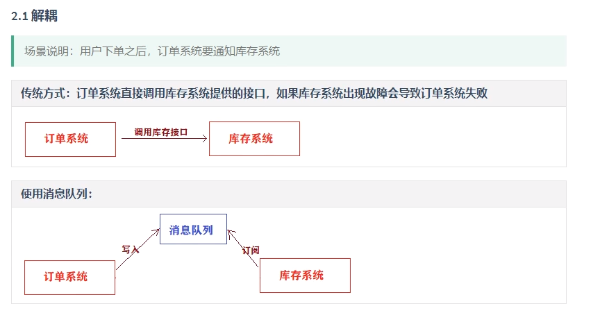

学习时长**27h/30**，2021-05-19——06-17

# 1.RabbitMQ简介

## linux 安装

使用docker安装

```sh
#1.拉取镜像
docker pull rabbitmq:3.7.7-management

#2.查看镜像 id
[root@centos-2 local]# docker images
REPOSITORY   TAG                IMAGE ID       CREATED       SIZE
nginx        <none>             62d49f9bab67   5 weeks ago   133MB
tomcat       latest             bd431ca8553c   5 weeks ago   667MB
rabbitmq     3.7.7-management   2888deb59dfc   2 years ago   149MB

#3.根据下载的镜像创建和启动容器
docker run -d --name rabbitmq3.7.7 -p 5672:5672 -p 15672:15672 -v `pwd`/data:/var/lib/rabbitmq -e RABBITMQ_DEFAULT_USER=admin -e RABBITMQ_DEFAULT_PASS=admin 2888deb59dfc
#参数说明
#说明：
-d 后台运行容器；
--name 指定容器名；
-p 指定服务运行的端口（5672：应用访问端口；15672：控制台Web端口号）；
-v 映射目录或文件；
--hostname  主机名（RabbitMQ的一个重要注意事项是它根据所谓的 “节点名称” 存储数据，默认为主机名）；
-e 指定环境变量；（RABBITMQ_DEFAULT_VHOST：默认虚拟机名；RABBITMQ_DEFAULT_USER：默认的用户名；RABBITMQ_DEFAULT_PASS：默认用户名的密码）

#4.可以使用浏览器打开web管理端：http://Server-IP:15672
用户名和密码为上设置的admin
```

### 1.访问web界面


在浏览器 输入你的`主机Ip:15672`回车即可访问rabbitMq的Web端管理界面，默认用户名和密码都是`guest`，如图出现如下界面代表已经成功了。

### 2.新添加一个账户

默认的`guest` 账户有访问限制，默认只能通过本地网络(如 localhost) 访问，远程网络访问受限，所以在使用时我们一般另外添加用户，例如我们添加一个root用户：

①执行`docker exec -i -t 57d bin/bash`进入到rabbitMq容器内部

```sh
[root@localhost docker]# docker exec -i -t 57d bin/bash
root@3ae75edc48e2:/# 
```

②执行`rabbitmqctl add_user root 123456` 添加用户，用户名为root,密码为123456

```sh
root@3ae75edc48e2:/# rabbitmqctl add_user root 123456 
Adding user "root" ...
```

③执行`rabbitmqctl set_permissions -p / root ".*" ".*" ".*"` 赋予root用户所有权限

```sh
root@3ae75edc48e2:/# rabbitmqctl set_permissions -p / root ".*" ".*" ".*"
Setting permissions for user "root" in vhost "/" ...
```

④执行`rabbitmqctl set_user_tags root administrator`赋予root用户administrator角色

```sh
root@3ae75edc48e2:/# rabbitmqctl set_user_tags root administrator
Setting tags for user "root" to [adminstrator] ...
```

⑤执行`rabbitmqctl list_users`查看所有用户即可看到root用户已经添加成功

```sh
root@3ae75edc48e2:/# rabbitmqctl list_users
Listing users ...
user	tags
guest	[administrator]
root	[administrator]
```

执行`exit`命令，从容器内部退出即可。这时我们使用root账户登录web界面也是可以的。到此，rabbitMq的安装就结束了，接下里就实际代码开发。

 [window下的安装过程](https://www.jianshu.com/p/a2c9a4242508)

## HelloWorld

### 1.启动rabbit服务

打开sbin目录，双击`rabbitmq-server.bat`

在浏览器中，手动创建一个名为 queue-kk的队列


### 2.新建一个demo，导入依赖

```xml
 <!--# 引入依赖-->
        <!-- https://mvnrepository.com/artifact/com.rabbitmq/amqp-client -->
        <dependency>
            <groupId>com.rabbitmq</groupId>
            <artifactId>amqp-client</artifactId>
            <version>5.2.0</version>
        </dependency>
        <!-- https://mvnrepository.com/artifact/junit/junit -->
        <dependency>
            <groupId>junit</groupId>
            <artifactId>junit</artifactId>
            <version>4.12</version>
        </dependency>
```

### 3.演示生产和消费消息

```java
package ppppp.demo;
import com.rabbitmq.client.*;
import org.junit.Test;
import java.io.IOException;
import java.util.concurrent.TimeUnit;
import java.util.concurrent.TimeoutException;

/**
 * @author lppppp
 * @create 2021-05-21 14:58
 */
public class RabbitProducer_Consumer {

    private static final String EXCHANGE_NAME="exchange-kk";
    private static final String ROUTING_KEY="routingkey-kk";
    private static final String QUEUE_NAME="queue-kk";
    private static final String USER_NAME="guest";
    private static final String PASSWORD="guest";
    private static final String IP_ADDRESS="127.0.0.1";
    private static final int PORT=5672; //默认端口号


    @Test
    public void producer() throws IOException, TimeoutException {
        // 创建连接工厂
        ConnectionFactory factory = new ConnectionFactory();
        factory.setHost(IP_ADDRESS);
        factory.setPort(PORT);
        factory.setUsername(USER_NAME);
        factory.setPassword(PASSWORD);
        // 获取新的连接
        Connection connection = factory.newConnection();
        // 创建信道
        Channel channel = connection.createChannel();
        // 创建一个 type="direct"、持久化的、非自动删除的交换器
        channel.exchangeDeclare(EXCHANGE_NAME,"direct",true,false,null);
        // 创建一个持久化、非排他的、非自动删除的交换器
        channel.queueDeclare(QUEUE_NAME,true,false,false,null);
        // 将交换器与队列通过路由键绑定
        channel.queueBind(QUEUE_NAME,EXCHANGE_NAME,ROUTING_KEY);
        String message="hello world";
        // 发送一条持久化的消息
        channel.basicPublish(EXCHANGE_NAME,ROUTING_KEY,MessageProperties.PERSISTENT_TEXT_PLAIN,message.getBytes());
        // 关闭信道
        channel.close();
        // 关闭资源
        connection.close();
    }

    @Test
    public void consumer() throws IOException, TimeoutException, InterruptedException {
        Address[] addresses = {new Address(IP_ADDRESS, PORT)};
        ConnectionFactory factory=new ConnectionFactory();
        factory.setUsername(USER_NAME);
        factory.setPassword(PASSWORD);
        Connection connection = factory.newConnection(addresses);
        final Channel channel = connection.createChannel();
        // 设置客户端最多接收未被ack的消息的个数
        channel.basicQos(64);
        DefaultConsumer consumer = new DefaultConsumer(channel) {
            // 客户端接收后如何处理消息
            @Override
            public void handleDelivery(String consumerTag, Envelope envelope, AMQP.BasicProperties properties, byte[] body) throws IOException {
                System.out.println("rev message:"+new String(body));
                // 确认收到消息
                channel.basicAck(envelope.getDeliveryTag(),false);
            }
        };
        channel.basicConsume(QUEUE_NAME,consumer);
        // 等到回调函数完成后关闭连接
        TimeUnit.SECONDS.sleep(2);
        channel.close();
        connection.close();
    }

}
```

# 2.用户管理

#### 1.用户级别

- 超级管理员administrator,可以登录控制台,查看所有信息,可以对用户和策略进行操作
- 监控者monitoring,可以登录控制台,可以查看节点的相关信息,比如进程数,内存磁盘使用情况
- 策略制定者policymaker ,可以登录控制台,制定策略,但是无法查看节点信息
- 普通管理员 management 仅能登录控制台
- 其他, 无法登录控制台,一般指的是提供者和消费者

#### 2.添加用户（命令模式）

- 添加/配置用户

  ```
  # 插件目录
  ./rabbitmqctl add_user ytao admin123
  ```

- 设置用户权限

  ```
  #设置admin为administrator级别
  ./rabbitmqctl set_user_tags ytao administrator
  ```

  

#### 3.添加用户（web方式）

- 浏览器访问：http://127.0.0.1:15672/ (使用guest guest 登录, guest 具有最高权限,只能在本机登录；先使用命令行创建一个用户)

  

- 添加用户

  

- 为用户分配可以访问的虚拟主机

  - 默认情况下没有任何可以访问的,我们可以添加一个主机(相当于添加一个数据库),然后分配权限

    

  - 创建虚拟主机

    

  - 给指定用户分配虚拟主机

    

  - 设置完成后，回到用户界面确认

    

# 3.消息队列的模式

#### 1.简单模式

> 简单模式就是我们的生产者将消息发到队列,消费者从队列中取消息,一条消息对应一个消费者

#### 2.工作模式

> Work模式就是一条消息可以被多个消费者尝试接收,但是最终**只能有一个消费者**能获取


#### 3.订阅模式

> 一条消息可以被多个消费者同时获取,生产者将消息发送到交换机,消费者将自己对应的队列注册到交换机,当发送消息后所有注册的队列的消费者都可以收到消息


#### 4.路由模式

> 生产者将消息发送到了type为direct模式的交换机，消费者的队列在将自己绑定到路由的时候会给自己绑定一个key，只有消费者发送对应key格式的消息时候队列才会收到消息


#### 5.Topic模式

将消息路由到BindingKey和RountingKey 相匹配的队列中，匹配规则约定：

- RountingKey 和 BindingKey 均为一个点“.”分隔得字符串，被点号分隔得每一段独立的字符串称为一个单词。
- BindingKey 中可以存在两种特殊的字符串“#”和“*”，其中“*”用于匹配一个单词，“#”用于匹配零个或者多个单词。
  - \* (star) can substitute for exactly one word.
  - \# (hash) can substitute for zero or more words.


#### 6.RPC模式

1


# 4.普通Maven应用使用RabbitMQ

- 创建Maven项目

- 添加依赖

  ```pom
  <dependency>
      <groupId>com.rabbitmq</groupId>
      <artifactId>amqp-client</artifactId>
      <version>4.5.0</version>
  </dependency>
  <dependency>
      <groupId>org.slf4j</groupId>
      <artifactId>slf4j-log4j12</artifactId>
      <version>1.7.25</version>
  </dependency>
  <dependency>
      <groupId>org.apache.commons</groupId>
      <artifactId>commons-lang3</artifactId>
      <version>3.3.2</version>
  </dependency>
  
  <!--整合到spring项目需要导入此依赖-->
  <dependency>
      <groupId>org.springframework.amqp</groupId>
      <artifactId>spring-rabbit</artifactId>
      <version>1.7.6.RELEASE</version>
  </dependency>
  ```

  

- 创建日志配置文件 log4j.properties

  ```properties
  log4j.rootLogger=DEBUG,A1 log4j.logger.com.taotao = DEBUG 
  log4j.logger.org.mybatis = DEBUG
  log4j.appender.A1=org.apache.log4j.ConsoleAppender
  log4j.appender.A1.layout=org.apache.log4j.PatternLayout
  log4j.appender.A1.layout.ConversionPattern=%-d{yyyy-MM-dd HH:mm:ss,SSS} [%t] [%c]-[%p] %m%n
  ```

- 创建帮助类

  ```java
  package com.qfedu.utils;
  
  import com.rabbitmq.client.Connection;
  import com.rabbitmq.client.ConnectionFactory;
  
  public class ConnectionUtil {
       public static Connection getConnection() throws Exception {
            //定义连接工厂
            ConnectionFactory factory = new ConnectionFactory();
            // 设置服务地址
            factory.setHost("47.96.11.185");
            //端口
            factory.setPort(5672);
            // 设置账号信息，用户名、密码、vhost
            factory.setVirtualHost("host1");
            factory.setUsername("ytao");
            factory.setPassword("admin123");
            // 通过工程获取连接
            Connection connection = factory.newConnection();
            return connection;
       }
  
  }
  ```

#### 发送消息

```java
package com.qfedu.send;

import com.qfedu.utils.ConnectionUtil;
import com.rabbitmq.client.Channel;
import com.rabbitmq.client.Connection;

public class Send {

    public static void main(String[] argv) throws Exception {
        // 获取到连接以及mq通道
        Connection connection = ConnectionUtil.getConnection();
        // 相当于数据库中的创建连接
        // 从连接中创建通道
        Channel channel = connection.createChannel();
        // 相当于数据库中的 statement
        // 声明（创建）队列,如果存在就不创建,不存在就创建
        // 参数1 队列名,
        // 参数2 durable： 是否持久化, 队列的声明默认是存放到内存中的，如果rabbitmq重启会丢失，如果想重启之后还存在就要使队列持久化，保存到Erlang自带的Mnesia数据库中，当rabbitmq重启之后会读取该数据库
        // 参数3 exclusive：是否排外的，有两个作用，一：当连接关闭时connection.close()该队列是否会自动删除； 二：该队列是否是私有的private，如果不是排外的，可以使用两个消费者都访问同一个队列，没有任何问题，如果是排外 的，会对当前队列加锁，其他通道channel是不能访问的，如果强制访问会报异常： com.rabbitmq.client.ShutdownSignalException: channel error; protocol method: #method<channel.close>(reply-code=405, reply-text=RESOURCE_LOCKED - cannot obtain exclusive access to locked queue 'queue_name' in vhost '/', class-id=50, method-id=20)一般等于true的话 用于一个队列只能有一个消费者来消费的场景
        // 参数4 autoDelete：是否自动删除，当最后一个消费者断开连接之后队列是否自动被删除，可以通过RabbitMQ Management，查看某个队列的消费者数量，当consumers = 0时队列就会自动删除
        // 参数5 arguments：  参数
        //channel.queueDeclare("queue1", false, false, true, null);
        // 消息内容
         String message = "Hello World!";
        // 参数1 交换机,此处无
        // 参数2 发送到哪个队列
        // 参数3 属性
        // 参数4 内容
         channel.basicPublish("", "queue1", null, message.getBytes());
        // 将消息发动到数据库
         System.out.println(" 发送数据 '" + message + "'");
        //关闭通道和连接
         channel.close();
         connection.close();
    }
}
```

#### 消费消息

```java
package com.qfedu.receive;

import com.qfedu.utils.ConnectionUtil;
import com.rabbitmq.client.*;

import java.io.IOException;

public class Receive {

    public static void main(String[] argv) throws Exception {
        //创建一个新的连接
        Connection connection = ConnectionUtil.getConnection();
        //创建一个通道
        Channel channel = connection.createChannel();

        //声明要关注的队列
        //channel.queueDeclare("queue1", false, false, false, null);
        //DefaultConsumer类实现了Consumer接口，通过传入一个频道，
        // 告诉服务器我们需要那个频道的消息，如果频道中有消息，就会执行回调函数handleDelivery
        Consumer consumer = new DefaultConsumer(channel) {
            public void handleDelivery(String consumerTag, Envelope envelope,
                                       AMQP.BasicProperties properties, byte[] body)
                    throws IOException {
                String message = new String(body, "UTF-8");
                System.out.println("Customer Received '" + message + "'");
            }
        };
        //自动回复队列应答 -- RabbitMQ中的消息确认机制
        channel.basicConsume("queue1", true, consumer);
    }
}
```

# 5.在springboot中使用MQ

## 5.1消息生产者

Springbootl应用可以完成自动配置及依赖注入ーー可以通过 Spring.直接提供与MQ的连接对象

### 添加依赖

```xml
 <dependencies>
        <dependency>
            <groupId>org.springframework.boot</groupId>
            <artifactId>spring-boot-starter-amqp</artifactId>
        </dependency>
        <dependency>
            <groupId>org.springframework.boot</groupId>
            <artifactId>spring-boot-starter-thymeleaf</artifactId>
        </dependency>
        <dependency>
            <groupId>org.springframework.boot</groupId>
            <artifactId>spring-boot-starter-web</artifactId>
        </dependency>

        <dependency>
            <groupId>org.projectlombok</groupId>
            <artifactId>lombok</artifactId>
            <optional>true</optional>
        </dependency>
        <dependency>
            <groupId>org.springframework.boot</groupId>
            <artifactId>spring-boot-starter-test</artifactId>
            <scope>test</scope>
        </dependency>
        <dependency>
            <groupId>org.springframework.amqp</groupId>
            <artifactId>spring-rabbit-test</artifactId>
            <scope>test</scope>
        </dependency>
    </dependencies>
```

### 配置`yml`文件

```yaml
server:
  port: 8080
spring:
  application:
    name: producer
  rabbitmq:
    host: 127.0.0.1
    port: 5672
    virtual-host: host1
    username: kk
    password: kk
```

### Controller

```java
package ppppp.producer.controller;

import org.springframework.web.bind.annotation.RequestMapping;
import org.springframework.web.bind.annotation.RestController;
import ppppp.producer.service.MQService;

import javax.annotation.Resource;

@RestController
public class DemoCtroller {
    @Resource
    private MQService mqService;

    @RequestMapping("test")
    public String demo(String msg){
        mqService.sendMsg(msg);
        return "success";
    }
}
```

### **MQService**

```java
package ppppp.producer.service;

import org.springframework.amqp.core.AmqpTemplate;
import org.springframework.stereotype.Service;

import javax.annotation.Resource;

@Service
public class MQService {

    @Resource
    private  AmqpTemplate amqpTemplate;
    public void sendMsg(String msg) {
        if(msg.startsWith("q_")){
            //1. 发送消息到队列
            amqpTemplate.convertAndSend("queue-kk",msg);
        }else if(msg.startsWith("f_")){
            //2. 发送消息到订阅交换机
            amqpTemplate.convertAndSend("ex1","",msg);
        }else if(msg.startsWith("r_")){
            //3. 发送消息到路由交换机
            if(msg.startsWith("r_a")){
                amqpTemplate.convertAndSend("ex2","a",msg);
            }else if(msg.startsWith("r_b")){
                amqpTemplate.convertAndSend("ex2","b",msg);
            }
        }
    }
}
```

### 配置交换机和队列进行绑定

#### 1.直接发送到队列

当浏览器发送的消息为 q_时，只有 queue-kk 能收到消息

#### 2.交换机的订阅模式：

queue3和queue4都与交换机ex1进行了绑定，当浏览器发送的消息为 f_时，queue3和queue4**都能收到消息**


#### 3.路由模式

queue5和queue6都与交换机ex2进行了绑定

- 当浏览器发送的消息为==r_a==时，与之绑定的queue5能收到消息
- 当浏览器发送的消息为 ==r_b==时，与之绑定的queue5能收到消息


## 5.2消息消费者

- 添加依赖

- 配置yml文件

```yaml
server:
  port: 8081
spring:
  application:
    name: consumer
  rabbitmq:
    host: 127.0.0.1
    port: 5672
    virtual-host: host1
    username: kk
    password: kk
```

- 编写 service接受指定队列的消息

  ```java
  package ppppp.consumer.service;
  
  import org.springframework.amqp.rabbit.annotation.RabbitHandler;
  import org.springframework.amqp.rabbit.annotation.RabbitListener;
  import org.springframework.stereotype.Service;
  
  @Service
  @RabbitListener(queues = "queue-kk")
  public class ReceiveMsg {
      @RabbitHandler
      public void receiveMsg(String msg){
          System.out.println("接收到的消息为 ："+msg);
      }
  }
  
  ```

# 6.使用RabbitMQ发送-接收对象

- Rabbitmq是消息队列,发送和接收的都是**字符串/字节数组**类型的消息

## 1.对象序列化实现

> - bean实现序列化接口
> - 要求:传递的对象的**包名、类名、属性名**必须一致(在生产者和消费者中的bean要一致)
> - 

- 消息生产者

  ```java
  package ppppp.mq.service;
  import org.springframework.amqp.core.AmqpTemplate;
  import org.springframework.beans.factory.annotation.Autowired;
  import org.springframework.stereotype.Service;
  import ppppp.mq.bean.Goods;
  
  @Service
  public class MQService {
      @Autowired
      private AmqpTemplate amqpTemplate;
  
      public void sendMsg(Goods goods){
          //消息队列可以发送字符串、字节数组、序列化对象
          amqpTemplate.convertAndSend("","queue-kk",goods);
      }
  }
  ```

  

- 消息消费者

  ```java
  package ppppp.mq.service;
  
  import org.springframework.amqp.rabbit.annotation.RabbitHandler;
  import org.springframework.amqp.rabbit.annotation.RabbitListener;
  import org.springframework.stereotype.Service;
  import ppppp.mq.bean.Goods;
  
  @Service
  @RabbitListener(queues = "queue-kk")
  public class ReceiveController {
  
      @RabbitHandler
      public void receiveMQ(String msg){
          System.out.println("String ---  " + msg);
      }
  
      @RabbitHandler
      public void receiveMQ(byte[] msg){
          System.out.println("byte[] ---  " + msg);
      }
  
      @RabbitHandler
      public void receiveMQ(Goods goods){
          System.out.println("goods ---  " + goods);
      }
  }
  
  ```

使用序列化字节数组

```java
// 1.生产者
package ppppp.mq.service;

import org.springframework.amqp.core.AmqpTemplate;
import org.springframework.beans.factory.annotation.Autowired;
import org.springframework.stereotype.Service;
import org.springframework.util.SerializationUtils;
import ppppp.mq.bean.Goods;

@Service
public class MQService {
    @Autowired
    private AmqpTemplate amqpTemplate;

    public void sendMsg(Goods goods){
        byte[] serializeGoods = SerializationUtils.serialize(goods);
        amqpTemplate.convertAndSend("","queue-kk",serializeGoods);
    }
}

//2.消费者
@RabbitHandler
    public void receiveMQ(byte[] msg){
        //System.out.println("byte[] ---  " + msg);
        Goods goods = (Goods) SerializationUtils.deserialize(msg);
        System.out.println("byte[] ---  " + goods);
    }
```


## 2.JSON字符串实现

> 要去 对象的属性名要一致

- 消息生产者

  ```java
  @Service
  public class SendMsgService {
  
      @Autowired
      private AmqpTemplate amqpTemplate;
  
      public void sendMsg(Goods goods) throws JsonProcessingException {
  
          ObjectMapper mapper=new ObjectMapper();
          String message=mapper.writeValueAsString(goods);
          amqpTemplate.convertAndSend("queue1",message);
  
      }
  }
  ```

  

- 消息消费者

  ```java
  @Service
  @RabbitListener(queues = "queue1")
  public class ReviceMsgService {
  
      @RabbitHandler
      public void receiveMsg(String msg) throws JsonProcessingException {
          ObjectMapper mapper=new ObjectMapper();
          Goods goods=mapper.readValue(msg,Goods.class);
          System.out.println(goods);
      }
  
  }
  ```

# 7、基于Java的交換机与队列创建

>  我们使用消息队列,消息队列和交换机可以通过管理系统完成创建,也可以在应用程序中通过Java代码来完成创建

## Java代码管理

- 交换机、队列创建及绑定

  ```java
  //1. 新建队列
  //参数1：queue - 指定队列的名称
  //参数2：durable - 当前队列是否需要持久化（true）
  //参数3：exclusive - 是否排外（conn.close() - 当前队列会被自动删除，当前队列只能被一个消费者消费）
  //参数4：autoDelete - 如果这个队列没有消费者在消费，队列自动删除
  //参数5：arguments - 指定当前队列的其他信息
  channel.queueDeclare("queue1",true,false,false,null);
  channel.queueDeclare("queue2",true,false,false,null);
  //2. 创建exchange
  //参数1： exchange的名称
  //参数2： 指定exchange的类型  FANOUT - pubsub ,   DIRECT - Routing , TOPIC - Topics
  channel.exchangeDeclare("ex3", BuiltinExchangeType.FANOUT);
  channel.exchangeDeclare("ex4", BuiltinExchangeType.DIRECT);
  
  //3.绑定某一个队列到交换机
  channel.queueBind("queue1","pubsub-exchange","");
  channel.queueBind("queue1","pubsub-exchange","r1");
  channel.queueBind("queue2","pubsub-exchange","r2");
  ```

使用代码成功的创建了交换机和队列


## SpringBoot Java配置管理

- 配置RabbitMQ创建队列（Quence）

  ```java
  @Configuration
  public class RabbitMQConfiguration {
  
      @Bean
      public Queue queue() {
          return new Queue("wfx-quence");
      }
  
      @Bean
      public Queue fanoutQuence() {
          return new Queue("wfx-fanout-quence");
      }
      /**
       * 声明交换机,fanout 类型
       */
      @Bean
      public FanoutExchange fanoutExchange() {
          FanoutExchange fanoutExchange = new FanoutExchange("fanoutExchange");
          return fanoutExchange;
      }
      /**
       * 将队列和交换机绑定
       */
      @Bean
      public Binding bindingFanoutExchange(Queue fanoutQuence, FanoutExchange fanoutExchange) {
          return BindingBuilder.bind(fanoutQuence).to(fanoutExchange);
      }
  
  
      @Bean
      public Queue directQuence1() {
          return new Queue("wfx-direct-quence1");
      }
      @Bean
      public Queue directQuence2() {
          return new Queue("wfx-direct-quence2");
      }
      /**
       * 声明交换机,direct 类型
       */
      @Bean
      public DirectExchange directExchange() {
          DirectExchange directExchange = new DirectExchange("directExchange");
          return directExchange;
      }
      /**
       * 将队列和交换机绑定
       */
      @Bean
      public Binding bindingDirectExchange(Queue directQuence1, DirectExchange directExchange) {
         return BindingBuilder.bind(directQuence1).to(directExchange).with("rk1");
      }
  
      @Bean
      public Binding bindingDirectExchange2(Queue directQuence2, DirectExchange directExchange) {
          return BindingBuilder.bind(directQuence2).to(directExchange).with("rk2");
      }
  
  }
  ```

# 8.消息的可靠性

## 1.RabbitMQ事务

> 当在消息发送过程中添加了事务,处理效率降低几十倍甚至上百倍

```java
//1.开启事务
channel.txSelect();

//2.提交事务
channel.txCommit();

//3.事务回滚
channel.txRollback();
```

## 2.消息确认机制

> 消息确认机制 和 return机制
>
> 消息确认机制:确认消息提供者是否成功发送消息到交换机
>
> return机制:确认消息是否成功的从交换机分发到队列
>
> 

#### 2.1普通Maven项目的消息确认

###### 2.1.1 普通confirm方式

```java
Connection connection = ConnectionUtil.getConnection();
Channel channel = connection.createChannel();
String message = "Hello World!";

//1.开启消息确认
channel.confirmSelect();
//2.发送消息
channel.basicPublish("ex2", "c", null, message.getBytes());
//3.获取确认
boolean b = channel.waitForConfirms();
System.out.println("消息发送"+(b?"成功":"失败"));

channel.close();
connection.close();
```

###### 2.1.2 批量confirm方式

```java
Connection connection = ConnectionUtil.getConnection();
Channel channel = connection.createChannel();
String message = "Hello World!";

//1.开启消息确认
channel.confirmSelect();
//2.发送消息
for (int i=1; i<=10; i++) {
    message += i;
    channel.basicPublish("ex2", "c", null, message.getBytes());
}
//3.批量确认:发送的所有消息中有一个失败就直接全部失败，抛出IO异常
boolean b = channel.waitForConfirms();

channel.close();
connection.close();
```

###### 2.1.3 异步confirm方式

```java
Connection connection = ConnectionUtil.getConnection();
Channel channel = connection.createChannel();
String message = "Hello World!";

//1.开启消息确认
channel.confirmSelect();
//2.发送消息
for (int i=1; i<=10; i++) {
    message += i;
    channel.basicPublish("ex2", "c", null, message.getBytes());
}

//3.开启异步confirm
channel.addConfirmListener(new ConfirmListener() {
    //参数l表示返回的消息标识，参数b表示是否为批量confirm
    public void handleAck(long l, boolean b) throws IOException {
        System.out.println("----消息发送成功");
    }
    public void handleNack(long l, boolean b) throws IOException {
        System.out.println("----消息发送失败");
    }
});

channel.close();
connection.close();
```

###### 2.1.4 return机制

- 发送消息之前开启return机制
- 发送消息时指定mandatory参数为true
- 由于return机制是异步处理，所以在发送消息之后**不关闭**channel

```java
@Test
public void T_异步批量发送消息() throws Exception {
    Connection connection = getConnection();
    Channel channel = connection.createChannel();
    String message = "Hello World!";

    //1.开启消息确认
    channel.confirmSelect();

    //3.开启异步confirm
    channel.addConfirmListener(new ConfirmListener() {
        //参数l表示返回的消息标识，
        //参数b表示是否为批量confirm
        public void handleAck(long l, boolean b) throws IOException {
            System.out.println("----消息发送成功");
        }
        public void handleNack(long l, boolean b) throws IOException {
            System.out.println("----消息发送失败");
        }
    });

    //4.添加return监控
    channel.addReturnListener(new ReturnListener() {
        //消息未分发到队列中时，会执行此语句
        @Override
        public void handleReturn(int replyCode,
                                 String replyText,
                                 String exchange,
                                 String routingKey,
                                 AMQP.BasicProperties properties, byte[] body) throws IOException {
            System.out.println("发送失败*****");
            System.out.println("replyCode————"+replyCode);
            System.out.println("replyText————"+replyText);
            System.out.println("exchange————"+exchange);
            System.out.println("routingKey————"+routingKey);
            System.out.println("body————"+new String(body));
        }
    });

    //2.发送消息
    for (int i=1; i<=10; i++) {
        message += i;
        //channel.basicPublish("ex2", "c", null, message.getBytes());
        channel.basicPublish("ex2", "c",true, null, message.getBytes());
    }
    channel.close();
    connection.close();
}
```

#### 2.2 SpringBoot应用消息确认

###### 2.2.1 配置application.yml（其他配置省略）

```properties
spring:
  rabbitmq:
    publisher-confirm-type: simple  #开启消息确认
    publisher-returns: true			#开启消息返回
```

###### 2.2.2 开启confirm和return监听

```java
package com.qfedu.mq_producer.utils;

import org.slf4j.Logger;
import org.slf4j.LoggerFactory;
import org.springframework.amqp.core.Message;
import org.springframework.amqp.rabbit.connection.CorrelationData;
import org.springframework.amqp.rabbit.core.RabbitTemplate;
import org.springframework.stereotype.Component;

import javax.annotation.PostConstruct;
import javax.annotation.Resource;

@Component
public class PublisherConfireAndReturnConfig implements RabbitTemplate.ConfirmCallback, RabbitTemplate.ReturnCallback {

    Logger logger = LoggerFactory.getLogger(PublisherConfireAndReturnConfig.class);

    @Resource
    private RabbitTemplate rabbitTemplate;

    @PostConstruct
    public void initMethod(){
        rabbitTemplate.setConfirmCallback(this);
        rabbitTemplate.setReturnCallback(this);
    }

    @Override
    public void confirm(CorrelationData correlationData, boolean ack, String s) {
        if(ack){
            logger.info("--------消息发送(到交换机)成功");
        }else{
            logger.warn("--------消息发送(到交换机)失败");
        }
    }

    @Override
    public void returnedMessage(Message message, int i, String s, String s1, String s2) {
        logger.info("~~~~~~~~消息发送到交换机但未分发到队列！！！");
    }
}
```

## 3RabbitMQ的集群部署

## 3.避免消息重复消费

> 重复消费消息，会对非幂等行操作造成问题 重复消费消息的原因是，消费者没有给RabbitMQ一个ack

> 为了解决消息重复消费的问题，可以采用Redis，在消费者消费消息之前，现将消息的id放到Redis中，
>
> id-0（正在执行业务）
>
> id-1（执行业务成功）
>
> 如果ack失败，在RabbitMQ将消息交给其他的消费者时，先执行setnx，如果key已经存在，获取他的值，如果是0，当前消费者就什么都不做，如果是1，直接ack。
>
> 极端情况：第一个消费者在执行业务时，出现了死锁，在setnx的基础上，再给key设置一个生存时间。

#### 3.1普通Maven项目避免重复消费

- 生产者，发送消息时，指定messageId

```java
AMQP.BasicProperties properties = new AMQP.BasicProperties().builder()
    .deliveryMode(1)     //指定消息书否需要持久化 1 - 需要持久化  2 - 不需要持久化
    .messageId(UUID.randomUUID().toString())
    .build();
String msg = "Hello-World！";
channel.basicPublish("","HelloWorld",true,properties,msg.getBytes());
```

- 消费者，在消费消息时，根据具体业务逻辑去操作redis

```java
DefaultConsumer consume = new DefaultConsumer(channel){
    @Override
    public void handleDelivery(String consumerTag, Envelope envelope, AMQP.BasicProperties properties, byte[] body) throws IOException {
        Jedis jedis = new Jedis("192.168.199.109",6379);
        String messageId = properties.getMessageId();
        //1. setnx到Redis中，默认指定value-0
        String result = jedis.set(messageId, "0", "NX", "EX", 10);
        if(result != null && result.equalsIgnoreCase("OK")) {
            System.out.println("接收到消息：" + new String(body, "UTF-8"));
            //2. 消费成功，set messageId 1
            jedis.set(messageId,"1");
            channel.basicAck(envelope.getDeliveryTag(),false);
        }else {
            //3. 如果1中的setnx失败，获取key对应的value，如果是0，return，如果是1
            String s = jedis.get(messageId);
            if("1".equalsIgnoreCase(s)){
                channel.basicAck(envelope.getDeliveryTag(),false);
            }
        }
    }
};
```

#### 3.2 SpringBoot应用避免重复消费

###### 3.2.1 导入依赖

```
<dependency>
    <groupId>org.springframework.boot</groupId>
    <artifactId>spring-boot-starter-data-redis</artifactId>
</dependency>
```

###### 3.2.2 编写配置文件

```properties
spring:
  redis:
    host: 47.96.11.185
    port: 6379
```

###### 3.2.3 修改生产者

```java
@Test
void contextLoads() throws IOException {
    CorrelationData messageId = new CorrelationData(UUID.randomUUID().toString());
    rabbitTemplate.convertAndSend("boot-topic-exchange","slow.red.dog","红色大狼狗！！",messageId);
    System.in.read();
}
```

##### 3.2.4 修改消费者

```java
@Autowired
private StringRedisTemplate redisTemplate;


@RabbitListener(queues = "boot-queue")
public void getMessage(String msg, Channel channel, Message message) throws IOException {
    //0. 获取MessageId
    String messageId = message.getMessageProperties().getHeader("spring_returned_message_correlation");
    //1. 设置key到Redis
    if(redisTemplate.opsForValue().setIfAbsent(messageId,"0",10, TimeUnit.SECONDS)) {
        //2. 消费消息
        System.out.println("接收到消息：" + msg);

        //3. 设置key的value为1
        redisTemplate.opsForValue().set(messageId,"1",10,TimeUnit.SECONDS);
        //4.  手动ack
        channel.basicAck(message.getMessageProperties().getDeliveryTag(),false);
    }else {
        //5. 获取Redis中的value即可 如果是1，手动ack
        if("1".equalsIgnoreCase(redisTemplate.opsForValue().get(messageId))){
            channel.basicAck(message.getMessageProperties().getDeliveryTag(),false);
        }
    }
}
```

# 9.RabbitMQ延迟机制（TTL）— SpringBoot

## 1.延迟队列概念

- **什么是延迟队列**

  - 延迟队列存储的对象肯定是对应的延时消息，所谓”延时消息”是指当消息被发送以后，并不想让消费者立即拿到消息，而是等待指定时间后，消费者才拿到这个消息进行消费。

- **RabbitMQ如何实现延迟队列?**

  - RabbitMQ不支持延迟队列

  - AMQP协议和RabbitMQ队列==本身没有直接支持延迟队列功能==，但是可以通过TTL（Time To Live）特性模拟出延迟队列的功能。

- **消息的TTL（Time To Live）**

  

  - TTL就是消息的存活时间。 Rabbitmq可以分别对队列和消息设置存活时间

  - 在创建队列的时候可以设置队列的存活时间,当消息进入到队列并且在存活时间内没有消费者消费,则此消息就会从当前队列被移除

  - 创建消息队列没有设置TTL,但是消息设置了TTL,那么当消息的存活时间结束,也会被移除

  - 当TTL结束之后,我们可以指定将当前队列的消息转存到其他指定的队列

    

- **实现延迟队列**

  

  - 延迟任务通过消息的TTL来实现。我们需要建立2个队列，一个用于发送消息，一个用于消息过期后的转发目标队列。

  

  - 生产者输出消息到Queue1，并且这个消息是设置有有效时间的，比如60s。消息会在Queue1中等待60s，如果没有消费者收掉的话，它就是被转发到Queue2，Queue2有消费者，收到处理延迟任务。

## 2.创建延迟交换机

### 实现流程图


- **创建路由交换机**

  

- **创建死信队列**

  

- **创建死信转发队列**

  

- **交换机队列绑定**

  

延迟队列:

- 死信队列实现消息延迟肖息的提供者将消息发送到一个死信队列(1.设置了队列TTL,2.此队列没有消费者)
- 当死信队列的消息到达TTL存活时间,就或转发到指定的另一个队列
- 消息的消费者在另一个队列监听消息,进行消费

### 普通maven实现

#### consumer

```java
package ppppp.mq;

import com.rabbitmq.client.*;

import java.io.IOException;

import static ppppp.mq.P2ApplicationTests.getConnection;

public class T_consumer {
    public static void main(String[] args) throws Exception {
        //创建一个新的连接
        Connection connection = getConnection();
        //创建一个通道
        Channel channel = connection.createChannel();

        // 告诉服务器我们需要那个频道的消息，如果频道中有消息，就会执行回调函数handleDelivery
        Consumer consumer = new DefaultConsumer(channel) {
            public void handleDelivery(String consumerTag, Envelope envelope,
                                       AMQP.BasicProperties properties, byte[] body)
                    throws IOException {
                String message = new String(body, "UTF-8");
                System.out.println("Customer Received '" + message + "'");
            }
        };
        //自动回复队列应答 -- RabbitMQ中的消息确认机制
        channel.basicConsume("queue_delay2", true, consumer);
    }

}

```

#### producer

```java
package ppppp.mq;

import com.rabbitmq.client.Channel;
import com.rabbitmq.client.Connection;

import java.util.Scanner;

import static ppppp.mq.P2ApplicationTests.getConnection;

public class T_producer {

    public static void main(String[] args) throws Exception {
        Scanner scanner = new Scanner(System.in);
        String  msg = null;
        while (!"q".equalsIgnoreCase(msg=scanner.nextLine())){
            Connection connection = getConnection();
            Channel channel = connection.createChannel();
            String message = "Hello World ————" + msg;

            channel.basicPublish("delay_exchange", "k1", null, message.getBytes());
            channel.close();
            connection.close();
        }
    }

}
```


## 3.SpringBoot实现延迟队列

- 添加MQ依赖

  ```
  <dependency>
  	<groupId>org.springframework.boot</groupId>
  	<artifactId>spring-boot-starter-amqp</artifactId>
  </dependency>
  <dependency>
      <groupId>org.springframework.amqp</groupId>
      <artifactId>spring-rabbit-test</artifactId>
      <scope>test</scope>
  </dependency>
  ```

- 在application.yml配置RabbitMQ服务器连接属性

  ```properties
  spring:
    application:
      name: mq-sender-demo
    rabbitmq:
      host: 47.96.11.185
      port: 5672
      username: ytao
      password: admin123
      virtual-host: wfx_host
      # 手动ACK 不开启自动ACK模式,目的是防止报错后未正确处理消息丢失 默认 为 none
      listener:
        simple:
          acknowledge-mode: manual
  ```

- 生产者

  ```java
  @Component
  @Slf4j
  public class RabbitProduct{
  
      @Autowired
      private RabbitTemplate rabbitTemplate;
      
      public void sendDelayMessage(List<Integer> list) {
      	 //这里的消息可以是任意对象，无需额外配置，直接传即可
           log.info("===============延时队列生产消息====================");
           log.info("发送时间:{},发送内容:{}", LocalDateTime.now(), list.toString());
           this.rabbitTemplate.convertAndSend(
                   "delay_exchange",
                   "delay_key",
                   list,
                   message -> {
                   	 //注意这里时间要是字符串形式
                   	message.getMessageProperties().setExpiration("60000");
                       return message;
                   }
           );
       	 log.info("{}ms后执行", 60000);
      }
  }
  ```

- 消费者

  ```java
  @Component
  @Slf4j
  public class RabbitConsumer {
      @Autowired
      private CcqCustomerCfgService ccqCustomerCfgService;
  
      /**
       * 默认情况下,如果没有配置手动ACK, 那么Spring Data AMQP 会在消息消费完毕后自动帮我们去ACK
       * 存在问题：如果报错了,消息不会丢失,但是会无限循环消费,一直报错,如果开启了错误日志很容易就吧磁盘空间耗完
       * 解决方案：手动ACK,或者try-catch 然后在 catch 里面将错误的消息转移到其它的系列中去
       * spring.rabbitmq.listener.simple.acknowledge-mode = manual
       * @param list 监听的内容
       */
      @RabbitListener(queues = "receive_queue")
      public void cfgUserReceiveDealy(List<Integer> list, Message message, Channel channel) throws IOException {
          log.info("===============接收队列接收消息====================");
          log.info("接收时间:{},接受内容:{}", LocalDateTime.now(), list.toString());
          //通知 MQ 消息已被接收,可以ACK(从队列中删除)了
          channel.basicAck(message.getMessageProperties().getDeliveryTag(), false);
          try {
              dosomething.....
          } catch (Exception e) {
              log.error("============消费失败,尝试消息补发再次消费!==============");
              log.error(e.getMessage());
              /**
               * basicRecover方法是进行补发操作，
               * 其中的参数如果为true是把消息退回到queue但是有可能被其它的consumer(集群)接收到，
               * 设置为false是只补发给当前的consumer
               */
              channel.basicRecover(false);
          }
      }
  }
  ```

# 10.消息队列的应用场景




