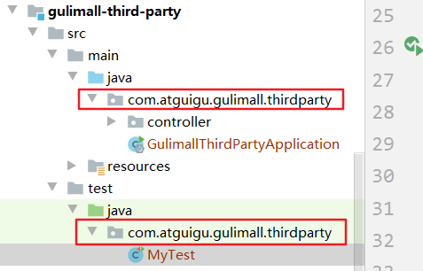

# maven

错误描述：10:14	Unable to import maven project: See logs for details

maven的本地配置不准确.

## maven projects中显示灰色的解决办法

> 造成这个的原因可能是忽略了maven模块，可以尝试如下解决方法：在idea中maven的setting中找到ignored files,看右边的面板中是否将变灰的maven模块忽略了。我的模块变灰就是因为这个原因，Settings–>Maven–>Ignored Files 看看是不是有勾选的。


然后 在maven中 reimport即可

# MyBatis

Mybatis 报错`Parameter '0' not found. Available parameters are [arg1, arg0, param1, param2]`

千错万错，导包的错

导包时没注意是哪一个 param ，一定得是这个

`import org.apache.ibatis.annotations.Param;`

>```java
>package ppppp.dao;
>
>import org.apache.ibatis.annotations.Mapper;
>import org.apache.ibatis.annotations.Param;
>import org.apache.ibatis.annotations.Update;
>import ppppp.entities.Order;
>
>/**
> * @author pppppp
> * @date 2021/7/18 16:56
> */
>@Mapper
>public interface OrderDao {
>    //1 新建订单
>    void create(Order order);
>
>    //2 修改订单状态，从零改为1
>    @Update("update t_order set status = 1 where user_id=#{user_id} and status = #{status};")
>    void update(@Param("user_id") Long userId, @Param("status") Integer status);
>}
>```


# idea

## yml文件不出现小叶子

1.检查**YAML**中是否包含

- *.yaml
- *.yml

2.File -> settings -> Editor -> File Types  将txt中的 application.yml 去掉即可

[解决办法](https://www.codenong.com/cs105599707/)参考

## main函数无法显示run

不是 设置 src文件夹的原因，重新安装软件，/(ㄒoㄒ)/~~


## 打 jar包

https://cloud.tencent.com/developer/article/1764737


# SpringBoot测试类启动错误

>  java.lang.IllegalStateException: Unable to find a @SpringBootConfiguration, you need to use @ContextConfiguration or @SpringBootTest(classes=...) with your test

测试类要和著启动类有相同的文件目录




# linux

## 配置多个环境变量

```bash
#1. 编辑 /etc/profile
[root@centos-2 nginx]# vim /etc/profile
export JAVA_HOME=/usr/local/java/jdk/jdk1.8.0_281
export NGINX_HOME=/usr/local/nginx
export PATH=$PATH:$JAVA_HOME/bin:$NGINX_HOME/sbin

#2. 让配置生效
[root@centos-2 nginx]# source /etc/profile  

#3. 测试
[root@centos-2 nginx]# nginx -v
nginx version: nginx/1.13.7
```

# Windows

## 如何恢复自动更新?让应用商店能下载

**2021-07-24**

```bash
# 1.重置用户策略
rd /s /q "%windir%\System32\GroupPolicyUsers"
# 2.重置本地组策略，包括计算机配置和用户配置
rd /s /q "%windir%\System32\GroupPolicy"
# 3.强制更新命令让上述重置操作生效
gpupdate /force
# 4.重启电脑
```


## 你的设备中缺少重要的安全和质量修复

```bash
请您尝试删除临时更新文件，重新检查更新：

1）同时按下Windows键和R键，打开运行，输入services.msc    

2）找到WindowsUpdate服务项，右键选择禁用。

3）打开c:\windows\SoftwareDistribution，删除datastore和Download文件夹下的所有文件，然后将SoftwareDistribution文件夹重命名为SoftwareDistribution.old。

4）按照1和2的步骤开启WindowsUpdate服务。
```


# VMware

```
无法打开内核设备:\\Global\\vmx86
```

- ~~找到虚拟机文件  .vmx~~

- ~~用记事本打开，**手动找到**vmci0.present=‘TRUE’,把true改为false。保存。即可。~~

无法安装 vmsi

```
卸载微软的更新即可
```


