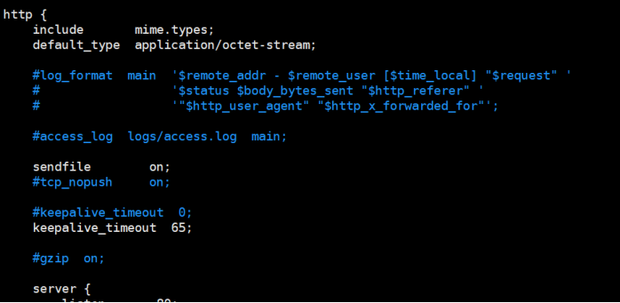
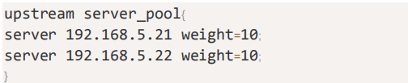
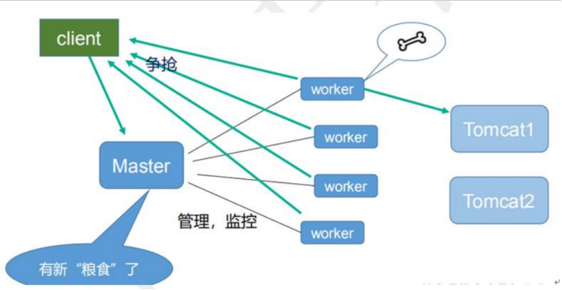

**耗时5h**

**内容介绍**
**1、nginx基本概念。**

> (1) nginx是什么，能做什么事情
>
> (2) 反向代理。
>
> (3) 负载均衡。
>
> (4) 动静分离


**2、nginx 安装、常用命令和配置文件**

> (1)在liunx系统中安装nginx.
>
> (2) nginx常用命令。
>
> (3) nginx 配置文件。

**3、nginx 配置实例 1-反向代理**

**4、nginx 配置实例 2-负载均衡**

**5、nginx 配置实例 3-动静分离。**

**6、nginx配置高可用集群**

**7、nginx 原理。**


# 一、Nginx 简介

## 1、什么是NGINX

```
	Nginx ("engine x")是一个高性能的HTTP和反向代理服务器，特点是占有内存少，并发能力强，事实上nginx的并发能力确实在同类型的网页服务器中表现较好
    Nginx专为性能优化而开发，性能是其最重要的考量，实现上非常注重效率，能经受高负载的考验，有报告表明能支持高达50000个并发连接数。
```

## **2、反向代理**

**a. 正向代理**
在客户端(浏览器)配置代理服务器，通过代理服务器进行互联网访问

**b. 反向代理**
反向代理，其实客户端对代理是无感知的，因为客户端不需要任何配置就可以访问，我们只
需要将请求发送到反向代理服务器，由反向代理服务器去选择目标服务器获取数据后,在返
回给客户端，此时反向代理服务器和目标服务器对外就是一个服务器，暴露的是代理服务器
地址，隐藏了真实服务器IP地址。


## 3、负载均衡

单个服务器解决不了，我们增加服务器的数量，然后将请求分发到各个服务器上,将原先
请求集中到单个服务器上的情况改为将请求分发到多个服务器上,将负载分发到不同的服
务器，也就是我们所说的负载均衡


## 4、动静分离

为了加快网站的解析速度，可以把动态页面和静态页面由不同的服务器来解析，加快解析速
度。降低原来单个服务器的压力。


# 二、Nginx 安装

下面的操作是以Centos7为例

**1. 使用远程连接工具连接Centos7操作系统**
**2. 安装nginx相关依赖**

```
gcc
pcre
openssl
zlib
```

① 安装 nginx 需要先将官网下载的源码进行编译，编译依赖 gcc 环境，如果没有 gcc 环境，则需要安装：

```
$ yum install gcc-c++
```

② PCRE(Perl Compatible Regular Expressions) 是一个Perl库，包括 perl 兼容的正则表达式库。nginx 的 http 模块使用 pcre 来解析正则表达式，所以需要在 linux 上安装 pcre 库，pcre-devel 是使用 pcre 开发的一个二次开发库。nginx也需要此库。命令：

```
$ yum install -y pcre pcre-devel
```

③ zlib 库提供了很多种压缩和解压缩的方式， nginx 使用 zlib 对 http 包的内容进行 gzip ，所以需要在 Centos 上安装 zlib 库。

```
$ yum install -y zlib zlib-devel
```

④ OpenSSL 是一个强大的安全套接字层密码库，囊括主要的密码算法、常用的密钥和证书封装管理功能及 SSL 协议，并提供丰富的应用程序供测试或其它目的使用。
nginx 不仅支持 http 协议，还支持 https（即在ssl协议上传输http），所以需要在 Centos 安装 OpenSSL 库。

```
$ yum install -y openssl openssl-devel
```

**3. 安装Nginx**

① 下载nginx，两种方式

> a. 直接下载`.tar.gz`安装包，地址：https://nginx.org/en/download.html
>
> b. **使用`wget`命令下载（推荐）**。确保系统已经安装了wget，如果没有安装，执行 yum install wget 安装。

```
$ wget -c https://nginx.org/download/nginx-1.13.7.tar.gz
```

② 依然是直接命令：

```
$ tar -zxvf nginx-1.13.7.tar.gz
$ cd nginx-1.13.7
```

③ 配置：

其实在 nginx-1.12.0 版本中你就不需要去配置相关东西，默认就可以了。当然，如果你要自己配置目录也是可以的。
1.使用默认配置

```
$ ./configure
```

2.自定义配置（不推荐）

```
$ ./configure \
--prefix=/usr/local/nginx \
--conf-path=/usr/local/nginx/conf/nginx.conf \
--pid-path=/usr/local/nginx/conf/nginx.pid \
--lock-path=/var/lock/nginx.lock \
--error-log-path=/var/log/nginx/error.log \
--http-log-path=/var/log/nginx/access.log \
--with-http_gzip_static_module \
--http-client-body-temp-path=/var/temp/nginx/client \
--http-proxy-temp-path=/var/temp/nginx/proxy \
--http-fastcgi-temp-path=/var/temp/nginx/fastcgi \
--http-uwsgi-temp-path=/var/temp/nginx/uwsgi \
--http-scgi-temp-path=/var/temp/nginx/scgi
```

> 注：将临时文件目录指定为/var/temp/nginx，需要在/var下创建temp及nginx目录

④ 编辑安装

```
$ make && make install
```

查看版本号(`使用nginx操作命令前提条件:必须进入nginx的目录/usr/local/nginx/sbin`.)

```
$ ./nginx -v
```

查找安装路径：

```
$ whereis nginx
```

⑤ 启动，停止nginx

```
$ cd /usr/local/nginx/sbin/
$ ./nginx 
$ ./nginx -s stop
$ ./nginx -s quit
$ ./nginx -s reload
```

查询nginx进程：

```
$ ps aux|grep nginx
```

启动成功后，在浏览器可以看到这样的页面：


# **三、nginx.conf配置文件**

## **1、位置**

vim /usr/local/nginx/conf/nginx.conf

## **2、配置文件中的内容（包含三部分）**

### （1）全局块：配置服务器整体运行的配置指令

从配置文件开始到 events 块之间的内容，主要会设置一些影响 nginx 服务器整体运行的配置指令，主要包括配

置运行 Nginx 服务器的用户（组）、允许生成的 worker process 数，进程 PID 存放路径、日志存放路径和类型以及配置文件的引入等。

比如上面第一行配置的：

这是 Nginx 服务器并发处理服务的关键配置，worker_processes 值越大，可以支持的并发处理量也越多，但是会受到硬件、软件等设备的制约

 

### （2）events 块：影响 Nginx 服务器与用户的网络连接

events 块涉及的指令主要影响 Nginx 服务器与用户的网络连接，常用的设置包括是否开启对多 work process

下的网络连接进行序列化，是否允许同时接收多个网络连接，选取哪种事件驱动模型来处理连接请求，每个 wordprocess 可以同时支持的最大连接数等。

上述例子就表示每个 work process 支持的最大连接数为 1024.

这部分的配置对 Nginx 的性能影响较大，在实际中应该灵活配置。


 

### （3）http 块

这算是 Nginx 服务器配置中最频繁的部分，代理、缓存和日志定义等绝大多数功能和第三方模块的配置都在这里。

需要注意的是：http 块也可以包括 http 全局块、server 块。

 

#### ①、http 全局块

http 全局块配置的指令包括文件引入、MIME-TYPE 定义、日志自定义、连接超时时间、单链接请求数上限等。

 

#### ②、server 块

这块和虚拟主机有密切关系，虚拟主机从用户角度看，和一台独立的硬件主机是完全一样的，该技术的产生是为了节省互联网服务器硬件成本。

每个 http 块可以包括多个 server 块，而每个 server 块就相当于一个虚拟主机。

而每个 server 块也分为全局 server 块，以及可以同时包含多个 locaton 块。

 

##### 全局 server 块

最常见的配置是本虚拟机主机的监听配置和本虚拟主机的名称或 IP 配置。

##### location 块

一个 server 块可以配置多个 location 块。

这块的主要作用是基于 Nginx 服务器接收到的请求字符串（例如 server_name/uri-string），对虚拟主机名称（也可以是 IP 别名）之外的字符串（例如 前面的 /uri-string）进行匹配，对特定的请求进行处理。地址定向、数据缓

存和应答控制等功能，还有许多第三方模块的配置也在这里进行。

# 四、Nginx  域名转发

## **1、实现效果**

打开浏览器，在浏览器地址栏输入地址 www.123.com，跳转到 liunx 系统 tomcat 主页

面中

## **2、准备工作**

### **（1）在 liunx 系统安装 tomcat，使用默认端口 8080**

\* tomcat 安装文件放到 linux 系统中，解压

\* 进入 tomcat 的 bin 目录中，./startup.sh 启动 tomcat 服务器

### **（2）对外开放访问的端口** 

firewall-cmd --add-port=8080/tcp --permanent

firewall-cmd –reload

查看已经开放的端口号

firewall-cmd --list-all

### **（3）在 windows 系统中通过浏览器访问 tomcat 服务器**

## **3、访问过程的分析**


 

## **4、具体配置**

第一步 在 windows 系统的 host 文件进行域名和 ip 对应关系的配置

 

 

添加内容在 host 文件中，后可以进行域名 + 端口号的访问


第二步 在 nginx 进行请求转发的配置（反向代理配置）

 

## **5、最终测试**

可以直接通过域名进行访问了


# 五、Nginx 反向代理

## **1、实现效果**

使用 nginx 反向代理，根据访问的路径跳转到不同端口的服务中

nginx 监听端口为 9001，

访问 http://192.168.159.141:9001/edu/a.html 直接跳转到 127.0.0.1:8080/edu/a.html 

访问 http:// 192.168.159.141:9001/vod/a.html  直接跳转到 127.0.0.1:8081/edu/a.html 

## **2、准备工作**

（1）准备两个 tomcat 服务器，一个 8080 端口，一个 8081 端口

（2）创建文件夹和测试页面

## **3、具体配置**

（1）找到 nginx 配置文件，进行反向代理配置

 

（2）开放对外访问的端口号 9001 8080 8081

## **4、最终测试**

 

# **六、Nginx 配置实例-负载均衡**

## **1、实现效果**

（1）浏览器地址栏输入地址 http://192.168.17.129/edu/a.html，负载均衡效果，平均 8080和 8081 端口中

## **2、准备工作**

（1）准备两台 tomcat 服务器，一台 8080，一台 8081

（2）在两台 tomcat 里面 webapps 目录中，创建名称是 edu 文件夹，在 edu 文件夹中创建

页面 a.html，用于测试

## **3、在 nginx 的配置文件中进行负载均衡的配置**

 

## **4、nginx 分配服务器策略**

### **第一种 轮询（默认）**

每个请求按时间顺序逐一分配到不同的后端服务器，如果后端服务器 down 掉，能自动剔除。

### **第二种 weight**

weight 代表权重默认为 1,权重越高被分配的客户端越多

 

### **第三种 ip_hash**

每个请求按访问 ip 的 hash 结果分配，这样每个访客固定访问一个后端服务器

 

### **第四种 fair（第三方）**

按后端服务器的响应时间来分配请求，响应时间短的优先分配。

  	

# **七、Nginx 配置实例-动静分离**

## **1、什么是动静分离**

 

Nginx 动静分离简单来说就是把动态跟静态请求分开，不能理解成只是单纯的把动态页面和

静态页面物理分离。严格意义上说应该是动态请求跟静态请求分开，可以理解成使用 Nginx

处理静态页面，Tomcat 处理动态页面。动静分离从目前实现角度来讲大致分为两种，

一种是纯粹把静态文件独立成单独的域名，放在独立的服务器上，也是目前主流推崇的方案；

另外一种方法就是动态跟静态文件混合在一起发布，通过 nginx 来分开。

 

通过 location 指定不同的后缀名实现不同的请求转发。通过 expires 参数设置，可以使浏

览器缓存过期时间，减少与服务器之前的请求和流量。具体 Expires 定义：是给一个资源

设定一个过期时间，也就是说无需去服务端验证，直接通过浏览器自身确认是否过期即可，

所以不会产生额外的流量。此种方法非常适合不经常变动的资源。（如果经常更新的文件，

不建议使用 Expires 来缓存），我这里设置 3d，表示在这 3 天之内访问这个 URL，发送一

个请求，比对服务器该文件最后更新时间没有变化，则不会从服务器抓取，返回状态码 304，

如果有修改，则直接从服务器重新下载，返回状态码 200。

## **2、准备工作**

在 liunx 系统中准备静态资源，用于进行访问

 

## **3、具体配置**

在 nginx 配置文件中进行配置


## **4、最终测试**

（1）浏览器中输入地址

http://192.168.17.129/image/01.jpg

 

因为配置文件 autoindex on

 

重点是添加 location，

最后检查 Nginx 配置是否正确即可，然后测试动静分离是否成功，之需要删除后端 tomcat

服务器上的某个静态文件，查看是否能访问，如果可以访问说明静态资源 nginx 直接返回

了，不走后端 tomcat 服务器


# 八、Nginx配置高可用集群

## **1、什么是nginx高可用**


> (1) 需要两台nginx服务器。
> (2) 需要keepalived
> (3) 需要虚拟ip

## **2、配置高可用的准备工作**

> (1) 需要两台服务器192.168.17.129 和192.168.17.1314
> (2) 在两台服务器安装nginx.
> (3) 在两合服务器安装keepalived.

## **3、在两台服务器安装keepalived**

使用yum命令进行安装

```
$ yum install keepalived
$ rpm -q -a keepalived    #查看是否已经安装上
```

默认安装路径: /etc/keepalived

安装之后，在etc里面生成目录keepalived, 有配置文件keepalived.conf

## **4、完成高可用配置(主从配置)**

（1）修改keepalived的配置文件`keepalived.conf`为：

主机 192.168.159.141 `/etc/keepalived/keepalived.conf`

```
global_defs {
	notification_email {
	  acassen@firewall.loc
	  failover@firewall.loc
	  sysadmin@firewall.loc
	}
	notification_email_from Alexandre.Cassen@firewall.loc
	smtp_ server 192.168.159.141
	smtp_connect_timeout 30
	router_id LVS_DEVEL	# LVS_DEVEL这字段在/etc/hosts文件中看；通过它访问到主机
}

vrrp_script chk_http_ port {
	script "/usr/local/src/nginx_check.sh"
	interval 2   # (检测脚本执行的间隔)2s
	weight 2  #权重，如果这个脚本检测为真，服务器权重+2
}

vrrp_instance VI_1 {
	state MASTER   # 备份服务器上将MASTER 改为BACKUP
	interface ens33 //网卡名称
	virtual_router_id 51 # 主、备机的virtual_router_id必须相同
	priority 100   #主、备机取不同的优先级，主机值较大，备份机值较小
	advert_int 1	#每隔1s发送一次心跳
	authentication {	# 校验方式， 类型是密码，密码1111
        auth type PASS
        auth pass 1111
    }
	virtual_ipaddress { # 虛拟ip
		192.168.159.50 // VRRP H虛拟ip地址
	}
}
```

从机 `192.168.159.143`

```xml
global_defs {
	notification_email {
	  acassen@firewall.loc
	  failover@firewall.loc
	  sysadmin@firewall.loc
	}
	notification_email_from Alexandre.Cassen@firewall.loc
	smtp_ server 192.168.159.141
	smtp_connect_timeout 30
	router_id LVS_DEVEL	# LVS_DEVEL这字段在/etc/hosts文件中看；通过它访问到主机
}

vrrp_script chk_http_ port {
	script "/usr/local/src/nginx_check.sh"
	interval 2   # (检测脚本执行的间隔)2s
	weight 2  #权重，如果这个脚本检测为真，服务器权重+2
}

vrrp_instance VI_1 {
	state BACKUP   # 备份服务器上将MASTER 改为BACKUP
	interface ens33 //网卡名称
	virtual_router_id 51 # 主、备机的virtual_router_id必须相同
	priority 100   #主、备机取不同的优先级，主机值较大，备份机值较小
	advert_int 1	#每隔1s发送一次心跳
	authentication {	# 校验方式， 类型是密码，密码1111
        auth type PASS
        auth pass 1111
    }
	virtual_ipaddress { # 虛拟ip
		192.168.159.50 // VRRP H虛拟ip地址
	}
}
```

（2）在路径/usr/local/src/ 下新建检测脚本 nginx_check.sh

nginx_check.sh,主从机一样

```
#! /bin/bash
A=`ps -C nginx -no-header | wc - 1`
if [ $A -eq 0];then
	/usr/local/nginx/sbin/nginx
	sleep 2
	if [`ps -C nginx --no-header| wc -1` -eq 0 ];then
		killall keepalived
	fi
fi
```

(3) 把两台服务器上nginx和keepalived启动

```
$ systemctl start keepalived.service		#keepalived启动
$ ps -ef | grep keepalived		#查看keepalived是否启动
```

（4）修改从机的 nginx.conf

```bash
...
    server {
        listen      9001;
        server_name 192.168.159.141;
		
        location ~  /edu/ {
        	# 因为此时的 从机是没有 安装 tomcat的
			# proxy_pass http://127.0.0.1:8080;
	   		proxy_pass http://192.168.159.141:8080;
        }

		location ~  /vod/ {
			# proxy_pass http://127.0.0.1:8081;
           proxy_pass http://192.168.159.141:8081;
        }

    }
...

```

## 5、最终测试

(1) 在浏览器地址栏输入虚拟ip地址192.168.159.50

(2) 把主服务器(192.168.17.129) nginx和keealived停止，再输入192.168.159.50.

```
$ systemctl stop keepalived.service  #keepalived停止
```

可以顺利的进行访问

# 九、nginx原理

## 1、mater 和 worker

 

 

 

## 2、worker 如何进行工作的

## 

##  

## 3、一个 master 和多个 woker 有好处

（1）可以使用 nginx –s reload 热部署，利用 nginx 进行热部署操作

（2）每个 woker 是独立的进程，如果有其中的一个 woker 出现问题，其他 woker 独立的，

继续进行争抢，实现请求过程，不会造成服务中断

## 4、设置多少个 woker 合适

worker 数和服务器的 cpu 数相等是最为适宜的

## 5、连接数 worker_connection

第一个：发送请求，占用了 woker 的几个连接数？

答案：2 或者 4 个

 

第二个：nginx 有一个 master，有四个 woker，每个 woker 支持最大的连接数 1024，支持的

最大并发数是多少？

l 普通的静态访问最大并发数是： worker_connections * worker_processes /2，

l 而如果是 HTTP 作 为反向代理来说，最大并发数量应该是 worker_connections *

worker_processes/4。


