(84h/15d   6.28-7.19)

# Nacos

## SpringCloud Alibaba简介

SpringCloud Alibaba诞生的主要原因是：因为Spring Cloud Netflix项目进入了维护模式

### 维护模式

​		将模块置为维护模式，意味着SpringCloud团队将不再向模块添加新功能，我们将恢复block级别的bug以及安全问题，我们也会考虑并审查社区的小型pull request我们打算继续支持这些模块，知道Greenwich版本被普遍采用至少一年

### 意味着

​		Spring Cloud Netflix将不再开发新的组件，我们都知道Spring Cloud项目迭代算是比较快，因此出现了很多重大issue都还来不及Fix，就又推出了另一个Release。进入维护模式意思就是以后一段时间Spring Cloud Netflix提供的服务和功能就这么多了，不在开发新的组件和功能了，以后将以维护和Merge分支Pull Request为主，新组件将以其他替代

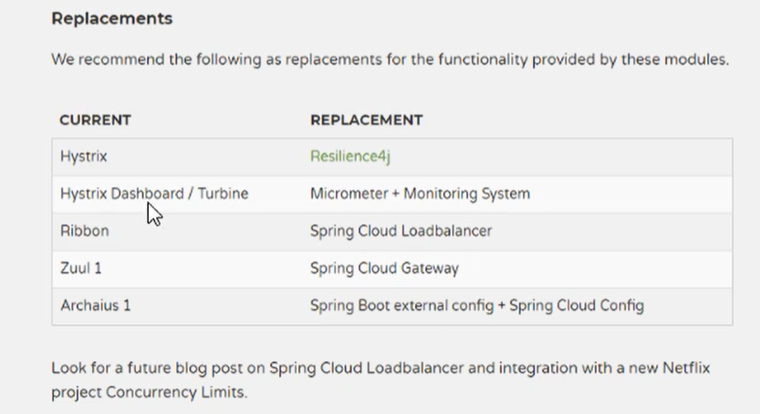

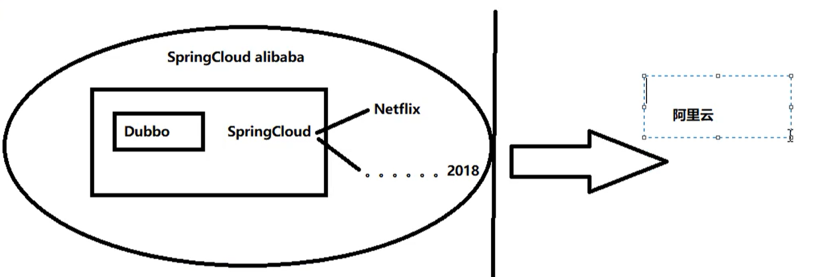

### 诞生

官网：[SpringCloud Alibaba](https://github.com/alibaba/spring-cloud-alibaba/blob/master/README-zh.md)

2018.10.31，Spring Cloud Alibaba正式入驻Spring Cloud官方孵化器，并在Maven仓库发布了第一个

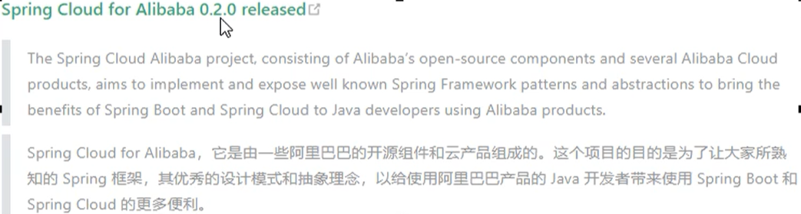

### 能做啥

- 服务限流降级：默认支持servlet，Feign，RestTemplate，Dubbo和RocketMQ限流降级功能的接入，可以在运行时通过控制台实时修改限流降级规则，还支持查看限流降级Metrics监控
- 服务注册与发现：适配Spring Cloud服务注册与发现标准，默认集成了Ribbon的支持
- 分布式配置管理：支持分布式系统中的外部化配置，配置更改时自动刷新
- 消息驱动能力：基于Spring Cloud Stream （内部用RocketMQ）为微服务应用构建消息驱动能力
- 阿里云对象存储：阿里云提供的海量、安全、低成本、高可靠的云存储服务，支持在任何应用、任何时间、任何地点存储和访问任意类型的数据。
- 分布式任务调度：提供秒级，精准、高可靠、高可用的定时（基于Cron表达式）任务调度服务，同时提供分布式的任务执行模型，如网格任务，网格任务支持海量子任务均匀分配到所有Worker

### 引入依赖版本控制

```xml
<dependencyManagement>
    <dependencies>
        <dependency>
            <groupId>com.alibaba.cloud</groupId>
            <artifactId>spring-cloud-alibaba-dependencies</artifactId>
            <version>2.2.0.RELEASE</version>
            <type>pom</type>
            <scope>import</scope>
        </dependency>
    </dependencies>
</dependencyManagement>
```

### 怎么玩

- Sentinel：阿里巴巴开源产品，把流量作为切入点，从流量控制，熔断降级，系统负载 保护等多个维度保护系统服务的稳定性
- Nacos：阿里巴巴开源产品，一个更易于构建云原生应用的动态服务发现、配置管理和服务管理平台
- RocketMQ：基于Java的高性能，高吞吐量的分布式消息和流计算平台
- Dubbo：Apache Dubbo是一款高性能Java RPC框架
- Seata：一个易于使用的高性能微服务分布式事务解决方案
- Alibaba Cloud OOS：阿里云对象存储（Object Storage Service，简称OOS），是阿里云提供的海量，安全，低成本，高可靠的云存储服务，您可以在任何应用，任何时间，任何地点存储和访问任意类型的数据。
- Alibaba Cloud SchedulerX：阿里中间件团队开发的一款分布式任务调度产品，支持周期的任务与固定时间点触发

## Nacos简介

Nacos服务注册和配置中心，兼顾两种

### 为什么叫Nacos

前四个字母分别为：Naming（服务注册） 和 Configuration（配置中心） 的前两个字母，后面的s 是 Service

### 是什么

一个更易于构建云原生应用的动态服务发现，配置管理和服务

Nacos：Dynamic Naming and Configuration Server

Nacos就是注册中心 + 配置中心的组合

等价于：Nacos = Eureka + Config

### 能干嘛

替代Eureka做服务注册中心

替代Config做服务配置中心

### 下载

官网：https://github.com/alibaba/nacos

nacos文档：https://nacos.io/zh-cn/docs/what-is-nacos.html

### 比较

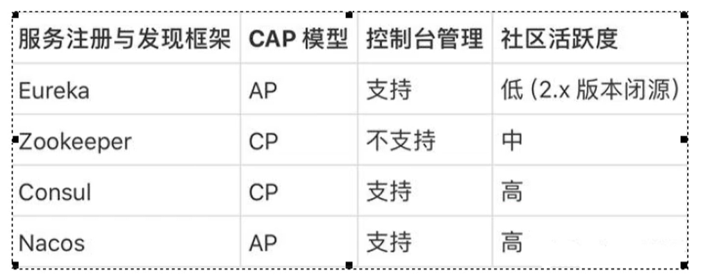

Nacos在阿里巴巴内部有超过10万的实例运行，已经过了类似双十一等各种大型流量的考验

### 安装并运行

本地需要 java8 + Maven环境

下载：[地址](https://github.com/alibaba/nacos/releases/tag/1.1.4)

github经常抽风，可以使用：https://blog.csdn.net/buyaopa/article/details/104582141

解压后：运行bin目录下的：startup.cmd

打开：`http://localhost:8848/nacos`

结果页面

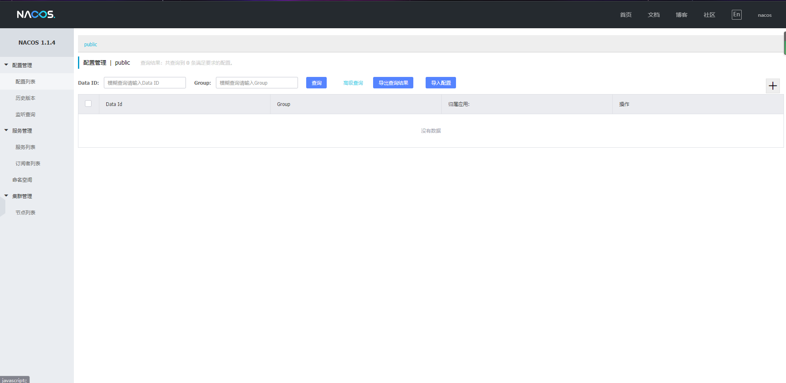

## Nacos作为服务注册中心

### 服务提供者注册Nacos

#### 引入依赖

```xml
<!--SpringCloud alibaba nacos-->
<dependency>
    <groupId>com.alibaba.cloud</groupId>
    <artifactId>spring-cloud-starter-alibaba-nacos-discovery</artifactId>
</dependency>
```

#### 修改yml

```yaml
server:
  port: 9002
spring:
  application:
    name: nacos-payment-provider
  cloud:
    nacos:
      discovery:
        server-addr: 127.0.0.1:8848   # 配置nacos地址
management:
  endpoints:
    web:
      exposure:
        include: '*'
```

#### 主启动类

添加 `@EnableDiscoveryClient` 注解

```java
@SpringBootApplication
@EnableDiscoveryClient
public class PaymentMain9002 {
    public static void main(String[] args) {
        SpringApplication.run(PaymentMain9002.class);
    }
}
```

#### 业务类

```java
@RestController
public class PaymentController {
    @Value("${server.port}")
    private String serverPort;

    @GetMapping("/payment/nacos/{id}")
    public String getPayment(@PathVariable("id") Integer id) {
        return "nacos registry ,serverPore:"+serverPort+"\t id:"+id;
    }
}
```

#### 启动

nacos-payment-provider已经成功注册了

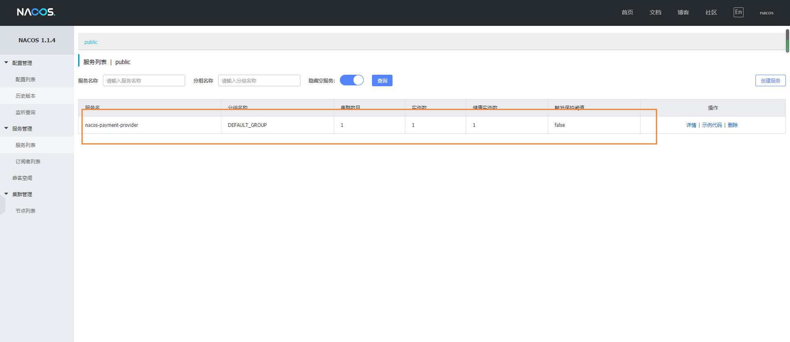

这个时候 nacos服务注册中心 + 服务提供者 9001 都OK了

通过IDEA的拷贝映射

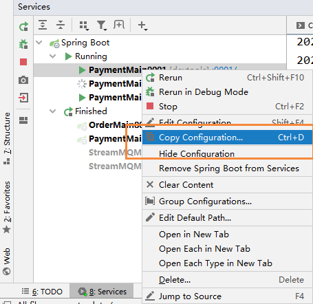

添加

```
-DServer.port=9003
```

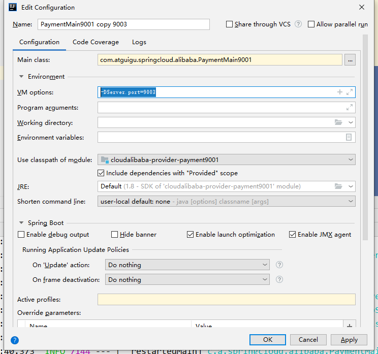

最后能够看到两个实例

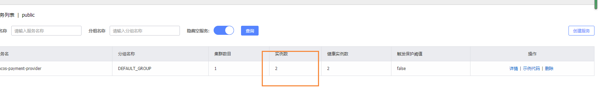

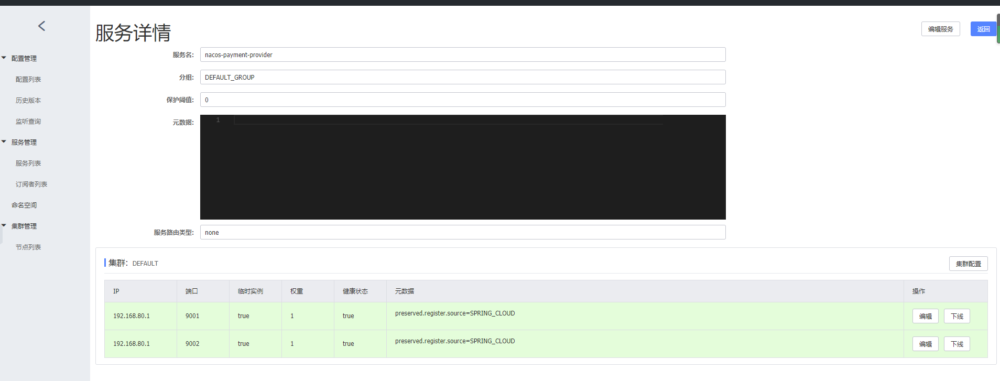


### 服务消费者注册到Nacos

Nacos天生集成了Ribbon，因此它就具备负载均衡的能力

#### 引入依赖

```xml
<!--SpringCloud alibaba nacos-->
<dependency>
    <groupId>com.alibaba.cloud</groupId>
    <artifactId>spring-cloud-starter-alibaba-nacos-discovery</artifactId>
</dependency>
```

#### 修改yml

```yaml
server:
  port: 83
spring:
  application:
    name: nacos-order-consumer
  cloud:
    nacos:
      discovery:
        server-addr: localhost:8848

# 消费者将要去访问的微服务名称（注册成功进nacos的微服务提供者）
service-url:
  nacos-user-service: http://nacos-payment-provider
```

#### 增加配置类

因为nacos集成了Ribbon，因此需要配置RestTemplate，同时通过注解 `@LoadBalanced`实现负载均衡，默认是轮询的方式

```java
@Configuration
public class ApplicationContextConfig {
    @Bean
    @LoadBalanced
    public RestTemplate getRestTemple() {
        return new RestTemplate();
    }
}
```

#### 业务类

```java
@RestController
@Slf4j
public class OrderNacosController {

    @Resource
    private RestTemplate restTemplate;

    @Value("${service-url.nacos-user-service}")
    private String serverURL;

    @GetMapping(value = "/consumer/payment/nacos/{id}")
    public String paymentInfo(@PathVariable("id")Long id){
       return restTemplate.getForObject(serverURL+"/payment/nacos/" + id, String.class);
    }
}
```

测试

```bash
http://localhost:83/consumer/payment/nacos/13
```

得到的结果

```
nacos registry ,serverPore:9001 id:13
nacos registry ,serverPore:9002 id:13
```

我们发现只需要配置了nacos，就轻松实现负载均衡


### 服务中心对比

之前我们提到的注册中心对比图

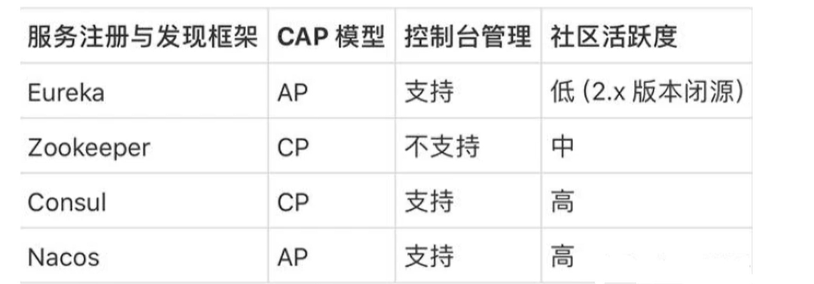

但是其实Nacos不仅支持AP，而且还支持CP，它的支持模式是可以切换的，我们首先看看Spring Cloud Alibaba的全景图，

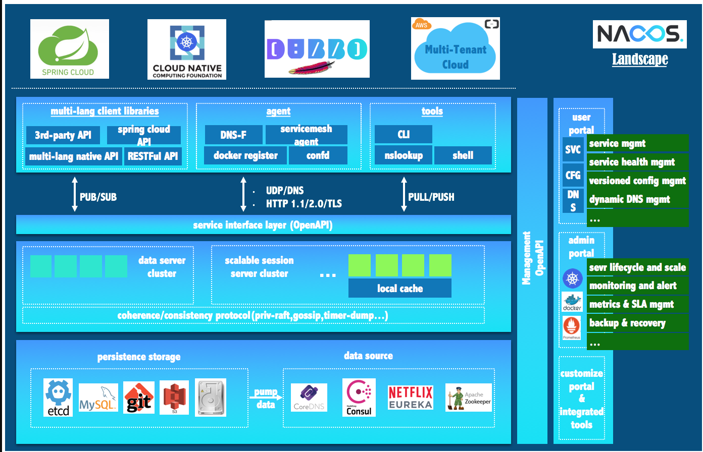

#### Nacos和CAP

CAP：分别是一致性，可用性，分容容忍

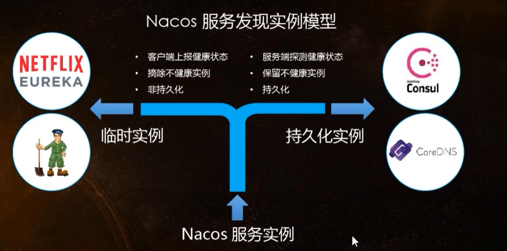

我们从下图能够看到，nacos不仅能够和Dubbo整合，还能和K8s，也就是偏运维的方向

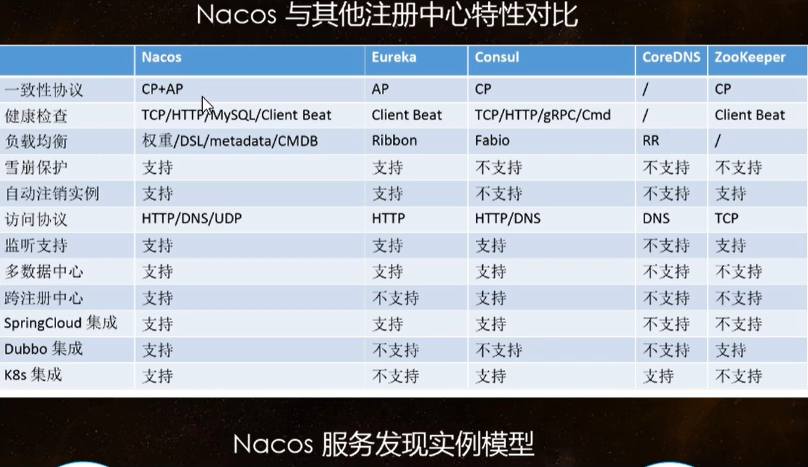

#### Nacos支持AP和CP切换

​		C是指所有的节点同一时间看到的数据是一致的，而A的定义是所有的请求都会收到响应

合适选择何种模式？

​		一般来说，如果不需要存储服务级别的信息且服务实例是通过nacos-client注册，并能够保持心跳上报，那么就可以选择AP模式。当前主流的服务如Spring Cloud 和 Dubbo服务，都是适合AP模式，AP模式为了服务的可用性而减弱了一致性，因此AP模式下只支持注册临时实例。

​		如果需要在服务级别编辑或存储配置信息，那么CP是必须，K8S服务和DNS服务则适用于CP模式。

​		CP模式下则支持注册持久化实例，此时则是以Raft协议为集群运行模式，该模式下注册实例之前必须先注册服务，如果服务不存在，则会返回错误。

## Nacos作为服务配置中心演示

我们将我们的配置写入Nacos，然后以Spring Cloud Config的方式，用于抓取配置

### Nacos作为配置中心 - 基础配置

#### 引入依赖

```xml
<!--引入nacos config-->
<dependency>
    <groupId>com.alibaba.cloud</groupId>
    <artifactId>spring-cloud-starter-alibaba-nacos-config</artifactId>
</dependency>
```

#### 修改YML

Nacos同SpringCloud Config一样，在项目初始化时，要保证先从配置中心进行配置拉取，拉取配置之后，才能保证项目的正常运行。

SpringBoot中配置文件的加载是存在优先级顺序的：bootstrap优先级 高于 application

**application.yml配置**

```yaml
spring:
  profiles:
 #   active: dev # 开发环境
 #   active: test # 测试环境
    active: info # 开发环境
```

**bootstrap.yml配置**

```yaml
server:
  port: 3377
spring:
  application:
    name: nacos-config-client
  cloud:
    nacos:
      discovery:
        server-addr: localhost:8848 # 注册中心
      config:
        server-addr: localhost:8848 # 配置中心
        file-extension: yml # 这里指定的文件格式需要和nacos上新建的配置文件后缀相同，否则读不到
        group: TEST_GROUP
        namespace: 1bdf1418-3ed4-442c-97c1-f525b6a85b34

#  ${spring.application.name}-${spring.profile.active}.${spring.cloud.nacos.config.file-extension}
```

#### 主启动类

```java
@SpringBootApplication
@EnableDiscoveryClient
public class NacosConfigClientMain3377 {
    public static void main(String[] args) {
        SpringApplication.run(NacosConfigClientMain3377.class, args);
    }
}
```

#### 业务类

```java
@RestController
@RefreshScope // 支持nacos的动态刷新
public class ConfigClientController {
    @Value("${config.info}")
    private String configInfo;

    @GetMapping("/config/info")
    public String getConfigInfo(){
        return configInfo;
    }
}
```

通过SpringCloud原生注解 `@RefreshScope` 实现配置自动刷新

#### 在Nacos中添加配置信息

##### Nacos中匹配规则

Nacos中的dataid的组成格式及与SpringBoot配置文件中的匹配规则

```
${spring.application.name}-${spring.profile.active}.${spring.cloud.nacos.config.file-extension}
```

这样，就对应我们Nacos中的这样一个配置

```
nacos-config-client-dev.yml
```

配置说明

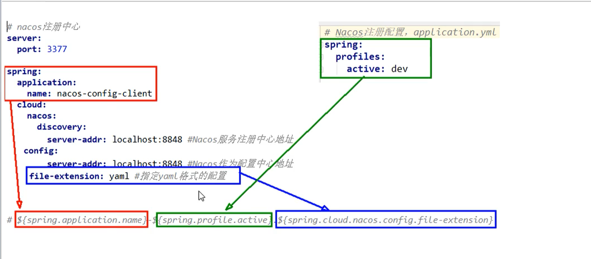

我们在Nacos中添加配置

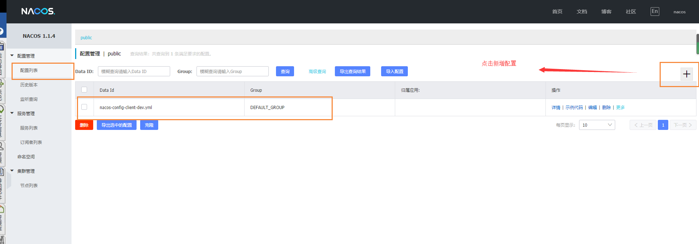

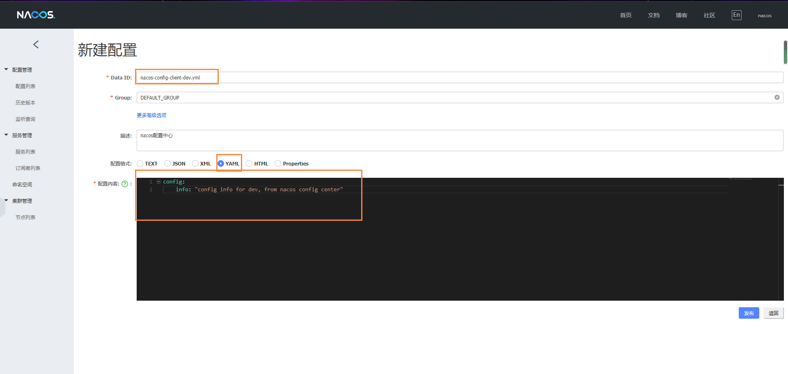

这里需要注意的是，在`config:` 的后面必须加上一个空格

#### 测试

启动前需要在nacos客户端-配置管理下有对应的yml配置文件，然后运行cloud-config-nacos-client:3377的主启动类，调用接口查看配置信息。

启动的时候出现问题

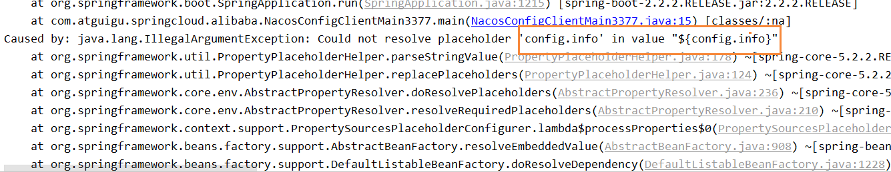

这是因为无法读取配置所引起的，解决方案就是我们的文件名不能用 .yml 而应该是 .yaml

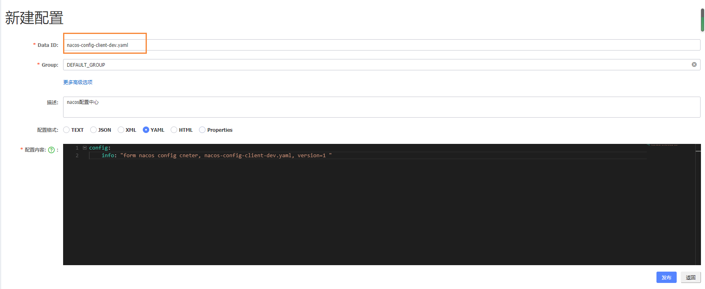

我们需要删除重新建立。

#### 自带动态刷新

修改Nacos中的yaml配置文件，再次查看配置的接口，就会发现配置已经刷新了


### Nacos作为配置中心 - 分类配置

从上面的配置中心 + 动态刷新 ， 就相当于 有了 SpringCloud Config + Spring Cloud Bus的功能

作为后起之秀的Nacos，还具备分类配置的功能

#### 问题

用于解决多环境多项目管理

在实际开发中，通常一个系统会准备

- dev开发环境
- test测试环境
- prod生产环境

如何保证指定环境启动时，服务能正确读取到Nacos上相应环境的配置文件呢？

同时，一个大型分布式微服务系统会有很多微服务子项目，每个微服务子项目又都会有相应的开发环境，测试环境，预发环境，正式环境，那怎么对这些微服务配置进行管理呢？

#### Nacos图形化界面

配置管理:

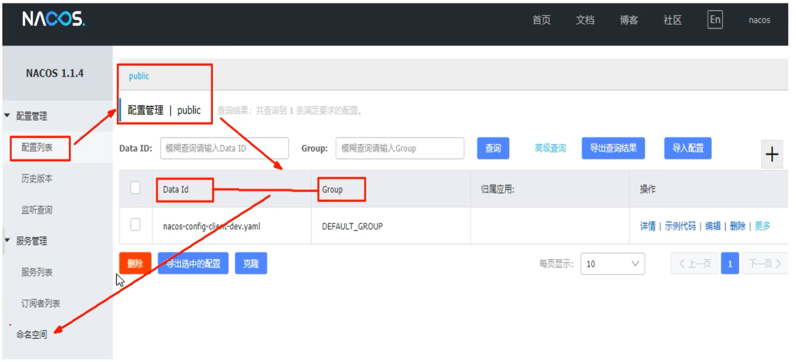

命名空间：

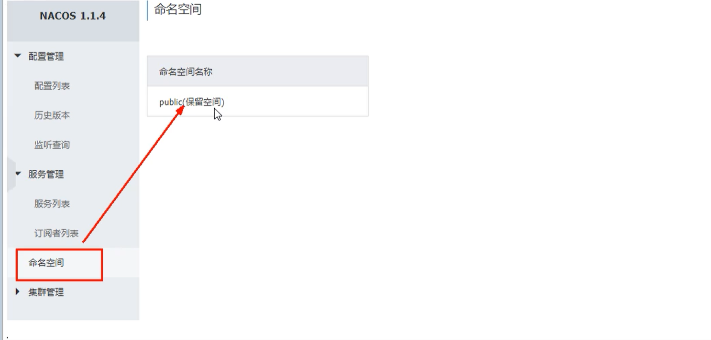


#### Namespace + Group + Data ID 三者关系

这种分类的设计思想，就类似于java里面的package名 和 类名，最外层的namespace是可以用于区分部署环境的，Group 和 DataID逻辑上区分两个目标对象

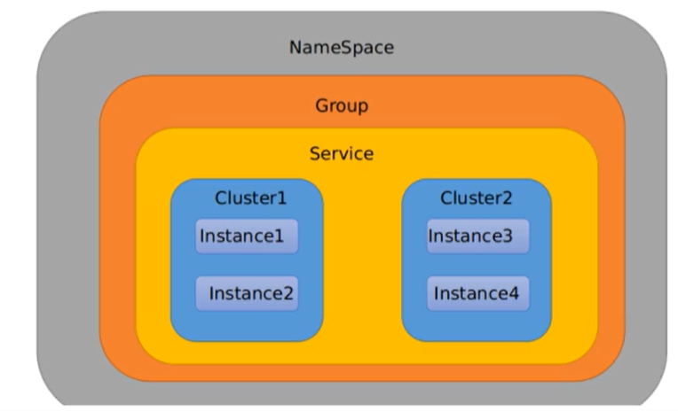

默认情况：

Namespace=public，Group=DEFAULT_GROUP，默认Cluster是DEFAULT

Nacos默认的命名空间是public，Namespace主要用来实现隔离

比如说我们现在有三个环境：开发，测试，生产环境，我们就可以建立三个Namespace，不同的Namespace之间是隔离的。

Group默认是DEFAULT_GROUP，Group可以把不同微服务划分到同一个分组里面去

Service就是微服务，一个Service可以包含多个Cluster（集群），Nacos默认Cluster是DEFAULT，Cluster是对指定微服务的一个虚拟划分。比如说为了容灾，将Service微服务分别部署在了杭州机房，这时就可以给杭州机房的Service微服务起一个集群名称（HZ），给广州机房的Service微服务起一个集群名称，还可以尽量让同一个机房的微服务相互调用，以提升性能，最后Instance，就是微服务的实例。


#### 三种方案加载配置

##### DataID方案

- 指定spring.profile.active 和 配置文件的DataID来使不同环境下读取不同的配置
- 默认空间 + 默认分组 + 新建dev 和 test两个DataID

##### Group方案

在创建的时候，添加分组信息

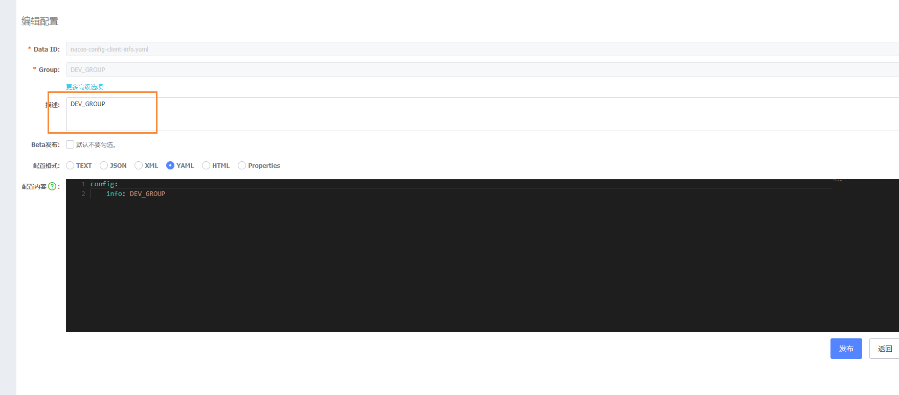

然后就可以添加分组

```yaml
server:
  port: 3377
spring:
  application:
    name: nacos-config-client
  cloud:
    nacos:
      discovery:
        server-addr: localhost:8848 # 注册中心
      config:
        server-addr: localhost:8848 # 配置中心
        file-extension: yaml # 这里指定的文件格式需要和nacos上新建的配置文件后缀相同，否则读不到
        group: TEST_GROUP
```

##### Namspace方案

首先我们需要新建一个命名空间

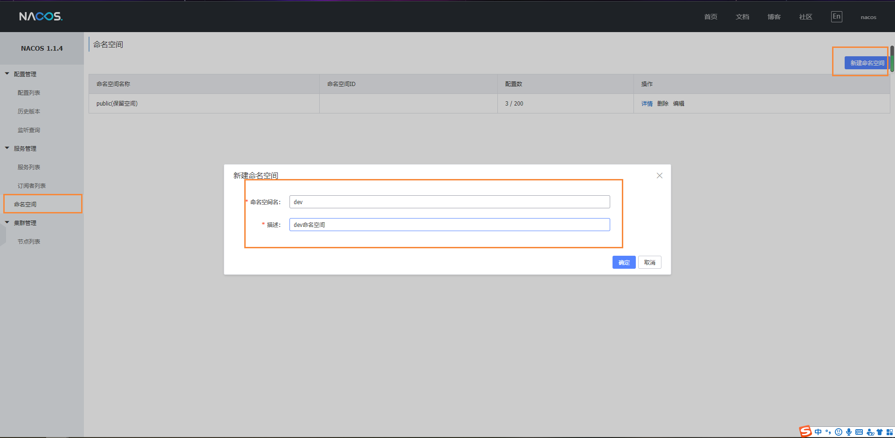

新建完成后，能够看到有命名空间id

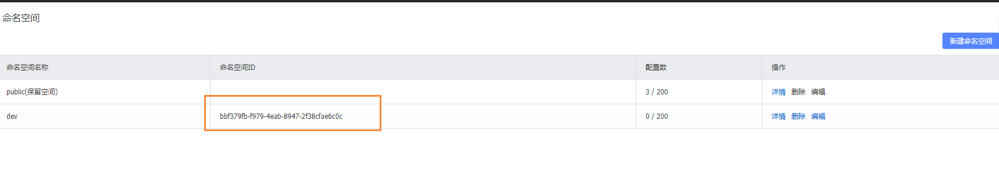

创建完成后，我们会发现，多出了几个命名空间切换

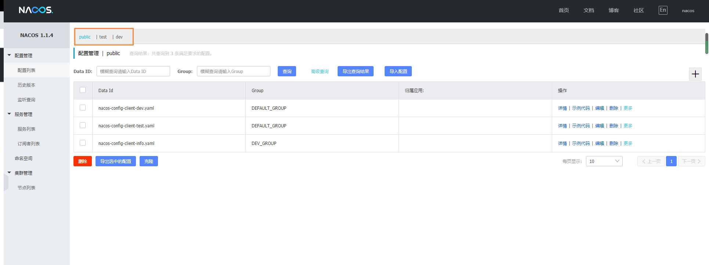

同时，我们到服务列表，发现也多了命名空间的切换

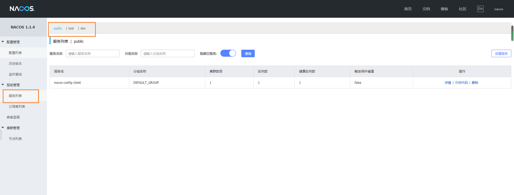

下面我们就可以通过引入namespaceI，来创建到指定的命名空间下

```yaml
server:
  port: 3377
spring:
  application:
    name: nacos-config-client
  cloud:
    nacos:
      discovery:
        server-addr: localhost:8848 # 注册中心
      config:
        server-addr: localhost:8848 # 配置中心
        file-extension: yaml # 这里指定的文件格式需要和nacos上新建的配置文件后缀相同，否则读不到
        group: DEV_GROUP
        namespace: bbf379fb-f979-4eab-8947-2f38cfae6c0c
```

最后通过 namespace + group + DataID 形成三级分类

## Nacos集群和持久化配置

### 官网说明

用于部署生产中的集群模式

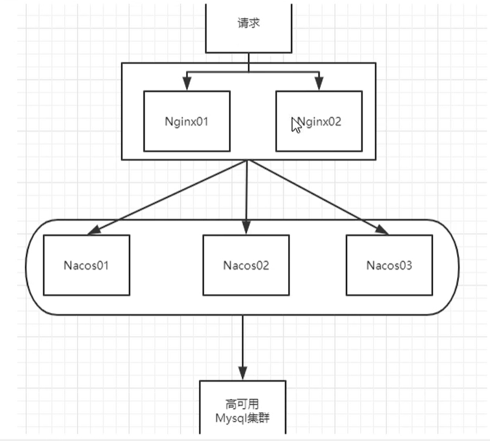

默认Nacos使用嵌入数据库实现数据的存储，所以，如果启动多个默认配置下的Nacos节点，数据存储是存在一致性问题的。为了解决这个问题，Nacos采用了集中式存储的方式来支持集群化部署，目前只支持MySQL的存储。

Nacos支持三种部署模式

- 单机模式：用于测试和单机使用
- 集群模式：用于生产环境，确保高可用
- 多集群模式：用于多数据中心场景

### 单机模式支持mysql

在0.7版本之前，在单机模式下nacos使用嵌入式数据库实现数据的存储，不方便观察数据存储的基本情况。0.7版本增加了支持mysql数据源能力，具体的操作流程：

- 安装数据库，版本要求：5.6.5 + 
- 初始化数据库，数据库初始化文件：nacos-mysql.sql
- 修改conf/application.properties文件，增加mysql数据源配置，目前仅支持mysql，添加mysql数据源的url，用户名和密码

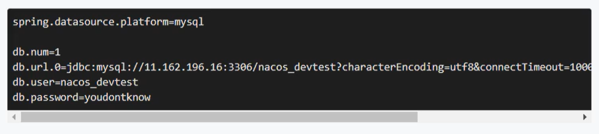

再次以单机模式启动nacos，nacos所有写嵌入式数据库的数据都写到了mysql中。

### Nacos持久化配置解释

Nacos默认自带的是嵌入式数据库derby

因此我们需要完成derby到mysql切换配置步骤

- 在nacos\conf目录下，找到SQL脚本

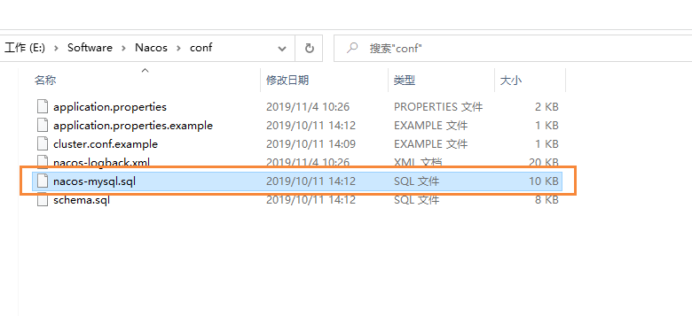

然后执行SQL脚本，同时修改application.properties目录

[官网地址](https://nacos.io/zh-cn/docs/deployment.html)

```properties
spring.datasource.platform=mysql

db.num=1
db.url.0=jdbc:mysql://127.0.0.1:3306/nacos_devtest?characterEncoding=utf8&connectTimeout=1000&socketTimeout=3000&autoReconnect=true
db.user=root
db.password=root
```

修改完成后，启动nacos，可以看到是一个全新的空记录页面，以前是记录进derby

### ==Linux版Nacos + Mysql生产环境配置==

#### 配置

**各个版本之间要适配，不然总是出现奇奇怪怪的bug**

```bash
nginx 版本： 1.13.7
mysql 版本： 5.7.9
nacos 版本： 1.1.4
```

预计需要：1个Nginx + 3个nacos注册中心 + 1个mysql

所有的请求过来，首先先打到nginx上

#### Nacos下载Linux版本

在nacos github下载：`https://github.com/alibaba/nacos/releases`

选择Linux版本下载

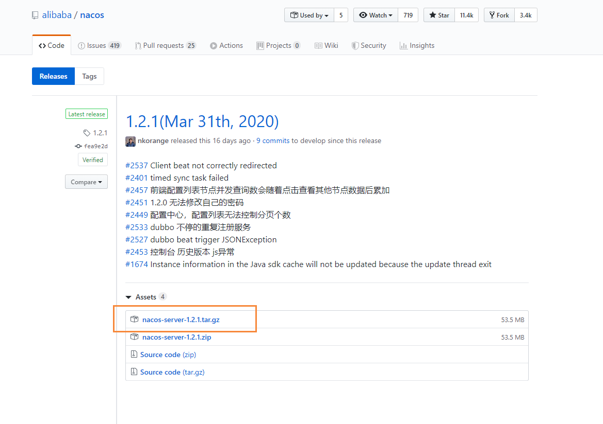

#### 集群配置

如果是一个nacos：启动 8848即可

如果是多个nacos：3333,4444,5555

那么就需要修改startup.sh里面的，传入端口号


步骤：

- Linux服务器上mysql数据库配置
- application.properties配置
- Linux服务器上nacos的集群配置cluster.conf
  - 梳理出3台nacos集群的不同服务端口号
  - 复制出cluster.conf（备份）
  - 修改

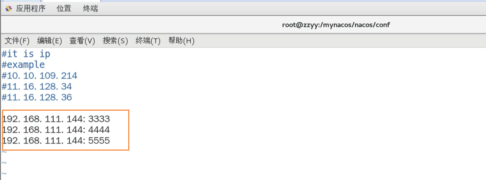

- 编辑Nacos的启动脚本startup.sh，使它能够接受不同的启动端口

  - /nacos/bin 目录下有startup.sh
  - 平时单机版的启动，直接./startup.sh
  - 但是集群启动时，我们希望可以类似其它软件的shell命令，传递不同的端口号启动不同的nacos实例，命令：./startup.sh -p 3333表示启动端口号为3333的nacos服务器实例，和上一步的cluster.conf配置一样。

  修改启动脚本，添加P，这样能够明确nacos启动的什么脚本

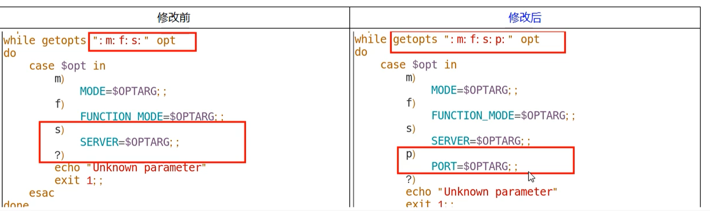

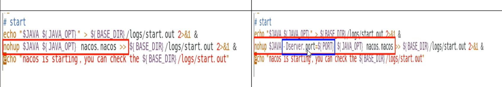

修改完成后，就能够使用下列命令启动集群了

```bash
./startup.sh -p 3333
./startup.sh -p 4444
./startup.sh -p 5555
```

访问，看看是否能成功登录

```bash
http://192.168.159.141:3333/nacos/
http://192.168.159.141:4444/nacos/
http://192.168.159.141:5555/nacos/
```

- Nginx的配置，由它作为负载均衡器
  - 修改nginx的配置文件(此处因为 localhost和 127.0.0.1的问题，一直无法进行实现负载均衡)

```bash
    #gzip  on;
     upstream cluster{
          server  192.168.159.141:3333;
          server  192.168.159.141:4444;
          server  192.168.159.141:5555;
 	}
    server {
        listen       1111;
        server_name  192.168.159.141;
        location / {
	    	proxy_pass http://cluster;
        }
	
```

作为负载均衡分流，同时upstream 支持weight

通过nginx访问nacos节点：`http://192.168.159.141:1111/nacos/#/login`

微服务注册进集群中

```yaml
server:
  port: 9002
spring:
  application:
    name: nacos-payment-provider
  cloud:
    nacos:
      discovery:
        server-addr: 192.168.111.144:1111 # 换成nginx的1111端口，做负债均衡
management:
  endpoints:
    web:
      exposure:
        include: '*'
```

#### 总结

Nginx + 3个Nacos + mysql的集群化配置

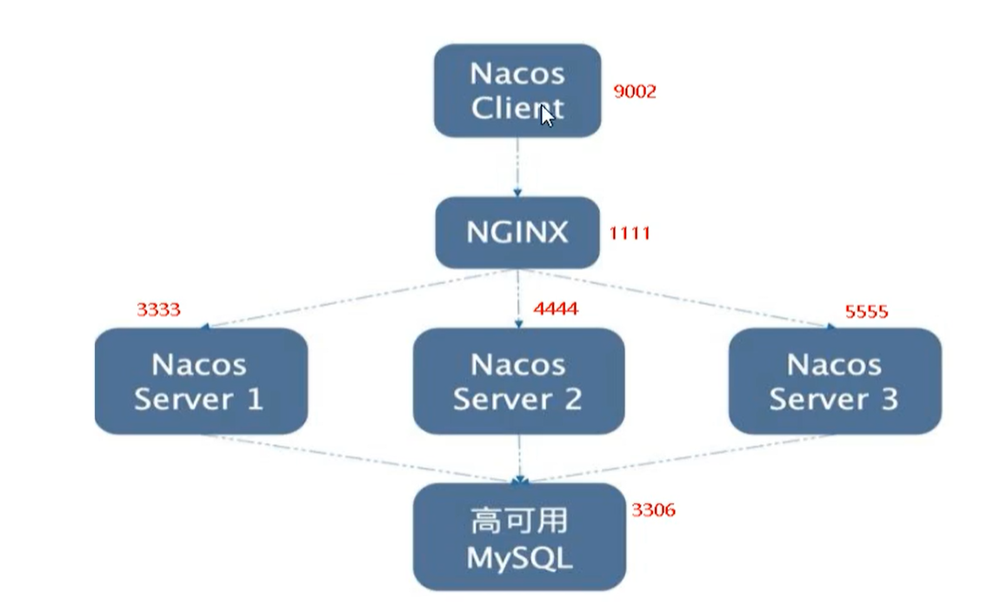

# Sentinel是什么

## **Sentinel 是什么？**

随着微服务的流行，服务和服务之间的稳定性变得越来越重要。Sentinel 以流量为切入点，从流量控制、熔断降级、系统负载保护等多个维度保护服务的稳定性。

Sentinel 具有以下特征:

- 丰富的应用场景：Sentinel 承接了阿里巴巴近 10 年的双十一大促流量的核心场景，例如秒杀（即突发流量控制在系统容量可以承受的范围）、消息削峰填谷、集群流量控制、实时熔断下游不可用应用等。
- 完备的实时监控：Sentinel 同时提供实时的监控功能。您可以在控制台中看到接入应用的单台机器秒级数据，甚至 500 台以下规模的集群的汇总运行情况。
- 广泛的开源生态：Sentinel 提供开箱即用的与其它开源框架/库的整合模块，例如与 Spring Cloud、Dubbo、gRPC 的整合。您只需要引入相应的依赖并进行简单的配置即可快速地接入 Sentinel。
- 完善的 SPI 扩展点：Sentinel 提供简单易用、完善的 SPI 扩展接口。您可以通过实现扩展接口来快速地定制逻辑。例如定制规则管理、适配动态数据源等。
  Sentinel 的主要特性：


—句话解释，之前我们讲解过的Hystrix。

Hystrix与Sentinel比较：

**Hystrix**

- 需要我们程序员自己手工搭建监控平台
- 没有一套web界面可以给我们进行更加细粒度化得配置流控、速率控制、服务熔断、服务降级

**Sentinel**

- 单独一个组件，可以独立出来。
- 直接界面化的细粒度统一配置。

约定 > 配置 > 编码

都可以写在代码里面，但是我们本次还是大规模的学习使用配置和注解的方式，尽量少写代码

## Sentinel下载安装运行

[官方文档](https://spring-cloud-alibaba-group.github.io/github-pages/greenwich/spring-cloud-alibaba.html#_spring_cloud_alibaba_sentinel)

服务使用中的各种问题：

- 服务雪崩
- 服务降级
- 服务熔断

- 服务限流

Sentinel 分为两个部分：

- 核心库（Java 客户端）不依赖任何框架/库，能够运行于所有 Java 运行时环境，同时对 Dubbo / Spring Cloud 等框架也有较好的支持。
- 控制台（Dashboard）基于 Spring Boot 开发，打包后可以直接运行，不需要额外的 Tomcat 等应用容器。
  安装步骤：

下载https://github.com/alibaba/Sentinel/releases

sentinel-dashboard-1.7.0.jar

**前提**
Java 8 环境
8080端口不能被占用
**命令**
java -jar sentinel-dashboard-1.7.0.jar
访问Sentinel管理界面

localhost:8080
登录账号密码均为sentinel


## Sentinel初始化监控

**启动Nacos8848成功**

**新建工程 - cloudalibaba-sentinel-service8401**

POM

```xml
<?xml version="1.0" encoding="UTF-8"?>
<project xmlns="http://maven.apache.org/POM/4.0.0"
         xmlns:xsi="http://www.w3.org/2001/XMLSchema-instance"
         xsi:schemaLocation="http://maven.apache.org/POM/4.0.0 http://maven.apache.org/xsd/maven-4.0.0.xsd">
    <parent>
        <artifactId>7_SpringCloud</artifactId>
        <groupId>ppppp</groupId>
        <version>1.0-SNAPSHOT</version>
    </parent>
    <modelVersion>4.0.0</modelVersion>

    <artifactId>cloudalibaba-sentinel-service8401</artifactId>

    <dependencies>
        <dependency><!-- 引入自己定义的api通用包，可以使用Payment支付Entity -->
            <groupId>ppppp</groupId>
            <artifactId>cloud-api-commons</artifactId>
            <version>${project.version}</version>
        </dependency>
        <!--SpringCloud ailibaba nacos -->
        <dependency>
            <groupId>com.alibaba.cloud</groupId>
            <artifactId>spring-cloud-starter-alibaba-nacos-discovery</artifactId>
        </dependency>
        <!--SpringCloud ailibaba sentinel-datasource-nacos 后续做持久化用到-->
        <dependency>
            <groupId>com.alibaba.csp</groupId>
            <artifactId>sentinel-datasource-nacos</artifactId>
        </dependency>
        <!--SpringCloud ailibaba sentinel -->
        <dependency>
            <groupId>com.alibaba.cloud</groupId>
            <artifactId>spring-cloud-starter-alibaba-sentinel</artifactId>
        </dependency>
        <!--openfeign-->
        <dependency>
            <groupId>org.springframework.cloud</groupId>
            <artifactId>spring-cloud-starter-openfeign</artifactId>
        </dependency>
        <!-- SpringBoot整合Web组件+actuator -->
        <dependency>
            <groupId>org.springframework.boot</groupId>
            <artifactId>spring-boot-starter-web</artifactId>
        </dependency>
        <dependency>
            <groupId>org.springframework.boot</groupId>
            <artifactId>spring-boot-starter-actuator</artifactId>
        </dependency>
        <!--日常通用jar包配置-->
        <dependency>
            <groupId>org.springframework.boot</groupId>
            <artifactId>spring-boot-devtools</artifactId>
            <scope>runtime</scope>
            <optional>true</optional>
        </dependency>
        <dependency>
            <groupId>cn.hutool</groupId>
            <artifactId>hutool-all</artifactId>
            <version>4.6.3</version>
        </dependency>
        <dependency>
            <groupId>org.projectlombok</groupId>
            <artifactId>lombok</artifactId>
            <optional>true</optional>
        </dependency>
        <dependency>
            <groupId>org.springframework.boot</groupId>
            <artifactId>spring-boot-starter-test</artifactId>
            <scope>test</scope>
        </dependency>

    </dependencies>
</project>
```

YML

```yaml
server:
  port: 8401

spring:
  application:
    name: cloudalibaba-sentinel-service
  cloud:
    nacos:
      discovery:
        server-addr: 192.168.159.141:1111 #Nacos服务注册中心地址
    sentinel:
      transport:
        dashboard: localhost:8080 #配置Sentinel dashboard地址
        port: 8719
management:
  endpoints:
    web:
      exposure:
        include: '*'
feign:
  sentinel:
    enabled: true # 激活Sentinel对Feign的支持
```

主启动

```java
package ppppp;

/**
 * @author pppppp
 * @date 2021/7/16 17:26
 */
import org.springframework.boot.SpringApplication;
import org.springframework.boot.autoconfigure.SpringBootApplication;
import org.springframework.cloud.client.discovery.EnableDiscoveryClient;

@EnableDiscoveryClient
@SpringBootApplication
public class MainApp8401 {
    public static void main(String[] args) {
        SpringApplication.run(MainApp8401.class, args);
    }
}
```

业务类FlowLimitController

```java
import com.alibaba.csp.sentinel.annotation.SentinelResource;
import com.alibaba.csp.sentinel.slots.block.BlockException;
import lombok.extern.slf4j.Slf4j;
import org.springframework.web.bind.annotation.GetMapping;
import org.springframework.web.bind.annotation.RequestParam;
import org.springframework.web.bind.annotation.RestController;

import java.util.concurrent.TimeUnit;

@RestController
@Slf4j
public class FlowLimitController {
    @GetMapping("/testA")
    public String testA()
    {
        return "------testA";
    }

    @GetMapping("/testB")
    public String testB()
    {
        log.info(Thread.currentThread().getName()+"\t"+"...testB");
        return "------testB";
    }
}
```

**启动Sentinel8080 - `java -jar sentinel-dashboard-1.7.0.jar`**

**启动微服务8401**

**启动8401微服务后查看sentienl控制台**

- 刚启动，空空如也，啥都没有

- Sentinel采用的懒加载说明
  - 执行一次访问即可
    - http://localhost:8401/testA
    - http://localhost:8401/testB
  - 效果 - sentinel8080正在监控微服务8401

## Sentinel流控规则简介

基本介绍进一步解释说明：

- 资源名：唯一名称，默认请求路径。
- 针对来源：Sentinel可以针对调用者进行限流，填写微服务名，默认default（不区分来源）。
- 阈值类型/单机阈值：
  - QPS(每秒钟的请求数量)︰当调用该API的QPS达到阈值的时候，进行限流。
  - 线程数：当调用该API的线程数达到阈值的时候，进行限流。
- 是否集群：不需要集群。
- 流控模式：
  - 直接：API达到限流条件时，直接限流。
  - 关联：当关联的资源达到阈值时，就限流自己。
  - 链路：只记录指定链路上的流量（指定资源从入口资源进来的流量，如果达到阈值，就进行限流)【API级别的针对来源】。
- 流控效果：
  - 快速失败：直接失败，抛异常。
  - Warm up：根据Code Factor（冷加载因子，默认3）的值，从阈值/codeFactor，经过预热时长，才达到设置的QPS阈值。
  - 排队等待：匀速排队，让请求以匀速的速度通过，阈值类型必须设置为QPS，否则无效。	

## Sentinel流控-QPS直接失败

**直接 -> 快速失败（系统默认）**

**配置及说明**

表示1秒钟内查询1次就是OK，若超过次数1，就直接->快速失败，报默认错误

测试

快速多次点击访问http://localhost:8401/testA

结果 返回页面 Blocked by Sentinel (flow limiting)


源码 com.alibaba.csp.sentinel.slots.block.flow.controller.DefaultController

思考

直接调用默认报错信息，技术方面OK，但是，是否应该有我们自己的后续处理？类似有个fallback的兜底方法?

## Sentinel流控-线程数直接失败

线程数：当调用该API的**线程数**达到阈值的时候，进行限流。

## Sentinel流控-关联

**是什么？**

- 当自己关联的资源达到阈值时，就限流自己
- 当与A关联的资源B达到阀值后，就限流A自己（B惹事，A挂了）

**设置testA**

当关联资源/testB的QPS阀值超过1时，就限流/testA的Rest访问地址，**当关联资源到阈值后限制配置好的资源名**。

**Postman模拟并发密集访问testB**


Run - 大批量线程高并发访问B

Postman运行后，点击访问http://localhost:8401/testA，发现testA挂了

- 结果Blocked by Sentinel(flow limiting)

## Sentinel流控-预热

Warm Up（RuleConstant.CONTROL_BEHAVIOR_WARM_UP）方式，即预热/冷启动方式。当系统长期处于低水位的情况下，当流量突然增加时，直接把系统拉升到高水位可能瞬间把系统压垮。通过"冷启动"，让通过的流量缓慢增加，在一定时间内逐渐增加到阈值上限，给冷系统一个预热的时间，避免冷系统被压垮。详细文档可以参考 流量控制 - Warm Up 文档，具体的例子可以参见 WarmUpFlowDemo。

通常冷启动的过程系统允许通过的 QPS 曲线如下图所示：


> 默认coldFactor为3，即请求QPS 从 threshold / 3开始，经预热时长逐渐升至设定的QPS阈值。[link](https://github.com/alibaba/Sentinel/wiki/流量控制#warm-up)

**WarmUp配置**

案例，阀值为10+预热时长设置5秒。

系统初始化的阀值为10/ 3约等于3,即阀值刚开始为3;然后过了5秒后阀值才慢慢升高恢复到10

**测试**

多次快速点击http://localhost:8401/testB - ==刚开始不行，后续慢慢OK==

**应用场景**

如：秒杀系统在开启的瞬间，会有很多流量上来，很有可能把系统打死，预热方式就是把为了**保护系统**，可慢慢的把流量放进来,慢慢的把阀值增长到设置的阀值。


## Sentinel流控-排队等待

匀速排队，让请求以均匀的速度通过，阀值类型必须设成QPS，否则无效。

设置：/testA每秒1次请求，超过的话就排队等待，等待的超时时间为200毫秒。


## Sentinel降级简介

**RT（平均响应时间，秒级）**

- 平均响应时间 超出阈值 且 在时间窗口内通过的请求>=5，两个条件同时满足后触发降级。
- 窗口期过后关闭断路器，恢复可用状态。。
- RT最大4900（更大的需要通过-Dcsp.sentinel.statistic.max.rt=XXXX才能生效）。

```java
@GetMapping("/testB")
    public String testB()
    {
        try {
            Thread.sleep(1000);
        } catch (InterruptedException e) {
            e.printStackTrace();
        }
        log.info(Thread.currentThread().getName()+"\t"+"...testB");
        return "------testB";
    }
```


**异常比列（秒级）**

- QPS >= 5**且**异常比例（秒级统计）超过阈值时，触发降级;时间窗口结束后，关闭降级 。

**异常数(分钟级)**

​	异常数(分钟统计）超过阈值时，触发降级;时间窗口结束后，关闭降级,恢复可用状态。
​	

Sentinel熔断降级会在调用链路中某个资源出现不稳定状态时（例如调用超时或异常比例升高)，对这个资源的调用进行限制，让请求快速失败，避免影响到其它的资源而导致级联错误。

当资源被降级后，在接下来的降级时间窗口之内，对该资源的调用都自动熔断（默认行为是抛出 DegradeException）。

Sentinei的断路器是没有类似Hystrix半开状态的。(Sentinei 1.8.0 已有半开状态)

半开的状态系统自动去检测是否请求有异常，没有异常就关闭断路器恢复使用，有异常则继续打开断路器不可用。

## Sentinel热点key(上)

**基本介绍**

> 何为热点？热点即经常访问的数据。很多时候我们希望统计某个热点数据中访问频次最高的 Top K 数据，并对其访问进行限制。比如：
>
> 商品 ID 为参数，统计一段时间内最常购买的商品 ID 并进行限制
> 用户 ID 为参数，针对一段时间内频繁访问的用户 ID 进行限制
> 热点参数限流会统计传入参数中的热点参数，并根据配置的限流阈值与模式，对包含热点参数的资源调用进行限流。热点参数限流可以看做是一种特殊的流量控制，仅对包含热点参数的资源调用生效。

承上启下复习start

兜底方法，分为系统默认和客户自定义，两种

之前的case，限流出问题后，都是用sentinel系统默认的提示: Blocked by Sentinel (flow limiting)

我们能不能自定？类似hystrix，某个方法出问题了，就找对应的兜底降级方法?

结论 - 从HystrixCommand到@SentinelResource

代码

com.alibaba.csp.sentinel.slots.block.BlockException

```java
@RestController
@Slf4j
public class FlowLimitController
{

    ...

    @GetMapping("/testHotKey")
    @SentinelResource(value = "testHotKey",blockHandler/*兜底方法*/ = "deal_testHotKey")
    public String testHotKey(@RequestParam(value = "p1",required = false) String p1,
                             @RequestParam(value = "p2",required = false) String p2) {
        //int age = 10/0;
        return "------testHotKey";
    }
    
    /*兜底方法*/
    public String deal_testHotKey (String p1, String p2, BlockException exception) {
        return "------deal_testHotKey,o(╥﹏╥)o";  //sentinel系统默认的提示：Blocked by Sentinel (flow limiting)
    }
}
```


加大刷新速度后就会报错


> @SentinelResource(value = "testHotKey")
> 异常打到了前台用户界面看到，不友好
>
> @SentinelResource(value = "testHotKey", blockHandler = "dealHandler_testHotKey")
> 方法testHotKey里面第一个参数只要QPS超过每秒1次，马上降级处理
> 异常用了我们自己定义的兜底方法

## Sentinel热点key(下)

上述案例演示了第一个参数p1，当QPS超过1秒1次点击后马上被限流。

**参数例外项**

普通 - 超过1秒钟一个后，达到阈值1后马上被限流
我们期望p1参数当它是某个特殊值时，它的限流值和平时不一样
特例 - 假如当p1的值等于5时，它的阈值可以达到**200**

**VIP设置**


**测试**

right - http://localhost:8401/testHotKey?p1=5
error - http://localhost:8401/testHotKey?p1=3
当p1等于5的时候，**阈值变为200**
当p1不等于5的时候，阈值就是平常的1
前提条件 - 热点参数的注意点，参数必须是基本类型或者String

**其它**

在方法体抛异常

```java
@RestController
@Slf4j
public class FlowLimitController
{

    ...

    @GetMapping("/testHotKey")
    @SentinelResource(value = "testHotKey",blockHandler/*兜底方法*/ = "deal_testHotKey")
    public String testHotKey(@RequestParam(value = "p1",required = false) String p1,
                             @RequestParam(value = "p2",required = false) String p2) {
        int age = 10/0;//<----------------------------会抛异常的地方
        return "------testHotKey";
    }
    
    /*兜底方法*/
    public String deal_testHotKey (String p1, String p2, BlockException exception) {
        return "------deal_testHotKey,o(╥﹏╥)o";  //sentinel系统默认的提示：Blocked by Sentinel (flow limiting)
    }
}
```

将会抛出Spring Boot 2的默认异常页面，而不是兜底方法。

@SentinelResource - 处理的是sentinel控制台配置的违规情况，有blockHandler方法配置的兜底处理;

RuntimeException int age = 10/0，这个是java运行时报出的运行时异常RunTimeException，@SentinelResource不管

总结 - @SentinelResource主管配置出错，运行出错该走异常走异常

## Sentinel系统规则

[官方文档](https://github.com/alibaba/Sentinel/wiki/系统自适应限流)

> Sentinel 系统自适应限流从整体维度对应用入口流量进行控制，结合应用的 Load、CPU 使用率、总体平均 RT、入口 QPS 和并发线程数等几个维度的监控指标，通过自适应的流控策略，让系统的入口流量和系统的负载达到一个平衡，让系统尽可能跑在最大吞吐量的同时保证系统整体的稳定性。link

> **系统规则**
>
> 系统保护规则是从应用级别的入口流量进行控制，从单台机器的 load、CPU 使用率、平均 RT、入口 QPS 和并发线程数等几个维度监控应用指标，让系统尽可能跑在最大吞吐量的同时保证系统整体的稳定性。
>
> 系统保护规则是应用整体维度的，而不是资源维度的，并且仅对入口流量生效。入口流量指的是进入应用的流量（EntryType.IN），比如 Web 服务或 Dubbo 服务端接收的请求，都属于入口流量。
>
> 系统规则支持以下的模式：
>
> Load 自适应（仅对 Linux/Unix-like 机器生效）：系统的 load1 作为启发指标，进行自适应系统保护。当系统 load1 超过设定的启发值，且系统当前的并发线程数超过估算的系统容量时才会触发系统保护（BBR 阶段）。系统容量由系统的 maxQps * minRt 估算得出。设定参考值一般是 CPU cores * 2.5。
> CPU usage（1.5.0+ 版本）：当系统 CPU 使用率超过阈值即触发系统保护（取值范围 0.0-1.0），比较灵敏。
> 平均 RT：当单台机器上所有入口流量的平均 RT 达到阈值即触发系统保护，单位是毫秒。
> 并发线程数：当单台机器上所有入口流量的并发线程数达到阈值即触发系统保护。
> 入口 QPS：当单台机器上所有入口流量的 QPS 达到阈值即触发系统保护。
> link

## SentinelResource配置(上)

*按资源名称限流 + 后续处理*

**启动Nacos成功**

**启动Sentinel成功**

**Module - cloudalibaba-sentinel-service8401**

```java
package ppppp.controller;

/**
 * @author pppppp
 * @date 2021/7/17 9:41
 */
import com.alibaba.csp.sentinel.annotation.SentinelResource;
import com.alibaba.csp.sentinel.slots.block.BlockException;

import org.springframework.web.bind.annotation.GetMapping;
import org.springframework.web.bind.annotation.RestController;
import ppppp.entities.CommonResult;
import ppppp.entities.Payment;

@RestController
public class RateLimitController {

    @GetMapping("/byResource")
    @SentinelResource(value = "byResource",blockHandler = "handleException")
    public CommonResult byResource() {
        return new CommonResult(200,"按资源名称限流测试OK",new Payment(2020L,"serial001"));
    }

    public CommonResult handleException(BlockException exception) {
        return new CommonResult(444,exception.getClass().getCanonicalName()+"\t 服务不可用");
    }
}
```

**配置流控规则**

配置步骤

图形配置和代码关系

表示1秒钟内查询次数大于1，就跑到我们自定义的处流，限流

**测试**

1秒钟点击1下，OK

超过上述，疯狂点击，返回了自己定义的限流处理信息，限流发生

> {"code":444, "message":"com.alibaba.csp.sentinel.slots.block.flow.FlowException\t 服务不可用", "data":null}

**额外问题**

此时关闭问服务8401 -> Sentinel控制台，流控规则消失了

------

**按照Url地址限流 + 后续处理**

**通过访问的URL来限流，会返回Sentinel自带默认的限流处理信息**

**业务类RateLimitController**

```java
@RestController
public class RateLimitController
{
	...

    @GetMapping("/rateLimit/byUrl")
    @SentinelResource(value = "byUrl")
    public CommonResult byUrl()
    {
        return new CommonResult(200,"按url限流测试OK",new Payment(2020L,"serial002"));
    }
}
```

**测试**

- 快速点击http://localhost:8401/rateLimit/byUrl
- 结果 - 会返回Sentinel自带的限流处理结果 Blocked by Sentinel (flow limiting)

**上面兜底方案面临的问题**

- 系统默认的，没有体现我们自己的业务要求。
- 依照现有条件，我们自定义的处理方法又和业务代码耦合在一块，不直观。
- 每个业务方法都添加—个兜底的，那代码膨胀加剧。
- 全局统—的处理方法没有体现。

## SentinelResource配置(中)

客户自定义限流处理逻辑

自定义限流处理类 - 创建CustomerBlockHandler类用于自定义限流处理逻辑

```java
public class CustomerBlockHandler {
    public static CommonResult handlerException(BlockException exception) {
        return new CommonResult(4444,"按客戶自定义,global handlerException----1");
    }
    
    public static CommonResult handlerException2(BlockException exception) {
        return new CommonResult(4444,"按客戶自定义,global handlerException----2");
    }
}
```

RateLimitController

```java
@RestController
public class RateLimitController {
	...
    @GetMapping("/rateLimit/customerBlockHandler")
    @SentinelResource(value = "customerBlockHandler",
            blockHandlerClass = CustomerBlockHandler.class,//<-------- 自定义限流处理类
            blockHandler = "handlerException2")//<-----------
    public CommonResult customerBlockHandler()
    {
        return new CommonResult(200,"按客戶自定义",new Payment(2020L,"serial003"));
    }
}
```


启动微服务后先调用一次 - http://localhost:8401/rateLimit/customerBlockHandler。然后，多次快速刷新http://localhost:8401/rateLimit/customerBlockHandler。刷新后，我们自定义兜底方法的字符串信息就返回到前端。

## Sentinel服务熔断Ribbon环境预说

sentinel整合ribbon+openFeign+fallback

Ribbon系列

- 启动nacos和sentinel
- 提供者9003/9004
- 消费者84

**提供者9003/9004**

新建cloudalibaba-provider-payment9003/9004，两个一样的做法

POM

```xml
<?xml version="1.0" encoding="UTF-8"?>
<project xmlns="http://maven.apache.org/POM/4.0.0"
         xmlns:xsi="http://www.w3.org/2001/XMLSchema-instance"
         xsi:schemaLocation="http://maven.apache.org/POM/4.0.0 http://maven.apache.org/xsd/maven-4.0.0.xsd">
    <parent>
        <artifactId>7_SpringCloud</artifactId>
        <groupId>ppppp</groupId>
        <version>1.0-SNAPSHOT</version>
    </parent>
    <modelVersion>4.0.0</modelVersion>

    <artifactId>cloudalibaba-provider-payment9003</artifactId>

    <dependencies>
        <!--SpringCloud ailibaba nacos -->
        <dependency>
            <groupId>com.alibaba.cloud</groupId>
            <artifactId>spring-cloud-starter-alibaba-nacos-discovery</artifactId>
        </dependency>
        <dependency><!-- 引入自己定义的api通用包，可以使用Payment支付Entity -->
            <groupId>ppppp</groupId>
            <artifactId>cloud-api-commons</artifactId>
            <version>${project.version}</version>
        </dependency>
        <!-- SpringBoot整合Web组件 -->
        <dependency>
            <groupId>org.springframework.boot</groupId>
            <artifactId>spring-boot-starter-web</artifactId>
        </dependency>
        <dependency>
            <groupId>org.springframework.boot</groupId>
            <artifactId>spring-boot-starter-actuator</artifactId>
        </dependency>
        <!--日常通用jar包配置-->
        <dependency>
            <groupId>org.springframework.boot</groupId>
            <artifactId>spring-boot-devtools</artifactId>
            <scope>runtime</scope>
            <optional>true</optional>
        </dependency>
        <dependency>
            <groupId>org.projectlombok</groupId>
            <artifactId>lombok</artifactId>
            <optional>true</optional>
        </dependency>
        <dependency>
            <groupId>org.springframework.boot</groupId>
            <artifactId>spring-boot-starter-test</artifactId>
            <scope>test</scope>
        </dependency>
        <dependency>
            <groupId>ppppp</groupId>
            <artifactId>cloud-api-commons</artifactId>
            <version>1.0-SNAPSHOT</version>
            <scope>compile</scope>
        </dependency>
    </dependencies>
</project>
```

YML

```yaml
server:
  port: 9003

spring:
  application:
    name: nacos-payment-provider
  cloud:
    nacos:
      discovery:
        server-addr: 192.168.159.141:1111 #配置Nacos地址

management:
  endpoints:
    web:
      exposure:
        include: '*'
```

**记得修改不同的端口号**

主启动

```java
package ppppp;

/**
 * @author pppppp
 * @date 2021/7/17 10:14
 */
import org.springframework.boot.SpringApplication;
import org.springframework.boot.autoconfigure.SpringBootApplication;
import org.springframework.cloud.client.discovery.EnableDiscoveryClient;

@SpringBootApplication
@EnableDiscoveryClient
public class PaymentMain9003 {
    public static void main(String[] args) {
        SpringApplication.run(PaymentMain9003.class, args);
    }
}
```

业务类

```java
package ppppp.controller;

import org.springframework.beans.factory.annotation.Value;
import org.springframework.web.bind.annotation.GetMapping;
import org.springframework.web.bind.annotation.PathVariable;
import org.springframework.web.bind.annotation.RestController;
import ppppp.entities.CommonResult;
import ppppp.entities.Payment;

import java.util.HashMap;

/**
 * @author pppppp
 * @date 2021/7/17 10:15
 */
@RestController
public class PaymentController {
    @Value("${server.port}")
    private String serverPort;

    //模拟数据库
    public static HashMap<Long, Payment> hashMap = new HashMap<>();
    static
    {
        hashMap.put(1L,new Payment(1L,"28a8c1e3bc2742d8848569891fb42181"));
        hashMap.put(2L,new Payment(2L,"bba8c1e3bc2742d8848569891ac32182"));
        hashMap.put(3L,new Payment(3L,"6ua8c1e3bc2742d8848569891xt92183"));
    }

    @GetMapping(value = "/paymentSQL/{id}")
    public CommonResult<Payment> paymentSQL(@PathVariable("id") Long id)
    {
        Payment payment = hashMap.get(id);
        CommonResult<Payment> result = new CommonResult(200,"from mysql,serverPort:  "+serverPort,payment);
        return result;
    }

}
```

测试地址 - http://localhost:9003/paymentSQL/1

​				  http://localhost:9004/paymentSQL/1


**消费者84**

新建cloudalibaba-consumer-nacos-order84

POM

```xml
<?xml version="1.0" encoding="UTF-8"?>
<project xmlns="http://maven.apache.org/POM/4.0.0"
         xmlns:xsi="http://www.w3.org/2001/XMLSchema-instance"
         xsi:schemaLocation="http://maven.apache.org/POM/4.0.0 http://maven.apache.org/xsd/maven-4.0.0.xsd">
    <parent>
        <artifactId>7_SpringCloud</artifactId>
        <groupId>ppppp</groupId>
        <version>1.0-SNAPSHOT</version>
    </parent>
    <modelVersion>4.0.0</modelVersion>

    <artifactId>cloudalibaba-consumer-nacos-order84</artifactId>
    <dependencies>
    <!--SpringCloud openfeign -->
    <dependency>
        <groupId>org.springframework.cloud</groupId>
        <artifactId>spring-cloud-starter-openfeign</artifactId>
    </dependency>
    <!--SpringCloud ailibaba nacos -->
    <dependency>
        <groupId>com.alibaba.cloud</groupId>
        <artifactId>spring-cloud-starter-alibaba-nacos-discovery</artifactId>
    </dependency>
    <!--SpringCloud ailibaba sentinel -->
    <dependency>
        <groupId>com.alibaba.cloud</groupId>
        <artifactId>spring-cloud-starter-alibaba-sentinel</artifactId>
    </dependency>
    <!-- 引入自己定义的api通用包，可以使用Payment支付Entity -->
    <dependency>
        <groupId>ppppp</groupId>
        <artifactId>cloud-api-commons</artifactId>
        <version>${project.version}</version>
    </dependency>
    <!-- SpringBoot整合Web组件 -->
    <dependency>
        <groupId>org.springframework.boot</groupId>
        <artifactId>spring-boot-starter-web</artifactId>
    </dependency>
    <dependency>
        <groupId>org.springframework.boot</groupId>
        <artifactId>spring-boot-starter-actuator</artifactId>
    </dependency>
    <!--日常通用jar包配置-->
    <dependency>
        <groupId>org.springframework.boot</groupId>
        <artifactId>spring-boot-devtools</artifactId>
        <scope>runtime</scope>
        <optional>true</optional>
    </dependency>
    <dependency>
        <groupId>org.projectlombok</groupId>
        <artifactId>lombok</artifactId>
        <optional>true</optional>
    </dependency>
    <dependency>
        <groupId>org.springframework.boot</groupId>
        <artifactId>spring-boot-starter-test</artifactId>
        <scope>test</scope>
    </dependency>
</dependencies>

</project>
```

YML

```yaml
server:
  port: 84

spring:
  application:
    name: nacos-order-consumer
  cloud:
    nacos:
      discovery:
        server-addr: 192.168.159.141:1111
    sentinel:
      transport:
        #配置Sentinel dashboard地址
        dashboard: localhost:8080
        #默认8719端口，假如被占用会自动从8719开始依次+1扫描,直至找到未被占用的端口
        port: 8719

#消费者将要去访问的微服务名称(注册成功进nacos的微服务提供者)
service-url:
  nacos-user-service: http://nacos-payment-provider

# 激活Sentinel对Feign的支持
feign:
  sentinel:
    enabled: false
```

main

```java
package ppppp;

/**
 * @author pppppp
 * @date 2021/7/17 10:20
 */
import org.springframework.boot.SpringApplication;
import org.springframework.boot.autoconfigure.SpringBootApplication;
import org.springframework.cloud.client.discovery.EnableDiscoveryClient;
import org.springframework.cloud.openfeign.EnableFeignClients;

@EnableDiscoveryClient
@SpringBootApplication
@EnableFeignClients
public class OrderNacosMain84 {
    public static void main(String[] args) {
        SpringApplication.run(OrderNacosMain84.class, args);
    }
}
```

**controller  && config**

```java
package ppppp.controller;

import com.alibaba.csp.sentinel.annotation.SentinelResource;
import lombok.extern.slf4j.Slf4j;
import org.springframework.web.bind.annotation.PathVariable;
import org.springframework.web.bind.annotation.RequestMapping;
import org.springframework.web.bind.annotation.RestController;
import org.springframework.web.client.RestTemplate;
import ppppp.entities.CommonResult;
import ppppp.entities.Payment;

import javax.annotation.Resource;

/**
 * @author pppppp
 * @date 2021/7/17 10:21
 */
@RestController
@Slf4j
public class CircleBreakerController {
    public static final String SERVICE_URL = "http://nacos-payment-provider";

    @Resource
    private RestTemplate restTemplate;

    @RequestMapping("/consumer/fallback/{id}")
    @SentinelResource(value = "fallback")//没有配置
    public CommonResult<Payment> fallback(@PathVariable Long id)
    {
        CommonResult<Payment> result = restTemplate.getForObject(SERVICE_URL + "/paymentSQL/"+id,CommonResult.class,id);

        if (id == 4) {
            throw new IllegalArgumentException ("IllegalArgumentException,非法参数异常....");
        }else if (result.getData() == null) {
            throw new NullPointerException ("NullPointerException,该ID没有对应记录,空指针异常");
        }
        return result;
    }
}
```

```java
package ppppp.config;
/**
 * @author pppppp
 * @date 2021/7/17 10:21
 */
import org.springframework.cloud.client.loadbalancer.LoadBalanced;
import org.springframework.context.annotation.Bean;
import org.springframework.context.annotation.Configuration;
import org.springframework.web.client.RestTemplate;
@Configuration
public class ApplicationContextConfig {

    @Bean
    @LoadBalanced
    public RestTemplate getRestTemplate() {
        return new RestTemplate();
    }
}
```

修改后请重启微服务

热部署对java代码级生效及时
对@SentinelResource注解内属性，有时效果不好
目的

fallback管运行异常
blockHandler管配置违规
测试地址 - http://localhost:84/consumer/fallback/1

没有任何配置

只配置fallback

只配置blockHandler

fallback和blockHandler都配置

忽略属性

## Sentinel服务熔断无配置

没有任何配置 - **给用户error页面，不友好**


## Sentinel服务熔断只配置fallback

fallback只负责业务异常

```java
@RestController
@Slf4j
public class CircleBreakerController {
    public static final String SERVICE_URL = "http://nacos-payment-provider";
    @Resource
    private RestTemplate restTemplate;
    @RequestMapping("/consumer/fallback/{id}")
    //@SentinelResource(value = "fallback")//没有配置
    @SentinelResource(value = "fallback", fallback = "handlerFallback") //fallback只负责业务异常
    public CommonResult<Payment> fallback(@PathVariable Long id) {
        CommonResult<Payment> result = restTemplate.getForObject(SERVICE_URL + "/paymentSQL/"+id,CommonResult.class,id);

        if (id == 4) {
            throw new IllegalArgumentException ("IllegalArgumentException,非法参数异常....");
        }else if (result.getData() == null) {
            throw new NullPointerException ("NullPointerException,该ID没有对应记录,空指针异常");
        }
        return result;
    }  
    //本例是fallback
    public CommonResult handlerFallback(@PathVariable  Long id,Throwable e) {
        Payment payment = new Payment(id,"null");
        return new CommonResult<>(444,"兜底异常handlerFallback,exception内容  "+e.getMessage(),payment);
    }   
}
```

测试地址 - http://localhost:84/consumer/fallback/4

页面返回结果：

```json
{"code":444,"message":"兜底异常nandlerFal1back, exception内容illegalkrgumentEBxceptio
```

## Sentinel服务熔断只配置blockHandler

blockHandler只负责**sentinel控制台配置违规**

```java

    @SentinelResource(value = "fallback",blockHandler = "blockHandler") //blockHandler只负责sentinel控制台配置违规
    public CommonResult<Payment> fallback(@PathVariable Long id)
    {
    }

    //本例是blockHandler
    public CommonResult blockHandler(@PathVariable  Long id,BlockException blockException) {
        Payment payment = new Payment(id,"null");
        return new CommonResult<>(445,"blockHandler-sentinel限流,无此流水: blockException  "+blockException.getMessage(),payment);
    }
```

## Sentinel服务熔断fallback和blockHandler都配置

若blockHandler和fallback 都进行了配置，则被限流降级而抛出BlockException时只会进入blockHandler处理逻辑。

```java
@SentinelResource(value = "fallback",fallback = "handlerFallback",blockHandler = "blockHandler")
```

## Sentinel服务熔断exceptionsToIgnore

exceptionsToIgnore，忽略指定异常，即这些异常不用兜底方法处理。

## Sentinel服务熔断OpenFeign

**修改84模块**

- 84消费者调用提供者9003
- Feign组件一般是消费侧

POM

```xml
<!--SpringCloud openfeign -->
<dependency>
    <groupId>org.springframework.cloud</groupId>
    <artifactId>spring-cloud-starter-openfeign</artifactId>
</dependency>
```

YML

```yaml
# 激活Sentinel对Feign的支持
feign:
  sentinel:
    enabled: true
```

业务类

带@Feignclient注解的业务接口，fallback = PaymentFallbackService.class

```java
package ppppp.service;
import org.springframework.cloud.openfeign.FeignClient;
import org.springframework.web.bind.annotation.GetMapping;
import org.springframework.web.bind.annotation.PathVariable;
import ppppp.entities.CommonResult;
import ppppp.entities.Payment;

/**
 * @author pppppp
 * @date 2021/7/17 21:28
 */
@FeignClient(value = "nacos-payment-provider",fallback = PaymentFallbackService.class)
public interface PaymentService
{
    @GetMapping(value = "/paymentSQL/{id}")
    public CommonResult<Payment> paymentSQL(@PathVariable("id") Long id);
}

/*#######################################################*/
package ppppp.service;

import org.springframework.stereotype.Component;
import ppppp.entities.CommonResult;
import ppppp.entities.Payment;
/**
 * @author pppppp
 * @date 2021/7/17 21:30
 */
@Component
public class PaymentFallbackService implements PaymentService {
    @Override
    public CommonResult<Payment> paymentSQL(Long id)
    {
        return new CommonResult<>(44444,"服务降级返回,---PaymentFallbackService",new Payment(id,"errorSerial"));
    }
}
```

Controller

```java
@RestController
@Slf4j
public class CircleBreakerController {

    ...
    
	//==================OpenFeign
    @Resource
    private PaymentService paymentService;

    @GetMapping(value = "/consumer/paymentSQL/{id}")
    public CommonResult<Payment> paymentSQL(@PathVariable("id") Long id)
    {
        return paymentService.paymentSQL(id);
    }
}
```

主启动

```java
import org.springframework.cloud.client.discovery.EnableDiscoveryClient;

@EnableDiscoveryClient
@SpringBootApplication
@EnableFeignClients//<------------------------
public class OrderNacosMain84 {
    public static void main(String[] args) {
        SpringApplication.run(OrderNacosMain84.class, args);
    }
}
```

测试 - http://localhost:84/consumer/paymentSQL/1

测试84调用9003，此时故意关闭9003微服务提供者，**84消费侧自动降级**，不会被耗死。


## Sentinel持久化规则

**是什么**

一旦我们重启应用，sentinel规则将消失，生产环境需要将配置规则进行持久化。

**怎么玩**

将限流配置规则持久化进Nacos保存，只要刷新8401某个rest地址，sentinel控制台的流控规则就能看到，只要Nacos里面的配置不删除，针对8401上sentinel上的流控规则持续有效。

**步骤**

修改cloudalibaba-sentinel-service8401
POM

```xml
<!--SpringCloud ailibaba sentinel-datasource-nacos 后续做持久化用到-->
<dependency>
    <groupId>com.alibaba.csp</groupId>
    <artifactId>sentinel-datasource-nacos</artifactId>
</dependency>
```

YAML

```yaml
server:
  port: 8401

spring:
  application:
    name: cloudalibaba-sentinel-service
  cloud:
    nacos:
      discovery:
        server-addr: 192.168.159.141:1111 #Nacos服务注册中心地址
    sentinel:
      transport:
        dashboard: localhost:8080 #配置Sentinel dashboard地址
        port: 8719
      datasource: #<---------------------------关注点，添加Nacos数据源配置
        ds1:
          nacos:
            server-addr: 192.168.159.141:1111
            dataId: cloudalibaba-sentinel-service
            groupId: DEFAULT_GROUP
            data-type: json
            rule-type: flow

management:
  endpoints:
    web:
      exposure:
        include: '*'

feign:
  sentinel:
    enabled: true # 激活Sentinel对Feign的支持
```

添加Nacos业务规则配置


配置内容解析

```json
[{
    "resource": "/rateLimit/byUrl",
    "IimitApp": "default",
    "grade": 1,
    "count": 1, 
    "strategy": 0,
    "controlBehavior": 0,
    "clusterMode": false
}]
```

> resource：资源名称；
> limitApp：来源应用；
> grade：阈值类型，0表示线程数, 1表示QPS；
> count：单机阈值；
> strategy：流控模式，0表示直接，1表示关联，2表示链路；
> controlBehavior：流控效果，0表示快速失败，1表示Warm Up，2表示排队等待；
> clusterMode：是否集群。

启动8401后刷新sentinel发现业务规则有了

# 分布式事务问题由来Seata

[优质讲解](https://www.bilibili.com/video/BV1np4y1C7Yf?p=286&spm_id_from=pageDriver)


分布式前

- 单机单库没这个问题
- 从1:1 -> 1:N -> N:N

​	    单体应用被拆分成微服务应用，原来的三个模块被拆分成三个独立的应用,分别使用三个独立的数据源，业务操作需要调用三三 个服务来完成。此时每个服务内部的数据一致性由本地事务来保证， 但是全局的数据一致性问题没法保证。


一句话：**一次业务操作需要跨多个数据源或需要跨多个系统进行远程调用，就会产生分布式事务问题**。

## Seata术语

**是什么**

Seata是一款开源的分布式事务解决方案，致力于在微服务架构下提供高性能和简单易用的分布式事务服务。

官方网址

**能干嘛**

一个典型的分布式事务过程

分布式事务处理过程的一ID+三组件模型：

Transaction ID XID 全局唯一的事务ID
**三组件概念**

- TC (Transaction Coordinator) - 事务协调者：维护全局和分支事务的状态，驱动全局事务提交或回滚。
- TM (Transaction Manager) - 事务管理器：定义全局事务的范围：开始全局事务、提交或回滚全局事务。
- RM (Resource Manager) - 资源管理器：管理分支事务处理的资源，与TC交谈以注册分支事务和报告分支事务的状态，并驱动分支事务提交或回滚。

**处理过程：**

1.TM向TC申请开启一个全局事务，全局事务创建成功并生成一个全局唯一的XID；
2.XID在微服务调用链路的上下文中传播；
3.RM向TC注册分支事务，将其纳入XID对应全局事务的管辖；
4.TM向TC发起针对XID的全局提交或回滚决议；
5.TC调度XID下管辖的全部分支事务完成提交或回滚请求。


## Seata-Server安装

**去哪下**

发布说明: https://github.com/seata/seata/releases

**怎么玩**

本地@Transactional

全局@GlobalTransactional

**SEATA 的分布式交易解决方案**


我们只需要使用一个 @GlobalTransactional 注解在业务方法上:

**Seata-Server安装**

官网地址 - http://seata.io/zh-cn/

下载版本 - 0.9.0

seata-server-0.9.0.zip解压到指定目录并修改conf目录下的file.conf配置文件

先备份原始file.conf文件

主要修改:自定义事务组名称+事务日志存储模式为db +数据库连接信息

file.conf

service模块

```bash
service {
    ##fsp_tx_group是自定义的
    vgroup_mapping.my.test.tx_group="fsp_tx_group" 
    default.grouplist = "127.0.0.1:8091"
    enableDegrade = false
    disable = false
    max.commitretry.timeout= "-1"
    max.ollbackretry.timeout= "-1"
}
```

store模块

```bash
## transaction log store
store {
	## store mode: file, db
	## 改成db
	mode = "db"
	
	## file store
	file {
		dir = "sessionStore"
		
		# branch session size, if exceeded first try compress lockkey, still exceeded throws exceptions
		max-branch-session-size = 16384
		# globe session size, if exceeded throws exceptions
		max-global-session-size = 512
		# file buffer size, if exceeded allocate new buffer
		file-write-buffer-cache-size = 16384
		# when recover batch read size
		session.reload.read_size= 100
		# async, sync
		flush-disk-mode = async
	}

	# database store
	db {
		## the implement of javax.sql.DataSource, such as DruidDataSource(druid)/BasicDataSource(dbcp) etc.
		datasource = "dbcp"
		## mysql/oracle/h2/oceanbase etc.
		## 配置数据源
		db-type = "mysql"
		driver-class-name = "com.mysql.jdbc.Driver"
		url = "jdbc:mysql://127.0.0.1:3306/seata"
		user = "root"
		password = "你自己密码"
		min-conn= 1
		max-conn = 3
		global.table = "global_table"
		branch.table = "branch_table"
		lock-table = "lock_table"
		query-limit = 100
	}
}
```

mysql5.7数据库新建库seata，在seata库里建表

建表db_store.sql在\seata-server-0.9.0\seata\conf目录里面

```sql
-- the table to store GlobalSession data
drop table if exists `global_table`;
create table `global_table` (
  `xid` varchar(128)  not null,
  `transaction_id` bigint,
  `status` tinyint not null,
  `application_id` varchar(32),
  `transaction_service_group` varchar(32),
  `transaction_name` varchar(128),
  `timeout` int,
  `begin_time` bigint,
  `application_data` varchar(2000),
  `gmt_create` datetime,
  `gmt_modified` datetime,
  primary key (`xid`),
  key `idx_gmt_modified_status` (`gmt_modified`, `status`),
  key `idx_transaction_id` (`transaction_id`)
);

-- the table to store BranchSession data
drop table if exists `branch_table`;
create table `branch_table` (
  `branch_id` bigint not null,
  `xid` varchar(128) not null,
  `transaction_id` bigint ,
  `resource_group_id` varchar(32),
  `resource_id` varchar(256) ,
  `lock_key` varchar(128) ,
  `branch_type` varchar(8) ,
  `status` tinyint,
  `client_id` varchar(64),
  `application_data` varchar(2000),
  `gmt_create` datetime,
  `gmt_modified` datetime,
  primary key (`branch_id`),
  key `idx_xid` (`xid`)
);

-- the table to store lock data
drop table if exists `lock_table`;
create table `lock_table` (
  `row_key` varchar(128) not null,
  `xid` varchar(96),
  `transaction_id` long ,
  `branch_id` long,
  `resource_id` varchar(256) ,
  `table_name` varchar(32) ,
  `pk` varchar(36) ,
  `gmt_create` datetime ,
  `gmt_modified` datetime,
  primary key(`row_key`)
);
```

修改seata-server-0.9.0\seata\conf目录下的registry.conf配置文件

```bash
registry {
  # file 、nacos 、eureka、redis、zk、consul、etcd3、sofa
  # 改用为nacos
  type = "nacos"

  nacos {
  	## 加端口号
    serverAddr = "localhost:8848"
    namespace = ""
    cluster = "default"
  }
  ...
}
```

目的是：指明注册中心为nacos，及修改nacos连接信息

先启动Nacos端口号8848 nacos\bin\startup.cmd


再启动seata-server - seata-server-0.9.0\seata\bin\seata-server.bat


## Seata业务数据库准备

以下演示都需要先启动Nacos后启动Seata,保证两个都OK。

分布式事务业务说明

这里我们会创建三个服务，一个订单服务，一个库存服务，一个账户服务。

当用户下单时,会在订单服务中创建一个订单, 然后通过远程调用库存服务来扣减下单商品的库存，再通过远程调用账户服务来扣减用户账户里面的余额，最后在订单服务中修改订单状态为已完成。

该操作跨越三个数据库，有两次远程调用，很明显会有分布式事务问题。

**一言蔽之**，下订单—>扣库存—>减账户(余额)。

创建业务数据库：

- seata_ order：存储订单的数据库;
- seata_ storage：存储库存的数据库;
- seata_ account：存储账户信息的数据库。

建库SQL

```sql
CREATE DATABASE seata_order;
CREATE DATABASE seata_storage;
CREATE DATABASE seata_account;
```

按照上述3库分别建对应业务表

- seata_order库下建t_order表

```sql
CREATE TABLE t_order (
    `id` BIGINT(11) NOT NULL AUTO_INCREMENT PRIMARY KEY,
    `user_id` BIGINT(11) DEFAULT NULL COMMENT '用户id',
    `product_id` BIGINT(11) DEFAULT NULL COMMENT '产品id',
    `count` INT(11) DEFAULT NULL COMMENT '数量',
    `money` DECIMAL(11,0) DEFAULT NULL COMMENT'金额',
    `status` INT(1) DEFAULT NULL COMMENT '订单状态: 0:创建中; 1:已完结'
) ENGINE=INNODB AUTO_INCREMENT=` DEFAULT CHARSET=utf8;

SELECT * FROM t_order;
```

- seata_storage库下建t_storage表

```sql
CREATE TABLE t_storage (
`id` BIGINT(11) NOT NULL AUTO_INCREMENT PRIMARY KEY,
`product_id` BIGINT(11) DEFAULT NULL COMMENT '产品id',
`total` INT(11) DEFAULT NULL COMMENT '总库存',
`used` INT(11) DEFAULT NULL COMMENT '已用库存',
`residue` INT(11) DEFAULT NULL COMMENT '剩余库存'
) ENGINE=INNODB AUTO_INCREMENT=2 DEFAULT CHARSET=utf8;

INSERT INTO seata_storage.t_storage(`id`, `product_id`, `total`, `used`, `residue`)
VALUES ('1', '1', '100', '0','100');

SELECT * FROM t_storage;
```

- seata_account库下建t_account表

```sql
CREATE TABLE t_account(
	`id` BIGINT(11) NOT NULL AUTO_INCREMENT PRIMARY KEY COMMENT 'id',
	`user_id` BIGINT(11) DEFAULT NULL COMMENT '用户id',
	`total` DECIMAL(10,0) DEFAULT NULL COMMENT '总额度',
	`used` DECIMAL(10,0) DEFAULT NULL COMMENT '已用余额',
	`residue` DECIMAL(10,0) DEFAULT '0' COMMENT '剩余可用额度'
	)ENGINE=INNODB AUTO_INCREMENT=2 DEFAULT CHARSET=utf8;

INSERT INTO seata_account.t_account(`id`, `user_id`, `total`, `used`, `residue`)
VALUES ('1', '1', '1000', '0', '1000');

SELECT * FROM t_account;
```

按照上述3库分别建对应的回滚日志表

- 订单-库存-账户3个库下**都需要建各自的回滚日志表**
- \seata-server-0.9.0\seata\conf目录下的db_ undo_ log.sql
- 建表SQL

```sql
-- the table to store seata xid data
-- 0.7.0+ add context
-- you must to init this sql for you business databese. the seata server not need it.
-- 此脚本必须初始化在你当前的业务数据库中，用于AT 模式XID记录。与server端无关（注：业务数据库）
-- 注意此处0.3.0+ 增加唯一索引 ux_undo_log
CREATE TABLE `undo_log` (
  `id` BIGINT(20) NOT NULL AUTO_INCREMENT,
  `branch_id` BIGINT(20) NOT NULL,
  `xid` VARCHAR(100) NOT NULL,
  `context` VARCHAR(128) NOT NULL,
  `rollback_info` LONGBLOB NOT NULL,
  `log_status` INT(11) NOT NULL,
  `log_created` DATETIME NOT NULL,
  `log_modified` DATETIME NOT NULL,
  `ext` VARCHAR(100) DEFAULT NULL,
  PRIMARY KEY (`id`),
  UNIQUE KEY `ux_undo_log` (`xid`,`branch_id`)
) ENGINE=INNODB AUTO_INCREMENT=1 DEFAULT CHARSET=utf8;
```


## Seata之Order-Module配置搭建

下订单 -> 减库存 -> 扣余额 -> 改（订单）状态

seata-order-service2001

POM

```xml
<?xml version="1.0" encoding="UTF-8"?>
<project xmlns="http://maven.apache.org/POM/4.0.0"
         xmlns:xsi="http://www.w3.org/2001/XMLSchema-instance"
         xsi:schemaLocation="http://maven.apache.org/POM/4.0.0 http://maven.apache.org/xsd/maven-4.0.0.xsd">
    <parent>
        <artifactId>7_SpringCloud</artifactId>
        <groupId>ppppp</groupId>
        <version>1.0-SNAPSHOT</version>
    </parent>
    <modelVersion>4.0.0</modelVersion>

    <artifactId>seata-order-service2001</artifactId>
    <dependencies>
        <!--nacos-->
        <dependency>
            <groupId>com.alibaba.cloud</groupId>
            <artifactId>spring-cloud-starter-alibaba-nacos-discovery</artifactId>
        </dependency>
        <!--seata-->
        <dependency>
            <groupId>com.alibaba.cloud</groupId>
            <artifactId>spring-cloud-starter-alibaba-seata</artifactId>
            <exclusions>
                <exclusion>
                    <artifactId>seata-all</artifactId>
                    <groupId>io.seata</groupId>
                </exclusion>
            </exclusions>
        </dependency>
        <dependency>
            <groupId>io.seata</groupId>
            <artifactId>seata-all</artifactId>
            <version>0.9.0</version>
        </dependency>
        <!--feign-->
        <dependency>
            <groupId>org.springframework.cloud</groupId>
            <artifactId>spring-cloud-starter-openfeign</artifactId>
        </dependency>
        <!--web-actuator-->
        <dependency>
            <groupId>org.springframework.boot</groupId>
            <artifactId>spring-boot-starter-web</artifactId>
        </dependency>
        <dependency>
            <groupId>org.springframework.boot</groupId>
            <artifactId>spring-boot-starter-actuator</artifactId>
        </dependency>
        <!--mysql-druid-->
        <dependency>
            <groupId>mysql</groupId>
            <artifactId>mysql-connector-java</artifactId>
            <version>8.0.18</version>
        </dependency>
        <dependency>
            <groupId>com.alibaba</groupId>
            <artifactId>druid-spring-boot-starter</artifactId>
            <version>1.1.10</version>
        </dependency>
        <dependency>
            <groupId>org.mybatis.spring.boot</groupId>
            <artifactId>mybatis-spring-boot-starter</artifactId>
            <version>2.0.0</version>
        </dependency>
        <dependency>
            <groupId>org.springframework.boot</groupId>
            <artifactId>spring-boot-starter-test</artifactId>
            <scope>test</scope>
        </dependency>
        <dependency>
            <groupId>org.projectlombok</groupId>
            <artifactId>lombok</artifactId>
            <optional>true</optional>
        </dependency>
    </dependencies>

</project>
```

配置文件 YML

```yaml
server:
  port: 2001

spring:
  application:
    name: seata-order-service
  cloud:
    alibaba:
      seata:
        #自定义事务组名称需要与seata-server中的对应
        tx-service-group: fsp_tx_group
    nacos:
      discovery:
        server-addr: localhost:8848
  datasource:
    driver-class-name: com.mysql.jdbc.Driver
    url: jdbc:mysql://localhost:3306/seata_order
    username: root
    password: kk

feign:
  hystrix:
    enabled: false

logging:
  level:
    io:
      seata: info

mybatis:
  mapperLocations: classpath:mapper/*.xml
```

file.conf

```bash
transport {
  # tcp udt unix-domain-socket
  type = "TCP"
  #NIO NATIVE
  server = "NIO"
  #enable heartbeat
  heartbeat = true
  #thread factory for netty
  thread-factory {
    boss-thread-prefix = "NettyBoss"
    worker-thread-prefix = "NettyServerNIOWorker"
    server-executor-thread-prefix = "NettyServerBizHandler"
    share-boss-worker = false
    client-selector-thread-prefix = "NettyClientSelector"
    client-selector-thread-size = 1
    client-worker-thread-prefix = "NettyClientWorkerThread"
    # netty boss thread size,will not be used for UDT
    boss-thread-size = 1
    #auto default pin or 8
    worker-thread-size = 8
  }
  shutdown {
    # when destroy server, wait seconds
    wait = 3
  }
  serialization = "seata"
  compressor = "none"
}

service {

  vgroup_mapping.fsp_tx_group = "default" #修改自定义事务组名称

  default.grouplist = "127.0.0.1:8091"
  enableDegrade = false
  disable = false
  max.commit.retry.timeout = "-1"
  max.rollback.retry.timeout = "-1"
  disableGlobalTransaction = false
}


client {
  async.commit.buffer.limit = 10000
  lock {
    retry.internal = 10
    retry.times = 30
  }
  report.retry.count = 5
  tm.commit.retry.count = 1
  tm.rollback.retry.count = 1
}

## transaction log store
store {
  ## store mode: file、db
  mode = "db"

  ## file store
  file {
    dir = "sessionStore"

    # branch session size , if exceeded first try compress lockkey, still exceeded throws exceptions
    max-branch-session-size = 16384
    # globe session size , if exceeded throws exceptions
    max-global-session-size = 512
    # file buffer size , if exceeded allocate new buffer
    file-write-buffer-cache-size = 16384
    # when recover batch read size
    session.reload.read_size = 100
    # async, sync
    flush-disk-mode = async
  }

  ## database store
  db {
    ## the implement of javax.sql.DataSource, such as DruidDataSource(druid)/BasicDataSource(dbcp) etc.
    datasource = "dbcp"
    ## mysql/oracle/h2/oceanbase etc.
    db-type = "mysql"
    driver-class-name = "com.mysql.jdbc.Driver"
    url = "jdbc:mysql://127.0.0.1:3306/seata"
    user = "root"
    password = "kk"
    min-conn = 1
    max-conn = 3
    global.table = "global_table"
    branch.table = "branch_table"
    lock-table = "lock_table"
    query-limit = 100
  }
}
lock {
  ## the lock store mode: local、remote
  mode = "remote"

  local {
    ## store locks in user's database
  }

  remote {
    ## store locks in the seata's server
  }
}
recovery {
  #schedule committing retry period in milliseconds
  committing-retry-period = 1000
  #schedule asyn committing retry period in milliseconds
  asyn-committing-retry-period = 1000
  #schedule rollbacking retry period in milliseconds
  rollbacking-retry-period = 1000
  #schedule timeout retry period in milliseconds
  timeout-retry-period = 1000
}

transaction {
  undo.data.validation = true
  undo.log.serialization = "jackson"
  undo.log.save.days = 7
  #schedule delete expired undo_log in milliseconds
  undo.log.delete.period = 86400000
  undo.log.table = "undo_log"
}

## metrics settings
metrics {
  enabled = false
  registry-type = "compact"
  # multi exporters use comma divided
  exporter-list = "prometheus"
  exporter-prometheus-port = 9898
}

support {
  ## spring
  spring {
    # auto proxy the DataSource bean
    datasource.autoproxy = false
  }
}
```

registry.conf

```bash
registry {
  # file 、nacos 、eureka、redis、zk、consul、etcd3、sofa
  type = "nacos"

  nacos {
    serverAddr = "localhost:8848"
    namespace = ""
    cluster = "default"
  }
  eureka {
    serviceUrl = "http://localhost:8761/eureka"
    application = "default"
    weight = "1"
  }
  redis {
    serverAddr = "localhost:6379"
    db = "0"
  }
  zk {
    cluster = "default"
    serverAddr = "127.0.0.1:2181"
    session.timeout = 6000
    connect.timeout = 2000
  }
  consul {
    cluster = "default"
    serverAddr = "127.0.0.1:8500"
  }
  etcd3 {
    cluster = "default"
    serverAddr = "http://localhost:2379"
  }
  sofa {
    serverAddr = "127.0.0.1:9603"
    application = "default"
    region = "DEFAULT_ZONE"
    datacenter = "DefaultDataCenter"
    cluster = "default"
    group = "SEATA_GROUP"
    addressWaitTime = "3000"
  }
  file {
    name = "file.conf"
  }
}

config {
  # file、nacos 、apollo、zk、consul、etcd3
  type = "file"

  nacos {
    serverAddr = "localhost"
    namespace = ""
  }
  consul {
    serverAddr = "127.0.0.1:8500"
  }
  apollo {
    app.id = "seata-server"
    apollo.meta = "http://192.168.1.204:8801"
  }
  zk {
    serverAddr = "127.0.0.1:2181"
    session.timeout = 6000
    connect.timeout = 2000
  }
  etcd3 {
    serverAddr = "http://localhost:2379"
  }
  file {
    name = "file.conf"
  }
}
```

## Seata之Order-Module撸码(上)

```java
package ppppp.entities;

/**
 * @author pppppp
 * @date 2021/7/18 16:55
 */
import lombok.AllArgsConstructor;
import lombok.Data;
import lombok.NoArgsConstructor;

import java.math.BigDecimal;

@Data
@AllArgsConstructor
@NoArgsConstructor
public class Order
{
    private Long id;

    private Long userId;

    private Long productId;

    private Integer count;

    private BigDecimal money;

    private Integer status; //订单状态：0：创建中；1：已完结
}
```

Dao接口及实现

```java
package ppppp.dao;

//import feign.Param;  //就是在这个注释翻了船。。。3h
import org.apache.ibatis.annotations.Param;// 应该是这个注释
import org.apache.ibatis.annotations.Mapper;
import ppppp.entities.Order;

/**
 * @author pppppp
 * @date 2021/7/18 16:56
 */
@Mapper
public interface OrderDao {
    //1 新建订单
    void create(Order order);

    //2 修改订单状态，从零改为1
    void update(@Param("userId") Long userId, @Param("status") Integer status);
}
```

OrderMapper.xml

```xml
<?xml version="1.0" encoding="UTF-8" ?>
<!DOCTYPE mapper PUBLIC "-//mybatis.org//DTD Mapper 3.0//EN" "http://mybatis.org/dtd/mybatis-3-mapper.dtd" >

<mapper namespace="ppppp.dao.OrderDao">

    <resultMap id="BaseResultMap" type="ppppp.entities.Order">
        <id column="id" property="id" jdbcType="BIGINT"/>
        <result column="user_id" property="userId" jdbcType="BIGINT"/>
        <result column="product_id" property="productId" jdbcType="BIGINT"/>
        <result column="count" property="count" jdbcType="INTEGER"/>
        <result column="money" property="money" jdbcType="DECIMAL"/>
        <result column="status" property="status" jdbcType="INTEGER"/>
    </resultMap>

    <insert id="create">
        insert into t_order (id,user_id,product_id,count,money,status)
        values (null,#{userId},#{productId},#{count},#{money},0);
    </insert>
    <update id="update">
        update t_order set status = 1
        where user_id=#{userId} and status = #{status};
    </update>
</mapper>
```

Service接口及实现

- OrderService
  - OrderServiceImpl
- StorageService
- AccountService

```java
package ppppp.service.impl;

/**
 * @author pppppp
 * @date 2021/7/18 17:07
 */

import lombok.extern.slf4j.Slf4j;
import org.springframework.stereotype.Service;
import ppppp.dao.OrderDao;
import ppppp.entities.Order;
import ppppp.service.AccountService;
import ppppp.service.OrderService;
import ppppp.service.StorageService;

import javax.annotation.Resource;

@Service
@Slf4j
public class OrderServiceImpl implements OrderService
{
    @Resource
    private OrderDao orderDao;
    @Resource
    private StorageService storageService;
    @Resource
    private AccountService accountService;

    /**
     * 创建订单->调用库存服务扣减库存->调用账户服务扣减账户余额->修改订单状态
     * 简单说：下订单->扣库存->减余额->改状态
     */
    @Override
    //@GlobalTransactional(name = "fsp-create-order",rollbackFor = Exception.class)
    public void create(Order order)
    {
        log.info("----->开始新建订单");
        //1 新建订单
        orderDao.create(order);

        //2 扣减库存
        log.info("----->订单微服务开始调用库存，做扣减Count");
        storageService.decrease(order.getProductId(),order.getCount());
        log.info("----->订单微服务开始调用库存，做扣减end");

        //3 扣减账户
        log.info("----->订单微服务开始调用账户，做扣减Money");
        accountService.decrease(order.getUserId(),order.getMoney());
        log.info("----->订单微服务开始调用账户，做扣减end");

        //4 修改订单状态，从零到1,1代表已经完成
        log.info("----->修改订单状态开始");
        orderDao.update(order.getUserId(),0);
        log.info("----->修改订单状态结束");

        log.info("----->下订单结束了，O(∩_∩)O哈哈~");

    }
}
```

```java
package ppppp.service;

import ppppp.entities.Order;
/**
 * @author pppppp
 * @date 2021/7/18 17:05
 */
public interface OrderService
{
    void create(Order order);
}

package ppppp.service;
import org.springframework.cloud.openfeign.FeignClient;
import org.springframework.web.bind.annotation.PostMapping;
import org.springframework.web.bind.annotation.RequestParam;
import ppppp.entities.CommonResult;

import java.math.BigDecimal;

@FeignClient(value = "seata-account-service")
public interface AccountService
{
    @PostMapping(value = "/account/decrease")
    CommonResult decrease(@RequestParam("userId") Long userId, @RequestParam("money") BigDecimal money);
}


package ppppp.service;
import org.springframework.cloud.openfeign.FeignClient;
import org.springframework.web.bind.annotation.PostMapping;
import org.springframework.web.bind.annotation.RequestParam;
import ppppp.entities.CommonResult;

@FeignClient(value = "seata-storage-service")
public interface StorageService
{
    @PostMapping(value = "/storage/decrease")
    CommonResult decrease(@RequestParam("productId") Long productId, @RequestParam("count") Integer count);
}
```

Controller

```java
package ppppp.controller;

/**
 * @author pppppp
 * @date 2021/7/18 17:09
 */
import org.springframework.web.bind.annotation.GetMapping;
import org.springframework.web.bind.annotation.RestController;
import ppppp.entities.CommonResult;
import ppppp.entities.Order;
import ppppp.service.OrderService;

import javax.annotation.Resource;

@RestController
public class OrderController
{
    @Resource
    private OrderService orderService;


    @GetMapping("/order/create")
    public CommonResult create(Order order)
    {
        orderService.create(order);
        return new CommonResult(200,"订单创建成功");
    }
}
```

Config配置

- MyBatisConfig
- DataSourceProxyConfig

```java
package ppppp.config;

/**
 * @author pppppp
 * @date 2021/7/18 17:10
 */
import com.alibaba.druid.pool.DruidDataSource;
import io.seata.rm.datasource.DataSourceProxy;
import org.apache.ibatis.session.SqlSessionFactory;
import org.mybatis.spring.SqlSessionFactoryBean;
import org.mybatis.spring.transaction.SpringManagedTransactionFactory;
import org.springframework.beans.factory.annotation.Value;
import org.springframework.boot.context.properties.ConfigurationProperties;
import org.springframework.context.annotation.Bean;
import org.springframework.context.annotation.Configuration;
import org.springframework.core.io.support.PathMatchingResourcePatternResolver;

import javax.sql.DataSource;

/**
 * 使用Seata对数据源进行代理
 */
@Configuration
public class DataSourceProxyConfig {

    @Value("${mybatis.mapperLocations}")
    private String mapperLocations;

    @Bean
    @ConfigurationProperties(prefix = "spring.datasource")
    public DataSource druidDataSource(){
        return new DruidDataSource();
    }

    @Bean
    public DataSourceProxy dataSourceProxy(DataSource dataSource) {
        return new DataSourceProxy(dataSource);
    }

    @Bean
    public SqlSessionFactory sqlSessionFactoryBean(DataSourceProxy dataSourceProxy) throws Exception {
        SqlSessionFactoryBean sqlSessionFactoryBean = new SqlSessionFactoryBean();
        sqlSessionFactoryBean.setDataSource(dataSourceProxy);
        sqlSessionFactoryBean.setMapperLocations(new PathMatchingResourcePatternResolver().getResources(mapperLocations));
        sqlSessionFactoryBean.setTransactionFactory(new SpringManagedTransactionFactory());
        return sqlSessionFactoryBean.getObject();
    }

}


package ppppp.config;

/**
 * @author pppppp
 * @date 2021/7/18 17:10
 */
import org.mybatis.spring.annotation.MapperScan;
import org.springframework.context.annotation.Configuration;

@Configuration
@MapperScan({"ppppp.dao"})
public class MyBatisConfig {
}
```

主启动

```java
package ppppp;

/**
 * @author pppppp
 * @date 2021/7/18 17:11
 */
import org.springframework.boot.SpringApplication;
import org.springframework.boot.autoconfigure.SpringBootApplication;
import org.springframework.boot.autoconfigure.jdbc.DataSourceAutoConfiguration;
import org.springframework.cloud.client.discovery.EnableDiscoveryClient;
import org.springframework.cloud.openfeign.EnableFeignClients;

@EnableDiscoveryClient
@EnableFeignClients
//取消数据源的自动创建，而是使用自己定义的
@SpringBootApplication(exclude = DataSourceAutoConfiguration.class)
public class SeataOrderMainApp2001
{

    public static void main(String[] args)
    {
        SpringApplication.run(SeataOrderMainApp2001.class, args);
    }
}
```

启动：


## Seata之Storage-Module说明

与seata-order-service2001模块大致相同

seata- storage - service2002

POM（与seata-order-service2001模块大致相同）

YML

```yaml
server:
  port: 2002

spring:
  application:
    name: seata-storage-service
  cloud:
    alibaba:
      seata:
        tx-service-group: fsp_tx_group
    nacos:
      discovery:
        server-addr: localhost:8848
  datasource:
    driver-class-name: com.mysql.jdbc.Driver
    url: jdbc:mysql://localhost:3306/seata_storage
    username: root
    password: kk

logging:
  level:
    io:
      seata: info

mybatis:
  mapperLocations: classpath:mapper/*.xml
```

file.conf（与seata-order-service2001模块大致相同）

registry.conf（与seata-order-service2001模块大致相同）

domain

```java
import lombok.Data;

@Data
public class Storage {

    private Long id;

    /**
     * 产品id
     */
    private Long productId;

    /**
     * 总库存
     */
    private Integer total;

    /**
     * 已用库存
     */
    private Integer used;

    /**
     * 剩余库存
     */
    private Integer residue;
}
```

CommonResult（与seata-order-service2001模块大致相同）

Dao接口及实现

```java
import org.apache.ibatis.annotations.Mapper;
import org.apache.ibatis.annotations.Param;

@Mapper
public interface StorageDao {
    //扣减库存
    void decrease(@Param("productId") Long productId, @Param("count") Integer count);
}
```

mapper.xml

```xml
<?xml version="1.0" encoding="UTF-8" ?>
<!DOCTYPE mapper PUBLIC "-//mybatis.org//DTD Mapper 3.0//EN" "http://mybatis.org/dtd/mybatis-3-mapper.dtd" >

<mapper namespace="ppppp.dao.StorageDao">

    <resultMap id="BaseResultMap" type="ppppp.entities.Storage">
        <id column="id" property="id" jdbcType="BIGINT"/>
        <result column="product_id" property="productId" jdbcType="BIGINT"/>
        <result column="total" property="total" jdbcType="INTEGER"/>
        <result column="used" property="used" jdbcType="INTEGER"/>
        <result column="residue" property="residue" jdbcType="INTEGER"/>
    </resultMap>

    <update id="decrease">
        UPDATE
            t_storage
        SET
            used = used + #{count},residue = residue - #{count}
        WHERE
            product_id = #{productId}
    </update>

</mapper>
```

Service接口及实现

```java
package ppppp.service;

/**
 * @author pppppp
 * @date 2021/7/18 17:06
 */
import org.springframework.cloud.openfeign.FeignClient;
import org.springframework.web.bind.annotation.PostMapping;
import org.springframework.web.bind.annotation.RequestParam;
import ppppp.entities.CommonResult;

@FeignClient(value = "seata-storage-service")
public interface StorageService
{
    @PostMapping(value = "/storage/decrease")
    CommonResult decrease(@RequestParam("productId") Long productId, @RequestParam("count") Integer count);
}
```

```java
package ppppp.service.impl;

/**
 * @author pppppp
 * @date 2021/7/18 17:07
 */

import lombok.extern.slf4j.Slf4j;
import org.slf4j.Logger;
import org.slf4j.LoggerFactory;
import org.springframework.stereotype.Service;
import ppppp.dao.StorageDao;

import javax.annotation.Resource;

@Service
@Slf4j
public class StorageServiceImpl  implements StorageDao {
    private static final Logger LOGGER = LoggerFactory.getLogger(StorageServiceImpl.class);

    @Resource
    private StorageDao storageDao;

    /**
     * 扣减库存
     */
    @Override
    public void decrease(Long productId, Integer count) {
        LOGGER.info("------->storage-service中扣减库存开始");
        storageDao.decrease(productId,count);
        LOGGER.info("------->storage-service中扣减库存结束");
    }
}
```

Controller

```java
import com.atguigu.springcloud.alibaba.domain.CommonResult ;
import com.atguigu.springcloud.alibaba.service.StorageService ;
import org.springframework.beans.factory.annotation.Autowired;
import org.springframework.web.bind.annotation.RequestMapping;
import org.springframework.web.bind.annotation.RestController;

@RestController
public class StorageController {

    @Autowired
    private StorageService storageService;

    /**
     * 扣减库存
     */
    @RequestMapping("/storage/decrease")
    public CommonResult decrease(Long productId, Integer count) {
        storageService.decrease(productId, count);
        return new CommonResult(200,"扣减库存成功！");
    }
}
```

Config配置（与seata-order-service2001模块大致相同）

主启动（与seata-order-service2001模块大致相同）


## Seata之Account-Module说明

与seata-order-service2001模块大致相同

seata-account-service2003

POM（与seata-order-service2001模块大致相同）

YML

```yaml
server:
  port: 2003

spring:
  application:
    name: seata-account-service
  cloud:
    alibaba:
      seata:
        tx-service-group: fsp_tx_group
    nacos:
      discovery:
        server-addr: localhost:8848
  datasource:
    driver-class-name: com.mysql.jdbc.Driver
    url: jdbc:mysql://localhost:3306/seata_account
    username: root
    password: kk

feign:
  hystrix:
    enabled: false

logging:
  level:
    io:
      seata: info

mybatis:
  mapperLocations: classpath:mapper/*.xml
```

file.conf（与seata-order-service2001模块大致相同）

registry.conf（与seata-order-service2001模块大致相同）

domain

```java
import lombok.AllArgsConstructor;
import lombok.Data;
import lombok.NoArgsConstructor;

import java.math.BigDecimal;

@Data
@AllArgsConstructor
@NoArgsConstructor
public class Account {

    private Long id;

    /**
     * 用户id
     */
    private Long userId;

    /**
     * 总额度
     */
    private BigDecimal total;

    /**
     * 已用额度
     */
    private BigDecimal used;

    /**
     * 剩余额度
     */
    private BigDecimal residue;
}
```

CommonResult（与seata-order-service2001模块大致相同）

Dao接口及实现

```java
import org.apache.ibatis.annotations.Mapper;
import org.apache.ibatis.annotations.Param;
import org.springframework.stereotype.Component;
import org.springframework.stereotype.Repository;

import java.math.BigDecimal;

@Mapper
public interface AccountDao {

    /**
     * 扣减账户余额
     */
    void decrease(@Param("userId") Long userId, @Param("money") BigDecimal money);
}
```

```xml
<?xml version="1.0" encoding="UTF-8" ?>
<!DOCTYPE mapper PUBLIC "-//mybatis.org//DTD Mapper 3.0//EN" "http://mybatis.org/dtd/mybatis-3-mapper.dtd" >

<mapper namespace="ppppp.dao.AccountDao">

    <resultMap id="BaseResultMap" type="ppppp.entities.Account">
        <id column="id" property="id" jdbcType="BIGINT"/>
        <result column="user_id" property="userId" jdbcType="BIGINT"/>
        <result column="total" property="total" jdbcType="DECIMAL"/>
        <result column="used" property="used" jdbcType="DECIMAL"/>
        <result column="residue" property="residue" jdbcType="DECIMAL"/>
    </resultMap>

    <update id="decrease">
        UPDATE t_account
        SET
          residue = residue - #{money},used = used + #{money}
        WHERE
          user_id = #{userId};
    </update>

</mapper>
```

Service接口及实现

```java
import org.springframework.web.bind.annotation.RequestParam;
import org.springframework.web.bind.annotation.ResponseBody;

import java.math.BigDecimal;

public interface AccountService {

    /**
     * 扣减账户余额
     * @param userId 用户id
     * @param money 金额
     */
    void decrease(@RequestParam("userId") Long userId, @RequestParam("money") BigDecimal money);
}

import com.atguigu.springcloud.alibaba.dao.AccountDao;
import com.atguigu.springcloud.alibaba.service.AccountService ;
import org.slf4j.Logger;
import org.slf4j.LoggerFactory;
import org.springframework.beans.factory.annotation.Autowired;
import org.springframework.stereotype.Service;

import javax.annotation.Resource;
import java.math.BigDecimal;
import java.util.concurrent.TimeUnit;

/**
 */
@Service
public class AccountServiceImpl implements AccountService {

    private static final Logger LOGGER = LoggerFactory.getLogger(AccountServiceImpl.class);


    @Resource
    AccountDao accountDao;

    /**
     * 扣减账户余额
     */
    @Override
    public void decrease(Long userId, BigDecimal money) {
        LOGGER.info("------->account-service中扣减账户余额开始");
        accountDao.decrease(userId,money);
        LOGGER.info("------->account-service中扣减账户余额结束");
    }
}
```

Controller

```java
import com.atguigu.springcloud.alibaba.domain.CommonResult ;
import com.atguigu.springcloud.alibaba.service.AccountService ;
import org.springframework.beans.factory.annotation.Autowired;
import org.springframework.web.bind.annotation.PostMapping;
import org.springframework.web.bind.annotation.RequestMapping;
import org.springframework.web.bind.annotation.RequestParam;
import org.springframework.web.bind.annotation.RestController;

import javax.annotation.Resource;
import java.math.BigDecimal;

@RestController
public class AccountController {

    @Resource
    AccountService accountService;

    /**
     * 扣减账户余额
     */
    @RequestMapping("/account/decrease")
    public CommonResult decrease(@RequestParam("userId") Long userId, @RequestParam("money") BigDecimal money){
        accountService.decrease(userId,money);
        return new CommonResult(200,"扣减账户余额成功！");
    }
}
```

Config配置（与seata-order-service2001模块大致相同）

主启动（与seata-order-service2001模块大致相同）

## Seata之@GlobalTransactional验证

下订单 -> 减库存 -> 扣余额 -> 改（订单）状态

数据库初始情况：


正常下单 - http://localhost:2001/order/create?userId=1&productId=1&count=10&money=100

数据库正常下单后状况：


**超时异常，没加@GlobalTransactional**

模拟AccountServiceImpl添加超时

```java
LOGGER.info("------->account-service中扣减账户余额开始");
//模拟超时异常，全局事务回滚
//暂停几秒钟线程

accountDao.decrease(userId,money);
try {
    Thread.sleep(20*1000);
} catch (InterruptedException e) {
    e.printStackTrace();
}
LOGGER.info("------->account-service中扣减账户余额结束");
```


**故障情况**

- 当库存和账户金额扣减后，订单状态并没有设置为已经完成，没有从零改为1
- 而且由于feign的重试机制，账户余额还有可能被多次扣减


**超时异常，加了@GlobalTransactional**

用@GlobalTransactional标注OrderServiceImpl的create()方法。

feign 的默认调用超时时间为1s

```java
@Service
@Slf4j
public class OrderServiceImpl implements OrderService {
    
    ...

    /**
     * 创建订单->调用库存服务扣减库存->调用账户服务扣减账户余额->修改订单状态
     * 简单说：下订单->扣库存->减余额->改状态
     */
    @Override
    //rollbackFor = Exception.class表示对任意异常都进行回滚
    @GlobalTransactional(name = "fsp-create-order",rollbackFor = Exception.class)
    public void create(Order order)
    {
		...
    }
}
```

还是模拟AccountServiceImpl添加超时，下单后数据库数据并没有任何改变，记录都添加不进来，**达到出异常，数据库回滚的效果**。

版本兼容问题

```
TC如何使用mysql8?
1.修改file.conf的驱动配置store.db.driver-class-name;
2.lib目录下删除mysql5驱动,添加mysql8驱动
```


