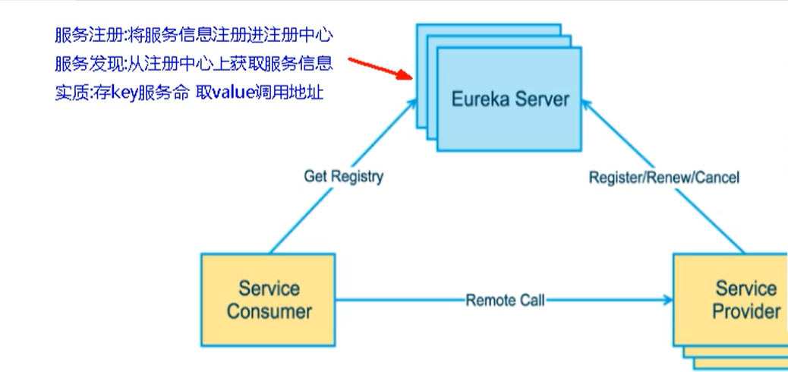
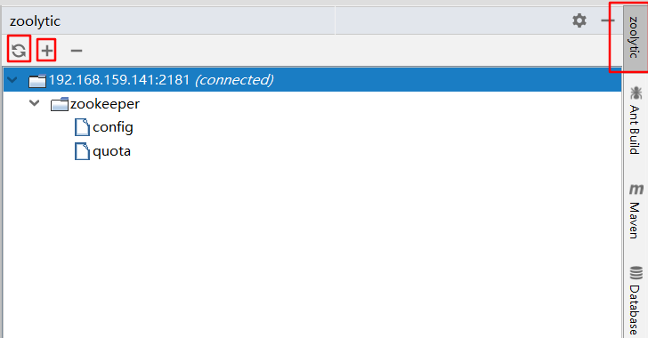
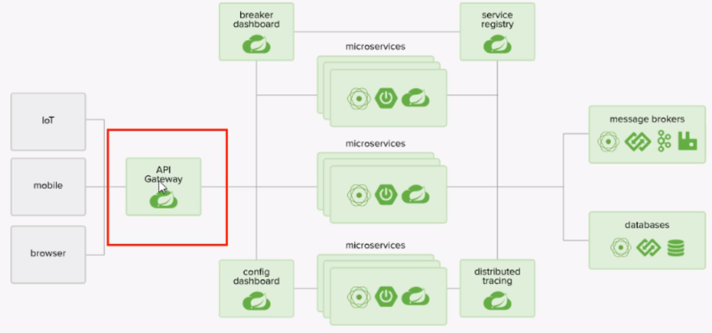

2021.06.28-07.19(15d--84h)

# Eureka  服务注册与发现

## 什么是服务治理

Spring Cloud封装了Netflix 公司开发的Eureka模块来实现服务治理

在传统的RPC远程调用框架中，管理每个服务与服务之间依赖关系比较复杂，管理比较复杂，所以需要使用服务治理，管理服务于服务之间依赖关系，可以实现服务调用、负载均衡、容错等，实现服务发现与注册。

## 什么是服务注册与发现

Eureka采用了CS的设计架构，Eureka Sever作为服务注册功能的服务器，它是服务注册中心。而系统中的其他微服务，使用Eureka的客户端连接到 Eureka Server并维持心跳连接。这样系统的维护人员就可以通过Eureka Server来监控系统中各个微服务是否正常运行。

在服务注册与发现中，有一个注册中心。当服务器启动的时候，会把当前自己服务器的信息比如服务地址通讯地址等以别名方式注册到注册中心上。另一方(消费者服务提供者)，以该别名的方式去注册中心上获取到实际的服务通讯地址，然后再实现本地RPC调用RPC远程调用框架核心设计思想:在于注册中心，因为使用注册中心管理每个服务与服务之间的一个依赖关系(服务治理概念)。在任何RPC远程框架中，都会有一个注册中心存放服务地址相关信息(接口地址)


### Eureka包含两个组件:Eureka Server和Eureka Client

#### Eureka Server提供服务注册服务

​		各个微服务节点通过配置启动后，会在EurekaServer中进行注册，这样EurekaServer中的服务注册表中将会存储所有可用服务节点的信息，服务节点的信息可以在界面中直观看到。

#### EurekaClient通过注册中心进行访问

​		它是一个Java客户端，用于简化Eureka Server的交互，客户端同时也具备一个内置的、使用轮询(round-robin)负载算法的负载均衡器。在应用启动后，将会向Eureka Server发送心跳(默认周期为30秒)。如果Eureka Server在多个心跳周期内没有接收到某个节点的心跳，EurekaServer将会从服务注册表中把这个服务节点移除（默认90秒)


## EurekaServer服务端安装

IDEA生成eurekaServer端服务注册中心，类似物业公司

### 1.创建名为cloud-eureka-server7001的Maven工程

### 2.修改pom.xml

```xml
<!-- eureka新旧版本 -->
<!-- 以前的老版本（2018）-->
<dependency>
    <groupid>org.springframework.cloud</groupId>
    <artifactId>spring-cloud-starter-eureka</artifactId>
</dependency>

<!-- 现在新版本（2020.2）--><!-- 我们使用最新的 -->
<dependency>
    <groupId>org.springframework.cloud</groupId>
    <artifactId>spring-cloud-starter-netflix-eureka-server</artifactId>
</dependency>
```

```xml
<?xml version="1.0" encoding="UTF-8"?>
<project xmlns="http://maven.apache.org/POM/4.0.0"
         xmlns:xsi="http://www.w3.org/2001/XMLSchema-instance"
         xsi:schemaLocation="http://maven.apache.org/POM/4.0.0 http://maven.apache.org/xsd/maven-4.0.0.xsd">
    <parent>
        <artifactId>7_SpringCloud</artifactId>
        <groupId>ppppp</groupId>
        <version>1.0-SNAPSHOT</version>
    </parent>
    <modelVersion>4.0.0</modelVersion>

    <artifactId>cloud-eureka-server7001</artifactId>

    <dependencies>
        <!--eureka-server-->
        <dependency>
            <groupId>org.springframework.cloud</groupId>
            <artifactId>spring-cloud-starter-netflix-eureka-server</artifactId>
        </dependency>
        <!-- 引入自己定义的api通用包，可以使用Payment支付Entity -->
        <dependency>
            <groupId>ppppp</groupId>
            <artifactId>cloud-api-commons</artifactId>
            <version>${project.version}</version>
        </dependency>
        <!--boot web actuator-->
        <dependency>
            <groupId>org.springframework.boot</groupId>
            <artifactId>spring-boot-starter-web</artifactId>
        </dependency>
        <dependency>
            <groupId>org.springframework.boot</groupId>
            <artifactId>spring-boot-starter-actuator</artifactId>
        </dependency>
        <!--一般通用配置-->
        <dependency>
            <groupId>org.springframework.boot</groupId>
            <artifactId>spring-boot-devtools</artifactId>
            <scope>runtime</scope>
            <optional>true</optional>
        </dependency>
        <dependency>
            <groupId>org.projectlombok</groupId>
            <artifactId>lombok</artifactId>
        </dependency>
        <dependency>
            <groupId>org.springframework.boot</groupId>
            <artifactId>spring-boot-starter-test</artifactId>
            <scope>test</scope>
        </dependency>
        <dependency>
            <groupId>junit</groupId>
            <artifactId>junit</artifactId>
        </dependency>
    </dependencies>
</project>
```

### 3.添加application.yml

```yaml
server:
  port: 7001

eureka:
  instance:
    hostname: locathost #eureka服务端的实例名称
  client:
    #false表示不向注册中心注册自己。
    register-with-eureka: false
    #false表示自己端就是注册中心，我的职责就是维护服务实例，并不需要去检索服务
    fetch-registry: false
    service-url:
      #设置与Eureka server交互的地址查询服务和注册服务都需要依赖这个地址。
      defaultZone: http://${eureka.instance.hostname}:${server.port}/eureka/

```

### 4.主启动

```java
package ppppp;

import org.springframework.boot.SpringApplication;
import org.springframework.boot.autoconfigure.SpringBootApplication;
import org.springframework.cloud.netflix.eureka.server.EnableEurekaServer;

/**
 * @author pppppp
 * @date 2021/7/1 11:03
 */
@SpringBootApplication
// 标注为服务端
@EnableEurekaServer
public class EurekaMain7001 {
    public static void main(String[] args){
        SpringApplication.run(EurekaMain7001.class);
    }
}
```


### 5.测试运行

`EurekaMain7001`，浏览器输入`http://localhost:7001/`回车，会查看到Spring Eureka服务主页。


## 支付微服务8001入驻进EurekaServer

EurekaClient端cloud-provider-payment8001将注册进EurekaServer成为服务提供者provider，类似学校对外提供授课服务。

1.修改cloud-provider-payment8001

### 2.改POM

添加spring-cloud-starter-netflix-eureka-client依赖

```xml
<dependency>
    <groupId>org.springframework.cloud</groupId>
    <artifactId>spring-cloud-starter-netflix-eureka-client</artifactId>
</dependency>
```

### 3.写YML

```yaml
eureka:
  client:
    #表示是否将自己注册进Eurekaserver默认为true。
    register-with-eureka: true
    #是否从EurekaServer抓取已有的注册信息，默认为true。单节点无所谓，集群必须设置为true才能配合ribbon使用负载均衡
    fetchRegistry: true
    service-url:
      defaultZone: http://localhost:7001/eureka
```

### 4.主启动

```java
import org.springframework.boot.SpringApplication;
import org.springframework.boot.autoconfigure.SpringBootApplication;
import org.springframework.cloud.netflix.eureka.EnableEurekaClient;

@SpringBootApplication
@EnableEurekaClient//<-----添加该注解
public class PaymentMain001 {

    public static void main(String[] args) {
        SpringApplication.run(PaymentMain001.class, args);
    }
}
```

### 5.测试

启动cloud-provider-payment8001和cloud-eureka-server7001工程。

浏览器输入 - http://localhost:7001/ 主页内的Instances currently registered with Eureka会显示cloud-provider-payment8001的配置文件application.yml设置的应用名cloud-payment-service

### 6.自我保护机制

EMERGENCY! EUREKA MAY BE INCORRECTLY CLAIMING INSTANCES ARE UP WHEN THEY’RE NOT. RENEWALS ARELESSER THAN THRESHOLD AND HENCFT ARE NOT BEING EXPIRED JUST TO BE SAFE.

​		紧急情况！EUREKA可能错误地声称实例在没有启动的情况下启动了。续订小于阈值，因此实例不会为了安全而过期。

## 订单微服务80入驻进EurekaServer

EurekaClient端cloud-consumer-order80将注册进EurekaServer成为服务消费者consumer，类似来上课消费的同学

### 1.cloud-consumer-order80

### 2.POM

```xml
<dependency>
    <groupId>org.springframework.cloud</groupId>
    <artifactId>spring-cloud-starter-netflix-eureka-client</artifactId>
</dependency>
```

### 3.YML

```yaml
server:
  port: 80

spring:
  application:
    name: cloud-order-service

eureka:
  client:
    #表示是否将自己注册进Eurekaserver默认为true。
    register-with-eureka: true
    #是否从EurekaServer抓取已有的注册信息，默认为true。单节点无所谓，集群必须设置为true才能配合ribbon使用负载均衡
    fetchRegistry: true
    service-url:
      defaultZone: http://localhost:7001/eureka

```

### 4.主启动

```java
package ppppp;

import org.springframework.boot.SpringApplication;
import org.springframework.boot.autoconfigure.SpringBootApplication;
import org.springframework.cloud.netflix.eureka.EnableEurekaClient;

/**
 * @author pppppp
 * @date 2021/6/30 16:36
 */
@SpringBootApplication
@EnableEurekaClient
public class OrderMain80 {
    public static void main(String[] args){
        SpringApplication.run(OrderMain80.class,args);
    }
}
```

### 5.测试

​		启动cloud-provider-payment8001、cloud-eureka-server7001和cloud-consumer-order80这三工程。
​		浏览器输入 http://localhost:7001 , 在主页的Instances currently registered with Eureka将会看到cloud-provider-payment8001、cloud-consumer-order80两个工程名。


## Eureka 集群

没有集群带来的高可用，会带来单点故障

### Eureka工作原理

- 服务注册：将服务信息注册进注册中心
- 服务发现：从注册中心上获取服务信息
- 实质：存key服务命名，取value调用地址

1. 先启动eureka注册中心
2. 启动服务提供者payment支付服务
3. 支付服务启动后，会把自身信息（比如 服务地址以别名方式注册进eureka）
4. 消费者order服务在调用接口时候使用服务别名去注册中心获取实际的RPC远程调用地址
5. 消费者获得调用地址后，底层实际是利用HttpClient技术实现远程调用
6. 消费者获取服务地址后会缓存在本地JVM内存中，默认每隔30秒更新一次服务调用地址



微服务RPC远程调用最核心的就是：高可用

因为假设注册中心只有一个，如果出现了故障，那么将会导致整个微服务不可用，所以需要搭建Eureka注册中心集群，实现负载均衡 + 故障容错

### Eureka集群原理

互相注册，相互守望


### Eureka集群环境构建

- 创建cloud-eureka-server7002工程

- 找到C:\Windows\System32\drivers\etc路径下的hosts文件，修改映射配置添加进hosts文件

  ```xml
  127.0.0.1 eureka7001.com
  127.0.0.1 eureka7002.com
  ```

- 修改cloud-eureka-server7001配置文件

  ```yaml
  server:
    port: 7001
  
  eureka:
    instance:
      hostname: eureka7001.com #eureka服务端的实例名称
    client:
      register-with-eureka: false     #false表示不向注册中心注册自己。
      fetch-registry: false     #false表示自己端就是注册中心，我的职责就是维护服务实例，并不需要去检索服务
      service-url:
      #集群指向其它eureka
        defaultZone: http://eureka7002.com:7002/eureka/
      #单机就是7001自己
        #defaultZone: http://eureka7001.com:7001/eureka/
  
  ```

- 修改cloud-eureka-server7002配置文件

  ```yaml
  server:
    port: 7002
  
  eureka:
    instance:
      hostname: eureka7002.com #eureka服务端的实例名称
    client:
      register-with-eureka: false     #false表示不向注册中心注册自己。
      fetch-registry: false     #false表示自己端就是注册中心，我的职责就是维护服务实例，并不需要去检索服务
      service-url:
      #集群指向其它eureka
        defaultZone: http://eureka7001.com:7001/eureka/
      #单机就是7002自己
        #defaultZone: http://eureka7002.com:7002/eureka/
  ```

- 测试

  ```xml
  访问 ：http://eureka7001.com:7001/  可以看到两者相互为副本
  访问 ：http://eureka7002.com:7002/
  ```

### 订单支付两微服务注册进Eureka集群

- 将支付服务8001微服务，订单服务80微服务发布到上面2台Eureka集群配置中

将它们的配置文件的eureka.client.service-url.defaultZone进行修改

```yaml
eureka:
  client:
    #表示是否将自己注册进Eurekaserver默认为true。
    register-with-eureka: true
    #是否从EurekaServer抓取已有的注册信息，默认为true。单节点无所谓，集群必须设置为true才能配合ribbon使用负载均衡
    fetchRegistry: true
    service-url:
      defaultZone: http://eureka7001.com:7001/eureka, http://eureka7002.com:7002/eureka
```

- 测试01
  1. 先要启动EurekaServer，7001/7002服务
  2. 再要启动服务提供者provider，8001
  3. 再要启动消费者，80
  4. 浏览器输入 - http://localhost/consumer/payment/get/1

### 支付微服务集群配置

支付服务提供者8001集群环境构建

参考cloud-provicer-payment8001

#### 1.新建cloud-provider-payment8002

#### 2.改POM

#### 3.写YML - 端口8002

#### 4.主启动

5.业务类

修改8001/8002的Controller，添加serverPort

```java
package ppppp.controller;

import lombok.extern.slf4j.Slf4j;
import org.springframework.beans.factory.annotation.Value;
import org.springframework.web.bind.annotation.*;
import ppppp.entities.CommonResult;
import ppppp.entities.Payment;
import ppppp.service.PaymentService;

import javax.annotation.Resource;

/**
 * @author pppppp
 * @date 2021/6/30 15:12
 */
@RestController
@Slf4j
public class PaymentController {
    @Resource
    private PaymentService paymentService;

    @Value("${server.port}")
    private String serverPort;//添加serverPort


    @PostMapping(value = "/payment/create")
    public CommonResult create(@RequestBody Payment payment)
    {
        int result = paymentService.create(payment);
        log.info("*****插入结果："+result+"----server.port  is " + serverPort);

        if(result > 0)
        {
            return new CommonResult(200,"插入数据库成功,serverPort: "+serverPort,result);
        }else{
            return new CommonResult(444,"插入数据库失败",null);
        }
    }

    @GetMapping(value = "/payment/get/{id}")
    public CommonResult<Payment> getPaymentById(@PathVariable("id") Long id)
    {
        Payment payment = paymentService.getPaymentById(id);

        if(payment != null)
        {
            return new CommonResult(200,"查询成功,serverPort:  "+serverPort,payment);
            log.info("200  查询成功 " + payment +"  ----server.port  is " + serverPort);  
        }else{
            log.info("没有对应记录  " + payment +"----server.port  is " + serverPort);
            return new CommonResult(444,"没有对应记录,查询ID: "+id,null);
        }
    }
}

```

#### 6.测试

相互关联，且支付服务启动了两个


两个支付服务 **8001端口 和 8002 端口** 均可调用


客服端服务也可用，但一直都是访问的8001端口


#### **7.负载均衡**

cloud-consumer-order80订单服务访问地址不能写死

```java
@Slf4j
@RestController
public class OrderController {

    //public static final String PAYMENT_URL = "http://localhost:8001";
    public static final String PAYMENT_URL = "http://CLOUD-PAYMENT-SERVICE";
    
    ...
}
```

使用@LoadBalanced注解赋予RestTemplate负载均衡的能力

```java
import org.springframework.cloud.client.loadbalancer.LoadBalanced;
import org.springframework.context.annotation.Bean;
import org.springframework.context.annotation.Configuration;
import org.springframework.web.client.RestTemplate;

@Configuration
public class ApplicationContextConfig {

    @Bean
    @LoadBalanced//使用@LoadBalanced注解赋予RestTemplate负载均衡的能力
    public RestTemplate getRestTemplate(){
        return new RestTemplate();
    }
}
```

浏览器输入 - http://localhost/consumer/payment/get/1

结果：负载均衡效果达到，8001/8002端口==交替出现==

Ribbon和Eureka整合后Consumer可以直接调用服务而不用再关心地址和端口号，且该服务还有负载功能。

相互注册，相互守望

## actuator微服务信息完善

主机名称：服务名称修改（也就是将IP地址，换成可读性高的名字）

修改cloud-provider-payment8001，cloud-provider-payment8002

```yaml
eureka:
  ...
  instance:
    instance-id: payment8001 #添加此处

```

修改之后eureka主页将显示payment8001，payment8002代替原来显示的IP地址。


访问信息有IP信息提示，（就是将鼠标指针移至payment8001，payment8002名下，会有IP地址提示）

```yaml
eureka:
  ...
  instance:
    instance-id: payment8002
    prefer-ip-address: true #添加此处
```

## 服务发现Discovery

对于注册进eureka里面的微服务，可以通过服务发现来获得该服务的信息

- 修改cloud-provider-payment8001的Controller

```java
@RestController
@Slf4j
public class PaymentController{
	...
    
    @Resource
    private DiscoveryClient discoveryClient;

    ...

    @GetMapping(value = "/payment/discovery")
    public Object discovery()
    {
        List<String> services = discoveryClient.getServices();
        for (String element : services) {
            log.info("*****element: "+element);
        }

        List<ServiceInstance> instances = discoveryClient.getInstances("CLOUD-PAYMENT-SERVICE");
        for (ServiceInstance instance : instances) {
            log.info(instance.getServiceId()+"\t"+instance.getHost()+"\t"+instance.getPort()+"\t"+instance.getUri());
        }

        return this.discoveryClient;
    }
}
```

- 8001主启动类

  ```java
  @SpringBootApplication
  @EnableEurekaClient
  @EnableDiscoveryClient//添加该注解
  public class PaymentMain001 {
  
      public static void main(String[] args) {
          SpringApplication.run(PaymentMain001.class, args);
      }
  }
  
  ```

浏览器输入http://localhost:8001/payment/discovery

浏览器输出：

```properties
{"services":["cloud-payment-service","cloud-order-service"],"order":0}
```

后台输出：

```properties
 *****element: cloud-payment-service
*****element: cloud-order-service
ppppp.controller.PaymentController       : CLOUD-PAYMENT-SERVICE	192.168.148.1	8002	http://192.168.148.1:8002
ppppp.controller.PaymentController       : CLOUD-PAYMENT-SERVICE	192.168.148.1	8001	http://192.168.148.1:8001
```

## Eureka自我保护理论知识

### 概述

​		保护模式主要用于一组客户端和Eureka Server之间存在网络分区场景下的保护。一旦进入保护模式，Eureka Server将会尝试保护其服务注册表中的信息，不再删除服务注册表中的数据，也就是不会注销任何微服务。

如果在Eureka Server的首页看到以下这段提示，则说明Eureka进入了保护模式:

EMERGENCY! EUREKA MAY BE INCORRECTLY CLAIMING INSTANCES ARE UP WHEN THEY’RE NOT. RENEWALS ARE LESSER THANTHRESHOLD AND HENCE THE INSTANCES ARE NOT BEING EXPIRED JUSTTO BE SAFE

### 导致原因

​		一句话：某时刻某一个微服务不可用了，Eureka不会立刻清理，依旧会对该微服务的信息进行保存。

​		属于CAP里面的AP分支。

为什么会产生Eureka自我保护机制?

​		为了EurekaClient可以正常运行，防止与EurekaServer网络不通情况下，EurekaServer不会立刻将EurekaClient服务剔除

### 什么是自我保护模式?

​		默认情况下，如果EurekaServer在一定时间内没有接收到某个微服务实例的心跳，EurekaServer将会注销该实例(默认90秒)。但是当网络分区故障发生(延时、卡顿、拥挤)时，微服务与EurekaServer之间无法正常通信，以上行为可能变得非常危险了——因为微服务本身其实是健康的，此时本不应该注销这个微服务。Eureka通过“自我保护模式”来解决这个问题——当EurekaServer节点在短时间内丢失过多客户端时(可能发生了网络分区故障)，那么这个节点就会进入自我保护模式。


自我保护机制∶默认情况下EurekaClient定时向EurekaServer端发送心跳包

​		如果Eureka在server端在一定时间内(默认90秒)没有收到EurekaClient发送心跳包，便会直接从服务注册列表中剔除该服务，但是在短时间( 90秒中)内丢失了大量的服务实例心跳，这时候Eurekaserver会开启自我保护机制，不会剔除该服务（该现象可能出现在如果网络不通但是EurekaClient为出现宕机，此时如果换做别的注册中心如果一定时间内没有收到心跳会将剔除该服务，这样就出现了严重失误，因为客户端还能正常发送心跳，只是网络延迟问题，而保护机制是为了解决此问题而产生的)。

​		在自我保护模式中，Eureka Server会保护服务注册表中的信息，不再注销任何服务实例。

​		它的设计哲学就是宁可保留错误的服务注册信息，也不盲目注销任何可能健康的服务实例。一句话讲解：好死不如赖活着。

​		综上，自我保护模式是一种应对网络异常的安全保护措施。它的架构哲学是**宁可同时保留所有微服务（健康的微服务和不健康的微服务都会保留）也不盲目注销任何健康的微服务。**使用自我保护模式，可以让Eureka集群更加的健壮、稳定。

怎么禁止自我保护

- 在eurekaServer端7001处设置关闭自我保护机制

出厂默认，自我保护机制是开启的

使用`eureka.server.enable-self-preservation = false`可以禁用自我保护模式

```yaml
eureka:
  ...
  server:
    #关闭自我保护机制，保证不可用服务被及时踢除
    enable-self-preservation: false
    eviction-interval-timer-in-ms: 2000
```

关闭效果：

spring-eureka主页会显示出一句：

THE SELF PRESERVATION MODE IS TURNED OFF. THIS MAY NOT PROTECT INSTANCE EXPIRY IN CASE OF NETWORK/OTHER PROBLEMS.

生产者客户端eureakeClient端8001
默认：

eureka.instance.lease-renewal-interval-in-seconds=30

eureka.instance.lease-expiration-duration-in-seconds=90

```yaml
eureka:
  ...
  instance:
    instance-id: payment8001
    prefer-ip-address: true
    #心跳检测与续约时间
    #开发时没置小些，保证服务关闭后注册中心能即使剔除服务
    #Eureka客户端向服务端发送心跳的时间间隔，单位为秒(默认是30秒)
    lease-renewal-interval-in-seconds: 1
    #Eureka服务端在收到最后一次心跳后等待时间上限，单位为秒(默认是90秒)，超时将剔除服务
    lease-expiration-duration-in-seconds: 2
```

- 测试
  - 7001和8001都配置完成
  - 先启动7001再启动8001

结果：先关闭8001，==马上被删除==了

## Eureka停更说明

https://github.com/Netflix/eureka/wiki

Eureka 2.0 (Discontinued)

The existing open source work on eureka 2.0 is discontinued. The code base and artifacts that were released as part of the existing repository of work on the 2.x branch is considered use at your own risk.

Eureka 1.x is a core part of Netflix’s service discovery system and is still an active project.

# zookeeper注册服务


## 支付服务注册进zookeeper

### 在centos中安装zookeeper

打开 2181，2888，3888  三个端口

```bash
firewall-cmd --zone=public --add-port= 2181/tcp --permanent
firewall-cmd --zone=public --add-port= 2888/tcp --permanent
firewall-cmd --zone=public --add-port= 3888/tcp --permanent
firewall-cmd --reload 
success
[root@centos-2 ~]# firewall-cmd --zone=public --list-ports  
```

#### 使用docker进行安装

```bash
# 1.下载：
docker pull zookeeper:3.4.9
# 2.查看镜像详情
[root@centos-2 ~]# docker images
REPOSITORY   TAG                IMAGE ID       CREATED        SIZE
zookeeper    latest             50d238989423   6 days ago     269MB
nginx        <none>             62d49f9bab67   2 months ago   133MB
tomcat       latest             bd431ca8553c   2 months ago   667MB
rabbitmq     3.7.7-management   2888deb59dfc   2 years ago    149MB
zookeeper    3.4.9              3b83d9104a4c   4 years ago    129MB

# 3.运行容器
[root@localhost admin]# docker run -d -p 2181:2181 --name some-zookeeper --restart always 3b83d9104a4c
d5c6f857cd88c342acf63dd58e838a4cdf912daa6c8c0115091147136e819307

# 4.查看容器运行状态
[root@localhost admin]# docker exec -it e283f976da8c bash
[root@centos-2 ~]# docker ps
CONTAINER ID   IMAGE          COMMAND                  CREATED          STATUS         PORTS                                                           NAMES
d735a2b7f248   3b83d9104a4c   "/docker-entrypoint.…"   15 seconds ago   Up 8 seconds   2888/tcp, 0.0.0.0:2181->2181/tcp, :::2181->2181/tcp, 3888/tcp   some-zookeeper

# 5.进入容器中
[root@centos-2 ~]# docker exec -it d7 bash

# 6.启动 zookeeper   服务端
bash-4.3# ./zkServer.sh start
ZooKeeper JMX enabled by default
Using config: /conf/zoo.cfg
Starting zookeeper ... STARTED

# 7.启动客户端
bash-4.3# ./zkCli.sh 
Connecting to localhost:2181
2021-07-02 07:54:54,909 [myid:] - 
....
```

### 在idea中安装 zoolytic--zookeeper-tool 插件

- 添加ip
- 刷新 显示已连接



### 搭建模块

#### 1.新建cloud-provider-payment8004模块

#### 2.POM

```xml
<?xml version="1.0" encoding="UTF-8"?>
<project xmlns="http://maven.apache.org/POM/4.0.0"
         xmlns:xsi="http://www.w3.org/2001/XMLSchema-instance"
         xsi:schemaLocation="http://maven.apache.org/POM/4.0.0 http://maven.apache.org/xsd/maven-4.0.0.xsd">
    <parent>
        <artifactId>7_SpringCloud</artifactId>
        <groupId>ppppp</groupId>
        <version>1.0-SNAPSHOT</version>
    </parent>
    <modelVersion>4.0.0</modelVersion>

    <artifactId>cloud-provider-payment8004</artifactId>


    <dependencies>
        <!-- SpringBoot整合Web组件 -->
        <dependency>
            <groupId>org.springframework.boot</groupId>
            <artifactId>spring-boot-starter-web</artifactId>
        </dependency>
        <dependency><!-- 引入自己定义的api通用包，可以使用Payment支付Entity -->
            <groupId>com.lun.springcloud</groupId>
            <artifactId>cloud-api-commons</artifactId>
            <version>${project.version}</version>
        </dependency>
        <!-- SpringBoot整合zookeeper客户端 -->
        <dependency>
            <groupId>org.springframework.cloud</groupId>
            <artifactId>spring-cloud-starter-zookeeper-discovery</artifactId>
            <!--先排除自带的zookeeper3.5.3 防止与3.4.9起冲突-->
            <exclusions>
                <exclusion>
                    <groupId>org.apache.zookeeper</groupId>
                    <artifactId>zookeeper</artifactId>
                </exclusion>
            </exclusions>
        </dependency>
        <!--添加zookeeper3.4.9版本-->
        <dependency>
            <groupId>org.apache.zookeeper</groupId>
            <artifactId>zookeeper</artifactId>
            <version>3.7.0</version>
        </dependency>
        <dependency>
            <groupId>org.springframework.boot</groupId>
            <artifactId>spring-boot-devtools</artifactId>
            <scope>runtime</scope>
            <optional>true</optional>
        </dependency>
        <dependency>
            <groupId>org.projectlombok</groupId>
            <artifactId>lombok</artifactId>
            <optional>true</optional>
        </dependency>
        <dependency>
            <groupId>org.springframework.boot</groupId>
            <artifactId>spring-boot-starter-test</artifactId>
            <scope>test</scope>
        </dependency>
    </dependencies>

</project>
```

#### 3.YML

```yaml
#8004表示注册到zookeeper服务器的支付服务提供者端口号
server:
  port: 8004

#服务别名----注册zookeeper到注册中心名称
spring:
  application:
    name: cloud-provider-payment
  cloud:
    zookeeper:
      connect-string: 192.168.159.141:2181 # 
#      connect-string: 127.0.0.1:2181 # 192.168.111.144:2181 #
```

#### 4.主启动

```java
package ppppp;

import org.springframework.boot.SpringApplication;
import org.springframework.boot.autoconfigure.SpringBootApplication;
import org.springframework.cloud.client.discovery.EnableDiscoveryClient;

/**
 * @author pppppp
 * @date 2021/7/2 15:28
 */
@SpringBootApplication
@EnableDiscoveryClient//该注解用于向使用consul或者zookeeper作为注册中心时注册服务
public class PaymentMain8004 {
    public static void main(String[] args) {
        SpringApplication.run(PaymentMain8004.class, args);
    }
}
```

#### 5.业务类

```java
package ppppp.controller;

import lombok.extern.slf4j.Slf4j;
import org.springframework.beans.factory.annotation.Value;
import org.springframework.web.bind.annotation.RequestMapping;
import org.springframework.web.bind.annotation.RestController;

import java.util.UUID;

/**
 * @author pppppp
 * @date 2021/7/2 15:30
 */
@Slf4j
@RestController
public class PaymentController {
    @Value("${server.port}")
    private String serverPort;

    @RequestMapping(value = "/payment/zk")
    public String paymentzk()
    {
        return "springcloud with zookeeper: "+serverPort+"\t"+ UUID.randomUUID().toString();
    }
}
```


#### 6.验证测试

启动8004注册进zookeeper（要先启动zookeeper的server）

- 验证测试：浏览器 - http://localhost:8004/payment/zk

  产生随机id

- 验证测试2 ：接着用zookeeper客户端操作

```bash
[zk: localhost:2181(CONNECTED) 7] ls /
[services, zookeeper]
[zk: localhost:2181(CONNECTED) 8] ls /services
[cloud-provider-payment]
[zk: localhost:2181(CONNECTED) 10] ls /services/cloud-provider-payment
[d7bc79b8-fed6-41b1-891c-74b0f9728cad]
[zk: localhost:2181(CONNECTED) 11] get /services/cloud-provider-payment/d7bc79b8-fed6-41b1-891c-74b0f9728cad
{"name":"cloud-provider-payment","id":"d7bc79b8-fed6-41b1-891c-74b0f9728cad","address":"localhost","port":8004,"sslPort":null,"payload":{"@class":"org.springframework.cloud.zookeeper.discovery.ZookeeperInstance","id":"application-1","name":"cloud-provider-payment","metadata":{}},"registrationTimeUTC":1625213345593,"serviceType":"DYNAMIC","uriSpec":{"parts":[{"value":"scheme","variable":true},{"value":"://","variable":false},{"value":"address","variable":true},{"value":":","variable":false},{"value":"port","variable":true}]}}
cZxid = 0x9
ctime = Fri Jul 02 08:09:09 GMT 2021
mZxid = 0x9
mtime = Fri Jul 02 08:09:09 GMT 2021
pZxid = 0x9
cversion = 0
dataVersion = 0
aclVersion = 0
ephemeralOwner = 0x17a6633bf430003
dataLength = 530
numChildren = 0
```

## 临时还是持久节点

ZooKeeper的服务节点是**临时节点**，没有Eureka那含情脉脉。

```bash
# 手动停止服务  不会马上消失
[zk: localhost:2181(CONNECTED) 12] ls /services/cloud-provider-payment                                      
[d7bc79b8-fed6-41b1-891c-74b0f9728cad]
[zk: localhost:2181(CONNECTED) 13] ls /services/cloud-provider-payment
[d7bc79b8-fed6-41b1-891c-74b0f9728cad]
[zk: localhost:2181(CONNECTED) 14] ls /services/cloud-provider-payment
[d7bc79b8-fed6-41b1-891c-74b0f9728cad]

#一段时间后 服务不可见
[zk: localhost:2181(CONNECTED) 15] ls /services/cloud-provider-payment
[]

# 重新启动服务后 流水号 发生改变
[zk: localhost:2181(CONNECTED) 16] ls /services/cloud-provider-payment
[fd492e8a-d9bb-42c8-950e-9286c4e22d2a]

```


## 订单服务注册进zookeeper

### 1.新建cloud-consumerzk-order80

### 2.POM

```xml
<?xml version="1.0" encoding="UTF-8"?>
<project xmlns="http://maven.apache.org/POM/4.0.0"
         xmlns:xsi="http://www.w3.org/2001/XMLSchema-instance"
         xsi:schemaLocation="http://maven.apache.org/POM/4.0.0 http://maven.apache.org/xsd/maven-4.0.0.xsd">
    <parent>
        <artifactId>7_SpringCloud</artifactId>
        <groupId>ppppp</groupId>
        <version>1.0-SNAPSHOT</version>
    </parent>
    <modelVersion>4.0.0</modelVersion>

    <artifactId>cloud-consumerzk-order80</artifactId>

    <dependencies>
        <!-- SpringBoot整合Web组件 -->
        <dependency>
            <groupId>org.springframework.boot</groupId>
            <artifactId>spring-boot-starter-web</artifactId>
        </dependency>
        <!-- SpringBoot整合zookeeper客户端 -->
        <dependency>
            <groupId>org.springframework.cloud</groupId>
            <artifactId>spring-cloud-starter-zookeeper-discovery</artifactId>
            <!--先排除自带的zookeeper-->
            <exclusions>
                <exclusion>
                    <groupId>org.apache.zookeeper</groupId>
                    <artifactId>zookeeper</artifactId>
                </exclusion>
            </exclusions>
        </dependency>
        <!--添加zookeeper3.4.9版本-->
        <dependency>
            <groupId>org.apache.zookeeper</groupId>
            <artifactId>zookeeper</artifactId>
            <version>3.4.9</version>
        </dependency>
        <dependency>
            <groupId>org.springframework.boot</groupId>
            <artifactId>spring-boot-devtools</artifactId>
            <scope>runtime</scope>
            <optional>true</optional>
        </dependency>
        <dependency>
            <groupId>org.projectlombok</groupId>
            <artifactId>lombok</artifactId>
            <optional>true</optional>
        </dependency>
        <dependency>
            <groupId>org.springframework.boot</groupId>
            <artifactId>spring-boot-starter-test</artifactId>
            <scope>test</scope>
        </dependency>
    </dependencies>
</project>
```

### 3.YML

```yaml
#80 表示注册到zookeeper服务器的支付服务提供者端口号
server:
  port: 80

#服务别名----注册zookeeper到注册中心名称
spring:
  application:
    name: cloud-consumer-order
  cloud:
    zookeeper:
      connect-string: 192.168.159.141:2181 #
#      connect-string: 127.0.0.1:2181 # 192.168.111.144:2181 #
```

### 4.主启动

```java
import org.springframework.boot.SpringApplication;
import org.springframework.boot.autoconfigure.SpringBootApplication;
import org.springframework.cloud.client.discovery.EnableDiscoveryClient;

@SpringBootApplication
@EnableDiscoveryClient
public class OrderZKMain80 {
    public static void main(String[] args) {
        SpringApplication.run(OrderZKMain80.class, args);
    }
}
```

### 5.业务类

```java
import org.springframework.cloud.client.loadbalancer.LoadBalanced;
import org.springframework.context.annotation.Bean;
import org.springframework.context.annotation.Configuration;
import org.springframework.web.client.RestTemplate;

@Configuration
public class ApplicationContextConfig
{
    @Bean
    @LoadBalanced
    public RestTemplate getRestTemplate()
    {
        return new RestTemplate();
    }
}


import javax.annotation.Resource;

@RestController
@Slf4j
public class OrderZKController
{
    public static final String INVOKE_URL = "http://cloud-provider-payment";

    @Resource
    private RestTemplate restTemplate;

    @GetMapping(value = "/consumer/payment/zk")
    public String paymentInfo()
    {
        String result = restTemplate.getForObject(INVOKE_URL+"/payment/zk",String.class);
        return result;
    }
}

```


### 6.验证测试

运行ZooKeeper服务端，cloud-consumerzk-order80，cloud-provider-payment8004。

打开ZooKeeper客户端：

```bash
[zk: localhost:2181(CONNECTED) 0] ls /
[services, zookeeper]
[zk: localhost:2181(CONNECTED) 1] ls /services
[cloud-consumer-order, cloud-provider-payment]
[zk: localhost:2181(CONNECTED) 2]
```

### 7.访问测试地址 

 http://localhost/consumer/payment/zk

```
springcloud with zookeeper: 8004 d99f7d2d-602f-4c81-aa5c-82ef5e4dee5d
```

## zookeeper 集群--待点亮

# Consul简介

​		Consul是一套开源的分布式**服务发现和配置管理系统**，由HashiCorp 公司用**Go**语言开发。

​		提供了微服务系统中的服务治理、配置中心、控制总线等功能。这些功能中的每一个都可以根据需要单独使用，也可以一起使用以构建全方位的服务网格，总之Consul提供了一种完整的服务网格解决方案。

​		它具有很多优点。包括：基于raft协议，比较简洁；支持健康检查，同时支持HTTP和DNS协议支持跨数据中心的WAN集群提供图形界面跨平台，支持Linux、Mac、Windows。

## 能干嘛？

- 服务发现 - 提供HTTP和DNS两种发现方式。
- 健康监测 - 支持多种方式，HTTP、TCP、Docker、Shell脚本定制化
- KV存储 - Key、Value的存储方式
- 多数据中心 - Consul支持多数据中心
- 可视化Web界面

## 安装并运行Consul

[Consul下载地址](https://www.consul.io/downloads),1.10.0的版本有点bug，1.6.0的可以

windows版解压缩后，得consul.exe，打开cmd

- 查看版本`consul -v`：

```bash
D:\MyJava\Java学习日记\14-SpringCloud\SpringCloud2020\3_搭建Eureka集群\consul>consul -v
Consul v1.6.0
Protocol 2 spoken by default, understands 2 to 3 (agent will automatically use protocol >2 when speaking to compatible agents)

D:\MyJava\Java学习日记\14-SpringCloud\SpringCloud2020\3_搭建Eureka集群\consul>consul agent -dev
==> Starting Consul agent...
           Version: 'v1.6.0'
           Node ID: 'a328e9cc-63d7-ec04-491d-0b708007be63'
         Node name: 'lppppp'
        Datacenter: 'dc1' (Segment: '<all>')
            Server: true (Bootstrap: false)
       Client Addr: [127.0.0.1] (HTTP: 8500, HTTPS: -1, gRPC: 8502, DNS: 8600)
      Cluster Addr: 127.0.0.1 (LAN: 8301, WAN: 8302)
           Encrypt: Gossip: false, TLS-Outgoing: false, TLS-Incoming: false, Auto-Encrypt-TLS: false

==> Log data will now stream in as it occurs:
...
```

- 开发模式启动`consul agent -dev`：

浏览器输入 - http://localhost:8500/ - 打开Consul控制页


## 服务提供者注册进Consul

1.新建Module支付服务 `cloud-providerconsul-payment8006`

2.POM

```xml
<?xml version="1.0" encoding="UTF-8"?>
<project xmlns="http://maven.apache.org/POM/4.0.0"
         xmlns:xsi="http://www.w3.org/2001/XMLSchema-instance"
         xsi:schemaLocation="http://maven.apache.org/POM/4.0.0 http://maven.apache.org/xsd/maven-4.0.0.xsd">
    <parent>
        <artifactId>7_SpringCloud</artifactId>
        <groupId>ppppp</groupId>
        <version>1.0-SNAPSHOT</version>
    </parent>
    <modelVersion>4.0.0</modelVersion>

    <artifactId>cloud-providerconsul-payment8006</artifactId>

    <dependencies>
        <!-- 引入自己定义的api通用包，可以使用Payment支付Entity -->
        <dependency>
            <groupId>ppppp</groupId>
            <artifactId>cloud-api-commons</artifactId>
            <version>${project.version}</version>
        </dependency>
        <!--SpringCloud consul-server -->
        <dependency>
            <groupId>org.springframework.cloud</groupId>
            <artifactId>spring-cloud-starter-consul-discovery</artifactId>
        </dependency>
        <!-- SpringBoot整合Web组件 -->
        <dependency>
            <groupId>org.springframework.boot</groupId>
            <artifactId>spring-boot-starter-web</artifactId>
        </dependency>
        <dependency>
            <groupId>org.springframework.boot</groupId>
            <artifactId>spring-boot-starter-actuator</artifactId>
        </dependency>
        <!--日常通用jar包配置-->
        <dependency>
            <groupId>org.springframework.boot</groupId>
            <artifactId>spring-boot-devtools</artifactId>
            <scope>runtime</scope>
            <optional>true</optional>
        </dependency>
        <dependency>
            <groupId>org.projectlombok</groupId>
            <artifactId>lombok</artifactId>
            <optional>true</optional>
        </dependency>
        <dependency>
            <groupId>org.springframework.boot</groupId>
            <artifactId>spring-boot-starter-test</artifactId>
            <scope>test</scope>
        </dependency>
        <dependency>
            <groupId>cn.hutool</groupId>
            <artifactId>hutool-all</artifactId>
            <version>RELEASE</version>
            <scope>test</scope>
        </dependency>
        <dependency>
            <groupId>cn.hutool</groupId>
            <artifactId>hutool-all</artifactId>
            <version>RELEASE</version>
            <scope>test</scope>
        </dependency>
    </dependencies>

</project>
```

3.YML

```yaml
###consul服务端口号
server:
  port: 8006

spring:
  application:
    name: consul-provider-payment
  ####consul注册中心地址
  cloud:
    consul:
      host: localhost
      port: 8500
      discovery:
        #hostname: 127.0.0.1
        service-name: ${spring.application.name}
```

4.主启动类

```java
package ppppp;

/**
 * @author pppppp
 * @date 2021/7/8 21:50
 */
import org.springframework.boot.SpringApplication;
import org.springframework.boot.autoconfigure.SpringBootApplication;
import org.springframework.cloud.client.discovery.EnableDiscoveryClient;

@SpringBootApplication
@EnableDiscoveryClient
public class PaymentMain8006
{
    public static void main(String[] args) {
        SpringApplication.run(PaymentMain8006.class, args);
    }
}
```

5.业务类Controller

```java
package ppppp.controller;

/**
 * @author pppppp
 * @date 2021/7/8 21:51
 */
import lombok.extern.slf4j.Slf4j;
import org.springframework.beans.factory.annotation.Value;
import org.springframework.web.bind.annotation.RequestMapping;
import org.springframework.web.bind.annotation.RestController;

import java.util.UUID;

@RestController
@Slf4j
public class PaymentController
{
    @Value("${server.port}")
    private String serverPort;

    @RequestMapping(value = "/payment/consul")
    public String paymentConsul()
    {
        return "springcloud with consul: "+serverPort+"\t   "+ UUID.randomUUID().toString();
    }
}
```

6.验证测试

- 访问 http://localhost:8006/payment/consul 刷新显示不同的uuid


- http://localhost:8500 - 会显示 provider8006 的服务名称

  

按照同样的方式，在启动一个服务生产者 8007，会看到如下


## 服务消费者注册进Consul

1.新建Module消费服务order80 - cloud-consumerconsul-order80

2.POM

```xml
<?xml version="1.0" encoding="UTF-8"?>
<project xmlns="http://maven.apache.org/POM/4.0.0"
         xmlns:xsi="http://www.w3.org/2001/XMLSchema-instance"
         xsi:schemaLocation="http://maven.apache.org/POM/4.0.0 http://maven.apache.org/xsd/maven-4.0.0.xsd">
    <parent>
        <artifactId>7_SpringCloud</artifactId>
        <groupId>ppppp</groupId>
        <version>1.0-SNAPSHOT</version>
    </parent>
    <modelVersion>4.0.0</modelVersion>

    <artifactId>cloud-consumerconsul-order80</artifactId>


    <dependencies>
        <!--SpringCloud consul-server -->
        <dependency>
            <groupId>org.springframework.cloud</groupId>
            <artifactId>spring-cloud-starter-consul-discovery</artifactId>
        </dependency>
        <!-- SpringBoot整合Web组件 -->
        <dependency>
            <groupId>org.springframework.boot</groupId>
            <artifactId>spring-boot-starter-web</artifactId>
        </dependency>
        <dependency>
            <groupId>org.springframework.boot</groupId>
            <artifactId>spring-boot-starter-actuator</artifactId>
        </dependency>
        <!--日常通用jar包配置-->
        <dependency>
            <groupId>org.springframework.boot</groupId>
            <artifactId>spring-boot-devtools</artifactId>
            <scope>runtime</scope>
            <optional>true</optional>
        </dependency>
        <dependency>
            <groupId>org.projectlombok</groupId>
            <artifactId>lombok</artifactId>
            <optional>true</optional>
        </dependency>
        <dependency>
            <groupId>org.springframework.boot</groupId>
            <artifactId>spring-boot-starter-test</artifactId>
            <scope>test</scope>
        </dependency>
    </dependencies>
</project>
```

3.yml

```yaml
###consul服务端口号
server:
  port: 80

spring:
  application:
    name: cloud-consumer-order
  ####consul注册中心地址
  cloud:
    consul:
      host: localhost
      port: 8500
      discovery:
        #hostname: 127.0.0.1
        service-name: ${spring.application.name}
```

4.主启动类

```java
package ppppp;

/**
 * @author pppppp
 * @date 2021/7/8 21:50
 */
import org.springframework.boot.SpringApplication;
import org.springframework.boot.autoconfigure.SpringBootApplication;
import org.springframework.cloud.client.discovery.EnableDiscoveryClient;

@SpringBootApplication
@EnableDiscoveryClient
public class OrderConsulMain80
{
    public static void main(String[] args) {
        SpringApplication.run(OrderConsulMain80.class, args);
    }
}
```

5.配置Bean

```java
package ppppp.config;

/**
 * @author pppppp
 * @date 2021/7/8 22:22
 */
import org.springframework.cloud.client.loadbalancer.LoadBalanced;
import org.springframework.context.annotation.Bean;
import org.springframework.context.annotation.Configuration;
import org.springframework.web.client.RestTemplate;
@Configuration
public class ApplicationContextConfig
{
    @Bean
    @LoadBalanced
    public RestTemplate getRestTemplate()
    {
        return new RestTemplate();
    }
}
```

6.Controller

```java
package ppppp.controller;

/**
 * @author pppppp
 * @date 2021/7/8 21:51
 */
import lombok.extern.slf4j.Slf4j;
import org.springframework.web.bind.annotation.GetMapping;
import org.springframework.web.bind.annotation.RestController;
import org.springframework.web.client.RestTemplate;

import javax.annotation.Resource;

@RestController
@Slf4j
public class OrderConsulController
{
    public static final String INVOKE_URL = "http://consul-provider-payment";

    @Resource
    private RestTemplate restTemplate;

    @GetMapping(value = "/consumer/payment/consul")
    public String paymentInfo()
    {
        String result = restTemplate.getForObject(INVOKE_URL+"/payment/consul",String.class);
        return result;
    }
}
```

7.验证测试

运行consul，cloud-providerconsul-payment8006，cloud-consumerconsul-order80

http://localhost:8500/ 主页会显示出consul，cloud-providerconsul-payment8006，cloud-consumerconsul-order80三服务。


8.访问测试地址 - http://localhost/consumer/payment/consul

消费者 可以通过consul转发到访问 生产者


刷新后发现，两者是通过轮询的方式进行**交替访问**的


# 三个注册中心异同点

| 组件名    | 语言CAP | 服务健康检查 | 对外暴露接口 | Spring Cloud集成 |
| --------- | ------- | ------------ | ------------ | ---------------- |
| Eureka    | Java    | AP           | 可配支持     | HTTP             |
| Consul    | Go      | CP           | 支持         | HTTP/DNS         |
| Zookeeper | Java    | CP           | 支持客户端   | 已集成           |


CAP：

C：Consistency (强一致性)

A：Availability (可用性)

P：Partition tolerance （分区容错性)


最多只能同时较好的满足两个。

​		CAP理论的核心是：一个分布式系统不可能同时很好的满足一致性，可用性和分区容错性这三个需求。

​		因此，根据CAP原理将NoSQL数据库分成了满足CA原则、满足CP原则和满足AP原则三大类:

CA - 单点集群，满足—致性，可用性的系统，通常在可扩展性上不太强大。
CP - 满足一致性，分区容忍必的系统，通常性能不是特别高。
AP - 满足可用性，分区容忍性的系统，通常可能对一致性要求低一些。

## AP架构（Eureka）


当网络分区出现后，为了保证可用性，系统B可以返回旧值，保证系统的**可用性**。

结论：违背了一致性C的要求，只满足可用性和分区容错，即AP

## CP架构（ZooKeeper/Consul）

​		当网络分区出现后，为了保证一致性，就必须拒接请求，否则无法保证一致性。

结论：违背了可用性A的要求，只满足一致性和分区容错，即CP。


# Ribbon

## 入门介绍

​		Spring Cloud Ribbon是基于Netflix Ribbon实现的一套客户端负载均衡的工具。

​		简单的说，Ribbon是Netflix发布的开源项目，主要功能是提供客户端的软件负载均衡算法和服务调用。Ribbon客户端组件提供一系列完善的配置项如连接超时，重试等。

​		简单的说，就是在配置文件中列出Load Balancer(简称LB)后面所有的机器，Ribbon会自动的帮助你基于某种规则(如简单轮询，随机连接等）去连接这些机器。我们很容易使用Ribbon实现自定义的负载均衡算法。


[Github - Ribbon](https://github.com/Netflix/ribbon/wiki/Getting-Started)

Ribbon目前也进入维护模式。

Ribbon未来可能被Spring Cloud LoadBalancer替代。

LB负载均衡(Load Balance)是什么

简单的说就是将用户的请求平摊的分配到多个服务上，从而达到系统的HA (高可用)。

常见的负载均衡有软件Nginx，LVS，硬件F5等。

Ribbon本地负载均衡客户端VS Nginx服务端负载均衡区别

Nginx是服务器负载均衡，客户端所有请求都会交给nginx，然后由nginx实现转发请求。即负载均衡是由服务端实现的。
Ribbon本地负载均衡，在调用微服务接口时候，会在注册中心上获取注册信息服务列表之后缓存到JVM本地，从而在本地实现RPC远程服务调用技术。

**集中式LB**

即在服务的消费方和提供方之间使用独立的LB设施(可以是硬件，如F5, 也可以是软件，如nginx)，由该设施负责把访问请求通过某种策略转发至服务的提供方;

**进程内LB**

将LB逻辑集成到消费方，消费方从服务注册中心获知有哪些地址可用，然后自己再从这些地址中选择出一个合适的服务器。

**Ribbon就属于进程内LB**，它只是一个类库，集成于消费方进程，消费方通过它来获取到服务提供方的地址。

**一句话**

负载均衡 + RestTemplate调用

## Ribbon的负载均衡和Rest调用

**架构说明**

总结：Ribbon其实就是一个软负载均衡的客户端组件，它可以和其他所需请求的客户端结合使用，和Eureka结合只是其中的一个实例。


Ribbon在工作时分成两步：

第一步先选择EurekaServer ,它优先选择在同一个区域内负载较少的server。

第二步再根据用户指定的策略，在从server取到的服务注册列表中选择一个地址。

其中Ribbon提供了多种策略：比如轮询、随机和根据响应时间加权。

POM

先前工程项目没有引入spring-cloud-starter-ribbon也可以使用ribbon。

```xml
<dependency>
    <groupld>org.springframework.cloud</groupld>
    <artifactld>spring-cloud-starter-netflix-ribbon</artifactid>
</dependency>
```

这是因为spring-cloud-starter-netflix-eureka-client自带了spring-cloud-starter-ribbon引用。

二说RestTemplate的使用

getForObject() / getForEntity() - GET请求方法

getForObject()：返回对象为响应体中数据转化成的对象，基本上可以理解为Json。

getForEntity()：返回对象为**ResponseEntity对象**，包含了响应中的一些重要信息，比如响应头、响应状态码、响应体等。

```java
@GetMapping("/consumer/payment/getForEntity/{id}")
public CommonResult<Payment> getPayment2(@PathVariable("id") Long id)
{
    ResponseEntity<CommonResult> entity = restTemplate.getForEntity(PAYMENT_URL+"/payment/get/"+id,CommonResult.class);

    if(entity.getStatusCode().is2xxSuccessful()){
        return entity.getBody();//getForObject()
    }else{
        return new CommonResult<>(444,"操作失败");
    }
}
```

## Ribbon默认自带的负载规则

lRule：根据特定算法中从服务列表中选取一个要访问的服务


- RoundRobinRule 轮询
- RandomRule 随机
- RetryRule 先按照RoundRobinRule的策略获取服务，如果获取服务失败则在指定时间内会进行重
- WeightedResponseTimeRule 对RoundRobinRule的扩展，响应速度越快的实例选择权重越大，越容易被选择
- BestAvailableRule 会先过滤掉由于多次访问故障而处于断路器跳闸状态的服务，然后选择一个并发量最小的服务
- AvailabilityFilteringRule 先过滤掉故障实例，再选择并发较小的实例
- ZoneAvoidanceRule 默认规则,复合判断server所在区域的性能和server的可用性选择服务器

## Ribbon负载规则替换

1.修改cloud-consumer-order80

2.注意配置细节

官方文档明确给出了警告:

这个自定义配置类不能放在@ComponentScan所扫描的当前包下以及子包下，

否则我们自定义的这个配置类就会被所有的Ribbon客户端所共享，达不到特殊化定制的目的了。

（也就是说不要将Ribbon配置类与主启动类同包）

3.新建package - myrule文件夹

4.在java下新建MySelfRule规则类

```java
package myrule;

/**
 * @author pppppp
 * @date 2021/7/9 9:09
 */
import com.netflix.loadbalancer.IRule;
import com.netflix.loadbalancer.RandomRule;
import org.springframework.context.annotation.Bean;
import org.springframework.context.annotation.Configuration;

@Configuration
public class MySelfRule {

    @Bean
    public IRule myRule(){
        return new RandomRule();
    }
}
```

5.主启动类添加@RibbonClient

```java
import myrule.MySelfRule;
import org.springframework.boot.SpringApplication;
import org.springframework.boot.autoconfigure.SpringBootApplication;
import org.springframework.cloud.netflix.eureka.EnableEurekaClient;
import org.springframework.cloud.netflix.ribbon.RibbonClient;

@SpringBootApplication
@EnableEurekaClient
//添加到此处
@RibbonClient(name = "CLOUD-PAYMENT-SERVICE", configuration = MySelfRule.class)
public class OrderMain80
{
    public static void main( String[] args ){
        SpringApplication.run(OrderMain80.class, args);
    }
}
```

6.测试

开启cloud-eureka-server7001，cloud-consumer-order80，cloud-provider-payment8001，cloud-provider-payment8002

浏览器-输入http://localhost/consumer/payment/get/1

返回结果中的serverPort在8001与8002两种间**反复横跳**

## Ribbon默认负载轮询算法原理

​		默认负载轮训算法: rest接口第几次请求数 % 服务器集群总数量 = 实际调用服务器位置下标，每次服务重启动后rest接口计数从1开始。

List<Servicelnstance> instances = discoveryClient.getInstances("CLOUD-PAYMENT-SERVICE");

如:

List [0] instances = 127.0.0.1:8002
List [1] instances = 127.0.0.1:8001
8001+ 8002组合成为集群，它们共计2台机器，集群总数为2，按照轮询算法原理：

当总请求数为1时:1%2=1对应下标位置为1，则获得服务地址为127.0.0.1:8001
当总请求数位2时:2%2=О对应下标位置为0，则获得服务地址为127.0.0.1:8002
当总请求数位3时:3%2=1对应下标位置为1，则获得服务地址为127.0.0.1:8001
当总请求数位4时:4%2=О对应下标位置为0，则获得服务地址为127.0.0.1:8002
如此类推…

## CAS


```java
  /**
     * Atomically sets the value to the given updated value
     * if the current value {@code ==} the expected value.
     *
     * @param expect the expected value
     * @param update the new value
     * @return {@code true} if successful. False return indicates that
     * the actual value was not equal to the expected value.
     */
    public final boolean compareAndSet(int expect, int update) {
        return unsafe.compareAndSwapInt(this, valueOffset, expect, update);
    }

public final int getAndAddInt(Object var1, long var2, int var4) {
        int var5;
        do {
            // var1 就是 当前 main 里面的数  var5就是子线程中的值
            var5 = this.getIntVolatile(var1, var2);
            // 若在此行和下一行之间没有线程操作var1，则及进行自增1
            //  若有线程对var1进行操作，while中读取到的值就会发生变化，while再执行一次，一直到 这期间没有操作，自增成功后才会退出循环
        } while(!this.compareAndSwapInt(var1, var2, var5, var5 + var4));
        return var5;
    }
```


### ABA问题怎么产生的？

​        CAS会导致“ABA问题”。

​        CAS算法实现一个重要前提需要取出内存中某时刻的数据并在当下时刻比较并替换,那么在这个时间差类会导致数据的变化。比如说一个线程one从内存位置V中取出A,这时候另一个线程two也从内存中取出A,并且线程two进行了一些操作将值变成了B,然后线程two又将V位置的数据变成A,这时候线程one进行CAS操作发现内存中仍然是A,然后线程one操作成功。

​		尽管线程one的CAS操作成功,但是不代表这个过程就是没有问题的I

### 解决办法

```java
package myrule;

import java.util.concurrent.atomic.AtomicReference;
import java.util.concurrent.atomic.AtomicStampedReference;

/**
 * @author pppppp
 * @date 2021/7/9 11:08
 */
public class ABADemo {
    public static void main(String[] args){

        System.out.println("=======ABA问题的产生==========");
        AtomicReference<Integer> atomicReference = new AtomicReference<>(100);
        new Thread(()->{
            atomicReference.compareAndSet(100,101);
            System.out.println("done something unknown");
            atomicReference.compareAndSet(101,100);
        },"t1").start();

        new Thread(()->{
            try {
                Thread.sleep(1000);
            } catch (InterruptedException e) {
                e.printStackTrace();
            }
            boolean compareAndSet = atomicReference.compareAndSet(100, 2021);
            System.out.println("t2 修改结果  "+compareAndSet + "\t" + atomicReference.get());
        },"t2").start();

        try {
            Thread.sleep(3000);
        } catch (InterruptedException e) {
            e.printStackTrace();
        }
        System.out.println("=======ABA问题的解决==========");
        AtomicStampedReference<Integer> stampedReference = new AtomicStampedReference<>(100,1);
        new Thread(()->{
            int stamp = stampedReference.getStamp();
            System.out.println("t3 第一次修改时的版本号为：   " + stamp);
            try {
                Thread.sleep(1000);
            } catch (InterruptedException e) {
                e.printStackTrace();
            }
            System.out.println("done something unknown");
            stampedReference.compareAndSet(100,101,stamp,stampedReference.getStamp()+1);
            stampedReference.compareAndSet(101,100,stampedReference.getStamp(),stampedReference.getStamp()+1);
            stampedReference.compareAndSet(100,101,stampedReference.getStamp(),stampedReference.getStamp()+1);

        },"t3").start();

        new Thread(()->{
            int stamp = stampedReference.getStamp();
            System.out.println("t4 第一次修改时的版本号为：  " + stamp);
            try {
                Thread.sleep(3000);
            } catch (InterruptedException e) {
                e.printStackTrace();
            }
            boolean compareAndSet = stampedReference.compareAndSet(100, 101, stamp, stampedReference.getStamp() + 1);

            System.out.println(compareAndSet + "\t" + stampedReference.getReference() + "\n" + "当前版本号为： " + stampedReference.getStamp());
        },"t4").start();

    }
}
```

## RoundRobinRule源码分析

```java
public interface IRule{
    /*
     * choose one alive server from lb.allServers or
     * lb.upServers according to key
     * 
     * @return choosen Server object. NULL is returned if none
     *  server is available 
     */

    //重点关注这方法
    public Server choose(Object key);
    
    public void setLoadBalancer(ILoadBalancer lb);
    
    public ILoadBalancer getLoadBalancer();    
}
```

```java
package com.netflix.loadbalancer;

import com.netflix.client.config.IClientConfig;
import org.slf4j.Logger;
import org.slf4j.LoggerFactory;

import java.util.List;
import java.util.concurrent.atomic.AtomicInteger;

/**
 * The most well known and basic load balancing strategy, i.e. Round Robin Rule.
 *
 * @author stonse
 * @author Nikos Michalakis <nikos@netflix.com>
 *
 */
public class RoundRobinRule extends AbstractLoadBalancerRule {

    private AtomicInteger nextServerCyclicCounter;
    private static final boolean AVAILABLE_ONLY_SERVERS = true;
    private static final boolean ALL_SERVERS = false;

    private static Logger log = LoggerFactory.getLogger(RoundRobinRule.class);

    public RoundRobinRule() {
        nextServerCyclicCounter = new AtomicInteger(0);
    }

    public RoundRobinRule(ILoadBalancer lb) {
        this();
        setLoadBalancer(lb);
    }

    //重点关注这方法。
    public Server choose(ILoadBalancer lb, Object key) {
        if (lb == null) {
            log.warn("no load balancer");
            return null;
        }

        Server server = null;
        int count = 0;
        while (server == null && count++ < 10) {
            List<Server> reachableServers = lb.getReachableServers();
            List<Server> allServers = lb.getAllServers();
            int upCount = reachableServers.size();
            int serverCount = allServers.size();

            if ((upCount == 0) || (serverCount == 0)) {
                log.warn("No up servers available from load balancer: " + lb);
                return null;
            }

            int nextServerIndex = incrementAndGetModulo(serverCount);
            server = allServers.get(nextServerIndex);

            if (server == null) {
                /* Transient. */
                Thread.yield();
                continue;
            }

            if (server.isAlive() && (server.isReadyToServe())) {
                return (server);
            }

            // Next.
            server = null;
        }

        if (count >= 10) {
            log.warn("No available alive servers after 10 tries from load balancer: "
                    + lb);
        }
        return server;
    }

    /**
     * Inspired by the implementation of {@link AtomicInteger#incrementAndGet()}.
     *
     * @param modulo The modulo to bound the value of the counter.
     * @return The next value.
     */
    private int incrementAndGetModulo(int modulo) {
        for (;;) {
            int current = nextServerCyclicCounter.get();
            int next = (current + 1) % modulo;//求余法
            if (nextServerCyclicCounter.compareAndSet(current, next))
                return next;
        }
    }

    @Override
    public Server choose(Object key) {
        return choose(getLoadBalancer(), key);
    }

    @Override
    public void initWithNiwsConfig(IClientConfig clientConfig) {
    }
}
```

## Ribbon之手写轮询算法

自己试着写一个类似RoundRobinRule的本地负载均衡器。

- 7001/7002集群启动

- 8001/8002微服务改造- controller

  ```java
  @RestController
  @Slf4j
  public class PaymentController{
      ...
  	@GetMapping(value = "/payment/lb")
      public String getPaymentLB() {
          return serverPort;//返回服务接口
      }   
      ...
  }
  ```

  

- 80订单微服务改造

1.ApplicationContextConfig去掉注解@LoadBalanced，OrderMain80去掉注解@RibbonClient

2.创建LoadBalancer接口

```java
package ppppp.lb;

import org.springframework.cloud.client.ServiceInstance;

import java.util.List;

/**
 * @author pppppp
 * @date 2021/7/9 16:02
 */
public interface LoadBalancer {
    ServiceInstance instances(List<ServiceInstance> serviceInstances);
}
```

3.MyLB

实现LoadBalancer接口

```java
package ppppp.lb;

import org.springframework.cloud.client.ServiceInstance;
import org.springframework.stereotype.Component;

import java.util.List;
import java.util.concurrent.atomic.AtomicInteger;

/**
 * @author pppppp
 * @date 2021/7/9 16:03
 */
@Component//需要跟主启动类同包，或者在其子孙包下。
public class MyLB implements LoadBalancer {

        private AtomicInteger atomicInteger = new AtomicInteger(0);

        public final int getAndIncrement()
        {
            int current;
            int next;
            do {
                current = this.atomicInteger.get();
                next = current >= Integer.MAX_VALUE ? 0 : current + 1;
            }while(!this.atomicInteger.compareAndSet(current,next));
            System.out.println("*****访问次数next: "+next);
            return next;
        }

        //负载均衡算法：rest接口第几次请求数 % 服务器集群总数量 = 实际调用服务器位置下标  ，每次服务重启动后rest接口计数从1开始。
        @Override
        public ServiceInstance instances(List<ServiceInstance> serviceInstances)
        {
            int index = getAndIncrement() % serviceInstances.size();

            return serviceInstances.get(index);
        }
}
```

4.OrderController

```java
import org.springframework.cloud.client.ServiceInstance;
import org.springframework.cloud.client.discovery.DiscoveryClient;
import ppppp.lb.LoadBalancer;

@Slf4j
@RestController
public class OrderController {

    //public static final String PAYMENT_URL = "http://localhost:8001";
    public static final String PAYMENT_URL = "http://CLOUD-PAYMENT-SERVICE";

	...

    @Resource
    private LoadBalancer loadBalancer;

    @Resource
    private DiscoveryClient discoveryClient;

	...

    @GetMapping(value = "/consumer/payment/lb")
    public String getPaymentLB()
    {
        List<ServiceInstance> instances = discoveryClient.getInstances("CLOUD-PAYMENT-SERVICE");

        if(instances == null || instances.size() <= 0){
            return null;
        }

        ServiceInstance serviceInstance = loadBalancer.instances(instances);
        URI uri = serviceInstance.getUri();

        return restTemplate.getForObject(uri+"/payment/lb",String.class);

    }
}
```

5.测试 不停地刷新http://localhost/consumer/payment/lb，可以看到8001/8002交替出现。

6.改进版本

```java
 // 解决可能出现的 ABA 问题
        AtomicStampedReference<Integer> lbIndex = new AtomicStampedReference<>(0,0);

        public final int getAndIncrement()
        {
            boolean compareAndSet = lbIndex.compareAndSet(lbIndex.getReference(), lbIndex.getReference() + 1,
                    lbIndex.getStamp(), lbIndex.getStamp() + 1);
            if(!compareAndSet){
                System.out.println("lbIndex Error");
            }
            int next = lbIndex.getReference();
            System.out.println("*****访问次数next: "+next);
            return next;
        }
```

# OpenFeign

## 是什么

[官方文档](https://cloud.spring.io/spring-cloud-static/Hoxton.SR1/reference/htmlsingle/#spring-cloud-openfeign)

**Feign能干什么**

Feign旨在使编写Java Http客户端变得更容易。

​		前面在使用Ribbon+RestTemplate时，利用RestTemplate对http请求的封装处理，形成了一套模版化的调用方法。但是在实际开发中，由于对服务依赖的调用可能不止一处，往往一个接口会被多处调用，所以通常都会针对每个微服务自行封装一些客户端类来包装这些依赖服务的调用。所以，Feign在此基础上做了进一步封装，由他来帮助我们定义和实现依赖服务接口的定义。在Feign的实现下，我们只需创建一个接口并使用注解的方式来配置它(以前是Dao接口上面标注Mapper注解,现在是一个微服务接口上面标注一个Feign注解即可)，即可完成对服务提供方的接口绑定，简化了使用Spring cloud Ribbon时，自动封装服务调用客户端的开发量。

**Feign集成了Ribbon**

​		利用Ribbon维护了Payment的服务列表信息，并且通过轮询实现了客户端的负载均衡。而与Ribbon不同的是，**通过feign只需要定义服务绑定接口且以声明式的方法**，优雅而简单的实现了服务调用。

**Feign和OpenFeign两者区别**

​		Feign是Spring Cloud组件中的一个轻量级RESTful的HTTP服务客户端Feign内置了Ribbon，用来做客户端负载均衡，去调用服务注册中心的服务。Feign的使用方式是:使用Feign的注解定义接口，调用这个接口，就可以调用服务注册中心的服务。

```xml
<dependency>
    <groupId>org.springframework.cloud</groupId>
    <artifactId>spring-cloud-starter-feign</artifactId>
</dependency>
```

OpenFeign是Spring Cloud在Feign的基础上支持了SpringMVC的注解，如@RequesMapping等等。OpenFeign的@Feignclient可以解析SpringMVc的@RequestMapping注解下的接口，并通过动态代理的方式产生实现类，实现类中做负载均衡并调用其他服务。

```xml
<dependency>
    <groupId>org.springframework.cloud</groupId>
    <artifactId>spring-cloud-starter-openfeign</artifactId>
</dependency>
```

## OpenFeign服务调用

接口+注解：微服务调用接口 + @FeignClient

1.新建cloud-consumer-feign-order80

2.POM

```xml
<?xml version="1.0" encoding="UTF-8"?>
<project xmlns="http://maven.apache.org/POM/4.0.0"
         xmlns:xsi="http://www.w3.org/2001/XMLSchema-instance"
         xsi:schemaLocation="http://maven.apache.org/POM/4.0.0 http://maven.apache.org/xsd/maven-4.0.0.xsd">
    <parent>
        <artifactId>7_SpringCloud</artifactId>
        <groupId>ppppp</groupId>
        <version>1.0-SNAPSHOT</version>
    </parent>
    <modelVersion>4.0.0</modelVersion>

    <artifactId>cloud-consumer-feign-order80</artifactId>
    <dependencies>
        <!--openfeign-->
        <dependency>
            <groupId>org.springframework.cloud</groupId>
            <artifactId>spring-cloud-starter-openfeign</artifactId>
        </dependency>
        <!--eureka client-->
        <dependency>
            <groupId>org.springframework.cloud</groupId>
            <artifactId>spring-cloud-starter-netflix-eureka-client</artifactId>
        </dependency>
        <!-- 引入自己定义的api通用包，可以使用Payment支付Entity -->
        <dependency>
            <groupId>ppppp</groupId>
            <artifactId>cloud-api-commons</artifactId>
            <version>${project.version}</version>
        </dependency>
        <!--web-->
        <dependency>
            <groupId>org.springframework.boot</groupId>
            <artifactId>spring-boot-starter-web</artifactId>
        </dependency>
        <dependency>
            <groupId>org.springframework.boot</groupId>
            <artifactId>spring-boot-starter-actuator</artifactId>
        </dependency>
        <!--一般基础通用配置-->
        <dependency>
            <groupId>org.springframework.boot</groupId>
            <artifactId>spring-boot-devtools</artifactId>
            <scope>runtime</scope>
            <optional>true</optional>
        </dependency>
        <dependency>
            <groupId>org.projectlombok</groupId>
            <artifactId>lombok</artifactId>
            <optional>true</optional>
        </dependency>
        <dependency>
            <groupId>org.springframework.boot</groupId>
            <artifactId>spring-boot-starter-test</artifactId>
            <scope>test</scope>
        </dependency>
    </dependencies>

</project>
```

3.YML

```yaml
server:
  port: 80

eureka:
  client:
    register-with-eureka: false
    service-url:
      defaultZone: http://eureka7001.com:7001/eureka/,http://eureka7002.com:7002/eureka/
```

4.主启动

```java
package ppppp;

import org.springframework.boot.SpringApplication;
import org.springframework.boot.autoconfigure.SpringBootApplication;
import org.springframework.cloud.netflix.eureka.EnableEurekaClient;
import org.springframework.cloud.openfeign.EnableFeignClients;

/**
 * @author pppppp
 * @date 2021/6/30 16:36
 */
@SpringBootApplication
@EnableFeignClients
public class OrderFeignMain80  {
    public static void main(String[] args){
        SpringApplication.run(OrderFeignMain80 .class,args);
    }
}
```

5.业务类

业务逻辑接口+@FeignClient配置调用provider服务

新建PaymentFeignService接口并新增注解@FeignClient

```java
package ppppp.service;

import org.springframework.cloud.openfeign.FeignClient;
import org.springframework.stereotype.Component;
import org.springframework.web.bind.annotation.GetMapping;
import org.springframework.web.bind.annotation.PathVariable;
import ppppp.entities.CommonResult;
import ppppp.entities.Payment;

/**
 * @author pppppp
 * @date 2021/7/9 16:54
 */
@Component
@FeignClient(value = "CLOUD-PAYMENT-SERVICE")
public interface PaymentFeignService
{
    @GetMapping(value = "/payment/get/{id}")
    public CommonResult<Payment> getPaymentById(@PathVariable("id") Long id);

}
```

控制层Controller

```java
package ppppp.controlller;

import lombok.extern.slf4j.Slf4j;
import org.springframework.web.bind.annotation.GetMapping;
import org.springframework.web.bind.annotation.PathVariable;
import org.springframework.web.bind.annotation.RestController;
import ppppp.entities.CommonResult;
import ppppp.entities.Payment;
import ppppp.service.PaymentFeignService;
import javax.annotation.Resource;


/**
 * @author pppppp
 * @date 2021/6/30 16:40
 */
@Slf4j
@RestController

public class OrderFeignController
{
    @Resource
    private PaymentFeignService paymentFeignService;

    @GetMapping(value = "/consumer/payment/get/{id}")
    public CommonResult<Payment> getPaymentById(@PathVariable("id") Long id)
    {
        return paymentFeignService.getPaymentById(id);
    }

}
```

6.测试

先启动2个eureka集群7001/7002

再启动2个微服务8001/8002

启动OpenFeign启动

http://localhost/consumer/payment/get/1

Feign自带负载均衡配置项


## OpenFeign超时控制

**超时设置，故意设置超时演示出错情况**

1.服务提供方8001/8002故意写暂停程序

```java
@RestController
@Slf4j
public class PaymentController {
    ...
    @Value("${server.port}")
    private String serverPort;
    ...
    @GetMapping(value = "/payment/feign/timeout")
    public String paymentFeignTimeout()
    {
        // 业务逻辑处理正确，但是需要耗费3秒钟
        try {
            TimeUnit.SECONDS.sleep(3);
        } catch (InterruptedException e) {
            e.printStackTrace();
        }
        return serverPort;
    }
    ...
}
```

2.服务消费方80添加超时方法PaymentFeignService

```java
@Component
@FeignClient(value = "CLOUD-PAYMENT-SERVICE")
public interface PaymentFeignService{
	...
    @GetMapping(value = "/payment/feign/timeout")
    public String paymentFeignTimeout();
}
```

3.服务消费方80添加超时方法OrderFeignController

```java
@RestController
@Slf4j
public class OrderFeignController
{
    @Resource
    private PaymentFeignService paymentFeignService;

    ...

    @GetMapping(value = "/consumer/payment/feign/timeout")
    public String paymentFeignTimeout()
    {
        // OpenFeign客户端一般默认等待1秒钟
        return paymentFeignService.paymentFeignTimeout();
    }
}
```

4.测试：

多次刷新http://localhost/consumer/payment/feign/timeout

将会跳出错误Spring Boot默认错误页面，主要异常：feign.RetryableException:Read timed out executing GET http://CLOUD-PAYMENT-SERVCE/payment/feign/timeout。

OpenFeign**默认等待1秒钟**，超过后报错

YML文件里需要开启OpenFeign客户端超时控制

```java
Whitelabel Error Page
This application has no explicit mapping for /error, so you are seeing this as a fallback.

Fri Jul 09 19:21:46 CST 2021
There was an unexpected error (type=Internal Server Error, status=500).
Read timed out executing GET http://CLOUD-PAYMENT-SERVICE/payment/feign/timeout
feign.RetryableException: Read timed out executing GET http://CLOUD-PAYMENT-SERVICE/payment/feign/timeout
	at feign.FeignException.errorExecuting(FeignException.java:213)
```


```yaml
#设置feign客户端超时时间(OpenFeign默认支持ribbon)(单位：毫秒)
ribbon:
  #指的是建立连接所用的时间，适用于网络状况正常的情况下,两端连接所用的时间
  ReadTimeout: 5000
  #指的是建立连接后从服务器读取到可用资源所用的时间
  ConnectTimeout: 5000
```

## OpenFeign日志增强

​		日志打印功能

Feign提供了日志打印功能，我们可以通过配置来调整日恙级别，从而了解Feign 中 Http请求的细节。

​		说白了就是对Feign接口的调用情况进行监控和输出

日志级别

NONE：默认的，不显示任何日志;
BASIC：仅记录请求方法、URL、响应状态码及执行时间;
HEADERS：除了BASIC中定义的信息之外，还有请求和响应的头信息;
FULL：除了HEADERS中定义的信息之外，还有请求和响应的正文及元数据。
配置日志bean

**YML文件里需要开启日志的Feign客户端**

**后台日志查看**

得到更多日志信息。


# Hystrix是什么

## 概述

### 分布式系统面临的问题

​		复杂分布式体系结构中的应用程序有数十个依赖关系，每个依赖关系在某些时候将不可避免地失败。

### 服务雪崩

​		多个微服务之间调用的时候，假设微服务A调用微服务B和微服务C，微服务B和微服务C又调用其它的微服务，这就是所谓的“扇出”。如果扇出的链路上某个微服务的调用响应时间过长或者不可用，对微服务A的调用就会占用越来越多的系统资源，进而引起系统崩溃，所谓的“雪崩效应”.
对于高流量的应用来说，单一的后避依赖可能会导致所有服务器上的所有资源都在几秒钟内饱和。比失败更糟糕的是，这些应用程序还可能导致服务之间的延迟增加，备份队列，线程和其他系统资源紧张，导致整个系统发生更多的级联故障。这些都表示需要对故障和延迟进行隔离和管理，以便单个依赖关系的失败，不能取消整个应用程序或系统。

​		所以，通常当你发现一个模块下的某个实例失败后，这时候这个模块依然还会接收流量，然后这个有问题的模块还调用了其他的模块，这样就会发生级联故障，或者叫雪崩。

### Hystrix是什么

​		Hystrix是一个用于处理分布式系统的延迟和容错的开源库，在分布式系统里，许多依赖不可避免的会调用失败，比如超时、异常等，Hystrix能够保证在一个依赖出问题的情况下，不会导致整体服务失败，避免级联故障，以**提高分布式系统的弹性**。

​		"断路器”本身是一种开关装置，当某个服务单元发生故障之后，通过断路器的故障监控（类似熔断保险丝)，向调用方返回一个符合预期的、可处理的备选响应（FallBack)，而不是长时间的等待或者抛出调用方无法处理的异常，这样就保证了服务调用方的线程不会被长时间、不必要地占用，从而避免了故障在分布式系统中的蔓延，乃至雪崩。Hystrix停更进维

**能干嘛**

- 服务降级
- 服务熔断
- 接近实对的监控
- …

**官网资料**

[link](https://github.com/Netflix/Hystrix/wiki/How-To-Use)

**Hystrix官宣，停更进维**

[link](https://github.com/Netflix/Hystrix)

- 被动修bugs
- 不再接受合并请求
- 不再发布新版本

## Hystrix的服务降级熔断限流概念初讲

### 服务降级

​		服务器忙，请稍后再试，不让客户端等待并立刻返回一个友好提示，fallback

哪些情况会出发降级

- 程序运行导常
- 超时
- 服务熔断触发服务降级
- 线程池/信号量打满也会导致服务降级

### 服务熔断

​		类比保险丝达到最大服务访问后，直接拒绝访问，拉闸限电，然后调用服务降级的方法并返回友好提示。

​		服务的降级 -> 进而熔断 -> 恢复调用链路

### 服务限流

​		秒杀高并发等操作，严禁一窝蜂的过来拥挤，大家排队，一秒钟N个，有序进行。

## Hystrix支付微服务构建

将cloud-eureka-server7001改配置成单机版

1.新建cloud-provider-hygtrix-payment8001

2.POM

```xml
<?xml version="1.0" encoding="UTF-8"?>
<project xmlns="http://maven.apache.org/POM/4.0.0"
         xmlns:xsi="http://www.w3.org/2001/XMLSchema-instance"
         xsi:schemaLocation="http://maven.apache.org/POM/4.0.0 http://maven.apache.org/xsd/maven-4.0.0.xsd">
    <parent>
        <artifactId>7_SpringCloud</artifactId>
        <groupId>ppppp</groupId>
        <version>1.0-SNAPSHOT</version>
    </parent>
    <modelVersion>4.0.0</modelVersion>

    <artifactId>cloud-provider-hygtrix-payment8001</artifactId>

    <dependencies>
        <!--hystrix-->
        <dependency>
            <groupId>org.springframework.cloud</groupId>
            <artifactId>spring-cloud-starter-netflix-hystrix</artifactId>
        </dependency>
        <!--eureka client-->
        <dependency>
            <groupId>org.springframework.cloud</groupId>
            <artifactId>spring-cloud-starter-netflix-eureka-client</artifactId>
        </dependency>
        <!--web-->
        <dependency>
            <groupId>org.springframework.boot</groupId>
            <artifactId>spring-boot-starter-web</artifactId>
        </dependency>
        <dependency>
            <groupId>org.springframework.boot</groupId>
            <artifactId>spring-boot-starter-actuator</artifactId>
        </dependency>
        <dependency><!-- 引入自己定义的api通用包，可以使用Payment支付Entity -->
            <groupId>ppppp</groupId>
            <artifactId>cloud-api-commons</artifactId>
            <version>${project.version}</version>
        </dependency>
        <dependency>
            <groupId>org.springframework.boot</groupId>
            <artifactId>spring-boot-devtools</artifactId>
            <scope>runtime</scope>
            <optional>true</optional>
        </dependency>
        <dependency>
            <groupId>org.projectlombok</groupId>
            <artifactId>lombok</artifactId>
            <optional>true</optional>
        </dependency>
        <dependency>
            <groupId>org.springframework.boot</groupId>
            <artifactId>spring-boot-starter-test</artifactId>
            <scope>test</scope>
        </dependency>
    </dependencies>

</project>
```

3.YML

```yaml
server:
  port: 8001

spring:
  application:
    name: cloud-provider-hystrix-payment

eureka:
  client:
    register-with-eureka: true
    fetch-registry: true
    service-url:
      defaultZone: http://eureka7001.com:7001/eureka,http://eureka7002.com:7002/eureka
#     defaultZone: http://eureka7001.com:7001/eureka
```

4.主启动

```java
package ppppp;

import org.springframework.boot.SpringApplication;
import org.springframework.boot.autoconfigure.SpringBootApplication;
import org.springframework.cloud.client.discovery.EnableDiscoveryClient;
import org.springframework.cloud.netflix.eureka.EnableEurekaClient;

/**
 * @author pppppp
 * @date 2021/6/30 11:36
 */
@SpringBootApplication
@EnableEurekaClient

public class PaymentHystrixMain8001 {
    public static void main(String[] args){
        SpringApplication.run(PaymentHystrixMain8001.class,args);
    }
}
```

5.业务类

service、controller

```java
package ppppp.service;
import org.springframework.stereotype.Service;

/**
 * @author pppppp
 * @date 2021/6/30 14:57
 */
@Service
public class PaymentService  {
    public String paymentInfo_OK(Integer id)
    {
        return "线程池:  "+Thread.currentThread().getName()+"  paymentInfo_OK,id:  "+id+"\t"+"O(∩_∩)O哈哈~";
    }

    public String paymentInfo_TimeOut(Integer id)
    {
        try { Thread.sleep(3000); } catch (InterruptedException e) { e.printStackTrace(); }
        return "线程池:  "+Thread.currentThread().getName()+" id:  "+id+"\t"+"O(∩_∩)O哈哈~"+"  耗时(秒): 3";
    }
}
```


```java
package ppppp.controller;

import lombok.extern.slf4j.Slf4j;
import org.springframework.beans.factory.annotation.Value;
import org.springframework.cloud.client.ServiceInstance;
import org.springframework.cloud.client.discovery.DiscoveryClient;
import org.springframework.web.bind.annotation.*;
import ppppp.entities.CommonResult;
import ppppp.entities.Payment;
import ppppp.service.PaymentService;

import javax.annotation.Resource;
import java.util.List;
import java.util.UUID;

/**
 * @author pppppp
 * @date 2021/6/30 15:12
 */
@RestController
@Slf4j
public class PaymentController {
    @Resource
    private PaymentService paymentService;

    @Value("${server.port}")
    private String serverPort;

    @GetMapping("/payment/hystrix/ok/{id}")
    public String paymentInfo_OK(@PathVariable("id") Integer id)
    {
        String result = paymentService.paymentInfo_OK(id);
        log.info("*****result: "+result);
        return result;
    }

    @GetMapping("/payment/hystrix/timeout/{id}")
    public String paymentInfo_TimeOut(@PathVariable("id") Integer id)
    {
        String result = paymentService.paymentInfo_TimeOut(id);
        log.info("*****result: "+result);
        return result;
    }
}
```

6.正常测试

启动eureka7001

启动cloud-provider-hystrix-payment8001

访问

success的方法 - http://localhost:8001/payment/hystrix/ok/1
每次调用耗费5秒钟 - http://localhost:8001/payment/hystrix/timeout/1

上述module均OK

以上述为根基平台，从正确 -> 错误 -> 降级熔断 -> 恢复。

## JMeter高并发压测后卡顿

**上述在非高并发情形下，还能勉强满足**

**Jmeter压测测试**

[JMeter官网](https://jmeter.apache.org/index.html)

[Jmeter安装](https://www.jianshu.com/p/6bc152ca6126)

开启Jmeter，来20000个并发压死8001，20000个请求都去访问paymentInfo_TimeOut服务


1.测试计划中右键添加-》线程-》线程组（线程组202102，线程数：200，线程数：100，其他参数默认）

2.刚刚新建线程组202102，右键它-》添加-》取样器-》Http请求-》基本 输入http://localhost:8001/payment/hystrix/timeout/1

3.点击绿色三角形图标启动。

看演示结果：**拖慢**，原因：tomcat的默认的工作线程数被打满了，没有多余的线程来分解压力和处理。

Jmeter压测结论

上面还是服务提供者8001自己测试，假如此时外部的消费者80也来访问，那消费者只能干等，最终导致消费端80不满意，服务端8001直接被拖慢。

## 订单微服务调用支付服务出现卡顿

**看热闹不嫌弃事大，80新建加入**

1.新建 - cloud-consumer-feign-hystrix-order80

2.POM

```xml
<?xml version="1.0" encoding="UTF-8"?>
<project xmlns="http://maven.apache.org/POM/4.0.0"
         xmlns:xsi="http://www.w3.org/2001/XMLSchema-instance"
         xsi:schemaLocation="http://maven.apache.org/POM/4.0.0 http://maven.apache.org/xsd/maven-4.0.0.xsd">
    <parent>
        <artifactId>7_SpringCloud</artifactId>
        <groupId>ppppp</groupId>
        <version>1.0-SNAPSHOT</version>
    </parent>
    <modelVersion>4.0.0</modelVersion>

    <artifactId>cloud-consumer-feign-hystrix-order80</artifactId>


    <dependencies>
        <!--openfeign-->
        <dependency>
            <groupId>org.springframework.cloud</groupId>
            <artifactId>spring-cloud-starter-openfeign</artifactId>
        </dependency>
        <!--hystrix-->
        <dependency>
            <groupId>org.springframework.cloud</groupId>
            <artifactId>spring-cloud-starter-netflix-hystrix</artifactId>
        </dependency>
        <!--eureka client-->
        <dependency>
            <groupId>org.springframework.cloud</groupId>
            <artifactId>spring-cloud-starter-netflix-eureka-client</artifactId>
        </dependency>
        <!-- 引入自己定义的api通用包，可以使用Payment支付Entity -->
        <dependency>
            <groupId>ppppp</groupId>
            <artifactId>cloud-api-commons</artifactId>
            <version>${project.version}</version>
        </dependency>
        <!--web-->
        <dependency>
            <groupId>org.springframework.boot</groupId>
            <artifactId>spring-boot-starter-web</artifactId>
        </dependency>
        <dependency>
            <groupId>org.springframework.boot</groupId>
            <artifactId>spring-boot-starter-actuator</artifactId>
        </dependency>
        <!--一般基础通用配置-->
        <dependency>
            <groupId>org.springframework.boot</groupId>
            <artifactId>spring-boot-devtools</artifactId>
            <scope>runtime</scope>
            <optional>true</optional>
        </dependency>
        <dependency>
            <groupId>org.projectlombok</groupId>
            <artifactId>lombok</artifactId>
            <optional>true</optional>
        </dependency>
        <dependency>
            <groupId>org.springframework.boot</groupId>
            <artifactId>spring-boot-starter-test</artifactId>
            <scope>test</scope>
        </dependency>
    </dependencies>
</project>
```

3.YML

```yaml
server:
  port: 80

eureka:
  client:
    register-with-eureka: false
    service-url:
      defaultZone: http://eureka7001.com:7001/eureka/,http://eureka7002.com:7002/eureka/
```

4.主启动

```java
package ppppp;

import org.springframework.boot.SpringApplication;
import org.springframework.boot.autoconfigure.SpringBootApplication;
import org.springframework.cloud.openfeign.EnableFeignClients;

/**
 * @author pppppp
 * @date 2021/6/30 16:36
 */
@SpringBootApplication
@EnableFeignClients
//@EnableHystrix
public class OrderHystrixMain80  {
    public static void main(String[] args){
        SpringApplication.run(OrderHystrixMain80 .class,args);
    }
}
```

5.业务

service

```java
package ppppp.service;

import org.springframework.cloud.openfeign.FeignClient;
import org.springframework.stereotype.Component;
import org.springframework.web.bind.annotation.GetMapping;
import org.springframework.web.bind.annotation.PathVariable;
import ppppp.entities.CommonResult;
import ppppp.entities.Payment;

/**
 * @author pppppp
 * @date 2021/7/9 16:54
 */
@Component
@FeignClient(value = "CLOUD-PROVIDER-HYSTRIX-PAYMENT" /*,fallback = PaymentFallbackService.class*/)
public interface PaymentHystrixService {
    @GetMapping("/payment/hystrix/ok/{id}")
    public String paymentInfo_OK(@PathVariable("id") Integer id);

    @GetMapping("/payment/hystrix/timeout/{id}")
    public String paymentInfo_TimeOut(@PathVariable("id") Integer id);
}
```

controlller

```java
package ppppp.controlller;

import lombok.extern.slf4j.Slf4j;
import org.springframework.web.bind.annotation.GetMapping;
import org.springframework.web.bind.annotation.PathVariable;
import org.springframework.web.bind.annotation.RestController;
import ppppp.service.PaymentHystrixService;
import javax.annotation.Resource;


/**
 * @author pppppp
 * @date 2021/6/30 16:40
 */
@Slf4j
@RestController

public class OrderHystirxController {
    @Resource
    private PaymentHystrixService paymentHystrixService;

    @GetMapping("/consumer/payment/hystrix/ok/{id}")
    public String paymentInfo_OK(@PathVariable("id") Integer id)
    {
        String result = paymentHystrixService.paymentInfo_OK(id);
        return result;
    }

    @GetMapping("/consumer/payment/hystrix/timeout/{id}")
    public String paymentInfo_TimeOut(@PathVariable("id") Integer id) {
        String result = paymentHystrixService.paymentInfo_TimeOut(id);
        return result;
    }

```

6.正常测试

http://localhost/consumer/payment/hystrix/ok/1

7.高并发测试

2W个线程压8001

消费端80微服务再去访问正常的Ok微服务8001地址

http://localhost/consumer/payment/hystrix/ok/32

消费者80被拖慢

原因：8001同一层次的其它接口服务被困死，因为tomcat线程池里面的工作线程已经被挤占完毕。

正因为有上述故障或不佳表现才有我们的降级/容错/限流等技术诞生。

## 降级容错解决的维度要求

超时导致服务器变慢(转圈) - **超时不再等待**

出错(宕机或程序运行出错) - **出错要有兜底**

解决：

对方服务(8001)超时了，调用者(80)不能一直卡死等待，必须有服务降级。
对方服务(8001)down机了，调用者(80)不能一直卡死等待，必须有服务降级。
对方服务(8001)OK，调用者(80)自己出故障或有自我要求(自己的等待时间小于服务提供者)，自己处理降级。

## Hystrix之服务降级支付侧fallback

降级配置 - @HystrixCommand

8001先从自身找问题

设置自身调用超时时间的峰值，峰值内可以正常运行，超过了需要有兜底的方法处埋，作服务降级fallback。

8001fallback

1.业务类启用 - @HystrixCommand报异常后如何处理

—旦调用服务方法失败并抛出了错误信息后，会自动调用@HystrixCommand标注好的fallbackMethod调用类中的指定方法

```java
package ppppp.service;
import com.netflix.hystrix.contrib.javanica.annotation.HystrixCommand;
import com.netflix.hystrix.contrib.javanica.annotation.HystrixProperty;
import org.springframework.stereotype.Service;

/**
 * @author pppppp
 * @date 2021/6/30 14:57
 */
@Service
public class PaymentService  {
    public String paymentInfo_OK(Integer id)
    {
        return "线程池:  "+Thread.currentThread().getName()+"  paymentInfo_OK,id:  "+id+"\t"+"O(∩_∩)O哈哈~";
    }

    @HystrixCommand(fallbackMethod = "paymentInfo_TimeOutHandler"/*指定善后方法名*/,
            commandProperties = {@HystrixProperty(
                                            name="execution.isolation.thread.timeoutInMilliseconds",
                                            value="3000")
    })
    public String paymentInfo_TimeOut(Integer id)
    {
        //int age = 10/0;
        try {Thread.sleep(5000); } catch (InterruptedException e) { e.printStackTrace(); }
        return "线程池:  "+Thread.currentThread().getName()+" id:  "+id+"\t"+"O(∩_∩)O哈哈~"+"  耗时(秒): ";
    }

    //用来善后的方法
    public String paymentInfo_TimeOutHandler(Integer id)
    {
        return "线程池:  "+Thread.currentThread().getName()+"  8001系统繁忙或者运行报错，请稍后再试,id:  "+id+"\t"+"o(╥﹏╥)o";
    }
}

```

**2.主启动类激活**

添加新注解@EnableCircuitBreaker

```java
import org.springframework.boot.SpringApplication;
import org.springframework.boot.autoconfigure.SpringBootApplication;
import org.springframework.cloud.client.circuitbreaker.EnableCircuitBreaker;
import org.springframework.cloud.netflix.eureka.EnableEurekaClient;

@SpringBootApplication
@EnableEurekaClient
@EnableCircuitBreaker//添加到此处
public class PaymentHystrixMain8001{
    public static void main(String[] args) {
            SpringApplication.run(PaymentHystrixMain8001.class, args);
    }
}

```

3.访问  http://localhost:8001/payment/hystrix/timeout/1


## Hystrix之服务降级订单侧fallback

80订单微服务，也可以更好的保护自己，自己也依样画葫芦进行客户端降级保护

题外话，切记 - 我们自己配置过的热部署方式对java代码的改动明显

但对@HystrixCommand内属性的修改建议重启微服务

YML

```yaml
server:
  port: 80

eureka:
  client:
    register-with-eureka: false
    service-url:
      defaultZone: http://eureka7001.com:7001/eureka/

#开启
feign:
  hystrix:
    enabled: true
```

主启动

```java
@EnableHystrix//添加到此处
```

业务类

```java
package ppppp.controlller;

import com.netflix.hystrix.contrib.javanica.annotation.HystrixCommand;
import com.netflix.hystrix.contrib.javanica.annotation.HystrixProperty;
import lombok.extern.slf4j.Slf4j;
import org.springframework.web.bind.annotation.GetMapping;
import org.springframework.web.bind.annotation.PathVariable;
import org.springframework.web.bind.annotation.RestController;
import ppppp.service.PaymentHystrixService;
import javax.annotation.Resource;

/**
 * @author pppppp
 * @date 2021/6/30 16:40
 */
@Slf4j
@RestController

public class OrderHystirxController {
    @Resource
    private PaymentHystrixService paymentHystrixService;

    @GetMapping("/consumer/payment/hystrix/ok/{id}")
    public String paymentInfo_OK(@PathVariable("id") Integer id)
    {
        String result = paymentHystrixService.paymentInfo_OK(id);
        return result;
    }
    @GetMapping("/consumer/payment/hystrix/timeout/{id}")
    @HystrixCommand(fallbackMethod = "paymentTimeOutFallbackMethod",commandProperties = {
            @HystrixProperty(name="execution.isolation.thread.timeoutInMilliseconds",value="1500")
    })
    public String paymentInfo_TimeOut(@PathVariable("id") Integer id) {
        //int age = 10/0;
        String result = paymentHystrixService.paymentInfo_TimeOut(id);
        return result;
    }
    //善后方法
    public String paymentTimeOutFallbackMethod(@PathVariable("id") Integer id){
        return "我是消费者80,对方支付系统繁忙请10秒钟后再试或者自己运行出错请检查自己,o(╥﹏╥)o";
    }
}
```

bug   修改了时间还是出现这个错误

我是消费者80,对方支付系统繁忙请10秒钟后再试或者自己运行出错请检查自己,o(╥﹏╥)o

```yaml
p55，controller中超时时间配置不生效原因：
       关键在于feign:hystrix:enabled: true的作用，官网解释“Feign将使用断路器包装所有方法”，也就是将@FeignClient标记的那个service接口下所有的方法进行了hystrix包装（类似于在这些方法上加了一个@HystrixCommand），这些方法会应用一个默认的超时时间为1s，所以你的service方法也有一个1s的超时时间，service1s就会报异常，controller立马进入备用方法，controller上那个3秒那超时时间就没有效果了。
改变这个默认超时时间方法：
hystrix:
  command:
    default:
      execution:
        isolation:
          thread:
            timeoutInMilliseconds: 3000
然后ribbon的超时时间也需加上
ribbon:
  ReadTimeout: 5000
  ConnectTimeout: 5000
  
配置文件这里的 timeoutInMilliseconds 并不是覆盖注解中的设置，而是两者取较低值，
同时也会算上 ribbon： ReadTimeout 的值，也就是三者取最低值。
```

## Hystrix之通配服务降级FeignFallback

**目前问题2** 统一和自定义的分开，代码混乱

服务降级，客户端去调用服务端，碰上服务端宕机或关闭

本次案例服务降级处理是在客户端80实现完成的，与服务端8001没有关系，只需要为Feign客户端定义的接口添加一个服务降级处理的实现类即可实现解耦

未来我们要面对的异常

运行
超时
宕机
修改cloud-consumer-feign-hystrix-order80

根据cloud-consumer-feign-hystrix-order80已经有的PaymentHystrixService接口，
重新新建一个类(AaymentFallbackService)实现该接口，统一为接口里面的方法进行异常处理

PaymentFallbackService类实现PaymentHystrixService接口

```java
import org.springframework.stereotype.Component;


@Component
public class PaymentFallbackService implements PaymentHystrixService
{
    @Override
    public String paymentInfo_OK(Integer id)
    {
        return "-----PaymentFallbackService fall back-paymentInfo_OK ,o(╥﹏╥)o";
    }

    @Override
    public String paymentInfo_TimeOut(Integer id)
    {
        return "-----PaymentFallbackService fall back-paymentInfo_TimeOut ,o(╥﹏╥)o";
    }
}
```

PaymentHystrixService接口

```java
package ppppp.service;

import org.springframework.cloud.openfeign.FeignClient;
import org.springframework.stereotype.Component;
import org.springframework.web.bind.annotation.GetMapping;
import org.springframework.web.bind.annotation.PathVariable;
import ppppp.entities.CommonResult;
import ppppp.entities.Payment;

/**
 * @author pppppp
 * @date 2021/7/9 16:54
 */
@Component
@FeignClient(value = "CLOUD-PROVIDER-HYSTRIX-PAYMENT"
        ,fallback = PaymentFallbackService.class)
public interface PaymentHystrixService {
    @GetMapping("/payment/hystrix/ok/{id}")
    public String paymentInfo_OK(@PathVariable("id") Integer id);

    @GetMapping("/payment/hystrix/timeout/{id}")
    public String paymentInfo_TimeOut(@PathVariable("id") Integer id);
}
```

测试

单个eureka先启动7001

PaymentHystrixMain8001启动

正常访问测试 - http://localhost/consumer/payment/hystrix/ok/1

故意关闭微服务8001

客户端自己调用提示 - 此时服务端provider已经down了，但是我们做了**服务降级处理**，让客户端在服务端不可用时也会获得提示信息而不会挂起耗死服务器。

## Hystrix之全局服务降级DefaultProperties

**目前问题1** 每个业务方法对应一个兜底的方法，代码膨胀

**解决方法**

1:1每个方法配置一个服务降级方法，技术上可以，但是不聪明

1:N除了个别重要核心业务有专属，其它普通的可以通过@DefaultProperties(defaultFallback = “”)统一跳转到统一处理结果页面

通用的和独享的各自分开，避免了代码膨胀，合理减少了代码量

```java
....
@Slf4j
@RestController
@DefaultProperties(defaultFallback = "payment_Global_FallbackMethod")
public class OrderHystirxController {
  	....
    @GetMapping("/consumer/payment/hystrix/timeout/{id}")
    /*@HystrixCommand(fallbackMethod = "paymentTimeOutFallbackMethod",commandProperties = {
            @HystrixProperty(name="execution.isolation.thread.timeoutInMilliseconds",
                    value="15000")})*/
    @HystrixCommand//用全局的fallback方法
    public String paymentInfo_TimeOut(@PathVariable("id") Integer id) {
        int age = 10/0;
        String result = paymentHystrixService.paymentInfo_TimeOut(id);
        return result;
    }
    ....
    // 下面是全局fallback方法
    public String payment_Global_FallbackMethod()
    {
        return "Global异常处理信息，请稍后再试，/(ㄒoㄒ)/~~";
    }
}
```

## Hystrix之服务熔断理论

断路器，相当于保险丝。

熔断机制概述

熔断机制是应对雪崩效应的一种微服务链路保护机制。当扇出链路的某个微服务出错不可用或者响应时间太长时，会进行服务的降级，进而熔断该节点微服务的调用，快速返回错误的响应信息。当检测到该节点微服务调用响应正常后，恢复调用链路。

在Spring Cloud框架里，熔断机制通过Hystrix实现。Hystrix会监控微服务间调用的状况，当失败的调用到一定阈值，缺省是5秒内20次调用失败，就会启动熔断机制。熔断机制的注解是@HystrixCommand。

Martin Fowler的相关论文


### Hystrix之服务熔断案例

[Hutool国产工具类](https://hutool.cn/)

修改cloud-provider-hystrix-payment8001

**PaymentController**

```java
@RestController
@Slf4j
public class PaymentController {
    ....
    //====服务熔断
    @GetMapping("/payment/circuit/{id}")
    public String paymentCircuitBreaker(@PathVariable("id") Integer id)
    {
        String result = paymentService.paymentCircuitBreaker(id);
        log.info("****result: "+result);
        return result;
    }
}
```

**PaymentService**

```java
@Service
public class PaymentService  {
   ...
    //=====服务熔断
    @HystrixCommand(fallbackMethod = "paymentCircuitBreaker_fallback",commandProperties = {
            @HystrixProperty(name = "circuitBreaker.enabled",value = "true"),// 是否开启断路器
            @HystrixProperty(name = "circuitBreaker.requestVolumeThreshold",value = "10"),// 请求次数
            @HystrixProperty(name = "circuitBreaker.sleepWindowInMilliseconds",value = "10000"), // 时间窗口期 秒
            @HystrixProperty(name = "circuitBreaker.errorThresholdPercentage",value = "60"),// 失败率 % 达到多少后跳闸
    })
    public String paymentCircuitBreaker(@PathVariable("id") Integer id) {
        if(id < 0) {
            throw new RuntimeException("******id 不能负数");
        }
        String serialNumber = IdUtil.simpleUUID();

        return Thread.currentThread().getName()+"\t"+"调用成功，流水号: " + serialNumber;
    }
    public String paymentCircuitBreaker_fallback(@PathVariable("id") Integer id) {
        return "id 不能负数，请稍后再试，/(ㄒoㄒ)/~~   id: " +id;
    }
}
```

测试

自测cloud-provider-hystrix-payment8001

正确 - http://localhost:8001/payment/circuit/1

错误 - http://localhost:8001/payment/circuit/-1

多次错误，再来次正确，但错误得显示

重点测试 - 多次错误，然后慢慢正确，发现刚开始不满足条件，就算是正确的访问地址也不能进行

**熔断类型**

- 熔断打开：请求不再进行调用当前服务，内部设置时钟一般为MTTR(平均故障处理时间)，当打开时长达到所设时钟则进入半熔断状态。
- 熔断关闭：熔断关闭不会对服务进行熔断。
- 熔断半开：部分请求根据规则调用当前服务，如果请求成功且符合规则则认为当前服务恢复正常，关闭熔断。

涉及到断路器的三个重要参数：

**快照时间窗**：断路器确定是否打开需要统计一些请求和错误数据，而统计的时间范围就是快照时间窗，默认为最近的10秒。
**请求总数阀值**：在快照时间窗内，必须满足请求总数阀值才有资格熔断。默认为20，意味着在10秒内，如果该hystrix命令的调用次数不足20次7,即使所有的请求都超时或其他原因失败，断路器都不会打开。
**错误百分比阀值**：当请求总数在快照时间窗内超过了阀值，比如发生了30次调用，如果在这30次调用中，有15次发生了超时异常，也就是超过50%的错误百分比，在默认设定50%阀值情况下，这时候就会将断路器打开。


## Hystrix图形化Dashboard搭建

概述

除了隔离依赖服务的调用以外，Hystrix还提供了准实时的调用监控(Hystrix Dashboard)，Hystrix会持续地记录所有通过Hystrix发起的请求的执行信息，并以统计报表和图形的形式展示给用户，包括每秒执行多少请求多少成功，多少失败等。

Netflix通过hystrix-metrics-event-stream项目实现了对以上指标的监控。Spring Cloud也提供了Hystrix Dashboard的整合，对监控内容转化成可视化界面。

仪表盘9001

1新建cloud-consumer-hystrix-dashboard9001

2.POM

```xml
<?xml version="1.0" encoding="UTF-8"?>
<project xmlns="http://maven.apache.org/POM/4.0.0"
         xmlns:xsi="http://www.w3.org/2001/XMLSchema-instance"
         xsi:schemaLocation="http://maven.apache.org/POM/4.0.0 http://maven.apache.org/xsd/maven-4.0.0.xsd">
    <parent>
        <artifactId>7_SpringCloud</artifactId>
        <groupId>ppppp</groupId>
        <version>1.0-SNAPSHOT</version>
    </parent>
    <modelVersion>4.0.0</modelVersion>

    <artifactId>cloud-consumer-hystrix-dashboard9001</artifactId>

    <dependencies>
        <dependency>
            <groupId>org.springframework.cloud</groupId>
            <artifactId>spring-cloud-starter-netflix-hystrix-dashboard</artifactId>
        </dependency>
        <dependency>
            <groupId>org.springframework.boot</groupId>
            <artifactId>spring-boot-starter-actuator</artifactId>
        </dependency>

        <dependency>
            <groupId>org.springframework.boot</groupId>
            <artifactId>spring-boot-devtools</artifactId>
            <scope>runtime</scope>
            <optional>true</optional>
        </dependency>
        <dependency>
            <groupId>org.projectlombok</groupId>
            <artifactId>lombok</artifactId>
            <optional>true</optional>
        </dependency>
        <dependency>
            <groupId>org.springframework.boot</groupId>
            <artifactId>spring-boot-starter-test</artifactId>
            <scope>test</scope>
        </dependency>
    </dependencies>
</project>
```

3.YML

```yaml
server:
  port: 9001
```

4.HystrixDashboardMain9001+新注解@EnableHystrixDashboard

```java
package ppppp;

import org.springframework.boot.SpringApplication;
import org.springframework.boot.autoconfigure.SpringBootApplication;
import org.springframework.cloud.netflix.hystrix.dashboard.EnableHystrixDashboard;

/**
 * @author pppppp
 * @date 2021/7/10 10:39
 */
@SpringBootApplication
@EnableHystrixDashboard
public class HystrixDashboardMain9001
{
    public static void main(String[] args) {
        SpringApplication.run(HystrixDashboardMain9001.class, args);
    }
}
```

5.所有Provider微服务提供类(8001/8002/8003)都需要监控依赖配置

```xml
<dependency>
    <groupId>org.springframework.boot</groupId>
    <artifactId>spring-boot-starter-actuator</artifactId>
</dependency>
```

6.启动cloud-consumer-hystrix-dashboard9001该微服务后续将监控微服务8001

浏览器输入http://localhost:9001/hystrix


## Hystrix图形化Dashboard监控实战

**修改cloud-provider-hystrix-payment8001**

注意：新版本Hystrix需要在主启动类PaymentHystrixMain8001中指定监控路径

```java
package ppppp;

import com.netflix.hystrix.contrib.metrics.eventstream.HystrixMetricsStreamServlet;
import org.springframework.boot.SpringApplication;
import org.springframework.boot.autoconfigure.SpringBootApplication;
import org.springframework.boot.web.servlet.ServletRegistrationBean;
import org.springframework.cloud.client.circuitbreaker.EnableCircuitBreaker;
import org.springframework.cloud.client.discovery.EnableDiscoveryClient;
import org.springframework.cloud.netflix.eureka.EnableEurekaClient;
import org.springframework.context.annotation.Bean;

/**
 * @author pppppp
 * @date 2021/6/30 11:36
 */
@SpringBootApplication
@EnableEurekaClient
@EnableCircuitBreaker
public class PaymentHystrixMain8001
{
    public static void main(String[] args) {
        SpringApplication.run(PaymentHystrixMain8001.class, args);
    }


    /**
     *此配置是为了服务监控而配置，与服务容错本身无关，springcloud升级后的坑
     *ServletRegistrationBean因为springboot的默认路径不是"/hystrix.stream"，
     *只要在自己的项目里配置上下面的servlet就可以了
     *否则，Unable to connect to Command Metric Stream 404
     */
    @Bean
    public ServletRegistrationBean getServlet() {
        HystrixMetricsStreamServlet streamServlet = new HystrixMetricsStreamServlet();
        ServletRegistrationBean registrationBean = new ServletRegistrationBean(streamServlet);
        registrationBean.setLoadOnStartup(1);
        registrationBean.addUrlMappings("/hystrix.stream");
        registrationBean.setName("HystrixMetricsStreamServlet");
        return registrationBean;
    }
}
```

监控测试

启动1个eureka

启动8001，9001

观察监控窗口

9001监控8001 - 填写监控地址 - http://localhost:8001/hystrix.stream 到 http://localhost:9001/hystrix页面的输入框。

测试地址

http://localhost:8001/payment/circuit/1

http://localhost:8001/payment/circuit/-1

测试通过

先访问正确地址，再访问错误地址，再正确地址，会发现图示断路器都是慢慢放开的。


1圈
实心圆：共有两种含义。它通过颜色的变化代表了实例的健康程度，它的健康度从绿色<黄色<橙色<红色递减。

该实心圆除了颜色的变化之外，它的大小也会根据实例的请求流量发生变化，流量越大该实心圆就越大。所以通过该实心圆的展示，就可以在大量的实例中快速的发现故障实例和高压力实例。

1线
曲线：用来记录2分钟内流量的相对变化，可以通过它来观察到流量的上升和下降趋势。

整图说明


# GateWay和Zuul课程说明

Zuul开发人员窝里斗，实属明日黄花

重点关注Gate Way

**GateWay是什么**
		上一代zuul 1.x官网

## **概述**

​		Cloud全家桶中有个很重要的组件就是网关，在1.x版本中都是采用的Zuul网关;

但在2.x版本中，zuul的升级一直跳票，SpringCloud最后自己研发了一个网关替代Zuul，那就是SpringCloud Gateway—句话：gateway是原zuul1.x版的替代



​		Gateway是在Spring生态系统之上构建的API网关服务，基于Spring 5，Spring Boot 2和Project Reactor等技术。

​		Gateway旨在提供一种简单而有效的方式来对API进行路由，以及提供一些强大的过滤器功能，例如:熔断、限流、重试等。

​		SpringCloud Gateway是Spring Cloud的一个全新项目，基于Spring 5.0+Spring Boot 2.0和Project Reactor等技术开发的网关，它旨在为微服务架构提供—种简单有效的统一的API路由管理方式。

​		SpringCloud Gateway作为Spring Cloud 生态系统中的网关，目标是替代Zuul，在Spring Cloud 2.0以上版本中，没有对新版本的Zul 2.0以上最新高性能版本进行集成，仍然还是使用的Zuul 1.x非Reactor模式的老版本。而为了提升网关的性能，SpringCloud Gateway是基于WebFlux框架实现的，而WebFlux框架底层则使用了高性能的Reactor模式通信框架Netty。

​		Spring Cloud Gateway的目标提供统一的路由方式且基于 Filter链的方式提供了网关基本的功能，例如:安全，监控/指标，和限流。

**作用**

- 方向代理
- 鉴权
- 流量控制
- 熔断
- 日志监控
- …
  **微服务架构中网关的位置**


## GateWay非阻塞异步模型

有Zuull了怎么又出来Gateway？我们为什么选择Gateway?

### netflix不太靠谱，zuul2.0一直跳票，迟迟不发布。

一方面因为Zuul1.0已经进入了维护阶段，而且Gateway是SpringCloud团队研发的，是亲儿子产品，值得信赖。而且很多功能Zuul都没有用起来也非常的简单便捷。
Gateway是基于异步非阻塞模型上进行开发的，性能方面不需要担心。虽然Netflix早就发布了最新的Zuul 2.x，但Spring Cloud貌似没有整合计划。而且Netflix相关组件都宣布进入维护期；不知前景如何?
多方面综合考虑Gateway是很理想的网关选择。

### SpringCloud Gateway具有如下特性

基于Spring Framework 5，Project Reactor和Spring Boot 2.0进行构建；
动态路由：能够匹配任何请求属性；
可以对路由指定Predicate (断言)和Filter(过滤器)；
集成Hystrix的断路器功能；
集成Spring Cloud 服务发现功能；
易于编写的Predicate (断言)和Filter (过滤器)；
请求限流功能；
支持路径重写。

### SpringCloud Gateway与Zuul的区别

在SpringCloud Finchley正式版之前，Spring Cloud推荐的网关是Netflix提供的Zuul。
Zuul 1.x，是一个基于阻塞I/O的API Gateway。
Zuul 1.x基于Servlet 2.5使用阻塞架构它不支持任何长连接(如WebSocket)Zuul的设计模式和Nginx较像，每次I/О操作都是从工作线程中选择一个执行，请求线程被阻塞到工作线程完成，但是差别是Nginx用C++实现，Zuul用Java实现，而JVM本身会有第-次加载较慢的情况，使得Zuul的性能相对较差。
Zuul 2.x理念更先进，想基于Netty非阻塞和支持长连接，但SpringCloud目前还没有整合。Zuul .x的性能较Zuul 1.x有较大提升。在性能方面，根据官方提供的基准测试,Spring Cloud Gateway的RPS(每秒请求数)是Zuul的1.6倍。
Spring Cloud Gateway建立在Spring Framework 5、Project Reactor和Spring Boot2之上，使用非阻塞API。
Spring Cloud Gateway还支持WebSocket，并且与Spring紧密集成拥有更好的开发体验
Zuul1.x模型

Springcloud中所集成的Zuul版本，采用的是Tomcat容器，使用的是传统的Serviet IO处理模型。

Servlet的生命周期？servlet由servlet container进行生命周期管理。

container启动时构造servlet对象并调用servlet init()进行初始化；
container运行时接受请求，并为每个请求分配一个线程（一般从线程池中获取空闲线程）然后调用service)；
container关闭时调用servlet destory()销毁servlet。Gateway工作流程

## 三大核心概念

- Route(路由) - 路由是构建网关的基本模块,它由ID,目标URI,一系列的断言和过滤器组成,如断言为true则匹配该路由；
- Predicate(断言) - 参考的是Java8的java.util.function.Predicate，开发人员可以匹配HTTP请求中的所有内容(例如请求头或请求参数),如果请求与断言相匹配则进行路由；
- Filter(过滤) - 指的是Spring框架中GatewayFilter的实例,使用过滤器,可以在请求被路由前或者之后对请求进行修改。


web请求，通过一些匹配条件，定位到真正的服务节点。并在这个转发过程的前后，进行一些精细化控制。

predicate就是我们的匹配条件；而fliter，就可以理解为一个无所不能的拦截器。有了这两个元素，再加上目标uri，就可以实现一个具体的路由了

**Gateway工作流程**

​		客户端向Spring Cloud Gateway发出请求。然后在Gateway Handler Mapping 中找到与请求相匹配的路由，将其发送到GatewayWeb Handler。

Handler再通过指定的过滤器链来将请求发送到我们实际的服务执行业务逻辑，然后返回。

过滤器之间用虚线分开是因为过滤器可能会在发送代理请求之前(“pre”)或之后(“post"）执行业务逻辑。

Filter在“pre”类型的过滤器可以做参数校验、权限校验、流量监控、日志输出、协议转换等，在“post”类型的过滤器中可以做响应内容、响应头的修改，日志的输出，流量监控等有着非常重要的作用。

**核心逻辑**：路由转发 + 执行过滤器链。

## Gateway9527搭建

1.新建Module - cloud-gateway-gateway9527

2.POM

```xml
<?xml version="1.0" encoding="UTF-8"?>
<project xmlns="http://maven.apache.org/POM/4.0.0"
         xmlns:xsi="http://www.w3.org/2001/XMLSchema-instance"
         xsi:schemaLocation="http://maven.apache.org/POM/4.0.0 http://maven.apache.org/xsd/maven-4.0.0.xsd">
    <parent>
        <artifactId>7_SpringCloud</artifactId>
        <groupId>ppppp</groupId>
        <version>1.0-SNAPSHOT</version>
    </parent>
    <modelVersion>4.0.0</modelVersion>

    <artifactId>cloud-gateway-gateway9527</artifactId>

    <dependencies>
        <!--gateway-->
        <dependency>
            <groupId>org.springframework.cloud</groupId>
            <artifactId>spring-cloud-starter-gateway</artifactId>
        </dependency>
        <!--eureka-client-->
        <dependency>
            <groupId>org.springframework.cloud</groupId>
            <artifactId>spring-cloud-starter-netflix-eureka-client</artifactId>
        </dependency>
        <!-- 引入自己定义的api通用包，可以使用Payment支付Entity -->
        <dependency>
            <groupId>ppppp</groupId>
            <artifactId>cloud-api-commons</artifactId>
            <version>${project.version}</version>
        </dependency>
        <!--一般基础配置类-->
        <dependency>
            <groupId>org.springframework.boot</groupId>
            <artifactId>spring-boot-devtools</artifactId>
            <scope>runtime</scope>
            <optional>true</optional>
        </dependency>
        <dependency>
            <groupId>org.projectlombok</groupId>
            <artifactId>lombok</artifactId>
            <optional>true</optional>
        </dependency>
        <dependency>
            <groupId>org.springframework.boot</groupId>
            <artifactId>spring-boot-starter-test</artifactId>
            <scope>test</scope>
        </dependency>
    </dependencies>
</project>
```

3.YML

```yaml
server:
  port: 9527

spring:
  application:
    name: cloud-gateway

eureka:
  instance:
    hostname: cloud-gateway-service
  client: #服务提供者provider注册进eureka服务列表内
    service-url:
      register-with-eureka: true
      fetch-registry: true
      defaultZone: http://eureka7001.com:7001/eureka
```

4.业务类

无

5.主启动类

```java
package ppppp;

import org.springframework.boot.SpringApplication;
import org.springframework.boot.autoconfigure.SpringBootApplication;
import org.springframework.cloud.netflix.eureka.EnableEurekaClient;

/**
 * @author pppppp
 * @date 2021/7/10 17:43
 */
@SpringBootApplication
@EnableEurekaClient
public class GateWayMain9527
{
    public static void main(String[] args) {
        SpringApplication.run(GateWayMain9527.class, args);
    }
}
```

6.9527网关如何做路由映射?

cloud-provider-payment8001看看controller的访问地址

- get
- lb

我们目前**不想暴露8001端口，希望在8001外面套一层9527**

7.YML新增网关配置

```yaml
server:
  port: 9527

spring:
  application:
    name: cloud-gateway
#############################新增网关配置###########################
  cloud:
    gateway:
      routes:
        - id: payment_routh #payment_route    #路由的ID，没有固定规则但要求唯一，建议配合服务名
          uri: http://localhost:8001          #匹配后提供服务的路由地址
          #uri: lb://cloud-payment-service #匹配后提供服务的路由地址
          predicates:
            - Path=/payment/get/**         # 断言，路径相匹配的进行路由

        - id: payment_routh2 #payment_route    #路由的ID，没有固定规则但要求唯一，建议配合服务名
          uri: http://localhost:8001          #匹配后提供服务的路由地址
          #uri: lb://cloud-payment-service #匹配后提供服务的路由地址
          predicates:
            - Path=/payment/lb/**         # 断言，路径相匹配的进行路由
####################################################################

eureka:
  instance:
    hostname: cloud-gateway-service
  client: #服务提供者provider注册进eureka服务列表内
    service-url:
      register-with-eureka: true
      fetch-registry: true
      defaultZone: http://eureka7001.com:7001/eureka
```

8.测试

启动7001

启动8001-cloud-provider-payment8001

启动9527网关

访问说明

添加网关前 - http://localhost:8001/payment/get/1
添加网关后 - http://localhost:9527/payment/get/1
两者访问成功，返回相同结果


## GateWay配置动态路由

默认情况下Gateway会根据注册中心注册的服务列表，以注册中心上微服务名为路径创建**动态路由进行转发，从而实现动态路由的功能**（不写死一个地址）。

**启动**

- eureka7001
- payment8001/8002

**YML**

需要注意的是uri的协议为lb，表示启用Gateway的负载均衡功能。

lb://serviceName是spring cloud gateway在微服务中自动为我们创建的负载均衡uri。

```yaml
server:
  port: 9527

spring:
  application:
    name: cloud-gateway
#############################新增网关配置###########################
  cloud:
    gateway:
      discovery:
        locator:
          enabled: true #开启从注册中心动态创建路由的功能，利用微服务名进行路由
      routes:
        - id: payment_routh #payment_route    #路由的ID，没有固定规则但要求唯一，建议配合服务名
          #uri: http://localhost:8001          #匹配后提供服务的路由地址
          uri: lb://cloud-payment-service #匹配后提供服务的路由地址
          predicates:
            - Path=/payment/get/**         # 断言，路径相匹配的进行路由

        - id: payment_routh2 #payment_route    #路由的ID，没有固定规则但要求唯一，建议配合服务名
          #uri: http://localhost:8001          #匹配后提供服务的路由地址
          uri: lb://cloud-payment-service #匹配后提供服务的路由地址
          predicates:
            - Path=/payment/lb/**         # 断言，路径相匹配的进行路由
####################################################################

eureka:
  instance:
    hostname: cloud-gateway-service
  client: #服务提供者provider注册进eureka服务列表内
    service-url:
      register-with-eureka: true
      fetch-registry: true
      defaultZone: http://eureka7001.com:7001/eureka
```

**测试**

浏览器输入 - http://localhost:9527/payment/lb

结果

不停刷新页面，8001/8002两个端口切换。

## GateWay常用的Predicate

[官方文档](https://cloud.spring.io/spring-cloud-static/spring-cloud-gateway/2.2.1.RELEASE/reference/html/#gateway-request-predicates-factories)

**Route Predicate Factories这个是什么**

Spring Cloud Gateway将路由匹配作为Spring WebFlux HandlerMapping基础架构的一部分。

Spring Cloud Gateway包括许多内置的Route Predicate工厂。所有这些Predicate都与HTTP请求的不同属性匹配。多个RoutePredicate工厂可以进行组合。

Spring Cloud Gateway创建Route 对象时，使用RoutePredicateFactory 创建 Predicate对象，Predicate 对象可以赋值给Route。Spring Cloud Gateway包含许多内置的Route Predicate Factories。
所有这些谓词都匹配HTTP请求的不同属性。多种谓词工厂可以组合，并通过逻辑and。

常用的Route Predicate Factory

The After Route Predicate Factory
The Before Route Predicate Factory
The Between Route Predicate Factory
The Cookie Route Predicate Factory
The Header Route Predicate Factory
The Host Route Predicate Factory
The Method Route Predicate Factory
The Path Route Predicate Factory
The Query Route Predicate Factory
The RemoteAddr Route Predicate Factory
The weight Route Predicate Factory
讨论几个Route Predicate Factory

The After Route Predicate Factory

可以通过下述方法获得上述格式的时间戳字符串

```java
@Test
public void T_1(){
    ZonedDateTime zbj = ZonedDateTime.now(); // 默认时区
    System.out.println(zbj);
}
```

在此时间之前无法进行访问

```
predicates:
  - Path=/payment/lb/**         # 断言，路径相匹配的进行路由
  - After=2021-07-10T20:32:27.914+08:00[Asia/Shanghai]
```

http://localhost:9527/payment/get/1

The Cookie Route Predicate Factory

```yaml
spring:
  cloud:
    gateway:
      routes:

   - id: cookie_route
     uri: https://example.org
     predicates:
     - Cookie=username,kk
```

```bash
C:\Users\Administrator>curl http://localhost:9527/payment/lb --cookie "username=kk"
8001    c6ff0abd-9484-47f2-b14e-9aacb789a905
C:\Users\Administrator>curl http://localhost:9527/payment/lb --cookie "username=kk"
8002
C:\Users\Administrator>curl http://localhost:9527/payment/lb
{"timestamp":"2021-07-10T11:47:41.504+0000","path":"/payment/lb","status":404,"error":"Not Found","message":null,"requestId":"5353c1cb","trace":"org.springframework.web.server.ResponseStatusException: 404 NOT_FOUND\r\n\tat org.springframework.web.reactiv
....
```

**小结**

说白了，Predicate就是为了实现一组匹配规则，让请求过来找到对应的Route进行处理。

## GateWay的Filter

[官方文档](https://cloud.spring.io/spring-cloud-static/spring-cloud-gateway/2.2.1.RELEASE/reference/html/#gatewayfilter-factories)

路由过滤器可用于修改进入的HTTP请求和返回的HTTP响应，路由过滤器只能指定路由进行使用。Spring Cloud Gateway内置了多种路由过滤器，他们都由GatewayFilter的工厂类来产生。

Spring Cloud Gateway的Filter:

**生命周期：**

pre
post
种类（具体看官方文档）：

GatewayFilter - 有31种
GlobalFilter - 有10种
**常用的GatewayFilter**：AddRequestParameter GatewayFilter

自定义全局GlobalFilter：

两个主要接口介绍：

GlobalFilter
Ordered
能干什么：

全局日志记录
统一网关鉴权
…
代码案例：

GateWay9527项目添加MyLogGateWayFilter类：

```java
@Component
@Slf4j
public class MyLogGateWayFilter implements GlobalFilter,Ordered
{

    @Override
    public Mono<Void> filter(ServerWebExchange exchange, GatewayFilterChain chain)
    {
        log.info("***********come in MyLogGateWayFilter:  "+new Date());

        String uname = exchange.getRequest().getQueryParams().getFirst("uname");

        if(uname == null)
        {
            log.info("*******用户名为null，非法用户，o(╥﹏╥)o");
            exchange.getResponse().setStatusCode(HttpStatus.NOT_ACCEPTABLE);
            return exchange.getResponse().setComplete();
        }

        return chain.filter(exchange);
    }

    @Override
    public int getOrder()
    {
        return 0;
    }
```


