## 九、商品服务&品牌管理

### 9.1、效果显示优化与快速显示开关


vue代码

```vue
 <el-switch
            v-model="scope.row.showStatus"
            active-color="#13ce66"
            inactive-color="#ff4949"
            :active-value="1"
            :inactive-value="0"
            @change="updateBrandStatus(scope.row)"
          >
     <!-- 
scope.row 拿到整行的数据
active-color	switch 打开时的背景色
inactive-color	switch 关闭时的背景色
active-value	switch 打开时的值
inactive-value	switch 关闭时的值
-->
```

组件地址：https://element.eleme.cn/#/zh-CN/component/switch

用户点击 switch 开关就会调用后台的接口更改对应数据库的字段 ( 决定是否显示)，定义了 @change 事件 只要修后就会触发对应方法

```javascript
 updateBrandStatus(data) {
      console.log("整行数据",data);
     // 单独就封装两个字段
      let {brandId,showStatus} = data
      this.$http({
        url: this.$http.adornUrl('/product/brand/update'),
        method: 'post',
        data: this.$http.adornData({brandId,showStatus}, false)
      }).then(({ data }) => {
        this.$message({
          type:"success",
          message:"状态更新成功"
        })
       });
    },
```


### 9.2、表单效验&自定义效验规则

Form 组件提供了表单验证的功能，只需要通过 `rules` 属性传入约定的验证规则，并将 Form-Item 的 `prop` 属性设置为需校验的字段名即可


```vue
<el-form
      :model="dataForm"
      :rules="dataRule"
      ref="dataForm"
      @keyup.enter.native="dataFormSubmit()"
      label-width="140px"
    >
```

data中

 自定义的规则 ，用来对数据进行判断

```javascript
dataRule: {
        name: [{ required: true, message: "品牌名不能为空", trigger: "blur" }],
        // 自定义的规则  
        firstLetter: [
          { validator: (rule, value, callback) => {
            if(value == '') {
              callback(new Error("首字母必须填写"))
            } else if(! /^[a-zA-Z]$.test(value)) {
              callback(new Error("首字母必须a-z或者A-Z之间"))
            } else {
              callback()
            }
          },trigger:'blur'}
        ],
        sort: [{ validator: (rule, value, callback) => {
            if(value == '') {
              callback(new Error("排序字段必须填写"));
            } else if(!Number.isInteger(value) || value < 0) {
              callback(new Error("排序必须是一个大于等于0的整数"));
            } else {
              callback();
            }
          }, trigger: "blur" }]
      }
```

### 9.3、JSR303 数据效验 & 统一异常处理

前端数据效验成功了，就会把json数据传递到后端，但是有人利用接口 比如 postman 乱发送请求 那会怎么办，于是后端也会利用 JSR303进行数据效验

#### 9.3.1、给Bean添加效验注解  javax.validation.constraints包下 并定义自己的的message提示

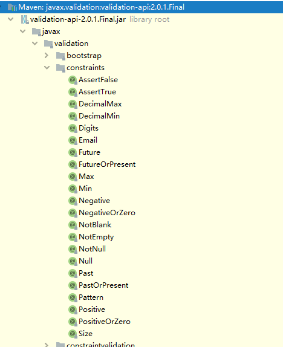

```java
@NotEmpty(messsage = "logo不能为空")
@URL(message = "logo必须是一个合法的url地址")
private String logo;
```

#### 9.3.2、开启效验功能 @Valid

* 效果：效验错误以后有默认的响应

  Controller代码：

  ```java
  @RequestMapping("/save")
  public R save(@Valid@RequestBody BrandEntity brand){
      brandService.save(brand);
      return R.ok();
  }
  ```

  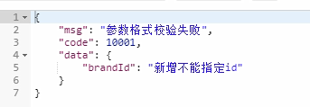

#### 9.3.3、给效验的bean后紧跟一个BindingResult 就可以获取到效验的结果

```java
 public R save(@Valid @RequestBody BrandEntity brand,BindingResult result){
  if(result.hasErrors()){
            Map<String,String> map = new HashMap<>();
            //1、获取校验的错误结果
            result.getFieldErrors().forEach((item)->{
                //FieldError 获取到错误提示
                String message = item.getDefaultMessage();
                //获取错误的属性的名字
                String field = item.getField();
                map.put(field,message);
            });

            return R.error(400,"提交的数据不合法").put("data",map);
        }else {

        }
```

#### 9.3.4、分组效验 (多场景复杂效验)

添加一个组 & 修改一个组

1、@NotBlank(message = "品牌名必须提交",groups = {AddGroup.class,UpdateGroup.class})

- **给效验注解标注什么情况需要进行效验**
- @Validated({AddGroup.class}) 在对应方法上进行标注
- **默认没有指定分组的效验注解 @NotBlank 在分组效验情况@Validated({AddGroup.class})不生效**，只会在@Validated生效

```java
// 标记使用修改分组
public R update(@Validated(UpdateGroup.class) @RequestBody BrandEntity brand){
	brandService.updateById(brand);
      return R.ok();
  }
```

Entity

```java
/**
 * 品牌id
 */
@Null(message = "新增不能指定Id",groups = {AddGroup.class})
@NotNull(message = "修改必须指定品牌id",groups = {UpdateGroup.class})
@TableId
private Long brandId;
/**
 * 品牌名
 */
@NotBlank(message = "品牌名不能为空",groups = {AddGroup.class,UpdateGroup.class})
private String name;
/**
 * 品牌logo地址
 */
@NotEmpty(groups = {AddGroup.class})
@URL(message = "logo必须是一个合法的url地址",groups = {AddGroup.class,UpdateGroup.class})
private String logo;
/**
 * 介绍
 */
private String descript;
/**
 * 显示状态[0-不显示；1-显示]
 */
@NotNull(groups = {AddGroup.class, UpdateStatusGroup.class})
@ListValue(vals={0,1},groups = {AddGroup.class,UpdateStatusGroup.class})
private Integer showStatus;
/**
 * 检索首字母
 */
@NotEmpty(groups = {AddGroup.class})
@Pattern(regexp = "^[a-zA-Z]$",message = "检索首字母必须是一个字母",groups = {AddGroup.class,UpdateGroup.class})
private String firstLetter;
/**
 * 排序
 */
@NotNull(groups = {AddGroup.class})
@Min(value=0,message = "排序必须大于等于0",groups = {AddGroup.class,UpdateGroup.class})
private Integer sort;
```

#### 9.3.5、自定义效验

*      编写一个自定义的效验注解
*      编写一个自定义的效验器何自定义的效验注解

```java
@Documented
@Constraint(validatedBy = {ListValueConstraintValidator.class})//【可以指定多个不同的效验器，适配不同类型的效验】
@Target({ METHOD, FIELD, ANNOTATION_TYPE, CONSTRUCTOR, PARAMETER, TYPE_USE })
@Retention(RUNTIME)
public @interface ListValue {

    // 三要素不能丢
    String message() default "{com.atguigu.gulimall.product.valid.ListValue.message}";

    Class<?>[] groups() default { };

    Class<? extends Payload>[] payload() default { };

    int[] vals() default { };

}
```

实现约束

```java
public class ListValueConstraintValidator implements ConstraintValidator<ListValue,Integer> {

    private Set<Integer> set = new HashSet<>();
    // 初始化方法
    @Override
    public void initialize(ListValue constraintAnnotation) {
        int[] vals = constraintAnnotation.vals();
        for(int val : vals) {
            // 将结果添加到set集合
            set.add(val);
        }
    }
    /**
     *	判断效验是否成功
     * @param value 需要效验的值
     * @param context
     * @return
     */
    @Override
    public boolean isValid(Integer value, ConstraintValidatorContext context) {
        // 判断是包含该值
        return set.contains(value);
    }
}
```


#### 9.3.6、异常处理 

这里使用到了 SpringMVC 的注解 @ControllerAdvice

1、编写异常处理类使用SpringMvc的@ControllerAdvice

 2、使用@ExceptionHandler标记方法可以处理异常

```java
@Slf4j
@RestControllerAdvice(basePackages =  "com.atguigu.gulimall.product.controller")
public class GulimallExceptionControllerAdvice {

    /**
     * 捕获定义的异常
     * @param e
     * @return
     */
    @ExceptionHandler(value = MethodArgumentNotValidException.class)
    public R handleVaildException(MethodArgumentNotValidException e) {
        log.error("数据效验出现问题{},异常类型:{}",e.getMessage(),e.getClass());
        Map<String,String> errorMap = new HashMap<>();
        BindingResult bindingResult = e.getBindingResult();
        bindingResult.getFieldErrors().forEach(fieldError -> {
            errorMap.put(fieldError.getField(),fieldError.getDefaultMessage());
        });
        return R.error(BizCodeEnume.VAILD_EXCEPTION.getCode(),BizCodeEnume.VAILD_EXCEPTION.getMsg()).put("data",errorMap);
    }

    /**
     * 兜底异常
     * @param throwable
     * @return
     */
    @ExceptionHandler(value = Throwable.class)
    public R handleException(Throwable throwable) {
        return R.error();
    }

}
```

**异常错误码定义 （重点）**

后端将定义的错误码写入到开发手册，前端出现对于的错误，就可以通过手册查询到对应的异常

```java
/***
 * 错误码和错误信息定义类
 * 1. 错误码定义规则为5为数字
 * 2. 前两位表示业务场景，最后三位表示错误码。例如：100001。10:通用 001:系统未知异常
 * 3. 维护错误码后需要维护错误描述，将他们定义为枚举形式
 * 错误码列表：
 *  10: 通用
 *      001：参数格式校验
 *  11: 商品
 *  12: 订单
 *  13: 购物车
 *  14: 物流
 *
 *
 */
public enum BizCodeEnume {
    UNKNOW_EXCEPTION(10000,"系统未知异常"),
    VAILD_EXCEPTION(10001,"参数格式校验失败");

    private int code;
    private String msg;
    BizCodeEnume(int code,String msg){
        this.code = code;
        this.msg = msg;
    }

    public int getCode() {
        return code;
    }

    public String getMsg() {
        return msg;
    }
}
```


## 十、商品服务&属性分组

### 10.1 、前端组件抽取 & 父子组件交互

##### 接口文档地址

https://easydoc.xyz/s/78237135

#### 10.1.1 属性分组 - 效果


左边这个树形空间我们已经写过了，在三级分类的时候编写过，相对应的功能，拖拽，添加，删除等等都已经实现，那我们为什么不把他抽取出一个公共的组件便于其他组件利用？

说干就干！

在 modules 中新建 common 文件夹，在common中 新建 category.vue

category.vue 核心代码

抽取需要的结果，多余的结果进行删除

```vue
<template>
  <el-tree :data="menus" :props="defaultProps" node-key="catId" ref="menuTree" @node-click="nodeClick">
  </el-tree>
</template>
```

#### 10.1.2 Layout 布局

通过基础的 24 分栏，迅速简便地创建布局、类似之前学过的bootstrap 

```vue
<el-row :gutter="20">
  <el-col :span="6">表格</el-col>
  <el-col :span="18">菜单</el-col>
</el-row>
```

左边放表格，右边放菜单

引入 category 组件

```javascript
import category from "../common/category";
```

并且声明

```javascript
//import引入的组件需要注入到对象中才能使用
  components: {
    category
  },
```

最后在组件中使用

```vue
   <el-col :span="6">
       <!-- 直接使用-->
      <category @tree-node-click="treenodeclick"></category>
    </el-col>
```

右边菜单使用代码生成器的代码直接引入即可

#### 10.1.3 父子组件如何进行交互

子组件中的 Tree 组件的一个事件  node-click 节点被点击时的回调

```javascript
 nodeclick(data, node, component) {
 console.log("被点击鸟",data, node, component);
 // 向父组件发送事件，后面是需要传递的对象，参数等
  this.$emit("tree-node-click",data,node,component)
}  
```

父组件需要定义相同方法接收

```vue
  <category @tree-node-click="treenodeclick"></category>
```

```javascript
 // 感知到节点被点击
    treenodeclick(node, data, component) {
      console.log("attrgroup感知到category节点被点击");
      console.log("刚才被点击的菜单id:" + data.catId);
      if (node.level == 3) {
        this.catId = data.catId;
        this.getDataList();
      }
    },
```


### 10.2 、获取属性分类分组

查看提供的接口文档

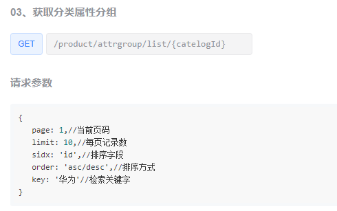

请求参数需要我们带对应的分页参数，所以我们在请求的时候得把参数带上

那就定义接口 go  com.atguigu.gulimall.product.service;

```java
PageUtils queryPage(Map<String, Object> params, Long catelogId);
```

实现类 com.atguigu.gulimall.product.service.impl;

```java
@Override
public PageUtils queryPage(Map<String, Object> params, Long catelogId) {
    // 分类id 等于01 查询全部
    if (catelogId == 0) {
        IPage<AttrGroupEntity> page = this.page(new Query<AttrGroupEntity>().getPage(params),
                new QueryWrapper<AttrGroupEntity>());
        return new PageUtils(page);
    } else {
        // 拿到参数中的 key
        String key = (String) params.get("key");
        // 先根据分类id进行查询
        QueryWrapper<AttrGroupEntity> wrapper = new QueryWrapper<AttrGroupEntity>()
                .eq("catelog_id",catelogId);
        // Preparing: SELECT attr_group_id,attr_group_name,sort,descript,icon,catelog_id FROM pms_attr_group WHERE ((attr_group_id = ? OR attr_group_name LIKE ?)) 
//Parameters: 主(String), %主%(String)
        // 有时候查询也不会带上key 所以得判断
        if (!StringUtils.isEmpty(key)) {
            // where条件后加上 and 
            wrapper.and((obj) -> {
                obj.eq("attr_group_id",key).or().like("attr_group_name",key);
            });
        }
        // 组装条件进行查询 
        IPage<AttrGroupEntity> page = this.page(new Query<AttrGroupEntity>().getPage(params),
                wrapper);
        return  new PageUtils(page);
    }
}
```

测试：

查1分类的属性分组：localhost:88/api/product/attrgroup/list/1

查1分类的属性分组并且分页、关键字为aa：localhost:88/api/product/attrgroup/list/1?page=1&key=aa。结果当然查不到

```bash
{
    "code": 0,
    "page": {
        "totalCount": 0,
        "pageSize": 10,
        "totalPage": 0,
        "currPage": 1,
        "list": []
    }
}
```

给 数据表添加记录进行查询

```bash
attr_group_id  attr_group_name    sort  descript  icon    catelog_id 1  主题                    0  (NULL)    (NULL)           225
2  基本信息                  1  (NULL)    (NULL)           225
```

再次查询,页面进行访问也有查询记录

```bash
{
    "code": 0,
    "page": {
        "totalCount": 0,
        "pageSize": 10,
        "totalPage": 0,
        "currPage": 1,
        "list": [
            {
                "attrGroupId": 1,
                "attrGroupName": "主题",
                "sort": 0,
                "descript": null,
                "icon": null,
                "catelogId": 225
            },
            {
                "attrGroupId": 2,
                "attrGroupName": "基本信息",
                "sort": 1,
                "descript": null,
                "icon": null,
                "catelogId": 225
            }
        ]
    }
}
```


### 10.3 、分类新增 & 级联选择器

级联选择器是啥？？ 没接触过

官方解释

**Cascader 级联选择器**

当一个数据集合有清晰的层级结构时，可通过级联选择器逐级查看并选择。

对应效果 


attrgroup-add-or-update.vue 中 加入该组件

```vue
  <el-cascader
          v-model="dataForm.catelogPath"
           placeholder="试试搜索：手机"
          :options="categorys"
          :props="props"
          filterable
        ></el-cascader>
<!--
placeholder="试试搜索：手机"默认的搜索提示
:options="categorys" 可选项数据源，键名可通过 Props 属性配置
:props="props" 配置选项	
 filterable 是否可搜索选项
-->
```

那么问题来了？ 我怎样把数据加载到这个组件里面？

在你组件加载完成后，我在调用方法 ( getCategorys() ) 获取菜单数据，在设置到options不就行了吗？

```javascript
  getCategorys(){
      this.$http({
        url: this.$http.adornUrl("/product/category/list/tree"),
        method: "get"
      }).then(({ data }) => {
        this.categorys = data.data;
      });
    },
```

@JsonInclude去空字段
优化：没有下级菜单时不要有下一级空菜单，在java端把**children属性空值去掉**，空集合时去掉children字段，

可以用@JsonInclude(Inlcude.NON_EMPTY)注解标注在实体类的属性上，

```java
@TableField(exist =false)
@JsonInclude(JsonInclude.Include.NON_EMPTY) // 不为空时返回的json才带该字段
private List<CategoryEntity> children;
```

直接访问 进行测试 http://localhost:88/api/product/category/list/tree


空字段已消失，没有空白


### 10.4 、分类修改 & 回显级联选择器

修改和新增用的是一个添加组件 那么我们再点击修改后，你如何把 级联显示的数据再次显示出来？

在 AttrGroup点击修改后，会触发addOrUpdateHandle方法，他会通过引用 vue 文件里的 addOrUpdate 并调用他的 init初始化方法

```javascript
 // 新增 / 修改
    addOrUpdateHandle(id) {
      // 对话框显示
      this.addOrUpdateVisible = true;
      // 要渲染的组件完成选然后 调用该方法
      this.$nextTick(() => {
        // this 当前 refs 当前所有组件
        this.$refs.addOrUpdate.init(id);
      });
    },
```

init执行完成会回调

```java
.then(({ data }) => {
            if (data && data.code === 0) {
              this.dataForm.attrGroupName = data.attrGroup.attrGroupName;
              this.dataForm.sort = data.attrGroup.sort;
              this.dataForm.descript = data.attrGroup.descript;
              this.dataForm.icon = data.attrGroup.icon;
              this.dataForm.catelogId = data.attrGroup.catelogId;
                // 设置 级联的路径 从数据中取
              this.dataForm.catelogPath = data.attrGroup.catelogPath;
            }
          });
```

后端如何根据分组id 查询出 对应的分类？定义接口，

```java
/**
 * 找到catelogId的完整路径
 * 【父/子/孙】
 * @param catelogId
 */
Long[] findCatelogPath(Long catelogId);
```

实现

```java
@Override
public Long[] findCatelogPath(Long catelogId) {
    List<Long> paths = new ArrayList<>();
    List<Long> parentPath = findParentPath(catelogId, paths);
    // 反转
    Collections.reverse(parentPath);
    //转成Long[] 数组返回
    return parentPath.toArray(new Long[parentPath.size()]);
}

/**
 * 递归查找
 * @param catelogId 三级分类的id
 * @param paths 路径
 * @return
 */
private List<Long> findParentPath(Long catelogId,List<Long> paths) {
    // 1、收集当前节点id
    paths.add(catelogId);
    // 2、通过分类id拿到 Category 对象
    CategoryEntity byId = this.getById(catelogId);
    // 3、如果不是根节点 就一直递归下去查找
    if (byId.getParentCid() != 0) {
        findParentPath(byId.getParentCid(),paths);
    }
    return paths;

}
```

在 AttrGroupEntity 中 添加了一个新属性

```java
/**
 * 用于存放 级联显示的 父子孙的地址
 */
@TableField(exist = false) // 标注为false 表是不是数据库字段
private Long[] catelogPath;
```

Controller 具体设置返回数据

```java
 /**
   * 信息
   */
  @RequestMapping("/info/{attrGroupId}")
  public R info(@PathVariable("attrGroupId") Long attrGroupId){
      // 根据id查询出 分组group对象
	AttrGroupEntity attrGroup = attrGroupService.getById(attrGroupId);
	// 拿到分类id
      Long catelogId = attrGroup.getCatelogId();
      // 根据分类id查询出 他的 父 子 孙 对应的数据,并且设置到 attrGroup对象
      Long[] catelogPath = categoryService.findCatelogPath(catelogId);
      attrGroup.setCatelogPath(catelogPath);

      return R.ok().put("attrGroup", attrGroup);
  }
```

### 10.5、品牌分类关联与级联更新

#### 10.5.1、实现品牌管理搜索

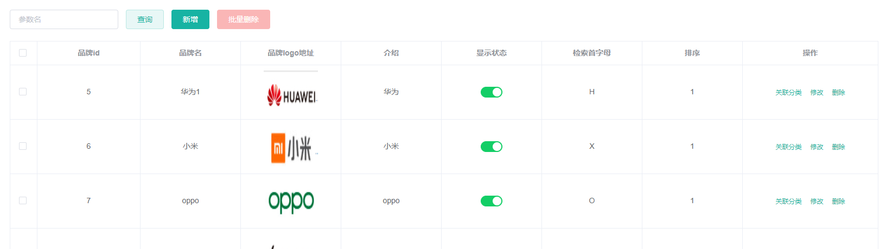

#### 分页插件mybatis-plus用法

官网：https://mp.baomidou.com/guide/page.html

mp分页使用

需要先添加个mybatis的拦截器

```java
package com.atguigu.gulimall.product.config;
@EnableTransactionManagement
@MapperScan("com.atguigu.gulimall.product.dao")
@Configuration
public class MybatisConfig {

    @Bean
    public PaginationInterceptor paginationInterceptor() {
        PaginationInterceptor paginationInterceptor = new PaginationInterceptor();
        // 设置请求的页面大于最大页后操作， true调回到首页，false 继续请求  默认false
        paginationInterceptor.setOverflow(true);
        // 设置最大单页限制数量，默认 500 条，-1 不受限制
        paginationInterceptor.setLimit(1000);
        return paginationInterceptor;
    }
}
```

#### 模糊查询

可以看到在品牌管理页面 点击 查询框后，发送了一个如下请求，带有查询条件 key = ？

> http://localhost:88/api/product/brand/list?t=1627559725871&page=1&limit=10&key=h


在原本查询中加入新功能

```java
 @Override
    public PageUtils queryPage(Map<String, Object> params) {
        // 1、获取key
        String key = (String) params.get("key");
        QueryWrapper<BrandEntity> wrapper = new QueryWrapper<>();
        // key不为空 brand_id 和 name 进行值匹配 
        if (!StringUtils.isEmpty(key)) {
            wrapper.eq("brand_id",key).or().like("name",key) .or().like("first_letter",key);;
        }
        IPage<BrandEntity> page = this.page(
                new Query<BrandEntity>().getPage(params),
                wrapper
        );

        return new PageUtils(page);
    }
```

#### 关联分类/商品

新增的华为、小米、oppo都应该是手机下的品牌，但是品牌对分类可能是一对多的，比如小米对应手机和电视

多对多的关系应该有relation表

修改CategoryBrandRelationController的逻辑	

```java
 /**
     * 获取当前品牌的所有分类列表
     */
    @GetMapping("/catelog/list")
    public R list(@RequestParam("brandId") Long brandId){
        // 根据品牌id获取其分类信息
        List<CategoryBrandRelationEntity> data = categoryBrandRelationService.list(
                new QueryWrapper<CategoryBrandRelationEntity>().eq("brand_id",brandId)
        );
        return R.ok().put("data", data);
    }
```

##### 关联表的优化：

分类名本可以在brand表中，但因为**关联查询对数据库性能有影响**，在电商中大表数据从不做关联，哪怕**分步查**也不用关联

所以像name这种冗余字段可以保存，优化save，**保存时用关联表存好，但select时不用关联**

```java
@RequestMapping("/save")
public R save(@RequestBody CategoryBrandRelationEntity categoryBrandRelation){
    categoryBrandRelationService.saveDetail(categoryBrandRelation);

    return R.ok();
}


/**
     * 根据获取品牌id 、三级分类id查询对应的名字保存到数据库
     */
@Override // CategoryBrandRelationServiceImpl
public void saveDetail(CategoryBrandRelationEntity categoryBrandRelation) {
    // 获取品牌id 、三级分类id
    Long brandId = categoryBrandRelation.getBrandId();
    Long catelogId = categoryBrandRelation.getCatelogId();
    // 根据id查 品牌名字、分类名字，统一放到一个表里，就不关联分类表查了
    BrandEntity brandEntity = brandDao.selectById(brandId);
    CategoryEntity categoryEntity = categoryDao.selectById(catelogId);
    // 把查到的设置到要保存的哪条数据里
    categoryBrandRelation.setBrandName(brandEntity.getName());
    categoryBrandRelation.setCatelogName(categoryEntity.getName());
    this.save(categoryBrandRelation);
}
```

最终效果：


##### 保持冗余字段的数据一致

但是如果分类表里的name发送变化，那么品牌表里的分类name字段应该同步变化。

所以应该修改brand-controller，使之update时检测分类表里的name进行同步属性分组

```java
// 1.brandController
@RequestMapping("/update")
    //@RequiresPermissions("product:brand:update")
    public R update(@Validated(UpdateGroup.class) @RequestBody BrandEntity brand){
        brandService.updateDetail(brand);

        return R.ok();
    }

// 2.product.service;
void updateDetail(BrandEntity brand);
 @Autowired
CategoryBrandRelationService categoryBrandRelationService;

// 3.product.service.impl;
    @Transactional
    @Override
    public void updateDetail(BrandEntity brand) {
        //保证冗余字段的数据一致
        this.updateById(brand);
        if(!StringUtils.isEmpty(brand.getName())){
            //同步更新其他关联表中的数据
            categoryBrandRelationService.updateBrand(brand.getBrandId(),brand.getName());

            //TODO 更新其他关联
        }
    }
```

修改 品牌名称，然后查看关联是否也同步更新了


##### 级联更新

在 分类维护中修改品牌的名称，级联更新关联的名称，修改的地方有点多，要直接看代码

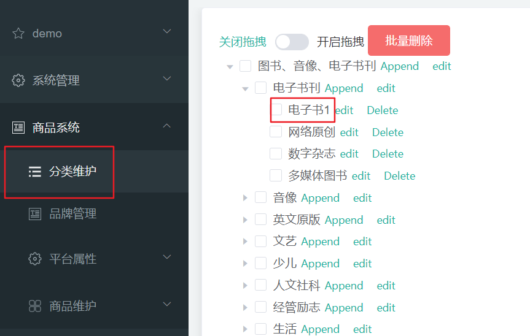


## 十一、商品服务&平台属性

### 11.1 规格参数新增与VO

#### 11.1.1 获取分类规格参数

##### 视图对象

目的：接受页面传递来的数据,封装对象将业务处理完成的对象,封装成页面要用的数据

​		当有新增字段时，我们往往会在entity实体类中新建一个字段，并标注数据库中不存在该字段，http://localhost:88/api/product/attr/base/list/0?t=1588731762158&page=1&limit=10&key=

当有新增字段时，我们往往会在entity实体类中新建一个字段，并标注数据库中不存在该字段

```java
如在一些Entity中，为了让mybatis-plus与知道某个字段不与数据库匹配，
    那么就加个
    @TableField(exist=false)
    private Long attrGroupId;
```

然而这种方式并不规范，比较规范的做法是，新建了一个`vo/AttrVo.java`，在原`Attr`基础上增加了attrGroupId字段，使得保存新增数据的时候，也保存了它们之间的关系

查询的数据没有分类和分组

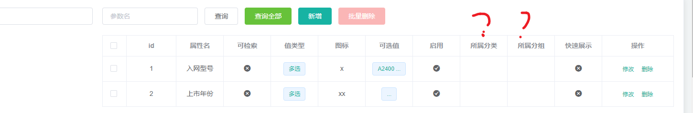

属性分类 和 所属分组居然没有数据？

先查看返回的数据

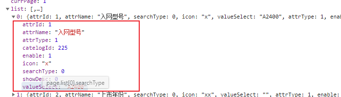

发现没有 catelogName 和 AttrGroupName 的数据！！ 原因是 AttrEntity没有这两个属性


但是他关联了 pms_attr_attrgroup_relation 表 这个表里面有 attr_Group_id 那么思路来了？

1、我先用 attr_id 去 pms_attr_attrgroup_relation中查询出 attr_Group_id 然后通过 attr_Group_id去pms_attr_group 表中查询出 分组的名称

2、自身 attr表中有 catelog_id 那我根据这个id去 category表中查询到 分类的姓名 不就行了吗？

上代码

```java
@Override
public PageUtils queryBaseAttrPage(Map<String, Object> params, Long catelogId) {

    QueryWrapper<AttrEntity> wrapper = new QueryWrapper<>();
    if (catelogId != 0) {
        wrapper.eq("catelog_id",catelogId);
    }
    String key = (String) params.get("key");
    if (!StringUtils.isEmpty(key)) {
        wrapper.and((wrapper1) -> {
            wrapper1.eq("attr_id",key).or().like("attr_name",key);
        });
    }
    IPage<AttrEntity> page = this.page(
            new Query<AttrEntity>().getPage(params),
            wrapper
    );
    PageUtils pageUtils = new PageUtils(page);

    // 拿到分页记录
    List<AttrEntity> records = page.getRecords();

    List<AttrRespVo> respVo = records.stream().map((attrEntity) -> {

        AttrRespVo attrRespVo = new AttrRespVo();
        BeanUtils.copyProperties(attrEntity, attrRespVo);

        // 1、设置分类和分组的名字
        AttrAttrgroupRelationEntity attr_idEntity = relationDao.selectOne(new QueryWrapper<AttrAttrgroupRelationEntity>()
                .eq("attr_id", attrEntity.getAttrId()));
        if (attr_idEntity != null) {
            AttrGroupEntity attrGroupEntity = attrGroupDao.selectById(attr_idEntity.getAttrGroupId());
            attrRespVo.setGroupName(attrGroupEntity.getAttrGroupName());
        }
        CategoryEntity categoryEntity = categoryDao.selectById(attrEntity.getCatelogId());
        if (categoryEntity != null) {
            attrRespVo.setCatelogName(categoryEntity.getName());
        }
        return attrRespVo;
    }).collect(Collectors.toList());

    pageUtils.setList(respVo);
    return pageUtils;
}
```

但是原先的 AttrEntity 对象里面任然没有这两个属性 ! 怎么解决

1、我直接在 AttrEntity中新建对应的字段不就行了吗？ 然后设置成不是数据库的字段

缺点：**这样子是不是太乱了？**

2、新建一个 VO 抽取出这两个属性 不就行了吗？

```java
@Data
public class AttrRespVo extends AttrVo {
    /**
     * catelogName 手机数码，所属分类名字
     * groupName 主体 所属分组名字
     */
    private String catelogName;
    private String groupName;
}
```


### 11.2 规格参数列表&规格修改

##### 11.2.1、获取分类规格参数

```java
/**
 * 获取分类规格参数
 	attrType 和 catelogId 通用
 * @param params 
 * @param catelogId
 * @param type  sale 销售属性 base 规格参数
 * @return
 */
@GetMapping("/{attrType}/list/{catelogId}")
public R baseAttrList(@RequestParam Map<String,Object> params
        ,@PathVariable("catelogId") Long catelogId,
                      @PathVariable("attrType") String  type) {
    PageUtils page = attrService.queryBaseAttrPage(params,catelogId,type);
    return R.ok().put("page",page);
}
```

实现类

```java
 @Override
    public PageUtils queryBaseAttrPage(Map<String, Object> params, Long catelogId, String type) {
        // 先根据 attr_type字段进行查询 该字段表示 1是基本属性 0是销售属性，基本属性和销售属性我们放在一张表内
        QueryWrapper<AttrEntity> wrapper = new QueryWrapper<AttrEntity>()
                .eq("attr_type","base".equalsIgnoreCase(type)?
                        ProductConstant.AttrEnum.ATTR_TYPE_BASE.getCode():
                        ProductConstant.AttrEnum.ATTR_TYPE_SALE.getCode());
        // 分类id不等于0 按照分类id进行查询
        if (catelogId != 0) {
            wrapper.eq("catelog_id",catelogId);
        }
        // 取出参数 key,进行条件查询
        String key = (String) params.get("key");
        if (!StringUtils.isEmpty(key)) {
            wrapper.and((wrapper1) -> {
                wrapper1.eq("attr_id",key).or().like("attr_name",key);
            });
        }
        // 封装分页数据
        IPage<AttrEntity> page = this.page(
                new Query<AttrEntity>().getPage(params),
                wrapper
        );

        PageUtils pageUtils = new PageUtils(page);

        // 拿到全部的分页记录
        List<AttrEntity> records = page.getRecords();
        // 查询所属分类以及所属分组
        List<AttrRespVo> respVo = records.stream().map((attrEntity) -> {
            // 实例化数据传输对象 将 attrEntity的分类名字以及分组名字 复制到该对象
            AttrRespVo attrRespVo = new AttrRespVo();
            BeanUtils.copyProperties(attrEntity, attrRespVo);
            // Controller地址如果是 基础 才进行查询分裂
            if("base".equalsIgnoreCase(type)){
                // 1、根据attr_id 查询到 attr和 attrGroup的关系表
                AttrAttrgroupRelationEntity attr_idEntity = relationDao.selectOne(new QueryWrapper<AttrAttrgroupRelationEntity>()
                        .eq("attr_id", attrEntity.getAttrId()));
                //查询到的关系对象以及分组id不为空
                if (attr_idEntity != null && attr_idEntity.getAttrGroupId()!=null) {
                    // 根据分组id查询到分组信息
                    AttrGroupEntity attrGroupEntity = attrGroupDao.selectById(attr_idEntity.getAttrGroupId());
                    attrRespVo.setGroupName(attrGroupEntity.getAttrGroupName());
                }
            }
            // 根据attrEntity的分类id 查询到分类对象并设置分类姓名
            CategoryEntity categoryEntity = categoryDao.selectById(attrEntity.getCatelogId());
            if (categoryEntity != null) {
                attrRespVo.setCatelogName(categoryEntity.getName());
            }
            return attrRespVo;
        }).collect(Collectors.toList());
        //封装到分页工具类
        pageUtils.setList(respVo);
        return pageUtils;
    }
```

先是根据 `catelog_id`查询到`AttrEntity` 对象 该对象里拥有 `attr_id` 然后根据attr_id 去 `pms_attr_attrgroup_relation`表进行查询


##### 11.2.2、查询属性详情


Controller

```java
/**
   * 信息
   */
  @RequestMapping("/info/{attrId}")
  public R info(@PathVariable("attrId") Long attrId){
AttrRespVo attr = attrService.getAttrInfo(attrId);

      return R.ok().put("attr", attr);
  }
```

Service 实现

```java
@Override
public AttrRespVo getAttrInfo(Long attrId) {
    // 实例化封装VO数据对象
    AttrRespVo attrRespVo = new AttrRespVo();
    // 根据attrid查询出商品属性
    AttrEntity attrEntity = this.getById(attrId);
    // 将商品属性对象的属性复制到 VO数据对象
    BeanUtils.copyProperties(attrEntity, attrRespVo);

    //  attrType == 1为基本类型才进行查询分组信息
    if (attrEntity.getAttrType() == ProductConstant.AttrEnum.ATTR_TYPE_BASE.getCode()) {
        // 根据 attr_id 查询到 商品属性以及商品分组关系表
        AttrAttrgroupRelationEntity relationEntity = relationDao.selectOne(new QueryWrapper<AttrAttrgroupRelationEntity>()
                .eq("attr_id", attrId));
        if (relationEntity != null) {
            // 设置分组id
            attrRespVo.setAttrGroupId(relationEntity.getAttrGroupId());
            // 分组&商品信息关系表拿到分组id 查询到分组对象
            AttrGroupEntity attrGroupEntity = attrGroupDao.selectById(relationEntity.getAttrGroupId());
            if (attrGroupEntity != null) {
                //不为空设置分组姓名
                attrRespVo.setGroupName(attrGroupEntity.getAttrGroupName());
            }
        }
    }
    // 从当前商品属性对象中拿到分类id进行设置分类信息
    Long catelogId = attrEntity.getCatelogId();
    // 根据 catelogId 查询到分类 父 子 孙 路径
    Long[] catelogPath = categoryService.findCatelogPath(catelogId);
    attrRespVo.setCatelogPath(catelogPath);
    //最后根据分类id 查询到分类对象 并进行设置分类姓名
    CategoryEntity categoryEntity = categoryService.getById(catelogId);
    if (categoryEntity != null) {
        attrRespVo.setCatelogName(categoryEntity.getName());
    }
    return attrRespVo;
}
```

主要理解： 先是根据 `attrId` 查询到**商品属性**  然后根据 attrId 查询到**分类关系表** 该表中有分组id attrGroup_id 通过这个查询到 **分组对象信息**，

，同时在 商品属性表中拿到 分类id 通过**分类id 查询到 查询到分类对象** 同时根据 分类id查询对应层级关系，并设置**分类姓名**

##### 11.3.3、销售属性


销售属性 和 基本属性 通过一个字段来区分，对应的修改，查询 都用的同一个方法，所以在方法的中 也进行了对应的判断

保存

```java
@Override
public void saveAttr(AttrVo attr) {
    AttrEntity attrEntity = new AttrEntity();
    BeanUtils.copyProperties(attr, attrEntity);
    // 保存基本数据
    this.save(attrEntity);

    // 2、保存关联关系
    // 等于1 说明基本属性 才进行保存分组关系
    if (attr.getAttrType() == ProductConstant.AttrEnum.ATTR_TYPE_BASE.getCode() && attr.getAttrGroupId() != null) {
        AttrAttrgroupRelationEntity relationEntity = new AttrAttrgroupRelationEntity();
        relationEntity.setAttrGroupId(attr.getAttrGroupId());
        relationEntity.setAttrId(attrEntity.getAttrId());
        relationDao.insert(relationEntity);
    }

}
```

修改

```java
 @Transactional
    @Override
    public void updateAttr(AttrVo attr) {
        // Vo数据传输对象属性拷贝到 attrEntity对象
        AttrEntity attrEntity = new AttrEntity();
        BeanUtils.copyProperties(attr, attrEntity);
        this.updateById(attrEntity);

        // attrType 等于 1 也就是基本属性
        if (attrEntity.getAttrType() == ProductConstant.AttrEnum.ATTR_TYPE_BASE.getCode()) {
            //1、修改分组关联
            AttrAttrgroupRelationEntity relationEntity = new AttrAttrgroupRelationEntity();
            // 设置attrid 以及 分组id
            relationEntity.setAttrId(attr.getAttrId());
            relationEntity.setAttrGroupId(attr.getAttrGroupId());
            // 关系表中根据attr_id 进行更新
            relationDao.update(relationEntity, new UpdateWrapper<AttrAttrgroupRelationEntity>().
                    eq("attr_id", attr.getAttrId()));
            // 根据 attr_id 是否可以查询到结果
            Integer count = relationDao.selectCount(new QueryWrapper<AttrAttrgroupRelationEntity>().
                    eq("attr_id", attr.getAttrId()));
            
            // 查得到
            if (count > 0) {
                // 进行更新
                relationDao.update(relationEntity, new UpdateWrapper<AttrAttrgroupRelationEntity>().
                        eq("attr_id", attr.getAttrId()));
            } else {
                // 查不到意味着 没有该记录 则进行插入
                relationDao.insert(relationEntity);
            }

        }

    }
```

### 11.3 查询分类关联属性&删除关联&查询分组未关联属性


##### 11.3.1、获取属性分组的关联的所有属性

```java
/**
 * 获取属性分组的关联的所有属性
 * @param attrgroupId
 * @return
 */
@GetMapping("/{attrgroupId}/attr/relation")
public R attrRelation(@PathVariable("attrgroupId") Long attrgroupId) {
    List<AttrEntity> entityList = attrService.getRelationAttr(attrgroupId);

    return R.ok().put("data", entityList);
}
```

Service 实现

```java
/**
 * 根据分组id查找关联的所有基本属性
 * @param attrgroupId
 * @return
 */
@Override
public List<AttrEntity> getRelationAttr(Long attrgroupId) {
    // 根据attr_group_id 查询到 关系表
    List<AttrAttrgroupRelationEntity> entities = relationDao.selectList(new QueryWrapper<AttrAttrgroupRelationEntity>()
            .eq("attr_group_id", attrgroupId));

    // 从关系表中 取到 属性id
    List<Long> attrIds = entities.stream().map((attr) -> {
        return attr.getAttrId();
    }).collect(Collectors.toList());
    if (attrIds == null || attrIds.size() == 0) {
        return null;
    }

    // 按照属性id进行查询
    Collection<AttrEntity> attrEntities = this.listByIds(attrIds);
    return (List<AttrEntity>) attrEntities;
}
```


已知有参数 attr_group_id 进行查询 能查到 attr_id,在利用 attr_id 查询到 attr相关信息


##### 11.3.2、删除属性与分组的关联关系


```java
/**
 * 删除属性与分组的关联关系
 * @param relationVo
 * @return
 */
@PostMapping("/attr/relation/delete")
public R deleteRelation(@RequestBody AttrGroupRelationVo[] relationVo) {
    attrService.deleteRelation(relationVo);
    return R.ok();
}
```

Service 实现

```java
 @Override
    public void deleteRelation(AttrGroupRelationVo[] relationVo) {

        // 转成 list 进行stream流处理
        List<AttrAttrgroupRelationEntity> entities = Arrays.asList(relationVo).stream().map((item) -> {
            // 将 item对应属性拷贝到 relationEntity对象中
            AttrAttrgroupRelationEntity relationEntity = new AttrAttrgroupRelationEntity();
            BeanUtils.copyProperties(item, relationEntity);
            return relationEntity;
        }).collect(Collectors.toList());
        // id批量删除
        relationDao.deleteBatchRelation(entities);

    }
```

deleteBatchRelation 方法

```xml
<delete id="deleteBatchRelation">
    DELETE FROM `pms_attr_attrgroup_relation` WHERE 
    <!- 循环遍历进行删除 使用的是 or-->
    <foreach collection="entities" item="item" separator=" OR ">
        ( attr_id=#{item.attrId} AND attr_group_id=#{item.attrGroupId} )
    </foreach>
</delete>
```


##### 11.3.3、查询分组未关联属性

```java
@GetMapping("/{attrgroupId}/noattr/relation")
public R attrNoRelation(@PathVariable("attrgroupId") Long attrgroupId,
                        @RequestParam Map<String, Object> params) {
    PageUtils page = attrService.getNoRelationAttr(params,attrgroupId);
    return R.ok().put("page",page);
}
```

Service

```java
@Override
public PageUtils getNoRelationAttr(Map<String, Object> params, Long attrgroupId) {
    // 1、当前分组只能关联自己所属分类里面的所有属性
    AttrGroupEntity attrGroupEntity = attrGroupDao.selectById(attrgroupId);
    Long catelogId = attrGroupEntity.getCatelogId();

    //2、当前分组只能关联别的分组没有引用的属性
    //2.1 当前分类下的 **其他分组** 根据分类id进行查询
    List<AttrGroupEntity> group = attrGroupDao.selectList(new QueryWrapper<AttrGroupEntity>()
            .eq("catelog_id", catelogId));
    // 拿到分组id
    List<Long> collect = group.stream().map(item -> {
        return item.getAttrGroupId();
    }).collect(Collectors.toList());

    //2.2 这些分组关联的属性  根据分组id查询出关联表
    List<AttrAttrgroupRelationEntity> groupId = relationDao.selectList(new QueryWrapper<AttrAttrgroupRelationEntity>()
            .in("attr_group_id", collect));
    // 拿到所有的属性id
    List<Long> attrIds = groupId.stream().map((item) -> {
        return item.getAttrId();
    }).collect(Collectors.toList());

    //2.3 从当前分类的所有属性中移除这些属性
    QueryWrapper<AttrEntity> wrapper = new QueryWrapper<AttrEntity>()
            .eq("catelog_id", catelogId)
            .eq("attr_type", ProductConstant.AttrEnum.ATTR_TYPE_BASE.getCode());

    // attrIds 属性id数组不为空
    if (attrIds != null && attrIds.size() > 0) {
        // 在attrids 数组中得id不用进行查询
        wrapper.notIn("attr_id", attrIds);
    }
    //取出参数进行 对应条件查询
    String key = (String) params.get("key");
    if (!StringUtils.isEmpty(key)) {
        wrapper.and((w) -> {
            w.eq("attr_id", key).or().like("attr_name", key);
        });
    }
    // 根据分页数据 以及 wrapper进行查询
    IPage<AttrEntity> page = this.page(new Query<AttrEntity>().getPage(params), wrapper);
    PageUtils pageUtils = new PageUtils(page);
    return pageUtils;
}
```

##### 11.4.4、新增分组与属性关联

```java
@PostMapping("/attr/relation")
public  R addRelation(@RequestBody List<AttrGroupRelationVo> attrGroupRelationVo) {
    attrAttrgroupRelationService.saveBatch(attrGroupRelationVo);
    return R.ok();
}
```

Service

```java
@Override
public void saveBatch(List<AttrGroupRelationVo> attrGroupRelationVo) {
    List<AttrAttrgroupRelationEntity> collect = attrGroupRelationVo.stream().map((item) -> {
        // 复制属性 返回
        AttrAttrgroupRelationEntity relationEntity = new AttrAttrgroupRelationEntity();
        BeanUtils.copyProperties(item, relationEntity);
        return relationEntity;
    }).collect(Collectors.toList());
    this.saveBatch(collect);
}
```

业务之间需要多种测试 各种判断 	


## 十二、商品服务&新增商品

### 12.1 获取分类关联的品牌


前端发送请求


后端编写：

Controller

```java
/**
 *  获取分类关联的品牌
 * @param catId
 * @return
 */
@GetMapping("/brands/list")
public R relationBrandList(@RequestParam(value = "catId",required = true) Long catId) {

    List<BrandEntity> vos = categoryBrandRelationService.getBrandCatId(catId);
    //拿到 品牌对象数据后 从中抽取除 品牌姓名和id
    List<BrandVo> collect = vos.stream().map(item -> {
        BrandVo brandVo = new BrandVo();
        brandVo.setBrandId(item.getBrandId());
        brandVo.setBrandName(item.getName());
        return brandVo;
    }).collect(Collectors.toList());
    return R.ok().put("data",collect);
}
```

Service实现

```java
@Override
public List<BrandEntity> getBrandCatId(Long catId) {
    // 根据分类id查询出 分类和品牌的关系表
    List<CategoryBrandRelationEntity> catelogId = categoryBrandRelationDao.selectList(new QueryWrapper<CategoryBrandRelationEntity>().eq("catelog_id", catId));

    List<BrandEntity> collect = catelogId.stream().map(item -> {
        //根据品牌id查询出品牌对象
        BrandEntity brandEntity = brandDao.selectById(item.getBrandId());
        return brandEntity;
    }).collect(Collectors.toList());

    return collect;
}
```

> 总结：

业务操作设计两个表

- pms_brand
- pms_category_brand_relation

请求参数是 CatId Long类型

- 先根据 CatId 在 pms_category_brand_relation表中查询到品牌 Id 
- 拿到 brand_id 查询出 brand 的相关信息
- 组装成 BrandVo 后 返回


### 12.2 获取分类下所有分组以及属性

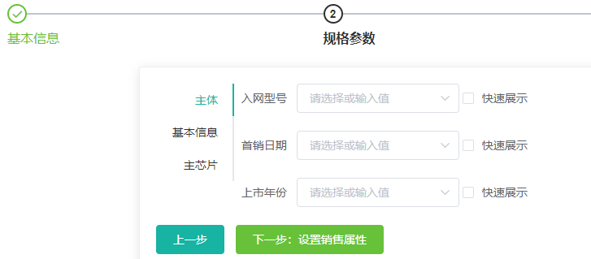

基本信息输入成功后，就会跳转到规格参数，

并根据分类id查询出对应数据

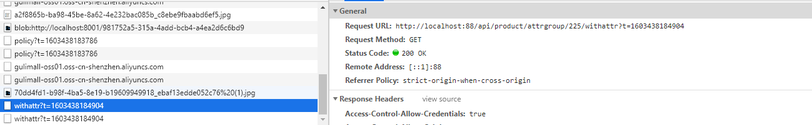


Controller

```java
/**
 *  获取分类下所有分组&关联属性
 * @param catelogId
 * @return
 */
@RequestMapping("/{catelogId}/withattr")
public R getAttrGroupWithAttrs(@PathVariable("catelogId") Long catelogId)   {
    List<AttrGroupWithAttrsVo> vos = attrGroupService.getAttrGroupWithAttrsByCatelogId(catelogId);
    return R.ok().put("data",vos);
}
```

Service 实现

```java
@Override
public List<AttrGroupWithAttrsVo> getAttrGroupWithAttrsByCatelogId(Long catelogId) {
    // 1、根据分类id查询出 查询分组关系
    List<AttrGroupEntity> attrgroupEntites = this.list(new QueryWrapper<AttrGroupEntity>().eq("catelog_id", catelogId));

    List<AttrGroupWithAttrsVo> collect = attrgroupEntites.stream().map(group -> {
        AttrGroupWithAttrsVo attrsVo = new AttrGroupWithAttrsVo();
        // 2、将分组属性拷贝到 VO中
        BeanUtils.copyProperties(group, attrsVo);

        // 3、通过分组id查询出 商品属性信息
        // 调用 getRelationAttr方法先根据 分组id去 中间关系表查询到商品属性id 然后根据商品属性id查询到商品信息
        List<AttrEntity> relationAttr = attrService.getRelationAttr(attrsVo.getAttrGroupId());
        attrsVo.setAttrs(relationAttr);
        return attrsVo;
    }).collect(Collectors.toList());

    return collect;
}
```


### 12.3 商品 VO 抽取&商品新增业务流程

商品属性、销售属性、规格参数、基本信息都填好了后就会生成一串 JSON


我们将 json 放到 json解析网站上 并生成对应得实体类


#### 12.3.4 封装 Vo 中，更改对应得属性


有些参与计算的属性 如 int price 将类型更改为 BigDecimal 

#### 12.3.5 分析业务流程

> 业务流程:


#### 12.3.6 主要编码！

```java
@Transactional
@Override
public void saveSpuInfo(SpuSaveVo vo) {

    // 1、保存Spu基本信息  pms_spu_info
    SpuInfoEntity spuInfoEntity = new SpuInfoEntity();
    BeanUtils.copyProperties(vo,spuInfoEntity);
    spuInfoEntity.setCreateTime(new Date());
    spuInfoEntity.setUpdateTime(new Date());

    this.saveBaseSpuInfo(spuInfoEntity);
    // 2、保存Spu的描述信息  pms_spu_info_desc
    List<String> decript = vo.getDecript();
    SpuInfoDescEntity spuInfoDescEntity = new SpuInfoDescEntity();
    // SpuInfoEntity保存到取得 spuId 设置到 Desc中
    spuInfoDescEntity.setSpuId(spuInfoEntity.getId());
    // 以逗号来拆分
    spuInfoDescEntity.setDecript(String.join(",",decript));
    spuInfoDescService.saveSpuInfoDesc(spuInfoDescEntity);

    // 3、保存Spu的图片集 pms_spu_./image/images
    List<String> ./image/imageList = vo.get./image/images();
    spu./image/imagesService.save./image/images(spuInfoEntity.getId(),./image/imageList);

    // 4、保存spu的规格参数 pms_product_attr_value
    List<BaseAttrs> baseAttrs = vo.getBaseAttrs();
    List<ProductAttrValueEntity> collect = baseAttrs.stream().map(attr -> {
        // 设置 spu 属性值
        ProductAttrValueEntity valueEntity = new ProductAttrValueEntity();
        valueEntity.setAttrId(attr.getAttrId());
        AttrEntity attrEntity = attrService.getById(attr.getAttrId());
        valueEntity.setAttrName(attrEntity.getAttrName());
        valueEntity.setSpuId(spuInfoEntity.getId());
        valueEntity.setQuickShow(attr.getShowDesc());
        valueEntity.setAttrValue(attr.getAttrValues());
        return valueEntity;
    }).collect(Collectors.toList());
    attrValueService.saveProductAttr(collect);


    // 5、保存SPU的积分信息 gulimall_sms sms => sms_spu_bounds
    Bounds bounds = vo.getBounds();
    SpuBoundTo spuBoundTo = new SpuBoundTo();
    BeanUtils.copyProperties(bounds,spuBoundTo);
    spuBoundTo.setSpuId(spuInfoEntity.getId());
    // 远程服务调用
    R r = couponFeignService.saveSpuBounds(spuBoundTo);
    if (r.getCode() != 0) {
        log.error("远程保存优惠信息失败");
    }


    // 5、保存当前Spu对应的所有SKU信息
    List<Skus> skus = vo.getSkus();
    if (skus != null && skus.size() > 0) {
        // 遍历 skus 集合
        skus.forEach(item ->{
            String default./image/image = "";
            // 遍历 skus 集合中的图片 
            for (../blogimg/project/gulimall/images ./image/image : item.get./image/images()) {
                // 默认图片等于 1 该记录则是默认图片
                if (../blogimg/project/gulimall/image.getDefaultImg() == 1) {
                    default./image/image = ./image/image.getImgUrl();
                }
            }
            // private String skuName;
            //    private String price;
            //    private String skuTitle;
            //    private String skuSubtitle;
            // 只有上面4个属性相同
            SkuInfoEntity skuInfoEntity = new SkuInfoEntity();
            BeanUtils.copyProperties(item,skuInfoEntity);
            // 其他属性需要自己赋值
            skuInfoEntity.setBrandId(spuInfoEntity.getBrandId());
            skuInfoEntity.setCatalogId(spuInfoEntity.getCatalogId());
            skuInfoEntity.setSaleCount(0L);
            skuInfoEntity.setSpuId(spuInfoDescEntity.getSpuId());
            skuInfoEntity.setSkuDefaultImg(default./image/image);
            //5.1、SKU的基本信息 pms_sku_info
            skuInfoService.saveSkuInfo(skuInfoEntity);

            Long skuId = skuInfoEntity.getSkuId();

            // 保存 sku 图片信息
            List<Sku./image/imagesEntity> ./image/imagesEntities = item.get./image/images().stream().map(img -> {
                Sku./image/imagesEntity sku./image/imagesEntity = new Sku./image/imagesEntity();
                sku./image/imagesEntity.setSkuId(skuId);
                sku./image/imagesEntity.setImgUrl(img.getImgUrl());
                sku./image/imagesEntity.setDefaultImg(img.getDefaultImg());

                return sku./image/imagesEntity;
            }).filter(entity ->{
                //返回 true 需要 false 过滤
                return !StringUtils.isEmpty(entity.getImgUrl());
            }).collect(Collectors.toList());

            // TODO 没有图片路径的无需保存
            //5.2、SKU的图片信息 pms_sku_./image/images
            sku./image/imagesService.saveBatch(../blogimg/project/gulimall/imagesEntities);


            List<Attr> attr = item.getAttr();
            // 保存 sku 销售属性
            List<SkuSaleAttrValueEntity> skuSaleAttrValueEntities = attr.stream().map(a -> {
                SkuSaleAttrValueEntity skuSaleAttrValueEntity = new SkuSaleAttrValueEntity();
                BeanUtils.copyProperties(a, skuSaleAttrValueEntity);
                skuSaleAttrValueEntity.setSkuId(skuId);

                return skuSaleAttrValueEntity;
            }).collect(Collectors.toList());
            //5.3、SKU的销售属性信息 pms_sku_sale_attr_value
            saleAttrValueService.saveBatch(skuSaleAttrValueEntities);

            //5.4、SKU的优惠、满减等信息 gulimall_sms ->sms_sku_ladder \sms_sku_full_reduction\sms_member_price

            SkuReductionTo skuReductionTo = new SkuReductionTo();
            BeanUtils.copyProperties(item,skuReductionTo);
            skuReductionTo.setSkuId(skuId);
            if (skuReductionTo.getFullCount() > 0 || skuReductionTo.getFullPrice().compareTo(new BigDecimal("0")) == 1) {
                R r1 = couponFeignService.saveSkuReduction(skuReductionTo);
                if (r1.getCode() != 0) {
                    log.error("远程保存sku优惠信息失败");
                }
            }
        });
    }
}
```

save./image/images

```java
@Override
public void save./image/images(Long id, List<String> ./image/imageList) {
    if (../blogimg/project/gulimall/imageList == null || ./image/imageList.size() <=0) {
        log.error("图片为空！！！！！！");
    } else {
        List<Spu./image/imagesEntity> collect = ./image/imageList.stream().map(img -> {
            Spu./image/imagesEntity entity = new Spu./image/imagesEntity();
            // 设置主要属性 
            entity.setSpuId(id);
            entity.setImgUrl(img);

            return entity;
        }).collect(Collectors.toList());
        this.saveBatch(collect );
    }

}
```

远程服务调用 对应方法

保存了 **商品阶梯价格**、**商品满减信息**、**商品会员价格**

```java
@Override
public void saveSkuReduction(SkuReductionTo skuReductionTo) {

    //5.4、SKU的优惠、满减等信息 gulimall_sms ->sms_sku_ladder \sms_sku_full_reduction\sms_member_price

    //sms_sku_ladder
    SkuLadderEntity skuLadderEntity = new SkuLadderEntity();
    skuLadderEntity.setSkuId(skuReductionTo.getSkuId());
    skuLadderEntity.setFullCount(skuReductionTo.getFullCount());
    skuLadderEntity.setAddOther(skuReductionTo.getCountStatus());
    skuLadderEntity.setDiscount(skuReductionTo.getDiscount());
    if (skuLadderEntity.getFullCount() > 0) {
        skuLadderService.save(skuLadderEntity);
    }


    //sms_sku_full_reduction
    SkuFullReductionEntity skuFullReductionEntity = new SkuFullReductionEntity();
    BeanUtils.copyProperties(skuReductionTo,skuFullReductionEntity);
    // BigDecimal 用 compareTo来比较
    if (skuFullReductionEntity.getFullPrice().compareTo(new BigDecimal("0")) == 1) {

        this.save(skuFullReductionEntity);
    }

    //sms_member_price

    List<MemberPrice> memberPrice = skuReductionTo.getMemberPrice();

    List<MemberPriceEntity> collect = memberPrice.stream().map(item -> {
        MemberPriceEntity priceEntity = new MemberPriceEntity();
        priceEntity.setSkuId(skuReductionTo.getSkuId());
        priceEntity.setMemberPrice(item.getPrice());
        priceEntity.setMemberLevelName(item.getName());
        priceEntity.setMemberLevelId(item.getId());
        priceEntity.setAddOther(1);
        return priceEntity;
    }).filter(item -> {
        // 会员对应价格等于0 过滤掉
        return item.getMemberPrice().compareTo(new BigDecimal("0")) == 1;
    }).collect(Collectors.toList());

    memberPriceService.saveBatch(collect);

}
```

#### **12.3.7 总结**

- 电商系统中大表数据不做关联 宁可一点一点查询
- 商品新增业务，眨眼一看很多代码，但是如果把他们划分成几个功能点一一完成，业务也就不会变得很庞大

相关操作的表


#### 12.3.8 商品保存后 Debug 调试

很少有一次写的代码能一次通过，所以我们要 一个功能点一个断点来调试程序是否正确

```mysql
# 将当前会话等级设置成读为提交，当前窗口就能查看到没有提交的数据
SET SESSION TRANSACTION ISOLATION LEVEL READ UNCOMMITTED;
```

具体 Debug 过程不在此叙述

#### 12.3.9 商品保存其他问题处理

#####   1、   `sku_./image/images` 表中 img_url 字段为空

`sku_./image/images` 中有很多图片都是为空，因此我们需要在程序中处理这个数据，空数据不写入到数据库中


**解决思路：**

`sku./image/images` 保存部分代码、如果 `ImgUrl` 为空则进行过滤

```java
}).filter(entity ->{
    //返回 true 需要 false 过滤
    return !StringUtils.isEmpty(entity.getImgUrl());
}).collect(Collectors.toList());
```


##### 2、sku 满减以及打折信息 数据出现错误

有部分数据 为0


解决思路：

在代码中过滤对应为0的数据

部分修改代码

```java
// 满几件 大于0 可以添加  满多少钱 至少要大于0
if (skuReductionTo.getFullCount() > 0 || skuReductionTo.getFullPrice().compareTo(new BigDecimal("0")) == 1) {
    R r1 = couponFeignService.saveSkuReduction(skuReductionTo);
    if (r1.getCode() != 0) {
        log.error("远程保存sku优惠信息失败");
    }
}
```

远程服务中也进行对应修改

```java
/**
保存 商品阶梯价格
件数 大于0才能进行修改
**/
if (skuLadderEntity.getFullCount() > 0) {
    skuLadderService.save(skuLadderEntity);
}
/**
保存商品满减信息
**/
  // BigDecimal 用 compareTo来比较
if (skuFullReductionEntity.getFullPrice().compareTo(new BigDecimal("0")) == 1) {

	this.save(skuFullReductionEntity);
}
/**
保存商品会员价格
也进行了过滤数据
**/
 }).filter(item -> {
            // 会员对应价格等于0 过滤掉
            return item.getMemberPrice().compareTo(new BigDecimal("0")) == 1;
        }).collect(Collectors.toList());
```

##### 3、程序中其他的异常

程序中总会出现一些其他的异常的，这个留到高级篇进行讲解


## 十三、 商品服务&商品管理

#### 13.1 商品管理 SPU 检索

**功能概述：**

- 查询刚刚发布的商品，并能进行对应的条件查询


Controller

```java
/**
     * 列表
     */
    @RequestMapping("/list")
    //@RequiresPermissions("product:spuinfo:list")
    public R list(@RequestParam Map<String, Object> params){
        PageUtils page = spuInfoService.queryPageByCondition(params);

        return R.ok().put("page", page);
    }
```

Service 实现

```java
/**
 * 根据条件进行查询 spu相关信息
 * @param params 分页参数  status上架状态，catelogId 分类id brandId 品牌id
 * @return
 */
@Override
public PageUtils queryPageByCondition(Map<String, Object> params) {
    QueryWrapper<SpuInfoEntity> wrapper = new QueryWrapper<>();

    // 取出参数 key 进行查询
    String key = (String) params.get("key");
    if (!StringUtils.isEmpty(key)) {
        wrapper.and((w) ->{
            w.eq("id","key").or().like("spu_name",key);
        });
    }

    // 验证不为空 取出参数进行 查询
    String status = (String) params.get("status");
    if (!StringUtils.isEmpty(status)) {
        wrapper.eq("publish_status",status);
    }
    String brandId = (String) params.get("brandId");
    if (!StringUtils.isEmpty(brandId)  && ! "0".equalsIgnoreCase(brandId)) {
        wrapper.eq("brand_id",brandId);
    }

    String catelogId = (String) params.get("catelogId");
    if (!StringUtils.isEmpty(catelogId) && ! "0".equalsIgnoreCase(catelogId)) {
        wrapper.eq("catalog_id",catelogId);
    }

    IPage<SpuInfoEntity> page = this.page(
            new Query<SpuInfoEntity>().getPage(params),
            wrapper);

    return new PageUtils(page);
}
```

**总结业务流程**

- 主要查询的是 `pms_spu_info` 这张表 前端传递过来的参数 主要有分页，以及 品牌id 分类id  我们需要判断这些值是否正确，然后进行查询数据


#### 13.1 商品管理 SkU 检索

**功能概述：**

查询具体的商品管理 库存 

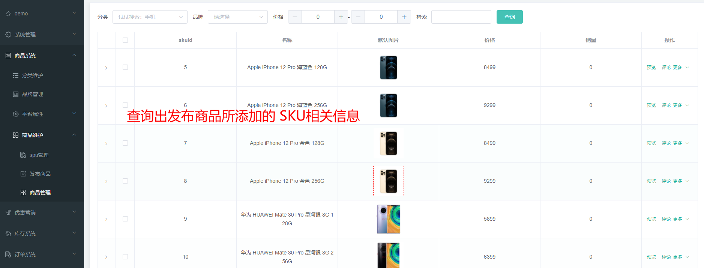

Controller

```
/**
 * 列表
 */
@RequestMapping("/list")
//@RequiresPermissions("product:skuinfo:list")
public R list(@RequestParam Map<String, Object> params){
    PageUtils page = skuInfoService.queryPageByCondition(params);

    return R.ok().put("page", page);
}
```

Service

```java
@Override
public PageUtils queryPageByCondition(Map<String, Object> params) {

    QueryWrapper<SkuInfoEntity> wrapper = new QueryWrapper<>();

    // 取出参数 进行查询
    String key = (String) params.get("key");
    if (!StringUtils.isEmpty(key)) {
        wrapper.and((w) ->{
            w.eq("sku_id",key).or().like("sku_name",key);
        });
    }

    // 验证 id 是否为0 否则进行匹配
    String catelogId = (String) params.get("catelogId");
    if (!StringUtils.isEmpty(catelogId) && !"0".equalsIgnoreCase(catelogId)) {
        wrapper.eq("catalog_id",catelogId);
    }
    String brandId = (String) params.get("brandId");
    if (!StringUtils.isEmpty(brandId) && !"0".equalsIgnoreCase(brandId)) {
        wrapper.eq("brand_id",brandId);
    }
    String min = (String) params.get("min");
    if (!StringUtils.isEmpty(min)) {
        wrapper.ge("price",min);
    }
    String max = (String) params.get("max");

    if (!StringUtils.isEmpty(max) ) {
        // 怕前端传递的数据是 abc 等等 所以要抛出异常
        try {
            BigDecimal bigDecimal = new BigDecimal(max);
            if ( bigDecimal.compareTo(new BigDecimal("0")) == 1) {
                wrapper.le("price",max);
            }
        } catch (Exception e) {
            e.printStackTrace();
        }

    }

    IPage<SkuInfoEntity> page = this.page(
            new Query<SkuInfoEntity>().getPage(params),
            wrapper
    );

    return new PageUtils(page);
}
```

**总结业务流程：**

主要查询是 `pms_sku_info` 这张表，我出现的问题是发布商品时候，实体类的 价格 与 VO属性不一致，出现了数据没有拷贝，修改后，数据查询正常


## 十四、仓储服务&仓库管理

### 14.1 整合ware服务&获取仓库列表

#### 14.1.1整合 ware 服务

1、首先服务需要先注册到 Nacos 中，需要自己配置文件 配置对应的 nacos注册地址，

2、启动类需要开启 服务注册发现，开启远程服务调用

```java
@EnableFeignClients // 开启openfeign 远程服务调用
@EnableTransactionManagement //开启事务
@MapperScan("com.atguigu.gulimall.ware.dao") //mapper包扫描
@EnableDiscoveryClient //服务注册发现
```

3.配置路由

```yaml
 	   - id: ware_route
          uri: lb://gulimall-ware
          predicates:
            - Path=/api/ware/**
          filters:
            - RewritePath=/api/(?<segment>.*),/$\{segment}
```


#### 14.1.2 获取仓库列表

**具体需求：**

根据参数名查询出 仓库相关的记录 ，具体对于操作的是`wms_ware_info` 表

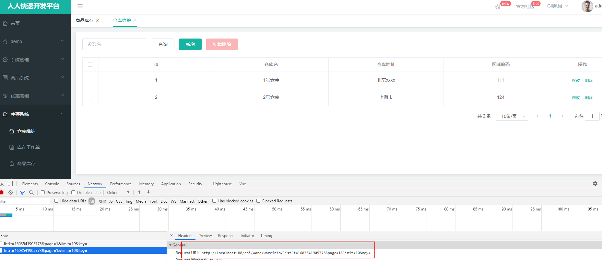


Controller

```java
/**
 * 列表
 */
@RequestMapping("/list")
//@RequiresPermissions("ware:wareinfo:list")
public R list(@RequestParam Map<String, Object> params){
    PageUtils page = wareInfoService.queryPage(params);

    return R.ok().put("page", page);
}
```

Service

```java
@Override
public PageUtils queryPage(Map<String, Object> params) {
    QueryWrapper<WareInfoEntity> wrapper = new QueryWrapper<>();

    // 取出参数
    String key = (String)params.get("key");
    // 拼接条件
    if (!StringUtils.isEmpty(key)) {
        wrapper.eq("id",key).or()
                .like("name",key)
                .eq("address",key)
                .eq("areacode",key);
    }
    IPage<WareInfoEntity> page = this.page(
            new Query<WareInfoEntity>().getPage(params),
            wrapper
    );

    return new PageUtils(page);
}
```

**总结业务流程**

仓库维护对应的是 `wms_ware_info` 根据前端传递过来的参数进行拼接然后进行查询


### 14.2 查询库存&创建采购需求

#### 14.2.1 查询库存

**具体需求：**

根据 **仓库、skuId** 进行查询对应的表是 wms_ware_sku 


Controller

```java
/**
 * 列表
 */
@RequestMapping("/list")
//@RequiresPermissions("ware:waresku:list")
public R list(@RequestParam Map<String, Object> params){
    PageUtils page = wareSkuService.queryPage(params);

    return R.ok().put("page", page);
}
```

Service

```java
@Override
public PageUtils queryPage(Map<String, Object> params) {
    QueryWrapper<WareSkuEntity> queryWrapper = new QueryWrapper<>();

    // 取出请求的参数 组装条件进行查询
    String skuId = (String) params.get("skuId");
    if (!StringUtils.isEmpty(skuId)) {
        queryWrapper.eq("sku_id",skuId);
    }
    String wareId = (String) params.get("wareId");
    if (!StringUtils.isEmpty(wareId)) {
        queryWrapper.eq("ware_id",wareId);
    }

    IPage<WareSkuEntity> page = this.page(
            new Query<WareSkuEntity>().getPage(params),
            queryWrapper
    );

    return new PageUtils(page);
}
```

**总结业务流程：**

`wms_ware_sku` 主要的操作的就是该表 一样的封装条件，然后进行查询


#### 14.2.2 创建采购需求

**具体需求：**

选择 仓库、状态、 以及其他关键字 查询出对应的数据 那么查询的是哪张表？ `wms_purchase_detail`


Controller

如往常一样 调用 `Service` 返回结果 组装 返回~~~

```java
/**
 * 列表
 */
@RequestMapping("/list")
//@RequiresPermissions("ware:purchasedetail:list")
public R list(@RequestParam Map<String, Object> params){
    PageUtils page = purchaseDetailService.queryPage(params);

    return R.ok().put("page", page);
}
```

Service

```java
/**
 *  //   status: 0,//状态
 *         //   wareId: 1,//仓库id
 * @param params
 * @return
 */
@Override
public PageUtils queryPage(Map<String, Object> params) {
    QueryWrapper<PurchaseDetailEntity> wrapper = new QueryWrapper<>();

    // 取出key
    String key = (String) params.get("key");
    // key 主要查询条件 
    if (!StringUtils.isEmpty(key)) {
        wrapper.and((w) ->{
            w.eq("purchase_id",key).or().eq("sku_id",key);
        });
    }

    String status = (String) params.get("status");
    if (!StringUtils.isEmpty(status)) {
        wrapper.and((w) ->{
            w.eq("status",status);
        });
    }
    String wareId = (String) params.get("wareId");
    if (!StringUtils.isEmpty(wareId)) {
        wrapper.and((w) ->{
            w.eq("ware_id",wareId);
        });
    }

    IPage<PurchaseDetailEntity> page = this.page(
            new Query<PurchaseDetailEntity>().getPage(params),
            wrapper
    );

    return new PageUtils(page);
}
```

**总结业务流程：**

对 `wms_purchase_detail` 表进行操作  拼装条件  查询 嗯 就这样~~~


### 14.3 合并采购需求&领取采购单&完成采购&Spu规格维护

#### 14.3.1 合并采购需求

**具体需求：**


选中 点击批量操作


请求参数分享

```java
{
  purchaseId: 1, //整单id
  items:[1,2,3,4] //合并项集合
}
```

那就建立对应的 Vo 用来接收请求参数

Controller

```java
/**
 * 合并采购
 * @param mergeVo
 * @return
 */
///ware/purchase/merge
@PostMapping("/merge")
public R merge(@RequestBody MergeVo mergeVo) {
    purchaseService.mrgePurchase(mergeVo);

    return R.ok();
}
```

Service

```java
/**
 * 合并采购需求
 * @param mergeVo
 */
@Transactional
@Override
public void mrgePurchase(MergeVo mergeVo) {
    // 拿到采购单id
    Long purchaseId = mergeVo.getPurchaseId();
    // 采购单 id为空 新建
    if (purchaseId == null ) {
        PurchaseEntity purchaseEntity = new PurchaseEntity();
        // 状态设置为新建
        purchaseEntity.setStatus(WareConstant.PurchaseStatusEnum.CREATED.getCode());
        purchaseEntity.setCreateTime(new Date());
        purchaseEntity.setUpdateTime(new Date());
        this.save(purchaseEntity);
        // 拿到最新的采购单id
        purchaseId = purchaseEntity.getId();
    }
    //TODO 确认采购是 0 或 1 才可以合并

    // 拿到合并项 **采购需求的id**
    List<Long> items = mergeVo.getItems();
    Long finalPurchaseId = purchaseId;
    List<PurchaseDetailEntity> collect = items.stream().map(i -> {
        // 采购需求
        PurchaseDetailEntity detailEntity = new PurchaseDetailEntity();

        // 通过采购单id 查询到 采购信息对象
        PurchaseEntity byId = this.getById(finalPurchaseId);
        // 状态如果是正在采购
        if (! (byId.getStatus() == WareConstant.PurchaseDetailStatusEnum.BUYING.getCode())) {
            // 设置为已分配
            detailEntity.setStatus(WareConstant.PurchaseDetailStatusEnum.HASERROR.getCode());
        }

        detailEntity.setId(i);
        // 设置采购单id
        detailEntity.setPurchaseId(finalPurchaseId);

        return detailEntity;
    }).collect(Collectors.toList());

    // id批量更新
    purchaseDetailService.updateBatchById(collect);

    // 再次合并的话 更新修改时间
    PurchaseEntity purchaseEntity = new PurchaseEntity();
    purchaseEntity.setId(purchaseId);
    purchaseEntity.setUpdateTime(new Date());
    this.updateById(purchaseEntity);
}
```

**总结业务流程:**

- 从 参数 mergeVo中取出 purchaseId 和 items 进行相关操作 
- 主要是用来操作两张表 `wms_purchase` 和 `wms_purchase_detail` 
- `wms_purchase` 表是 采购信息
- `wms_purchase_detail` 表是 采购需求
- 我的理解是将 `wms_purchase` 的id插入到 `wms_purchase_detail` 表中 也就是 purchase_id 字段，中间通过这个字段关联起来，同时 `wms_purchase` 表对 status 状态有比较多的选择，视频里面也是定义了两个常量

```java
public class WareConstant {
    public enum  PurchaseStatusEnum{
        CREATED(0,"新建"),ASSIGNED(1,"已分配"),
        RECEIVE(2,"已领取"),FINISH(3,"已完成"),
        HASERROR(4,"有异常");
        private int code;
        private String msg;
        PurchaseStatusEnum(int code,String msg) {
            this.code = code;
            this.msg = msg;
        }

        public int getCode() {
            return code;
        }

        public void setCode(int code) {
            this.code = code;
        }

        public String getMsg() {
            return msg;
        }

        public void setMsg(String msg) {
            this.msg = msg;
        }
    }
    public enum  PurchaseDetailStatusEnum{
        CREATED(0,"新建"),ASSIGNED(1,"已分配"),
        BUYING(2,"正在采购"),FINISH(3,"已完成"),
        HASERROR(4,"采购失败");
        private int code;
        private String msg;
        PurchaseDetailStatusEnum(int code,String msg) {
            this.code = code;
            this.msg = msg;
        }

        public int getCode() {
            return code;
        }

        public void setCode(int code) {
            this.code = code;
        }

        public String getMsg() {
            return msg;
        }

        public void setMsg(String msg) {
            this.msg = msg;
        }
    }
}
```

将常量抽取出来，修改更加方便


#### 14.3.2 领取采购单

**具体需求：**

合并采购需求成功后，具体这个功能有啥用啊？ 你总得需要有人去采购吧？ 所以就会有一个**采购APP 工作人员点击采购**，然后就去采购，这里就没有实现采购 APP 就用接口来实现，通过 JSON 的参数 来请求

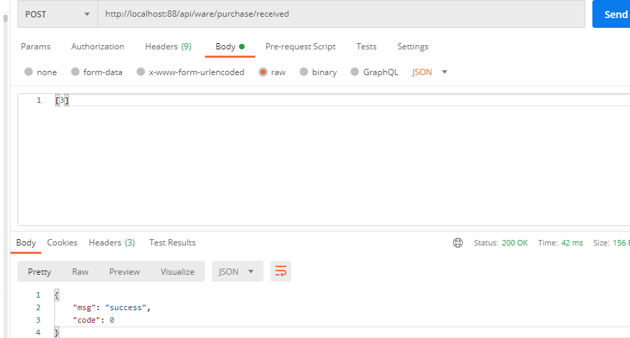

Controller

```java
/**
 *
 * @param ids
 * @return
 */
@PostMapping("/received")
public R received(@RequestBody List<Long> ids) {
    purchaseService.received(ids);

    return R.ok();
}
```

Service

```java
@Override
public void received(List<Long> ids) {
    // 1、确认当前采购单是 新建或者 已分配状态 才能进行采购
    List<PurchaseEntity> collect = ids.stream().map(id -> {
        // 根据采购id查询出采购信息
        PurchaseEntity byId = this.getById(id);
        return byId;
    }).filter(item -> {
        // 新建或者已分配留下
        if (item.getStatus() == WareConstant.PurchaseStatusEnum.CREATED.getCode() ||
                item.getStatus() == WareConstant.PurchaseStatusEnum.ASSIGNED.getCode()) {
            return true;
        }
        return false;
    }).map(item -> {
        // 设置为已领取
        item.setStatus(WareConstant.PurchaseStatusEnum.RECEIVE.getCode());
        item.setUpdateTime(new Date());
        return item;
    }).collect(Collectors.toList());

    // 2、改变采购单状态
    this.updateBatchById(collect);


    // 3、改变采购项的状态
    collect.forEach((item) -> {
        // 根据 purchase_id 查询出采购需求
        List<PurchaseDetailEntity> entities = purchaseDetailService.listDetailByPurchaseId(item.getId());
        //
        List<PurchaseDetailEntity> detailEntites = entities.stream().map(entity -> {
            PurchaseDetailEntity detailEntity = new PurchaseDetailEntity();

            detailEntity.setId(entity.getId());
            // 设置状态正在采购
            detailEntity.setStatus(WareConstant.PurchaseDetailStatusEnum.BUYING.getCode());
            return detailEntity;
        }).collect(Collectors.toList());
        // id批量更新
        purchaseDetailService.updateBatchById(detailEntites);
    });
}
```


**总结业务流程：**

业务分析

- 采购人员通过 APP 点击采购 完成对应的采购需求，这里使用的是 PostMan 来发送请求，发送请求 带的参数是什么？ 参数就是 采购Id
- 通过采购 Id 查询出采购相关信息，然后设置采购表的状态，设置成采购成功，同时通过这个 id 在 `wms_purchase_detail`  表中 **对应的是 purchase_id** 查询采购需求表的数据， 查询到后将他的状态设置成 **“正在采购“**

#### 14.3.3 完成采购

**具体需求：**

采购人员参与采购后，采购就会有他的结果，采购成功、采购失败，


有了请求参数，如果比较多，那么底考虑设计一个 VO 哦

```java
@PostMapping("/done")
public R finish(@RequestBody PurchaseDoneVo doneVo) {
    purchaseService.done(doneVo);

    return R.ok();
}
```

Vo

```java
@Data
public class PurchaseDoneVo {
    /**
     * 采购单id
     */
    @NotNull
    private Long id;
    public List<PurchaseItemDoneVo> items;

}
```

```
@Data
public class PurchaseItemDoneVo {

    /**
     * 完成/失败的需求详情
     */
    private Long itemId;
    /**
     * 状态
     */
    private Integer status;
    
    private String reason;
}
```

Service

```java
@Transactional
@Override
public void done(PurchaseDoneVo doneVo) {


    // 采购单id
    Long id = doneVo.getId();

    // 2、改变采购项目的状态
    Boolean flag = true;
    List<PurchaseItemDoneVo> items = doneVo.getItems();
    List<PurchaseDetailEntity> updates = new ArrayList<>();
    for (PurchaseItemDoneVo item : items) {
        PurchaseDetailEntity detailEntity = new PurchaseDetailEntity();
        // 如果采购失败
        if (item.getStatus() == WareConstant.PurchaseDetailStatusEnum.HASERROR.getCode()) {
            flag = false;
            detailEntity.setStatus(item.getStatus());
        } else {
            // 3、将成功采购的进行入库
            PurchaseDetailEntity entity = purchaseDetailService.getById(item.getItemId());
            wareSkuService.addStock(entity.getSkuId(),entity.getWareId(),entity.getSkuNum());
            detailEntity.setStatus(WareConstant.PurchaseDetailStatusEnum.FINISH.getCode());
        }
        detailEntity.setId(item.getItemId());
        updates.add(detailEntity);
    }
    // 批量更新
    purchaseDetailService.updateBatchById(updates);

    // 1、改变采购单状态
    PurchaseEntity purchaseEntity = new PurchaseEntity();
    purchaseEntity.setId(id);
    // 设置状态根据变量判断
    purchaseEntity.setStatus(flag?WareConstant.PurchaseStatusEnum.FINISH.getCode():WareConstant.PurchaseStatusEnum.HASERROR.getCode());
    purchaseEntity.setUpdateTime(new Date());
    this.updateById(purchaseEntity);

}
```

addStock方法

```java
@Override
public void addStock(Long skuId, Long wareId, Integer skuNum) {
    // 先根据 skuId 和 ware_id 查询 是否拥有这个用户
    List<WareSkuEntity> wareSkuEntities = wareSkuDao.selectList(new QueryWrapper<WareSkuEntity>().eq("sku_id", skuId).eq("ware_id", wareId));
    
    //没有这个用户 那就新增
    if(wareSkuEntities == null || wareSkuEntities.size() == 0) {
        WareSkuEntity wareSkuEntity = new WareSkuEntity();
        // 根据属性值设置
        wareSkuEntity.setSkuId(skuId);
        wareSkuEntity.setStock(skuNum);
        wareSkuEntity.setWareId(wareId);
        wareSkuEntity.setStockLocked(0);
        // TODO 远程查询sku的名字 如果失败整个事务不需要回滚
        try {
            // 远程调用 根据 skuid进行查询
            R info = productFeignService.info(skuId);
            Map<String,Object> map = (Map<String, Object>) info.get("skuInfo");
            if (info.getCode() == 0) {
                wareSkuEntity.setSkuName((String) map.get("skuName"));
            }
        } catch (Exception e) {
            e.printStackTrace();
        }
        wareSkuDao.insert(wareSkuEntity);
    }else {
        // 有该记录那就进行更新
    wareSkuDao.addStock(skuId,wareId,skuNum);
    }
}
```

addStock 具体实现

```java
<insert id="addStock">
UPDATE `wms_ware_sku` SET stock=stock+#{skuNum} WHERE sku_id=#{skuId} AND ware_id=#{wareId}
</insert>
```

完成采购  postman 模拟手机端发送请求

```bash
http://localhost:88/api/ware/purchase/done

{"id":3,"items":[
   	{"itemId":3,"status":3,"reason":""},
   	{"itemId":4,"status":3,"reason":""},
   	{"itemId":5,"status":3,"reason":""}
   ]
}
```


#### 14.3.4 Spu规格维护

**具体需求：**

前端项目遇到的问题： 需要自己去 router目录下找到 index.js 增加改行配置，主要是配置规格维护的路径

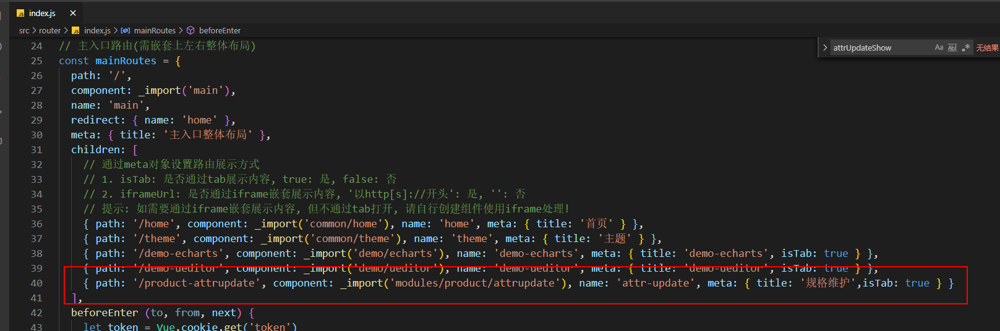

```js
{ path: '/product-attrupdate', component: _import('modules/product/attrupdate'), name: 'attr-update', meta: { title: '规格维护', isTab: true } }
```


P100点击规格找不到页面，解决：在数据库gulimall_admin执行以下sql再刷新页面即可：

```bash
INSERT INTO sys_menu (menu_id, parent_id, NAME, url, perms, TYPE, icon, order_num) 
VALUES (76,37,规格维护,product/attrupdate,'',2,LOG,0);
```


在 Spu管理上 点击规格后查询出相关规格信息

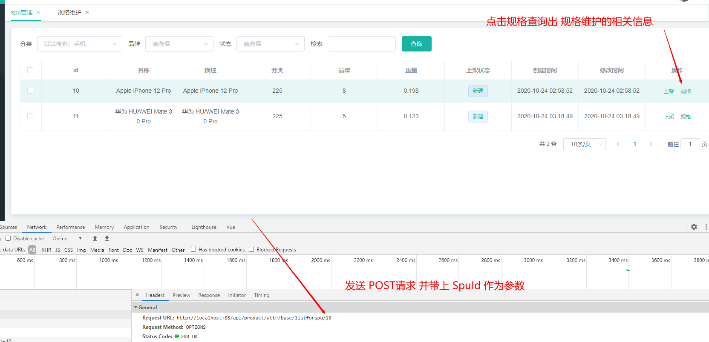

Controller

```java
@GetMapping("/base/listforspu/{spuId}")
public R baseAttrListforspu(@PathVariable("spuId") Long spuId) {
    List<ProductAttrValueEntity> productAttrValueEntity = productAttrValueService.baseAttrListforspu(spuId);
    return R.ok().put("data",productAttrValueEntity);
}
```

Service 

```java
@Override
public List<ProductAttrValueEntity> baseAttrListforspu(Long spuId) {
    // 1、根据spuid进行查询
    List<ProductAttrValueEntity> attrValueEntities = this.baseMapper.selectList(new QueryWrapper<ProductAttrValueEntity>().eq("spu_id", spuId));
    return attrValueEntities;
}
```

**总结业务流程：**

单表操作，根据 spu_id 查询出 `pms_product_attr_value` 表的信息


#### 14.3.5 Spu更新操作

**具体需求：**

根据spu_id 查询出规格信息后 ，修改对应信息 提交后会发送一个post请求，并同时带上请求参数

```json
[{
	"attrId": 7,
	"attrName": "入网型号",
	"attrValue": "LIO-AL00",
	"quickShow": 1
}, {
	"attrId": 14,
	"attrName": "机身材质工艺",
	"attrValue": "玻璃",
	"quickShow": 0
}, {
	"attrId": 16,
	"attrName": "CPU型号",
	"attrValue": "HUAWEI Kirin 980",
	"quickShow": 1
}]
```

刚好这四个参数和实体类的一致，就不需要创建 Vo来接收


Controller

```java
@RequestMapping("/update/{spuId}")
//@RequiresPermissions("product:attr:update")
public R updateSpuAttr(@PathVariable("spuId") Long spuId,
                       @RequestBody List<ProductAttrValueEntity> productAttrValueEntityList){

    productAttrValueService.updateSpuAttr(spuId,productAttrValueEntityList);
    return R.ok();
}
```

Service

```java
/**
 * 先删除 后更新
 * @param spuId
 * @param productAttrValueEntityList
 */
@Override
public void updateSpuAttr(Long spuId, List<ProductAttrValueEntity> productAttrValueEntityList) {
    // 1、根据spuid删除记录
    this.baseMapper.delete(new QueryWrapper<ProductAttrValueEntity>().eq("spu_id",spuId));

    // 2、遍历传递过来的记录 设置 spuId
    List<ProductAttrValueEntity> collect = productAttrValueEntityList.stream().map(item -> {
        item.setSpuId(spuId);
        return item;
    }).collect(Collectors.toList());
    // 3、批量保存
    this.saveBatch(collect);
}
```

**总结业务流程：**

- 更新操作，根据前端传递过来的参数来进行更新，前端传递了一个 `spu_id` 和多个 spu属性值 一个 `spu_id`对多个 spu 属性值
- 先根据 `spu_id` 删除存在 pms_product_attr_value 表的记录 
- 然后对多个  ProductAttrValueEntity 对象设置 sup_id ，最后进行批量保存


## 分布式基础篇总结

**1、分布式基础概念**

- 微服务、注册中心（Nacos）、配置中心（Nacos Cofig）、远程调用、Feign、网关

**2、基础开发**

- SpringBoot2.0、SpringCloud、Mybatis-Plus、Vue组件化、阿里云对象存储

**3、环境**

- Vagrant、Linux、Docker、MySQL、Redis、逆向工程&人人开源

**4、开发规范**

- 数据效验JSR303、全局异常处理、全局统一返回、全家跨越处理
- 枚举状态、业务状态、VO与TO与PO划分、逻辑删除
- Lombok:@Data、@Slf4j