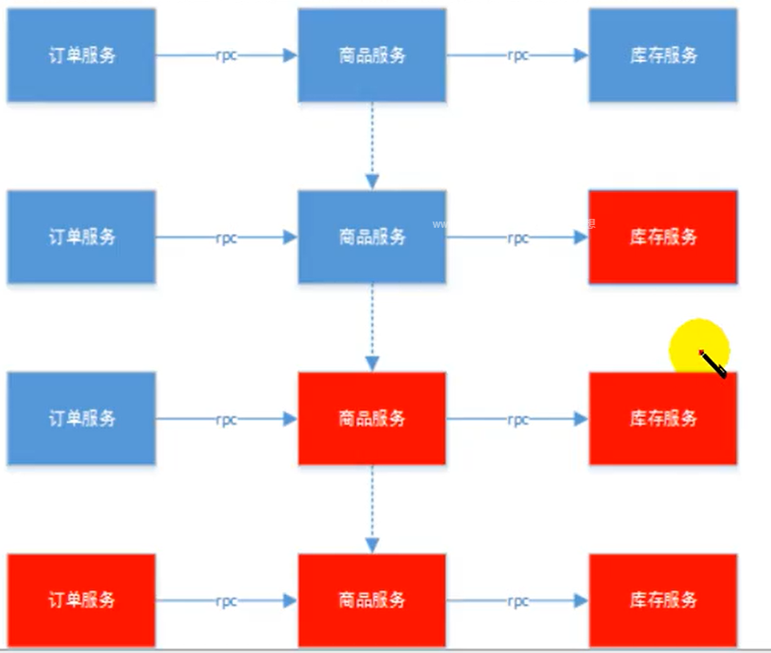
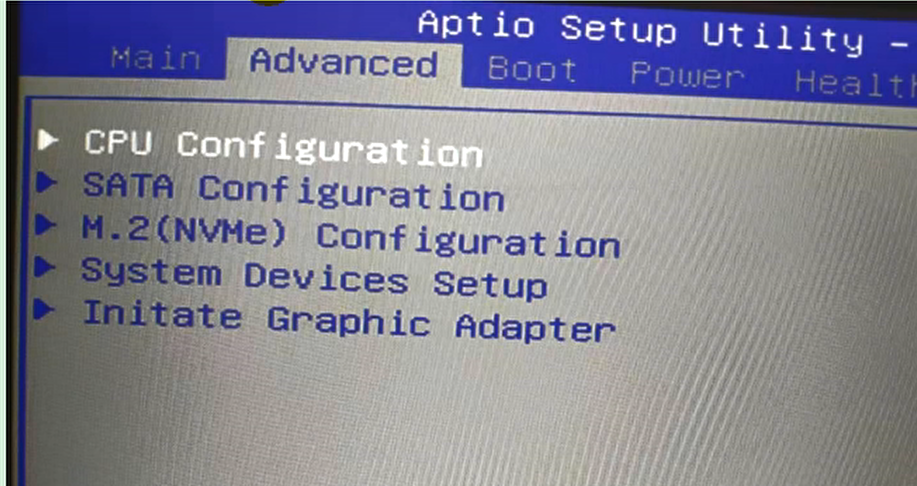
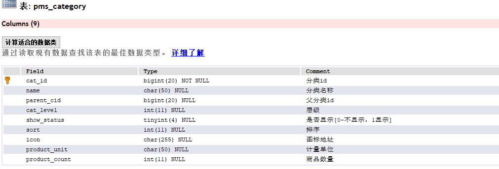
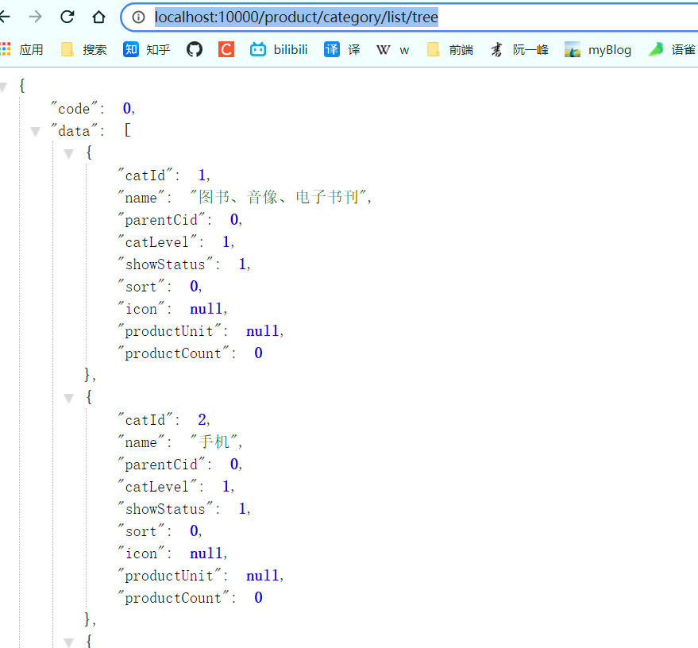

# 谷粒商城基础篇

2021.07.20--08.01      83.5h/13d/6.4h

## 一、项目简介

### 1.1 项目背景

### 1.2 电商模式

市面上有 5 种常见的电商模式 B2B、B2B、C2B、C2C、O2O

#### 1.2.1 B2B 模式

B2B(Business to Business)，是指商家和商家建立的商业关系，如 阿里巴巴，

#### 1.2.2 B2C 模式

B2C(Business to Consumer) 就是我们经常看到的供应商直接把商品买个用户，即 “商对客” 模式，也就是我们呢说的商业零售，直接面向消费销售产品和服务，如苏宁易购，京东，天猫，小米商城

#### 1.2.3 C2B 模式

C2B (Customer to Business),即消费者对企业，先有消费者需求产生而后有企业生产，即先有消费者提出需求，后又生产企业按需求组织生产

#### 1.2.4 C2C 模式

 C2C (Customer to Consumer) 客户之间吧自己的东西放到网上去卖 如 淘宝 咸鱼

#### 1.2.5 O2O 模式

O 2 O 即 Online To Offline，也即将线下商务的机会与互联网结合在一起，让互联网成为线下交易前台，线上快速支付，线下优质服务，如：饿了吗，美团，淘票票，京东到家

### 1.3 谷粒商城

谷粒商城是一个 B2C 模式的电商平台，销售自营商品给客户

### 1.4 项目架构图

1、项目微服务架构图


2、微服务划分图


### 1.5 项目技术&特色

- 前后分离开发，并开发基于 vue 的 后台管理系统
- SpringCloud 全新的解决方案
- 应用监控、限流、网关、熔断降级、等分布式方案，全方位涉及
- 透彻讲解分布式事务，分布式锁等分布式系统的难点
- 压力测试与性能优化
- 各种集群技术的区别以及使用
- CI/CD 使用

### 1.6 项目前置要求

学习项目的前置知识

- 熟悉 SpringBoot 以及常见整合方案
- 了解 SpringCloud
- 熟悉 git maven
- 熟悉 linux、redis docker 基本操作
- 了解 html，css，js，vue
- 熟练使用 idea 开发项目


## 二、分布式基础概念

### 2.1 微服务

微服务架构风格，就像是把一个单独的应用程序开发成一套小服务，每个小服务运行在自己的进程中，并使用轻量级机制**通信**，通常是 HTTP API 这些服务围绕业务能力来构建，	并通过完全自动化部署机制来独立部署，这些服务使用不同的编程语言书写，以及不同数据存储技术，并保持最低限度的集中式管理

**简而言之，拒绝大型单体应用，基于业务边界进行服务拆分，每个服务独立部署运行。**


### 2.2 集群&分布式&节点

集群是个物理状态，分布式是个工作方式

只要是一堆机器，也可以叫做集群，他不是不是一起协作干活，这谁也不知道，

《分布式系统原理与范型》定义：

“分布式系统是若干独立计算机的集合，这些计算机对于用户来说像但各相关系统”

分布式系统 (distributed system) 是建立网络之上的软件系统

分布式是指讲不通的业务分布在不同的地方

集群实质是将几台服务器集中在一起，实现同一业务

例如：京东是一个分布式系统，众多业务运行在不同的机器上，所有业务构成一个大型的业务集群，每一个小的业务，比如用户系统，访问压力大的时候一台服务器是不够的，我们就应该将用户系统部署到多个服务器，也就是每个一业务系统也可以做集群化

分布式中的每一个节点，都可以做集群，而集群并不一定就是分布式的

节点：集群中的一个服务器

### 2.3 远程调用

在分布式系统中，各个服务可能处于不同主机，但是服务之间不可避免的需要互相调用，我们称之为远程调用

SpringCloud 中使用 HTTP+JSON 的方式来完成远程调用


### 2.4 负载均衡


分布式系统中，A  服务需要调用 B 服务，B 服务在多台机器中都存在， A 调用任意一个服务器均可完成功能

为了使每一个服务器都不要太或者太闲，我们可以负载均衡调用每一个服务器，提升网站的健壮性

常见的负载均衡算法：

> 轮询：为第一个请求选择键康齿中的每一个后端服务器，然后按顺序往后依次选择，直到最后一个，然后循环

> 最小连接：优先选择链接数最少，也就是压力最小的后端服务器，在会话较长的情况下可以考虑采取这种方式

### 2.5 服务注册/发现&注册中心

A 服务调用 B 服务， A 服务不知道 B 服务当前在哪几台服务器上有，那些正常的，哪些服务已经下线，解决这个问题可以引入注册中心


如果某些服务下线，我们其他人可以实时的感知到其他服务的状态，从而避免调用不可用的服务

### 2.6 配置中心


每一个服务最终都有大量配置，并且每个服务都可能部署在多个服务器上，我们经常需要变更配置，我们可以让每个服务在配置中心获取自己的位置。

配置中心用来集中管理微服务的配置信息

### 2.7 服务熔断&服务降级

在微服务架构中，微服务之间通过网络来进行通信，存在相互依赖，当其中一个服务不可用时，有可能会造成雪崩效应，要防止这种情况，必须要有容错机制来保护服务



1、服务熔断

- 设置服务的超时，当被调用的服务经常失败到达某个阈值，我们可以开启断路保护机制，后来的请求不再去调用这个服务，本地直接返回默认的数据

2、服务降级

- 在运维期间，当系统处于高峰期，系统资源紧张，我们可以让非核心业务降级运行，降级：某些服务部处理，或者简单处理【抛异常，返回NULL，调用 Mock数据，调用 FallBack 处理逻辑】

### 2.8 API 网关

在微服务架构中，API Gateway 作为整体架构的重要组件，他 抽象类服务中需要的公共功能，同时它提供了客户端**负载均衡**，**服务自动熔断**，**灰度发布**，**统一认证**，**限流监控**，**日志统计**等丰富功能，帮助我们解决很多 API 管理的难题


## 三、环境搭建

### 3.1 安装 linux虚拟机

下载&安装 VirtualBox https://www.virtualbox.org/  要开启 CPU 虚拟化




CPU 查看


下载& 安装 Vagrant 

https://app.vagrantup.com/boxes/search Vagrant 官方镜像仓库

https://www.vagrantup.com/downloads.html Vagrant下载

```bash
# 1.打开window cmd窗口，运行 命令 ,即可初始化一个centos系统
#Vagrant init centos/7    官方的太慢了，更改为中科大的源
vagrant init centos7 https://mirrors.ustc.edu.cn/centos-cloud/centos/7/vagrant/x86_64/images/CentOS-7.box

# 2.运行vagrant up即可启动虚拟机。
vagrant up

# 3.系统root用户的密码是vagrant

# 4.vagrant其他常用命令
vagrant ssh 自动使用 vagrant 用户连接虚拟机
```

vagrant upload source [destination] [name|id] 上传文件

https://www.vagrantup.com/docs/cli/init.html Vagrant 命令行

默认虚拟机的ip 地址不是固定ip 开发不方便

**Vagrant 和 VirtualBox 版本有对应问题  都安装最新版本 则安装成功**

修改 Vagrantfile

  config.vm.network "private_network", ip: "192.168.56.10"

这里 ip 需要在 物理机下使用 ipconfig 命令找到


虚拟机与本机之间可以相互ping通

```bash
[vagrant@localhost ~]$ ping 192.168.148.1
PING 192.168.148.1 (192.168.148.1) 56(84) bytes of data.
64 bytes from 192.168.148.1: icmp_seq=1 ttl=127 time=0.704 ms
64 bytes from 192.168.148.1: icmp_seq=2 ttl=127 time=1.24 ms
64 bytes from 192.168.148.1: icmp_seq=3 ttl=127 time=1.38 ms
64 bytes from 192.168.148.1: icmp_seq=4 ttl=127 time=1.24 ms
64 bytes from 192.168.148.1: icmp_seq=5 ttl=127 time=1.19 ms
64 bytes from 192.168.148.1: icmp_seq=6 ttl=127 time=1.17 ms
64 bytes from 192.168.148.1: icmp_seq=7 ttl=127 time=1.16 ms

C:\Users\Administrator>ping 192.168.56.10

正在 Ping 192.168.56.10 具有 32 字节的数据:
来自 192.168.56.10 的回复: 字节=32 时间<1ms TTL=64
来自 192.168.56.10 的回复: 字节=32 时间<1ms TTL=64
来自 192.168.56.10 的回复: 字节=32 时间<1ms TTL=64
来自 192.168.56.10 的回复: 字节=32 时间<1ms TTL=64

192.168.56.10 的 Ping 统计信息:
    数据包: 已发送 = 4，已接收 = 4，丢失 = 0 (0% 丢失)，
往返行程的估计时间(以毫秒为单位):
    最短 = 0ms，最长 = 0ms，平均 = 0ms
```

这个Vagrant太费劲了，老是出现bug，改用VMware

### 3.2 安装 docker

Docker 安装文档参考官网

#### 3.2.1 卸载系统之前安装的 docker

Uninstall old versions

一步一步往下执行就行

```bash
sudo yum remove docker \
                  docker-client \
                  docker-client-latest \
                  docker-common \
                  docker-latest \
                  docker-latest-logrotate \
                  docker-logrotate \
                  docker-engine
```

SET UP THE REPOSITORY

Install the `yum-utils` package (which provides the `yum-config-manager` utility) and set up the **stable** repository.

```bash
# 1.安装基本的安装包
$ sudo yum install -y yum-utils

# 2.设置镜像仓库
$ sudo yum-config-manager \
    --add-repo \
    https://download.docker.com/linux/centos/docker-ce.repo # 默认是国外的
# 3.换成下面的阿里云镜像
$ sudo yum-config-manager \
    --add-repo \
    https://mirrors.aliyun.com/docker-ce/linux/centos/docker-ce.repo 

# 若报错  (60) Peer's Certificate issuer is not recognized.
#  vim   /etc/yum.conf
sslverify=false

 # 更像软件包索引  
  yum makecache fast  
  
  # 4.安装docker引擎
  yum install docker-ce docker-ce-cli containerd.io # docker-ce 社区版 ee 企业版
  
  #5. 启动Docker
  systemctl start docker # 代表启动成功
  
  #查看是否安装成功  docker version
  [root@localhost vagrant]# docker -v
Docker version 20.10.7, build f0df350
# 6 .设置docker开机自启动
sudo systemctl enable docker 

# 7.开启镜像加速  使用科大镜像
sudo mkdir -p /etc/docker
sudo tee /etc/docker/daemon.json <<-'EOF'
{
  "registry-mirrors": ["https://docker.mirrors.ustc.edu.cn/"]
}
EOF
sudo systemctl daemon-reload # 重启服务
sudo systemctl restart docker # 重启docker
```

### 3.3 docker 安装 mysql

#### 3.3.1 下载镜像文件

```bash
docker pull mysql:5.7
```

> bug
>
> Error response from daemon: Get https://registry-1.docker.io/v2/: x509: certificate signed by unknown authority
>
> 解决办法： 该镜像加速

#### 3.3.2 创建实例并启动，挂载

```bash
# --name指定容器名字 -v目录挂载 -p指定端口映射  -e设置mysql参数 -d后台运行
sudo docker run -p 3306:3306 --name mysql \
-v /mydata/mysql/log:/var/log/mysql \
-v /mydata/mysql/data:/var/lib/mysql \
-v /mydata/mysql/conf:/etc/mysql \
-e MYSQL_ROOT_PASSWORD=root \
-d mysql:5.7
####
-v 将对应文件挂载到主机
-e 初始化对应
-p 容器端口映射到主机的端口
```

**MySQL 配置**

vi /mydata/mysql/conf/my.cnf 创建&修改该文件

```bash
[client]
default-character-set=utf8
[mysql]
default-character-set=utf8
[mysqld]
init_connect='SET collation_connection = utf8_unicode_ci'
init_connect='SET NAMES utf8'
character-set-server=utf8
collation-server=utf8_unicode_ci
skip-character-set-client-handshake
skip-name-resolve
```

进入容器，**查看挂载情况**

```bash
[root@ppppp conf]# docker restart mysql
mysql
[root@ppppp conf]# docker exec -it mysql /bin/bash
root@edfa6af6b35f:/# cd /etc/mysql/
root@edfa6af6b35f:/etc/mysql# ls
my.cnf
root@edfa6af6b35f:/etc/mysql# cat my.cnf 
[client]
default-character-set=utf8
[mysql]
default-character-set=utf8
[mysqld]
init_connect='SET collation_connection = utf8_unicode_ci'
init_connect='SET NAMES utf8'
character-set-server=utf8
collation-server=utf8_unicode_ci
skip-character-set-client-handshake
skip-name-resolve
root@edfa6af6b35f:/etc/mysql# 
```

#### 3.3.3 通过容器的 mysql 命令行工具连接


### 3.4 docker 安装 redis

#### 3.4.1 下载镜像文件

docker pull redis

#### 3.4.2 创建实例并启动

```bash
mkdir -p /mydata/redis/conf
touch /mydata/redis/conf/redis.conf

# 启动 同时 映射到对应文件夹
# 后面 \ 代表换行
docker run -p 6379:6379 --name redis \
-v /mydata/redis/data:/data \
-v /mydata/redis/conf/redis.conf:/etc/redis/redis.conf \
-d redis redis-server /etc/redis/redis.conf
```

#### 3.4.3 使用 redis 镜像执行 redis-cli 命令连接

docker exec -it redis redis-cli

持久化 默认 appendonly on 没有开启

```bash
# 插入下面内容   更新后的版本不用加这个
vim /mydata/redis/conf/redis.conf
appendonly yes
```

#### 3.4.4 安装RDM可视化


### 3.5 开发环境统一

#### 3.5.1 Maven

springboot版本和springcloud版本

```xml
<java.version>1.8</java.version>
<spring-cloud.version>Greenwich.SR3</spring-cloud.version>
<artifactId>spring-boot-starter-parent</artifactId>
<version>2.1.8.RELEASE</version>
```


配置阿里云镜像

```xml
<mirrors>
		<mirror>
		<id>nexus-aliyun</id>
		<mirrorOf>central</mirrorOf>
		<name>Nexus aliyun</name>
		<url>http://maven.aliyun.com/nexus/content/groups/public</url>
		</mirror>
	</mirrors>
	
```

配置 jdk 1.8 编译项目

```xml
<profiles>
		<profile>
			<id>jdk-1.8</id>
			<activation>
				<activeByDefault>true</activeByDefault>
				<jdk>1.8</jdk>
			</activation>
			<properties>
				<maven.compiler.source>1.8</maven.compiler.source>
				<maven.compiler.target>1.8</maven.compiler.target>
				<maven.compiler.compilerVersion>1.8</maven.compiler.compilerVersion>
			</properties>
		</profile>
	</profiles>
```

#### 3.5.2 idea&VsCode

> idea 安装 lombok、mybatisx插件 Translation插件 等等..
>
> Vscode 安装开发必备插件
>
> Vetur ——语法高亮，智能感知 包含格式化功能，Alt+Shift+F (格式化全文) ，Ctrl+K Ctrl+F (格式化选中代码，两个Ctrl需要同时按着)
> EsLint 一一 语法纠错
> HTML CSS Support
> live server 
> Chinese (Simplified)
> open in browser
> Auto Close Tag 一一 自动闭合HTML/XML标签
> Auto Rename Tag 一一 自动完成另-侧标签的同步修改
> JavaScript(ES6) code snippets 一一 ES6 语法智能提示以及快速输入，除j外还支持.ts, .jsx， .tsx， .html, .vue;省去了配置其支持各种包含is代码文件的时间

VsCode开发vue 常用插件

https://blog.csdn.net/yujing1314/article/details/90340647

#### 3.5.3 安装配置 git

1、下载git

https://git-scm.com/

2、配置git 进入 git bash

```bash
# 配置用户名
git config --global user.name "user.name"
# 配置邮箱
git config --global user.email "username@email.com" # 注册账号使用的邮箱
```

3、配置 ssh 免密登录

https://github.com/settings/keys

```bash
git bash 使用 ssh-keygen -t rsa -C "XXX@xxx.com" 命令 连续三次回车
一般用户目录下都会有
id_rsa 文件
id_rsa.pub 文件
或者 cat ~/.ssh/id_rsa.pub
登录进 github/gitee 设置 SSH KEY
使用 ssh -T git@gitee.com 测试是否成功
具体过程参考百度
```

#### 3.5.4创建项目微服务

统一使用 2.1.8.release版本的 springboot

创建gulimall maven项目

然后再依次创建各个模块


```bash
# 依次创建出以下服务
com.atguigu.gulimall
gulimall-product 商品服务
gulimall-ware    存储服务
gulimall-order   订单服务
gulimall-coupon  优惠券服务
gulimall-member  用户服务
```

#### 3.5.5聚合服务

```xml
<?xml version="1.0" encoding="UTF-8"?>
<project xmlns="http://maven.apache.org/POM/4.0.0" xmlns:xsi="http://www.w3.org/2001/XMLSchema-instance"
	xsi:schemaLocation="http://maven.apache.org/POM/4.0.0 https://maven.apache.org/xsd/maven-4.0.0.xsd">
	<modelVersion>4.0.0</modelVersion>

	<groupId>com.atguigu.gulimall</groupId>
	<artifactId>gulimall</artifactId>
	<version>0.0.1-SNAPSHOT</version>
	<name>gulimall</name>
	<description>聚合服务</description>

	<packaging>pom</packaging>

	<modules>
		<module>gulimall-coupon</module>
		<module>gulimall-member</module>
		<module>gulimall-order</module>
		<module>gulimall-product</module>
		<module>gulimall-ware</module>
	</modules>
</project>
```

在maven窗口刷新，并点击+号，找到刚才的pom.xml添加进来，发现多了个root。这样比如运行root的clean命令，其他项目也一起clean了。

修改总项目的`.gitignore`，把小项目里的垃圾文件在提交的时候忽略掉，比如HELP.md。。。

```
**/mvnw
**/mvnw.cmd
**/.mvn
**/target/
.idea
**/.gitignore
```

#### 3.5.6 配置push到码云

#### 3.5.7 数据库

> 安装powerDesigner软件。http://forspeed.onlinedown.net/down/powerdesigner1029.zip，打开 `gmall_数据库设计.pdm`查看表格
>
> 

连接linux下的mysql数据库

注意重启虚拟机和docker后里面的容器就关了。

```bash
sudo docker ps
sudo docker ps -a
# 这两个命令的差别就是后者会显示  【已创建但没有启动的容器】

# 我们接下来设置我们要用的容器每次都是自动启动
sudo docker update redis --restart=always
sudo docker update mysql --restart=always
# 如果不配置上面的内容的话，我们也可以选择手动启动
sudo docker start mysql
sudo docker start redis
# 如果要进入已启动的容器
sudo docker exec -it mysql /bin/bash
# /bin/bash就是进入一般的命令行，如果改成redis就是进入了redis
```

**创建数据库**


```bash
gulimall_pms
gulimall_oms
gulimall_sms
gulimall_ums
gulimall_wms
pms_catelog
sys_menus
# 依次执行 sql文件
```

防火墙的原因 致使MysqlYog无法连接，关闭linux防火墙即可

#### 3.5.8人人项目npm

##### 1 .**renren-fast**（后端）

在码云上搜索人人开源，我们使用**renren-fast**（后端）、**renren-fast-vue**（前端）项目。

https://gitee.com/renrenio

下载到了桌面，我们把renren-fast移动到我们的项目文件夹（删掉.git文件），而renren-vue是用VSCode打开的（后面再弄）

在IDEA项目里的pom.xml添加一个renrnen-fast

```xml
<modules>
   ...
    <module>gulimall-ware</module>

    <module>renren-fast</module>
</modules>

```

然后打开renren-fast/db/mysql.sql，复制全部，在sqlyog中创建库guli-admin，粘贴刚才的内容执行。

然后修改项目里renren-fast中的application.yml，修改application-dev.yml中的数库库的url，通常把localhost修改为192.168.56.10即可。然后该对后面那个数据库

```bash
url: jdbc:mysql://192.168.159.128:3306/gulimall_admin?useUnicode=true&characterEncoding=UTF-8&serverTimezone=Asia/Shanghai
username: root
password: root
```

##### **2.人人vue（npm）**

用VSCode打开renren-fast-vue（如果自己搭建的话），如果是运行完整的代码，可以去课件里找gulimall-admin-vue-app

安装node：http://nodejs.cn/download/ 选择windows **10.16.3**下载。下载完安装。

`NPM`是随同`NodeJS`一起安装的包管理工具。JavaScript-NPM类似于java-Maven。

命令行输入`node -v` 检查配置好了，配置npm的镜像仓库地址，再执安装相关的vue依赖

```bash
node -v
v10.16.3
# 1.取消ssl验证：
npm config set strict-ssl false

# 2.将npm源更换为国内镜像：
npm config set registry http://registry.npm.taobao.org/
或
npm config set registry http://registry.cnpmjs.org/

# 3.执行安装相关的vue依赖
npm install
```

**启动fast-vue项目**

```bash
npm run dev
```

**idea 启动 `renren-fast`**

访问 localhost:8001


##### 3.人人项目-逆向工程

逆向工程搭建https://gitee.com/renrenio/renren-generator/repository/archive/master.zip

下载到桌面后，同样把里面的.git文件删除，然后移动到我们IDEA项目目录中，同样配置好pom.xml

```xml
<modules>
   ....
    <module>renren-fast</module>
    <module>renren-generator</module>
</modules>

```

在maven中刷新一下，让项目名变粗体，稍等下面进度条完成。

修改application.yml

```yaml
url: jdbc:mysql://192.168.56.10:3306/gulimall-pms?useUnicode=true&characterEncoding=UTF-8&useSSL=false&serverTimezone=Asia/Shanghai
username: root
password: root
```

然后修改generator.properties（这里乱码的百度IDEA设置properties编码）

```properties
# 主目录
mainPath=com.atguigu
#包名
package=com.atguigu.gulimall
#模块名
moduleName=product
#作者
author=ppppp
#email
email=815000345@qq.com
#表前缀(类名不会包含表前缀) # 我们的pms数据库中的表的前缀都pms
# 如果写了表前缀，每一张表对于的javaBean就不会添加前缀了
tablePrefix=pms_
```

访问 localhost:80


运行RenrenApplication。如果启动不成功，修改application中是port为801。访问http://localhost:801/

在网页上下方点击每页显示50个（pms库中的表），以让全部都显示，然后点击全部，点击生成代码。下载了压缩包

解压压缩包，把main放到gulimall-product的同级目录下。

##### 4.common

然后在项目上右击（在项目上右击很重要）new modules— maven—然后在name上输入gulimall-common。

在pom.xml中也自动添加了<module>gulimall-common</module>

在common项目的pom.xml中添加

```xml
<?xml version="1.0" encoding="UTF-8"?>
<project xmlns="http://maven.apache.org/POM/4.0.0"
         xmlns:xsi="http://www.w3.org/2001/XMLSchema-instance"
         xsi:schemaLocation="http://maven.apache.org/POM/4.0.0 http://maven.apache.org/xsd/maven-4.0.0.xsd">
    <parent>
        <artifactId>gulimall</artifactId>
        <groupId>com.atguigu.gulimall</groupId>
        <version>0.0.1-SNAPSHOT</version>
    </parent>
    <modelVersion>4.0.0</modelVersion>
    <groupId>com.atguigu.gulimall</groupId>
    <artifactId>gulimall-common</artifactId>
    <version>0.0.1-SNAPSHOT</version>
    <name>gulimall-common</name>
    <description>谷粒商城-公共模块</description>
    <dependencies>
        <!-- mybatisPLUS-->
        <dependency>
            <groupId>com.baomidou</groupId>
            <artifactId>mybatis-plus-boot-starter</artifactId>
            <version>3.3.2</version>
        </dependency>
        <!--简化实体类，用@Data代替getset方法-->
        <dependency>
            <groupId>org.projectlombok</groupId>
            <artifactId>lombok</artifactId>
            <version>1.18.8</version>
        </dependency>
        <!-- httpcomponent包。发送http请求 -->
        <dependency>
            <groupId>org.apache.httpcomponents</groupId>
            <artifactId>httpcore</artifactId>
            <version>4.4.13</version>
        </dependency>
        <dependency>
            <groupId>commons-lang</groupId>
            <artifactId>commons-lang</artifactId>
            <version>2.6</version>
        </dependency>
    </dependencies>
</project>
```

我们把每个微服务里公共的类和依赖放到common里。

然后在product项目中的pom.xml中加入下面内容，作为common的子项目

```xml
<dependency>
    <groupId>com.atguigu.gulimall</groupId>
    <artifactId>gulimall-common</artifactId>
    <version>0.0.1-SNAPSHOT</version>
</dependency>
```

**复制**

renren-fast----utils包下的Query和PageUtils、R、Constant复制到common项目的java/com.atguigu.common.utils下。另外关于R的类，它继承了hashmap，你会发现map里的table数组是transient的，也就是不序列化的，但还好在它实现了Clonable接口重写了clone方法，该方法中会new新的数组作为序列号内容，所以hashmap可以用作序列化。但是序列号还是浅拷贝。在远程调用响应中，按理说应该自己序列化深拷贝后远程才能拿到，所以我得想法是应该自己序列化之后穿字节码(所以说json字符串)过去，但是视频里直接设置object就传输过去了，我比较奇怪为什么这种情况传输的不是浅拷贝？难道是mvc有这个自动序列化机制？之前读mvc源码没太注意，如果有人懂这个问题麻烦告知一下

- 把@RequiresPermissions这些注解掉，因为是shiro的

- 复制renren-fast中的xss包粘贴到common的com.atguigu.common目录下。

还复制了exception文件夹，对应的位置关系自己观察一下就行

- 注释掉product项目下类中的//import org.apache.shiro.authz.annotation.RequiresPermissions;，他是shiro的东西

注释renren-generator\src\main\resources\template/Controller中所有的@RequiresPermissions。## import org.apache.shiro.authz.annotation.RequiresPermissions;

总之什么报错就去fast里面找。重启逆向工程。重新在页面上得到压缩包。重新解压出来，不过只把里面的controller复制粘贴到product项目对应的目录就行。

## 四、MybatisPlus整合

### 4.1 配置环境

在common的pom.xml中导入

#### 4.1.1、导入依赖

```xml
<dependency>
    <groupId>com.baomidou</groupId>
    <artifactId>mybatis-plus-boot-starter</artifactId>
    <version>3.2.0</version>
</dependency>
```

#### 4.2.2、配置数据源

配置数据源

1. ##### 导入数据库驱动

   https://mvnrepository.com/artifact/mysql/mysql-connector-java

   ```xml
   <!--导入mysql驱动-->
   <dependency>
       <groupId>mysql</groupId>
       <artifactId>mysql-connector-java</artifactId>
       <version>8.0.17</version>
   </dependency>
   <!--tomcat里一般都带-->
   <dependency>
       <groupId>javax.servlet</groupId>
       <artifactId>servlet-api</artifactId>
       <version>2.5</version>
       <scope>provided</scope>
   </dependency>
   ```

2. ##### 在application.yml配置数据源相关信息

   ```yml
   spring:
     datasource:
       username: root
       password: root
       url: jdbc:mysql://192.168.56.10:3306/gulimall_pms
       driver-class-name: com.mysql.jdbc.Driver
   mybatis-plus:
   	# mapper文件扫描
     mapper-locations: classpath*:/mapper/**/*.xml
     global-config:
       db-config:
         id-type: auto # 数据库主键自增
   ```

> classpath 和 classpath* 区别：
> classpath：只会到你的class路径中查找找文件;
> classpath*：不仅包含class路径，还包括jar文件中(class路径)进行查找
>
> classpath*的使用：当项目中有多个classpath路径，并同时加载多个classpath路径下（此种情况多数不会遇到）的文件，*就发挥了作用，如果不加*，则表示仅仅加载第一个classpath路径。

配置MyBatis-Plus包扫描：

1. 使用@MapperScanner

2. 告诉MyBatis-Plus,Sql映射文件位置

   ```java
   @MapperScan("com.atguigu.gulimall.product.dao")
   @SpringBootApplication
   public class GulimallProductApplication {
       public static void main(String[] args) {
           SpringApplication.run(GulimallProductApplication.class, args);
       }
   }
   ```

   然后去测试，先通过下面方法给数据库添加内容

```java
@SpringBootTest
class gulimallProductApplicationTests {
    @Autowired
    BrandService brandService;

    @Test
    public void contextLoads() {
        BrandEntity brandEntity = new BrandEntity();
        brandEntity.setDescript("哈哈1哈");
        brandEntity.setName("华为");
        brandService.save(brandEntity);
        System.out.println("保存成功");
    }
}
```

在数据库中就能看到新增数据了

#### coupon模块整合

优惠券服务。重新打开generator逆向工程，修改generator.properties和 application.yml中的数据库,然后启动 renren_gen

```properties
#模块名
moduleName=coupon
...
tablePrefix=sms_
```

```yaml
url: jdbc:mysql://192.168.159.128:3306/gulimall_sms?useUnic
```

让coupon也依赖于common，修改pom.xml

```xml
<dependency>
    <groupId>com.atguigu.gulimall</groupId>
    <artifactId>gulimall-common</artifactId>
    <version>0.0.1-SNAPSHOT</version>
</dependency>
```

##### 测试

http://localhost:8080/coupon/coupon/list

```bash
{"msg":"success","code":0,"page":{"totalCount":0,"pageSize":10,"totalPage":0,"currPage":1,"list":[]}}
```

#### member

数据库-- gulimall-ums

重启web后，http://localhost:8000/member/growthchangehistory/list

#### order

数据库--    gulimall-oms

http://localhost:9000/order/order/list

#### ware

数据库--    gulimall-wms

http://localhost:11000/ware/wareinfo/list


### 4.2 分页配置

```java
@Configuration // 声明配置类
@EnableTransactionManagement // 开启注解
@MapperScan("com.atguigu.gulimall.product.dao") // 指定扫描包
public class MyBatisConfig {


    /**
     * 引入分页插件 拦截器
     * @return
     */
    @Bean
    public PaginationInterceptor paginationInterceptor() {
        PaginationInterceptor paginationInterceptor = new PaginationInterceptor();
        // 设置请求的页面大于最大页后操作， true调回到首页，false 继续请求  默认false
         paginationInterceptor.setOverflow(true);
        // 设置最大单页限制数量，默认 500 条，-1 不受限制
         paginationInterceptor.setLimit(1000);
        // 开启 count 的 join 优化,只针对部分 left join
        paginationInterceptor.setCountSqlParser(new JsqlParserCountOptimize(true));
        return paginationInterceptor;
    }
}
```

### 4.3 逻辑删除

说明:

只对自动注入的sql起效:

- 插入: 不作限制
- 查找: 追加where条件过滤掉已删除数据,且使用 wrapper.entity 生成的where条件会忽略该字段
- 更新: 追加where条件防止更新到已删除数据,且使用 wrapper.entity 生成的where条件会忽略该字段
- 删除: 转变为 更新

例如:

- 删除: `update user set deleted=1 where id = 1 and deleted=0`
- 查找: `select id,name,deleted from user where deleted=0`

#### 步骤1：配置 application.yml

```yaml
mybatis-plus:
  mapper-locations: classpath*:/mapper/**/*.xml
  global-config:
    db-config:
      id-type: auto # 数据库主键自增
      logic-delete-value: 1 # 逻辑已删除值(默认为 1)
      logic-not-delete-value: 0 # 逻辑未删除值(默认为 0)
```

#### 步骤2: 实体类字段上加上`@TableLogic`注解

```java
/**
 * 是否显示[0-不显示，1显示]
 */
@TableLogic(value = "1",delval = "0")
private Integer showStatus;
```

## 五、SpringCloud Alibaba

### 5.1 SpringCloud Alibaba 简介

#### 5.1.1、简介

Spring Cloud Alibaba 致力于提供微服务开发的一站式解决方案。此项目包含开发分布式应用微服务的必需组件，方便开发者通过 Spring Cloud 编程模型轻松使用这些组件来开发分布式应用服务。

依托 Spring Cloud Alibaba，您只需要添加一些注解和少量配置，就可以将 Spring Cloud 应用接入阿里微服务解决方案，通过阿里中间件来迅速搭建分布式应用系统。


#### 5.1.2、为什么要使用 ?


**SpringClouid的几大痛点：**

SpringCloud部分组件停止维护和更新，给开发带来不便;

SpringCloud部分环境搭建复杂，没有完善的可视化界面，我们需要大量的二次开发和定制

SpringCloud配置复杂，难以上手，部分配置差别难以区分和合理应用


**SpringCloud Alibaba的优势：**

阿里使用过的组件经历了考验，性能强悍，设计合理，现在开源出来大家用

成套的产品搭配完善的可视化界面给开发运维带来极大的便利

搭建简单，学习曲线低。


**结合SpringCloud Alibaba我们最终的技术搭配方案：**

SpringCloud Alibaba - Nacos : 注册中心 (服务发现/注册)

SpringCloud Alibaba- Nacos: 配置中心 (动态配置管理)

SpringCloud - Ribbon: 负载均衡

SpringCloud - Feign: 声明式HTTP客户端(调用远程服务)

SpringCloud Alibaba - Sentinel: 服务容错(限流、降级、熔断)

SpringCloud - Gateway:  API 网关 (webflux 编程模式)

SpringCloud - Sleuth:调用链监控

SpringCloud Alibaba - Seata: 原Fescar, 即分布式事务解决方案


版本适配


### 5.2 Nacos [作为注册中心]

在common的pom.xml中加入

```xml
<dependencyManagement>
    <dependencies>
        <dependency>
            <groupId>com.alibaba.cloud</groupId>
            <artifactId>spring-cloud-alibaba-dependencies</artifactId>
            <version>2.1.0.RELEASE</version>
            <type>pom</type>
            <scope>import</scope>
        </dependency>
    </dependencies>
</dependencyManagement>
```

上面是依赖管理，相当于以后再dependencies里引spring cloud alibaba就不用写版本号， 全用dependencyManagement进行管理。注意他和普通依赖的区别，他只是备注一下，并没有加入依赖


Nacos 是阿里巴巴开源的一个更易于构建云原生应用的动态服务发现，配置管理和服务管理平台，他是使用 java 编写的，需要依赖 java 环境

Nacos 文档地址： https://nacos.io/zh-cn/docs/quick-start.html

#### 5.2.1、下载 nacos-server

https://github.com/alibaba/nacos/releases

#### 5.2.2、启动 nacos-server

- cmd 运行startup.cmd 文件
- 访问localhost:8848/nacos/
- 使用默认的 nacos/nacos 登录


#### 5.2.3、注册进入 nacos 中

1、首先，修改common的 pom.xml 文件，引入  Nacos Discovery Starter

```xml
 <dependency>
     <groupId>com.alibaba.cloud</groupId>
     <artifactId>spring-cloud-starter-alibaba-nacos-discovery</artifactId>
 </dependency>
```

2、在应用的 /resource /application.properties 中配置 Nacos Server地址

```PROPER
spring.cloud.nacos.discovery.server-addr=127.0.0.1:8848
```

3、使用@EnableDiscoveryClient **开启**服务注册发现功能

```java
 @SpringBootApplication
 @EnableDiscoveryClient
 public class ProviderApplication {

 	public static void main(String[] args) {
 		SpringApplication.run(ProviderApplication.class, args);
 	}
 }
```

4、启动应用、观察 nacos 服务列表是否已经注册上服务

注意每一个应用都应该有**名字**，这样才能往册上去。修改pplicaion.propertes文件

```properties
spring.application.name= service provider
server.port=8000
```

5、注册更多的服务上去，测试使用 feign 远程

**Nacos 使用三步**

1、导包

2、写配置，指定 nacos 地址，指定应用的名字

3、开启服务注册发现功能 @EnableDiscoveryClient

#### 5.2.4 Feign（远程调用）

声明式远程调用

​		feign是一个声明式的HTTP客户端，他的目的就是让远程调用更加简单。给远程服务发的是HTTP请求。

​		会员服务想要远程调用优惠券服务，只需要给会员服务里引入openfeign依赖，他就有了远程调用其他服务的能力。

##### **1、导包 openfeign**

```xml
<dependency>
    <groupId>org.springframework.cloud</groupId>
    <artifactId>spring-cloud-starter-openfeign</artifactId>
</dependency>
```

在coupon中修改如下的内容

```java
@RequestMapping("coupon/coupon")
public class CouponController {
    @Autowired
    private CouponService couponService;

    @RequestMapping("/member/list")
    public R membercoupons(){    //全系统的所有返回都返回R
        // 应该去数据库查用户对于的优惠券，但这个我们简化了，不去数据库查了，构造了一个优惠券给他返回
        CouponEntity couponEntity = new CouponEntity();
        couponEntity.setCouponName("满100-10");//优惠券的名字
        return R.ok().put("coupons",Arrays.asList(couponEntity));
    }

```

这样我们准备好了优惠券的调用内容

##### 2、开启 @FeignClients 功能

在member的com.atguigu.gulimall.member.feign包下新建接口：

编写一个接口，接口告诉springcloud这个接口需要调用远程服务
* 	在接口里声明@FeignClient("gulimall-coupon")他是一个远程调用客户端且要调用名为`gulimall-coupon`的服务
* 	要调用服务的 `/coupon/coupon/member/list`方法

```java
@FeignClient("gulimall-coupon") 
public interface CouponFeignService {
    // 远程服务的url
    @RequestMapping("/coupon/coupon/member/list")
    //注意写全优惠券类上还有映射
    	//注意我们这个地方不是控制层，所以这个请求映射请求的不是我们服务器上的东西，而是nacos注册中心的
    public R membercoupons();//得到一个R对象
}
```

##### 3、开启远程调用功能 @EnableFeignClients，要指定远程调用功能放的基础包

```java
@EnableFeignClients(basePackages="com.atguigu.gulimall.member.feign")//扫描接口方法注解
@EnableDiscoveryClient
@SpringBootApplication
public class gulimallMemberApplication {

	public static void main(String[] args) {
		SpringApplication.run(gulimallMemberApplication.class, args);
	}
}
```

##### 4.测试  远程调用和本地调用

在com.atguigu.gulimall.member.controller.MemberController 中写一个测试请求

```java
@RestController
@RequestMapping("member/member")
public class MemberController {
    @Autowired
    private MemberService memberService;

    @Autowired
    CouponFeignService couponFeignService;

    @RequestMapping("/coupons")
    public R test(){
        MemberEntity memberEntity = new MemberEntity();
        memberEntity.setNickname("会员昵称张三");
        R membercoupons = couponFeignService.membercoupons();//假设张三去数据库查了后返回了张三的优惠券信息

        //打印会员和优惠券信息
        return R.ok().put("member",memberEntity).put("coupons",membercoupons.get("coupons"));
    }

```

测试member和coupon的远程调用

```bash
访问:http://localhost:8000/member/member/coupons
```

得到结果:

```json
{"code":0,"coupons":[{"id":null,"couponType":null,"couponImg":null,"couponName":"满100-10","num":null,"amount":null,"perLimit":null,"minPoint":null,"startTime":null,"endTime":null,"useType":null,"note":null,"publishCount":null,"useCount":null,"receiveCount":null,"enableStartTime":null,"enableEndTime":null,"code":null,"memberLevel":null,"publish":null}],
"member":{"id":null,"levelId":null,"username":null,"password":null,"nickname":"会员昵称张三","mobile":null,"email":null,"header":null,"gender":null,"birth":null,"city":null,"job":null,"sign":null,"sourceType":null,"integration":null,"growth":null,"status":null,"createTime":null}}
```


想要获取当前会员领取到的所有优惠券。先去注册中心找优惠券服务，注册中心调一台优惠券服务器给会员，会员服务器发送请求给这台优惠券服务器，然后对方响应。

- 服务请求方发送了2次请求，先问nacos要地址，然后再请求


### 5.3 Nacos [作为配置中心]

#### 1、引入依赖

```xml
  <!--配置中心来做配置管理-->
<dependency>
   <groupId>com.alibaba.cloud</groupId>
   <artifactId>spring-cloud-starter-alibaba-nacos-config</artifactId>
</dependency>
```

#### 2、创建 bootstrap.properties

这个文件是springboot里规定的，他**优先级别**application.properties高

```properties
spring.application.name=gulimall-coupon
spring.cloud.nacos.config.server-addr=127.0.0.1:8848
```

在 application.properties中添加配置信息

```properties
coupon.user.name=jingjing
coupon.user.age=18
```

```java
@RefreshScope // 刷新对应controller
@RestController
@RequestMapping("coupon/coupon")
public class CouponController {
    @Autowired
    private CouponService couponService;

    @Value("${coupon.user.name}")
    private String name;

    @Value("${coupon.user.age}")
    private Integer age;
    @RequestMapping("/test")
    public R test() {
        return R.ok().put("name",name).put("age",age);
    }
}
```

测试：访问  http://localhost:7000/coupon/coupon/test

>**{**"code": **0**,"name": "jingjing","age": *18*}

#### 3.nacos 中添加默认数据集

data ID：`gulimall-coupon.properties`，默认规则：应用名.properties

```properties
# gulimall-coupon.properties
coupon.user.name="配置中心"      
coupon.user.age=12
```

#### 4.动态获取配置

但是修改肿么办？实际生产中不能重启应用。在coupon的控制层上加`@RefreshScope`

在应用中使用 @RefreshScope,就可以动态刷新了，不需要重启服务

再次访问，可以看到配置已刷新

> 如果配置中心和当前应用的配置文件中都配置了相同的项,优先使用配置中心的配置。

#### 5.进阶


   1）、命名空间：配置隔离；
       默认：public(保留空间)；默认新增的所有配置都在public空间。
       1、开发，测试，生产：利用命名空间来做环境隔离。
          注意：在bootstrap.properties；配置上，需要使用哪个命名空间下的配置，
          spring.cloud.nacos.config.namespace=9de62e44-cd2a-4a82-bf5c-95878bd5e871
       2、每一个微服务之间互相隔离配置，每一个微服务都创建自己的命名空间，只加载自己命名空间下的所有配置

   2）、配置集：所有的配置的集合

   3）、配置集ID：类似文件名。
       Data ID：类似文件名

   4）、配置分组：
       默认所有的配置集都属于：**DEFAULT_GROUP**；
       1111，618，1212

  **项目中的使用**：每个微服务创建自己的命名空间，使用配置分组区分环境，dev，test，prod


  3、同时加载多个配置集
  1)、微服务任何配置信息，任何配置文件都可以放在配置中心中
  2）、只需要在bootstrap.properties说明加载配置中心中哪些配置文件即可
  3）、@Value，@ConfigurationProperties。。。
  以前SpringBoot任何方法从配置文件中获取值，都能使用。
  配置中心有的优先使用配置中心中的，

**bootstrap.properties 配置**

```properties
spring.application.name=gulimall-coupon
spring.cloud.nacos.config.server-addr=127.0.0.1:8848
# prod 配置中心的 id
spring.cloud.nacos.config.namespace=7244caa1-701e-4099-a65a-0280b85ad5f3
spring.cloud.nacos.config.group=dev

# 配置集指定data_id
spring.cloud.nacos.config.ext-config[0].data-id=datasource.yml
# 配置集指定 group 分组
spring.cloud.nacos.config.ext-config[0].group=dev
# 是否动态刷新 在配置中心修改后 微服务自动刷新
spring.cloud.nacos.config.ext-config[0].refresh=true

spring.cloud.nacos.config.ext-config[1].data-id=mybatis-plus.yml
spring.cloud.nacos.config.ext-config[1].group=dev
spring.cloud.nacos.config.ext-config[1].refresh=true

spring.cloud.nacos.config.ext-config[2].data-id=other.yml
spring.cloud.nacos.config.ext-config[2].group=dev
spring.cloud.nacos.config.ext-config[2].refresh=true
```

配置文件的拆分


### 网关

**新建 guli-gateway模块**

添加 guli-common 模块的依赖

**编写application.properties文件**，配置nacos注册中心地址applicaion.properties。这样gateway也注册到了nacos中，其他服务就能找到nacos，网关也能通过nacos找到其他服务。

```properties
spring.cloud.nacos.discovery.server-addr=127.0.0.1:8848
spring.application.name=gulimall-gateway
server.port=88
```

**bootstrap.properties** 填写nacos配置中心地址

```properties
spring.application.name=gulimall-gateway
spring.cloud.nacos.config.server-addr=127.0.0.1:8848
spring.cloud.nacos.config.namespace=bfa85f10-1a9a-460c-a7dc-efa961b45cc1
```

**业务类**

在gateway服务中开启注册服务发现`@EnableDiscoveryClient`，

**测试**

启动项目，访问 ：

localhost:8080/hello?url=baidu，可以到百度

localhost:8080/hello?url=baidu    可以访问腾讯


## 六、前端开发基础知识

[前端笔记](前端笔记.md)


## 七、商品服务API-品牌管理

**按照这个理解，SPU就是俗称的“款”；SKU就是商品的“件”。**

SPU：苹果6（商品聚合信息的最小单位），如手机->苹果手机->苹果6，苹果6就是SPU。

SKU：土豪金 16G 苹果6 （商品的不可再分的最小单元）。

从广义上讲，类目>SPU>SKU。

### 1. 三级分类


一级分类查出二级分类数据，二级分类中查询出三级分类数据

**数据库设计**



#### pms_category表说明

代表商品的分类

这里有sql和entity不对应的情况，有的sql文件改起来比较麻烦，下面这个sql应该是准确的。不明白的看前面的数据库章节

在 pms 数据库里执行  pms_catelog.sql 

编写显示代码

访问  http://localhost:10000/product/category/list/tree  显示商品信息



**启动 renren-fast-vue**

```bash
# 在 renren-fast-vue 文件夹下
npm run dev
```

 点击系统管理，菜单管理，新增


继续新增：


**创建`mudules/product/category.vue`**

**添加 el中的 树形数据**

输入vue快捷生成模板，然后去https://element.eleme.cn/#/zh-CN/component/tree


### 2.配置网关和路径重写

- 1.清空  data: [],数据
- 2.在method中添加

```java
methods: {
   ,,,
    getMenus(){
        this.$http({
          url: this.$http.adornUrl('/product/category/list/tree'),
          method: 'get',
        }).then(({data}) => {
            console.log("成功获取数据",data)
        })
    },
```

- 3. 生命周期 - 创建完成（可以访问当前this实例）

```java
  created() {
      this.getMenus();
  },
```

​		在登录管理后台的时候，我们会发现，他要请求`localhost:8080/renren-fast/product/category/list/tree`这个url但是报错404找不到，此处就解决登录页验证码不显示的问题。

​		他要给8080发请求读取数据，但是数据是在10000端口上，如果找到了这个请求改端口那改起来很麻烦。方法1是改vue项目里的全局配置，方法2是搭建个网关，让网关路由到10000（即将vue项目里的请求都给网关，网关经过url处理后，去nacos里找到管理后台的微服务，就可以找到对应的端口了，这样我们就无需管理端口，**统一交给网关管理端口接口**）

在`static/config/index.js`里,

> // api接口请求地址
>
> window.SITE_CONFIG['baseUrl'] = 'http://localhost:88/api';

让fast注册到服务注册中心，这样请求88网关转发到8080fast

```bash
# 1.让fast里加入注册中心的依赖  引入 guli-common 模块即可

# 2.在renren-fast项目中添加
spring:
  application:
    name:  renren-fast  # 意思是把renren-fast项目也注册到nacos中(后面不再强调了)，这样网关才能转发给
    cloud:
      nacos:
        discovery:
          server-addr: localhost:8848 # nacos
server:
  port: 88

# 3.然后在fast启动类上加上注解@EnableDiscoveryClient，重启

# 4.重写gatewall的路由规则
```

```yaml
spring:
  cloud:
    gateway:
      routes:
        - id: admin_route
          uri: lb://renren-fast
          predicates:
            - Path=/api/**
          filters:
#          将 路由转化
#  http://localhost:88/api/captcha.jpg?uuid=f72e282b-1939-4e7e-874e-f4443edf7538
#  http://localhost:8080/renren-fast/captcha.jpg?uuid=f72e282b-1939-4eee-874e-f4443edf7538
            - RewritePath=/api/(?<segment>.*),/renren-fast/$\{segment}
```

### 3.网关统一配置跨域

验证码正确后，又出现了 如下错误

```bash
Access to XMLHttpRequest at 'http://localhost:88/api/sys/login' from origin 'http://localhost:8001' has been blocked by CORS policy: Response to preflight request doesn't pass access control check: No 'Access-Control-Allow-Origin' header is present on the requested resource.
```

#### 3.1跨域定义

跨域：指的是浏览器不能执行其他网站的脚本。它是由浏览器的同源策略造成的，是浏览器对javascript施加的安全限制。

同源策略：是指协议，域名，端口都要相同，其中有一个不同都会产生跨域；

下图详细说明了 URL  的改变导致是否允许通信


#### 3.2跨域流程


浏览器发请求都要实现发送一个请求询问是否可以进行通信 ，我直接给你返回可以通信不就可以了吗？


相关资料参考：https://developer.mozilla.org/zh-CN/docs/Web/HTTP/Access_control_CORS

> 解决跨越（ 一 ） 使用nginx部署为同一域

开发过于麻烦，上线在使用


> 解决跨域 （ 二 ）配置当次请求允许跨域

1、添加响应头

- Access-Control-Allow-Origin: 支持哪些来源的请求跨域

- Access-Control-Allow-Methods: 支持哪些方法跨域

- Access-Control-Allow-Credentials: 跨域请求默认不包含cookie,设置为true可以包含cookie

- Access-Control-Expose-Headers: 跨域请求暴露的字段

  ​	CORS请求时, XML .HttpRequest对象的getResponseHeader()方法只能拿到6个基本字段: CacheControl、Content-L anguage、Content Type、Expires、 

  Last-Modified、 Pragma。 如果想拿到其他字段，就必须在Access-Control-Expose-Headers里面指定。

- Access-Control-Max- Age: 表明该响应的有效时间为多少秒。在有效时间内，浏览器无须为同一-请求再次发起预检请求。请注意，浏览器自身维护了一个最大有效时间，如果该首部字段的值超过了最大有效时间，将不会生效。

跨域设置

请求先发送到网关，网关在转发给其他服务  事先都要注册到**注册中心**

1.在 guli-gateway中添加配置类   config. GulimallCorsConfiguration

```java
package com.atguigu.gulimall.gateway.config;

import org.springframework.context.annotation.Bean;
import org.springframework.context.annotation.Configuration;
import org.springframework.web.cors.CorsConfiguration;
import org.springframework.web.cors.reactive.CorsWebFilter;
import org.springframework.web.cors.reactive.UrlBasedCorsConfigurationSource;

@Configuration
public class GulimallCorsConfiguration {

    @Bean
    public CorsWebFilter corsWebFilter(){
        UrlBasedCorsConfigurationSource source = new UrlBasedCorsConfigurationSource();

        CorsConfiguration corsConfiguration = new CorsConfiguration();

        //1、配置跨域
        corsConfiguration.addAllowedHeader("*");
        corsConfiguration.addAllowedMethod("*");
        corsConfiguration.addAllowedOrigin("*");
        corsConfiguration.setAllowCredentials(true);

        source.registerCorsConfiguration("/**",corsConfiguration);
        return new CorsWebFilter(source);
    }
}

```

2.将 renren-fast中的 io.renren.config.CorsConfig 内容全部注释掉.

重新访问  解决了跨域请求的问题


### 4.查询树形展示三级分类数据

1.将product注册到 nacos中

```bash
# 1.在nacos中新建 product命名空间 复制id
# 2.新建 bootstrap.properties
spring.application.name=gulimall-product
spring.cloud.nacos.config.server-addr=localhost:8848
spring.cloud.nacos.config.namespace=0709f4df-8441-4218-bd00-5d88120006d8
```

2.在 gateway模块中 编写商品的路由, 要将商品的路由放前面 不然总是匹配到admin_route

```yaml
spring:
  cloud:
    gateway:
      routes:
      #http://localhost:88/api/product/category/list/tree
      #http://localhost:10000/product/category/list/tree
        - id: product_route
          uri: lb://gulimall-product
          predicates:
            - Path=/api/product/**
          filters:
            - RewritePath=/api/(?<segment>.*),/$\{segment}

        - id: admin_route
          uri: lb://renren-fast
          predicates:
            - Path=/api/**
          filters:
#          将 路由转化
#  http://localhost:88/api/captcha.jpg?uuid=f72e282b-1939-4e7e-874e-f4443edf7538
#  http://localhost:8080/renren-fast/captcha.jpg?uuid=f72e282b-1939-4eee-874e-f4443edf7538
            - RewritePath=/api/(?<segment>.*),/renren-fast/$\{segment}
```

3.在页面显示查询出的数据

```bash
# 1.
 <el-tree
    :data="menus"
    :props="defaultProps"
    @node-click="handleNodeClick" ></el-tree>
  
 # 2. 查看数据 获取 data.data
  getMenus(){
        this.$http({
          url: this.$http.adornUrl('/product/category/list/tree'),
          method: 'get',
        }).then(({data}) => {
            console.log("成功获取数据",data.data);
            this.menus = data.data;
        }) 
    },
# 3. 修改label 为name
 data() {
    return {
      menus: [],
      defaultProps: {
        children: "children",
        label: "name",
      },
    };
```

### 5.添加和删除页面效果

#### 5.1删除

然而多数时候，我们并不希望删除数据，而是标记它被删除了，这就是逻辑删除；

> 逻辑删除是mybatis-plus 的内容，会在项目中配置一些内容，告诉此项目执行delete语句时并不删除，只是标志位

假设数据库中有字段show_status为0，标记它已经被删除。

##### 1.配置全局的逻辑删除规则

在“src/main/resources/application.yml”文件中添加如下内容：

```yaml
mybatis-plus:
  mapper-locations: classpath:/mapper/**/*.xml
  global-config:
    db-config:
      id-type: auto
      logic-delete-value: 1
      logic-not-delete-value: 0
```

##### 2.修改实体类

修改product.entity.CategoryEntity实体类，添加上@TableLogic，表明使用逻辑删除：

```java
@TableLogic(value = "1",delval = "0")
private Integer showStatus;
```

然后在POSTMan中测试一下是否能够满足需要。

##### 3.日志

另外在“src/main/resources/application.yml”文件中，设置日志级别，打印出SQL语句：

```yaml
logging:
  level:
    com.atguigu.gulimall.product: debug
```

##### 4.删除效果

添加  :default-expanded-keys="expandedKey" 属性，删除后停留在原页面

#### 5.2 新增

- 添加  <el-dialog>标签
- 在data中设置   dialogVisible: false
-  在append函数中 this.dialogVisible = true;
- 在 dialog中添加表单项<el-form>,在data中添加  category属性

#### 5.3修改功能

拖拽数据集

更改分类controller

#### 5.4品牌管理

后台：系统管理/菜单管理/新增  菜单路由 product/brand


实现brand自带的增删改查

> 将guli-product 模块下单  brand.vue 和  brand-add-or-update.vue复制到 renren-fast-vue\src\views\modules\product 中

但是显示的页面没有新增和删除功能，这是因为权限控制的原因，

> 查看“isAuth”的定义位置： 它是在“index.js”中定义，暂时将它设置为返回值为true.
>
> 再次刷新页面能够看到，按钮已经出现了：

关闭语法监测

> build/webpack.base.conf.js 中注释掉createLintingRule()函数体，不进行lint语法检查

“显示状态”按钮

brand.vue

```vue
<template slot-scope="scope"> scope属性包含了一整行数据
  定义显示效果
  <el-switch
    v-model="scope.row.showStatus"
    active-color="#13ce66"
    inactive-color="#ff4949"
    @change="updateBrandStatus(scope.row)" 变化会调用函数
    :active-value = "1"
    :inactive-value	= "0"
  ></el-switch>
</template>

另外导入了
<script>
import AddOrUpdate from "./brand-add-or-update";
他作为弹窗被brand.vue使用
<!-- 弹窗, 新增 / 修改 -->
<add-or-update v-if="addOrUpdateVisible" ref="addOrUpdate" @refreshDataList="getDataList"></add-or-update>
    
AddOrUpdate具体是个会话窗
<template>
  <el-dialog
    :title="!dataForm.id ? '新增' : '修改'"
    :close-on-click-modal="false"
    :visible.sync="visible"
  >
```

```java
  updateBrandStatus(data) {
      console.log("最新信息", data);
      let { brandId, showStatus } = data;
      //发送请求修改状态
      this.$http({
        url: this.$http.adornUrl("/product/brand/update"),
        method: "post",
        data: this.$http.adornData({ brandId, showStatus }, false),
      }).then(({ data }) => {
        this.$message({
          type: "success",
          message: "状态更新成功",
        });
      });
    },
```


brand-add-or-update.vue

```vue
# 要注意存放的位置
<el-form-item label="显示状态" prop="showStatus">
    <el-switch v-model="dataForm.showStatus"
               active-color="#13ce66"
               inactive-color="#ff4949"
               :active-value="1"
               :inactive-value="0"
               >
    </el-switch>
</el-form-item>
```


### 6.云存储和开通

#### 1.OOS整合测试

> 服务端签名后直传
>
> - 上传的账号信息存储在应用服务器
> - 上传先找应用服务器要一个policy上传策略，生成防伪签名

#### 2.手动上传图片文件

#### 3.使用代码上传

查看阿里云关于文件上传的帮助： https://help.aliyun.com/document_detail/32009.html?spm=a2c4g.11186623.6.768.549d59aaWuZMGJ

**1.1）添加依赖包**
在Maven项目中加入依赖项（推荐方式）

​		在 Maven 工程中使用 OSS Java SDK，只需在 pom.xml 中加入相应依赖即可。以 3.8.0 版本为例，在  dependencies 内加入如下内容：

```xml
<dependency>
    <groupId>com.aliyun.oss</groupId>
    <artifactId>aliyun-sdk-oss</artifactId>
    <version>3.8.0</version>
</dependency>
```

##### 1.2）上传文件流

以下代码用于上传文件流：

```java
// Endpoint以杭州为例，其它Region请按实际情况填写。
String endpoint = "http://oss-cn-hangzhou.aliyuncs.com";
// 云账号AccessKey有所有API访问权限，建议遵循阿里云安全最佳实践，创建并使用RAM子账号进行API访问或日常运维，请登录 https://ram.console.aliyun.com 创建。
String accessKeyId = "<yourAccessKeyId>";
String accessKeySecret = "<yourAccessKeySecret>";

// 创建OSSClient实例。
OSS ossClient = new OSSClientBuilder().build(endpoint, accessKeyId, accessKeySecret);

// 上传文件流。
InputStream inputStream = new FileInputStream("<yourlocalFile>");
ossClient.putObject("<yourBucketName>", "<yourObjectName>", inputStream);

// 关闭OSSClient。
ossClient.shutdown();
```

2）更为简单的使用方式，是使用SpringCloud Alibaba来管理oss

> 详细使用方法，见： https://help.aliyun.com/knowledge_detail/108650.html

1）添加依赖

```xml
<dependency>
    <groupId>com.alibaba.cloud</groupId>
    <artifactId>spring-cloud-starter-alicloud-oss</artifactId>
    <version>2.2.0.RELEASE</version>
</dependency>
```


（2）创建“AccessKey ID”和“AccessKeySecret”

（3）配置key，secret和endpoint相关信息

```yaml
spring:
  cloud:
    alicloud:
      access-key: ****
      secret-key: ****
      oss:
        endpoint: oss-cn-beijing.aliyuncs.com
```

（4）注入OSSClient并进行文件上传下载等操作

```java
 @Autowired
    OSSClient ossClient;
    @Test
    public void T_阿里云oos上传() throws FileNotFoundException {
        // 上传文件流。
        InputStream inputStream = new FileInputStream("C:\\Users\\Administrator\\Desktop\\img_demo\\mybatis.png");
        ossClient.putObject("gulimall-memeda", "mybatis.jpg", inputStream);
        // 关闭OSSClient。
        ossClient.shutdown();
        System.out.println("上传成功...");
    }
```

但是这样来做还是比较麻烦，如果以后的上传任务都交给gulimall-product来完成，显然耦合度高。最好单独新建一个Module来完成文件上传任务。

#### 4.oos获取服务端签名

gulimall-third-party微服务
添加依赖，将原来gulimall-common中的“spring-cloud-starter-alicloud-oss”依赖移动到该项目中

```xml
        <dependency>
            <groupId>com.alibaba.cloud</groupId>
            <artifactId>spring-cloud-starter-alicloud-oss</artifactId>
            <version>2.2.0.RELEASE</version>
        </dependency>

        <dependency>
            <groupId>com.atguigu.gulimall</groupId>
            <artifactId>gulimall-common</artifactId>
            <version>1.0-SNAPSHOT</version>
            <exclusions>
                <exclusion>
                    <groupId>com.baomidou</groupId>
                    <artifactId>mybatis-plus-boot-starter</artifactId>
                </exclusion>
            </exclusions>
        </dependency>
```

另外也需要在“pom.xml”文件中，添加如下的依赖管理

```xml
 <dependencyManagement>
        <dependencies>
            <dependency>
                <groupId>org.springframework.cloud</groupId>
                <artifactId>spring-cloud-dependencies</artifactId>
                <version>${spring-cloud.version}</version>
                <type>pom</type>
                <scope>import</scope>
            </dependency>

            <dependency>
                <groupId>com.alibaba.cloud</groupId>
                <artifactId>spring-cloud-alibaba-dependencies</artifactId>
                <version>2.1.0.RELEASE</version>
                <type>pom</type>
                <scope>import</scope>
            </dependency>
        </dependencies>
    </dependencyManagement>
```

主启动类@EnableDiscoveryClient开启服务的注册和发现

在nacos中注册

（1）在nacos创建命名空间“ gulimall-third-party ”

（2）在“ gulimall-third-party”命名空间中，创建“ gulimall-third-party.yml”文件

编写配置文件application.yml

```yaml
server:
  port: 30000

spring:
  application: 
    name: gulimall-third-party
  cloud:
    nacos:
      discovery:
        server-addr: 127.0.0.1:8848

logging:
  level:
    com.atguigu.gulimall.product: debug
```


bootstrap.properties

```properties
spring.application.name=gulimall-third-party
spring.cloud.nacos.config.server-addr=localhost:8848
spring.cloud.nacos.config.namespace=b3232663-4dd2-4a10-8e49-d66afb95badc
spring.cloud.nacos.config.ext-config[0].data-id=oss.yaml
spring.cloud.nacos.config.ext-config[0].refresh=true
```

nacos端新建oss.yml

```yaml
spring:
  cloud:
    alicloud:
      access-key: LTAI5t83yc1Yg53FsACeCA1b
      secret-key: 61GUQwAWOK0keln0Up137ffzZlmwR2
      oss:
        endpoint: oss-cn-beijing.aliyuncs.com
```

编写测试类

```java
@Autowired
    OSSClient  ossClient;
    @Test
    public void T_阿里云oos上传() throws FileNotFoundException {
        // 上传文件流。
        InputStream inputStream = new FileInputStream("a4.jpg");
        ossClient.putObject("gulimall-memeda", "mybatis.jpg", inputStream);
        // 关闭OSSClient。
        ossClient.shutdown();
        System.out.println("上传成功...");
    }
```

上面的逻辑中，我们的想法是先把字节流给服务器，服务器给阿里云，还是传到了服务器。我们需要一些前端代码完成这个功能，字节流就别来服务器了

##### 改进：服务端签名后直传

教程： https://help.aliyun.com/document_detail/31926.html?spm=a2c4g.11186623.6.1527.228d74b8V6IZuT

##### 背景

采用JavaScript客户端直接签名（参见[JavaScript客户端签名直传](https://help.aliyun.com/document_detail/31925.html#concept-frd-4gy-5db)）时，AccessKeyID和AcessKeySecret会暴露在前端页面，因此存在严重的安全隐患。因此，ali-OSS提供了服务端签名后直传的方案。

##### **原理介绍**


服务端签名后直传的原理如下：

1. 用户发送上传**Policy请求**到应用服务器。
2. 应用服务器返回上传**Policy**和签名给用户。
3. 用户直接上传数据到OSS。


编写“com.atguigu.gulimall.thirdparty.controller.`OssController`”类

```java
@RestController
public class OssController {

    @Autowired
    OSS ossClient;
    @Value ("${spring.cloud.alicloud.oss.endpoint}")
    String endpoint ;

    @Value("${spring.cloud.alicloud.oss.bucket}")
    String bucket ;

    @Value("${spring.cloud.alicloud.access-key}")
    String accessId ;
    @Value("${spring.cloud.alicloud.secret-key}")
    String accessKey ;
    
    @RequestMapping("/oss/policy")
    public Map<String, String> policy(){

        String host = "https://" + bucket + "." + endpoint; // host的格式为 bucketname.endpoint

        String format = new SimpleDateFormat("yyyy-MM-dd").format(new Date());
        String dir = format; // 用户上传文件时指定的前缀。

        Map<String, String> respMap=null;
        try {
            // 签名有效事件
            long expireTime = 30;
            long expireEndTime = System.currentTimeMillis() + expireTime * 1000;
            Date expiration = new Date(expireEndTime);
            
            PolicyConditions policyConds = new PolicyConditions();
            policyConds.addConditionItem(PolicyConditions.COND_CONTENT_LENGTH_RANGE, 0, 1048576000);
            policyConds.addConditionItem(MatchMode.StartWith, PolicyConditions.COND_KEY, dir);

            String postPolicy = ossClient.generatePostPolicy(expiration, policyConds);
            byte[] binaryData = postPolicy.getBytes("utf-8");
            String encodedPolicy = BinaryUtil.toBase64String(binaryData);
            // 签名
            String postSignature = ossClient.calculatePostSignature(postPolicy);

            respMap= new LinkedHashMap<String, String>();
            respMap.put("accessid", accessId);
            respMap.put("policy", encodedPolicy);
            respMap.put("signature", postSignature);
            respMap.put("dir", dir);
            respMap.put("host", host);
            respMap.put("expire", String.valueOf(expireEndTime / 1000));

        } catch (Exception e) {
            // Assert.fail(e.getMessage());
            System.out.println(e.getMessage());
        } finally {
            ossClient.shutdown();
        }
        return respMap;
    }
}
```

上面的意思是说用户通过url请求得到一个policy，要拿这个东西直接传到阿里云，不要去服务器了

测试： http://localhost:30000/oss/policy 返回签名

```json
{
"accessid": "**",
"policy": "****",
"signature": "H***",
"dir": "2021-07-28",
"host": "https://gulimall-memeda.oss-cn-beijing.aliyuncs.com",
"expire": "1627457429"
}
```

##### 配置网关

在该微服务中测试通过，但是我们不能对外暴露端口或者说为了统一管理，我们还是让用户请求网关然后转发过来

以后在上传文件时的访问路径为“ http://localhost:88/api/thirdparty/oss/policy”，通过网关转发

在“gulimall-gateway”中配置路由规则：

```yaml
 		- id: third_party_route
          uri: lb://gulimall-third-party
          predicates:
            - Path=/api/thirdparty/**
          filters:
            - RewritePath=/api/thirdparty/(?<segment>/?.*),/$\{segment}
```

测试是否能够正常跳转： http://localhost:88/api/thirdparty/oss/policy

#### 5.OSS前后联调完成文件上传

##### **上传组件**

放置项目提供的upload文件夹到components/目录下，一个是单文件上传，另外一个是多文件上传

- policy.js封装一个Promise，发送/thirdparty/oss/policy请求。vue项目会自动加上api前缀
- multiUpload.vue多文件上传。要改，改方式如下
- singleUpload.vue单文件上传。要替换里面的action中的内容。action=“http://gulimall-fermhan.oss-cn-qingdao.aliyuncs.com”
  

brand-add-or-update.vue中

修改el-form-item label="品牌logo地址"内容。
要使用文件上传组件，先导入

```bash
# 1.
import SingleUpload from “@/components/upload/singleUpload”;
# 2.填入
<single-upload v-model="dataForm.logo"></single-upload>
# 3.写明要使用的组件
components: { SingleUpload },
```

点击一下文件上传，发现发送了两个请求

```
localhost:88/api/thirdparty/oss/policy?t=1613300654238
```


我们在后端准备好了签名controller，那么前端是在哪里获取的呢

policy.js

逻辑为先去访问我们的服务器获取policy，然后取阿里云，所以我们至少要发送2个请求

在vue中看是response.data.policy，在控制台看response.policy。所以去java里面改返回值为R。return R.ok().put(“data”,respMap);

##### 阿里云开启跨域

开始执行上传，但是在上传过程中，出现了跨域请求问题：（从我们的服务去请求oss服务，我们前面说过了，跨域不是浏览器限制了你，而是新的服务器限制的问题，所以得去阿里云设置）

```bash
报错： Access to XMLHttpRequest at 'http://gulimall-f.oss-cn-qingdao.aliyuncs.com/' from origin 'http://localhost:8001' has been blocked by CORS policy: Response to preflight request doesn't pass access control check: No 'Access-Control-Allow-Origin' header is present on the requested resource.
```

这又是一个跨域的问题，解决方法就是在阿里云上开启**跨域访问**：


#### 6.校验

优化：上传后显示图片地址

显示图片：

```html
<el-table-column prop="logo" header-align="center" align="center" label="品牌logo地址">
    <template slot-scope="scope">
        <!-- 自定义表格+自定义图片 -->
        
    </template>
</el-table-column>
```

修改vue项目的element-ui脚手架的问题，没有导入element-ui的image组件

##### 6.1表单校验

问题引入：填写form时应该有前端校验，后端也应该有校验

- Form 组件提供了表单验证的功能，只需要通过 `rules` 属性传入约定的验证规则，并将 Form-Item 的 `prop` 属性设置为需校验的字段名即可。校验规则参见 [async-validator](https://github.com/yiminghe/async-validator)
- 使用自定义校验规则可以解决字母限制的问题

```vue
 <el-form :model="dataForm" :rules="dataRule" ...>
      <el-form-item label="检索首字母" prop="firstLetter">
        <el-input
          v-model="dataForm.firstLetter"
          placeholder="检索首字母"
        ></el-input>
 dataRule: {
        ...,
        firstLetter: [
          {
            // 添加校验规则
           validator: (rule, value, callback) => {
              if (!/^[a-zA-Z]$/.test(value)) {
                callback(new Error("首字母必须a-z或者A-Z之间"));
              } else {
                callback();
              }
            },
          trigger: "blur" },
        ],
```

##### 6.2后端校验

**JSR303数据校验**

问题引入：填写form时应该有前端校验，后端也应该有校验,因为可以直接通过postman进行提交，所以必须进行后端校验

```java
//1. 字段校验
@NotBlank  //不能为空，不能仅为一个空格
private String name;

// 2. 开启校验 controller中加校验注解@Valid
public R save(@Valid @RequestBody BrandEntity brand){
```

测试： http://localhost:88/api/product/brand/save

> {"name":""}

在postman种发送上面的请求，可以看到返回的甚至不是R对象

```json
{
    "timestamp": "2021-07-28T11:53:20.560+0000",
    "status": 400,
    "error": "Bad Request",
    "errors": [
        {
            "codes": [
                "NotBlank.brandEntity.name",
                "NotBlank.name",
                "NotBlank.java.lang.String",
                "NotBlank"
            ],
            "arguments": [
                {
                    "codes": [
                        "brandEntity.name",
                        "name"
                    ],
                    "arguments": null,
                    "defaultMessage": "name",
                    "code": "name"
                }
            ],
            "defaultMessage": "不能为空",
            "objectName": "brandEntity",
            "field": "name",
            "rejectedValue": "",
            "bindingFailure": false,
            "code": "NotBlank"
        }
    ],
    "message": "Validation failed for object='brandEntity'. Error count: 1",
    "path": "/product/brand/save"
}
```

想要自定义错误消息，可以覆盖默认的错误提示信息

```java
@NotBlank(message = "品牌名必须非空")
private String name;
```

但是返回的错误不是R对象，影响接收端的接收，我们可以通过局部异常处理或者统一一次处理解决

**局部异常处理BindResult**

步骤3：给校验的Bean后，紧跟一个BindResult，就可以获取到校验的结果。拿到校验的结果，就可以自定义的封装。

如下两个方法是一体的

```java
@RequestMapping("/save")
    public R save(@Valid @RequestBody BrandEntity brand,
                  BindingResult result){ // 手动处理异常
        if( result.hasErrors()){
            Map<String,String> map=new HashMap<>();
            //1.获取错误的校验结果
            result.getFieldErrors().forEach((item)->{
                //获取发生错误时的message
                String message = item.getDefaultMessage();
                //获取发生错误的字段
                String field = item.getField();
                map.put(field,message);
            });
            return R.error(400,"提交的数据不合法").put("data",map);
        }else {
            brandService.save(brand);
            return R.ok();
        }
    }
```

再次提交 name为空的请求，得到：

```json
{
    "msg": "提交的数据不合法",
    "code": 400,
    "data": {
        "name": "品牌名必须非空"
    }
}
```

这种是针对于该请求设置了一个内容校验，如果针对于每个请求都单独进行配置，显然不是太合适，实际上可以统一的对于异常进行处理。


##### 6.3统一异常处理

@ExceptionHandler

新建  GulimallExceptionControllerAdvice

```java
package com.atguigu.gulimall.product.except;

import com.atguigu.common.exception.BizCodeEnum;
import com.atguigu.common.utils.R;
import lombok.extern.slf4j.Slf4j;
import org.springframework.validation.BindingResult;
import org.springframework.web.bind.MethodArgumentNotValidException;
import org.springframework.web.bind.annotation.ExceptionHandler;
import org.springframework.web.bind.annotation.RestControllerAdvice;

import java.util.HashMap;
import java.util.Map;

/**
 * @author pppppp
 * @date 2021/7/28 20:24
 */
@Slf4j
@RestControllerAdvice(basePackages = "com.atguigu.gulimall.product.controller")//管理的controller
public class GulimallExceptionControllerAdvice {

    @ExceptionHandler(value = Exception.class) // 也可以返回ModelAndView
    public R handleValidException(MethodArgumentNotValidException exception){

        Map<String,String> map=new HashMap<>();
        // 获取数据校验的错误结果
        BindingResult bindingResult = exception.getBindingResult();
        // 处理错误
        bindingResult.getFieldErrors().forEach(fieldError -> {
            String message = fieldError.getDefaultMessage();
            String field = fieldError.getField();
            map.put(field,message);
        });

        log.error("数据校验出现问题{},异常类型{}",exception.getMessage(),exception.getClass());

        return R.error(BizCodeEnum.VALID_EXCEPTION.getCode(),
                BizCodeEnum.VALID_EXCEPTION.getMsg()).put("data",map);
    }
    @ExceptionHandler(value = Throwable.class)//异常的范围更大
    public R handleException(Throwable throwable){
        log.error("未知异常{},异常类型{}",
                throwable.getMessage(),
                throwable.getClass());
        return R.error(BizCodeEnum.UNKNOW_EXEPTION.getCode(),
                BizCodeEnum.UNKNOW_EXEPTION.getMsg());
    }
}
```

添加枚举类

```java
package com.atguigu.common.exception;

/**
 * @author pppppp
 * @date 2021/7/28 20:32
 */
/***
 * 错误码和错误信息定义类
 * 1. 错误码定义规则为5为数字
 * 2. 前两位表示业务场景，最后三位表示错误码。例如：100001。10:通用 001:系统未知异常
 * 3. 维护错误码后需要维护错误描述，将他们定义为枚举形式
 * 错误码列表：
 *  10: 通用
 *      001：参数格式校验
 *  11: 商品
 *  12: 订单
 *  13: 购物车
 *  14: 物流
 */
public enum BizCodeEnum {

    UNKNOW_EXEPTION(10000,"系统未知异常"),

    VALID_EXCEPTION( 10001,"参数格式校验失败");

    private int code;
    private String msg;

    BizCodeEnum(int code, String msg) {
        this.code = code;
        this.msg = msg;
    }

    public int getCode() {
        return code;
    }

    public String getMsg() {
        return msg;
    }
}
```

##### 6.4分组校验

1、@NotNull(groups={A.class})

2、@Validated

```java
// 新增场景添加 新增分组注解
@RequestMapping("/save")  
public R save(@Validated(AddGroup.class) @RequestBody BrandEntity brand) {
    brandService.save(brand);

    return R.ok();
}
```

##### 6.5自定义校验注解

###### 1、自定义校验注解

```java
// 自定义注解
@Documented
@Constraint(validatedBy = { ListValueConstraintValidator.class}) // 校验器
@Target({ METHOD, FIELD, ANNOTATION_TYPE, CONSTRUCTOR, PARAMETER, TYPE_USE }) // 哪都可以标注
@Retention(RUNTIME)
public @interface ListValue {
    // 使用该属性去Validation.properties中取
    String message() default "{com.atguigu.common.valid.ListValue.message}";

    Class<?>[] groups() default { };

    Class<? extends Payload>[] payload() default { };

    // 数组，需要用户自己指定
    int[] value() default {};
}
```

文件内容  ValidationMessages.properties

```properties
com.atguigu.common.valid.ListValue.message=必须提交指定的值 [0,1]
```

###### 2、自定义校验器ConstraintValidator

```java
package com.atguigu.common.valid;
import javax.validation.ConstraintValidator;
import javax.validation.ConstraintValidatorContext;
import java.util.HashSet;
import java.util.Set;

public class ListValueConstraintValidator implements ConstraintValidator<ListValue,Integer> {

    private Set<Integer> set = new HashSet<>();
    //初始化方法
    @Override
    public void initialize(ListValue constraintAnnotation) {

        int[] vals = constraintAnnotation.vals();
        for (int val : vals) {
            set.add(val);
        }

    }

    //判断是否校验成功

    /**
     *
     * @param value 需要校验的值
     * @param context
     * @return
     */
    @Override
    public boolean isValid(Integer value, ConstraintValidatorContext context) {

        return set.contains(value);
    }
}
```

###### 3、关联校验器和校验注解

```java
@Constraint(validatedBy = { ListValueConstraintValidator.class})
```

一个校验注解可以匹配多个校验器

###### 4、使用实例

```java
	/**
	 * 显示状态[0-不显示；1-显示]
	  用value[]指定可以写的值
	 */
	@ListValue(value = {0,1},groups ={AddGroup.class})
	private Integer showStatus;
```

# [分布式基础篇-下](./2021-08-01-分布式基础篇-下.md)

## 九、商品服务&品牌管理

## 十、商品服务&属性分组

## 十一、商品服务&平台属性

## 十二、商品服务&新增商品

## 十三、 商品服务&商品管理

## 十四、仓储服务&仓库管理