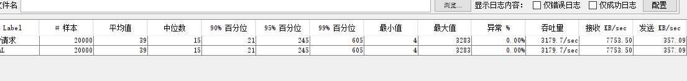
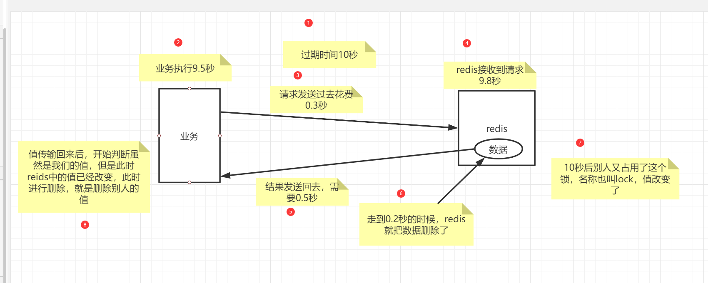
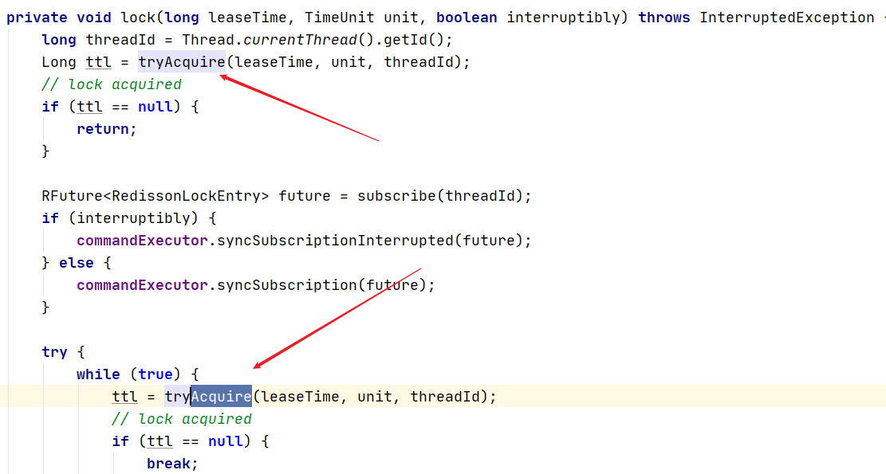
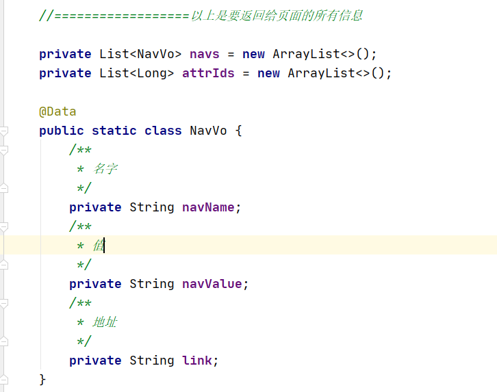

2021.08.01--08.15      97h/15d/6.5h

# 谷粒商城高级篇

> 笔记中仍有很多不足，如有错误还请包涵(●ˇ∀ˇ●)

# 1、Elasticsearch - 全文检索

## 简介

https://www.elastic.co/cn/what-is/elasticsearch/

全文搜索属于最常见的需求，开源的 Elasticsearch 是目前全文搜索引擎的首选。

他可以快速地存储、搜索和分析海量数据。维基百科、Stack Overflow、Github 都采用他

Elatic 的底层是开源库吧Lucene。但是，你没法直接用，必须自己写代码调用它的接口，Elastic 是 Lunce 的封装，提供了 REST API 的操作接口，开箱即用

REST API：天然的跨平台

官网文档：https://www.elastic.co/guide/en/elasticsearch/reference/current/index.html

官网中文：https://www.elastic.co/guide/cn/elasticsearch/guide/current/index.html

社区中文：

http://doc.codingdict.com/elasticsearch/

### 1.1、基本概念

### 1.1.1 index(索引)

动词，相当于 MySQL 中的 insert；

名词，相当于MySQL 中的 DataBase

### 1.1.2 Type(类型)

在 Index（索引）中，可以定义一个或多个类型

类似于 MySQL 中的 Table，每一种类型的数据放在一起

### 1.1.3 Document(文档)

保存在某个索引（index）下，某种类型（Type）的一个数据（Document）,文档是 JSON 格式的，Document 就像是 MySQL 中某个 Table 里面的内容

### 1.1.4 倒排索引机制


### 1.2 Docker 安装 ES

#### 1.2.1 下载镜像

docker pull elasticsearch:7.4.2  存储和检索数据

docker pull kibana:7.4.2 可视化检索数据	

#### 1.2.2 创建实例

##### 1、ElasticSearch

配置

```bash
mkdir -p /mydata/elasticsearch/config # 用来存放配置文件
mkdir -p /mydata/elasticsearch/data  # 数据
echo "http.host: 0.0.0.0" >/mydata/elasticsearch/config/elasticsearch.yml # 允许任何机器访问
chmod -R 777 /mydata/elasticsearch/ ## 设置elasticsearch文件可读写权限
```

启动

```bash
docker run --name elasticsearch -p 9200:9200 -p 9300:9300 \
-e  "discovery.type=single-node" \
-e ES_JAVA_OPTS="-Xms64m -Xmx512m" \
-v /mydata/elasticsearch/config/elasticsearch.yml:/usr/share/elasticsearch/config/elasticsearch.yml \
-v /mydata/elasticsearch/data:/usr/share/elasticsearch/data \
-v  /mydata/elasticsearch/plugins:/usr/share/elasticsearch/plugins \
-d elasticsearch:7.4.2 
```

> WARNING: IPv4 forwarding is disabled. Networking will not work.

```bash
问题原因
是没有开启转发,docker网桥配置完后，需要开启转发，不然容器启动后，就会没有网络，配置/etc/sysctl.conf,添加net.ipv4.ip_forward=1

问题解决：
修改文件
# 1.vim /etc/sysctl.conf
net.ipv4.ip_forward=1    #添加此行配置

# 2.重启network和docker服务
systemctl restart network && systemctl restart docker

# 3.查看是否修改成功
sysctl net.ipv4.ip_forward
如果返回为“net.ipv4.ip_forward = 1”则表示修改成功

再次执行查看，使用docker不再报错
```


开机启动 elasticsearch

```bash
docker update elasticsearch --restart=always
```

以后再外面装好插件重启就可

特别注意：

-e ES_JAVA_OPTS="-Xms64m -Xmx128m" \ 测试环境下，设置 ES 的初始内存和最大内存，否则导致过大启动不了ES

##### 2、Kibana

```bash
docker run --name kibana -e ELASTICSEARCH_HOSTS=http://192.168.43.128:9200 -p 5601:5601 -d kibana:7.4.2

# http://192.168.41.128:9200 改成自己Elasticsearch上的地址

docker update kibana --restart=always
```

~~如果报错,或者意外退出，来配置一下 ，elaticsearch.yml~~

```bash
server.port: 5601  
server.host: "0.0.0.0"
# 配置es集群url
elasticsearch.url: "http://localhost:9200" 
kibana.index: ".kibana"
```

~~报错  Kibana server is not ready yet   Unable to revive connection:~~

```bash
docker0: <BROADCAST,MULTICAST,UP,LOWER_UP> mtu 1500 qdisc noqueue state UP group default 
    inet 172.17.0.1/16 brd 172.17.255.255 scope global docker0
# 1.使用docker命令进入容器
docker exec -it container_id  /bin/bash

# 2.进入 根目录下的config目录,修改kibana,yml文件
修改elasticsearch.hosts的地址, 改成es的ip
server.name: kibana
server.host: “0”
elasticsearch.hosts: [ “http://docker内部ip:9200” ]
xpack.monitoring.ui.container.elasticsearch.enabled: true

# 3.修改完成配置文件后, 重启docker的kibana服务即可访问kibana 
docker restart container_id --restart=always
```


##### 3、安装nginx

随便启动一个 nginx 实例，只是为了复制出配置

```
docker run -p80:80 --name nginx -d nginx:1.10   
```

将容器内的配置文件拷贝到当前目录 （注意后面有个小点）

```bash
docker container cp nginx:/etc/nginx .  

# 配置开机启动
docker update nginx_id --restart=always
```

创建nginx文件夹

```shell
mkdir -p /mydata/nginx/html
mkdir -p /mydata/nginx/logs
 #由于拷贝完成后会在config中存在一个nginx文件夹，所以需要将它的内容移动到conf中
 #conf 文件夹下就是原先nginx的配置
mv /mydata/nginx/conf/nginx/* /mydata/nginx/conf/
rm -rf /mydata/nginx/conf/nginx
```

别忘了后面的点

修改文件名称：mv nginx.conf 把这个conf 移动到 /mydata/nginx 下

终止原容器， docker stop nginx

执行命令删除容器：docker rm $Containerid

创建新的 nginx 执行以下命令

```bash
 docker run -p 80:80 --name nginx \
 -v /mydata/nginx/html:/usr/share/nginx/html \
 -v /mydata/nginx/logs:/var/log/nginx \
 -v /mydata/nginx/conf/:/etc/nginx \
 -d nginx:1.10
```


### 1.3 初步检索

#### 1.3.1、_cat

GET /_cat/nodes：查看所有节点

GET /_cat/health：查看 es 健康状况

GET /_cat/master：查看主节点

GET /_cat/indices：查看所有索引 show databases;

#### 1.3.2 索引一个文档（保存）

保存一个数据，保存在哪个索引的哪个类型下，指定用哪个唯一标识

PUT customer/external/1; 在 customer 索引下的 external 类型下保存 id 为1的数据为

```http
PUT customer/external/1  

{
    "name":"jingjing"
}

{
    "_index": "customer",
    "_type": "external",
    "_id": "1",
    "_version": 2,
    "result": "created",/"updated",  #多次发送则为更新操作
    "_shards": {
        "total": 2,
        "successful": 1,
        "failed": 0
    },
    "_seq_no": 1,
    "_primary_term": 1
}
```

POST  customer/external/; 

- 不带id 进行保存，每次发送都会重新生成一个唯一id的
- 带id 也同样可以进行创建和更新操作

```http
POST http://192.168.41.128:9200/customer/external

{
    "name":"jingjing"
}

{
    "_index": "customer",
    "_type": "external",
    "_id": "MOMlAnsBGiXqrl8eTTRR",
    "_version": 1,
    "result": "created",
    "_shards": {
        "total": 2,
        "successful": 1,
        "failed": 0
    },
    "_seq_no": 3,
    "_primary_term": 1
}
```

put和post之间的区别

> put必须带id进行操作

#### 1.3.3、查询文档

```http
GET custome/external/1
```

结果：

```json
{
    "_index": "customer", // 在那个索引
    "_type": "external", // 在那个类型
    "_id": "1", // 记录id
    "_version": 1, 。// 版本号
    "_seq_no": 0, // 并发控制字段，每次更新就会+1，用来做乐观锁
    "_primary_term": 1, //同上，主分片重新分配，如重启，就会变化
    "found": true, 
    "_source": {
        "name": "John Doe" // 真正的内容
    }
}
```

```
更新携带：?if_seq_no=4&if_primary_term=1
```


#### 1.3.4 更新文档

```http
POST customer/external/1/_update
{
	"doc":{
		"name":"John Doew"
	}
}
或者
POST customer/external/1
{
	"name":"John Doe2"
}
或者
PUT customer/external/1
{
	"name":"jack"
}
不同：Post操作会对比源文档数据，如果相同不会有什么操作，文档 version 不增加 PUT操作总会将数据重新保存并增加 version 版本
带 _update 对比元数据如果一样就不进行任何操作
看场景
对于大并发更新，不带update
对于大并发查询并偶尔更新，带update 对比更新，重新计算分配规则
更新同时增加属性
POS customer/external/1/_update
{
	"doc":{"name":"Jane Doe","age":20}
}
PUT 和 POST 不带_update也可以
```

#### 1.3.5 删除文档&索引

```http
DELETE customer/external/1
DELETE customer
```

#### 1.3.6 bulk 批量 API

```http
POST customer/external/_bulk
{"index":{"_id":"1"}}
{"name":"John Doe"}
{"index":{"_id":"2"}}
{"name":"John Doe"}
```

语法格式

```json
{action:{metadata}}\n
{requeestBody}\n
{action:{metadata}}\n
{requesetbod }\n
```

复杂实例：

```http
POST /_bulk
{"delete":{"_index":"website","_type":"blog","_id":"123"}}
{"create":{"_index":"website","_type":"blog","_id":"123"}}
{"title":"my first blog post"}
{"index":{"_index":"website","_type":"blog"}}
{"title":"my second blog post"}
{"update":{"_index":"website","_type":"blog","_id":"123"}}
{"doc":{"title":"my updated blog post"}}
```

bulk API以此按顺序执行所有的action (动作)。如果一一个单个的动作因任何原因而失败，它将继续处理它后面剩余的动作。当bulkAPI 返回时，它将提供每个动作的状态(与发送的顺序相同)，所以您可以检查是否一个指定的动作是不是失败了。

#### 1.3.7 样本测试数据

我准备了一份顾客银行账户信息虚构的 JSON 文档样本，每个用户都有下列的 schema （模式）：

```json
{
	"account_number": 1,
	"balance": 39225,
	"firstname": "Amber",
	"lastname": "Duke",
	"age": 32,
	"gender": "M",
	"address": "880 Holmes Lane",
	"employer": "Pyrami",
	"email": "amberduke@pyrami.com",
	"city": "Brogan",
	"state": "IL"
}
```

https://wws.lanzoui.com/iaoMKppmpzc

导入测试数据

POST /bank/account/_bulk

测试数据


### 1.4 进阶检索

#### 1.4.1 SearchAPI

ES 支持两种基本方式检索:

- 一个是通过使用 REST request URL,发送搜索参数，(uri + 检索参数)
- 另一个是通过使用 REST request bod 来发送他们，(uri + 请求体)

1、检索信息

一切检索从_search开始

- GET /bank/_search 检索 bank 下的所有信息，包括 type 和 docs

- GET /bank/_search?q=*&sort=account_number:asc 请求参数方式检索

响应结果解释

```bash
took - Elasticearch执行搜索的时间(毫秒)

time_ out - 告诉我们搜索是否超时

_shards - 告诉我们多少个分片被搜索了，以及统计了成功/失败的搜索分片
hit - 搜索结果
hits.total - 搜索结果
hits.hits - 实际的搜索结果数组(默认为前10的文档)
sort - 结果的排序key (键) (没有则按 score 排序)
score 和 max score - 相关性得分和最高得分(全文检索用)
uri + 请求体进行检查
```


```java
GET /bank/_search
{
  "query": { "match_all": {} },
  "sort": [
    { "account_number": "asc" }
  ]
}
```

HTTP 客户端工具（POSTMAN）,get请求不能携带请求体，我们变为 post也是一样的 我们 POST 一个 JSON风格的查询请求体到 _search API

需要了解，一旦搜索结果被返回，ES 就完成了这次请求的搜索，并且不会维护任何服务端的资源或者结果的 cursor（游标）

#### 1.4.2、QueryDSL

##### 1、基本语法格式

​		ES 提供了一个可以执行查询的 Json 风格的 DSL （domain-specifig langurage 领域特定语言），这个被成为 Query DSL ，该查询语言非常全面，并且刚开始的时候优点复杂，真正学好对他的方法是从一些基础的示例开始的

一个查询语句 的典型结构

```json
{
    QUERY_NAME:{
        ARGUMENT:VALUE,
        ARGUMENT:VALUE.....
    }
}
```

如果针对某个字段，那么它的结构如下

```json
{
    QUERY_NAME:{
        FIELD_NAME:{
            ARGUMENT:VALUE,
            ARGUMENT:VALUE.....
        }
    }
}
```

```http
GET /bank/_search
{
  "query": { "match_all": {} },
  "sort": [
    { "account_number": "asc" }
  ],
  "from": 10,
  "size": 10
}
```

query 定义如何查询

match_all 查询类型【代表查询所有的所有】，es中可以在 query中 组合非常多的查询类型完成复杂查询

除了 query 参数之外，我们也可以传递其他的参数改变查询结构，如 sort，size

from + size 限定，完成分页功能

sort排序，多字段排序，会在前序字段相等时后续字段内部排序，否则以前序为准

##### 2、返回部分字段

```http
 GET bank/_search
 {
   "query":{
     "match_all": {}
   },
   "sort": [
     {
       "balance": {
         "order": "desc"
       }
     }
   ],
   "from": 5,
   "size": 5,
   "_source": ["firstname","lastname"]
 }
```

##### 3、match【匹配查询】

基本类型(非字符串)，精准匹配

```http
GET bank/_search
{
  "query":{
   "match": {
     "address": "mill lane"
   } 
  }
}
```

全文检索按照评分进行排序，会对检索条件进行分词匹配

##### 4、match_phrase【短语匹配】

将需要匹配的值当成一个整体单词（不分词）进行检索

```http
GET /bank/_search
{
  "query": { "match_phrase": { "address": "mill lane" } }
}
```

##### 5、multi_match【多字段匹配】

```http
GET bank/_search
{
  "query":{
    "multi_match": {
      "query": "mill",
      "fields": ["address","city"]
    }
  }
}
```

##### 6、bool 【复合查询】

bool 用来做复合查询

复合语句可以合并 任何 其他嵌套语句，包括复合语句，了解这一点是很重要的，这就意味着，复合语句之间可以互相嵌套，可以表达式非常复杂的逻辑

- must：必须达到 must 列举的所有条件

```http
GET /bank/_search
{
  "query": {
    "bool": {
      "must": [
        {
          "match": {
            "gender": "M"
          }
        },
        {
          "match": {
            "address": "mill"
          }
        }
      ],
      "must_not": [
        {"match":{
          "age":"18"
        }}
      ],
      "should": [
        {"match": {
          "lastname": "Wallace"
        }}
      ]
    }
  }
}
```

- should:应该达到 should 列举的条件，如果达到会增加相关文档的评分，并不会改变查询的结果，如果 query 中只有 should 且只有一种匹配规则，那么 should的条件就会被作为默认匹配条件而区改变查询结果

```json
 "should": [
        {"match": {
          "lastname": "Wallace"
        }}
      ]
```

- must_not 必须不是指定的情况

```json
"must_not": [
        {"match":{
          "age":"18"
        }}
      ],
```


##### 7、filter【结果过滤】

并不是所有的查询都需要产生分数，特别是那些仅仅用于 filtering（过滤）的文档，为了不计算分数 ES 会自动检查场景并且优化查询的执行

```http
GET /bank/_search
{
  "query": {
    "bool": {
      "must": { "match_all": {} },
      "filter": {
        "range": {
          "balance": {
            "gte": 20000,
            "lte": 30000
          }
        }
      }
    }
  }
}
```

##### 8、term

和 match 一样，匹配某个属性的值，**全文检索字段用 ==match==，其他非text字段匹配用 ==term==**

```http
GET bank/_search
{
  "query":{
    "match_phrase": {
      "address": "789 Madison Street"
      # "address.keyword": "789 Madison Street" // 精确匹配
    }
  }
}
```

##### 9、aggregations（执行聚合）

聚合提供了从数据分组和提取数据的能力，最简单的聚合方法大致等于 SQL GROUP BY 和 SQL 聚合函数，在 ES 中，你有执行搜索返回 hits （命中结果） 并且同时返回聚合结果，把一个响应中的所有 hits（命中结果）分隔开的能力，这是非常强大有效的，你可以执行查询和多个聚合，并且在一个使用中得到各自的（任何一个的）返回结果，使用一次简洁简化的 API 来避免网络往返

**搜索address中包含mill的所有人的年龄分布以及平均年龄**

```http
GET bank/_search
{
  "query": {
    "match": {
      "address": "mill"
    }
  },
  "aggs": {
    "ageAgg": {
      "terms": {
        "field": "age",
        "size": 10
      }
    },
    "ageAvg":{
      "avg": {
        "field": "age"
      }
    },
    "balanceAvg":{
      "avg": {
        "field": "balance"
      }
    }
    
  },
  "size":0   //不看hit的结果
}
```

**按照年龄聚合，并且请求这些年龄段的这些人的平均薪资**

```java
GET bank/_search
{
  "query":{
    "match_all": {}
  },
  "aggs": {
    "ageAgg": {
      "terms": {
        "field": "age",
        "size": 10
      },
      "aggs": {
        "ageAvg": {
          "avg": {
            "field": "balance"
          }
        }
      }
    }
  }
}
```

**查出所有年龄分布，并且这些年龄段中M的平均薪资和 F 的平均薪资以及这个年龄段的总体平均薪资**

```java
GET /bank/_search
{
  "query": {
    "match_all": {}
  },
  "aggs": {
    "ageAgg": {
      "terms": {
        "field": "age",
        "size": 100
      },
      "aggs": {
        "genderAgg": {
          "terms": {
            "field": "gender.keyword",
            "size": 10
          },
          "aggs": {
            "balanceAvg": {
              "avg": {
                "field": "balance"
                }
            }
          }
        }
      }
    }
  }
}
```

##### 10、nested

嵌套查询

数据类型概览


参考博客：https://elastic.blog.csdn.net/article/details/82950393

#### 1.4.3 Mapping

##### 1、字段类型


##### 2、映射

Mapping（映射）

Mapping 是用来定义一个文档（document）,以及他所包含的属性（field）是如何存储索引的，比如使用 mapping来定义的：

- 哪些字符串属性应该被看做全文本属性（full text fields）
- 那些属性包含数字，日期或者地理位置
- 文档中的所有属性是能被索引（_all 配置）
- 日期的格式
- 自定义映射规则来执行动态添加属性

查看 mapping 信息

GET bank/_mapping

修改 mapping 信息

https://www.elastic.co/guide/en/elasticsearch/reference/7.10/mapping-types.html

自动猜测的映射类型


##### 3、新版本改变

- 关系型数据库中两个数据表示是独立的，即使他们里面有相同名称的列也不影响使用，但ES中不是这样的。elasticsearch 是基于Lucene开发的搜索引擎，而ES中不同type下名称相同的filed 最终在Lucene,中的处理方式是一样的。

- 两个不同 type下的两个user_ name, 在ES同-个索引下其实被认为是同一一个filed,你必须在两个不同的type中定义相同的filed映射。否则，不同typpe中的相同字段称就会在处理中出现神突的情况，导致Lucene处理效率下降。
- 去掉type就是为了提高ES处理数据的效率。

ES 7.x 

URL 中的 type 参数 可选，比如索引一个文档不再要求提供文档类型

ES 8.X

不在支持 URL 中的 type 参数

解决：

1、将索引从多类型迁移到单类型，每种类型文档一个独立的索引

2、将已存在的索引下的类型数据，全部迁移到指定位置即可，详见数据迁移

**1、创建映射**

```http
PUT /my_index
{
  "mappings":{
    "properties": {
      "age":{"type":"integer"},
      "email":{"type":"keyword"}
    }
  }
}
```

**2、添加新的字段映射**

```http
PUT /my_index/_mapping
{
  "properties":{
    "employeeid":{
      "type":"keyword",
      "index":false
    }
  }
}
```

##### 3、更新映射

对于已经存在的映射字段，我们不能更新，更新必须创建新的索引进行数据迁移

**4、数据迁移**

先创 new_twitter 的正确映射，然乎使用如下方式进行数据迁移

```http
POST _reindex [固定写法]
{
  "source":{
    "index":"twitter"
  },
  "dest":{
    "index":"new_twitter"
  }
}
## 将旧索引的 type 下的数据进行迁移
POST _reindex
{
  "source": {
    "index":"twitter",
    "type":"tweet"
  },
  "dest":{
    "index":"twweets"
  }
}
```

参考官网：https://www.elastic.co/guide/en/elasticsearch/reference/7.10/mapping-types.html

参数映射规则：https://www.elastic.co/guide/en/elasticsearch/reference/7.10/mapping-params.html#mapping-params

#### 1.4.4 分词

一个 **tokenizer**（分词器）接收一个字符流，将之分割为独立的 **tokens**（词元，通常是独立的单词），然后输出 **token** 流

列如，witespace tokenizer 遇到的空白字符时分割文本，它会将文本 “Quick brown fox” 分割为 【Quick brown fox】

该 **tokenizer** (分词器)还负责记录各个**term** (词条)的顺序或 **position** 位置(用于**phrase**短语和**word** proximity词近邻查询)，以及

**term** (词条)所代表的原始 **word** (单词)的start(起始)和end (结束)的 **character** **offsets** (字符偏移量) (用于 高亮显示搜索的内容)。

**Elasticsearch** 提供了很多内置的分词器，可以用来构建custom analyzers(自定义分词器)

##### 1、安装 ik 分词器

注意:不能用默认的 elasticsearch-plugin.install xxx.zip 进行自动安装

https://github.com/medcl/elasticsearch-analysis-ik/releases 下载与 es对应的版本

安装后拷贝到 plugins 目录下

##### 2、测试

分词器

```http
POST _analyze
{
  "analyzer": "ik_max_word",
  "text": ["永远的神",
          "我是中国人",
          "尚硅谷电商项目"]
}
```


##### **3、自定义词库**

- 安装nginx

- 在  /mydata/nginx/html/es 下新建 fenci.txt

  > 尚硅谷
  >
  > 乔碧罗

- 修改 /usr/share/elasticsearch/plugins/ik/config/中的 IKAnalyzer.cfg.xml

/usr/share/elasticsearch/plugins/ik/config

```java
<?xml version="1.0" encoding="UTF-8"?>
<!DOCTYPE properties SYSTEM "http://java.sun.com/dtd/properties.dtd">
<properties>
        <comment>IK Analyzer 扩展配置</comment>
        <!--用户可以在这里配置自己的扩展字典 -->
        <entry key="ext_dict"></entry>
         <!--用户可以在这里配置自己的扩展停止词字典-->
        <entry key="ext_stopwords"></entry>
        <!--用户可以在这里配置远程扩展字典 -->
         <entry key="remote_ext_dict">http://192.168.56.10/es/fenci.txt</entry>
        <!--用户可以在这里配置远程扩展停止词字典-->
        <!-- <entry key="remote_ext_stopwords">words_location</entry> -->
</properties>

```

- 重启 el   docker restart  el_id

测试：(最开始是没有的)

```http
POST _analyze
{
  "analyzer": "ik_max_word",
  "text": ["乔碧罗殿下"]
}

{
  "tokens" : [
    {
      "token" : "乔碧罗",
      "start_offset" : 0,
      "end_offset" : 3,
      "type" : "CN_WORD",
      "position" : 0
    },
    {
      "token" : "殿下",
      "start_offset" : 3,
      "end_offset" : 5,
      "type" : "CN_WORD",
      "position" : 1
    }
  ]
}
```


### 1.5 Elasticsearch - Rest - client

1、9300：TCP

Spring-data-elasticsearch:transport-api.jar

SpringBoot版本不同，`transport-api.jar` 不同，不能适配 es 版本

7.x 已经不在适合使用，8 以后就要废弃

**2、9200：HTTP**

JestClient 非官方，更新慢

RestTemplate:默认发送 HTTP 请求，ES很多操作都需要自己封装、麻烦

HttpClient：同上

Elasticsearch - Rest - Client：官方RestClient，封装了 ES 操作，API层次分明

最终选择 Elasticsearch - Rest - Client （elasticsearch - rest - high - level - client）

#### 1.5.1 SpringBoot 整合

新建 `gulimall-search`模块

1、Pom.xml

```xml
<!-- 导入es的 rest-high-level-client -->
<dependency>
    <groupId>org.elasticsearch.client</groupId>
    <artifactId>elasticsearch-rest-high-level-client</artifactId>
    <version>7.4.2</version>
</dependency>
```

修改elasticsearch版本

```xml
<properties>
        <java.version>1.8</java.version>
        <elasticsearch.version>7.4.2</elasticsearch.version>
</properties>
```

为什么要导入这个？这个配置那里来的？

官网：https://www.elastic.co/guide/en/elasticsearch/client/java-rest/current/java-rest-high-getting-started-maven.html

#### 1.5.2 Config配置

```java
/**
 * @author gcq
 * @Create 2020-10-26
 *
 * 1、导入配置
 * 2、编写配置，给容器注入一个RestHighLevelClient
 * 3、参照API 官网进行开发
 */
@Configuration
public class GulimallElasticsearchConfig {


    public static final RequestOptions COMMON_OPTIONS;
    static {
        RequestOptions.Builder builder = RequestOptions.DEFAULT.toBuilder();
//        builder.addHeader("Authorization", "Bearer " + TOKEN);
//        builder.setHttpAsyncResponseConsumerFactory(
//                new HttpAsyncResponseConsumerFactory
//                        .HeapBufferedResponseConsumerFactory(30 * 1024 * 1024 * 1024));
        COMMON_OPTIONS = builder.build();
    }


    @Bean
    public RestHighLevelClient esRestClient() {
        RestClientBuilder builder = null;
        builder = RestClient.builder(new HttpHost("192.168.56.10", 9200, "http"));

        RestHighLevelClient client = new RestHighLevelClient(builder);
//        RestHighLevelClient client = new RestHighLevelClient(
//                RestClient.builder(
//                        new HttpHost("localhost", 9200, "http"),
//                        new HttpHost("localhost", 9201, "http")));
        return client;
    }

}
```

官网：https://www.elastic.co/guide/en/elasticsearch/client/java-rest/current/java-rest-high-getting-started-initialization.html

注册进入nacos中,Main类加上 @EnableDiscoveryClient注解

```properties
spring.cloud.nacos.config.server-addr=localhsot:8848
spring.application.name=gulimall-search
spring.elasticsearch.rest.uris=http://192.168.41.128:9200
```

#### 1.5.3 使用

> 测试是否注入成功

-  排除数据源@SpringBootApplication(exclude = DataSourceAutoConfiguration.class)

```java
@SpringBootTest
@RunWith(SpringRunner.class)
public class GulimallSearchApplicationTests {

    @Autowired
    private RestHighLevelClient client;

    @Test
    public void contextLoads() {
        System.out.println(client);
    }
}

# org.elasticsearch.client.RestHighLevelClient@3667faa8
```

> 测试是否能 添加 或更新数据

```java
/**
 * 添加或者更新
 * @throws IOException
 */
@Test
public void indexData() throws IOException {
    IndexRequest indexRequest = new IndexRequest("users");
    User user = new User();
    user.setAge(19);
    user.setGender("男");
    user.setUserName("张三");
    String jsonString = JSON.toJSONString(user);
    indexRequest.source(jsonString,XContentType.JSON);

    // 执行操作
    IndexResponse index = client.index(indexRequest, GulimallElasticsearchConfig.COMMON_OPTIONS);

    // 提取有用的响应数据
    System.out.println(index);
}
```

> IndexResponse[index=users,type=_doc,id=q2T8BXsBkxV5kwT7kCtO,version=1,result=created,seqNo=0,primaryTerm=1,shards={"total":2,"successful":1,"failed":0}]

```http
GET users/_search
{
  "took" : 68,
  "timed_out" : false,
  "_shards" : {
    "total" : 1,
    "successful" : 1,
    "skipped" : 0,
    "failed" : 0
  },
  "hits" : {
    "total" : {
      "value" : 1,
      "relation" : "eq"
    },
    "max_score" : 1.0,
    "hits" : [
      {
        "_index" : "users",
        "_type" : "_doc",
        "_id" : "q2T8BXsBkxV5kwT7kCtO",
        "_score" : 1.0,
        "_source" : {
          "age" : 19,
          "gender" : "男",
          "userName" : "张三"
        }
      }
    ]
  }
}
```

测试复杂检索

```java
 @Test
    public void searchTest() throws IOException {
        // 1、创建检索请求
        SearchRequest searchRequest = new SearchRequest();
        // 指定索引
        searchRequest.indices("bank");
        // 指定 DSL，检索条件
        SearchSourceBuilder sourceBuilder = new SearchSourceBuilder();

        sourceBuilder.query(QueryBuilders.matchQuery("address", "mill"));

        //1、2 按照年龄值分布进行聚合
        TermsAggregationBuilder aggAvg = AggregationBuilders.terms("ageAgg").field("age").size(10);
        sourceBuilder.aggregation(aggAvg);

        //1、3 计算平均薪资
        AvgAggregationBuilder balanceAvg = AggregationBuilders.avg("balanceAvg").field("balance");
        sourceBuilder.aggregation(balanceAvg);


        System.out.println("检索条件" + sourceBuilder.toString());

        searchRequest.source(sourceBuilder);

        // 2、执行检索
        SearchResponse searchResponse = client.search(searchRequest, GulimallElasticsearchConfig.COMMON_OPTIONS);

        // 3、分析结果
        System.out.println(searchResponse.toString());

        // 4、拿到命中得结果
        SearchHits hits = searchResponse.getHits();
        // 5、搜索请求的匹配
        SearchHit[] searchHits = hits.getHits();
        // 6、进行遍历
        for (SearchHit hit : searchHits) {
            // 7、拿到完整结果字符串
            String sourceAsString = hit.getSourceAsString();
            // 8、转换成实体类
            Account accout = JSON.parseObject(sourceAsString, Account.class);
            System.out.println("account:" + accout );
        }

        // 9、拿到聚合
        Aggregations aggregations = searchResponse.getAggregations();
//        for (Aggregation aggregation : aggregations) {
//
//        }
        // 10、通过先前名字拿到对应聚合
        Terms ageAgg1 = aggregations.get("ageAgg");
        for (Terms.Bucket bucket : ageAgg1.getBuckets()) {
            // 11、拿到结果
            String keyAsString = bucket.getKeyAsString();
            System.out.println("年龄:" + keyAsString);
            long docCount = bucket.getDocCount();
            System.out.println("个数：" + docCount);
        }
        Avg balanceAvg1 = aggregations.get("balanceAvg");
        System.out.println("平均薪资：" + balanceAvg1.getValue());
        System.out.println(searchResponse.toString());
    }
```

结果：

```java
accout:GulimallSearchApplicationTests.Accout(account_number=970, balance=19648, firstname=Forbes, lastname=Wallace, age=28, gender=M, address=990 Mill Road, employer=Pheast, email=forbeswallace@pheast.com, city=Lopezo, state=AK)accout:GulimallSearchApplicationTests.Accout(account_number=136, balance=45801, firstname=Winnie, lastname=Holland, age=38, gender=M, address=198 Mill Lane, employer=Neteria, email=winnieholland@neteria.com, city=Urie, state=IL)accout:GulimallSearchApplicationTests.Accout(account_number=345, balance=9812, firstname=Parker, lastname=Hines, age=38, gender=M, address=715 Mill Avenue, employer=Baluba, email=parkerhines@baluba.com, city=Blackgum, state=KY)accout:GulimallSearchApplicationTests.Accout(account_number=472, balance=25571, firstname=Lee, lastname=Long, age=32, gender=F, address=288 Mill Street, employer=Comverges, email=leelong@comverges.com, city=Movico, state=MT)年龄:38
个数:2
年龄:28
个数:1
年龄:32
个数:1
平均薪水:25208.0
```

总结：参考官网的API 和对应在 kibana 中发送的请求，在代码中通过调用对应API实现效果

官网：https://www.elastic.co/guide/en/elasticsearch/client/java-rest/current/java-rest-high-search.html#java-rest-high-search-request-optional

ELK  

Elasticsearch 用于检索数据

logstach：存储数据

Kiban:视图化查看数据


# 2、商城业务 & 商品上架

上架的商品才可以在网站展示

上架的商品需要可以检索

## 2.1 商品Mapping

分析：商品上架在 es 中是存入 sku 还是 spu ？

1、检索的时候输入名字，是需要按照 sku 的 title进行全文检索的

2、检索使用商品规格，规格是 spu 的公共属性，每个 spu 是一样的

3、按照分类 id 进去的 都是直接列出 spu的，还可以切换

4、我们如果将 sku 的 全量信息 保存在 es 中 （包括 spu 属性），就太多量字段了

5、如果我们将 spu 以及他包含的 sku 信息保存到 es 中，也可以方

```http
PUT product
{
  "mappings":{
    "properties":{
      "skuId":{
        "type":"long"
      },
       "spuId":{
        "type":"keyword"
      },
       "skuTitle":{
        "type":"text",
        "analyzer": "ik_smart"
      },
       "skuPrice":{
        "type":"keyword"
      },
       "skuImg":{
        "type":"text",
        "analyzer": "ik_smart"
      },
       "saleCount":{
        "type":"long"
      },
       "hasStock":{
        "type":"boolean"
      },
      "hotScore":{
        "type":"long"
      },
      "brandId":{
        "type":"long"
      },
      "catelogId":{
        "type":"long"
      },
      "brandName":{
        "type":"keyword",
        "index": false,
        "doc_values": false
      },
      "brandImg":{
        "type":"keyword",
         "index": false,
        "doc_values": false
      },
      "catalogName":{
        "type":"keyword",
         "index": false,
         "doc_values": false
      },
      "attrs":{
        "type":"nested",
        "properties": {
          "attrId":{
            "type":"long"
          },
          "attrName":{
            "type":"keyword",
            "index":false,
            "doc_values":false
          },
          "attrValue": {
            "type":"keyword"
          }
        }
      }
    }
  }
}
```


## 2.2 商品上架接口编写

**需求分析：**

上架商品、将该商品相关属性上传到 Es中 为搜索服务做铺垫


Controller

```java
/**
 * 商品上架
 * @param spuId
 * @return
 */
@RequestMapping("/{spuId}/up")
public R list(@PathVariable("spuId") Long spuId){
    spuInfoService.up(spuId);

    return R.ok();
}
```

Service

```java
@Override
public void up(Long spuId) {

    // 1、查出当前 spuid 对应的所有skuid信息，品牌的名字
    List<SkuInfoEntity> skus = skuInfoService.getSkuBySpuId(spuId);
    // 取出 Skuid 组成集合
    List<Long> skuIds = skus.stream().map(SkuInfoEntity::getSkuId).collect(Collectors.toList());

    //TODO 4、查询当前 sku 的所有可以用来被检索的规格属性
    List<ProductAttrValueEntity> attrValueEntities = attrValueService.baseAttrListforspu(spuId);

    // 返回所有 attrId
    List<Long> attrIds = attrValueEntities.stream().map(attr -> {
        return attr.getAttrId();
    }).collect(Collectors.toList());

    // 根据 attrIds 查询出 检索属性，pms_attr表中 search_type为一 则是检索属性
    List<Long> searchAttrIds = attrService.selectSearchAttrs(attrIds);

    // 将查询出来的 attr_id 放到 set 集合中 用来判断 attrValueEntities 是否包含 attrId
    Set<Long> idSet = new HashSet<>(searchAttrIds);

    List<SkuEsModel.Attrs> attrList = attrValueEntities.stream().filter(item -> {
        // 过滤掉不包含在 searchAttrIds集合中的元素
        return idSet.contains(item.getAttrId());
    }).map(item -> {
        SkuEsModel.Attrs attrs1 = new SkuEsModel.Attrs();
        // 属性对拷 将 ProductAttrValueEntity对象与 SkuEsModel.Attrs相同的属性进行拷贝
        BeanUtils.copyProperties(item, attrs1);
        return attrs1;
    }).collect(Collectors.toList());


    //TODO 1、发送远程调用，库存系统查询是否有库存
    Map<Long, Boolean> stockMap = null;
    try {
        R r = wareFeignService.getSkuHasStock(skuIds);
        // key 是 SkuHasStockVo的 skuid value是 item的hasStock 是否拥有库存
        TypeReference<List<SkuHasStockVo>> typeReference = new TypeReference<List<SkuHasStockVo>>() {
        };
        stockMap = r.getData(typeReference).stream().collect(Collectors.toMap(SkuHasStockVo::getSkuId, item -> item.getHasStock()));
    } catch (Exception e) {
        log.error("库存服务异常：原因：{}",e);
        e.printStackTrace();
    }

    // 2、封装每个 sku 的信息
    Map<Long, Boolean> finalStockMap = stockMap;
    List<SkuEsModel> upProducts = skus.stream().map(sku -> {
        // 组装需要查询的数据
        SkuEsModel skuEsModel = new SkuEsModel();
        BeanUtils.copyProperties(sku, skuEsModel);
        skuEsModel.setSkuPrice(sku.getPrice());
        skuEsModel.setSkuImg(sku.getSkuDefaultImg());

        // 设置属性
        skuEsModel.setAttrs(attrList);

        // 设置库存信息
        if (finalStockMap == null) {
            // 远程服务出现问题，任然设置为null
            skuEsModel.setHasStock(true);
        } else {
            skuEsModel.setHasStock(finalStockMap.get(sku.getSkuId()));
        }
        //TODO 2、热度频分 0
        skuEsModel.setHotScore(0L);

        //TODO 3、查询品牌名字和分类的信息
        BrandEntity brandEntity = brandService.getById(skuEsModel.getBrandId());
        skuEsModel.setBrandName(brandEntity.getName());
        skuEsModel.setBrandImg(brandEntity.getLogo());
        CategoryEntity categoryEntity = categoryService.getById(skuEsModel.getCatalogId());
        skuEsModel.setCatalogName(categoryEntity.getName());

        return skuEsModel;
    }).collect(Collectors.toList());


    //TODO 5、将数据发送给 es保存 ，直接发送给 search服务
    R r = esFeignClient.productStatusUp(upProducts);
    if (r.getCode() == 0) {
        // 远程调用成功
        // TODO 6、修改当前 spu 的状态
        baseMapper.updateSpuStatus(spuId, ProductConstant.StatusEnum.SPU_UP.getCode());
    } else {
        // 远程调用失败
        //TODO 7、重复调用？ 接口冥等性 重试机制

        /**
         * 1、构造请求数据，将对象转成json
         * RequestTemplate template = buildTemplateFromArgs.create(argv);
         * 2、发送请求进行执行(执行成功进行解码)
         *  executeAndDecode(template);
         * 3、执行请求会有重试机制
         *  while (true) {
         *       try {
         *         return executeAndDecode(template);
         *       } catch (RetryableException e) {
         *         try {
         *           retryer.continueOrPropagate(e);
         *         } catch (RetryableException th) {
         *              throw cause;
         *         }
         *         continute
         */
    }
}
```

### 2.2.1、发送远程调用，库存系统查询是否有库存

```java
/**
 * 根据 skuIds 查询是否有库存
 * @param skuIds
 * @return
 */
@PostMapping("/hasstock")
public R getSkuHasStock(@RequestBody List<Long> skuIds) {
    List<SkuHasStockVo> vos = wareSkuService.getSkusStock(skuIds);

    R ok = R.ok();
    ok.setData(vos);
    return ok;
}
```

Service

```java
@Override
public List<SkuHasStockVo> getSkusStock(List<Long> skuIds) {
    List<SkuHasStockVo> collect = skuIds.stream().map(skuId -> {
        SkuHasStockVo vo = new SkuHasStockVo();
        // 查询当前 sku 的总库存良
        // SELECT SUM(stock-stock_locked) FROM `wms_ware_sku` WHERE sku_id = 1
        Long count = baseMapper.getSkuStock(skuId);

        vo.setSkuId(skuId);
        vo.setHasStock(count == null?false:count>0);

        return vo;
    }).collect(Collectors.toList());
    return collect;
}
```

### 2.2.2 将数据发送给 es保存 ，直接发送给 search服务

controller

```java
/**
     * 上架商品
     * @param skuEsModelList
     * @return
     */
    @PostMapping("/product")
    public R productStatusUp(@RequestBody List<SkuEsModel> skuEsModelList){
        boolean b = false;
        try {
            b = productSaveService.productStatusUp(skuEsModelList);
        } catch (Exception e) {
            log.error("ElasticSaveController商品上架错误：{}",e);
            return R.error(BizCodeEnume.PRODUCT_UP_EXCEPTION.getCode(),BizCodeEnume.PRODUCT_UP_EXCEPTION.getMsg());
        }
        if (!b) {
            return R.ok();
        } else {
            return R.error(BizCodeEnume.PRODUCT_UP_EXCEPTION.getCode(),BizCodeEnume.PRODUCT_UP_EXCEPTION.getMsg());
        }
    }

```

service

```java
@Override
public boolean productStatusUp(List<SkuEsModel> skuEsModelList) throws IOException {
    
    // 保存到es
    // 批量保存
    BulkRequest bulkRequest = new BulkRequest();
    for (SkuEsModel model : skuEsModelList) {
        // 1、构造请求 指定es索引
        IndexRequest indexRequest = new IndexRequest(EsConstant.PRODUCT_INDEX);
        // 1.1 指定id
        indexRequest.id(model.getSkuId().toString());
        // 1.2 将对象esmodel对象转换成 json 进行存储
        String s = JSON.toJSONString(model);
        // 1.3 设置文档源
        indexRequest.source(s, XContentType.JSON);

        bulkRequest.add(indexRequest);
    }
    
    BulkResponse bulk = restHighLevelClient.bulk(bulkRequest, GulimallElasticsearchConfig.COMMON_OPTIONS);

    // TODO 1、 如果批量错误
    boolean b = bulk.hasFailures();
    List<String> collect = Arrays.stream(bulk.getItems()).map(item -> {
        return item.getId();
    }).collect(Collectors.toList());
    log.error("商品上架完成：{}",collect);

    return b;
}
```


**业务流程总结：**

前端点击上架后，发送请求并带上参数 spuid

- 根据 `spuid` 查询 `pms_sku_info` 表得到商品相关属性

- 

- 根据 `spuid` 查询 `pms_product_attr_value` 表得到可以用来检索的规格属性

- 

  

- 从 `ProductAttrValueEntity` 中拿到所有的 attrId，根据 attrId 查询 `pms_attr` 查询检索的属性

- 

- x根据 `pms_attr`  查询到检索属性后，用检索属性和 原先根据 `spuid` 查询 `pms_sku_info` 表得到商品相关属性进行比较，`pms_sku_info` 包含 从 `pms_attr` 字段attr_id 则数据保存否则过滤

- 根据 `skuIds` 去查询远程仓库中是否有库存 SELECT SUM(stock-stock_locked) FROM `wms_ware_sku` WHERE sku_id = 1

- 组装数据 设置 SkuEsModel 

- 发送给 es 保存


整合调用 gulimall-search 的搜索功能 和 gulimall-ware 的库存功能


测试 

```http
GET product/_search
{
  "took" : 48,
  "timed_out" : false,
  "_shards" : {
    "total" : 1,
    "successful" : 1,
    "skipped" : 0,
    "failed" : 0
  },
  "hits" : {
    "total" : {
      "value" : 6,
      "relation" : "eq"
    },
    "max_score" : 1.0,
    "hits" : [
      {
        "_index" : "product",
        "_type" : "_doc",
        "_id" : "1",
        "_score" : 1.0,
        "_source" : {
          "attrs" : [
            {
              "attrId" : 1,
              "attrName" : "入网型号",
              "attrValue" : "bbb"
            },
            {
              "attrId" : 2,
              "attrName" : "上市年份",
              "attrValue" : "2018"
            }
          ],
          "brandId" : 2,
          "brandImg" : "https://gulimall-memeda.oss-cn-beijing.aliyuncs.com/2021-07-29/b6687932-1680-4227-87a1-661ca6f23d94_1.png",
          "brandName" : "华为",
          "catalogId" : 225,
          "catalogName" : "手机",
          "hasStock" : true,
          "hotScore" : 0,
          "saleCount" : 0,
          "skuId" : 1,
          "skuImg" : "",
          "skuPrice" : 9999.0,
          "skuTitle" : "x 红色 12G",
          "spuId" : 5
        }
      },
```


# 3、商城业务 & 首页整合

## 3.1 整合 thymeleaf 渲染首页

**需求分析：**

开发传统Java WEB工程时，我们可以使用JSP页面模板语言，但是在SpringBoot中已经不推荐使用了。SpringBoot支持如下页面模板语言

- Thymeleaf
- FreeMarker
- Velocity
- Groovy
- JSP

thymeleaf 官网：https://www.thymeleaf.org/

官网文档给出了，语法、相关标签如何使用的步骤，由于官网文档都是英文，英文文档阅读能力好的同学可以选择阅读，英文不好的同学可以选择中文文档进行学习，为此我在网上找到了相关的中文文档：文档：thymeleaf
链接：http://note.youdao.com/noteshare?id=7771a96e9031b30b91ed55c50528e918

### 3.1.2 SpringBoot 整合 thymeleaf

在 guli-product模块中 引入 Pom.xml

```xml
<dependency>
    <groupId>org.springframework.boot</groupId>
    <artifactId>spring-boot-starter-thymeleaf</artifactId>
    <!-- 版本后由SpringBoot进行管理-->
</dependency>
```

application.yml

```yaml
Spring:
  thymeleaf:
    cache: false # 开发过程建议关闭缓存
```

resource 目录介绍：


index.html中使用

```html
<!DOCTYPE html>
<!--使用thymeleaf中必须声明加上该行代码-->
<html lang="en"  xmlns:th="http://www.thymeleaf.org">
```

相关语法使用

```html
<!--和jsp相关表达式有点相似 具体使用过程参考文档-->
<ul>
  <li th:each="category : ${categorys}">
    <a href="#" class="header_main_left_a"
       th:attr="ctg-data=${category.catId}">
      <b th:text="${category.name}">家用电器</b></a>
  </li>
```

默认SpringBoot会直接去找 templates 下的 index.html 


## 3.2 整合dev-tools 渲染分类数据

**需求分析：**

我们需要在页面的侧边查询出分类的数据，并且选中一级分类数据后显示二级和三级分类数据


- 先获取一级分类数据
- 用户选中后在查询二级分类数据

Controller

```java
/**
 * 查询所有一级分类
 * @param model
 * @return
 */
@GetMapping({"/","/index.html"})
public String indexPage(Model model){

    // select * from category where parent_id = 0
    //TODO 1、查询所有的一级分类
    List<CategoryEntity> categoryEntityList = categoryService.getLevel1Categorys();

    model.addAttribute("categorys",categoryEntityList);
    // 查询所有的一级分类
    return "index";
}
```

Service

```java
@Override
public List<CategoryEntity> getLevel1Categorys() {
    // parent_cid为0则是一级目录
   return baseMapper.selectList(new QueryWrapper<CategoryEntity>().eq("parent_cid",0));

}
```

一级分类数据能显示后，着手处理二级分类数据获取

Controller

```java
/**
 * 查询完整分类数据
 * @return
 */
@ResponseBody
@RequestMapping("/index/catalog.json")
public Map<String, List<Catelog2Vo>> getCatelogJson() {
    Map<String, List<Catelog2Vo>> catelogJson = categoryService.getCatelogJson();
    return catelogJson;
}
```

Service

```java
@Override
public Map<String, List<Catelog2Vo>> getCatelogJson() {

    // 1、查询所有1级分类
    List<CategoryEntity> level1Categorys = getLevel1Categorys();
    // 2、封装数据封装成 map类型  key为 catId,value List<Catelog2Vo>
    Map<String, List<Catelog2Vo>> categoryList = level1Categorys.stream().collect(Collectors.toMap(k -> k.getCatId().toString(), v -> {
        // 1、每一个的一级分类，查询到这个一级分类的二级分类
        List<CategoryEntity> categoryEntities = baseMapper.selectList(new QueryWrapper<CategoryEntity>().eq("parent_cid", v.getCatId()));
        // 2、封装上面的结果
        List<Catelog2Vo> catelog2Vos = null;
        if (categoryEntities != null) {
            catelog2Vos = categoryEntities.stream().map(l2 -> {
                Catelog2Vo catelog2Vo = new Catelog2Vo(v.getCatId().toString(), null, l2.getCatId().toString(), l2.getName());
                // 1、查询当前二级分类的三级分类vo
                List<CategoryEntity> categoryEntities1 = baseMapper.selectList(new QueryWrapper<CategoryEntity>().eq("parent_cid", l2.getCatId()));
                if (categoryEntities1 != null ){
                    // 2、分装成指定格式
                    List<Catelog2Vo.catelog3Vo> catelog3VoList = categoryEntities1.stream().map(l3 -> {
                        Catelog2Vo.catelog3Vo catelog3Vo = new Catelog2Vo.catelog3Vo(l2.getCatId().toString(), l3.getCatId().toString(), l3.getName());
                        return catelog3Vo;
                    }).collect(Collectors.toList());
                    // 3、设置分类数据
                    catelog2Vo.setCatalog3List(catelog3VoList);
                 }
                return catelog2Vo;
            }).collect(Collectors.toList());
        }
        return catelog2Vos;
    }));
    // 2、封装数据
    return categoryList;
}
```

**上方代码具体业务逻辑：**

- 查询到一级分类，根据一级分类查询出二级分类并设置对应Vo对象，以此类推


# 4、商城业务 & Nginx 域名访问

## 4.1 Nginx 搭建域名环境一（反向代理配置）

什么是 反向代理?


vi nginx.conf 文件后在底部有该条语句：

- 引入nginx下的 conf.d 下面的conf文件
- 那么我们开始在该目录下增加关于 谷粒商城的 nginx


拷贝原先默认的 conf


修改


## 4.2 Nginx 搭建域名环境二 （负载均衡到网关）

 3. Nginx+Windows搭建域名访问环境

1. 修改windows hosts文件改变本地域名映射，将`gulimall.com`映射到虚拟机ip

   ```bash
   192.168.43.128 gulimall.com
   ```

2. 修改nginx的根配置文件nginx.conf，将`upstream`映射到我们的网关服务

   ```shell
       upstream gulimall{
      	 	server 192.168.43.1:88;
       }
   ```

   

3. 修改nginx的server块配置文件`gulimall.conf`，将以`/`开头的请求转发至我们配好的`gulimall`的`upstream`,由于nginx的转发会丢失`host`头，所以我们添加头信息

   ```shell
     location / {
           proxy_pass http://gulimall;
           proxy_set_header Host $host;
       }
   ```

4. 配置网关服务，将域名为`**.gulimall.com`转发至商品服务

```yaml
- id: gulimall_host_route
  uri: lb://gulimall-product
  predicates:
    - Host=**.gulimall.com
```

最后放几张图方便理解哈


# 5、性能压测 & 压力测试

**简介**

压力测试考察当前软硬件环境下系统所能承受住的最大负荷并帮助找出系统的瓶颈所在，压测都是为了系统

在线上的处理能力和稳定性维持在一个标准范围内，做到心中有数

使用压力测试，我们有希望找到很多种用其他测试方法更难发现的错误，有两种错误类型是：

内存泄漏、并发与同步

有效的压力测试系统将应用以下这些关键条件：重复、并发、量级、随机变化

## 5.1 性能指标

### 5.1.1 Jvm 内存模型

1、Jvm内存模型


### 5.1.2 堆

所有的对象实例以及数组都要在堆上分配，堆时垃圾收集器管理的主要区域，也被称为 "GC堆"，也是我们优化最多考虑的地方

堆可以细分为：

- 新生代
  - Eden空间
  - From Survivor 空间
  - To Survivor 空间

- 老年代

- 永久代/原空间
  - Java8 以前永久代、受 JVM 管理、Java8 以后原空间，直接使用物理内存，因此默认情况下，原空间的大小仅受本地内存限制

垃圾回收


从 Java8 开始,HotSpot 已经完全将永久代（Permanent Generation）移除，取而代之的是一个新的区域 - 元空间（MetaSpac)


### 5.1.3 jconsole 与 jvisualvm

jdk 的两个小工具 jconsole、jvisualvm（升级版本的 jconsole）。通过命令行启动、可监控本地和远程应用、远程应用需要配置

1、jvisualvm 能干什么

监控内存泄漏、跟踪垃圾回收、执行时内存、cpu分析、线程分析.....


运行：正在运行的线程

休眠：sleep

等待：wait

驻留：线程池里面的空闲线程

监视：组赛的线程、正在等待锁

2、安装插件方便查看 gc

cmd 启动 jvisualvm

工具->插件


如果503 错误解决

打开网址： https://visualvm.github.io/pluginscenters.html

cmd 查看自己的jdk版本，找到对应的

docker stats 查看相关命令

### 5.1.4 监控指标

SQL 耗时越小越好、一般情况下微妙级别

命中率越高越好、一般情况下不能低于95%

锁等待次数越低越好、等待时间越短越好

#### 1、中间件指标

毫秒 

|                      压测内容                      | 压测线程数 | 吞吐量/ms           | 90%响应时间/ms | 99%响应时间/ms |
| :------------------------------------------------: | ---------- | ------------------- | -------------- | -------------- |
|                     **Nginx**                      | 50         | 1834                | 11             | 40             |
|                    **GateWay**                     | 50b        | 16577               | 5              | 19             |
|                    **简单服务**                    | 50         | 17965               | 5              | 10             |
|        **首页一级菜单渲染**localhost:10000/        | 50         | 330（db,thymeleaf） | 275            | 511            |
|                **首页渲染(开缓存)**                | 50         | 507                 | 175            | 344            |
|     **首页渲染（开缓存、优化数据库，关日志）**     | 50         | 800                 | 123            | 262            |
| **三级分类数据获取**:10000/index/json/catalog.json | 50         | 15（db）            | 729            | 1531           |
|          **三级分类数据获取（优化业务）**          | 50         | 189                 | 504            | 943            |
|         **三级分类数据获取（redis缓存）**          | 50         | **479**             | 127            | 245            |
|                **首页全量数据获取**                | 50         | 20（静态资源）/19   | 6183.          | 12358.         |
|    Nginx+Gateway+三级分类+redis加锁+4个product     | 50         | 21                  | 4482           | 10914          |
|                  Gateway+简单服务                  | 50         | 4273                | 26             | 63             |
|                     ==全链路==                     | 50         | 700                 | 96             | 132            |

中间件越多，性能损失越大，大多都损失在了网络交互

```bash
# 1.数据库优化
查询一级菜单时间:680
查询一级菜单时间:5
# 2.给数据库添加 parent_id 索引后
查询一级菜单时间:3
查询一级菜单时间:6
查询一级菜单时间:5
查询一级菜单时间:4
```

## 5.2  Nginx动静分类

由于动态资源和静态资源目前都处于服务端，所以为了减轻服务器压力，我们将js、css、img等静态资源放置在Nginx端，以减轻服务器压力


1. 在nginx的html文件夹创建staic文件夹，并将index/css等静态资源全部上传到该文件夹中

2. 修改index.html的静态资源路径，使其全部带有static前缀`src="/static/index/img/img_09.png"`

3. 修改nginx的配置文件`/mydata/nginx/conf/conf.d/gulimall.conf`

   如果遇到有`/static`为前缀的请求，转发至html文件夹

   ```shell
       location /static {
           root   /usr/share/nginx/html;
       }
   
       location / {
           proxy_pass http://gulimall;
   		proxy_set_header Host $host;
       }
   
   ```


调整 GulimallProductApplication 模块的虚拟机内存 

```bash
-Xmx1024m  # 最大内存
-Xms1024m  #最小内存
-Xmn512m   #伊甸园区和幸存者区加起来的内存

调整之后 吞吐量可以到20
```

#### 2、数据库指标

- **响应时间**（Response Time:RT）
- 响应时间指用户从客户端发起一个请求开始，到客户端接收到服务器端返回的响应结束，整个过程所耗费的时间
- **HPS**（Hits Per Second） ：每秒点击次数，单位是次/秒
- **TPS**（Transaction per Second）：系统每秒处理交易数，单位是笔/秒
- **QPS** (Query perSecond) :系统每秒处理查询次数，单位是次/秒。对于互联网业务中，如果某些业务有且仅有一个请求连接，那么TPS=QPS=HPS，一般情况下用TPS来衡量整个业务流程，用QPS来衡量接口查询次数，用HPS来表示对服务器单击请求。
- 无论TPS、QPS、HPS,此指标是衡量系统处理能力非常重要的指标，越大越好，根据经验，一般情况下:
  - 金融行业: 1000TPS~50000TPS, 不包括互联网化的活动
  - 保险行业: 1007P-00000PS， 不包括互联网化的活动
  - 制造行业: 10TPS~5000TPS
  - 互联网电子商务: 10000TPS~-100000TPS
  - 互联网中型网站: 1000TPS~50000TPS
  - 互联网小型网站: 5007PS~10000TPS

- **最大响应时间**(Max Response Time) 指用户发出请求或者指令到系统做出反应(响应)的最大时间。
- **最少响应时间** （Mininum ResponseTime）指用户发出请求或者指令到系统做出反应（响应）的最少时间
- **90%响应时间**（90% Response Time） 是指所有用户的响应时间进行排序、第90%的响应时间
- 从外部看、性能测试主要关注如下三个指
  - 吞吐量：每秒钟系统能够处理的请求数、任务数
  - 响应时间：服务处理一个请求或一个任务的耗时
  - 错误率：一批请求中结果出错的请求所占比例


吞吐量大:系统支持高并发，

响应时间：越短说明接口性能越好


## 5.3 JMeter

### 5.3.1 JMeter 安装

jmeter官网：https://jmeter.apache.org/

### 5.3.2 JMeter 压测示例

##### 1、添加线程组


##### 2、添加 HTTP 请求


##### 3、添加监听器


##### 4、启动压测&查看

汇总图


察看结果树


汇总报告


聚合报告




### 5.3.3 JMeter Address Already in use 错误解决

windows本身提供的端口访问机制的问题。
Windows提供给TCP/IP 链接的端口为1024-5000，并且要四分钟来循环回收他们。就导致
我们在短时间内跑大量的请求时将端口占满了。

1.cmd中，用regedit命令打开注册表

2.在HKEY_ LOCAL MACHINE\SYSTEMCurrentControlSet\Services Tcpip\Parameters下，

​	1.右击parameters,添加一个新的DWORD,名字为MaxUserPort
​	2.然后双击 MaxUserPort,输入数值数据为65534,基数选择十进制(如果是分布式运行的话，控制机器和负载机器都需要这样操作哦)

3.修改配置完毕之后记得重启机器才会生效

TCPTimedWaitDelay:30


# 6、缓存与分布式锁

## 6.1 缓存

### 6.1.2 缓存使用

为了系统性能的提升，我们一般都会将部分数据放入缓存中，加速访问，而 db 承担数据落盘工作

**哪些数据适合放入缓存？**

- **即时性、数据一致性要求不高的**
- **访问量大且更新频率不高的数据（读多、写少）**

举例：电商类应用、商品分类，商品列表等适合缓存并加一个失效时间（根据数据更新频率来定）后台如果发布一个商品、买家需要 5 分钟才能看到新商品一般还是可以接受的


伪代码

```java
data = cche.load(b); //从缓存中加载数据
if(data == null) {
    data = db.load(id); // 从数据库加载数据
    cache.put(id,data); // 保存到 cache中
}
return data;
```

注意：在开发中，凡是放到缓存中的数据我们都应该制定过期时间，使其可以在系统即使没有主动更新数据也能自动触发数据加载的流程，避免业务奔溃导致的数据永久不一致的问题


### 6.1.3 整合 redis 作为缓存

##### 1、引入依赖

SpringBoot 整合 redis，查看SpringBoot提供的 starts


官网：https://docs.spring.io/spring-boot/docs/2.1.18.RELEASE/reference/html/using-boot-build-systems.html#using-boot-starter

pom.xml

```xml
 <!--引入redis-->
        <dependency>
            <groupId>org.springframework.boot</groupId>
            <artifactId>spring-boot-starter-data-redis</artifactId>
            <!--不加载自身的 lettuce-->
            <exclusions>
                <exclusion>
                    <groupId>io.lettuce</groupId>
                    <artifactId>lettuce-core</artifactId>
                </exclusion>
            </exclusions>
        </dependency>

        <!--jedis-->
        <dependency>
            <groupId>redis.clients</groupId>
            <artifactId>jedis</artifactId>
        </dependency>
```

##### 2、配置

application.yaml

```yaml
Spring:
  redis:
    host: 192.168.56.10
    port: 6379
```

RedisAutoConfig.java


##### 3、测试

```java
@Autowired
StringRedisTemplate stringRedisTemplate;

@Test
public void testStringRedisTemplate() {

    stringRedisTemplate.opsForValue().set("hello","world_" + UUID.randomUUID().toString());
    String hello = stringRedisTemplate.opsForValue().get("hello");
    System.out.println("之前保存的数据是：" + hello);
}
```

##### 4、优化三级分类数据获取

经优化后，吞吐量从100+到了400+，质的飞跃

```java
/**
 * TODO 产生堆外内存溢出 OutOfDirectMemoryError
 * 1、SpringBoot2.0以后默认使用 Lettuce作为操作redis的客户端，它使用 netty进行网络通信
 * 2、lettuce 的bug导致netty堆外内存溢出，-Xmx300m netty 如果没有指定堆内存移除，默认使用 -Xmx300m
 *      可以通过-Dio.netty.maxDirectMemory 进行设置
 *   解决方案 不能使用 -Dio.netty.maxDirectMemory调大内存
 *   1、升级 lettuce客户端，2、 切换使用jedis
 *   redisTemplate:
 *   lettuce、jedis 操作redis的底层客户端，Spring再次封装
 * @return
 */
@Override
public Map<String, List<Catelog2Vo>> getCatelogJson() {

    // 给缓存中放 json 字符串、拿出的是 json 字符串，还要逆转为能用的对象类型【序列化和反序列化】

    // 1、加入缓存逻辑，缓存中放的数据是 json 字符串
    // JSON 跨语言，跨平台兼容
    String catelogJSON = redisTemplate.opsForValue().get("catelogJSON");
    if (StringUtils.isEmpty(catelogJSON)) {
        // 2、缓存没有，从数据库中查询
        Map<String, List<Catelog2Vo>> catelogJsonFromDb = getCatelogJsonFromDb();
        // 3、查询到数据，将数据转成 JSON 后放入缓存中
        String s = JSON.toJSONString(catelogJsonFromDb);
        redisTemplate.opsForValue().set("catelogJSON",s);
        return catelogJsonFromDb;
    }
    // 转换为我们指定的对象
    Map<String, List<Catelog2Vo>> result = JSON.parseObject(catelogJSON, new TypeReference<Map<String, List<Catelog2Vo>>>() {});

    return result;
}
```


## 6.2 缓存失效

### 高并发下缓存失效问题 

#### 缓存穿透


### 缓存雪崩


4) 加锁解决缓存击穿问题

将查询db的方法加锁，这样在同一时间只有一个方法能查询数据库，就能解决缓存击穿的问题了

```java
public Map<String, List<Catalog2Vo>> getCategoryMap() {
        ValueOperations<String, String> ops = stringRedisTemplate.opsForValue();
        String catalogJson = ops.get("catalogJson");
        if (StringUtils.isEmpty(catalogJson)) {
            System.out.println("缓存不命中，准备查询数据库。。。");
            Map<String, List<Catalog2Vo>> categoriesDb = getCategoriesDb();
            String toJSONString = JSON.toJSONString(categoriesDb);
            ops.set("catalogJson",toJSONString);
            return categoriesDb;
        }
        System.out.println("缓存命中。。。。");
        Map<String, List<Catalog2Vo>> listMap = JSON.parseObject(catalogJson, new TypeReference<Map<String, List<Catalog2Vo>>>() {});
        return listMap;
    }

 private synchronized Map<String, List<Catalog2Vo>> getCategoriesDb() {
        String catalogJson = stringRedisTemplate.opsForValue().get("catalogJson");
        if (StringUtils.isEmpty(catalogJson)) {
            System.out.println("查询了数据库");
      		。。。。。
            return listMap;
        }else {
            Map<String, List<Catalog2Vo>> listMap = JSON.parseObject(catalogJson, new TypeReference<Map<String, List<Catalog2Vo>>>() {});
            return listMap;
        }
    }
```

#### 5)  锁时序问题

在上述方法中，我们将业务逻辑中的`确认缓存没有`和`查数据库`放到了锁里，但是最终控制台却打印了两次查询了数据库。这是因为在将结果放入缓存的这段时间里，有其他线程确认缓存没有，又再次查询了数据库，因此我们要将`结果放入缓存`也进行加锁


优化代码逻辑后

```java
public Map<String, List<Catalog2Vo>> getCategoryMap() {
    ValueOperations<String, String> ops = stringRedisTemplate.opsForValue();
        String catalogJson = ops.get("catalogJson");
        if (StringUtils.isEmpty(catalogJson)) {
            System.out.println("缓存不命中，准备查询数据库。。。");
            synchronized (this) {
                String synCatalogJson = stringRedisTemplate.opsForValue().get("catalogJson");
                if (StringUtils.isEmpty(synCatalogJson)) {
                    Map<String, List<Catalog2Vo>> categoriesDb= getCategoriesDb();
                    String toJSONString = JSON.toJSONString(categoriesDb);
                    ops.set("catalogJson", toJSONString);
                    return categoriesDb;
                }else {
                    Map<String, List<Catalog2Vo>> listMap = JSON.parseObject(synCatalogJson, new TypeReference<Map<String, List<Catalog2Vo>>>() {});
                    return listMap;
                }
            }
        }
        System.out.println("缓存命中。。。。");
        Map<String, List<Catalog2Vo>> listMap = JSON.parseObject(catalogJson, new TypeReference<Map<String, List<Catalog2Vo>>>() {});
        return listMap;
}
```

优化后多线程访问时仅查询一次数据库

## 6.3 分布式缓存

### 1) 本地缓存面临问题

当有多个服务存在时，每个服务的缓存仅能够为本服务使用，这样每个服务都要查询一次数据库，并且当数据更新时只会更新单个服务的缓存数据，就会造成数据不一致的问题


所有的服务都到同一个redis进行获取数据，就可以避免这个问题


#### 分布式下如何加锁


### 2) 分布式锁

分布式锁原理与应用

#### 分布式锁基本原理


**理解：**就先当1000个人去占一个厕所，厕所只能有一个人占到这个坑，占到这个坑其他人就只能在外面等待，等待一段时间后可以再次来占坑，业务执行后，释放锁，那么其他人就可以来占这个坑


##### 分布式锁演进 - 阶段一


**代码：**

```java
 Boolean lock = redisTemplate.opsForValue().setIfAbsent("lock", "0");
        if (lock) {
            // 加锁成功..执行业务
            Map<String,List<Catelog2Vo>> dataFromDb = getDataFromDB();
            redisTemplate.delete("lock"); // 删除锁
            return dataFromDb;
        } else {
            // 加锁失败，重试 synchronized()
            // 休眠100ms重试
            return getCatelogJsonFromDbWithRedisLock();
        }
```

##### 分布式锁演进 - 阶段二


**代码：**

```java
 Boolean lock = redisTemplate.opsForValue().setIfAbsent()
        if (lock) {
            // 加锁成功..执行业务
            // 设置过期时间
            redisTemplate.expire("lock",30,TimeUnit.SECONDS);
            Map<String,List<Catelog2Vo>> dataFromDb = getDataFromDB();
            redisTemplate.delete("lock"); // 删除锁
            return dataFromDb;
        } else {
            // 加锁失败，重试 synchronized()
            // 休眠100ms重试
            return getCatelogJsonFromDbWithRedisLock();
        }

```

##### 分布式锁演进 - 阶段三


**代码：**

```java
// 设置值同时设置过期时间
Boolean lock = redisTemplate.opsForValue().setIfAbsent("lock","111",300,TimeUnit.SECONDS);
if (lock) {
    // 加锁成功..执行业务
    // 设置过期时间,必须和加锁是同步的，原子的
    redisTemplate.expire("lock",30,TimeUnit.SECONDS);
    Map<String,List<Catelog2Vo>> dataFromDb = getDataFromDB();
    redisTemplate.delete("lock"); // 删除锁
    return dataFromDb;
} else {
    // 加锁失败，重试 synchronized()
    // 休眠100ms重试
    return getCatelogJsonFromDbWithRedisLock();
}
```

##### 分布式锁演进 - 阶段四


图解：



代码：

```java
 String uuid = UUID.randomUUID().toString();
        // 设置值同时设置过期时间
        Boolean lock = redisTemplate.opsForValue().setIfAbsent("lock",uuid,300,TimeUnit.SECONDS);
        if (lock) {
            // 加锁成功..执行业务
            // 设置过期时间,必须和加锁是同步的，原子的
//            redisTemplate.expire("lock",30,TimeUnit.SECONDS);
            Map<String,List<Catelog2Vo>> dataFromDb = getDataFromDB();
//            String lockValue = redisTemplate.opsForValue().get("lock");
//            if (lockValue.equals(uuid)) {
//                // 删除我自己的锁
//                redisTemplate.delete("lock"); // 删除锁
//            }
// 通过使用lua脚本进行原子性删除
            String script = "if redis.call('get',KEYS[1]) == ARGV[1] then return redis.call('del',KEYS[1]) else return 0 end";
                //删除锁
                Long lock1 = redisTemplate.execute(new DefaultRedisScript<Long>(script, Long.class), Arrays.asList("lock"), uuid);

            return dataFromDb;
        } else {
            // 加锁失败，重试 synchronized()
            // 休眠100ms重试
            return getCatelogJsonFromDbWithRedisLock();
        }

```

##### 分布式锁演进 - 阶段五 最终模式


代码：

```java
 String uuid = UUID.randomUUID().toString();
        // 设置值同时设置过期时间
        Boolean lock = redisTemplate.opsForValue().setIfAbsent("lock",uuid,300,TimeUnit.SECONDS);
        if (lock) {
            System.out.println("获取分布式锁成功");
            // 加锁成功..执行业务
            // 设置过期时间,必须和加锁是同步的，原子的
//            redisTemplate.expire("lock",30,TimeUnit.SECONDS);
            Map<String,List<Catelog2Vo>> dataFromDb;
//            String lockValue = redisTemplate.opsForValue().get("lock");
//            if (lockValue.equals(uuid)) {
//                // 删除我自己的锁
//                redisTemplate.delete("lock"); // 删除锁
//            }
            try {
                dataFromDb = getDataFromDB();
            } finally {
                String script = "if redis.call('get',KEYS[1]) == ARGV[1] then return redis.call('del',KEYS[1]) else return 0 end";
                //删除锁
                Long lock1 = redisTemplate.execute(new DefaultRedisScript<Long>(script, Long.class), Arrays.asList("lock"), uuid);
            }
            return dataFromDb;
        } else {
            // 加锁失败，重试 synchronized()
            // 休眠200ms重试
            System.out.println("获取分布式锁失败，等待重试");
            try { TimeUnit.MILLISECONDS.sleep(200); } catch (InterruptedException e) { e.printStackTrace(); }
            return getCatelogJsonFromDbWithRedisLock();
        }
```


问题：

- 分布式加锁解锁都是这两套代码，可以封装成工具类
- 分布式锁有更专业的框架


### 3)分布式锁 - Redisson

##### 1、简介&整合

官网文档上详细说明了 不推荐使用 setnx来实现分布式锁，应该参考 the Redlock algorithm 的实现


 the Redlock algorithm：https://redis.io/topics/distlock

在Java 语言环境下使用 Redisson


github：https://github.com/redisson/redisson

有对应的 中文文档

在 Maven 仓库中搜索也能搜索出 Redisson


Pom

```xml
<!--以后使用 redisson 作为分布锁，分布式对象等功能-->
<dependency>
    <groupId>org.redisson</groupId>
    <artifactId>redisson</artifactId>
    <version>3.12.0</version>
</dependency>
```

开启配置

```java
@Configuration
public class RedissonConfig {
    @Bean
    public RedissonClient redissonClient(){
        Config config = new Config();
        config.useSingleServer().setAddress("redis://192.168.56.102:6379");
        RedissonClient redisson = Redisson.create(config);
        return redisson;
    }
}
```

测试

```java
@Test
public void T_RedissonClient(){
      System.out.println(redissonClient);
}

org.redisson.Redisson@7c0e4e4e
```

##### 2、Redisson - Lock 锁测试 & Redisson - Lock 看门狗原理 - Redisson 如何解决死锁

```java
@RequestMapping("/hello")
@ResponseBody
public String hello(){
    // 1、获取一把锁，只要锁得名字一样，就是同一把锁
    RLock lock = redisson.getLock("my-lock");

    // 2、加锁
    lock.lock(); // 阻塞式等待，默认加的锁都是30s时间
    // 1、锁的自动续期，如果业务超长，运行期间自动给锁续上新的30s，不用担心业务时间长，锁自动过期后被删掉
    // 2、加锁的业务只要运行完成，就不会给当前锁续期，即使不手动解锁，锁默认会在30s以后自动删除

    lock.lock(10, TimeUnit.SECONDS); //10s 后自动删除
    //问题 lock.lock(10, TimeUnit.SECONDS) 在锁时间到了后，不会自动续期
    // 1、如果我们传递了锁的超时时间，就发送给 redis 执行脚本，进行占锁，默认超时就是我们指定的时间
    // 2、如果我们为指定锁的超时时间，就是用 30 * 1000 LockWatchchdogTimeout看门狗的默认时间、
    //      只要占锁成功，就会启动一个定时任务，【重新给锁设置过期时间，新的过期时间就是看门狗的默认时间】,每隔10s就自动续期
    //      internalLockLeaseTime【看门狗时间】 /3,10s

    //最佳实践
    // 1、lock.lock(10, TimeUnit.SECONDS);省掉了整个续期操作，手动解锁

    try {
        System.out.println("加锁成功，执行业务..." + Thread.currentThread().getId());
        Thread.sleep(3000);
    } catch (Exception e) {

    } finally {
        // 解锁 将设解锁代码没有运行，reidsson会不会出现死锁
        System.out.println("释放锁...." + Thread.currentThread().getId());
        lock.unlock();
    }

    return "hello";
}
```

进入到 `Redisson` Lock 源码

1、进入 `Lock` 的实现 发现 他调用的也是 `lock` 方法参数  时间为 -1


2、再次进入 `lock` 方法

发现他调用了 tryAcquire



3、进入 tryAcquire


4、里头调用了 tryAcquireAsync

这里判断 laseTime != -1 就与刚刚的第一步传入的值有关系


5、进入到 `tryLockInnerAsync` 方法


6、`internalLockLeaseTime` 这个变量是锁的默认时间

这个变量在构造的时候就赋初始值


7、最后查看 `lockWatchdogTimeout` 变量

也就是30秒的时间


##### 3、Reidsson - 读写锁

二话不说，上代码！！！

```java
/**
     * 保证一定能读取到最新数据，修改期间，写锁是一个排他锁（互斥锁，独享锁）读锁是一个共享锁
     * 写锁没释放读锁就必须等待
     * 读 + 读 相当于无锁，并发读，只会在 reids中记录好，所有当前的读锁，他们都会同时加锁成功
     * 写 + 读 等待写锁释放
     * 写 + 写 阻塞方式
     * 读 + 写 有读锁，写也需要等待
     * 只要有写的存在，都必须等待
     * @return String
     */
    @RequestMapping("/write")
    @ResponseBody
    public String writeValue() {

        RReadWriteLock lock = redisson.getReadWriteLock("rw_lock");
        String s = "";
        RLock rLock = lock.writeLock();
        try {
            // 1、改数据加写锁，读数据加读锁
            rLock.lock();
            System.out.println("写锁加锁成功..." + Thread.currentThread().getId());
            s = UUID.randomUUID().toString();
            try { TimeUnit.SECONDS.sleep(3); } catch (InterruptedException e) { e.printStackTrace(); }
            redisTemplate.opsForValue().set("writeValue",s);
        } catch (Exception e) {
            e.printStackTrace();
        } finally {
            rLock.unlock();
            System.out.println("写锁释放..." + Thread.currentThread().getId());
        }
        return s;
    }

    @RequestMapping("/read")
    @ResponseBody
    public String readValue() {
        RReadWriteLock lock = redisson.getReadWriteLock("rw_lock");
        RLock rLock = lock.readLock();
        String s = "";
        rLock.lock();
        try {
            System.out.println("读锁加锁成功..." + Thread.currentThread().getId());
            s = (String) redisTemplate.opsForValue().get("writeValue");
            try { TimeUnit.SECONDS.sleep(3); } catch (InterruptedException e) { e.printStackTrace(); }
        } catch (Exception e) {
            e.printStackTrace();
        } finally {
            rLock.unlock();
            System.out.println("读锁释放..." + Thread.currentThread().getId());
        }
        return s;
    }

```

来看下官网的解释


##### 4、Redisson - 闭锁测试

官网！！！


上代码


```java
/**
 * 放假锁门
 * 1班没人了
 * 5个班级走完，我们可以锁们了
 * @return
 */
@GetMapping("/lockDoor")
@ResponseBody
public String lockDoor() throws InterruptedException {
    RCountDownLatch door = redisson.getCountDownLatch("door");
    door.trySetCount(5);
    door.await();//等待闭锁都完成

    return "放假了....";
}
@GetMapping("/gogogo/{id}")
@ResponseBody
public String gogogo(@PathVariable("id") Long id) {
    RCountDownLatch door = redisson.getCountDownLatch("door");
    door.countDown();// 计数器减一

    return id + "班的人走完了.....";
}
```

和 JUC 的 CountDownLatch 一致

await()等待闭锁完成

countDown() 把计数器减掉后 await就会放行

##### 5、Redisson - 信号量测试

官网！！！


```java
/**
 * 车库停车
 * 3车位
 * @return
 */
@GetMapping("/park")
@ResponseBody
public String park() throws InterruptedException {
    RSemaphore park = redisson.getSemaphore("park");
    boolean b = park.tryAcquire();//获取一个信号，获取一个值，占用一个车位

    return "ok=" + b;
}

@GetMapping("/go")
@ResponseBody
public String go() {
    RSemaphore park = redisson.getSemaphore("park");

    park.release(); //释放一个车位

    return "ok";
}
```

类似 JUC 中的 Semaphore 


##### 6、redisson - 缓存一致性解决

## 6.4 缓存数据一致性

### 缓存数据一致性 - 双写模式


两个线程写 最终只有一个线程写成功，后写成功的会把之前写的数据给覆盖，这就会造成脏数据

### 缓存数据一致性 - 失效模式


三个连接 

一号连接 写数据库 然后删缓存

二号连接 写数据库时网络连接慢，还没有写入成功

三号链接 直接读取数据，读到的是一号连接写入的数据，此时 二号链接写入数据成功并删除了缓存，三号开始更新缓存发现更新的是二号的缓存

### 缓存数据一致性解决方案

无论是双写模式还是失效模式，都会到这缓存不一致的问题，即多个实力同时更新会出事，怎么办？

- 1、如果是用户纯度数据（订单数据、用户数据），这并发几率很小，几乎不用考虑这个问题，缓存数据加上过期时间，每隔一段时间触发读的主动更新即可
- 2、如果是菜单，商品介绍等基础数据，也可以去使用 canal 订阅，binlog 的方式
- 3、缓存数据 + 过期时间也足够解决大部分业务对缓存的要求
- 4、通过加锁保证并发读写，写写的时候按照顺序排好队，读读无所谓，所以适合读写锁，（业务不关心脏数据，允许临时脏数据可忽略）

总结:

- 我们能放入缓存的数据本来就不应该是实时性、一致性要求超高的。所以缓存数据的时候加上过期时间，保证每天拿到当前的最新值即可
- 我们不应该过度设计，增加系统的复杂性
- 遇到实时性、一致性要求高的数据，就应该查数据库，即使慢点

最后符上 三级分类数据 加上分布式锁


## 6.5 Spring Cache

### 1、简介

- Spring 从3.1开始定义了 `org.springframework.cache.Cache` 和 `org.sprngframework.cache.CacheManager` 接口睐统一不同的缓存技术
- 并支持使用 `JCache`（JSR-107）注解简化我们的开发
- Cache 接口为缓存的组件规范定义，包含缓存的各种操作集合 `Cache` 接口下 Spring 提供了各种 XXXCache的实现，如 `RedisCache`、`EhCache`,`ConcrrentMapCache`等等，
- 每次调用需要缓存功能实现方法的时候，`Spring` 会检查检查指定参数的马努表犯法是否已经被嗲用过，如果有就直接从缓存中获取方法调用后的结果，如果没有就调用方法并缓存结果后返回给用户，下次直接调用从缓存中获取
- 使用 `Sprng` 缓存抽象时我们需要关注的点有以下两点
  - 1、确定方法需要被缓存以及他们的的缓存策略
  - 2、从缓存中读取之前缓存存储的数据

官网地址：https://docs.spring.io/spring-framework/docs/5.2.10.RELEASE/spring-framework-reference/integration.html#cache-strategie

缓存注解配置


### 2、基础概念

从3.1版本开始，Spring 框架就支持透明地向现有 Spring 应用程序添加缓存。与事务支持类似，缓存抽象允许在对代码影响最小的情况下一致地使用各种缓存解决方案。从 Spring 4.1 开始，缓存抽象在JSR-107注释和更多定制选项的支持下得到了显著扩展。

```java
 /**
 *  8、整合SpringCache简化缓存开发
 *      1、引入依赖
 *          spring-boot-starter-cache
 *      2、写配置
 *          1、自动配置了那些
 *              CacheAutoConfiguration会导入 RedisCacheConfiguration
 *              自动配置好了缓存管理器，RedisCacheManager
 *          2、配置使用redis作为缓存
 *          Spring.cache.type=redis
 *
 *       4、原理
 *       CacheAutoConfiguration ->RedisCacheConfiguration ->
 *       自动配置了 RedisCacheManager ->初始化所有的缓存 -> 每个缓存决定使用什么配置
 *       ->如果redisCacheConfiguration有就用已有的，没有就用默认的
 *       ->想改缓存的配置，只需要把容器中放一个 RedisCacheConfiguration 即可
 *       ->就会应用到当前 RedisCacheManager管理所有缓存分区中
 */
```

### 3、注解

对于缓存声明，Spring的缓存抽象提供了一组Java注解

```java
/**
@Cacheable: Triggers cache population:触发将数据保存到缓存的操作
@CacheEvict: Triggers cache eviction: 触发将数据从缓存删除的操作
@CachePut: Updates the cache without interfering with the method execution:不影响方法执行更新缓存
@Caching: Regroups multiple cache operations to be applied on a method:组合以上多个操作
@CacheConfig: Shares some common cache-related settings at class-level:在类级别共享缓存的相同配置
**/
```

**注解使用**

```java
/**
     * 1、每一个需要缓存的数据我们都需要指定放到那个名字的缓存【缓存分区的划分【按照业务类型划分】】
     * 2、@Cacheable({"category"})
     *      代表当前方法的结果需要缓存，如果缓存中有，方法不调用
     *      如果缓存中没有，调用方法，最后将方法的结果放入缓存
     * 3、默认行为:
     *      1、如果缓存中有，方法不用调用
     *      2、key默自动生成，缓存的名字:SimpleKey[](自动生成的key值)
     *      3、缓存中value的值，默认使用jdk序列化，将序列化后的数据存到redis
     *      3、默认的过期时间，-1
     *
     *    自定义操作
     *      1、指定缓存使用的key     key属性指定，接收一个SpEl
     *      2、指定缓存数据的存活时间  配置文件中修改ttl
     *      3、将数据保存为json格式
     * @return
     */
	//value 缓存的别名
     // key redis中key的名称，默认是方法名称
    @Cacheable(value = {"category"},key = "#root.method.name")
    @Override
    public List<CategoryEntity> getLevel1Categorys() {
        long l = System.currentTimeMillis();
        // parent_cid为0则是一级目录
        List<CategoryEntity> categoryEntities = baseMapper.selectList(new QueryWrapper<CategoryEntity>().eq("parent_cid", 0));
        System.out.println("耗费时间：" + (System.currentTimeMillis() - l));
        return categoryEntities;
    }
```

### 4、表达式语法

配置

```java
package com.atguigu.gulimall.product.config;

import org.springframework.boot.autoconfigure.cache.CacheProperties;
import org.springframework.boot.context.properties.EnableConfigurationProperties;
import org.springframework.cache.annotation.EnableCaching;
import org.springframework.context.annotation.Bean;
import org.springframework.context.annotation.Configuration;
import org.springframework.data.redis.cache.RedisCacheConfiguration;
import org.springframework.data.redis.serializer.GenericJackson2JsonRedisSerializer;
import org.springframework.data.redis.serializer.RedisSerializationContext;
import org.springframework.data.redis.serializer.StringRedisSerializer;

/**
 * @author gcq
 * @Create 2020-11-01
 */
@EnableConfigurationProperties(CacheProperties.class)
@EnableCaching
@Configuration
public class MyCacheConfig {

    /**
     * 配置文件中的东西没有用上
     * 1、原来的配置吻技安绑定的配置类是这样子的
     *      @ConfigurationProperties(prefix = "Spring.cache")
     * 2、要让他生效
     *      @EnableConfigurationProperties(CacheProperties.class)
     * @param cacheProperties
     * @return
     */
    @Bean
    RedisCacheConfiguration redisCacheConfiguration(CacheProperties cacheProperties) {
        RedisCacheConfiguration config = RedisCacheConfiguration.defaultCacheConfig();
        // 设置key的序列化
        config = config.serializeKeysWith(RedisSerializationContext.SerializationPair.fromSerializer(new StringRedisSerializer()));
        // 设置value序列化 ->JackSon
        config = config.serializeValuesWith(RedisSerializationContext.SerializationPair.fromSerializer(new GenericJackson2JsonRedisSerializer()));

        CacheProperties.Redis redisProperties = cacheProperties.getRedis();
        if (redisProperties.getTimeToLive() != null) {
            config = config.entryTtl(redisProperties.getTimeToLive());
        }
        if (redisProperties.getKeyPrefix() != null) {
            config = config.prefixKeysWith(redisProperties.getKeyPrefix());
        }
        if (!redisProperties.isCacheNullValues()) {
            config = config.disableCachingNullValues();
        }
        if (!redisProperties.isUseKeyPrefix()) {
            config = config.disableKeyPrefix();
        }
        return config;
    }

}
```

yaml 

```yaml
Spring:
  cache:
    type: redis
    redis:
      time-to-live: 3600000           # 过期时间
      key-prefix: CACHE_              # key前缀
      use-key-prefix: true            # 是否使用写入redis前缀
      cache-null-values: true         # 是否允许缓存空值
```

### 5、缓存穿透问题解决

```java
/**
 * 1、每一个需要缓存的数据我们都需要指定放到那个名字的缓存【缓存分区的划分【按照业务类型划分】】
 * 2、@Cacheable({"category"})
 *      代表当前方法的结果需要缓存，如果缓存中有，方法不调用
 *      如果缓存中没有，调用方法，最后将方法的结果放入缓存
 * 3、默认行为:
 *      1、如果缓存中有，方法不用调用
 *      2、key默自动生成，缓存的名字:SimpleKey[](自动生成的key值)
 *      3、缓存中value的值，默认使用jdk序列化，将序列化后的数据存到redis
 *      3、默认的过期时间，-1
 *
 *    自定义操作
 *      1、指定缓存使用的key     key属性指定，接收一个SpEl
 *      2、指定缓存数据的存活时间  配置文件中修改ttl
 *      3、将数据保存为json格式
 * 4、Spring-Cache的不足：
 *      1、读模式：
 *          缓存穿透:查询一个null数据，解决 缓存空数据：ache-null-values=true
 *          缓存击穿:大量并发进来同时查询一个正好过期的数据，解决:加锁 ？ 默认是无加锁  使用  sync=true 解决 读的加锁
 *          缓存雪崩:大量的key同时过期，解决：加上随机时间，Spring-cache-redis-time-to-live
 *       2、写模式：（缓存与数据库库不一致）
 *          1、读写加锁
 *          2、引入canal，感知到MySQL的更新去更新数据库
 *          3、读多写多，直接去数据库查询就行
 *
 *    总结：
 *      常规数据（读多写少，即时性，一致性要求不高的数据）完全可以使用SpringCache 写模式（ 只要缓存数据有过期时间就足够了）
 *
 *    特殊数据：特殊设计
 *      原理：
 *          CacheManager(RedisManager) -> Cache(RedisCache) ->Cache负责缓存的读写
 * @return
 */
@Cacheable(value = {"category"},key = "#root.method.name",sync = true)
@Override
public List<CategoryEntity> getLevel1Categorys() {
    long l = System.currentTimeMillis();
    // parent_cid为0则是一级目录
    List<CategoryEntity> categoryEntities = baseMapper.selectList(new QueryWrapper<CategoryEntity>().eq("parent_cid", 0));
    System.out.println("耗费时间：" + (System.currentTimeMillis() - l));
    return categoryEntities;
}
```

### 6、缓存更新

```java
/**
     * 级联更新所有的关联数据
     * @CacheEvict 失效模式
     * 1、同时进行多种缓存操作 @Caching
     * 2、指定删除某个分区下的所有数据 @CacheEvict(value = {"category"},allEntries = true)
     * 3、存储同一类型的数据，都可以指定成同一分区，分区名默认就是缓存的前缀
     *
     * @param category
     */
    @Caching(evict = {
            @CacheEvict(value = {"category"},key = "'getLevel1Categorys'"),
            @CacheEvict(value = {"category"},key = "'getCatelogJson'")
    })
//    @CacheEvict(value = {"category"},allEntries = true)
    @Transactional
    @Override
    public void updateCascate(CategoryEntity category) {
        // 更新自己表对象
        this.updateById(category);
        // 更新关联表对象
        categoryBrandRelationService.updateCategory(category.getCatId(), category.getName());
    }
```

### 7、 Spring-Cache的不足之处

1）、读模式

缓存穿透：查询一个null数据。解决方案：缓存空数据，可通过`spring.cache.redis.cache-null-values=true`

缓存击穿：大量并发进来同时查询一个正好过期的数据。解决方案：加锁 ? 默认是无加锁的;

使用sync = true来解决击穿问题

缓存雪崩：大量的key同时过期。解决：加随机时间。加上过期时间

2)、写模式：（缓存与数据库一致）

a、读写加锁。

b、引入Canal,感知到MySQL的更新去更新Redis

c 、读多写多，直接去数据库查询就行

3）、总结：

常规数据（读多写少，即时性，一致性要求不高的数据，完全可以使用Spring-Cache）：

写模式(只要缓存的数据有过期时间就足够了)

特殊数据：特殊设计


总结业务流程：

如果忘了这个技术点看下做的笔记的例子，然后去官网看下文档，温故而知新

流程图


# 7、商城业务 & 商品检索

配置search访问

```bash
# 0.添加路由
192.168.43.128 gulimall.com
192.168.43.128 search.gulimall.com

# 1.修改 gulimall.conf 配置，匹配到 search.gulimall.com
server {
    listen       80;
    server_name gulimall.com *.gulimall.com;
 
# 2.将所有的静态资源上传到文件夹下
/mydata/nginx/html/static/search

# 3.配置网关
 		- id: search_route
          uri: lb://gulimall-search
          predicates:
            - Host=search.gulimall.com


        - id: gulimall_host
          uri: lb://gulimall-product
          predicates:
            - Host=gulimall.com
# 4.重启微服务和nginx
```

访问   http://search.gulimall.com/  直接到搜索首页

## 7.1 检索业务分析

### 7.1.1 检索查询参数模型分析抽取

打个比例吧 你肯定上过京东、淘宝买过东西吧？ 那么你想要购买什么东西，你需要在搜索框中搜索你想要购买的物品，那么系统就会给你响应	

我在京东搜索 `Iphone`  他会显示出相对应的产品


那么我们开始对业务条件进行分析，并创建对应的VO类


好的创建出来了........

```java
/**
 * 封装页面所有可能传递过来的查询条件
 * @author gcq
 * @Create 2020-11-02
 */
@Data
public class SearchParam {

    /**
     * 页面传递过来的全文匹配关键字
     */
    private String keyword;
    /**
     * 三级分类id
     */
    private Long catalog3Id;
    /**
     * sort=saleCout_asc/desc
     * sort=skuPrice_asc/desc
     * sort=hotScore_asc/desc
     * 排序条件
     */
    private String sort;

    /**
     * hasStock(是否有货) skuPrice区间，brandId、catalog3Id、attrs
     */
    /**
     * 是否显示有货
     */
    private Integer hasStock = 0;
    /**
     * 价格区间查询
     */
    private String skuPrice;
    /**
     * 按照品牌进行查询，可以多选
     */
    private List<Long> brandId;
    /**
     * 按照属性进行筛选
     */
    private List<String> attrs;
    /**
     * 页码
     */
    private Integer pageNum = 1;

}
```

### 7.1.2 检索返回结果模型分析抽取

 那么返回的数据我们是不是也要创建一个 VO 用来返回页面的数据？

借鉴京东的实例来做参考


那么抽取实体类

```java
/**
 * 查询结果返回
 * @author gcq
 * @Create 2020-11-02
 */
@Data
public class SearchResult {
    /**
     * 查询到所有商品的商品信息
     */
    private List<SkuEsModel> products;
    /**
     * 以下是分页信息
     * 当前页码
     */
    private Integer pageNum;
    /**
     * 总共记录数
     */
    private Long total;
    /**
     * 总页码
     */
    private Integer totalPages;
    /**
     * 当前查询到的结果，所有设计的品牌
     */
    private List<BrandVo> brands;
    /**
     * 当前查询结果，所有涉及到的分类
     */
    private List<CatalogVo> catalogs;
    /**
     * 当前查询到的结果，所有涉及到的所有属性
     */
    private List<AttrVo> attrs;
    /**
     * 页码
     */
    private List<Integer> pageNavs;

    //==================以上是要返回给页面的所有信息
    @Data
    public static class BrandVo {
        /**
         * 品牌id
         */
        private Long brandId;
        /**
         * 品牌名字
         */
        private String brandName;
        /**
         * 品牌图片
         */
        private String brandImg;
    }
    @Data
    public static class CatalogVo {
        /**
         * 分类id
         */
        private Long catalogId;
        /**
         * 品牌名字
         */
        private String CatalogName;
    }

    @Data
    public static class AttrVo {
        /**
         * 属性id
         */
        private Long attrId;

        /**
         * 属性名字
         */
        private String attrName;
        /**
         * 属性值
         */
        private List<String> attrValue;
    }

}
```

## 7.2 检索语句构建

准备工作 迁移product属性

1. 拿到原 product的映射

```http
GET product/_mapping
{
  "product" : {
    "mappings" : {
      "properties" : {
        "attrs" : {
          "properties" : {
            "attrId" : {
              "type" : "long"
            },
            "attrName" : {
              "type" : "text",
              "fields" : {
                "keyword" : {
                  "type" : "keyword",
                  "ignore_above" : 256
                }
              }
            },
            "attrValue" : {
              "type" : "text",
              "fields" : {
                "keyword" : {
                  "type" : "keyword",
                  "ignore_above" : 256
                }
              }
            }
          }
        },
        "brandId" : {
          "type" : "long"
        },
        "brandImg" : {
          "type" : "text",
          "fields" : {
            "keyword" : {
              "type" : "keyword",
              "ignore_above" : 256
            }
          }
        },
        "brandName" : {
          "type" : "text",
          "fields" : {
            "keyword" : {
              "type" : "keyword",
              "ignore_above" : 256
            }
          }
        },
        "catalogId" : {
          "type" : "long"
        },
        "catalogName" : {
          "type" : "text",
          "fields" : {
            "keyword" : {
              "type" : "keyword",
              "ignore_above" : 256
            }
          }
        },
        "hasStock" : {
          "type" : "boolean"
        },
        "hotScore" : {
          "type" : "long"
        },
        "saleCount" : {
          "type" : "long"
        },
        "skuId" : {
          "type" : "long"
        },
        "skuImg" : {
          "type" : "text",
          "fields" : {
            "keyword" : {
              "type" : "keyword",
              "ignore_above" : 256
            }
          }
        },
        "skuPrice" : {
          "type" : "float"
        },
        "skuTitle" : {
          "type" : "text",
          "fields" : {
            "keyword" : {
              "type" : "keyword",
              "ignore_above" : 256
            }
          }
        },
        "spuId" : {
          "type" : "long"
        }
      }
    }
  }
}
```

2.创建 新的索引 gulimall_product,修改映射条件,去掉 doc，修改价格类型为float

```http
DELETE gulimall_product
PUT gulimall_product
{
    "mappings" : {
      "properties" : {
        "attrs" : {
          "type" : "nested",
          "properties" : {
            "attrId" : {
              "type" : "long"
            },
            "attrName" : {
              "type" : "keyword"
            },
            "attrValue" : {
              "type" : "keyword"
            }
          }
        },
        "brandId" : {
          "type" : "long"
        },
        "brandImg" : {
          "type" : "keyword"
        },
        "brandName" : {
          "type" : "keyword"
        },
        "catalogId" : {
          "type" : "long"
        },
        "catalogName" : {
          "type" : "keyword"
        },
        "hasStock" : {
          "type" : "boolean"
        },
        "hotScore" : {
          "type" : "long"
        },
        "saleCount" : {
          "type" : "long"
        },
        "skuId" : {
          "type" : "long"
        },
        "skuImg" : {
          "type" : "keyword"
        },
        "skuPrice" : {
          "type" : "float"
        },
        "skuTitle" : {
          "type" : "text",
          "analyzer": "ik_smart"
        },
        "spuId" : {
          "type" : "keyword"
        }
      }
    }
}

# 数据迁移
POST _reindex
{
  "source": {
    "index": "product"
  },
  "dest": {
    "index": "gulimall_product"
  }
}

# 查询
GET gulimall_product/_search
{
  "query": {
    "bool": {
      "must": [
        {
          "match": {
            "skuTitle": "x 黑色 12G"
          }
        }
      ],
      "filter": [
          {
          "term": {
            "catalogId": "225"
          }
        } ,
        {
          "terms": {
            "brandId": [
              "2"
            ]
          }
        },
        {
          "term": {
            "hasStock": {
              "value": "true"
            }
          }
        } ,
        {
          "nested": {
            "path": "attrs",
            "query": {
              "bool": {
                "must": [
                  {
                    "term": {
                      "attrs.attrId": {
                        "value": "2"
                      }
                    }
                  },
                  {
                    "terms": {
                      "attrs.attrValue": [
                        "2018"
                      ]
                    }
                  }
                ]
              }
            }
          }
        },
        {
          "range": {
            "skuPrice": {
              "gte": 0,
              "lte": 10000
            }
          }
        }
        ]
    }
  },
  "sort": [
    {
      "skuPrice": {
        "order": "desc"
      }
    }
  ],
  "from": 0,
  "size": 4,
  "highlight": {
    "fields": {
      "skuTitle": {}
    },
    "pre_tags": "<b style=color:red>",
    "post_tags": "</b>"
  },
  "aggs": {
    "brand_agg": {
      "terms": {
        "field": "brandId",
        "size": 10
      },
      "aggs": {
        "brand_name_agg": {
          "terms": {
            "field": "brandName",
            "size": 10
          }
        },
        "brand_img_agg": {
          "terms": {
            "field": "brandImg",
            "size": 10
          }
        }
      }
    },
    "catalog_agg": {
      "terms": {
        "field": "catalogId",
        "size": 10
      },
      "aggs": {
        "catalog_name_agg": {
          "terms": {
            "field": "catalogName",
            "size": 10
          }
        }
      }
    },
    "attr_agg": {
      "nested": {
        "path": "attrs"
      },
      "aggs": {
        "attr_id_agg": {
          "terms": {
            "field": "attrs.attrId",
            "size": 10
          },
          "aggs": {
            "attr_name_agg": {
              "terms": {
                "field": "attrs.attrName",
                "size": 10
              }
            },
            "attr_value_agg": {
              "terms": {
                "field": "attrs.attrValue",
                "size": 10
              }
            }
          }
        }
      }
    }
  }
}
```


那么这个 DSL 编写我们就在 Kibana 中测试

```http
GET gulimall_product/_search
{
  "query": {
    "bool": {
      "must": [
        {
          "match": {
            "skuTitle": "华为" // 按照关键字查询
          }
        }
      ],
      "filter": [
        {
          "term": {
            "catalogId": "225" // 根据分类id过滤
          }
        },
        {
          "terms": {
            "brandId": [ // 品牌id
              "1",
              "5",
              "9"
            ]
          }
        },
        {
          "nested": { // 根据属性id 以及属性值进行过滤
            "path": "attrs",
            "query": {
              "bool": {
                "must": [
                  {
                    "term": {
                      "attrs.attrId": {
                        "value": "8"
                      }
                    }
                  },
                  {
                    "terms": {
                      "attrs.attrValue": [
                        "2019"
                      ]
                    }
                  }
                ]
              }
            }
          }
        },
        {
          "term": { // 是否有库存
            "hasStock": {
              "value": "false"
            }
          }
        },
        {
                  "range": { // 价格区间
                    "skuPrice": {
                      "gte": 0,
                      "lte": 7000
                    }
                  }
                }
      ]
    }
  },
  "sort": [ //排序
    {
      "skuPrice": {
        "order": "desc"
      }
    }
  ],
  "from": 0,
  "size":4,
  "highlight": { // 对搜索田间进行高亮
    "fields": {"skuTitle": {}}, 
    "pre_tags": "<b style=color:red>",
    "post_tags": "</b>"
  },
  "aggs": {
    "brand_agg": { //品牌进行聚合
      "terms": {
        "field": "brandId",
        "size": 10
      },
      "aggs": {
        "brand_name_agg": { // 品牌名字
          "terms": {
            "field": "brandName",
            "size": 10
          }
        },
        "brand_img_agg": { //品牌图片
          "terms": {
            "field": "brandImg",
            "size": 10
          }
        }
      }
    },
    "catalog_agg": { // 分类
      "terms": {
        "field": "catalogId",
        "size": 10
      },
      "aggs": {
        "catalog_name_agg": { //分类名字
          "terms": {
            "field": "catalogName",
            "size": 10
          }
        }
      }
    },
    "attr_agg":{
      "nested": {
        "path": "attrs"
      },
      "aggs": { //属性聚合
        "attr_id_agg": {
          "terms": {
            "field": "attrs.attrId",
            "size": 10
          },
          "aggs": {
            "attr_name_agg": { //属性名字
              "terms": {
                "field": "attrs.attrName",
                "size": 10
              }
            },
            "attr_value_agg":{ //属性的值
              "terms": {
                "field": "attrs.attrValue",
                "size": 10
              }
            }
          }
        }
      }
    }
  }
}

```

用代码实现

```java
 /**
     * 准备检索请求
     * #模糊匹配、过滤（按照属性、分类、品牌、价格区间、库存）、排序、分页、高亮、聚合分析
     *
     * @return
     */
    private SearchRequest buildSearchRequest(SearchParam param) {

        SearchSourceBuilder sourceBuilder = new SearchSourceBuilder(); //构建DSL语句
        /**
         * 模糊匹配 过滤（按照属性、分类、品牌、价格区间、库存）
         */
        // 1、构建bool - query
        BoolQueryBuilder boolQuery = QueryBuilders.boolQuery();
        // 1.1 must - 模糊匹配
        if (!StringUtils.isEmpty(param.getKeyword())) {
            boolQuery.must(QueryBuilders.matchQuery("skuTitle", param.getKeyword()));
        }
        // 1.2 bool - filter 按照三级分类id来查询
        if (param.getCatalog3Id() != null) {
            boolQuery.filter(QueryBuilders.termQuery("catalogId", param.getCatalog3Id()));
        }
        // 1.2 bool - filter 按照品牌id来查询
        if (param.getBrandId() != null && param.getBrandId().size() > 0) {
            boolQuery.filter(QueryBuilders.termsQuery("brandId", param.getBrandId()));
        }
        // 1.2 bool - filter 按照所有指定的属性来进行查询 *******不理解这个attr=1_5寸:8寸这样的设计
        if (param.getAttrs() != null && param.getAttrs().size() > 0) {
            for (String attr : param.getAttrs()) {
                // attr=1_5寸:8寸&attrs=2_16G:8G
                BoolQueryBuilder nestedboolQuery = QueryBuilders.boolQuery();
                String[] s = attr.split("_");
                String attrId = s[0];// 检索的属性id
                String[] attrValues = s[1].split(":");
                nestedboolQuery.must(QueryBuilders.termQuery("attrs.attrId", attrId));
                nestedboolQuery.must(QueryBuilders.termsQuery("attrs.attrValue", attrValues));
                // 每一个必须都生成一个nested查询
                NestedQueryBuilder nestedQuery = QueryBuilders.nestedQuery("attrs", nestedboolQuery, ScoreMode.None);
                boolQuery.filter(nestedQuery);
            }
        }
        // 1.2 bool - filter 按照库存是否存在
        boolQuery.filter(QueryBuilders.termQuery("hasStock", param.getHasStock() == 1 ? true : false));
        // 1.2 bool - filter 按照价格区间
        /**
         * 1_500/_500/500_
         */
        if (!StringUtils.isEmpty(param.getSkuPrice())) {
            RangeQueryBuilder rangeQuery = QueryBuilders.rangeQuery("skuPrice");
            String[] s = param.getSkuPrice().split("_");
            if (s.length == 2) {
                // 区间
                rangeQuery.gte(s[0]).lte(s[1]);
            } else if (s.length == 1) {
                if (param.getSkuPrice().startsWith("_")) {
                    rangeQuery.lte(s[0]);
                }
                if (param.getSkuPrice().endsWith("_")) {
                    rangeQuery.gte(s[0]);
                }
            }
            boolQuery.filter(rangeQuery);
        }
        //把以前所有条件都拿来进行封装
        sourceBuilder.query(boolQuery);

        /**
         * 排序、分页、高亮
         */
        //2.1、排序
        if (!StringUtils.isEmpty(param.getSort())) {
            String sort = param.getSort();
            //sort=hotScore_asc/desc
            String[] s = sort.split("_");
            SortOrder order = s[1].equalsIgnoreCase("asc") ? SortOrder.ASC : SortOrder.DESC;
            sourceBuilder.sort(s[0], order);
        }
        //2.2 分页 pageSize:5
        // pageNum:1 from 0 size:5 [0,1,2,3,4]
        // pageNum:2 from 5 size:5
        // from (pageNum - 1)*size
        sourceBuilder.from((param.getPageNum() - 1) * EsConstant.PRODUCT_PAGESIZE);
        sourceBuilder.size(EsConstant.PRODUCT_PAGESIZE);
        //2.3、高亮
        if (!StringUtils.isEmpty(param.getKeyword())) {
            HighlightBuilder builder = new HighlightBuilder();
            builder.field("skuTitle");
            builder.preTags("<b style='color:red'>");
            builder.postTags("</b>");
            sourceBuilder.highlighter(builder);
        }
        /**
         * 聚合分析
         */
        //1、品牌聚合
        TermsAggregationBuilder brand_agg = AggregationBuilders.terms("brand_agg");
        brand_agg.field("brandId").size(50);
        //品牌聚合的子聚合
        brand_agg.subAggregation(AggregationBuilders.terms("brand_name_agg").field("brandName").size(2));
        brand_agg.subAggregation(AggregationBuilders.terms("brand_img_agg").field("brandImg").size(2));
        // TODO 1、聚合brand
        sourceBuilder.aggregation(brand_agg);
        //2、分类聚合
        TermsAggregationBuilder catalog_agg = AggregationBuilders.terms("catalog_agg").field("catalogId").size(20);
        catalog_agg.subAggregation(AggregationBuilders.terms("catalog_name_agg").field("catalogName").size(1));
        // TODO 2、聚合catalog
        sourceBuilder.aggregation(catalog_agg);
        //3、属性聚合 attr_agg
        NestedAggregationBuilder attr_agg = AggregationBuilders.nested("attr_agg", "attrs");
        // 聚合出当前所有的attrId
        TermsAggregationBuilder attr_id_agg = AggregationBuilders.terms("attr_id_agg").field("attrs.attrId");
        //聚合分析出当前attr_id对应的名字
        attr_id_agg.subAggregation(AggregationBuilders.terms("attr_name_agg").field("attrs.attrName").size(1));
        // 聚合分析出当前attr_id对应的可能的属性值attractValue
        attr_id_agg.subAggregation(AggregationBuilders.terms("attr_value_agg").field("attrs.attrValue").size(50));
        attr_agg.subAggregation(attr_id_agg);
        // TODO 3、聚合attr
        sourceBuilder.aggregation(attr_agg);


        String s = sourceBuilder.toString();
        System.out.println("构建的DSL:" + s);
        SearchRequest searchRequest = new SearchRequest(new String[]{EsConstant.PRODUCT_INDEX}, sourceBuilder);
        return searchRequest;
    }
```

代码实现基本上是 根据 json 来写 调用对应的 API 

term 和 terms 不要调用错误

## 7.3 结果提取封装

Controller

```java
	/**
     * 自动将页面提交过来的所有请求查询参数自动封装成指定的对象
     * @param param
     * @return
     */
    @GetMapping("/list.html")
    public String listPage(SearchParam param, Model model){

        //1、根据传递来的页面参数，去es中检索商品
        SearchResult result = mallSearchService.search(param);
        model.addAttribute("result",result);
        return "list";
    }
```

Service

```java
@Override
public SearchResult search(SearchParam param) {
    // 1、动态构建出查询需要的DSL语句
    SearchResult result = null;

    //1、准备检索请求
    SearchRequest searchRequest = buildSearchRequest(param);
    try {
        // 2、执行检索请求
        SearchResponse response = client.search(searchRequest, GulimallElasticsearchConfig.COMMON_OPTIONS);

        // 3、分析响应数据封装成我们需要的格式
        result = buildSearchResult(response, param);
    } catch (Exception e) {
        e.printStackTrace();
    }
    return result;
}
```

具体业务执行

```java
/**
 * 构建结果数据
 *
 * @param response
 * @return
 */
private SearchResult buildSearchResult(SearchResponse response, SearchParam param) {

    SearchResult result = new SearchResult();
    SearchHits hits = response.getHits();
    List<SkuEsModel> esModels = new ArrayList<>();
    if (hits.getHits() != null && hits.getHits().length > 0) {
        for (SearchHit hit : hits.getHits()) {
            String sourceAsString = hit.getSourceAsString();
            SkuEsModel skuEsModel = JSON.parseObject(sourceAsString, SkuEsModel.class);
            if (!StringUtils.isEmpty(param.getKeyword())) {
                HighlightField skuTitle = hit.getHighlightFields().get("skuTitle");
                String string = skuTitle.getFragments()[0].string();
                skuEsModel.setSkuTitle(string);
            }
            esModels.add(skuEsModel);
        }
    }
    //1、返回所有查询到的商品
    result.setProducts(esModels);
    //2、当前所有商品设计到的所有属性信息
    List<SearchResult.AttrVo> attrVos = new ArrayList<>();
    ParsedNested attr_agg = response.getAggregations().get("attr_agg");
    ParsedLongTerms attr_id_agg = attr_agg.getAggregations().get("attr_id_agg");
    for (Terms.Bucket bucket : attr_id_agg.getBuckets()) {
        SearchResult.AttrVo attrVo = new SearchResult.AttrVo();
        // 1、得到属性的id
        Long attrId = bucket.getKeyAsNumber().longValue();
        // 2、得到属性的名字
        String attrName = ((ParsedStringTerms) bucket.getAggregations().get("attr_name_agg")).getBuckets().get(0).getKeyAsString();
        // 3、得到属性的所有值
        List<String> attrValue = ((ParsedStringTerms) bucket.getAggregations().get("attr_value_agg")).getBuckets().stream().map(item -> {
            String keyAsString = item.getKeyAsString();
            return keyAsString;
        }).collect(Collectors.toList());
        attrVo.setAttrId(attrId);
        attrVo.setAttrName(attrName);
        attrVo.setAttrValue(attrValue);
        attrVos.add(attrVo);
    }
    result.setAttrs(attrVos);
    //3、当前所有商品的分类信息
    ParsedLongTerms Catalog_agg = response.getAggregations().get("catalog_agg");
    List<SearchResult.CatalogVo> catalogVos = new ArrayList<>();
    List<? extends Terms.Bucket> buckets = Catalog_agg.getBuckets();
    for (Terms.Bucket bucket : buckets) {
        SearchResult.CatalogVo catalogVo = new SearchResult.CatalogVo();
        // 得到分类id
        String keyAsString = bucket.getKeyAsString();
        catalogVo.setCatalogId(Long.parseLong(keyAsString));
        // 得到分类名
        ParsedStringTerms catalog_name_agg = bucket.getAggregations().get("catalog_name_agg");
        String catalog_name = catalog_name_agg.getBuckets().get(0).getKeyAsString();
        catalogVo.setCatalogName(catalog_name);
        catalogVos.add(catalogVo);
    }
    result.setCatalogs(catalogVos);

    //4、当前所有商品的品牌信息
    List<SearchResult.BrandVo> brandVos = new ArrayList<>();
    ParsedLongTerms brand_agg = response.getAggregations().get("brand_agg");
    for (Terms.Bucket bucket : brand_agg.getBuckets()) {
        SearchResult.BrandVo brandVo = new SearchResult.BrandVo();
        // 1、得到品牌的id
        long brandId = bucket.getKeyAsNumber().longValue();
        // 2、得到品牌的图片
        String brandImg = ((ParsedStringTerms) bucket.getAggregations().get("brand_img_agg")).getBuckets().get(0).getKeyAsString();
        // 3、得到品牌的姓名
        String brandname = ((ParsedStringTerms) bucket.getAggregations().get("brand_name_agg")).getBuckets().get(0).getKeyAsString();
        brandVo.setBrandName(brandname);
        brandVo.setBrandId(brandId);
        brandVo.setBrandImg(brandImg);
        brandVos.add(brandVo);
    }
    result.setBrands(brandVos);
    //5、分页信息 - 总记录数
    long total = hits.getTotalHits().value;
    result.setTotal(total);
    //6、分页信息 - 页码
    result.setPageNum(param.getPageNum());
    //7、分页信息 - 总页码
    int totalPages = (int) total % EsConstant.PRODUCT_PAGESIZE == 0 ? (int) total / EsConstant.PRODUCT_PAGESIZE : ((int) total / EsConstant.PRODUCT_PAGESIZE + 1);
    result.setTotalPages(totalPages);

    List<Integer> pageNavs = new ArrayList<>();
    for(int i = 1; i <= totalPages; i++) {
        pageNavs.add(i);
    }
    result.setPageNavs(pageNavs);
    return result;
}
```


## 7.4 页面数据渲染

### 7.4.1基本数据渲染


遍历后显示结果


### 7.4.3 筛选条件渲染

品牌条件筛选


分类


属性筛选


```javascript
 
function searchProducts(name, value) {
    // 跳转对应地址
        location.href = replaceAndParamVal(location.href,name,value)
    }
   /**
     * 正则表达式替换
     * **/
    function replaceAndParamVal(url, paramName, replaceVal,forceAdd) {
        var oUrl = url.toString();
        // 1、如果没有就添加，有就替换
        if (oUrl.indexOf(paramName) != -1) {
            if(forceAdd) {
                var nUrl = "";
                if (oUrl.indexOf("?") != -1) {
                    nUrl = oUrl + "&" + paramName + "=" + replaceVal;
                } else {
                    nUrl = oUrl + "?" + paramName + "=" + replaceVal;
                }
                return nUrl;
            } else {
                var re = eval('/(' + paramName + '=)([^&]*)/gi');
                var nUrl = oUrl.replace(re, paramName + '=' + replaceVal)
                return nUrl;
            }
        } else {
            var nUrl = "";
            if (oUrl.indexOf("?") != -1) {
                nUrl = oUrl + "&" + paramName + "=" + replaceVal;
            } else {
                nUrl = oUrl + "?" + paramName + "=" + replaceVal;
            }
            return nUrl;
        }

    }

```


### 7.4.4 分页数据筛选


### 7.4.5 页面排序功能


### 7.4.6 页面价格筛选


JS

```javascript
$("#skuPriceSearchBtn").click(function() {
    // 1、拼上价格区间的查询条件
    var from = $("#skuPriceFrom").val();
    var to = $("#skuPriceTo").val();
    // 2、拼接语句
    var query = from + "_" + to;
    // 3、替换 skuPrice
    location.href = replaceAndParamVal(location.href,"skuPrice",query);
})
```

### 7.4.7 面包屑导航（遇到问题！）

前端页面：


在返回Vo类中 新增了



Controller中 的解析方法中

```java
    // 8、构建面包屑导航功能
        if (param.getAttrs()!=null && param.getAttrs().size() >0){
            List<SearchResult.NavVo> collect = param.getAttrs().stream().map(attr -> {
                // 1、分析每个 attrs传递过来的值
                SearchResult.NavVo navo = new SearchResult.NavVo();
                // attrs=2_5寸：6寸
                String[] s = attr.split("_");
                navo.setNavValue(s[1]);
                R r = productFeignService.getAttrInfo(Long.parseLong(s[0]));
                result.getAttrIds().add(Long.parseLong(s[0]));
                if (r.getCode() == 0) {
                    AttrResponseVo data = r.getData("attr", new TypeReference<AttrResponseVo>() {
                    });
                    navo.setNavName(data.getAttrName());
                } else {
                    navo.setNavName(s[0]);
                }
                // 取消这个面包屑导航以后，我们要跳转到那个地方，将请求地址的url里面的当前置空
                //拿到所有的查询条件后，去掉当前
                // attrs=15_海思(Hisilicon)

                String replace = replaceQueryString(param, attr,"attrs");
                navo.setLink("http://search.gulimall.com/list.html?" + replace);

                return navo;
            }).collect(Collectors.toList());
            result.setNavs(collect);
        }
        // 品牌、分类
        if(param.getBrandId() != null && param.getBrandId().size() > 0) {
            List<SearchResult.NavVo> navs = result.getNavs();
            SearchResult.NavVo navVo = new SearchResult.NavVo();
            navVo.setNavName("品牌");
            //TODO 远程查询所有品牌
            R info = productFeignService.info(param.getBrandId());
            if (info.getCode() == 0) {
                List<BrandVo> brand = info.getData("brand", new TypeReference<List<BrandVo>>() {
                });
                StringBuffer buffer = new StringBuffer();
                String replace = "";
                for (BrandVo brandVo : brand) {
                    buffer.append(brandVo.getBrandName() + ";");
                    replace = replaceQueryString(param,brandVo.getBrandId() + "","brandId");
                }
                navVo.setNavValue(buffer.toString());
                navVo.setLink("http://search.gulimall.com/list.html?" + replace);
            }
            navs.add(navVo);
        }

        //TODO 分类：不需要导航
        return result;
```


# 8、异步 & 线程池

## 8.1 线程回顾

### 8.1.1 初始化线程的 4 种方式

1、继承 Thread

2、实现 Runnable

3、实现 Callable 接口 + FutureTask（可以拿到返回结果，可以处理异常）

4、线程池

方式一和方式二 主进程无法获取线程的运算结果，不适合当前场景

方式三：主进程可以获取当前线程的运算结果，但是不利于控制服务器种的线程资源，可以导致服务器资源耗尽

方式四：通过如下两种方式初始化线程池

```java
Executors.newFixedThreadPool(3);
//或者
new ThreadPollExecutor(corePoolSize,maximumPoolSize,keepAliveTime,TimeUnit,unit,workQueue,threadFactory,handler);
```

<span style="color:blue;font-">通过线程池性能稳定，也可以获取执行结果，并捕获异常，但是</span>，**在业务复杂情况下，一个异步调用可能会依赖另一个异步调用的执行结果**

#### 8.1.2 线程池的 7 大参数	


运行流程：

1、线程池创建，准备好 `core` 数量 的核心线程，准备接受任务

2、新的任务进来，用 `core` 准备好的空闲线程执行

- `core` 满了，就将再进来的任务放入阻塞队列中，空闲的 core 就会自己去阻塞队列获取任务执行
- 阻塞队列也满了，就直接开新线程去执行，最大只能开到 `max` 指定的数量
- `max` 都执行好了，`Max-core` 数量空闲的线程会在 `keepAliveTime` 指定的时间后自动销毁，终保持到 `core` 大小
- 如果线程数开到了 `max` 数量，还有新的任务进来，就会使用 reject 指定的拒绝策略进行处理

3、所有的线程创建都是由指定的 `factory` 创建的


面试;

一个线程池 core 7、max 20 ，queue 50 100 并发进来怎么分配的 ?

先有 7 个能直接得到运行，接下来 50 个进入队列排队，再多开 13 个继续执行，线程70个被安排上了，剩下30个默认拒绝策略


#### 8.1.3 常见的 4 种线程池

- `newCacheThreadPool`
  - 创建一个可缓存的线程池，如果线程池长度超过需要，可灵活回收空闲线程，若无可回收，则新建线程
- `newFixedThreadPool`
  - 创建一个指定长度的线程池，可控制线程最大并发数，超出的线程会再队列中等待
- `newScheduleThreadPool`
  - 创建一个定长线程池，支持定时及周期性任务执行
- `newSingleThreadExecutor`
  - 创建一个单线程化的线程池，她只会用唯一的工作线程来执行任务，保证所有任务

#### 8.1.4 开发中为什么使用线程池

- 降低资源的消耗
  - 通过重复利用已创建好的线程降低线程的创建和销毁带来的损耗
- 提高响应速度
  - 因为线程池中的线程没有超过线程池的最大上限时，有的线程处于等待分配任务的状态，当任务来时无需创建新的线程就能执行
- 提高线程的客观理性
  - 线程池会根据当前系统的特点对池内的线程进行优化处理，减少创建和销毁线程带来的系统开销，无限的创建和销毁线程不仅消耗系统资源，还降低系统的稳定性，使用线程池进行统一分配

### 8.2 CompletableFuture 异步编排

业务场景：

查询商品详情页逻辑比较复杂，有些数据还需要远程调用，必然需要花费更多的时间


假如商品详情页的每个查询，需要如下标注时间才能完成

那么，用户需要5.5s后才能看到商品相详情页的内容，很显然是不能接受的

如果有多个线程同时完成这 6 步操作，也许只需要 1.5s 即可完成响应

#### 8.2.1 创建异步对象

CompletableFuture 提供了四个静态方法来创建一个异步操作


1、**runXxx 都是没有返回结果的，supplyXxxx都是可以获取返回结果的**

2、可以传入自定义的线程池，否则就是用默认的线程池

3、根据方法的返回类型来判断是否该方法是否有返回类型

代码实现：

```java
  public static void main(String[] args) throws ExecutionException, InterruptedException {
        System.out.println("main....start.....");
        CompletableFuture<Void> completableFuture = CompletableFuture.runAsync(() -> {
            System.out.println("当前线程：" + Thread.currentThread().getId());
            int i = 10 / 2;
            System.out.println("运行结果：" + i);
        }, executor);

        CompletableFuture<Integer> future = CompletableFuture.supplyAsync(() -> {
            System.out.println("当前线程：" + Thread.currentThread().getId());
            int i = 10 / 2;
            System.out.println("运行结果：" + i);
            return i;
        }, executor);
        Integer integer = future.get();

        System.out.println("main....stop....." + integer);
    }
```


#### 8.2.2 计算完成时回调方法


whenComplete 可以处理正常和异常的计算结果，exceptionally 处理异常情况

whenComplete 和 whenCompleteAsync 的区别

​		whenComplete ：是执行当前任务的线程继续执行 whencomplete 的任务

​		whenCompleteAsync： 是执行把 whenCompleteAsync 这个任务继续提交给线程池来进行执行

**方法不以 Async 结尾，意味着 Action 使用相同的线程执行，而 Async 可能会使用其他线程执行（如果是使用相同的线程池，也可能会被同一个线程选中执行）**

```java
CompletableFuture<Integer> future = CompletableFuture.supplyAsync(() -> {
    System.out.println("当前线程：" + Thread.currentThread().getId());
    int i = 10 / 0;
    System.out.println("运行结果：" + i);
    return i;
}, executor).whenComplete((res,exception) ->{
    // 虽然能得到异常信息，但是没法修改返回的数据
    System.out.println("异步任务成功完成了...结果是：" +res + "异常是：" + exception);
}).exceptionally(throwable -> {
    // 可以感知到异常，同时返回默认值
    return 10;
});
```

#### 8.2.3 handle 方法


和 complete 一样，可以对结果做最后的处理（可处理异常），可改变返回值

```java
CompletableFuture<Integer> future = CompletableFuture.supplyAsync(() -> {
    System.out.println("当前线程：" + Thread.currentThread().getId());
    int i = 10 / 2;
    System.out.println("运行结果：" + i);
    return i;
}, executor).handle((res,thr) ->{
    if (res != null ) {
        return res * 2;
    }
    if (thr != null) {
        return 0;
    }
    return 0;
});
```

#### 8.2.4 线程串行方法


thenApply 方法：**当一个线程依赖另一个线程时，获取上一个任务返回的结果，并返回当前任物的返回值**

thenAccept方法：**消费处理结果，接受任务处理结果，并消费处理，无返回结果**

thenRun 方法：**只要上面任务执行完成，就开始执行 thenRun ,只是处理完任务后，执行 thenRun的后续操作**

带有 Async 默认是异步执行的，同之前，

以上都要前置任务完成

```java
   /**
         * 线程串行化，
         * 1、thenRun:不能获取到上一步的执行结果，无返回值
         * .thenRunAsync(() ->{
         *             System.out.println("任务2启动了....");
         *         },executor);
         * 2、能接受上一步结果，但是无返回值 thenAcceptAsync
         * 3、thenApplyAsync 能收受上一步结果，有返回值
         *
         */
        CompletableFuture<String> future = CompletableFuture.supplyAsync(() -> {
            System.out.println("当前线程：" + Thread.currentThread().getId());
            int i = 10 / 2;
            System.out.println("运行结果：" + i);
            return i;
        }, executor).thenApplyAsync(res -> {
            System.out.println("任务2启动了..." + res);
            return "Hello " + res;
        }, executor);
        String s = future.get();

        System.out.println("main....stop....." + s);
```

#### 8.2.5 两任务组合 - 都要完成


两个任务必须都完成，触发该任务

thenCombine: 组合两个 future，获取两个 future的返回结果，并返回当前任务的返回值

thenAccpetBoth: 组合两个 future，获取两个 future 任务的返回结果，然后处理任务，没有返回值

runAfterBoth:组合 两个 future，不需要获取 future 的结果，只需要两个 future处理完成任务后，处理该任务，

```java
   /**
         * 两个都完成
         */
        CompletableFuture<Integer> future01 = CompletableFuture.supplyAsync(() -> {
            System.out.println("任务1当前线程：" + Thread.currentThread().getId());
            int i = 10 / 4;
            System.out.println("任务1结束：" + i);
            return i;
        }, executor);

        CompletableFuture<String> future02 = CompletableFuture.supplyAsync(() -> {
            System.out.println("任务2当前线程：" + Thread.currentThread().getId());
            System.out.println("任务2结束：");
            return "Hello";
        }, executor);

        // f1 和 f2 执行完成后在执行这个
//        future01.runAfterBothAsync(future02,() -> {
//            System.out.println("任务3开始");
//        },executor);

        // 返回f1 和 f2 的运行结果
//        future01.thenAcceptBothAsync(future02,(f1,f2) -> {
//            System.out.println("任务3开始....之前的结果:" + f1 + "==>" + f2);
//        },executor);

        // f1 和 f2 单独定义返回结果
        CompletableFuture<String> future = future01.thenCombineAsync(future02, (f1, f2) -> {
            return f1 + ":" + f2 + "-> Haha";
        }, executor);

        System.out.println("main....end....." + future.get());
```


#### 8.2.6 两任务组合 - 一个完成


当两个任务中，任意一个future 任务完成时，执行任务

**applyToEither**;两个任务有一个执行完成，获取它的返回值，处理任务并有新的返回值

**acceptEither**: 两个任务有一个执行完成，获取它的返回值，处理任务，没有新的返回值

**runAfterEither**:两个任务有一个执行完成，不需要获取 future 的结果，处理任务，也没有返回值


```java
/**
         * 两个任务，只要有一个完成，我们就执行任务
         * runAfterEnitherAsync：不感知结果，自己没有返回值
         * acceptEitherAsync：感知结果，自己没有返回值
         *  applyToEitherAsync：感知结果，自己有返回值
         */
//        future01.runAfterEitherAsync(future02,() ->{
//            System.out.println("任务3开始...之前的结果:");
//        },executor);

//        future01.acceptEitherAsync(future02,(res) -> {
//            System.out.println("任务3开始...之前的结果:" + res);
//        },executor);

        CompletableFuture<String> future = future01.applyToEitherAsync(future02, res -> {
            System.out.println("任务3开始...之前的结果：" + res);
            return res.toString() + "->哈哈";
        }, executor);
```


#### 8.2.7 多任务组合


allOf：**等待所有任务完成**

anyOf:**只要有一个任务完成**

```java
        CompletableFuture<String> futureImg = CompletableFuture.supplyAsync(() -> {
            System.out.println("查询商品的图片信息");
            return "hello.jpg";
        });

        CompletableFuture<String> futureAttr = CompletableFuture.supplyAsync(() -> {
            System.out.println("查询商品的属性");
            return "黑色+256G";
        });

        CompletableFuture<String> futureDesc = CompletableFuture.supplyAsync(() -> {
            try { TimeUnit.SECONDS.sleep(3); } catch (InterruptedException e) { e.printStackTrace(); }
            System.out.println("查询商品介绍");
            return "华为";
        });

        // 等待全部执行完
//        CompletableFuture<Void> allOf = CompletableFuture.allOf(futureImg, futureAttr, futureDesc);
//        allOf.get();

        // 只需要有一个执行完
        CompletableFuture<Object> anyOf = CompletableFuture.anyOf(futureImg, futureAttr, futureDesc);
        anyOf.get();
        System.out.println("main....end....." + anyOf.get());
```

都是操作 CompletableFuture 类 更多方法还请参考该类


# 9、商品详情

## 9.1 详情数据


**需求分析：**通过 `skuId` 查询出商品的相关信息，图片、标题、价格，属性对应版本等等

### 9.1.1 返回数据模型抽取

```java
/**
 * @author gcq
 * @Create 2020-11-06
 */
@Data
public class SkuItemVo {
    // 1、sku基本获取 pms_sku_info
    SkuInfoEntity skuInfo;
    // 是否有库存
    boolean  hasStock = true;
    // 2、sku的图片信息 pms_sku_images
    List<SkuImagesEntity> images;
    // 3、获取spu的销售属性组
    List<SkuItemSalAttrVo> saleAttr;
    // 4、获取spu的介绍
    SpuInfoDescEntity desc;
    // 5、获取spu的规格参数信息
    List<SpuItemAttrGroupVo> groupAttrs;
}
```


```java
/**
 * @author gcq
 * @Create 2020-11-08
 */
@Data
public class SkuItemSalAttrVo {
    private Long attrId;
    private String attrName;
    private List<AttrValueWithSkuIdVo> attrValues;
}
```


```java
/**
 * @author gcq
 * @Create 2020-11-08
 */
@Data
public class AttrValueWithSkuIdVo {

    private String attrValue;
    private String skuIds;
    
}
```

## 9.2 查询详情

```java
@Override
public SkuItemVo item(Long skuId) throws ExecutionException, InterruptedException {
    SkuItemVo skuItemVo = new SkuItemVo();
    // 1、sku基本获取 pms_sku_info
    CompletableFuture<SkuInfoEntity> infoFuture = CompletableFuture.supplyAsync(() -> {
        // 根据 skuid 查询出 spuInfo对象
        SkuInfoEntity info = getById(skuId);
        skuItemVo.setSkuInfo(info);
        return info;
    }, executor);

    CompletableFuture<Void> saleAttrFuture = infoFuture.thenAcceptAsync((res) -> {
        // 3、获取spu的销售属性组合
        List<SkuItemSalAttrVo> saleAttrVos = skuSaleAttrValueService.getSaleAttrBySpuId(res.getSpuId());
        skuItemVo.setSaleAttr(saleAttrVos);
    }, executor);

    CompletableFuture<Void> descFuture = infoFuture.thenAcceptAsync(res -> {
        // 4、获取spu的介绍
        // 通过spuid查询出spu描述信息
        SpuInfoDescEntity spuInfoDescEntity = spuInfoDescService.getById(res.getSpuId());
        skuItemVo.setDesc(spuInfoDescEntity);
    }, executor);

    CompletableFuture<Void> baseFuture = infoFuture.thenAcceptAsync(res -> {
        // 5、获取spu的规格参数信息
        List<SpuItemAttrGroupVo> attrGroupVos = attrGroupService.getAttrGroupWithAttrBySpuId(res.getSpuId(), res.getCatalogId());
        skuItemVo.setGroupAttrs(attrGroupVos);
    }, executor);

    CompletableFuture<Void> imageFuture = CompletableFuture.runAsync(() -> {
        // 2、sku的图片信息 pms_sku_images
        List<SkuImagesEntity> images = imagesService.getImagesBySkuId(skuId);
        skuItemVo.setImages(images);
    }, executor);

    // 等待所有任务完成
    CompletableFuture.allOf(saleAttrFuture, descFuture, baseFuture, imageFuture).get();

    return skuItemVo;
}
```

获取spu的销售属性组合

```java
  <select id="getSaleAttrBySpuId" resultMap="SkuItemSaleAttrVo">
             SELECT
          ssav.`attr_id` attr_id,
          ssav.`attr_name` attr_name,
          ssav.`attr_value` ,
          GROUP_CONCAT(DISTINCT info.`sku_id`) sku_ids
        FROM
          `pms_sku_info` info
          LEFT JOIN `pms_sku_sale_attr_value` ssav
            ON ssav.`sku_id` = info.`sku_id`
        WHERE info.`spu_id` = #{spuId}
        GROUP BY ssav.`attr_id`,ssav.`attr_name`,ssav.`attr_value`
    </select>
```

获取spu的规格参数信息

```
<select id="getAttrGroupWithAttrsBySpuId"
        resultMap="spuItemAttrGroupVo">
    SELECT
      pav.`spu_id`,
      ag.`attr_group_name` ,
      ag.`attr_group_id`,
      aar.`attr_id`,
      attr.`attr_name`,
      pav.`attr_value`
    FROM
      `pms_attr_group` ag
      LEFT JOIN `pms_attr_attrgroup_relation` aar
        ON aar.`attr_group_id` = ag.`attr_group_id`
      LEFT JOIN `pms_attr` attr
        ON attr.`attr_id` = aar.`attr_id`
      LEFT JOIN `pms_product_attr_value` pav
        ON pav.`attr_id` = attr.`attr_id`
    WHERE ag.`catelog_id` = #{catalogId}
      AND pav.`spu_id` = #{spuId}
</select>
```

其他都是通过对应关联的 `id` 进行查询，就上面两个查询销售属性、规格参数属性 比较难，SQL这块比较难以理解

## 9.3 sku 组合切换

```javascript
 // sku 组合切换
    $(".sku_attr_value").click(function () {
        var skus = new Array();
        // 1、点击的元素添加上自定义属性,为了识别我们刚在被点击的
        $(this).addClass("clicked")
        // 1.1、当前被选中的属性的skus信息
        var curr = $(this).attr("skus").split(",");
        // 2、添加到数组中
        skus.push(curr);
        // 3、去掉同一行的所有的 checked  a->dd->dl
        $(this).parent().parent().find(".sku_attr_value").removeClass("checked")

        // 4、其他项也需要添加到数组里面
        $("a[class='sku_attr_value checked']").each(function () {
            skus.push($(this).attr("skus").split(","))
        })
        
        // 5、取出他们的交集 jquery 中使用 filter方法来取出他们的交集
        // 5.1 属性项可能有多个，内存、版本等等，所以需要遍历
        var filterEle = skus[0]
        for (var i = 1; i < skus.length; i++) {
            filterEle = $(filterEle).filter(skus[i])
        }
        // 6、跳转到交集页面
        console.log(filterEle[0])
        location.href = "http://item.gulimall.com/" + filterEle[0] + ".html"
    })
    $(function () {
        // 默认父元素是灰色
        $(".sku_attr_value").parent().css({"border": "solid 1px #CCC"});
        // 拥有checked样式表示选中当前元素
        $("a[class='sku_attr_value checked']").parent().css({"border": "solid 1px red"});
    }) 	
```


# 10、商品业务 & 认证服务

## 10.1 环境搭建

- 为登录和注册创建一个服务,配置网关，在nginx中加入静态资源
- 讲提供的前端放到  `templates` 目录下


## 10.2 前端验证码倒计时

定义id 使用 `Jquery` 触发点击事件


Jquery

```javascript
$(function () {
    /**
     * 验证码发送
     */
    $("#sendCode").click(function () {
        //判断是否有该样式
        if ($(this).hasClass("disabled")) {
            // 正在倒计时
        } else {
            // 发送验证码
            $.get("/sms/sendCode?phone=" + $("#phoneNum").val(), function (data) {
                if (data.code != 0) {
                    alert(data.msg)
                }
            })
            timeoutChangeStyle();
        }
    })
})
// 60秒
var num = 60;
function timeoutChangeStyle() {
    // 先添加样式，防止重复点击
    $("#sendCode").attr("class", "disabled")
    // 到达0秒后 重置时间，去除样式
    if (num == 0) {
        $("#sendCode").text("发送验证码")
        num = 60;
        // 时间到达后清除样式
        $("#sendCode").attr("class", "");
    } else {
        var str = num + "s 后再次发送"
        $("#sendCode").text(str);
        setTimeout("timeoutChangeStyle()", 1000);
    }
    num--;
}
```

对应效果


## 10.3 整合短信验证码

### 1、短信验证我们选择的是阿里云的短信服务


### 2、选择对应短信服务进行开通

在云市场就能看到购买的服务


### 3、验证短信功能是否能发送

在购买短信的页面，能进行调试短信


输入对应手机号，appCode 具体功能不做演示


### 4、使用 Java 测试短信是否能进行发送

往下拉找到对应 Java 代码

**注意：**

​	服务商提供的**接口地址**，**请求参数**都不同，请参考服务商提供的测试代码

```java
@Test
public void contextLoads() {
   String host = "http://dingxin.market.alicloudapi.com";
	    String path = "/dx/sendSms";
	    String method = "POST";
	    String appcode = "你自己的AppCode";
	    Map<String, String> headers = new HashMap<String, String>();
	    //最后在header中的格式(中间是英文空格)为Authorization:APPCODE 83359fd73fe94948385f570e3c139105
	    headers.put("Authorization", "APPCODE " + appcode);
	    Map<String, String> querys = new HashMap<String, String>();
	    querys.put("mobile", "159xxxx9999");
	    querys.put("param", "code:1234");
	    querys.put("tpl_id", "TP1711063");
	    Map<String, String> bodys = new HashMap<String, String>();


	    try {
	    	/**
	    	* 重要提示如下:
	    	* HttpUtils请从
	    	* https://github.com/aliyun/api-gateway-demo-sign-java/blob/master/src/main/java/com/aliyun/api/gateway/demo/util/HttpUtils.java
	    	* 下载
	    	*
	    	* 相应的依赖请参照
	    	* https://github.com/aliyun/api-gateway-demo-sign-java/blob/master/pom.xml
	    	*/
	    	HttpResponse response = HttpUtils.doPost(host, path, method, headers, querys, bodys);
	    	System.out.println(response.toString());
	    	//获取response的body
	    	//System.out.println(EntityUtils.toString(response.getEntity()));
	    } catch (Exception e) {
	    	e.printStackTrace();
	    }
}
```

需要导入对应工具类，参照注释就行


## 10.4 验证码防刷校验

用户要是一直提交验证码

- 前台：限制一分钟后提交

- 后台：存入redis 如果有就返回

```java
/**
 * 发送短信验证码
 * @param phone 手机号
 * @return
 */
@GetMapping("/sms/sendCode")
@ResponseBody
public R sendCode(@RequestParam("phone") String phone) {
    // TODO 1、接口防刷
    // 先从redis中拿取
    String redisCode = redisTemplate.opsForValue().get(AuthServerConstant.SMS_CODE_CACHE_PREFIX + phone);
    if(!StringUtils.isEmpty(redisCode)) {
        // 拆分
        long l = Long.parseLong(redisCode.split("_")[1]);
        // 当前系统事件减去之前验证码存入的事件 小于60000毫秒=60秒
        if (System.currentTimeMillis() -l < 60000) {
            // 60秒内不能再发
            R.error(BizCodeEnume.SMS_CODE_EXCEPTION.getCode(),BizCodeEnume.SMS_CODE_EXCEPTION.getMsg());
        }
    }
    // 2、验证码的再次效验
    // 数据存入 =》redis key-phone value - code sms:code:131xxxxx - >45678
    String code = UUID.randomUUID().toString().substring(0,5).toUpperCase();
    // 拼接验证码
    String substring = code+"_" + System.currentTimeMillis();
    // redis缓存验证码 防止同一个phone在60秒内发出多次验证吗
    redisTemplate.opsForValue().set(AuthServerConstant.SMS_CODE_CACHE_PREFIX+phone,substring,10, TimeUnit.MINUTES);

    // 调用第三方服务发送验证码
    thirdPartFeignService.sendCode(phone,code);
    return R.ok();
}
```


## 10.5 一步一坑注册页环境

### 1、编写 vo 接收页面提交

- 使用到了 JSR303校验

```java
/**
 * 注册数据封装Vo
 * @author gcq
 * @Create 2020-11-09
 */
@Data
public class UserRegistVo {
    @NotEmpty(message = "用户名必须提交")
    @Length(min = 6,max = 18,message = "用户名必须是6-18位字符")
    private String userName;

    @NotEmpty(message = "密码必须填写")
    @Length(min = 6,max = 18,message = "密码必须是6-18位字符")
    private String password;

    @NotEmpty(message = "手机号码必须提交")
    @Pattern(regexp = "^[1]([3-9])[0-9]{9}$",message = "手机格式不正确")
    private String phone;

    @NotEmpty(message = "验证码必须填写")
    private String code;
}
```

#### 2、页面提交数据与Vo一致

设置 `name` 属性与 `Vo` 一致，方便将传递过来的数据转换成 JSON


#### 3、数据校验

```java
/**
 * //TODO 重定向携带数据，利用session原理，将数据放在session中，
 * 只要跳转到下一个页面取出这个数据，session中的数据就会删掉
 * //TODO分布式下 session 的问题
 * RedirectAttributes redirectAttributes 重定向携带数据
 * redirectAttributes.addFlashAttribute("errors", errors); 只能取一次
 * @param vo 数据传输对象
 * @param result 用于验证参数
 * @param redirectAttributes 数据重定向
 * @return
 */
@PostMapping("/regist")
public String regist(@Valid UserRegistVo vo, BindingResult result,
                     RedirectAttributes redirectAttributes) {
    // 校验是否通过
    if (result.hasErrors()) {
        // 拿到错误信息转换成Map
        Map<String, String> errors = result.getFieldErrors().stream().collect(Collectors.toMap(FieldError::getField, FieldError::getDefaultMessage));
        //用一次的属性
        redirectAttributes.addFlashAttribute("errors",errors);
        // 校验出错，转发到注册页
        return "redirect:http://auth.gulimall.com/reg.html";
    }

    // 将传递过来的验证码 与 存redis中的验证码进行比较
    String code = vo.getCode();
    String s = redisTemplate.opsForValue().get(AuthServerConstant.SMS_CODE_CACHE_PREFIX + vo.getPhone());
    if (!StringUtils.isEmpty(s)) {
        // 验证码和redis中的一致
        if(code.equals(s.split("_")[0])) {
            // 删除验证码：令牌机制
            redisTemplate.delete(AuthServerConstant.SMS_CODE_CACHE_PREFIX + vo.getPhone());
            // 调用远程服务，真正注册
            R r = memberFeignService.regist(vo);
            if (r.getCode() == 0) {
                // 远程调用注册服务成功
                return "redirect:http://auth.gulimall.com/login.html";
            } else {
                Map<String, String> errors = new HashMap<>();
                errors.put("msg",r.getData(new TypeReference<String>(){}));
                redirectAttributes.addFlashAttribute("errors", errors);
                return "redirect:http://auth.gulimall.com/reg.html";
            }
        } else {
            Map<String, String> errors = new HashMap<>();
            errors.put("code", "验证码错误");
            redirectAttributes.addFlashAttribute("code", "验证码错误");
            // 校验出错，转发到注册页
            return "redirect:http://auth.gulimall.com/reg.html";
        }
    } else {
        Map<String, String> errors = new HashMap<>();
        errors.put("code", "验证码错误");
        redirectAttributes.addFlashAttribute("code", "验证码错误");
        // 校验出错，转发到注册页
        return "redirect:http://auth.gulimall.com/reg.html";
    }
}
```

#### 4、前端页面接收错误信息


#### 5、异常机制 & 用户注册

- 用户注册单独抽出了一个服务

Controller

```java
/**
 * 注册
 * @param registVo
 * @return
 */
@PostMapping("/regist")
public R regist(@RequestBody MemberRegistVo registVo) {
    try {
        memberService.regist(registVo);
    } catch (PhoneExsitException e) {
        // 返回对应的异常信息
       return R.error(BizCodeEnume.PHONE_EXIST_EXCEPTION.getCode(),BizCodeEnume.PHONE_EXIST_EXCEPTION.getMsg());
    } catch (UserNameExistException e) {
        return R.error(BizCodeEnume.USER_EXIST_EXCEPTION.getCode(),BizCodeEnume.USER_EXIST_EXCEPTION.getMsg());
    }
    return R.ok();
}
```

```java
@Override
public void regist(MemberRegistVo registVo) {
    MemberDao memberDao = this.baseMapper;
    MemberEntity entity = new MemberEntity();

    // 设置默认等级
    MemberLevelEntity memberLevelEntity = memberLevelDao.getDefaultLevel();
    entity.setLevelId(memberLevelEntity.getId());


    // 检查手机号和用户名是否唯一
    checkPhoneUnique(registVo.getPhone());
    checkUserNameUnique(registVo.getUserName());

    entity.setMobile(registVo.getPhone());
    entity.setUsername(registVo.getUserName());

    //密码要加密存储
    BCryptPasswordEncoder passwordEncoder = new BCryptPasswordEncoder();
    String encode = passwordEncoder.encode(registVo.getPassword());
    entity.setPassword(encode);

    memberDao.insert(entity);
}

@Override
public void checkPhoneUnique(String phone) throws PhoneExsitException {
    MemberDao memberDao = this.baseMapper;
    Integer mobile = memberDao.selectCount(new QueryWrapper<MemberEntity>().eq("mobile", phone));
    if (mobile > 0) {
        throw new PhoneExsitException();
    }
}

@Override
public void checkUserNameUnique(String username) throws UserNameExistException {
    MemberDao memberDao = this.baseMapper;
    Integer count = memberDao.selectCount(new QueryWrapper<MemberEntity>().eq("username", username));
    if (count > 0) {
        throw new PhoneExsitException();
    }
}
```

 此处引入一个问题

- 密码是直接存入数据库吗？ 这样子会导致数据的不安全，
- 引出了使用 MD5进行加密，但是MD5加密后，别人任然可以暴力破解
- 可以使用加盐的方式，将密码加密后，得到一串随机字符，
- 随机字符和密码和进行验证相同结果返回true否则false


至此注册相关结束~


## 10.6 账号密码登录

### 1、定义 Vo 接收数据提交

```java
/**
 * @author gcq
 * @Create 2020-11-10
 */
@Data
public class UserLoginVo {
    private String loginacct;
    private String password;
}
```

同时需要保证前端页面提交字段与 Vo 类中一致

### 2、在 Member 服务中编写接口

```java
@Override
public MemberEntity login(MemberLoginVo vo) {
    String loginacct = vo.getLoginacct();
    String password = vo.getPassword();

    // 1、去数据库查询 select * from  ums_member where username=? or mobile =?
    MemberDao memberDao = this.baseMapper;
    MemberEntity memberEntity = memberDao.selectOne(new QueryWrapper<MemberEntity>()
            .eq("username", loginacct).or().
                    eq("mobile", loginacct));
    if (memberDao == null) {
        // 登录失败
        return null;
    } else {
        // 获取数据库的密码
        String passwordDB = memberEntity.getPassword();
        BCryptPasswordEncoder passwordEncoder = new BCryptPasswordEncoder();
        // 和用户密码进行校验
        boolean matches = passwordEncoder.matches(password, passwordDB);
        if(matches) {
            // 密码验证成功 返回对象
            return memberEntity;
        } else {
            return null;
        }
    }
}
```


## 10.7 分布式 Session不共享不同步问题

我们在auth.gulimall.com中保存session，但是网址跳转到 gulimall.com中，取不出auth.gulimall.com中保存的session，这就造成了微服务下的session不同步问题


### 1、Session同步解决方案-分布式下session共享问题

同一个服务复制多个，但是session还是只能在一个服务上保存，浏览器也是只能读取到一个服务的session


### 2、Session共享问题解决-session复制


### 3、Session共享问题解决-客户端存储


### 4、Session共享问题解决-hash一致性


### 5、Session共享问题解决-统一存储


## 10.8 SpringSession整合

### 1、官网文档 阅读

#### 1.进入到 Spring Framework


#### 2、选择Spring Session文档


#### 3、开始使用Spring Session


### 2、整合SpringBoot

#### 1、添加Pom.xml依赖


#### 2、application.yml 配置


#### 3、reids配置


#### 4、启动类加上 @EnableRedisHttpSession

```java
@EnableRedisHttpSession // 整合spring session
```

### 3、自定义 SpringSession 完成 Session 子域共享

`CookieSerializer`

api文档参考：https://docs.spring.io/spring-session/docs/2.4.1/reference/html5/index.html#api-cookieserializer


#### 指定redis序列化

文档地址：

https://docs.spring.io/spring-session/docs/2.4.1/reference/html5/index.html#api-redisindexedsessionrepository-config


redis中json序列化

官网文档地址：https://docs.spring.io/spring-session/docs/2.4.1/reference/html5/index.html#samples


提供的实例：

https://github.com/spring-projects/spring-session/blob/2.4.1/spring-session-samples/spring-session-sample-boot-redis-json/src/main/java/sample/config/SessionConfig.java


```java

/**
 * SpringSession整合子域
 * 以及redis数据存储为json
 * @author gcq
 * @Create 2020-11-11
 */
@Configuration
public class GulimallSessionConfig {

    /**
     * 设置cookie信息
     * @return
     */
    @Bean
    public CookieSerializer CookieSerializer(){
        DefaultCookieSerializer cookieSerializer = new DefaultCookieSerializer();
        // 设置一个域名的名字
        cookieSerializer.setDomainName("gulimall.com");
        // cookie的路径
        cookieSerializer.setCookieName("GULIMALLSESSION");
        return cookieSerializer;
    }

    /**
     * 设置json转换
     * @return
     */
    @Bean
    public RedisSerializer<Object> springSessionDefaultRedisSerializer() {
        // 使用jackson提供的转换器
        return new GenericJackson2JsonRedisSerializer();
    }

}
```


### 4、SpringSession 原理 

```java
/**
 * 核心原理
 * 1、@EnableRedisHttpSession导入RedisHttpSessionConfiguration配置
 *      1、给容器中添加了一个组件
 *          sessionRepository = 》》》【RedisOperationsSessionRepository】 redis 操作 session session的增删改查封装类
 *      2、SessionRepositoryFilter==>:session存储过滤器，每个请求过来必须经过Filter
 *          1、创建的时候，就自动从容器中获取到了SessionRepostiory
 *          2、原始的request,response都被包装了 SessionRepositoryRequestWrapper、SessionRepositoryResponseWrapper
 *          3、以后获取session.request.getSession()
 *              SessionRepositoryResponseWrapper
 *          4、wrappedRequest.getSession() ==>SessionRepository
 *
 *          装饰者模式
 *          spring-redis的相关功能:
 *                 执行session相关操作后，redis里面存储的时间也会刷新
 */
```

核心源码是：

- `SessionRepositoryFilter` 类下面的 `doFilterInternal` 方法

- 及那个 `request`、`response` 包装成 `SessionRepositoryRequestWrapper`

   


