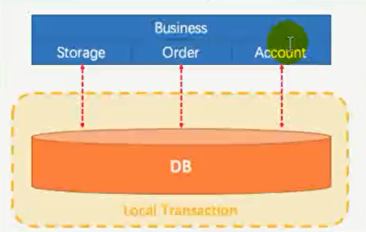
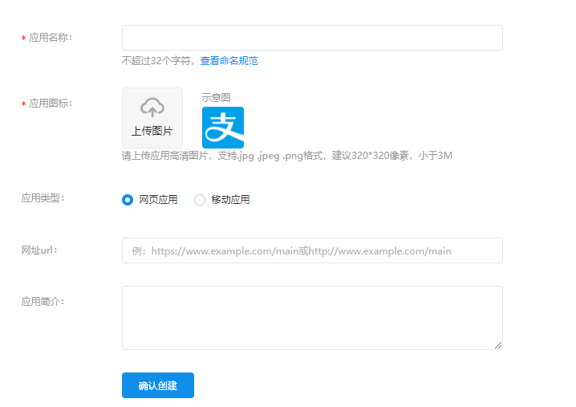

2021.08.01--08.15      97h/15d/6.5h

# 11、单点登录和社交登录

### 11.1 社交登录


QQ、微博，github等网站的用户量非常大，别的网站为了简化网站的登陆和注册逻辑，引入社交登录功能

步骤

1、用户点击 QQ按钮

2、引导跳转进 QQ 授权页


3、用户主动点击授权，跳回之前网页


#### 11.1.1 OAuth2.0

- **OAuth：**OAuth（开放授权）是一个开放标准，允许用户授权第三方网站访问他们存储在另外的服务提供者上的信息，而不需要将用户名和密码提供给第三方网站或分享他们的数据的内容

- **OAuth2.0：**对于用户相关的 OpenAPI（例如获取用户信息，动态同步，照片，日志，分享等），为了保存用户数据的安全和隐私，第三方网站访问用户数据前都需要显示向用户授权

- 官方版流程

  

文档地址：

相关流程分析


#### 11.2 微博登录准备工作

##### 1、进入微博开放平台


##### 2、登录微博，进入微连接，选择网站接入


##### 3、选择立即接入


##### 4、创建自己的应用


##### 5、我们可以在开发阶段


##### 6、进入高级信息


##### 7、添加测试账号


##### 8、进入文档


#### 11.3 微博登录代码实现

##### 登陆注册流程图

看不清，放大一点

##### **微博登录流程**

###### **注册流程**


###### **账号密码登录流程：**


###### **手机验证码发送流程：**


##### 11.3.1 查看微博开放平台文档

https://open.weibo.com/wiki/%E6%8E%88%E6%9D%83%E6%9C%BA%E5%88%B6%E8%AF%B4%E6%98%8E


##### 11.3.2 点击微博登录后，跳转到微博授权页面


##### 11.3.3 用户授权后调用回调接口，并带上参数code换取AccessToken

```java
/**
     * 回调接口
     * @param code
     * @return
     * @throws Exception
     */
    @GetMapping("/oauth2.0/weibo/success")
    public String weibo(@RequestParam("code") String code) throws Exception {
        // 1、根据code换取accessToken
        Map<String, String> map = new HashMap<>();
        map.put("client_id", "1133714539");
        map.put("client_secret", "f22eb330342e7f8797a7dbe173bd9424");
        map.put("grant_type", "authorization_code");
        map.put("redirect_uri", "http://auth.gulimall.com/oauth2.0/weibo/success");
        map.put("code", code);


        HttpResponse response = HttpUtils.doPost("https://api.weibo.com",
                "/oauth2/access_token",
                "post",
                new HashMap<>(),
                map,
                new HashMap<>());

        // 状态码为200请求成功
        if (response.getStatusLine().getStatusCode() == 200 ){
            // 获取到了accessToken
            String json = EntityUtils.toString(response.getEntity());
            SocialUser socialUser = JSON.parseObject(json, SocialUser.class);
            R r = memberFeignService.OAuthlogin(socialUser);
            if (r.getCode() == 0) {
                MemberRespVo data = r.getData("data", new TypeReference<MemberRespVo>() {
                });
                log.info("登录成功:用户:{}",data.toString());

                // 2、登录成功跳转到首页
                return "redirect:http://gulimall.com";
            } else {
                // 注册失败
                return "redirect:http://auth.gulimall.com/login.html";
            }
        } else {
            // 请求失败
            // 注册失败
            return "redirect:http://auth.gulimall.com/login.html";
        }

        // 2、登录成功跳转到首页
        return "redirect:http://gulimall.com";
    }
```

##### 11.3.4 拿到AccessToken 请求对应接口拿到信息

```java
@Override
public MemberEntity login(SocialUser vo) {
    // 登录和注册合并逻辑
    String uid = vo.getUid();
    MemberDao memberDao = this.baseMapper;
    // 根据社交用户的uuid查询
    MemberEntity memberEntity = memberDao.selectOne(new QueryWrapper<MemberEntity>()
            .eq("social_uid", uid));
    // 能查询到该用户
    if (memberEntity != null ){
        // 更新对应值
        MemberEntity update = new MemberEntity();
        update.setId(memberEntity.getId());
        update.setAccessToken(vo.getAccess_token());
        update.setExpiresIn(vo.getExpires_in());

        memberDao.updateById(update);

        memberEntity.setAccessToken(vo.getAccess_token());
        memberEntity.setExpiresIn(vo.getExpires_in());
        return memberEntity;
    } else {
        // 2、没有查询到当前社交用户对应的记录就需要注册一个
        MemberEntity regist = new MemberEntity();
        try {
            Map<String,String> query = new HashMap<>();
            // 设置请求参数
            query.put("access_token",vo.getAccess_token());
            query.put("uid",vo.getUid());
            // 发送get请求获取社交用户信息
            HttpResponse response = HttpUtils.doGet("https://api.weibo.com/",
                    "2/users/show.json",
                    "get",
                    new HashMap<>(),
                    query);
            // 状态码为200 说明请求成功
            if (response.getStatusLine().getStatusCode() == 200){
                // 将返回结果转换成json
                String json = EntityUtils.toString(response.getEntity());
                // 利用fastjson将请求返回的json转换为对象
                JSONObject jsonObject = JSON.parseObject(json);
                // 拿到需要的值
                String name = jsonObject.getString("name");
                String gender = jsonObject.getString("gender");
                //.. 拿到多个信息
                regist.setNickname(name);
                regist.setGender("m".equals(gender) ? 1 : 0);
            }
        } catch (Exception e) {
            e.printStackTrace();
        }
        // 设置社交用户相关信息
        regist.setSocialUid(vo.getUid());
        regist.setAccessToken(vo.getAccess_token());
        regist.setExpiresIn(vo.getExpires_in());
        memberDao.insert(regist);
        return regist;
    }
}
```

### 11.2 SSO(单点登录)

#### 1、什么是SSO

单点登录(SingleSignOn，SSO)，就是通过用户的一次性鉴别登录。当用户在身份认证服务器上登录一次以后，即可获得访问单点登录系统中其他关联系统和应用软件的权限，同时这种实现是不需要管理员对用户的登录状态或其他信息进行修改的，这意味着在多个应用系统中，用户只需一次登录就可以访问所有相互信任的应用系统。这种方式减少了由登录产生的时间消耗，辅助了用户管理，是目前比较流行的 [1]

#### 2、前置知识

https://gitee.com/xuxueli0323/xxl-sso

#### 3、同域下的单点登录

#### 4、不同域下的单点登录

#### 5、单点登录框架 & 原理演示

XXL-SSO 是一个分布式单点登录框架。只需要登录一次就可以访问所有相互信任的应用系统。 拥有"轻量级、分布式、跨域、Cookie+Token均支持、Web+APP均支持"等特性。现已开放源代码，开箱即用。

首先对整个项目进行：mvn clean package -Dmaven.skip.test=true  

xxl-sso-server:

- 8080/xxl-sso-server

- 编排：
  - ssoserver.com 登陆验证服务器
  - client1.com 客户端1
  - client2.com 客户端2

先启动xxl-sso-server 然后启动client1

只要 `client1` 登录成功 `client2` 就不用进行登录直接登录成功

代码测试:

sso-client

```java
/**
 * @author gcq
 * @Create 2020-11-12
 */
@Controller
public class HelloController {

    @Value("${sso.server.url}")
    private String ssoServerUrl;

    /**
     * 无需登录就可以访问
     * @return
     */
    @ResponseBody
    @RequestMapping("/hello")
    public String hello() {
        return "hello";
    }

    /**
     * 需要验证的连接
     * @param model
     * @param token 只要是ssoserver登陆成功回来就会带上
     * @return
     */
    @GetMapping("/employees")
    public String employees(Model model, HttpSession session,
                            @RequestParam(value="token",required = false) String token) {
        if (!StringUtils.isEmpty(token)) {
            // 去ssoserver登录成功调回来就会带上
            //TODO 1、去ssoserver获取当前token真正对应的用户信息
            RestTemplate restTemplate = new RestTemplate();
            // 使用restTemplate进行远程请求
            ResponseEntity<String> forEntity = restTemplate.getForEntity("http://ssoserver.com:8080/userInfo?token=" + token, String.class);
            // 拿到数据
            String body = forEntity.getBody();
            // 设置到session中
            session.setAttribute("loginUser",body);
        }
        Object loginUser = session.getAttribute("loginUser");
        if (loginUser == null ){
            // 没有登录重定向到登陆页面，并带上当前地址
            return "redirect:" + ssoServerUrl + "?redirect_url=http://client1.com:8081/employees";
        } else {
            List<String> emps = new ArrayList<>();
            emps.add("张三");
            emps.add("李四");
            model.addAttribute("emps",emps);
            return "list";
        }

    }
}
```

sso-server

```java
/**
 * @author gcq
 * @Create 2020-11-12
 */
@Controller
public class LoginController {

    @Autowired
    StringRedisTemplate redisTemplate;

    /**
     * 根据token从redis中查询用户信息
     * @param token
     * @return
     */
    @ResponseBody
    @GetMapping("/userInfo")
    public String userInfo(@RequestParam("token") String token) {
        String s = redisTemplate.opsForValue().get(token);
        return s;
    }

    @GetMapping("login.html")
    public String login(@RequestParam("redirect_url") String url, Model model,
                        @CookieValue(value = "sso_token",required = false)String sso_token) {
        if (!StringUtils.isEmpty(sso_token)) {
            //说明有人之前登录过，给浏览器留下了痕迹
            return "redirect:" + url + "?token=" + sso_token;
        }
        // 添加url到model地址中，在前端页面进行取出
        model.addAttribute("url",url);
        return "login";
    }

    /**
     * 登录
     * @param username
     * @param password
     * @param url client端带过来的地址
     * @return
     */
    @PostMapping("/doLogin")
    public String doLogin(@RequestParam("username") String username,
                          @RequestParam("password") String password,
                          @RequestParam("url") String url,
                          HttpServletResponse response){
        // 账号密码不为空 
        if (!StringUtils.isEmpty(username) && !StringUtils.isEmpty(password)) {
            // 登陆成功
            // 把登录成功的用户存起来
            String uuid = UUID.randomUUID().toString().replace("-","");
            redisTemplate.opsForValue().set(uuid,username);
            // 将uuid存入cookie
            Cookie token = new Cookie("sso_token",uuid);
            response.addCookie(token);
            // 保存到cookie
            return "redirect:" + url + "?token=" + uuid;
        }
        // 登录失败，展示登录页
        return "login";
    }
}
```


#### 6、使用 jwt


### 11.3 JWT


# 12、购物车

### 12.1 购物车需求

#### 1、需求描述：

用户可以在**登录状态**下将商品添加到购物车**【登录购物车/在线购物车】**

放入数据库

mongodb

**放入 redis（采用）**

用户可以在**未登录状态**下将商品添加到购物车**【游客购物车/离线购物车】**

放入 localstorage

cookie 

WebSQL

**放入 redis (采用)**

用户可以使用购物车一起结算下单

用户可以**查询自己的购物车**

用户可以在**购物中修改购买商品的数量**

用户可以在**购物车中删除商品**

**选中不选中商品**

在购物车中**展示商品优惠信息**

提示购物车商品价格变化

购物车数据结构


每一个购物项信息，都是一个对象，基本字段包括

```java
skuId:123123, // 商品id
check:true, // 是否选中
title:"apple phone", // 商品标题
defaultImage:'', // 商品默认显示的图片
price:4999, // 商品价格
count:1, // 商品数量
totalPrice:4999 // 购物车中选中商品总价格
skuSaleVo:{} // 。。。。
```

另外，购物车中不止一条数据，因此最终会是对象的数组

```
{...},{....},{....}
```

Redis有5种不同数据结构，这里选择哪一种 比较合适呢? Map<String, List<String>> 首先**不同用户应该有独立的购物车**。

因此购物车应该以用户的作为key来存储，**Value是用户的所有购物车信息**。这样看来基本的 k-v 结构就可以了。

但是，我们对购物车中的商品进行增、删、改操作，**基本都需要根据商品id进行判断**，为了方便后期处理，我们的购物车也应该是 k-v 结构，**key 是商品 id, value 才是这个商品的购物车信息。**

综上所述，我们的购物车结构是一一个**双层Map: Map<String,Map<String,String>>**，在redis中类型为 hash 

**外头key就是用户的id,里面的key就是skuid**

redis中：

新增商品：hset gulimall:cart:7  **(key)334488[商品skuid]  (value)商品的信息**

增加商品数量：hincrby shopcar:uuid1024 334477 1

商品总数：hlen shopcar:uuid

全部选择：hgetall shopcar:uuid1024


### 12.2 Vo编写 & ThreadLocal身份验证

#### 12.2.1 Vo 编写

购物车

```java
/**
 * 整个购物车
 * 需要计算的属性，必须重写他的get方法，保证每次获取属性都会进行计算
 * @author gcq
 * @Create 2020-11-13
 */
public class Cart {
    /**
     * 商品项
     */
    List<CartItem> items;

    /**
     * 商品数量
     */
    private Integer countNum;

    /**
     * 商品类型数量
     */
    private Integer countType;
    /**
     * 商品总价
     */
    private BigDecimal totalAmount;
    /**
     *  减免价格
     */
    private BigDecimal reduce = new BigDecimal("0");;

    public Integer getCountType() {
        int count = 0;
        if (items !=null && items.size() > 0) {
            for (CartItem item : items) {
                count+=1;
            }
        }
        return count;
    }
    public BigDecimal getTotalAmount() {
        BigDecimal amount = new BigDecimal("0");
        // 1、计算购物项总价
        if (items != null && items.size() > 0) {
            for (CartItem item : items) {
                // 拿到购物车中单个商品的总金额
                BigDecimal totalPrice = item.getTotalPrice();
                // 添加到购物总价中
                amount = amount.add(totalPrice);
            }
        }
        // 2、减去优惠总价
        BigDecimal subtract = amount.subtract(getReduce());

        return subtract;
    }

 
}
```

购物车中的实体

```java
/**
 * 购物项
 * @author gcq
 * @Create 2020-11-13
 */
public class CartItem {

    /**
     * 商品id
     */
    private Long skuId;
    /**
     * 购物车中是否选中
     */
    private Boolean check = true;
    /**
     * 商品的标题
     */
    private String title;
    /**
     * 商品的图片
     */
    private String image;
    /**
     * 商品的属性
     */
    private List<String> skuAttr;
    /**
     * 商品的价格
     */
    private BigDecimal price;
    /**
     * 商品的数量
     */
    private Integer count;
    /**
     * 购物车价格 使用自定义get、set
     */
    private BigDecimal totalPrice;
     /**
     *  计算购物项价格
     * @return
     */
    public BigDecimal getTotalPrice() {
        //价格乘以数量
        return this.price.multiply(new BigDecimal("" + this.count));
    }


```

#### 12.2.3 ThreadLocal 身份验证

需求分析：

```java
 /**
     * 浏览器有一个cookie：user-key,标识用户身份，一个月后过期
     * 如果第一次使用jd的购物车功能，都会给一个临时的用户身份
     * 浏览器以后保存，每次访问都会带上这个cookie
     *
     * 登录 session 有
     * 没登录，按照cookie中的user-key来做
     * 第一次：如果没有临时用户，帮忙创建一个临时用户 --> 使用拦截器
     * @return 
     */
```

代码

```java
**
 * 在执行目标方法之前,判断用户的登录状态，并封装给Controller目标请求
 * @author gcq
 * @Create 2020-11-13
 */
public class CartInterceptor implements HandlerInterceptor {

    public static ThreadLocal<UserInfo> threadLocal = new ThreadLocal<>();

    /**
     * 目标方法执行之前
     * @param request
     * @param response
     * @param handler
     * @return
     * @throws Exception
     */
    @Override
    public boolean preHandle(HttpServletRequest request, HttpServletResponse response, Object handler) throws Exception {
        UserInfo userInfo = new UserInfo();
        // 拿到session
        HttpSession session = request.getSession();
        // 查看session中是否保存了用户的值
        MemberRespVo member = (MemberRespVo) session.getAttribute(AuthServerConstant.LOGIN_USER);
        if (member != null) {
            // 用户登录
            userInfo.setUserId(member.getId());
        }
        Cookie[] cookies = request.getCookies();
        if (cookies != null && cookies.length > 0) {
            for (Cookie cookie : cookies) {
                String name = cookie.getName();
                // 拿到cookie名字进行判断如果包含 user-key 就复制到userInfo中
                if (name.equals(CartConstant.TEMP_USER_COOKIE_NAME)) {
                    userInfo.setUserKey(cookie.getValue());
                    userInfo.setTempUser(true);
                }
            }
        }
        // 如果没有临时用户一定要分配一个临时用户
        if (StringUtils.isEmpty(userInfo.getUserKey())) {
            String uuid = UUID.randomUUID().toString();
            userInfo.setUserKey(uuid);
        }
        // 全部放行
        threadLocal.set(userInfo);
        return true;
    }

    /**
     * 业务执行之后,分配临时用户，让浏览器保存
     * @param request
     * @param response
     * @param handler
     * @param modelAndView
     * @throws Exception
     */
    @Override
    public void postHandle(HttpServletRequest request, HttpServletResponse response, Object handler, ModelAndView modelAndView) throws Exception {
        // 拿到用户信息
        UserInfo userInfo = threadLocal.get();
        // 如果没有临时用户一定要保存一个临时用户
        if (!userInfo.isTempUser()) {
            // 持续的延长临时用户的过期时间
            Cookie cookie = new Cookie(CartConstant.TEMP_USER_COOKIE_NAME, userInfo.getUserKey());
            cookie.setDomain("gulimall.com");
            cookie.setMaxAge(CartConstant.TEMP_USER_COOKIE_TIMEOUT);
            response.addCookie(cookie);
        }
    }
}
```


### 12.3 添加购物车

在页面点击加入购物车后将商品添加进购物车


需求分析：

首先需要在页面拿到要提交的参数，skuid，购买数量，并提交后台完成购物车数据添加

后端如何处理这个数据？

1. **通过 `skuid` 远程查询这个商品的信息**
2. **远程查询sku组合的信息**
3. **如果购物车中已经有该数据如何进行提交**？
   1. **如果有该数据，那么就行更改**，根据 skuid 从 reids 中取出数据
   2. 将数据转换成对象然后加上对应的数量，**再次转换为json存入redis**
4. **前端页面频繁添加购物车如何解决？**
   1. 请求发送过来后我们**重定向到其他的页面用来显示数据**，这时候用户刷新的话也是在其他页面进行刷新

```javascript
 /**
     * 加入到购物车
     */
    $("#addToCartA").click(function() {
        // 购买的数量
        var num = $("#numInput").val();
        // skuid
        var skuid = $(this).attr("skuId");
        location.href="http://cart.gulimall.com/addToCart?skuId=" + skuid + "&num=" + num;
        return false
    })
```

请求发送到Controller后

```java
@GetMapping("/addToCart")
public String addToCart(@RequestParam("skuId") Long skuId,
                        @RequestParam("num") Integer num,
                        RedirectAttributes  res) throws ExecutionException, InterruptedException {

    cartService.addToCart(skuId,num);
    //将数据拼接到url后面
    res.addAttribute("skuId",skuId);
    // 重定向到对应的地址
    return "redirect:http://cart.gulimall.com/addToCartSuccess.html";
}
```

Service

```java
    /**
     * 给购物车里面添加商品
     * @param skuId 商品id
     * @param num 数量
     * @throws ExecutionException
     * @throws InterruptedException
     * 如果远程查询比较慢，比如方法当中有好几个远程查询，都要好几秒以上，等整个方法返回就需要很久，这块你是怎么处理的?
     *  1、为了提交远程查询的效率，可以使用线程池的方式，异步进行请求
     *  2、要做的操作就是将所有的线程全部放到自己手写的线程池里面
     *  3、每一个服务都需要配置一个自己的线程池
     *  4、完全使用线程池来控制所有的请求
     */
    @Override
    public void addToCart(Long skuId, Integer num) throws ExecutionException, InterruptedException {
        // 获取到要操作的购物车
        BoundHashOperations<String, Object, Object> cartOps = getCartOps();
        // 1、如果购物车中已有该商品那么需要做的就是修改商品的数量，如果没有该商品需要进行添加该商品到购物车中
        String result = (String) cartOps.get(skuId.toString()); // 商品id作为键，先去Redis里面查看有没有这个相同的商品
        if (StringUtils.isEmpty(result)) { // 如果返回为空，那么说明购物车中没有这个商品，那就要执行添加
            // 2、添加商品到购物车
            // 第一个异步任务,查询当前商品信息
            CartItem cartItem = new CartItem(); // 购物车中每一个都是一个购物项，封装购物车的内容
            CompletableFuture<Void> completableFutureSkuInfo = CompletableFuture.runAsync(() -> {
                // 2.1、远程查询出当前要添加的商品信息
                // 添加哪个商品到购物车，先查询到这个商品的信息
                R r = productFeignService.getSkuInfo(skuId);
                // 获取远程返回的数据，远程数据都封装在skuInfo中
                SkuInfoVo skuInfo = r.getData("skuInfo", new TypeReference<SkuInfoVo>() {
                });
                cartItem.setCheck(true); // 添加商品到购物车，那么这个商品一定是选中的
                cartItem.setSkuId(skuInfo.getSkuId()); // 查询的是哪个商品的id，那么这个商品id就是哪个
                cartItem.setImage(skuInfo.getSkuDefaultImg()); // 当前商品的图片信息
                cartItem.setPrice(skuInfo.getPrice()); // 当前商品的价格
                cartItem.setTitle(skuInfo.getSkuTitle()); // 当前商品的标题
                cartItem.setCount(num); // 当前商品添加的数量
            }, executor);
            // 3、第二个异步任务，远程查询sku组合信息
            CompletableFuture<Void> completableFutureSkuAttr = CompletableFuture.runAsync(() -> {
                List<String> skuSaleAttrValues = productFeignService.getSkuSaleAttrValues(skuId); // 根据skuid来查
                cartItem.setSkuAttr(skuSaleAttrValues); // 远程查询出来到sku组合信息，需要在购物车中进行显示
            }, executor);
            // 4、两个异步任务都完成，才能把数据放到redis中
            CompletableFuture.allOf(completableFutureSkuInfo,completableFutureSkuAttr).get();
            // 把购物项的数据保存redis中
            String cartItemJson = JSON.toJSONString(cartItem);
            cartOps.put(skuId.toString(),cartItemJson); // 添加商品到购物车中
        } else {
            // 如果购物车中有这个商品，那么需要做的就是将商品的数量进行更改,也即是新添加的商品数量加上当前购物车中商品数量
            CartItem cartItem = JSON.parseObject(result, CartItem.class);
            cartItem.setCount(cartItem.getCount() + num);
            String cartItemJson = JSON.toJSONString(cartItem);
            // 更新redis
            cartOps.put(skuId.toString(),cartItemJson);
        }
    }
```

解决刷新问题

```java
/**
 * 跳转到成功页面
 * @param skuId
 * @param model
 * @return
 */
@GetMapping("/addToCartSuccess.html")
public String addToCartSuccessPage(@RequestParam("skuId") Long skuId,Model model) {

    // 重定向到成功页面，再次查询购物车数据
    CartItem item = cartService.getCartItem(skuId);
    model.addAttribute("item",item);
    return "success";
}
```

### 12.4 获取合并购物车

#### 12.4.1 需求分析

1. **如果用户登录，临时购物车的数据如何显示**？
   1. 将临时购物车的数据合并到用户购物车中
2. **如何显示购物车的数据？**
   1. 从 redis 取出数据放到对象中并渲染出来

#### 12.4.2 代码编写

Controller

```java
@GetMapping("/cart.html")
public String cartListPage(Model model) throws ExecutionException, InterruptedException {
    Cart cart = cartService.getCart();
    model.addAttribute("cart",cart);
    return "cartList";
}
```

Service

拼装 `Key` 从 `redis` 中查询数据

临时购物车如果有数据，当前状态是登录，那就将临时购物车的数据合并到当前用户的购物车

```java
  @Override
    public Cart getCart() throws ExecutionException, InterruptedException {
        /**
         * 需求分析1
         *   1、如果用户登录后，那么临时购物车的数据如何处理？
         *      将临时购物车的数据，放到用户购物车中进行合并
         *   2、如何显示购物车中的数据？
         *      从redis中查询到数据放到对象中，返回到页面进行渲染
         */
        Cart cart = new Cart();
        // 1、购物车的获取操作，分为登录后购物车 和 没登录购物车
        UserInfo userInfo = CartIntercept.threadLocal.get(); // 拿到共享数据
        if (userInfo.getUserId() != null) { // 登录后的购物车
            String cartKey = CART_PREFIX + userInfo.getUserKey();
            String tempCartKey = CART_PREFIX + userInfo.getUserKey();
            // 如果临时购物车中还有数据，那就需要将临时购物车合并到已登录购物车里面
            // 判断临时购物车中是否有数据
            List<CartItem> cartItems = getCartItems(tempCartKey);
            if (cartItems != null ) { // 临时购物车中有数据，需要将临时购物车的数据合并到登录后的购物车
                for (CartItem item : cartItems) { // 拿到临时购物车的所有数据，将他添加到已登录购物车里面来
                    // 调用addToCart()这个方法，他会根据登录状态进行添加，当前是登录状态
                    // 所以这个方法会将临时购物车的数据添加到已登录购物车中
                    addToCart(item.getSkuId(),item.getCount()); // 合并临时和登录后的购物车
                }
                // 合并完成后还需要将临时购物车中的数据删除
                clearCart(tempCartKey);
            }
            // 再次获取用户登录后的购物车【包含临时购物车数据和已登录购物车数据】
            List<CartItem> cartItemList = getCartItems(cartKey);
            cart.setItems(cartItemList);// 将多个购物项设置到购物车中
        } else {
            // 没有登录的购物车，拿到没有登录购物车的数据
            String cartKey = CART_PREFIX + userInfo.getUserKey();
            // 获取购物车中的所有购物项
            List<CartItem> cartItems = getCartItems(cartKey);
            cart.setItems(cartItems);
        }
        return cart;
    }
```

getCaerItems

```java
/**
     * 获取指定用户 (登录用户/临时用户) 购物车里面的数据
     * @param cartKey
     * @return
     */
    private List<CartItem> getCartItems(String cartKey) {
        BoundHashOperations<String, Object, Object> operations = redisTemplate.boundHashOps(cartKey);
        List<Object> values = operations.values(); // 拿到多个购物项
        if (values != null) {
            List<CartItem> cartItemList = values.stream().map((obj) -> {
                String s = (String) obj;
                CartItem cartItem = JSON.parseObject(s, CartItem.class);
                return cartItem;
            }).collect(Collectors.toList());
            return cartItemList;
        }
        return null;
    }
```


### 12.5 选中购物项 & 改变购物项的数量 & 删除购物项

#### 12.5.1 需求分析：

##### 1、选中购物项

1. 在页面中选中购物项后，数据应该要和redis中的数据进行同步
2. 页面选中，reids中数据就要更改

##### 2、改变购物项数量

1. 购物车中，增加了商品的数量，对应的价格，总价也需要进行改变

##### 3、删除购物项

1. 在购物项中删除该条数据，从redis中根据skuid删除这条记录

##### 4、将数据修改或删除后，重新跳转到cart.html 重新加载数据

#### 12.5.2 代码实现

前端页面方法

```java
// 选中购物项
    $(".itemCheck").click(function () {
        var skuId = $(this).attr("skuId");
        var check = $(this).prop("checked");
        location.href = "http://cart.gulimall.com/checkItem?skuId=" + skuId + "&check=" + (check?1:0);
    })

    // 改变购物项数量
    $(".countOpsBtn").click(function() {
        var skuId = $(this).parent().attr("skuId");
        var num = $(this).parent().find(".countOpsNum").text();
        location.href = "http://cart.gulimall.com/countItem?skuId=" + skuId + "&num=" + num;
    })
    var deleteId = 0;
    // 删除购物项
    function deleteItem() {
        location.href = "http://cart.gulimall.com/deleteItem?skuId=" + deleteId;
    }
    $(".deleteItemBtn").click(function() {
        deleteId = $(this).attr("skuId");
    })
```

Controller

```java
 /**
    * @需求描述: 系统管理员 购物车组 模块 用户选中购物项更新redis中对象
    * @创建人: 
    * @创建时间: 2021/01/04 15:37
    * @修改需求:
    * @修改人:
    * @修改时间:
    * @需求思路:
    */
    @GetMapping("/checkItem")
    public String checkItem(@RequestParam("skuId") Long skuId,
                            @RequestParam("checked") Integer checked) {
        cartService.checkItem(skuId,checked);
        // 重定向到购物车页面，重新获取购物车数据
        return "redirect:http://cart.gulimall.com/cart.html";
    }

    /**
    * @需求描述: 系统管理员 购物车组 模块 用户更改购物车中购物项的数量
    * @创建人: 
    * @创建时间: 2021/01/04 16:05
    * @修改需求:
    * @修改人:
    * @修改时间:
    * @需求思路:
    */
    @GetMapping("/updateItem")
    public String updateItem(@RequestParam("skuId") Long skuId,
                             @RequestParam("count") Integer count) {
        cartService.updateItem(skuId,count);
        return "redirect:http://cart.gulimall.com/cart.html";
    }

    /**
    * @需求描述: 系统管理员 购物车服务 模块 用户删除购物车中的购物项
    * @创建人: 
    * @创建时间: 2021/01/04 16:40
    * @修改需求:
    * @修改人:
    * @修改时间:
    * @需求思路:
    */
    @GetMapping("/deleteItem")
    public String deleteItem(@RequestParam("skuId") Long skuId) {
        cartService.deleteItem(skuId);
        return "redirect:http://cart.gulimall.com/cart.html";
    }
```

Service

```java
@Override
    public void checkItem(Long skuId, Integer checked) {
        // 1、从redis中查出购物项设置购物项是否选中。
        BoundHashOperations<String, Object, Object> cartOps = getCartOps();
        String cart = (String) cartOps.get(skuId.toString());
        CartItem cartItem = JSON.parseObject(cart, CartItem.class);
        cartItem.setCheck(checked == 1 ? true : false);
        String jsonStirng = JSON.toJSONString(cartItem);
        cartOps.put(skuId.toString(),jsonStirng); // 更新redis
    }

    @Override
    public void updateItem(Long skuId, Integer count) {
        // 1、用户在页面对某个购物项增加或减少购物项的数量，那么redis中应该也要进行更新
        CartItem cartItem = getCartItem(skuId);
        cartItem.setCount(count);
        BoundHashOperations<String, Object, Object> cartOps = getCartOps();
        cartOps.put(skuId.toString(),JSON.toJSONString(cartItem)); // 更新redis中数据
    }

    @Override
    public void deleteItem(Long skuId) {
        // 获取到当前购物车，然后根据id删除购物车里面的购物项
        BoundHashOperations<String, Object, Object> cartOps = getCartOps();
        cartOps.delete(skuId.toString());
    }	
```


# 13、消息队列 - MQ

### 13.1 RabbitMQ

#### 异步处理

消息发送的时间取决于业务执行的最长的时间

#### 应用解耦

原本是需要**订单系统**直接调用**库存系统**

只需要将请求发送给消息队列，其他的就不需要去处理了，节省了处理业务逻辑的时间

#### 流量消峰

某一时刻如果请求特别的大，那就先把它放入消息队列，从而达到流量消峰的作用


流程图地址：https://www.processon.com/view/link/5fbda8c35653bb1d54f7077b

### 13.2 概述

1. 大多应用中，可通过消息服务中间件来提升系统异步通信，扩展解耦能力
2. 消息服务中两个重要概念：
   1. **消息代理（message broker）** 和 **目的地（destination）**
3. 当消息发送者发送消息后，将由消息代理接管，消息代理保证消息传递到指定目的地
4. 消息队列主要有两种形式的目的地
   1. **队列（Queue）**:点对点消息通信（point - to - point）
   2. **主题（topic）**：发布（publish）/订阅（subscribe）消息通信
5. 点对点式：
   1. 消息发送者发送消息，消息代理将其放入一个队列中，消息接收者从队列中获取消息内容，消息读取后被移出队列
   2. 消息只有唯一的发送者和接受者，单并不是说只能有一个接收者
6. 发布订阅式:
   1. 发送者（发布者）发到消息到主题，多个接收者（订阅者）监听（订阅）这个主题，那么就会在消息到达时同时收到消息
7. **JMS（Java Message Service） Java消息服务：**
   1. 基于JVM消息代理的规范，ActiveMQ、HornetMQ是JMS的实现
8. AMQP（Advanced Message Queuing Protocol）
   1. 高级消息队列协议，也是一个消息代理的规范，兼容JMS
   2. RabbitMQ是AMQP的实现
9. Spring 支持
   1. spring - jms提供了对JMS的支持
   2. spring - rabbit提供了对AMQP的支持
   3. 需要ConnectionFactory的实现来连接消息代理
   4. 提供 **JmsTemplate**、**RabbitTemplate** 来发送消息
   5. @JmsListener（JMS）、@RabbitListener（AMQP）注解在方法上监听消息代理发布的消息
   6. @EnableJms、@EnableRabbit开启支持
10. Spring Boot 自动配置
    1. JmsAutoConfiguration
    2. RabbitAutoConfiguration
11. 市面上的MQ产品
    1. ActiveMQ、RabbitMQ、RocketMQ，kafka


### 13.3 RabbitMQ概念

RabbitMQ简介：

RabbitMQ是一由erlang开发的AMQP（Advanved Message Queue Protocol）的开源实现

核心概念

**Message**

消息，消息是不具名的，它是由消息头和消息体组成，消息体是不透明的，而消息头则由一系列的可选属性组成，这些属性包括 **routing - key （路由键）**，**priority（相对于其他消息的优先权）**，**delivery - mode（指出该消息可能需要持久性存储）**等

**Publisher**

消息的生产者，也是一个像交换器发布消息的客户端应用程序

**Exchange**

交换器，用来接收生产者发送的消息并将这些消息路由给服务器中的队列

Exchange有4种类型：**direct(默认)**、**fanout**、**topic**，和**heades**，不同类型的 **Exchange** 转发消息的策略有所区别

**Queue**

消息队列，用来保存消息直到发送给**消费者**，**他是消息的容器**，也是消息的重点，一个消息可以投入一个或多个队列，消息一直在队列里面，等待消费者连接到这个队列将其取走

**Binding**

绑定，**用于消息队列和交换器之间的关联**，一个绑定就是基于路由键将交换器和消息队列连接起来的规则，所有可以将交换器理解成一个由绑定构成的路由表

**Connection**

网路连接，比如一个TCP连接

**Channel**

信道，多路复用连接中的一个独立的双向数据流通道，信道是建立在真实的TCP连接的内的虚拟连接，AMQP 命令都是通过信息到发送出去的，不管是发布消息，订阅队列还是接收消息，这些动作都是通过队列完成，因为对应操作系统来说建立和销毁 TCP 都是非常昂贵的开销，所以引入了信道的概念，以复用一条TCP连接

**Consumer**

消息的消费者，表示一个消息队列中取得消息的客户端应用程序

**Virtual Host**

虚拟主机，表示交换器、消息队列和相关对象。虚拟主机是共享相同的身份认证和加密环境的独立服务器域。每个Virtual host本质上就是一个 mini 版的RabbitMQ 服务器,拥有自己的队列、交换器、绑定和权限机制。Virtual host 是 AMQP 概念的基础，必须在连接时指定,RabbitMQ默认的vhost是/。

**Broker**

表示消息队列服务器实体


### 13.4 Docker 安装RabbitMQ

```shell
docker run -d --name rabbitmq -p 5671:5671 -p 5672:5672 -p 4369:4369 -p 25672:25672 -p 15671:15671 -p 15672:15672 rabbitmq:management

4369, 25672 (Erlang发现&集群端口)
5672, 5671 (AMQP端口)
15672 (web管理后台端口)
61613, 61614 (STOMP协议端口)
1883, 8883 (MQTT协议端口)
 # 自动启动
docker update rabbitmq --restart=always

```


### 13.5 RabbitMQ 运行机制

AMQP 中的消息路由

AMQP 中消息的路由过程和 Java 开发者熟悉的 JMS 存在一些差别，AMQP中增加了 **Exchange** 和 **Binding** 的角色 生产者把消息发布到 Exchange 上，消息最终到达队列并被消费者接收，而 Binding 决定交换器的消息应该发送给那个队列


**Exchange 类型**

Exchange 分发消息时根据类型的不同分发策略有区别，目前共四种类型：direct、tanout、topic、headers header匹配AMQP消息的 header 而不是路由键，headers 交换器和 direct 交换器完全一致，但性能差能多，目前几乎用不到了，所以直接看另外三种类型


### 13.6 RabbitMQ 整合

#### 1、引入 Spring-boot-starter-amqp

```xml
      <dependency>
            <groupId>org.springframework.boot</groupId>
            <artifactId>spring-boot-starter-amqp</artifactId>
        </dependency>

```

#### 2、application.yml配置

```yaml
spring:
  rabbitmq:
    host: 192.168.56.10
    port: 5672
    virtual-host: /
```

#### 3、测试RabbitMQ

##### 1、AmqpAdmin:管理组件

```java
 /**
     * 创建Exchange
     * 1、如何利用Exchange,Queue,Binding
     *      1、使用AmqpAdmin进行创建
     * 2、如何收发信息
     */
    @Test
    public void contextLoads() {
        //	public DirectExchange(
        //	String name, 交换机的名字
        //	boolean durable, 是否持久
        //	boolean autoDelete, 是否自动删除
        //	Map<String, Object> arguments)
        //	{
        DirectExchange directExchange = new DirectExchange("hello-java.exchange",true,false);
        amqpAdmin.declareExchange(directExchange);
        log.info("Exchange[{}]创建成功：","hello-java.exchange");
    }

    /**
     * 创建队列
     */
    @Test
    public void createQueue() {
        // public Queue(String name, boolean durable, boolean exclusive, boolean autoDelete, Map<String, Object> arguments) {
        Queue queue = new Queue("hello-java-queue",true,false,false);
        amqpAdmin.declareQueue(queue);
        log.info("Queue[{}]:","创建成功");
    }


/**
     * 绑定队列
     */
    @Test
    public void createBinding() {
        // public Binding(String destination, 目的地
        // DestinationType destinationType, 目的地类型
        // String exchange,交换机
        // String routingKey,//路由键
        Binding binding = new Binding("hello-java-queue",
                Binding.DestinationType.QUEUE,
                "hello-java.exchange",
                "hello.java",null);
        amqpAdmin.declareBinding(binding);
        log.info("Binding[{}]创建成功","hello-java-binding");
    }
```


##### 2、RabbitTemplate：消息发送处理组件

```java
 @Autowired
    @Test
    public void sendMessageTest() {
        for(int i = 1; i <=5; i++) {
            if(i%2==0) {
                OrderReturnReasonEntity reasonEntity = new OrderReturnReasonEntity();
                reasonEntity.setId(1l);
                reasonEntity.setCreateTime(new java.util.Date());
                reasonEntity.setName("哈哈");
                //
                String msg = "Hello World";
                // 发送的对象类型的消息，可以是一个json
                rabbitTemplate.convertAndSend("hello-java.exchange","hello.java",reasonEntity);
            } else {
                OrderEntity orderEntity = new OrderEntity();
                orderEntity.setOrderSn(UUID.randomUUID().toString());
                rabbitTemplate.convertAndSend("hello-java.exchange","hello.java",orderEntity);
            }
            log.info("消息发送完成{}");
        }

    }
```


### 13.7 RabbitMQ消息确认机制 - 可靠到达

- 保证消息不丢失，可靠抵达，可以使用事务消息，性能下降250倍，为此引入确认机制
- **publisher** confirmCallback 确认模式
- **publisher** returnCallback 未投递到 queue 退回
- **consumer** ack 机制


#### 可靠抵达 - ConfirmCallback

spring.rabbitmq.publisher-confirms=true

在创建 `connectionFactory` 的时候设置 PublisherConfirms(true) 选项，开启 `confirmcallback`。

`CorrelationData` 用来表示当前消息唯一性

消息只要被 broker 接收到就会执行 confirmCallback,如果 cluster 模式，需要所有 broker 接收到才会调用 confirmCallback

被 broker 接收到只能表示 message 已经到达服务器，并不能保证消息一定会被投递到目标 queue 里，所以需要用到接下来的 returnCallback

#### 可靠抵达 - ReturnCallback

spring.rabbitmq.publisher-retuns=true

spring.rabbitmq.template.mandatory=true

confirm 模式只能保证消息到达 broker，不能保证消息准确投递到目标 queue 里。在有些模式业务场景下，我们需要保证消息一定要投递到目标 queue 里，此时就需要用到 return 退回模式

这样如果未能投递到目标 queue 里将调用 returnCallback，可以记录下详细到投递数据，定期的巡检或者自动纠错都需要这些数据

#### 可靠抵达 - Ack 消息确认机制

- 消费者获取到消息，成功处理，可以回复Ack给Broker
  - basic.ack 用于肯定确认：broker 将移除此消息
  - basic.nack 用于否定确认：可以指定 beoker 是否丢弃此消息，可以批量
  - basic.reject用于否定确认，同上，但不能批量
- 默认，消息被消费者收到，就会从broker的queue中移除
- 消费者收到消息，默认自动ack，但是如果无法确定此消息是否被处理完成，或者成功处理，我们可以开启手动ack模式
  - 消息处理成功，ack()，接受下一条消息，此消息broker就会移除
  - 消息处理失败，nack()/reject() **重新**发送给其他人进行处理，或者容错处理后ack
  - 消息一直没有调用ack/nack方法，brocker认为此消息正在被处理，不会投递给别人，此时客户端断开，消息不会被broker移除，会投递给别人

手动ack

```yaml
spring:
  rabbitmq:
    host: 192.168.43.128
    port: 5672
    virtual-host: /
    #开启发送端确认 发送的过程中
    publisher-confirms: true
    #开启发送端确认 抵达队列
    publisher-returns: true
    template:
      #抵达队列，以异步模式优先回调组合ReturnCallback
      mandatory: true
    listener:
      simple:
        #手动ack消息 手动确认收货 手动确认模式 防止消息丢失
        acknowledge-mode: manual
```

```java
@RabbitListener(queues = {"hello-java-queue"})
@Service("orderItemService")
public class OrderItemServiceImpl extends ServiceImpl<OrderItemDao, OrderItemEntity> implements OrderItemService {
    /**
     * 监听消息
     * queues 声明需要监听的所有队列
     * org.springframework.amqp.core.Message
     * <p>
     * 参数可以写一下类型
     * 1、Message essage: 原生消息详细信息。头+体
     * 2、发送的消息的类型: OrderReturnReasonEntity content;
     * 3、Channel channel:当前传输数据的通道
     * <p>
     * Queue:可以很多人都来监听,只要收到消息,队列删除消息,而且只能有一个收到此消息
     * 1)、订单服务启动多个：同一个消息,只能有一个客户端收到
     * 2)、只有一个消息完全处理完,方法运行结束，我们就可以接收到下一个消息
     */
//    @RabbitListener(queues = {"hello-java-queue"})
    //这个类的这个方法才能接受hello-java-queue消息
    @RabbitHandler
    public void receiveMessage(Message message, OrderReturnReasonEntity content, Channel channel) {

        //拿到消息体
//        byte[] body = message.getBody();
        //拿到消息头
//        MessageProperties properties = message.getMessageProperties();
        //消息处理完 手动确认  deliveryTag在Channel内按顺序自增
        long deliveryTag = message.getMessageProperties().getDeliveryTag();
        //System.out.println("deliveryTag->" + deliveryTag);

        try {
            if (deliveryTag % 2 == 0) {
                //确认签收 队列删除该消息 false非批量模式
                System.out.println("签收 "+ deliveryTag);
                channel.basicAck(deliveryTag, false);
            } else {
                //拒收退货 第三个参数 -> true:重新入队 false:丢弃
                System.out.println("拒收 "+ deliveryTag);
                channel.basicNack(deliveryTag, false, true);
            }
            System.out.println("接收到消息:" + content);
        } catch (IOException e) {
            //网络中断
        }
    }
}
```


### 13.8 RabbitMQ 延时队列(实现定时任务)

**场景:**

比如未付款的订单，超过一定时间后，系统自动取消订单并释放占有物品

**常用解决方案：**

Spring的schedule 定时任务轮询数据库

**缺点：**

消耗系统内存，增加了数据库的压力，存在较大的时间误差

**解决：**rabbitmq的消息TTL和死信Exchange结合


#### 使用场景


时效问题

上一轮扫描刚好扫描，而这个时候刚好下了订单，就没有扫描到，下一轮扫描的时候，订单还没有过期，等到订单过期后30分钟才被扫描到


#### 消息的TTL（Time To Live）

- 消息的TTL 就是**消息的存活时间**，
- RabbitMQ可以对**队列**还有**消息**分别设置TTL
  - 对队列设置就是没有消费者连着的保持时间，**也可以对每一个消息单独的设置，超过了这个时间我们可以认为这个消息他死了，称之为死信**
  - 如果队列设置了，消息也设置了，那么会**取小**，所以一个消息如果被路由到不同的队列中，这个消息死亡时间有可能不一样的（不同队列设置），这里讲的是单个TTL 因为他是实现延时任务的关键，可以通过**设置消息的 expiration 字段或者 x-message-ttl** 来设置时间两者是一样的效果

#### Dead Letter Exchange（DLX）

- 一个消息在满足如下条件下，会进**死信路由**，记住这里是路由不是队列，一个路由可以对应很多队列，（什么是死信）
  - 一个消息被Consumer拒收了，并且reject方法的参数里requeue是false。也就是说不被再次放在队列里，被其他消费者使用。(basic.reject/ basic.nack) 
  - requeue= false上面的消息的TTL到了，消息过期了。
  - 队列的长度限制满了。排在前面的消息会被丢弃或者扔到死信路由上
- Dead Letter Exchange其实就是一种普通的exchange, 和创建其他exchange没有两样。只是在某一个设置 Dead Letter Exchange的队列中有消息过期了自动触发消息的转发，发送到Dead Letter Exchange中去。
- 我们既可以控制消息在一段时间后变成死信， 又可以控制变成死信的消息被路由到某一个指定的交换机， 结合C者，其实就可以实现一个延时队列

#### 延时队列实现 - 1


延时队列实现 - 2


代码实现：

下单场景


模式升级


代码实现：

SpringBoot可以使用@Bean 来初始化Queue、exchange、Biding等

```java
/**
 * 监听队列信息
 * @param orderEntity
 默认为有监听时才进行创建队列
 */
@RabbitListener(queues = "order.release.order.queue")
public void listener(OrderEntity orderEntity, Channel channel, Message message) throws IOException {
    System.out.println("收到过期的订单信息，准备关闭订单" + orderEntity.getOrderSn());
    // 确认接收到消息，不批量接收
    channel.basicAck(message.getMessageProperties().getDeliveryTag(), false);
}

/**
 * 容器中的 Binding、Queue、exchange 都会自动创建，(RabbitMQ没有的情况下)
 * @return
 */
@Bean
public Queue orderDelayQueue(){
    // 特殊参数
    Map<String,Object> map = new HashMap<>();
    // 设置交换器

    map.put("x-dead-letter-exchange", "order-event-exchange");
    // 路由键
    map.put("x-dead-letter-routing-key","order.release.order");
    // 消息过期时间
    map.put("x-message-ttl",60000);
    Queue queue = new Queue("order.delay.queue", true, false, false,map);
    return queue;
}

/**
 * 创建队列
 * @return
 */
@Bean
public Queue orderReleaseOrderQueue() {
    Queue queue = new Queue("order.release.order.queue", true, false, false);
    return queue;
}

/**
 * 创建交换机
 * @return
 */
@Bean
public Exchange orderEventExchange() {
    return new TopicExchange("order-event-exchange",true,false);
}

/**
 * 绑定关系 将delay.queue和event-exchange进行绑定
 * @return
 */
@Bean
public Binding orderCreateOrderBingding(){
        return new Binding("order.delay.queue",
                Binding.DestinationType.QUEUE,
                "order-event-exchange",
                "order.create.order",
                null);
}

/**
 * 将 release.queue 和 event-exchange进行绑定
 * @return
 */
@Bean
public Binding orderReleaseOrderBinding(){
    return new Binding("order.release.order.queue",
            Binding.DestinationType.QUEUE,
            "order-event-exchange",
            "order.release.order",
            null);
}
```


### 13.9 如何保证消息可靠性 - 消息丢失 & 消息重复

#### 1、消息丢失

- **消息发送出去，由于网络问题没有抵达服务器**
  - 做好容错方法(try-Catch) ，发送消息可能会网络失败，失败后要有重试机制，可记录到数据库，采用定期扫描重发的方式
  - 做好日志记录，每个消息状态是否都被服务器收到都应该记录
  - 做好定期重发，如果消息没有发送成功，定期去数据库扫描未成功的消息进行重发
- **消息抵达Broker, Broker要将消息写入磁盘(持久化)才算成功。此时Broker尚未持久化完成，宕机。**
  - publisher也必须加入确认回调机制，确认成功的消息，修改数据库消息状态。
- **自动ACK的状态下。消费者收到消息，但没来得及消息然后宕机**
  - 一定开启手动ACK，消费成功才移除，失败或者没来得及处理就noAck并重新入队

#### 2、消息重复

- **消息消费成功，事务已经提交，ack时，机器宕机。导致没有ack成功，Broker的消息重新由unack变为ready,并发送给其他消费者**
- **消息消费失败，由于重试机制，自动又将消息发送出去**
- **成功消费，ack时宕机，消息由unack变为ready, Broker又重新发送**
  - 消费者的业务消费接口应该设计为**幂等性**的。比如扣库存有工作单的状态标志
  - 使用**防重表**(redis/mysq|) ，发送消息每一 个都有业务的唯一 标识，处理过就不用处理
  - rabbitMQ的每一个消息都有redelivered字段， 可以获取**是否是被重新投递过来的**，而不是第一次投递过来的

#### 3、消息积压

- **消费者积压**
- **消费者消费能力不足积压**
- **发送者发送流量太大**
  - 上线更多消费者，进行正常消费
  - 上线专门的队列消费服务，将消息先批量取出来，记录数据库，离线慢慢处理


# 14、订单

### 14.1 订单中心

1、订单中心

电商系列涉及到 3 流，分别为信息流、资金流、物流，而订单系统作为中枢将三者有机的集合起来

订单模块是电商系统的枢纽，在订单这个模块上获取多个模块的数据和信息，同时对这些信息进行加工处理后流向下个环节，这一系列就构成了订单的信息疏通

#### 1、订单构成


##### 1、用户信息

用户信息包括是用户账号、用户等级、用户的收货地址、收货人、收货人电话、用户账号需要绑定手机号码，但是用户绑定的手机号码不一定是收货信息上的电话。用户可以添加多个收货信息，用户等级信息可以用来和促销系统进行匹配，获取商品折扣，同时用户等级还可以获取积分的奖励等

##### 2、订单基础信息

订单基础信息是订单流转的核心，其包括订单类型，父/子订单、订单编号、订单状态、订单流转时间等

1. 订单类型包括实体订单和虚拟订单商品等，这个根据商城商品和服务类型进行区分
2. 同时订单都需要做父子订单处理，之前在初创公司一直只有一个订单，没有做父子订单处理后期需
3. 要进行拆单的时候就比较麻烦，尤其是多商户商场，和不同仓库商品的时候，父子订单就是为后期做拆单准备的。
4. 订单编号不多说了，需要强调的一点是父子订单都需要有订单编号，需要完善的时候可以对订单编号的每个字段进行统一定义和诠释。
5. 订单状态记录订单每次流转过程，后面会对订单状态进行单独的说明。
6. 订单流转时间需要记录下单时间，支付时间，发货时间，结束时间/关闭时间等等


##### 3、商品信息

商品信息从商品库中获取商品的SKU信息、图片、名称、属性规格、商品单价、商户信息等，从用户

下单行为记录的用户下单数量，商品合计价格等


##### 4、优惠信息

优惠信息记录用户参与过的优惠活动，包括优惠促销活动，比如满减、满赠、秒杀等，用户使用的优

惠卷信息，优惠卷满足条件的优惠卷需要展示出来，另外虚拟币抵扣信息等进行记录

为什么把优惠信息单独拿出来而不放在支付信息里面呢?

因为优惠信息只是记录用户使用的条目，而支付信息需要加入数据进行计算，所以做为区分。


##### 5、支付信息

支付流水单号，这个流水单号是在唤起网关支付后支付通道返回给电商业务平台的支付流水号，财务

通过订单号和流水单号与支付通道进行对账使用。

支付方式用户使用的支付方式，比如微信支付、支付宝支付、钱包支付、快捷支付等。支付方式有时候可能有两个一-余额支付+第三方支付。

商品总金额，每个商品加总后的金额:运费，物流产生的费用;优惠总金额，包括促销活动的优惠金额，

优惠券优惠金额，虚拟积分或者虛拟币抵扣的金額，会员折扣的金额等之和;实付金额，用户实际需要

付款的金额。

**用户实付金额=商品总金额+运费 - 优惠总金额**


##### 6、物流信息

物流信息包括配送方式，物流公司，物流单号，物流状态，物流状态可以通过第三方接口来
获取和向用户展示物流每个状态节点。

#### 2、订单状态

##### 1、待付款

用户提交订单后，订单进行预下单，目前主流电商网站都会唤起支付，便于用户快速完成支
付，需要注意的是待付款状态下可以对库存进行锁定，锁定库存需要配置支付超时时间，超
时后将自动取消订单，订单变更关闭状态。

##### 2、已付款/代发货

用户完成订单支付，订单系统需要记录支付时间，支付流水单号便于对账，订单下放到WMS系统，仓库进行调动、配货、分拣，出库等操作

##### 3、待收货/已发货

仓库将商品出库后，订单进入物流环节，订单系统需要同步物流信息，便于用户实时熟悉商品的物流状态

##### 4、已完成

用户确认收货后吗，订单交易完成，后续支付则进行计算，如果订单存在问题进入售后状态

##### 5、已取消

付款之前取消订单，包括超时未付款或用户商户取消订单都会产生这种订单状态

##### 6、售后中

用户在付款后申请退款，或商家发货后用户申请退货


售后也同样存在各种状态，当发起售后申请后生成售后订单，售后订单状态为待审核，等待

商家审核，商家审核通过后订单状态变更为待退货，等待用户将商品寄回，商家收货后订单

状态更新为待退款状态，退款到用户原账户后订单状态更新为售后成功。


### 14.2 订单流程

订单流程是指从订单产生到完成整个流转的过程，从而行程了-套标准流程规则。而不同的产品类型或业务类型在系统中的流程会千差万别，比如上面提到的线上实物订单和虚拟订单的流程，线上实物订单与020订单等，所以需要根据不同的类型进行构建订单流程。不管类型如何订单都包括正向流程和逆向流程，对应的场景就是购买商品和退换货流程，正向流程就是一一个正常的网购步骤:订单生成>支付订单->卖家发货一确认收货>交易成功。而每个步骤的背后，订单是如何在多系统之间交互流转的，

可概括如下图

	

1、订单创建与支付

1. 订单创建前需要预览订单，选择收货信息等
2. 订单创建需要锁定库存，库存有才可创建，否则不能创建
3. 订单创建后超时未支付需要解锁库存
4. 支付成功后，需要进行拆单，根据商品打包方式，所在仓库，物流等进行拆单
5. 支付的每笔流水都需要记录，以待查账
6. 订单创建，支付成功等状态都需要给MQ发送消息，方便其他系统感知订阅

2、逆向流程

1. 修改订单，用户没有提交订单，可以对订单一些信息进行修改，比如配送信息，优惠信息，及其他一些订单可修改范围的内容，此时只需对数据进行变更即可。
2. 订单取消**，用户主动取消订单和用户超时未支付**，两种情况下订单都会取消订单，而超时情况是系统自动关闭订单，所以在订单支付的响应机制上面要做支付的

### 14.3 幂等性处理


### 14.4 订单业务

#### 1、搭建环境

在订单服务下准备好页面

可以发现订单结算页，包含以下信息:

1.收货人信息:有更多地址，即有多个收货地址，其中有一个默认收货地址

2.支付方式:货到付款下在线支付，不需要后台提供

3.送货清单:配送方式(不做)及商品列表(根据购物车选中的skuld到数据库中查询)

4.发票:不做

5.优惠:查询用户领取的优惠券(不做)及可用积分(京豆)

##### 1.1、整合SpringSession

**1、引入pom**

```xml
  <!--整合spring session 解决session问题-->
        <dependency>
            <groupId>org.springframework.session</groupId>
            <artifactId>spring-session-data-redis</artifactId>
        </dependency>
```

**2、配置文件添加**

```yaml
Spring:
	session:
    	store-type: redis
```

**3、启动类加注解**

```java
@EnableRedisHttpSession
```

**4、修改页面中登录**

```html
						<li style="border: 0;">
							<a th:if="${session.loginUser != null }" class="aa">[[${session.loginUser.nickname}]]</a>
							<a th:if="${session.loginUser == null }" href="http://auth.gulimall.com/login.html">你好请登录</a>
						</li>
						<li>
							<a th:if="${session.loginUser == null }" style="color: red;" href="http://auth.gulimall.com/reg.html" class="li_2">免费注册</a>
						</li>
```

##### 1.2、订单登录拦截

任何请求都需要先经过拦截器的验证，才能去执行目标方法，这里是用户是否登录，用户登录了则放行，否则跳转到登陆页面

```java
  /**
     * 目标方法执行之前
     * @param request
     * @param response
     * @param handler
     * @return
     * @throws Exception
     */
    @Override
    public boolean preHandle(HttpServletRequest request, HttpServletResponse response, Object handler) throws Exception {
        String requestURI = request.getRequestURI();
        // 指定的请求不拦截
        boolean match1 = new AntPathMatcher().match("/order/order/status/**", requestURI);
        boolean match2 = new AntPathMatcher().match("/payed/notify", requestURI);
        if (match1 || match2) {
            return true;
        }
        MemberRespVo memberRespVo= (MemberRespVo) request.getSession().getAttribute(AuthServerConstant.LOGIN_USER);
        if (memberRespVo != null) { // 用户登陆了
            loginUser.set(memberRespVo); // 放到共享数据中
            return true;
        } else { // 用户没登录
            // 给前端显示提示信息
            request.getSession().setAttribute("msg","请先进行登录");
            // 重定向到登录页面
            response.sendRedirect("http://auth.gulimall.com/login.html");
            return false;
        }
    }
```

#### 2、订单确认页

**根据图片中商品信息抽取成Vo**

##### 2.1、抽取Vo

**订单确认OrderConfirmVo**

```java
/**
 * 订单确认页需要的数据
 * @author gcq
 * @Create 2020-11-17
 */

public class OrderConfirmVo {

    // 收货地址，ums_member_receive_address
    @Getter @Setter
    List<MemberAddressVo> address;

    // 所有选中的购物项
    @Getter @Setter
    List<OrderItemVo> item;

    // 发票记录...

    /**
     * 优惠卷信息
     */
    @Getter @Setter
    Integer integration;

    /**
     * 订单总额
     */
    BigDecimal total;
    public BigDecimal getTotal() {
        BigDecimal sum = new BigDecimal("0");
        if(item != null) {
            for (OrderItemVo orderItemVo : item) {
                BigDecimal multiply = orderItemVo.getPrice().multiply(new BigDecimal(orderItemVo.getCount().toString()));
                sum = sum.add(multiply);
            }
        }
        return sum;
    }
    @Getter @Setter
    Map<Long,Boolean> stocks;
    /**
     * 应付价格
     */
    BigDecimal payPrice;

    public BigDecimal getPayPrice() {
        BigDecimal sum = new BigDecimal("0");
        if(item != null) {
            for (OrderItemVo orderItemVo : item) {
                BigDecimal multiply = orderItemVo.getPrice().multiply(new BigDecimal(orderItemVo.getCount().toString()));
                sum = sum.add(multiply);
            }
        }
        return sum;
    }

    @Setter
    private Integer count;

    /**
     * 遍历item 拿到商品的数量
     * @return
     */
    public Integer getCount() {
        Integer i = 0;
        if (item != null) {
            for (OrderItemVo orderItemVo : item) {
                i+=orderItemVo.getCount();
            }
        }
        return i;
    }

    @Getter @Setter
    private String orderToken;

}
```

**商品项orderItemVo**

```java
/**
 * 商品项
 * @author gcq
 * @Create 2020-11-17
 */
@Data
public class OrderItemVo {
    /**
     * 商品id
     */
    private Long skuId;
    /**
     * 购物车中是否选中
     */
    private Boolean check = true;
    /**
     * 商品的标题
     */
    private String title;
    /**
     * 商品的图片
     */
    private String image;
    /**
     * 商品的属性
     */
    private List<String> skuAttr;
    /**
     * 商品的价格
     */
    private BigDecimal price;
    /**
     * 商品的数量
     */
    private Integer count;
    /**
     * 购物车价格 使用自定义get、set
     */
    private BigDecimal totalPrice;


    private BigDecimal weight;

}
```

**用户地址MemberAddressVo**

```java
/**
 * 用户地址信息
 * @author gcq
 * @Create 2020-11-17
 */
@Data
public class MemberAddressVo {
    private Long id;
    /**
     * member_id
     */
    private Long memberId;
    /**
     * 收货人姓名
     */
    private String name;
    /**
     * 电话
     */
    private String phone;
    /**
     * 邮政编码
     */
    private String postCode;
    /**
     * 省份/直辖市
     */
    private String province;
    /**
     * 城市
     */
    private String city;
    /**
     * 区
     */
    private String region;
    /**
     * 详细地址(街道)
     */
    private String detailAddress;
    /**
     * 省市区代码
     */
    private String areacode;
    /**
     * 是否默认
     */
    private Integer defaultStatus;
}
```

##### 2.2、订单确认页数据查询

```java
   @Override
    public OrderConfirmVo confirmOrder() throws ExecutionException, InterruptedException {
        OrderConfirmVo confirmVo = new OrderConfirmVo();
        MemberRespVo memberRespVo = OrderInterceptor.loginUser.get();// 获取当前登录后的用户
        // 异步任务执行之前，先共享数据
        RequestAttributes requestAttributes = RequestContextHolder.getRequestAttributes();
        // 1、第一个异步任务 远程查询用户地址信息
        CompletableFuture<Void> memberFuture = CompletableFuture.runAsync(() -> {
            // 在主线程中拿到原来的数据，在父线程里面共享RequestContextHolder
            // 只有共享，拦截其中才会有数据
            RequestContextHolder.setRequestAttributes(requestAttributes);
            // 根据会员id查出之前会员保存过的收货地址信息
            // 远程查询会员服务的收获地址信息
            List<MemberAddressVo> address = memberFeignService.getAddress(memberRespVo.getId());
            log.error("address:{}",address);
            confirmVo.setAddress(address);
        }, executor);

        // 2、第二个异步任务远程查询购物车中选中给的购物项
        CompletableFuture<Void> addressFuture = CompletableFuture.runAsync(() -> {
            // 每一个线程都来共享之前的请求数据
            RequestContextHolder.setRequestAttributes(requestAttributes);
            // 远程查询购物车中的购物项信息，用来结账
            List<OrderItemVo> currentUserCartItem = cartFeignServicea.getCurrentUserCartItem();// 获取当前用户的购物项数据
            log.error("currentUserCartItem:{}",currentUserCartItem);
            confirmVo.setItem(currentUserCartItem);
            // 查询到购物项信息后，再看查询购物的库存信息
        }, executor).thenRunAsync(() -> { // 只要上面任务执行完成，就开始执行thenRunAsync的任务
            // 3、商品是否有库存
            List<OrderItemVo> items = confirmVo.getItem();
            // 批量查询每一个商品的信息
            // 收集好商品id
            List<Long> collect = items.stream().map(item -> item.getSkuId()).collect(Collectors.toList());
            // 远程查询购物项对应的库存信息
            R data = wareFeignService.hasStock(collect);
            // 得到每一个商品的库存状态信息
            List<SkuHasStockVo> hasStockVo = data.getData(new TypeReference<List<SkuHasStockVo>>() {
            });
            if (hasStockVo != null) {
                Map<Long, Boolean> stockMap = hasStockVo.stream().collect(Collectors.toMap(SkuHasStockVo::getSkuId, SkuHasStockVo::getHasStock));
                confirmVo.setStocks(stockMap);
                log.error("stockMap:{}",stockMap);
            }
        },executor);


        // 4、查询积分信息
        Integer integration = confirmVo.getIntegration();
        confirmVo.setIntegration(integration);

        // 等两个异步任务都完成
        CompletableFuture.allOf(memberFuture, addressFuture).get();
       // 4、防重令牌
        /**
         * 接口幂等性就是用户对同一操作发起的一次请求和多次请求结果是一致的
         * 不会因为多次点击而产生了副作用，比如支付场景，用户购买了商品，支付扣款成功，
         * 但是返回结果的时候出现了网络异常，此时钱已经扣了，用户再次点击按钮，
         * 此时就会进行第二次扣款，返回结果成功，用户查询余额发现多扣钱了，
         * 流水记录也变成了两条。。。这就没有保证接口幂等性
         */
        // 先是再页面中生成一个随机码把他叫做token先存到redis中，然后放到对象中在页面进行渲染。
        // 用户提交表单的时候，带着这个token和redis里面去匹配如果一直那么可以执行下面流程。
        // 匹配成功后再redis中删除这个token，下次请求再过来的时候就匹配不上直接返回
        // 生成防重令牌
        String token = UUID.randomUUID().toString().replace("-","");
        // 存到redis中 设置30分钟超时
        redisTemplate.opsForValue().set(OrderConstant.USER_ORDER_TOKEN_PREFIX + memberRespVo.getId(),token,30, TimeUnit.SECONDS);
        // 放到页面进行显示token，然后订单中带着token来请求
        confirmVo.setOrderToken(token);

        return confirmVo;
```

#### 3、创建订单

##### 1、OrderWebController

```java
 /**
    * @需求描述: 系统管理员 订单组 模块 用户下单功能
    * @创建人: 郭承乾
    * @创建时间: 2021/01/06 12:01
    * @修改需求:
    * @修改人:
    * @修改时间:
    * @需求思路:
    */
    @PostMapping("/submitOrder")
    public String submitOrder(OrderSubmitVo vo, Model model, RedirectAttributes redirectAttributes) {
        SubmitOrderResponseVo responseVo = orderService.submitOrder(vo);
        log.error("======================订单创建成功{}:",responseVo);
        // 根据vo中定义的状态码来验证
        if (responseVo.getCode() == 0 ) { // 订单创建成功
            // 下单成功返回到支付页
            model.addAttribute("submitOrderResp",responseVo);
            return "pay";
        } else { // 下单失败
            // 根据状态码验证对应的状态
            String msg = "下单失败";
            switch (responseVo.getCode()) {
                case 1: msg += "订单信息过期，请刷新后再次提交"; break;
                case 2: msg += "订单商品价格发生变化，请确认后再次提交"; break;
                case 3: msg += "库存锁定失败，商品库存不足"; break;
            }
            redirectAttributes.addFlashAttribute("msg",msg);
            // 重新回到订单确认页面
            return "redirect:http://order.gulimall.com/toTrade";
        }
    }
```

##### 2、Service

具体业务

```java
 @Transactional
    @Override
    public SubmitOrderResponseVo submitOrder(OrderSubmitVo vo) {
        // 先将参数放到共享变量中，方便之后方法使用该参数
        confirmVoThreadLocal.set(vo);
        // 接收返回数据
        SubmitOrderResponseVo response = new SubmitOrderResponseVo();
        response.setCode(0);
        // 通过拦截器拿到用户的数据
        MemberRespVo memberRespVo = LoginInterceptor.loginUser.get();
        /**
         * 不使用原子性验证令牌
         *      1、用户带着两个订单，提交速度非常快，两个订单的令牌都是123，去redis里面查查到的也是123。
         *          两个对比都通过，然后来删除令牌，那么就会出现用户重复提交的问题，
         *      2、第一次差的快，第二次查的慢，只要没删就会出现这些问题
         *      3、因此令牌的【验证和删除必须保证原子性】
         *      String orderToken = vo.getOrderToken();
         *      String redisToken = redisTemplate.opsForValue().get(OrderConstant.USER_ORDER_TOKEN_PREFIX + memberRespVo.getId());
         *         if (orderToken != null && orderToken.equals(redisToken)) {
         *             // 令牌验证通过 进行删除
         *             redisTemplate.delete(OrderConstant.USER_ORDER_TOKEN_PREFIX + memberRespVo.getId());
         *         } else {
         *             // 不通过
         *         }
         */
        // 验证令牌【令牌的对比和删除必须保证原子性】
        // 因此使用redis中脚本来进行验证并删除令牌
        // 0【删除失败/验证失败】 1【删除成功】
        String script = "if redis.call('get',KEYS[1]) == ARGV[1] then return redis.call('del',KEYS[1]) else return 0 end";
        /**
         * redis lur脚本命令解析
         * if redis.call('get',KEYS[1]) == ARGV[1] then return redis.call('del',KEYS[1]) else return 0 end
         *  1、redis调用get方法来获取一个key的值，如果这个get出来的值等于我们传过来的值
         *  2、然后就执行删除，根据这个key进行删除，删除成功返回1，验证失败返回0
         *  3、删除否则就是0
         *  总结：相同的进行删除，不相同的返回0
         * 脚本大致意思
         */
        // 拿到令牌
        String orderToken = vo.getOrderToken();
        /**
         * 	public <T> T execute(RedisScript<T> script // redis的脚本
         * 	    , List<K> keys // 对应的key 参数中使用了Array.asList 将参数转成list集合
         * 	    , Object... args) { // 要删除的值
         */
        // 原子验证和删除
        Long result = redisTemplate.execute(new DefaultRedisScript<Long>(script, Long.class)
                , Arrays.asList(OrderConstant.USER_ORDER_TOKEN_PREFIX + memberRespVo.getId())
                , orderToken);
        if (result  == 0L) { // 验证令牌验证失败
            // 验证失败直接返回结果
            response.setCode(1);
            return response;
        } else { // 原子验证令牌成功
            // 下单 创建订单、验证令牌、验证价格、验证库存
            // 1、创建订单、订单项信息
            OrderCreateTo order = createOrder();
            // 2、应付总额
            BigDecimal payAmount = order.getOrder().getPayAmount();
            // 应付价格
            BigDecimal payPrice = vo.getPayPrice();
            /**
             * 电商项目对付款的金额精确到小数点后面两位
             * 订单创建好的应付总额 和购物车中计算好的应付价格求出绝对值。
             */
            if(Math.abs(payAmount.subtract(payPrice).doubleValue()) < 0.01) {
                // 金额对比成功 保存订单
                saveOrder(order);
                // 创建锁定库存Vo
                WareSkuLockedVo wareSkuLockedVo = new WareSkuLockedVo();
                // 准备好商品项
                List<OrderItemVo> lock = order.getOrderItem().stream().map(orderItemEntity -> {
                    OrderItemVo orderItemVo = new OrderItemVo();
                    // 商品购买数量
                    orderItemVo.setCount(orderItemEntity.getSkuQuantity());
                    // skuid 用来查询商品信息
                    orderItemVo.setSkuId(orderItemEntity.getSkuId());
                    // 商品标题
                    orderItemVo.setTitle(orderItemEntity.getSkuName());
                    return orderItemVo;
                }).collect(Collectors.toList());
                // 订单号
                wareSkuLockedVo.setOrderSn(order.getOrder().getOrderSn());
                // 商品项
                wareSkuLockedVo.setLocks(lock);
                // 远程调用库存服务锁定库存
                R r = wareFeignService.orderLockStock(wareSkuLockedVo);
                if (r.getCode() == 0) { // 库存锁定成功
                    // 将订单对象放到返回Vo中
                    response.setOrder(order.getOrder());
                    // 设置状态码
                    response.setCode(0);
                    // 订单创建成功发送消息给MQ
                    rabbitTemplate.convertAndSend("order-event-exchange"
                            ,"order.create.order"
                            ,order.getOrder());
                    return response;
                } else {
                    // 远程锁定库存失败
                    response.setCode(3);
                    return response;
                }
            } else {
                // 商品价格比较失败
                response.setCode(2);
                return response;
            }
        }
    }
 /**
     * 创建订单和订单项
     * @return
     */
    private OrderCreateTo createOrder() {
        OrderCreateTo orderCreateTo = new OrderCreateTo();
        // 1、生成订单号
        String orderSn = IdWorker.getTimeId();
        // 2、构建订单
        OrderEntity orderEntity = buildOrder(orderSn);
        // 3、构建订单项
        List<OrderItemEntity> itemEntities = builderOrderItems(orderSn);
        // 4、设置价格、积分相关信息
        computPrice(orderEntity,itemEntities);
        // 5、设置订单项
        orderCreateTo.setOrderItem(itemEntities);
        // 6、设置订单
        orderCreateTo.setOrder(orderEntity);
        return orderCreateTo;
    }
 /**
     * 构建订单
     * @param orderSn
     * @return
     */
    private OrderEntity buildOrder(String orderSn) {
        // 拿到共享数据
        OrderSubmitVo orderSubmitVo = confirmVoThreadLocal.get();
        // 用户登录登录数据
        MemberRespVo memberRespVo = LoginInterceptor.loginUser.get();

        OrderEntity orderEntity = new OrderEntity();
        // 设置订单号
        orderEntity.setOrderSn(orderSn);
        // 用户id
        orderEntity.setMemberId(memberRespVo.getId());
        // 根据用户收货地址id查询出用户的收获地址信息
        R fare = wareFeignService.getFare(orderSubmitVo.getAddrId());
        FareVo data = fare.getData(new TypeReference<FareVo>() {
        });
        //将查询到的会员收货地址信息设置到订单对象中
        // 运费金额
        orderEntity.setFreightAmount(data.getFare());
        // 城市
        orderEntity.setReceiverCity(data.getMemberAddressVo().getCity());
        // 详细地区
        orderEntity.setReceiverDetailAddress(data.getMemberAddressVo().getDetailAddress());
        // 收货人姓名
        orderEntity.setReceiverName(data.getMemberAddressVo().getName());
        // 收货人手机号
        orderEntity.setReceiverPhone(data.getMemberAddressVo().getPhone());
        // 区
        orderEntity.setReceiverRegion(data.getMemberAddressVo().getRegion());
        // 省份直辖市
        orderEntity.setReceiverProvince(data.getMemberAddressVo().getProvince());
        // 订单刚创建状态设置为 待付款，用户支付成功后将该该状态改成已付款
        orderEntity.setStatus(OrderStatusEnum.CREATE_NEW.getCode());
        // 自动确认时间
        orderEntity.setAutoConfirmDay(7);

        return orderEntity;
    }
/**
     * 构建订单项
     * @param orderSn
     * @return
     */
    private List<OrderItemEntity> builderOrderItems(String orderSn) {
        // 获取购物车中选中的商品
        List<OrderItemVo> currentUserCartItem = cartFeignServicea.getCurrentUserCartItem();
        if (currentUserCartItem != null && currentUserCartItem.size() > 0) {
            List<OrderItemEntity> collect = currentUserCartItem.stream().map(orderItemVo -> {
                // 构建订单项
                OrderItemEntity itemEntity = builderOrderItem(orderItemVo);
                itemEntity.setOrderSn(orderSn);
                return itemEntity;
            }).collect(Collectors.toList());
            return collect;
        }
        return null;
    }
  /**
     * 构建订单项信息
     * @param cartItem
     * @return
     */
    private OrderItemEntity builderOrderItem(OrderItemVo cartItem) {
        OrderItemEntity itemEntity = new OrderItemEntity();
        // 1、根据skuid查询关联的spuinfo信息
        Long skuId = cartItem.getSkuId();
        R spuinfo = productFeignService.getSpuInfoBySkuId(skuId);
        SpuInfoVo spuInfoVo = spuinfo.getData(new TypeReference<SpuInfoVo>() {
        });
        // 2、设置商品项spu信息
        // 品牌信息
        itemEntity.setSpuBrand(spuInfoVo.getBrandId().toString());
        // 商品分类信息
        itemEntity.setCategoryId(spuInfoVo.getCatalogId());
        // spuid
        itemEntity.setSpuId(spuInfoVo.getId());
        // spu_name 商品名字
        itemEntity.setSpuName(spuInfoVo.getSpuName());

        // 3、设置商品sku信息
        // skuid
        itemEntity.setSkuId(skuId);
        // 商品标题
        itemEntity.setSkuName(cartItem.getTitle());
        // 商品图片
        itemEntity.setSkuPic(cartItem.getImage());
        // 商品sku价格
        itemEntity.setSkuPrice(cartItem.getPrice());
        // 商品属性以 ; 拆分
        String skuAttr = StringUtils.collectionToDelimitedString(cartItem.getSkuAttr(), ";");
        itemEntity.setSkuAttrsVals(skuAttr);
        // 商品购买数量
        itemEntity.setSkuQuantity(cartItem.getCount());

        // 4、设置商品优惠信息【不做】
        // 5、设置商品积分信息
        // 赠送积分 移弃小数值
        itemEntity.setGiftIntegration(cartItem.getPrice().multiply(new BigDecimal(cartItem.getCount().toString())).intValue());
        // 赠送成长值
        itemEntity.setGiftGrowth(cartItem.getPrice().multiply(new BigDecimal(cartItem.getCount().toString())).intValue());

        // 6、订单项的价格信息
        // 这里需要计算商品的分解信息
        // 商品促销分解金额
        itemEntity.setPromotionAmount(new BigDecimal("0"));
        // 优惠券优惠分解金额
        itemEntity.setCouponAmount(new BigDecimal("0"));
        // 积分优惠分解金额
        itemEntity.setIntegrationAmount(new BigDecimal("0"));
        // 商品价格乘以商品购买数量=总金额(未包含优惠信息)
        BigDecimal origin = itemEntity.getSkuPrice().multiply(new BigDecimal(itemEntity.getSkuQuantity().toString()));
        // 总价格减去优惠卷-积分优惠-商品促销金额 = 总金额
        origin.subtract(itemEntity.getPromotionAmount())
                .subtract(itemEntity.getCouponAmount())
                .subtract(itemEntity.getIntegrationAmount());
        // 该商品经过优惠后的分解金额
        itemEntity.setRealAmount(origin);
        return itemEntity;
    }
 /**
     * 计算订单涉及到的积分、优惠卷抵扣、促销优惠信息等信息
     * @param orderEntity
     * @param itemEntities
     * @return
     */
    private OrderEntity computPrice(OrderEntity orderEntity, List<OrderItemEntity> itemEntities) {
        // 1、定义好相关金额，然后遍历购物项进行计算
        // 总价格
        BigDecimal total = new BigDecimal("0");
        //相关优惠信息
        // 优惠卷抵扣金额
        BigDecimal coupon = new BigDecimal("0");
        // 积分优惠金额
        BigDecimal integration = new BigDecimal("0");
        // 促销优惠金额
        BigDecimal promotion = new BigDecimal("0");
        // 积分
        BigDecimal gift = new BigDecimal("0");
        // 成长值
        BigDecimal growth = new BigDecimal("0");

        // 遍历订单项将所有的优惠信息进行相加
        for (OrderItemEntity itemEntity : itemEntities) {
            coupon = coupon.add(itemEntity.getCouponAmount()); // 优惠卷抵扣
            integration = integration.add(itemEntity.getIntegrationAmount()); // 积分优惠分解金额
            promotion = promotion.add(itemEntity.getPromotionAmount()); // 商品促销分解金额
            gift = gift.add(new BigDecimal(itemEntity.getGiftIntegration().toString())); // 赠送积分
            growth = growth.add(new BigDecimal(itemEntity.getGiftGrowth())); // 赠送成长值
            total = total.add(itemEntity.getRealAmount()); //优惠后的总金额
        }

        // 2、设置订单金额
        // 订单总金额
        orderEntity.setTotalAmount(total);
        // 应付总额 = 订单总额 + 运费信息
        orderEntity.setPayAmount(total.add(orderEntity.getFreightAmount()));
        // 促销优化金额（促销价、满减、阶梯价）
        orderEntity.setPromotionAmount(promotion);
        // 优惠券抵扣金额
        orderEntity.setCouponAmount(coupon);

        // 3、设置积分信息
        // 订单购买后可以获得的成长值
        orderEntity.setGrowth(growth.intValue());
        // 积分抵扣金额
        orderEntity.setIntegrationAmount(integration);
        // 可以获得的积分
        orderEntity.setIntegration(gift.intValue());
        // 删除状态【0->未删除；1->已删除】
        orderEntity.setDeleteStatus(0);
        return orderEntity;
    }
```

##### 3、库存自动解锁--->MQ

###### 库存解锁、StockReleaseListener

```java
package com.atguigu.gulimall.ware.listener;

import com.atguigu.common.to.mq.OrderTo;
import com.atguigu.common.to.mq.StockLockedTo;
import com.atguigu.gulimall.ware.service.WareSkuService;
import com.rabbitmq.client.Channel;
import org.springframework.amqp.core.Message;
import org.springframework.amqp.rabbit.annotation.RabbitHandler;
import org.springframework.amqp.rabbit.annotation.RabbitListener;
import org.springframework.beans.factory.annotation.Autowired;
import org.springframework.stereotype.Service;

import java.io.IOException;

/**
 * 监听库存延时队列
 * @author gcq
 * @Create 2021-01-07
 */
@Service
@RabbitListener(queues = "stock.release.stock.queue")
public class StockReleaseListener {

    @Autowired
    WareSkuService wareSkuService;

    /**
     * 监听库存队列
     * @param lockedTo
     * @param message
     */
    @RabbitHandler
    public void handleStockLockedRelease(StockLockedTo lockedTo, Message message, Channel channel) throws IOException {
        System.out.println("收到解锁库存的信息");
        try {
            wareSkuService.unLockStock(lockedTo);
            //库存解锁成功没有抛出异常，自动ack机制确认
            channel.basicAck(message.getMessageProperties().getDeliveryTag(),false);
        } catch (Exception e) {
            e.printStackTrace();
            // 重发
            channel.basicReject(message.getMessageProperties().getDeliveryTag(),true);
        }
    }

    /**
     * 订单释放
     *  订单30分钟未支付，订单关闭后发送的消息
     */
    @RabbitHandler
    public void handlerOrderCloseRelease(OrderTo orderTo, Message message, Channel channel) throws IOException {
        System.out.println("订单关闭准备解锁库存......");
        try {
            wareSkuService.unLockStock(orderTo);
            channel.basicAck(message.getMessageProperties().getDeliveryTag(),false);
        } catch (Exception e) {
            e.printStackTrace();
            channel.basicReject(message.getMessageProperties().getDeliveryTag(),true);
        }
    }
}
```

Service

```java
 /**
     * 解锁库存
     * @param lockedTo
     */
    @Override
    public void unLockStock(StockLockedTo lockedTo) {
        // 工作单详情
        StockDetailTo detail = lockedTo.getDetail();
        // 工作单详情id
        Long detailId = detail.getId();
        // 查询到库存工作单详情
        WareOrderTaskDetailEntity taskDetailEntity = wareOrderTaskDetailService.getById(detailId);
        if (taskDetailEntity != null) {
            // 解锁库存
            // 库存工作单id
            Long id = lockedTo.getId();
            // 查询到库存工作单
            WareOrderTaskEntity TaskEntity = wareOrderTaskService.getById(id);
            // 拿到订单号
            String orderSn = TaskEntity.getOrderSn();
            // 根据订单号查询订单的状态
            R orderStatus = orderFeignService.getOrderStatus(orderSn);
            if (orderStatus.getCode() == 0) {
                OrderVo data = orderStatus.getData(new TypeReference<OrderVo>() {
                });
                // 订单状态为已关闭,那么就需要解锁库存
                if (data == null || data.getStatus() == 4) {
                    // 库存工作单锁定状态为锁定才进行解锁
                    if (taskDetailEntity.getLockStatus() == 1) {
                        unLockStock(detail.getSkuId(), detail.getWareId(), detail.getSkuNum(), detailId);
                    }
                }
            } else {
                // 消息被拒绝后重新放到队列里面，让别人继续消费解锁
                throw new RuntimeException("远败");
            }
        }
    }
```


#### 4、支付

选择的是支付宝支付，根据老师所提供的素材 **alipayTemplate、PayVo、PaySyncVo**,引入到项目中进行开发

##### 1、Controller

跳转到支付宝支付页面，**支付完成后跳转到支付成功的回调页面**

```java
/**
     * 1、跳转到支付页面
     * 2、用户支付成功后，我们要跳转到用户的订单列表页
     * produces 明确方法会返回什么类型，这里返回的是html页面
     * @param orderSn
     * @return
     * @throws AlipayApiException
     */
    @ResponseBody
    @GetMapping(value = "/payOrder",produces = "text/html")
    public String payOrder(@RequestParam("orderSn") String orderSn) throws AlipayApiException {
//        PayVo payVo = new PayVo();
//        payVo.setBody(); // 商品描述
//        payVo.setSubject(); //订单名称
//        payVo.setOut_trade_no(); // 订单号
//        payVo.setTotal_amount(); //总金额
        PayVo payvo = orderService.payOrder(orderSn);
        // 将返回支付宝的支付页面，需要将这个页面进行显示
        String pay = alipayTemplate.pay(payvo);
        System.out.println(pay);
        return pay;
    }
```

##### 2、Service

```java
 /**
     * 计算商品支付需要的信息
     * @param orderSn
     * @return
     */
    @Override
    public PayVo payOrder(String orderSn) {
        PayVo payVo = new PayVo();
        OrderEntity orderEntity = this.getOrderByOrderSn(orderSn);// 根据订单号查询到商品
        // 数据库中付款金额小数有4位，但是支付宝只接受2位，所以向上取整两位数
        BigDecimal decimal = orderEntity.getPayAmount().setScale(2, BigDecimal.ROUND_UP);
        payVo.setTotal_amount(decimal.toString());
        // 商户订单号
        payVo.setOut_trade_no(orderSn);
        // 查询出订单项，用来设置商品的描述和商品名称
        List<OrderItemEntity> itemEntities = orderItemService.list(new QueryWrapper<OrderItemEntity>()
                .eq("order_sn", orderSn));
        OrderItemEntity itemEntity = itemEntities.get(0);
        // 订单名称使用商品项的名字
        payVo.setSubject(itemEntity.getSkuName());
        // 商品的描述使用商品项的属性
        payVo.setBody(itemEntity.getSkuAttrsVals());
        return payVo;
    }
```

##### 3、支付成功后跳转页面

支付成功后跳转到**订单页面**

```java
 /**
    * @需求描述: 系统管理员 会员服务组 模块 用户支付成功后跳转到该页面
    * @创建人: 
    * @创建时间: 2021/01/08 11:13
    * @修改需求:
    * @修改人:
    * @修改时间:
    * @需求思路:
    */
    @GetMapping("/memberOrder.html")
    public String memberList(@RequestParam(value = "pageNum",defaultValue = "1") Integer pageNum, Model model) {
        // 准备分页参数
        Map<String,Object> params = new HashMap<>();
        params.put("page",pageNum);
        // 远程查询当前用户的所有订单
        R r = orderFeignService.listwithItem(params);
        System.out.println(JSON.toJSONString(r));
        if (r.getCode() == 0) {
            model.addAttribute("orders",r);
        }
        return "list";
    }
```

Service

```java
 /**
     * 查询当前用户所有订单
     * @param params
     * @return
     */
    @Override
    public PageUtils queryPageWithItem(Map<String, Object> params) {
        // 当前用户登录数据
        MemberRespVo memberRespVo = LoginInterceptor.loginUser.get();
        // 查询当前用户所有的订单记录
        IPage<OrderEntity> page = this.page(
                new Query<OrderEntity>().getPage(params),
                new QueryWrapper<OrderEntity>()
                        .eq("member_id",memberRespVo.getId())
                        .orderByDesc("id")
        );
        List<OrderEntity> records = page.getRecords(); // 拿到分页查询结果
        List<OrderEntity> orderEntityList = records.stream().map(item -> {
            // 根据订单号查询当订单号对应的订单项
            List<OrderItemEntity> itemEntities = orderItemService.list(new QueryWrapper<OrderItemEntity>()
                    .eq("order_sn", item.getOrderSn()));
            item.setOrderEntityItem(itemEntities);
            return item;
        }).collect(Collectors.toList());
        // 重新设置分页数据
        page.setRecords(orderEntityList);

        return new PageUtils(page);
    }
```

然后页面渲染数据

支付宝文档地址:

https://opendocs.alipay.com/open/270/105900


#### 5、收单

##### 订单：OrderListener

```java
@RabbitListener(queues = "order.release.order.queue") // 监听订单的释放队列，能到这个里面的消息都是30分钟后过来的
@Service
public class OrderListener {

    @Autowired
    OrderService orderService;

    /**
     * 订单定时关单
     *      商品下单后，会向MQ中发送一条消息告诉MQ订单创建成功。
     *      那么订单创建30分钟后用户还没有下单，MQ就会关闭该订单
     * @param orderEntity 订单对象
     * @param channel 信道
     * @param message 交换机
     * @throws IOException
     */
    @RabbitHandler
    public void listener(OrderEntity orderEntity, Channel channel, Message message) throws IOException {
        System.out.println("收到过期的订单信息，准备关闭订单：" + orderEntity.getOrderSn());
        try {
            orderService.closeOrder(orderEntity);
            // 关闭订单成功后，ack信息确认
            channel.basicAck(message.getMessageProperties().getDeliveryTag(),false);
        } catch (Exception e) {
            e.printStackTrace();
            channel.basicReject(message.getMessageProperties().getDeliveryTag(),true);
        }
    }

}
```

Service

```java
   @Override
    public void closeOrder(OrderEntity orderEntity) {
        // 订单30分钟的时间可能有属性变动，所以需要根据属性再次查询一次
        OrderEntity entity = this.getById(orderEntity.getId());
        // 当前状态为待付款，说明用户30分钟内还没有付款
        if(entity.getStatus() == OrderStatusEnum.CREATE_NEW.getCode()) {
            OrderEntity updateOrder = new OrderEntity();
            // 根据订单id更新
            updateOrder.setId(entity.getId());
            // 订单状态改成已取消
            updateOrder.setStatus(OrderStatusEnum.CANCLED.getCode());
            // 根据订单对象更新
            this.updateById(updateOrder);
            // 准备共享对象用于发送到MQ中
            OrderTo orderTo = new OrderTo();
            // 拷贝属性
            BeanUtils.copyProperties(entity,orderTo);
            try {
                rabbitTemplate.convertAndSend("order-event-exchange","order.release.other",orderTo);
            } catch (Exception e) {
                e.printStackTrace();
            }
        }
    }
```


- 订单在支付页，不支付，一直刷新，订单过期了才支付，订单状态改为已支付了，但是库存解锁了。
  - 使用支付宝自动收单功能解决。只要一段时间不支付，就不能支付了。
- 由于时延等问题。订单解锁完成，正在解锁库存的时候，异步通知才到
  - 订单解锁，手动调用收单
- 网络阻塞问题，订单支付成功的异步通知一直不到达
  - 查询订单列表时，ajax获取当前未支付的订单状态，查询订单状态时，再获取一下支付宝此订单的状态
- 其他各种问题
  - 每天晚上闲时下载支付宝对账单，一 一 进行对账

# 15、幂等性

### 15.1 什么是幂等性

**接口幂等性就是用户对同一操作发起的一次请求和多次请求结果是一致的**，不会因为多次点击而产生了副作用，比如支付场景，用户购买了商品，支付扣款成功，但是返回结果的时候出现了网络异常，此时钱已经扣了，用户再次点击按钮，此时就会进行第二次扣款，返回结果成功，用户查询余额发现多扣钱了，流水记录也变成了两条。。。这就没有保证接口幂等性

### 15.2 那些情况需要防止

用户多次点击按钮

用户页面回退再次提交

微服务互相调用，由于网络问题，导致请求失败，feign触发重试机制

其他业务情况

### 15.3 什么情况下需要幂等

以 SQL 为例，有些操作时天然**幂等**的

SELECT * FROM table WHERE id =? 无论执行多少次都不会改变状态是天然的**幂等**

UPDATE tab1 SET col1=1 WHERE col2=2 无论执行成功多少状态都是一致的，也是**幂等**操作

delete from user where userid=1 多次操作，结果一样，具备**幂等**性

insert into user(userid,name) values(1,' a' ) 如userid为唯一主键，即重复上面的业务，只会插入一条用户记录，具备**幂等**性

------

UPDATE tab1 SET col1=col1+1 WHERE col2=2,每次执行的结果都会发生变化，不是**幂等**的。insert into user(userid,name) values(,a")如userid不是主键，可以重复，那上面业务多次操作，数据都会新增多条，不具备**幂等**性。


### 15.4 幂等解决方案

#### 1、token 机制

1、服务端提供了发送 `token` 的接口，我们在分析业务的时候，哪些业务是存在幂等性问题的，就必须在执行业务前，先获取 `token`，服务器会把 `token` 保存到 redis 中

2、然后调用业务接口请求时， 把 `token` 携带过去，一般放在请求头部

3、服务器判断 `token` 是否存在 `redis`，存在表示第一次请求，然后删除 `token`，继续执行业务

4、如果判断 `token` 不存在 `redis` 中，就表示重复操作，直接返回重复标记给 `client`，这样就保证了业务代码，不被重复执行

危险性：

**1、先删除 token 还是后删除 token：**

1. 先删除可能导致，业务确实没有执行，重试还得带上之前的 token, 由于防重设计导致，请求还是不能执行
2. 后删除可能导致，业务处理成功，但是服务闪断，出现超时，没有删除掉token，别人继续重试，导致业务被执行两次
3. 我们最后设计为先删除 token，如果业务调用失败，就重新获取 token 再次请求

**2、Token 获取，比较 和删除 必须是原子性**

1. redis.get（token），token.equals、redis.del（token）,如果说这两个操作都不是原子，可能导致，在高并发下，都 get 同样的数据，判断都成功，继续业务并发执行
2. 可以在 redis 使用 lua 脚本完成这个操作

```java
"if redis.call('get',KEYS[1]) == ARGV[1] then return redis.call('del',KEYS[1]) else return 0 end"
```


#### 2、各种锁机制

##### 1、数据库悲观锁

select * from xxx where id = 1 for update;

for update 查询的时候锁定这条记录 别人需要等待

悲观锁使用的时候一般伴随事务一起使用，数据锁定时间可能会很长，需要根据实际情况选用，另外需要注意的是，id字段一定是主键或唯一索引，不然可能造成锁表的结果，处理起来会非常麻烦

##### 2、数据库的乐观锁

这种方法适合在更新的场景中

update t_goods set count = count - 1,version = version + 1 where good_id = 2 and version = 1

根据 version 版本，也就是在操作数据库存前先获取当前商品的 version 版本号，然后操作的时候带上 version 版本号，我们梳理下，我们第一次操作库存时，得

到 version 为 1，调用库存服务 version = 2，但返回给订单服务出现了问题，订单服务又一次调用了库存服务，当订单服务传的 version 还是 1，再执行上面的

 sql 语句 就不会执行，因为 version 已经变成 2 了，where 条件不成立，这样就保证了不管调用几次，只会真正处理一次，乐观锁主要使用于处理读多写少的问题

##### 3、业务层分布锁

如果多个机器可能在同一时间处理相同的数据，比如多台机器定时任务拿到了相同的数据，我们就可以加分布式锁，锁定此数据，处理完成后后释放锁，获取锁必须先判断这个数据是否被处理过

#### 3、各种唯一约束

##### 1、数据库唯一约束

插入数据，应该按照唯一索引进行插入，比如订单号，相同订单就不可能有两条订单插入，我们在数据库层面防止重复

这个机制利用了数据库的主键唯一约束的特性，解决了 insert场 景时幂等问题，但主键的要求不是自增的主键，这样就需要业务生成全局唯一的主键

如果是分库分表场景下，路由规则要保证相同请求下，落地在同一个数据库和同一表中，要不然数据库主键约束就不起效果了，因为是不同的数据库和表主键不相关

##### 2、redis set 防重

很多数据需要处理，只能被处理一次，比如我们可以计算数据的 MD5 将其放入 redis 的

set,每次处理数据，先看这个 MD5 是否已经存在，存在就不处理


#### 4、防重表

使用订单表 `orderNo` 做为去重表的唯一索引，把唯一索引插入去重表，再进行业务操作，且他们在同一个事务中，这样就保证了重复请求时，因为去重表有唯一

约束，导致请求失败，避免了幂等性等问题，去重表和业务表应该在同一个库中，这样就保证了在同一个事务，即使业务操作失败，也会把去重表的数据回滚，这

个很好的保证了数据的一致性，

redis防重也算

#### 5、全局请求唯一id

调用接口时，生成一个唯一的id，redis 将数据保存到集合中（去重），存在即处理过，可以使用 nginx 设置每一个请求一个唯一id

proxy_set_header X-Request-Id $Request_id


# 16、本地事务

### 16.1 事务的基本性质

数据库事物的几个特性：原子性（Atomiccity）、一致性（Consistetcy）、隔离性或独立性（Isolation）和持久性（Durabilily），简称ACID

- **原子性：**一系列操作整体不可拆分，要么同时成功要么同时失败
- **一致性**：数据在业务的前后，业务整体一致
  - 转账 A:1000 B:1000  转200  事务成功 A：800 B：1200
- **隔离性：**事物之间需要相互隔离
- **持久性：**一旦事务成功，数据一定会落盘在数据库


在以往的单体应用中，我们多个业务操作使用同一条连接操作不同的表，一旦有异常我们很容易整体回滚



**Business**：我们具体的业务代码
**Storage**：库存业务代码;扣库存
**Order**：订单业务代码;保存订单
**Account**：账号业务代码:减账户余额
比如买东西业务，扣库存，下订单，账户扣款，是一个整体；必须同时成功或者失败


一个事务开始，代表以下的所有操作都在==同一个连接==里面


### 16.2 事物的隔离级别

- **READ UNCOMMITEED(读未提交)**
  - 该隔离级别的事务会读到其他未提交事务的数据，此现象也称为脏读
- **READ COMMITTED（读提交）**
  - 一个事物可以读取另一个已提交的事务，多次读取会造成不一样的结果，此现象称为不可重复读，复读问题，Oracle 和SQL Server 的默认隔离级别
- **REPEATABLE READ（可重复读）**
  - 该隔离级别是 MySQL 默认的隔离级别，在同一个事物中，SELECT 的结果是事务开始时时间点的状态，因此，同样的 SELECT 操作读到的结果会是一致
  - 但是会有幻读一致,MySQL的 InnoDB 引擎可以通过 next-key locks 机制 来避免幻读
- **SERIALIZABLE（序列化）**
  - 在该隔离级别下事务都是串行顺序执行的，MySQL 数据库的 InnoDB 引擎会给读操作隐士加一把读共享锁，从而避免了脏读、不可重复读、幻读等问题

越大的隔离级别，并发能力越低

数据库事务的隔离级别有4个，由低到高依次为Read uncommitted、Read committed、Repeatable read、Serializable，这四个级别可以逐个解决脏读、不可重复读、幻读这几类问题。

​      

| √: 可能出现  ×: 不会出现 | 脏读 | 不可重复读 | 幻读 |
| ------------------------ | ---- | ---------- | ---- |
| Read uncommitted         | √    | √          | √    |
| Read committed           | ×    | √          | √    |
| ==Repeatable read==      | ×    | ×          | √    |
| Serializable             | ×    | ×          | ×    |

注意：我们讨论隔离级别的场景，主要是在多个事务并发的情况下，因此，接下来的讲解都围绕事务并发。

**Read uncommitted 读未提交**

公司发工资了，领导把5000元打到singo的账号上，但是该事务并未提交，而singo正好去查看账户，发现工资已经到账，是5000元整，非常高兴。可是不幸的是，领导发现发给singo的工资金额不对，是2000元，于是迅速回滚了事务，修改金额后，将事务提交，最后singo实际的工资只有2000元，singo空欢喜一场。


出现上述情况，即我们所说的脏读，两个并发的事务，“事务A：领导给singo发工资”、“事务B：singo查询工资账户”，事务B读取了事务A尚未提交的数据。

当隔离级别设置为Read uncommitted时，就可能出现脏读，如何避免脏读，请看下一个隔离级别。

**Read committed 读提交**

singo拿着工资卡去消费，系统读取到卡里确实有2000元，而此时她的老婆也正好在网上转账，把singo工资卡的2000元转到另一账户，并在singo之前提交了事务，当singo扣款时，系统检查到singo的工资卡已经没有钱，扣款失败，singo十分纳闷，明明卡里有钱，为何......

出现上述情况，即我们所说的不可重复读，两个并发的事务，“事务A：singo消费”、“事务B：singo的老婆网上转账”，事务A事先读取了数据，事务B紧接了更新了数据，并提交了事务，而事务A再次读取该数据时，数据已经发生了改变。

当隔离级别设置为Read committed时，避免了脏读，但是可能会造成不可重复读。

大多数数据库的默认级别就是Read committed，比如Sql Server , Oracle。如何解决不可重复读这一问题，请看下一个隔离级别。

**Repeatable read 重复读**

当隔离级别设置为Repeatable read时，可以避免不可重复读。当singo拿着工资卡去消费时，一旦系统开始读取工资卡信息（即事务开始），singo的老婆就不可能对该记录进行修改，也就是singo的老婆不能在此时转账。

虽然Repeatable read避免了不可重复读，但还有可能出现幻读。

singo的老婆工作在银行部门，她时常通过银行内部系统查看singo的信用卡消费记录。有一天，她正在查询到singo当月信用卡的总消费金额（select sum(amount) from transaction where month = 本月）为80元，而singo此时正好在外面胡吃海塞后在收银台买单，消费1000元，即新增了一条1000元的消费记录（insert transaction ... ），并提交了事务，随后singo的老婆将singo当月信用卡消费的明细打印到A4纸上，却发现消费总额为1080元，singo的老婆很诧异，以为出现了幻觉，幻读就这样产生了。

注：Mysql的默认隔离级别就是Repeatable read。

**Serializable 序列化**

Serializable是最高的事务隔离级别，同时代价也花费最高，性能很低，一般很少使用，在该级别下，事务顺序执行，不仅可以避免脏读、不可重复读，还避免了幻像读。

 

### 16.3 事务传播行为

**PROPAGATION_REQUIRED：**如果当前没事事务，就创建一个新事务，如果当前存在事务，就加入该事务，该设置时最常使用的配置

**PROPAGATION_SUPPORTS：**支持当前事务。如果当前存在事务，就加入该事务，如果当前不存在事务，就以非事务执行

**PROPAGATION_MANDATORY：**支持当前事务，如果当前存在事务，就加入该事务，如果当前不存在该事务，就抛出异常

**PROPAGATION_REQUIRES_NEW：**创建新事务，无论当前存不存在事务，都创建新事务

**PROPAGATION_NOT_SUPPORTED：**以非事务的方式执行操作，如果当前存在事务，就把当前事务挂起

**PROPAGATION_NEVER：**以非事务方式运行，如果当前存在事务，则抛出异常 	

**PROPAGATION_NESTED：**如果当前存在事务，就嵌套在该事务内执行，如果当前没有事务，则执行PROPAGATION_REQUIRED相关操作

### 16.4 SpringBoot 事务关键点

在同一个事物内编写两个方法，内部调用的时候，会导致事务失效，原因是没有用到代理对象的缘故

解决

0)、导入spring-boot-starter-aop
1)、@EnableTransactionManagement(proxyTargetClass= true)
2)、@EnableAspectJAutoProxy(lexposeProxy-true)
3)、AopContext.currentProxy() 调用方法

#### 1、事物的自动配置

#### 2、事物的坑


# 17、分布式事务

### 17.1 为什么要有分布式事务

分布式系统经常出现的异常

机器宕机、网络异常、消息丢失、消息乱序、不可靠的TCP、存储数据丢失....


分布式事务是企业中集成的一个难点，也是每一个分布式系统架构中都会涉及到的一个东西，特别是在微服务架构中，几乎是无法避免的

### 17.2 CAP 定理与 BASE 理论

#### 1、CAP 定理

CAP 原则又称 CAP 定理指的是在一个分布式系统中

- **一致性（Consistency）**
  - 在分布式系统中所有数据备份，在同一时刻是否是同样的值，（等同于所有节点访问同一份最新数据的副本）
- **可用性（Avaliability）**
  - 在集群中一部分节点故障后，集群整体是否还能响应客户端的读写请求，（对数据更新具备高可用性）
- **分区容错性（Partition tolerance）**
  - 大多数分布式系统都分布在多个子网络，每个自网络叫做一个区（partition）。分区容错性的意思是，区间通信可能失败，比如，一台服务器放在中国另一台服务器放在美国，这就是两个区，它们之间可能无法通信

CAP 的原则是，这三个要素最多只能满足两个点，**不可能三者兼顾**


一般来说，分区容错无法避免，因此我们可以认为 CAP 的 P 总是成立，CAP 定理告诉我们 剩下的 C 和 A 无法同时做到

分布式实现一致性的 raft 算法

http://thesecretlivesofdata.com/raft/


#### 2、面临的问

对于大多数互联网应用的场景、主机众多、部署分散，而且集群规模越来越大，所以节点故障，网络故障是常态，而且要保证服务可用性达到99.999%，即保证P 和 A,舍弃C

#### 3、BASE 理论

是对CAP的延申，思想即是无法做到强一致性（CAP的一致性就是强一致性），但可以采用适当的弱一致性，即**最终一致性**

BASE 是指

- 基本可用（Basically Avaliable）
  - 基本可用是指分布式系统中在出现故障的时候，允许损失部分可用性（列入响应时间，功能上的可用性）允许损失部分可用性。需要注意的是基本可用不等价于系统不可用
  - 响应时间上的损失，正常情况下搜索引擎需要在0.5秒之内返回给用户相应的查询结果，但由于出现故障（比如系统部分机房断电断网故障），查询的结果响应时间增加到了1~2秒
  - 功能上的损失，购物网站双十一购物高峰，为了保证系统的稳定性，部分消费者会被引入到一个降级页面
- **软状态（Soft State）**
  - 软状态是指允许 系统存在中间状态，而该中间状态不会影响系统整体可用性。分布式存储中一般一份数据会有 多个副本，允许不同副本同步的延时就是软状态的体现。mysglreplication的异步复制也是一种体现。
- **最终一致性( Eventual Consistency)**
  - 最终致性是指系统中的所有数据副本经过一定时间后，最终能够达到一 致的状态。弱一致性和强一致性相反，最终-致性是弱一致性的一种特殊情况。


#### 4、强一致性、弱一致性、最终一致性

从客户端角度，多进程并发访问时，更新过的数据在不同进程如何获取的不同策略，决定了不同的一致性。对于关系型数据库，要求更新过的数据能被后续的访问都能看到，这是强一致性。如果能容忍后续的部分或者全部访问不到，则是弱一致性。如果经过一段时间后要求能访问到更新后的数据，则是最终一致性

### 17.3 分布式事务的几种方案

#### 1、2PC 模式

数据库支持的 2PC[2 phase commit 二阶提交]，又叫 XA Transactions

MySQL 从5.5版本开始支持，Sql Server 2005 开始支持，oracle7 开始支持

其中，XA 是一个两阶段提交协议，该协议分为两个阶段：

第一阶段：事务协调器要求每个涉及到事务的数据库预提交（precommit）此操作，并反应是否可以提交

第二阶段：事务协调器要求每个数据库提交数据

其中，如果有任何一个数据库否认这次提交，那么所有数据库都会要求回滚他们在此事务中的那部分信息


- XA协议比较简单，而且一旦商业数据库实现了XA协议，使用分布式事务的成本也比较低。
- XA性能不理想，特别是在交易下单链路，往往并发量很高，XA无法满足高并发场景
- XA目前在商业数据库支持的比较理想，在mysq!数据库中支持的不太理想，mysgl的
- XA实现，没有记录prepare阶段日志，主备切换回导致主库与备库数据不一致。
- 许多nosgI也没有支持XA，这让XA的应用场景变得非常狭隘。
- 也有3PC,引入了超时机制(无论协调者还是参与者，在向对方发送请求后，若长时间未收到回应则做出相应处理)

#### 2、柔性事务 - TCC 事务

刚性事务:遵循ACID原则，强一致性。
柔性事务:遵循BASE理论，最终一致性;
与刚性事务不同，柔性事务允许一定时间内，不同节点的数据不一致，但要求最终一致。


一阶段 prepare 行为:调用自定义的 prepare 逻辑。
二阶段 commit 行为:调用自定义的 commit 逻辑。
二阶段 rollback行为:调用自定义的 rollback 逻辑。
所谓TCC模式，是指支持把自定义的分支事务纳入到全局事务的管理中。

#### 3、柔性事务 - 最大努力通知型方案

按规律进行通知，**不保证数据定能通知成功， 但会提供可查询操作接口进行核对**。这种方案主要用在与第三方系统通讯时，比如:调用微信或支付宝支付后的支付结果通知。这种方案也是结合MQ进行实现，例如:通过MQ发送http请求，设置最大通知次数。达到通知次数后即不再通知。

案例:银行通知、商户通知等(各大交易业务平台间的商户通知:多次通知、查询校对、对账文件)，支付宝的支付成功异步回调

#### 4、柔性事务 - 可靠信息 + 最终一致性方案（异步通知型）

实现:业务处理服务在业务事务提交之前，向实时消息服务请求发送消息，实时消息服务只记录消息数据，而不是真正的发送。业务处理服务在业务事务提交之后，向实时消息服务确认发送。只有在得到确认发送指令后，实时消息服务才会真正发送。


# 18、支付宝支付

### 1、进入蚂蚁金服开放平台

https://open.alipay.com/platform/home.htm

2、下载支付宝官方Demo，进行配置和测试

文档地址：

https://openhome.alipay.com/docCenter/docCenter.htm 创建应用对应文档

https://opendocs.alipay.com/open/200/105304 网页移动应用文档

https://opendocs.alipay.com/open/54/cyz7do 相关Demo


密码

创建应用



### 3、使用沙箱进行测试

https://openhome.alipay.com/platform/appDaily.htm?tab=info


### 4、什么是公钥、私钥、加密、签名和验签?

1、公钥私钥
公钥和私钥是一一个相对概念

它们的公私性是相对于生成者来说的。

一对密钥生成后，保存在生成者手里的就是私钥，生成者发布出去大家用的就是公钥


### 5、支付宝支付流程

https://opendocs.alipay.com/open/270/105898

#### 1、引导用户进入到支付宝页面

##### 1、pom.xml

```xml
<!--支付宝模块-->
 <dependency>
            <groupId>com.alipay.sdk</groupId>
            <artifactId>alipay-sdk-java</artifactId>
            <version>4.9.28.ALL</version>
        </dependency>
```

##### 2、将素材提供的文件引入到项目中

**AlipayTemplate、PayVo、PaySyncVo**

###### AlipayTemplate

```java
package com.atguigu.gulimall.order.config;

import com.alipay.api.AlipayApiException;
import com.alipay.api.AlipayClient;
import com.alipay.api.DefaultAlipayClient;
import com.alipay.api.request.AlipayTradePagePayRequest;
import com.atguigu.gulimall.order.vo.PayVo;
import lombok.Data;
import org.springframework.boot.context.properties.ConfigurationProperties;
import org.springframework.stereotype.Component;

@ConfigurationProperties(prefix = "alipay")
@Component
@Data
public class AlipayTemplate {

    //在支付宝创建的应用的id
    private   String app_id = "2016092200568607";

    // 商户私钥，您的PKCS8格式RSA2私钥
    private  String merchant_private_key = "XXX";
    // 支付宝公钥,查看地址：https://openhome.alipay.com/platform/keyManage.htm 对应APPID下的支付宝公钥。
    private  String alipay_public_key = "XXX";
    // 服务器[异步通知]页面路径  需http://格式的完整路径，不能加?id=123这类自定义参数，必须外网可以正常访问
    // 支付宝会悄悄的给我们发送一个请求，告诉我们支付成功的信息
    private  String notify_url = "http://member.gulimall.com/memberOrder.html";

    // 页面跳转同步通知页面路径 需http://格式的完整路径，不能加?id=123这类自定义参数，必须外网可以正常访问
    //同步通知，支付成功，一般跳转到成功页
    private  String return_url = "http://member.gulimall.com/memberOrder.html";

    // 签名方式
    private  String sign_type = "RSA2";

    // 字符编码格式
    private  String charset = "utf-8";
    // 订单超时时间，到达超时时间后自动关闭订单不能再继续支付
    private String timeout = "30m";

    // 支付宝网关； https://openapi.alipaydev.com/gateway.do
    private  String gatewayUrl = "https://openapi.alipaydev.com/gateway.do";

    public  String pay(PayVo vo) throws AlipayApiException {

        //AlipayClient alipayClient = new DefaultAlipayClient(AlipayTemplate.gatewayUrl, AlipayTemplate.app_id, AlipayTemplate.merchant_private_key, "json", AlipayTemplate.charset, AlipayTemplate.alipay_public_key, AlipayTemplate.sign_type);
        //1、根据支付宝的配置生成一个支付客户端
        AlipayClient alipayClient = new DefaultAlipayClient(gatewayUrl,
                app_id, merchant_private_key, "json",
                charset, alipay_public_key, sign_type);

        //2、创建一个支付请求 //设置请求参数
        AlipayTradePagePayRequest alipayRequest = new AlipayTradePagePayRequest();
        alipayRequest.setReturnUrl(return_url);
        alipayRequest.setNotifyUrl(notify_url);

        //商户订单号，商户网站订单系统中唯一订单号，必填
        String out_trade_no = vo.getOut_trade_no();
        //付款金额，必填
        String total_amount = vo.getTotal_amount();
        //订单名称，必填
        String subject = vo.getSubject();
        //商品描述，可空
        String body = vo.getBody();

        // timeout_express 订单支付超时时间
        alipayRequest.setBizContent("{\"out_trade_no\":\""+ out_trade_no +"\","
                + "\"total_amount\":\""+ total_amount +"\","
                + "\"subject\":\""+ subject +"\","
                + "\"body\":\""+ body +"\","
                + "\"timeout_express\":\"" + timeout + "\","
                + "\"product_code\":\"FAST_INSTANT_TRADE_PAY\"}");

        String result = alipayClient.pageExecute(alipayRequest).getBody();

        //会收到支付宝的响应，响应的是一个页面，只要浏览器显示这个页面，就会自动来到支付宝的收银台页面
        System.out.println("支付宝的响应："+result);

        return result;
    }
}
```

###### PayVo

```java
package com.atguigu.gulimall.order.vo;

import lombok.Data;

/**
 * 支付使用Vo
 */
@Data
public class PayVo {
    private String out_trade_no; // 商户订单号 必填
    private String subject; // 订单名称 必填
    private String total_amount;  // 付款金额 必填
    private String body; // 商品描述 可空
}

```

###### payAsyncVo

```java
package com.atguigu.gulimall.order.vo;

import lombok.Data;
import lombok.ToString;

import java.util.Date;

/**
 * 支付宝回调参数Vo
 */
@ToString
@Data
public class PayAsyncVo {
    private String gmt_create;
    private String charset;
    private String gmt_payment;
    private Date notify_time;
    private String subject;
    private String sign;
    private String buyer_id;//支付者的id
    private String body;//订单的信息
    private String invoice_amount;//支付金额
    private String version;
    private String notify_id;//通知id
    private String fund_bill_list;
    private String notify_type;//通知类型； trade_status_sync
    private String out_trade_no;//订单号
    private String total_amount;//支付的总额
    private String trade_status;//交易状态  TRADE_SUCCESS
    private String trade_no;//流水号
    private String auth_app_id;//
    private String receipt_amount;//商家收到的款
    private String point_amount;//
    private String app_id;//应用id
    private String buyer_pay_amount;//最终支付的金额
    private String sign_type;//签名类型
    private String seller_id;//商家的id
}
```

##### 3、编写业务跳转到支付页面

```java
/**
 * @author gcq
 * @Create 2021-01-08
 */
@Controller
public class PayWebController {

    @Autowired
    AlipayTemplate alipayTemplate;

    @Autowired
    OrderService orderService;

    /**
     * 1、跳转到支付页面
     * 2、用户支付成功后，我们要跳转到用户的订单列表页
     * produces 明确方法会返回什么类型，这里返回的是html页面
     * @param orderSn
     * @return
     * @throws AlipayApiException
     */
    @ResponseBody
    @GetMapping(value = "/payOrder",produces = "text/html")
    public String payOrder(@RequestParam("orderSn") String orderSn) throws AlipayApiException {
//        PayVo payVo = new PayVo();
//        payVo.setBody(); // 商品描述
//        payVo.setSubject(); //订单名称
//        payVo.setOut_trade_no(); // 订单号
//        payVo.setTotal_amount(); //总金额
        PayVo payvo = orderService.payOrder(orderSn);
        // 将返回支付宝的支付页面，需要将这个页面进行显示
        String pay = alipayTemplate.pay(payvo);
        System.out.println(pay);
        return pay;
    }
}
```

###### Service

```java
 /**
     * 计算商品支付需要的信息
     * @param orderSn
     * @return
     */
    @Override
    public PayVo payOrder(String orderSn) {
        PayVo payVo = new PayVo();
        OrderEntity orderEntity = this.getOrderByOrderSn(orderSn); // 根据订单号查询到商品
        // 数据库中付款金额小数有4位，但是支付宝只接受2位，所以向上取整两位数
        BigDecimal decimal = orderEntity.getPayAmount().setScale(2, BigDecimal.ROUND_UP);
        payVo.setTotal_amount(decimal.toString());
        // 商户订单号
        payVo.setOut_trade_no(orderSn);
        // 查询出订单项，用来设置商品的描述和商品名称
        List<OrderItemEntity> itemEntities = orderItemService.list(new QueryWrapper<OrderItemEntity>()
                .eq("order_sn", orderSn));
        OrderItemEntity itemEntity = itemEntities.get(0);
        // 订单名称使用商品项的名字
        payVo.setSubject(itemEntity.getSkuName());
        // 商品的描述使用商品项的属性
        payVo.setBody(itemEntity.getSkuAttrsVals());
        return payVo;
    }
```

最后生成页面

#### 2、用户点击付款

#### 3、付款成功后跳转到成功页面

<span style="color:red">跳转的页面是根据AlipayTemplate定义的回调地址来进行跳转</span>

- notify_url：**支付成功异步回调，返回支付成功相关的信息**
- return_url：**同步通知，支付成功后页面跳转到那里**

```java
   // 服务器[异步通知]页面路径  需http://格式的完整路径，不能加?id=123这类自定义参数，必须外网可以正常访问
    // 支付宝会悄悄的给我们发送一个请求，告诉我们支付成功的信息
    private  String notify_url = "http://member.gulimall.com/memberOrder.html";

// 页面跳转同步通知页面路径 需http://格式的完整路径，不能加?id=123这类自定义参数，必须外网可以正常访问
    //同步通知，支付成功，一般跳转到成功页
    private  String return_url = "http://member.gulimall.com/memberOrder.html";
```

> 这里跳转到的**会员服务的订单页面**，需要自己处理请求,**已在14.4.4.3节完成该功能**

##### 1、支付成功后异步回调接口处理

<span style="color:blue;font-size:18px">需要有服务器或配置了内网穿透才能接收到该方法</span>

```java
/**
 * 支付宝成功异步回调
 * @author gcq
 * @Create 2021-01-08
 */
@RestController
public class OrderPayedListener {

    @Autowired
    AlipayTemplate alipayTemplate;

    @Autowired
    OrderService orderService;

    /**
     * 支付宝异步通知回调接口,需要拥有内网穿透或服务器
     * @param request
     * @return
     */
    @PostMapping("/payed/notify")
    public String handleAlipayed(PayAsyncVo vo, HttpServletRequest request) throws UnsupportedEncodingException, AlipayApiException {
        /**
         * 重要一步验签名
         *  防止别人通过postman给我们发送一个请求，告诉我们请求成功，为了防止这种效果通过验签
         */
        Map<String,String> params = new HashMap<String,String>();
        Map<String,String[]> requestParams = request.getParameterMap();
        for (Iterator<String> iter = requestParams.keySet().iterator(); iter.hasNext();) {
            String name = (String) iter.next();
            String[] values = (String[]) requestParams.get(name);
            String valueStr = "";
            for (int i = 0; i < values.length; i++) {
                valueStr = (i == values.length - 1) ? valueStr + values[i]
                        : valueStr + values[i] + ",";
            }
            //乱码解决，这段代码在出现乱码时使用
            valueStr = new String(valueStr.getBytes("ISO-8859-1"), "utf-8");
            params.put(name, valueStr);
        }
        // 支付宝验签 防止恶意提交
        boolean signVerified = AlipaySignature.rsaCheckV1(params
                , alipayTemplate.getAlipay_public_key()
                , alipayTemplate.getCharset()
                , alipayTemplate.getSign_type());
        if (signVerified) {
            String result = orderService.handleAlipayed(vo);
            return result;
        } else {
            return "error";
        }
    }
}
```

Service

```java
 @Override
    public String handleAlipayed(PayAsyncVo vo) {
        // 保存交易流水信息,每个月和支付宝进行对账
        PaymentInfoEntity infoEntity = new PaymentInfoEntity();
        // 设置核心字段
        infoEntity.setOrderSn(vo.getOut_trade_no());
        infoEntity.setAlipayTradeNo(vo.getTrade_no());
        infoEntity.setPaymentStatus(vo.getTrade_status());
        infoEntity.setCallbackTime(vo.getNotify_time());
        // 保存订单流水
        paymentInfoService.save(infoEntity);
        /**
         * 支付宝交易状态说明
         *      https://opendocs.alipay.com/open/270/105902
         */
        // TRADE_FINISHED 交易结束、不可退款
        // TRADE_SUCCESS 交易支付成功
        if (vo.getTrade_status().equals("TRADE_SUCCESS") || vo.getTrade_status().equals("TRADE_FINISHED")) {
            String outTradeNo = vo.getOut_trade_no();
            // 支付宝回调成功后，更改订单的支付状态位已支付
            this.baseMapper.updateOrderStatus(outTradeNo,OrderStatusEnum.PAYED.getCode());
        }
        return "success";
    }

```


### 6、内网穿透

#### 1、简介

内网穿透功能可以允许我们使用外网的网址来访问主机
正常的外网需要访问我们项目的流程是:

1、买服务器并且有公网固定IP

2、买域名映射到服务器的IP

3、域名需要进行备案和审核

#### 2、使用场景

1、开发测试(微信、支付宝)

2、智慧互联

3、远程控制

4、私有云

#### 3、内网穿透常用的软件

1、natapp:https://natapp.cn/
2、续断: www.zhexi.tech
3、花生壳: https://www.oray.com/


# 19、秒杀

### 19.1 秒杀业务

秒杀具有瞬间高并发的特点，针对这一特点，必须要做到限流 + 异步 + 缓存（页面静态化） + **独立部署**

限流方式：

1、前端限流，一些高并发的网站直接在前端页面开始限流，列如：小米的验证码

2、nginx限流，直接负载部分请求到错误的静态页面，令牌算法、漏斗算法

3、网关限流、限流的过滤器

4、代码中使用分布式信号量

5、rabbitmq限流（能者多劳 channel.basicQos(1)）保证发挥服务器的所用性能

### 19.2 秒杀流程

参考京东秒杀流程

见秒杀流程图

完整流程图地址：https://www.processon.com/view/link/5fbda8c35653bb1d54f7077b


### 19.3 限流


### 19.4 秒杀核心业务


# 20、定时任务

### 20.1 cron表达式

语法：秒 分 时 日 月 周 年（Spring不支持）

http://www.quartz-scheduler.org/documentation/quartz-2.3.0/tutorials/crontrigger.html


特殊字符：

- `*`（ *“所有值”*）-用于选择字段中的所有值。例如，分钟字段中的“ ***** ”表示*“每分钟”*。
- `？`（ *“无特定值”*）-当您需要在允许使用字符的两个字段之一中指定某个内容而在另一个不允许的字段中指定某些内容时很有用。例如，如果我希望在某个月的某个特定日期（例如，第10天）触发触发器，但不在乎一周中的哪一天发生，则将“ 10”设置为月字段，以及“？” 在“星期几”字段中。请参阅下面的示例以进行澄清。
- `--`用于指定范围。例如，小时字段中的“ 10-12”表示*“小时10、11和12”*。
- `，` -用于指定其他值。例如，“星期几”字段中的“ MON，WED，FRI”表示*“星期一，星期三和星期五的日子”*。
- `/` -用于指定增量。例如，秒字段中的“ 0/15”表示*“秒*0、15、30*和45”*。秒字段中的“ 5/15”表示*“秒*5、20、35*和50”*。您还可以在“ **”字符**后指定“ /” **-在这种情况下，“** ”等效于在“ /”之前使用“ 0”。每月日期字段中的“ 1/3”表示*“从该月的第一天开始每三天触发一次”*。
- `L`（ *“最后一个”*）-在允许使用的两个字段中都有不同的含义。例如，“月”字段中的值“ L”表示*“*月*的最后一天”，即*非January年的1月31日，2月28日。如果单独用于星期几字段，则仅表示“ 7”或“ SAT”。但是，如果在星期几字段中使用另一个值，则表示*“该月的最后xxx天”*，例如“ 6L”表示*“该月的最后一个星期五”*。您还可以指定与该月最后一天的偏移量，例如“ L-3”，这表示日历月的倒数第三天。 *使用“ L”选项时，不要指定列表或值的范围很重要，因为这样会导致混淆/意外结果。*
- `W`（ *“工作日”*）-用于指定最接近给定日期的工作日（星期一至星期五）。例如，如果您要指定“ 15W”作为“月日”字段的值，则含义是： *“离月15日最近的工作日”*。因此，如果15号是星期六，则触发器将在14号星期五触发。如果15日是星期日，则触发器将在16日星期一触发。如果15号是星期二，那么它将在15号星期二触发。但是，如果您将“ 1W”指定为月份的值，并且第一个是星期六，则触发器将在第3个星期一触发，因为它不会“跳过”一个月日的边界。仅当月份中的某天是一天，而不是范围或天数列表时，才可以指定“ W”字符。

> “ L”和“ W”字符也可以在“月日”字段中组合以产生“ LW”，这表示*“每月的最后一个工作日” *。

- `＃` -用于指定每月的第“ XXX”天。例如，“星期几”字段中的值“ 6＃3”表示*“该月的第三个星期五”*（第6天=星期五，“＃3” =该*月的第三个星期五*）。其他示例：“ 2＃1” =该月的第一个星期一，“ 4＃5” =该月的第五个星期三。请注意，如果您指定“＃5”，并且该月的指定星期几中没有5个，则该月将不会触发。

> 法定字符以及月份和星期几的名称不区分大小写。`MON` 与`mon`相同。


### 20.2 cron 示例

阅读技巧：秒 分 时 日 月 周


使用谷歌翻译后中文意思是这样的


### 20.3 SpringBoot整合定时任务

定时任务相关注解:

```java
@EnableAsync // 启用Spring异步任务支持
@EnableScheduling // 启用Spring的计划任务执行功能
@Async 异步
@Scheduled(cron = "* * * * * ?")
```

代码：

```java
/**
 * @author gcq
 * @Create 2020-11-23
 *
 * 定时任务
 *      1、@EnableScheduling 开启定时任务
 *      2、Scheduled 开启一个定时任务
 *      3、自动配置类 TaskSchedulingAutoConfiguration 属性绑定在TaskExecutionProperties
 *
 * 异步任务
 *      1、@EnableAsync 开启异步任务功能
 *      2、@Async 给希望异步执行的方法上标注
 *      3、自动配置类 TaskExecutionAutoConfiguration
 *
 */
@Slf4j
@Component
@EnableAsync // 启用Spring异步任务支持
@EnableScheduling // 启用Spring的计划任务执行功能
public class HelloSchedule {

    /**
     * 1、Spring中6位组成，不允许第7位的年
     * 2、在周几的位置，1-7代表周一到周日：MON-SUN
     * 3、定时任务应该阻塞，默认是阻塞的
     *      1、可以让业务以异步的方式运行，自己提交到线程池
     *          CompletableFuture.runAsync(() -> {
     *              xxxService.hello();
     *          })
     *      2、支持定时任务线程池，设置 TaskSchedulingProperties
     *          spring.task.scheduling.pool.size=5
     *      3、让定时任务异步执行
     *          异步执行
     *     解决：使用异步 + 定时任务来完成定时任务不阻塞的功能
     */
//    @Async 异步
//    @Scheduled(cron = "* * * * * ?")
//    public void hello() {
//        log.info("hello...");
//    }
}
```

### 20.4 分布式定时任务


### 20.5定时任务的问题


### 20.6 扩展 - 分布式调整

# 21、秒杀（高并发）系统关注的问题

### 21.1 服务单一职责

秒杀服务即使自己扛不住压力，挂掉，不要影响别人

### 21.2 秒杀链接加密

防止恶意攻击模拟秒杀请求，1000次/s攻击
防止连接暴露，自己工作人员，提前秒杀商品

### 21.3 库存预热 + 快速扣减 

提前把数据加载缓存中，

### 21.4 动静分离

nginx做好动静分离，保证秒杀和商品详情页的动态请求才打到后端的服务集群

使用 CDN 网络，分担服务器压力

### 21.5 恶意请求拦截

识别非法攻击的请求并进行拦截	，网管层

### 21.6 流量错峰

使用各种手段，将流量分担到更大宽度的时间点，比如验证码，加入购物车

### 21.7 限流 & 熔断 & 降级

前端限流 + 后端限流

限制次数，限制总量，快速失败降级运行，熔断隔离防止雪崩

### 21.8 队列消峰

1万个请求，每个1000件被秒杀，双11所有秒杀成功的请求，进入队列，慢慢创建订单，扣减库存即可

# 22.Sentinel服务流控、熔断和降级

sentinel的基础知识参考[官方文档](https://github.com/alibaba/Sentinel/wiki/)和[本人SpringCloud学习项目](https://github.com/NiceSeason/SpringCloud/tree/master/docs)

### 1. 环境搭建

导入依赖

```xml
<dependency>
    <groupId>org.springframework.boot</groupId>
    <artifactId>spring-boot-starter-actuator</artifactId>
    <version>2.1.8.RELEASE</version>
</dependency>
<!-- sentinel熔断降级限流-->
<dependency>
    <groupId>com.alibaba.cloud</groupId>
    <artifactId>spring-cloud-starter-alibaba-sentinel</artifactId>
</dependency>
```

基本配置

```yml
# sentinel控制台地址
spring:  
  cloud:
    sentinel:
      transport:
        dashboard: localhost:8080
# 暴露所有监控端点，使得sentinel可以实时监控
management:
  endpoints:
    web:
      exposure:
        include: '*'
```

流控规则设置


触发流控的效果


### 2. 自定义流控响应

```java
@Component
public class GulimallSentinelConfig implements UrlBlockHandler{
    @Override
    public void blocked(HttpServletRequest request, HttpServletResponse response, BlockException ex) throws IOException {
        R r = R.error(BizCodeEnum.SECKILL_EXCEPTION.getCode(),BizCodeEnum.SECKILL_EXCEPTION.getMsg());
        response.setContentType("application/json;charset=utf-8");
        response.getWriter().write(JSON.toJSONString(r));
    }
}
```


### 3. 网关流控

如果能在网关层就进行流控，可以避免请求流入业务，减小服务压力

```xml
<!-- 引入sentinel网关限流 -->
<dependency>
    <groupId>com.alibaba.cloud</groupId>
    <artifactId>spring-cloud-alibaba-sentinel-gateway</artifactId>
    <version>2.1.0.RELEASE</version>
</dependency>
```


### 4. feign的流控和降级

默认情况下，sentinel是不会对feign进行监控的，需要开启配置

```yaml
feign:
  sentinel:
    enabled: true
```

开启后的效果


feign的降级

在`@FeignClient`设置`fallback`属性

```java
@FeignClient(value = "gulimall-seckill",fallback = SeckillFallbackService.class)
public interface SeckillFeignService {
    @ResponseBody
    @GetMapping(value = "/getSeckillSkuInfo/{skuId}")
    R getSeckillSkuInfo(@PathVariable("skuId") Long skuId);
}
```

在降级类中实现对应的`feign接口`,并重写降级方法

```java
@Component
public class SeckillFallbackService implements SeckillFeignService {
    @Override
    public R getSeckillSkuInfo(Long skuId) {
        return R.error(BizCodeEnum.READ_TIME_OUT_EXCEPTION.getCode(), BizCodeEnum.READ_TIME_OUT_EXCEPTION.getMsg());
    }
}
```

降级效果

当远程服务被限流或者不可用时，会触发降级效果，如下所示


# 23.Zipkin链路追踪

由于微服务项目模块众多，相互之间的调用关系十分复杂，因此为了分析工作过程中的调用关系，需要使用zipkin来进行链路追踪

### 1. 环境搭建

```bash
# 1.安装
docker run -d -p 9411:9411 openzipkin/zipkin

# 2.查看
[root@ppppp ~]# docker ps
1148fbb866c9   openzipkin/zipkin     "start-zipkin"           6 seconds ago   Up 5 seconds (healthy)   9410/tcp, 0.0.0.0:9411->9411/tcp, :::9411->9411/tcp                                   musing_darwin

# 3.设置开机自启
[root@ppppp ~]# docker update musing_darwin --restart=always
musing_darwin
```


导入依赖

```xml
<!--链路追踪-->
<dependency>
    <groupId>org.springframework.cloud</groupId>
    <artifactId>spring-cloud-starter-zipkin</artifactId>
</dependency>
```

配置

```yaml
spring:
    zipkin:
      base-url: http://localhost:9411
      sender:
        type: web
      # 取消nacos对zipkin的服务发现
      discovery-client-enabled: false
    #采样取值介于 0到1之间，1则表示全部收集
    sleuth:
      sampler:
        probability: 1
```

### 2. 查询调用链路


其中可以看到请求的方式，请求时间，异步等信息


### 3. 查询依赖


### 4.持久化


