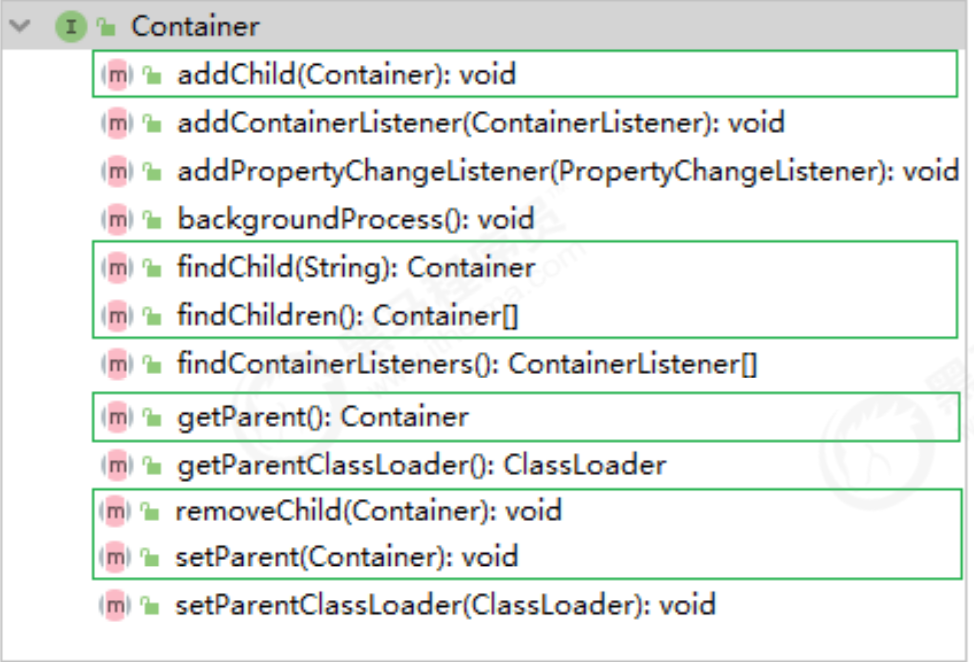
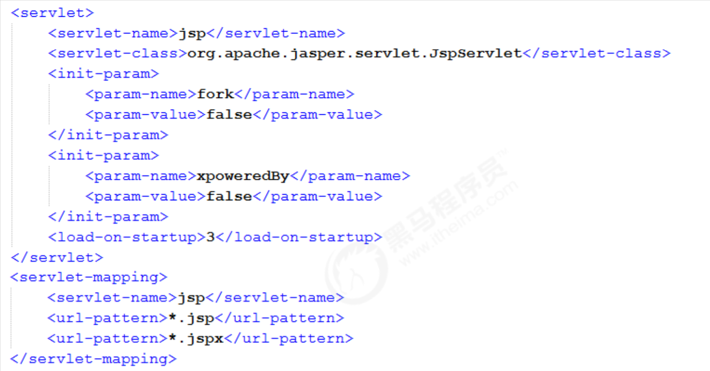

2d [学习资源](https://www.bilibili.com/video/BV1dJ411N7Um)  

# 1.Tomcat


## 1.1结构


## 1.2Tomcat源码运行 

- 1.下载源码 `apache-tomcat-8.5.42-src`

- 2.在源码目录下编写 pom.xml 文件

  ```xml
  <?xml version="1.0" encoding="UTF-8"?>
  <project xmlns="http://maven.apache.org/POM/4.0.0"
           xmlns:xsi="http://www.w3.org/2001/XMLSchema-instance"
           xsi:schemaLocation="http://maven.apache.org/POM/4.0.0 http://maven.apache.org/xsd/maven-4.0.0.xsd">
   
      <modelVersion>4.0.0</modelVersion>
      <groupId>org.apache.tomcat</groupId>
      <artifactId>Tomcat8.5</artifactId>
      <name>Tomcat8.5</name>
      <version>8.5</version>
   
      <build>
          <finalName>Tomcat8.5</finalName>
          <sourceDirectory>java</sourceDirectory>
          <testSourceDirectory>test</testSourceDirectory>
          <resources>
              <resource>
                  <directory>java</directory>
              </resource>
          </resources>
          <testResources>
             <testResource>
                  <directory>test</directory>
             </testResource>
          </testResources>
          <plugins>
              <plugin>
                  <groupId>org.apache.maven.plugins</groupId>
                  <artifactId>maven-compiler-plugin</artifactId>
                  <version>2.4</version>
                  <configuration>
                      <encoding>UTF-8</encoding>
                      <source>1.8</source>
                      <target>1.8</target>
                  </configuration>
              </plugin>
          </plugins>
      </build>
   
      <dependencies>
          <dependency>
              <groupId>org.apache.maven.plugins</groupId>
              <artifactId>maven-compiler-plugin</artifactId>
              <version>2.4</version>
          </dependency>
          <dependency>
              <groupId>junit</groupId>
              <artifactId>junit</artifactId>
              <version>4.12</version>
              <scope>test</scope>
          </dependency>
          <dependency>
              <groupId>org.easymock</groupId>
              <artifactId>easymock</artifactId>
              <version>3.4</version>
          </dependency>
          <dependency>
              <groupId>ant</groupId>
              <artifactId>ant</artifactId>
              <version>1.7.0</version>
          </dependency>
          <dependency>
              <groupId>wsdl4j</groupId>
              <artifactId>wsdl4j</artifactId>
              <version>1.6.2</version>
          </dependency>
          <dependency>
              <groupId>javax.xml</groupId>
              <artifactId>jaxrpc</artifactId>
              <version>1.1</version>
          </dependency>
          <dependency>
              <groupId>org.eclipse.jdt.core.compiler</groupId>
              <artifactId>ecj</artifactId>
              <version>4.5.1</version>
          </dependency>
         
      </dependencies>
  </project>
  ```

- 3.Main class设置为org.apache.catalina.startup.Bootstrap  添加VM options 

- ```bash
  -Dcatalina.home=D:/MyJava/tomcat_note/apache-tomcat-8.5.42-src/home
  -Dcatalina.base=D:/MyJava/tomcat_note/apache-tomcat-8.5.42-src/home
  -Djava.util.logging.manager=org.apache.juli.ClassLoaderLogManager
  -Djava.util.logging.config.file=D:/MyJava/tomcat_note/apache-tomcat-8.5.42-src/home/conf/logging.properties
  -Duser.language=en
  -Duser.region=US
  -Dfile.encoding=UTF-8
  ```

- 4.在tomcat的源码org.apache.catalina.startup.ContextConfig中的configureStart函数中手动将JSP解析器初始化：

  ```java
  webConfig();
  //加上下面这一行
  context.addServletContainerInitializer(new JasperInitializer(), null);
  ```

- 5.访问  http://localhost:8080/

bug1

> Failed to execute goal org.apache.maven.plugins:maven-install-plugin:2.4:install (default-cli) on project Tomcat8.5: The packaging for this project did not assign a file to the build artifact

重新打开项目 问题解决。。。

bug2 找不到 

> ```
> Error:(29, 36) java: 找不到符号
>   符号:   变量 CookieFilter
> ```

直接将这个测试类全部注释掉

# 2.Tomcat 架构 

## 2.1 Http工作原理

HTTP协议是浏览器与服务器之间的数据传送协议。作为应用层协议，HTTP是基于TCP/IP 协议来传递数据的（HTML文件、图片、查询结果等），HTTP协议不涉及数据包 （Packet）传输，主要规定了客户端和服务器之间的通信格式。


## 2.2 Tomcat整体架构 

### 2.2.1 Http服务器请求处理 

浏览器发给服务端的是一个HTTP格式的请求，HTTP服务器收到这个请求后，需要调用服 务端程序来处理，所谓的服务端程序就是你写的Java类，一般来说不同的请求需要由不同 的Java类来处理。


1） 图1 ， 表示HTTP服务器直接调用具体业务类，它们是**紧耦合**的。

 2） 图2，HTTP服务器不直接调用业务类，而是把请求交给容器来处理，容器通过 Servlet接口调用业务类。因此Servlet接口和Servlet容器的出现，达到了HTTP服务器与 业务类解耦的目的。而Servlet接口和Servlet容器这一整套规范叫作Servlet规范。 Tomcat按照Servlet规范的要求实现了Servlet容器，同时它们也具有HTTP服务器的功 能。作为Java程序员，如果我们要实现新的业务功能，只需要实现一个Servlet，并把它 注册到Tomcat（Servlet容器）中，剩下的事情就由Tomcat帮我们处理了。

### 2.2.2 Servlet容器工作流程 

​		为了解耦，HTTP服务器不直接调用Servlet，而是把请求交给Servlet容器来处理，那 Servlet容器又是怎么工作的呢？ 

​		当客户请求某个资源时，HTTP服务器会用一个ServletRequest对象把客户的请求信息封 装起来，然后调用Servlet容器的service方法，Servlet容器拿到请求后，根据请求的URL 和Servlet的映射关系，找到相应的Servlet，如果Servlet还没有被加载，就用反射机制创 建这个Servlet，并调用Servlet的init方法来完成初始化，接着调用Servlet的service方法 来处理请求，把ServletResponse对象返回给HTTP服务器，HTTP服务器会把响应发送给 客户端。


### 2.2.3 Tomcat整体架构

​		我们知道如果要设计一个系统，首先是要了解需求，我们已经了解了Tomcat要实现两个 **核心功能**： 

1） 处理Socket连接，负责网络字节流与Request和Response对象的转化。

 2） 加载和管理Servlet，以及具体处理Request请求。 因此Tomcat设计了两个核心组件连接器（Connector）和容器（Container）来分别做这 两件事情。连接器负责对外交流，容器负责内部处理。


## 2.3 连接器 - Coyote 

### 2.3.1 架构介绍 

​		Coyote 是Tomcat的连接器框架的名称 , 是Tomcat服务器提供的供客户端访问的外部接 口。客户端通过Coyote与服务器建立连接、发送请求并接受响应 。 

​		Coyote 封装了底层的网络通信（Socket 请求及响应处理），为Catalina 容器提供了统一 的接口，使Catalina 容器与具体的**请求协议**及IO操作方式完全**解耦**。

​		Coyote 将Socket 输 入转换封装为 Request 对象，交由Catalina 容器进行处理，处理请求完成后, Catalina 通 过Coyote 提供的Response 对象将结果写入输出流 。 Coyote 作为独立的模块，只负责具体协议和IO的相关操作， 与Servlet 规范实现没有直 接关系，因此即便是 Request 和 Response 对象也并未实现Servlet规范对应的接口， 而 是在Catalina 中将他们进一步封装为ServletRequest 和 ServletResponse 。


### 2.3.2 IO模型与协议 

在Coyote中 ， Tomcat支持的多种I/O模型和应用层协议，具体包含哪些IO模型和应用层 协议，请看下表： Tomcat 支持的IO模型（自8.5/9.0 版本起，Tomcat 移除了 对 BIO 的支持）：


Tomcat 支持的**应用层协议**


 协议分层 ：


​		在 8.0 之前 ， Tomcat 默认采用的I/O方式为 BIO ， 之后改为 NIO。 无论 NIO、NIO2 还是 APR， 在性能方面均优于以往的BIO。 如果采用APR， 甚至可以达到 Apache HTTP Server 的影响性能。

​		Tomcat为了实现支持多种I/O模型和应用层协议，一个容器可能对接多个连接器，就好比 一个房间有多个门。但是单独的连接器或者容器都不能对外提供服务，需要把它们组装 起来才能工作，组装后这个整体叫作Service组件。这里请你注意，Service本身没有做什 么重要的事情，只是在连接器和容器外面多包了一层，把它们组装在一起。Tomcat内可 能有多个Service，这样的设计也是出于灵活性的考虑。通过在Tomcat中配置多个 Service，可以实现通过不同的端口号来访问同一台机器上部署的不同应用。

### 2.3.3 连接器组件


连接器中的各个组件的作用如下： 

**EndPoint** 

1） EndPoint ： Coyote 通信端点，即通信监听的接口，是具体Socket接收和发送处理 器，是对传输层的抽象，因此EndPoint用来实现TCP/IP协议的。 

2） Tomcat 并没有EndPoint 接口，而是提供了一个抽象类AbstractEndpoint ， 里面定 义了两个内部类：Acceptor和SocketProcessor。Acceptor用于监听Socket连接请求。 SocketProcessor用于处理接收到的Socket请求，它实现Runnable接口，在Run方法里 调用协议处理组件Processor进行处理。为了提高处理能力，SocketProcessor被提交到 线程池来执行。而这个线程池叫作执行器（Executor)，我在后面的专栏会详细介绍 Tomcat如何扩展原生的Java线程池。 

**Processor** 

​		Processor ： Coyote 协议处理接口 ，如果说EndPoint是用来实现TCP/IP协议的，那么 Processor用来实现HTTP协议，Processor接收来自EndPoint的Socket，读取字节流解 析成Tomcat Request和Response对象，并通过Adapter将其提交到容器处理， Processor是对应用层协议的抽象。 

**ProtocolHandler**

​		ProtocolHandler： Coyote 协议接口， 通过Endpoint 和 Processor ， 实现针对具体协 议的处理能力。Tomcat 按照协议和I/O 提供了6个实现类 ： AjpNioProtocol ， AjpAprProtocol， AjpNio2Protocol ， Http11NioProtocol ，Http11Nio2Protocol ， Http11AprProtocol。我们在配置tomcat/conf/server.xml 时 ， 至少要指定具体的 ProtocolHandler , 当然也可以指定协议名称 ， 如 ： HTTP/1.1 ，如果安装了APR，那么 将使用Http11AprProtocol ， 否则使用 Http11NioProtocol 。

 **Adapter** 

​		由于协议不同，客户端发过来的请求信息也不尽相同，Tomcat定义了自己的Request类来“存放”这些请求信息。**ProtocolHandler**接口负责解析请求并生成Tomcat Request类。 但是这个Request对象**不是标准的ServletRequest**，也就意味着，不能用Tomcat Request作为参数来调用容器。Tomcat设计者的解决方案是引入==CoyoteAdapter==，这是 适配器模式的经典运用，连接器调用CoyoteAdapter的Sevice方法，传入的是Tomcat Request对象，CoyoteAdapter负责将Tomcat Request转成ServletRequest，再调用容 器的Service方法。

## 2.4 容器 - Catalina

 		Tomcat是一个由一系列可配置的组件构成的Web容器，而Catalina是Tomcat  servlet容器。Catalina 是Servlet 容器实现，包含了之前讲到的所有的容器组件，以及后续章节涉及到 的安全、会话、集群、管理等Servlet 容器架构的各个方面。它通过松耦合的方式集成 Coyote，以完成按照请求协议进行数据读写。同时，它还包括我们的启动入口、Shell程 序等。 

### 2.4.1 Catalina 地位

 Tomcat 的模块分层结构图， 如下：


​		Tomcat 本质上就是一款 **Servlet 容器**， 因此Catalina 才是 Tomcat 的核心 ， 其他模块 都是为Catalina 提供支撑的。 比如 ： 通过Coyote 模块提供链接通信，Jasper 模块提供 JSP引擎，Naming 提供JNDI 服务，Juli 提供日志服务。

### 2.4.2 Catalina 结构 

Catalina 的主要组件结构如下：


如上图所示，Catalina负责管理Server，而Server表示着整个服务器。Server下面有多个 服务Service，每个服务都包含着多个连接器组件Connector（Coyote 实现）和一个容器 组件Container。在Tomcat 启动的时候， 会**初始化**一个Catalina的实例。

|   组件    | 职责                                                         |
| :-------: | :----------------------------------------------------------- |
| Catalina  | 负责解析Tomcat的配置文件 , 以此来创建服务器Server组件，并根据 命令来对其进行管理 |
|  Server   | 服务器表示整个Catalina Servlet容器以及其它组件，负责组装并启动 Servlet引擎,Tomcat连接器。Server通过实现Lifecycle接口，提供了 一种优雅的启动和关闭整个系统的方式 |
|  Service  | 服务是Server内部的组件，一个Server包含多个Service。它将若干个 Connector组件绑定到一个Container（Engine）上 |
| Connector | 连接器，处理与客户端的通信，它负责接收客户请求，然后转给相关 的容器处理，最后向客户返回响应结果 |
| Container | 容器，负责处理用户的servlet请求，并返回对象给web用户的模块   |

### 2.4.3 Container 结构 

​		Tomcat设计了4种容器，分别是Engine、Host、Context和Wrapper。这4种容器不是平 行关系，而是父子关系。， Tomcat通过一种分层的架构，使得Servlet容器具有很好的灵 活性。


各个组件的含义 ：

| 容器    | 描述                                                         |
| ------- | ------------------------------------------------------------ |
| Engine  | 表示整个Catalina的Servlet引擎，用来管理多个虚拟站点，一个Service 最多只能有一个Engine，但是一个引擎可包含多个Host |
| Host    | 代表一个虚拟主机，或者说一个站点，可以给Tomcat配置多个虚拟主 机地址，而一个虚拟主机下可包含多个Context |
| Context | 表示一个Web应用程序， 一个Web应用可包含多个Wrapper           |
| Wrapper | 表示一个Servlet，Wrapper 作为容器中的最底层，不能包含子容器  |

​		我们也可以再通过Tomcat的server.xml配置文件来加深对Tomcat容器的理解。Tomcat 采用了组件化的设计，它的构成组件都是可配置的，其中最外层的是Server，其他组件 按照一定的格式要求配置在这个顶层容器中。


​		那么，Tomcat是怎么管理这些容器的呢？你会发现这些容器具有父子关系，形成一个树 形结构，你可能马上就想到了设计模式中的组合模式。没错，Tomcat就是用组合模式来 管理这些容器的。具体实现方法是，所有容器组件都实现了Container接口，因此组合模 式可以使得用户对单容器对象和组合容器对象的使用具有一致性。这里单容器对象指的 是最底层的Wrapper，组合容器对象指的是上面的Context、Host或者Engine。


Container 接口中提供了以下方法（截图中知识一部分方法） ：

		

​		在上面的接口看到了getParent、SetParent、addChild和removeChild等方法。 Container接口扩展了LifeCycle接口，LifeCycle接口用来统一管理各组件的生命周期，后 面我也用专门的篇幅去详细介绍。

## 2.5 Tomcat 启动流程

### 2.5.1 流程


步骤 : 

1） 启动tomcat ， 需要调用 bin/startup.bat (在linux 目录下 , 需要调用 bin/startup.sh) ， 在startup.bat 脚本中, 调用了catalina.bat。 

2） 在catalina.bat 脚本文件中，调用了BootStrap 中的main方法。 

3）在BootStrap 的main 方法中调用了 init 方法 ， 来创建Catalina 及 初始化类加载器。 4）在BootStrap 的main 方法中调用了 load 方法 ， 在其中又调用了Catalina的load方 法。 

5）在Catalina 的load 方法中 , 需要进行一些初始化的工作, 并需要构造Digester 对象, 用 于解析 XML。 

6） 然后在调用后续组件的初始化操作 。。。 加载Tomcat的配置文件，初始化容器组件 ，监听对应的端口号， 准备接受客户端请求

### 2.5.2 源码解析 

#### 2.5.2.1 Lifecycle

 		由于所有的组件均存在初始化、启动、停止等生命周期方法，拥有生命周期管理的特 性， 所以Tomcat在设计的时候， 基于生命周期管理抽象成了一个接口 Lifecycle ，而组 件 Server、Service、Container、Executor、Connector 组件 ， 都实现了一个生命周期 的接口，从而具有了以下生命周期中的核心方法：

1） init（）：初始化组件 

2） start（）：启动组件 

3） stop（）：停止组件 

4） destroy（）：销毁组件


#### 2.5.2.2 各组件的默认实现

 		上面我们提到的Server、Service、Engine、Host、Context都是接口， 下图中罗列了这 些接口的默认实现类。当前对于 Endpoint组件来说，在Tomcat中没有对应的Endpoint 接口， 但是有一个抽象类 AbstractEndpoint ，其下有三个实现类： NioEndpoint、 Nio2Endpoint、AprEndpoint ， 这三个实现类，分别对应于前面讲解链接器 Coyote 时， 提到的链接器支持的三种IO模型：NIO，NIO2，APR ， Tomcat8.5版本中，默认采 用的是 NioEndpoint。


### 2.5.3 总结 

​		从启动流程图中以及源码中，我们可以看出Tomcat的启动过程非常标准化， 统一按照生 命周期管理接口Lifecycle的定义进行启动。首先调用init() 方法进行组件的逐级初始化操 作，然后再调用start()方法进行启动。 每一级的组件除了完成自身的处理外，还要负责调用子组件响应的生命周期管理方法， 组件与组件之间是松耦合的，因为我们可以很容易的通过配置文件进行修改和替换。

## 2.6 Tomcat 请求处理流程 

### 2.6.1 请求流程

 		设计了这么多层次的容器，Tomcat是怎么确定每一个请求应该由哪个Wrapper容器里的 Servlet来处理的呢？答案是，Tomcat是用Mapper组件来完成这个任务的。 Mapper组件的功能就是将用户请求的URL定位到一个Servlet，它的工作原理是： Mapper组件里保存了Web应用的配置信息，其实就是容器组件与访问路径的映射关系， 比如Host容器里配置的域名、Context容器里的Web应用路径，以及Wrapper容器里 Servlet映射的路径，你可以想象这些配置信息就是一个多层次的Map。

​		当一个请求到来时，Mapper组件通过解析请求URL里的域名和路径，再到自己保存的 Map里去查找，就能定位到一个Servlet。请你注意，一个请求URL最后只会定位到一个 Wrapper容器，也就是一个Servlet。 下面的示意图中 ， 就描述了 当用户请求链接 http://www.itcast.cn/bbs/findAll 之 后, 是如何找到最终处理业务逻辑的servlet 。


那上面这幅图只是描述了根据请求的URL如何查找到需要执行的Servlet ， 那么下面我们 再来解析一下 ， 从Tomcat的设计架构层面来分析Tomcat的请求处理。


步骤如下: 

1) Connector组件Endpoint中的Acceptor监听客户端套接字连接并接收Socket。 

2) 将连接交给线程池Executor处理，开始执行请求响应任务。 

3) Processor组件读取消息报文，解析请求行、请求体、请求头，封装成Request对象。 

4) Mapper组件根据请求行的URL值和请求头的Host值匹配由哪个Host容器、Context容

器、Wrapper容器处理请求。 

5) CoyoteAdaptor组件负责将Connector组件和Engine容器关联起来，把生成的 Request对象和响应对象Response传递到Engine容器中，调用 Pipeline。 

6) Engine容器的管道开始处理，管道中包含若干个Valve、每个Valve负责部分处理逻 辑。执行完Valve后会执行基础的 Valve--StandardEngineValve，负责调用Host容器的 Pipeline。 

7) Host容器的管道开始处理，流程类似，最后执行 Context容器的Pipeline。 

8) Context容器的管道开始处理，流程类似，最后执行 Wrapper容器的Pipeline。 

9) Wrapper容器的管道开始处理，流程类似，最后执行 Wrapper容器对应的Servlet对象 的 处理方法。

### 2.6.2 请求流程源码解析


​		在前面所讲解的Tomcat的整体架构中，我们发现Tomcat中的各个组件各司其职，组件 之间松耦合，确保了整体架构的可伸缩性和可拓展性，那么在组件内部，如何增强组件 的灵活性和拓展性呢？ 在Tomcat中，每个Container组件采用责任链模式来完成具体的 请求处理。 

​		在Tomcat中定义了Pipeline 和 Valve 两个接口，Pipeline 用于构建责任链， 后者代表责 任链上的每个处理器。Pipeline 中维护了一个基础的Valve，它始终位于Pipeline的末端 （最后执行），封装了具体的请求处理和输出响应的过程。当然，我们也可以调用 addValve()方法， 为Pipeline 添加其他的Valve， 后添加的Valve 位于基础的Valve之 前，并按照添加顺序执行。Pipiline通过获得首个Valve来启动整合链条的执行 。

# 3.Jasper 

## 3.1 Jasper 简介

 		对于基于JSP 的web应用来说，我们可以直接在JSP页面中编写 Java代码，添加第三方的 标签库，以及使用EL表达式。但是无论经过何种形式的处理，最终输出到客户端的都是 标准的HTML页面（包含js ，css...），并不包含任何的java相关的语法。 也就是说， 我 们可以把jsp看做是一种运行在服务端的脚本。 那么服务器是如何将 JSP页面转换为 HTML页面的呢？ Jasper模块是Tomcat的JSP核心引擎，我们知道JSP本质上是一个Servlet。Tomcat使用 Jasper对JSP语法进行解析，生成Servlet并生成Class字节码，用户在进行访问jsp时，会 访问Servlet，最终将访问的结果直接响应在浏览器端 。另外，在运行的时候，Jasper还 会检测JSP文件是否修改，如果修改，则会重新编译JSP文件。 

## 3.2 JSP 编译方式

### 3.2.1 运行时编译

 Tomcat 并不会在启动Web应用的时候自动编译JSP文件， 而是在客户端第一次请求时， 才编译需要访问的JSP文件。 创建一个web项目, 并编写JSP代码 :

```jsp
<%@ page import="java.text.DateFormat" %>
<%@ page import="java.text.SimpleDateFormat" %>
<%@ page import="java.util.Date" %>
<%@ page contentType="text/html;charset=UTF‐8" language="java" %>
<%@ taglib prefix="c" uri="http://java.sun.com/jsp/jstl/core" %>
<html>
<head>
<title>$Title$</title>
</head>
<body>
<%
DateFormat dateFormat = new SimpleDateFormat("yyyy‐MM‐dd
HH:mm:ss");
String format = dateFormat.format(new Date());
%>
Hello , Java Server Page 。。。。
<br/>
<%= format %>
</body>
</html>
```

#### 3.2.1.1 编译过程 

​		Tomcat 在默认的web.xml 中配置了一个org.apache.jasper.servlet.JspServlet，用于处 理所有的.jsp 或 .jspx 结尾的请求，该Servlet 实现即是运行时编译的入口。



JspServlet 处理流程图：


### 3.2.2 编译结果 

1） 如果在 tomcat/conf/web.xml 中配置了参数scratchdir ， 则jsp编译后的结果，就会 存储在该目录下 。


2） 如果没有配置该选项， 则会将编译后的结果，存储在Tomcat安装目录下的 work/Catalina(Engine名称)/localhost(Host名称)/Context名称 。 假设项目名称为 jsp_demo 01。 

3） 如果使用的是 IDEA 开发工具集成Tomcat 访问web工程中的jsp ， 编译后的结果， 存放在 ： C:\Users\Administrator\.IntelliJIdea2019.1\system\tomcat\_project_tomcat\w ork\Catalina\localhost\jsp_demo_01_war_exploded\org\apache\jsp

### 3.2.2 预编译

 		除了运行时编译，我们还可以直接在Web应用启动时， 一次性将Web应用中的所有的JSP 页面一次性编译完成。在

​		这种情况下，Web应用运行过程中，便可以**不必再进行实时编 译**，而是直接调用JSP页面对应的Servlet 完成请求处理， 从而**提升系统性能**。 Tomcat 提供了一个Shell程序JspC，用于支持JSP预编译，而且在Tomcat的安装目录下提 供了一个 catalina-tasks.xml 文件声明了Tomcat 支持的Ant任务， 因此，我们很容易使 用 Ant 来执行JSP 预编译 。（要想使用这种方式，必须得确保在此之前已经下载并安装 了Apache Ant）。

## 3.3 JSP编译原理 

### 3.3.1 代码分析 

编译后的.class 字节码文件及源码 :

```java
out.write("\r\n");
out.write("<!DOCTYPE html>\r\n");
out.write("<html lang=\"en\">\r\n");
out.write("    <head>\r\n");
out.write("        <meta charset=\"UTF-8\" />\r\n");
out.write("        <title>");
out.print(request.getServletContext().getServerInfo() );
out.write("</title>\r\n");
out.write("        <link href=\"favicon.ico\" rel=\"icon\" type=\"image/x-icon\" />\r\n");
out.write("        <link href=\"favicon.ico\" rel=\"shortcut icon\" type=\"image/x-icon\" />\r\n");
out.write("        <link href=\"tomcat.css\" rel=\"stylesheet\" type=\"text/css\" />\r\n");
...
```

由编译后的源码解读， 可以分析出以下几点 ： 

1） 其类名为 index_jsp ， 继承自 org.apache.jasper.runtime.HttpJspBase ， 该类是 HttpServlet 的子类 ， 所以jsp 本质就是一个Servlet 。 

2） 通过属性 _jspx_dependants 保存了当前JSP页面依赖的资源， 包含引入的外部的JSP 页面、导入的标签、标签所在的jar包等，便于后续处理过程中使用（如重新编译检测， 因此它以Map形式保存了每个资源的上次修改时间）。 

3） 通过属性 _jspx_imports_packages 存放导入的 java 包， 默认导入 javax.servlet ， javax.servlet.http, javax.servlet.jsp 。 

4） 通过属性 _jspx_imports_classes 存放导入的类， 通过import 指令导入的 DateFormat 、SimpleDateFormat 、Date 都会包含在该集合中。 _jspx_imports_packages 和 _jspx_imports_classes 属性主要用于配置 EL 引擎上下文 。 

5） 请求处理由方法 _jspService 完成 ， 而在父类 HttpJspBase 中的service 方法通过模 板方法模式 ， 调用了子类的 _jspService 方法。

6） _jspService 方法中定义了几个重要的局部变量 ： pageContext 、Session、 application、config、out、page。由于整个页面的输出有 _jspService 方法完成，因此 这些变量和参数会对整个JSP页面生效。 这也是我们为什么可以在JSP页面使用这些变量 的原因。 

7） 指定文档类型的指令 （page） 最终转换为 response.setContentType() 方法调用。 8） 对于每一行的静态内容（HTML） ， 调用 out.write 输出。

9） 对于 <% ... %> 中的java 代码 ， 将直接转换为 Servlet 类中的代码。 如果在 Java 代码中嵌入了静态文件， 则同样调用 out.write 输出。 

### 3.3.2 编译流程

 JSP 编译过程如下：


Compiler 编译工作主要包含代码生成 和 编译两部分 ： 

**代码生成**

 1） Compiler 通过一个 PageInfo 对象保存JSP 页面编译过程中的各种配置，这些配置可 能来源于 Web 应用初始化参数， 也可能来源于JSP页面的指令配置（如 page ， include）。 

2） 调用ParserController 解析指令节点， 验证其是否合法，同时将配置信息保存到 PageInfo 中， 用于控制代码生成。 

3） 调用ParserController 解析整个页面， 由于 JSP 是逐行解析， 所以对于每一行会创 建一个具体的Node 对象。如 静态文本（TemplateText）、Java代码（Scriptlet）、定 制标签（CustomTag）、Include指令（IncludeDirective）。 

4） 验证除指令外其他所有节点的合法性， 如 脚本、定制标签、EL表达式等。 

5） 收集除指令外其他节点的页面配置信息。 

6） 编译并加载当前 JSP 页面依赖的标签

7） 对于JSP页面的EL表达式，生成对应的映射函数。 

8） 生成JSP页面对应的Servlet 类源代码 

**编译**

 		代码生成完成后， Compiler 还会生成 SMAP 信息。 如果配置生成 SMAP 信息， Compiler 则会在编译阶段将SMAP 信息写到class 文件中 。 在编译阶段， Compiler 的两个实现 AntCompiler 和 JDTCompiler 分别调用先关框架的 API 进行源代码编译。 

对于 AntCompiler 来说， 构造一个 Ant 的javac 的任务完成编译。 

对于 JDTCompiler 来说， 调用 org.eclipse.jdt.internal.compiler.Compiler 完成编译。

# 4.Tomcat 服务器配置 

Tomcat 服务器的配置主要集中于 tomcat/conf 下的 catalina.policy、 catalina.properties、context.xml、server.xml、tomcat-users.xml、web.xml 文件。 

## 4.1 server.xml 

server.xml 是tomcat 服务器的核心配置文件，包含了Tomcat的 Servlet 容器 （Catalina）的所有配置。由于配置的属性特别多，我们在这里主要讲解其中的一部分重 要配置。 

### 4.1.1 Server 

Server是server.xml的根元素，用于创建一个Server实例，默认使用的实现类是 org.apache.catalina.core.StandardServer。 

```xml
<Server port="8005" shutdown="SHUTDOWN">
</Server>
```

port : Tomcat 监听的关闭服务器的端口。 

shutdown： 关闭服务器的指令字符串。 

Server内嵌的子元素为 Listener、GlobalNamingResources、Service。

port : Tomcat 监听的关闭服务器的端口。 shutdown： 关闭服务器的指令字符串。 Server内嵌的子元素为 Listener、GlobalNamingResources、Service。

默认配置的5个Listener 的含义

```xml
<!‐‐ 用于以日志形式输出服务器 、操作系统、JVM的版本信息 ‐‐>
<Listener className="org.apache.catalina.startup.VersionLoggerListener"
/>
<!‐‐ 用于加载（服务器启动） 和 销毁 （服务器停止） APR。 如果找不到APR库， 则会
输出日志， 并不影响Tomcat启动 ‐‐>
<Listener className="org.apache.catalina.core.AprLifecycleListener"
SSLEngine="on" />
<!‐‐ 用于避免JRE内存泄漏问题 ‐‐>
<Listener
className="org.apache.catalina.core.JreMemoryLeakPreventionListener" />
<!‐‐ 用户加载（服务器启动） 和 销毁（服务器停止） 全局命名服务 ‐‐>
<Listener
className="org.apache.catalina.mbeans.GlobalResourcesLifecycleListener"
/>
<!‐‐ 用于在Context停止时重建Executor 池中的线程， 以避免ThreadLocal 相关的内
存泄漏 ‐‐>
<Listener
className="org.apache.catalina.core.ThreadLocalLeakPreventionListener" />
```

GlobalNamingResources 中定义了全局命名服务：

```xml
<!‐‐ Global JNDI resources
Documentation at /docs/jndi‐resources‐howto.html
‐‐>
<GlobalNamingResources>
<!‐‐ Editable user database that can also be used by
UserDatabaseRealm to authenticate users
‐‐>
<Resource name="UserDatabase" auth="Container"
type="org.apache.catalina.UserDatabase"
description="User database that can be updated and saved"
factory="org.apache.catalina.users.MemoryUserDatabaseFactory"
pathname="conf/tomcat‐users.xml" />
</GlobalNamingResources>
```

### 4.1.2 Service 

​		该元素用于创建 Service 实例，默认用org.apache.catalina.core.StandardService。 默认情况下，Tomcat 仅指定了Service 的名称， 值为 "Catalina"。Service 可以内嵌的 元素为 ： Listener、Executor、Connector、Engine，其中 ： Listener 用于为Service 添加生命周期监听器， Executor 用于配置Service 共享线程池，Connector 用于配置 Service 包含的链接器， Engine 用于配置Service中链接器对应的Servlet 容器引擎。 一个Server服务器，可以包含多个Service服务。

```xml
<Service name="Catalina">
...
</Service>
```

一个Server服务器，可以包含多个Service服务。

### 4.1.3 Executor 

默认情况下，Service 并未添加共享线程池配置。 如果我们想添加一个线程池， 可以在 下添加如下配置：

```xml
<Executor name="tomcatThreadPool"
namePrefix="catalina‐exec‐"
maxThreads="200"
minSpareThreads="100"
maxIdleTime="60000"
maxQueueSize="Integer.MAX_VALUE"
prestartminSpareThreads="false"
threadPriority="5"
className="org.apache.catalina.core.StandardThreadExecutor"/>
```


​		如果不配置共享线程池，那么Catalina 各组件在用到线程池时会独立创建。

###  4.1.4 Connector 

​		Connector 用于创建链接器实例。默认情况下，server.xml 配置了两个链接器，一个支 持HTTP协议，一个支持AJP协议。因此大多数情况下，我们并不需要新增链接器配置， 只是根据需要对已有链接器进行优化。

```xml
<Connector port="8080" protocol="HTTP/1.1" connectionTimeout="20000"
redirectPort="8443" />
<Connector port="8009" protocol="AJP/1.3" redirectPort="8443" />
```

属性说明： 

1） port： 端口号，Connector 用于创建服务端Socket 并进行监听， 以等待客户端请求 链接。如果该属性设置为0，Tomcat将会随机选择一个可用的端口号给当前Connector 使用。 

2） protocol ： 当前Connector 支持的访问协议。 默认为 HTTP/1.1 ， 并采用自动切换 机制选择一个基于 JAVA NIO 的链接器或者基于本地APR的链接器（根据本地是否含有 Tomcat的本地库判定）。 

如果不希望采用上述自动切换的机制， 而是明确指定协议， 可以使用以下值。

Http协议：

```xml
org.apache.coyote.http11.Http11NioProtocol ， 非阻塞式 Java NIO 链接器
org.apache.coyote.http11.Http11Nio2Protocol ， 非阻塞式 JAVA NIO2 链接器
org.apache.coyote.http11.Http11AprProtocol ， APR 链接器
```

AJP协议 ：

```xml
org.apache.coyote.ajp.AjpNioProtocol ， 非阻塞式 Java NIO 链接器 org.apache.coyote.ajp.AjpNio2Protocol ，非阻塞式 JAVA NIO2 链接器 org.apache.coyote.ajp.AjpAprProtocol ， APR 链接器
```

 3） connectionTimeOut : Connector 接收链接后的等待超时时间， 单位为 毫秒。 -1 表 示不超时。 

4） redirectPort：当前Connector 不支持SSL请求， 接收到了一个请求， 并且也符合 security-constraint 约束， 需要SSL传输，Catalina自动将请求重定向到指定的端口。 

5） executor ： 指定共享线程池的名称， 也可以通过maxThreads、minSpareThreads 等属性配置内部线程池。 

6） URIEncoding : 用于指定编码URI的字符编码， Tomcat8.x版本默认的编码为 UTF-8 , Tomcat7.x版本默认为ISO-8859-1。 完整的配置如下：

```xml
<Connector port="8080"
protocol="HTTP/1.1"
executor="tomcatThreadPool"
maxThreads="1000"
minSpareThreads="100"
acceptCount="1000"
maxConnections="1000"
connectionTimeout="20000"
compression="on"
compressionMinSize="2048"
disableUploadTimeout="true"
redirectPort="8443"
URIEncoding="UTF‐8" />
```

### 4.1.5 Engine

Engine 作为Servlet 引擎的顶级元素，内部可以嵌入： Cluster、Listener、Realm、 Valve和Host。

```xml
<Engine name="Catalina" defaultHost="localhost">
...
</Engine>
```

属性说明： 

1） name： 用于指定Engine 的名称， 默认为Catalina 。该名称会影响一部分Tomcat的 存储路径（如临时文件）。 

2） defaultHost ： 默认使用的虚拟主机名称， 当客户端请求指向的主机无效时， 将交 由默认的虚拟主机处理， 默认为localhost。 

### 4.1.6 Host 

​		Host 元素用于配置一个虚拟主机， 它支持以下嵌入元素：Alias、Cluster、Listener、 Valve、Realm、Context。如果在Engine下配置Realm， 那么此配置将在当前Engine下 的所有Host中共享。 同样，如果在Host中配置Realm ， 则在当前Host下的所有Context 中共享。

​		Context中的Realm优先级 > Host 的Realm优先级 > Engine中的Realm优先 级。 

```xml
<Host name="localhost" appBase="webapps" unpackWARs="true"
autoDeploy="true">
...
</Host>
```

属性说明： 

1） name: 当前Host通用的网络名称， 必须与DNS服务器上的注册信息一致。 Engine中 包含的Host必须存在一个名称与Engine的defaultHost设置一致。 

2） appBase： 当前Host的应用基础目录， 当前Host上部署的Web应用均在该目录下 （可以是绝对目录，相对路径）。默认为webapps。 

3） unpackWARs： 设置为true， Host在启动时会将appBase目录下war包解压为目 录。设置为false， Host将直接从war文件启动。 

4） autoDeploy： 控制tomcat是否在运行时定期检测并自动部署新增或变更的web应 用。

通过给Host添加别名，我们可以实现同一个Host拥有多个网络名称，配置如下：

```xml
<Host name="www.web1.com" appBase="webapps" unpackWARs="true"
autoDeploy="true">
<Alias>www.web2.com</Alias>
</Host>
```

 这个时候，我们就可以通过两个域名访问当前Host下的应用（需要确保DNS或hosts中添 加了域名的映射配置）。

配置2个域名


```xml
# tomcat  配置host
127.0.0.1 www.tomcat1.com
127.0.0.1 www.tomcat2.com

<Host name="www.tomcat1.com"  appBase="webapps1"
      unpackWARs="true" autoDeploy="true">
    <Valve className="org.apache.catalina.valves.AccessLogValve" directory="logs"
           prefix="localhost_access_log" suffix=".txt"
           pattern="%h %l %u %t &quot;%r&quot; %s %b" />
</Host>

<Host name="www.tomcat2.com"  appBase="webapps2"
      unpackWARs="true" autoDeploy="true">
    <Valve className="org.apache.catalina.valves.AccessLogValve" directory="logs"
           prefix="localhost_access_log" suffix=".txt"
           pattern="%h %l %u %t &quot;%r&quot; %s %b" />
</Host>
```

### 4.1.7 Context Context

用于配置一个Web应用，默认的配置如下： 属性描述：

```xml
<Context docBase="myApp" path="/myApp">
....
</Context>
```

可以直接在浏览器中  访问文本文件，赞


 

1） docBase：Web应用目录或者War包的部署路径。可以是绝对路径，也可以是相对于 Host appBase的相对路径。 

2） path：Web应用的Context 路径。如果我们Host名为localhost， 则该web应用访问 的根路径为： http://localhost:8080/myApp。 它支持的内嵌元素为：CookieProcessor， Loader， Manager，Realm，Resources， WatchedResource，JarScanner，Valve。

## 4.2 tomcat-users.xml 

该配置文件中，主要配置的是Tomcat的用户，角色等信息，用来控制Tomcat中 manager， host-manager的访问权限。

# 5.Web 应用配置

 		web.xml 是web应用的描述文件， 它支持的元素及属性来自于Servlet 规范定义 。 在 Tomcat 中， Web 应用的描述信息包括 tomcat/conf/web.xml 中默认配置 以及 Web 应用 WEB-INF/web.xml 下的定制配置。

## 5.1 ServletContext 初始化参数

​		我们可以通过 添加ServletContext 初始化参数，它配置了一个键值对，这样我们可以在 应用程序中使用 javax.servlet.ServletContext.getInitParameter()方法获取参数。

```xml
<context‐param>
    <param‐name>contextConfigLocation</param‐name>
    <param‐value>classpath:applicationContext‐*.xml</param‐value>
    <description>Spring Config File Location</description>
</context‐param>
```

## 5.2 会话配置 

​		用于配置Web应用会话，包括 超时时间、Cookie配置以及会话追踪模式。它将覆盖 server.xml 和 context.xml 中的配置。

```xml
 <session-config>
        <session-timeout>30</session-timeout>
        <cookie-config>
            <name>JESSIONID666</name>
            <domain>localhost</domain>
            <path>/</path>
            <comment>Session Cookie</comment>
            <http-only>true</http-only>
            <secure>false</secure>
            <max-age>3600</max-age>
        </cookie-config>
        <tracking-mode>COOKIE</tracking-mode>
    </session-config>
```

配置解析：

> 1） session‐timeout ： 会话超时时间，单位 分钟 
>
> 2） cookie‐config： 用于配置会话追踪Cookie 
>
> name：Cookie的名称 
>
> domain：Cookie的域名 
>
> path：Cookie的路径 
>
> comment：注释 
>
> http‐only：cookie只能通过HTTP方式进行访问，JS无法读取或修改，此项可以增 加网站访问的安全性。 
>
> secure：此cookie只能通过HTTPS连接传递到服务器，而HTTP 连接则不会传递该 信息。注意是从浏览器传递到服务器，服务器端的Cookie对象不受此项影响。 
>
> max‐age：以秒为单位表示cookie的生存期，默认为‐1表示是会话Cookie，浏览器 关闭时就会消失。 
>
> 3） tracking‐mode ：用于配置会话追踪模式，Servlet3.0版本中支持的追踪模式： COOKIE、URL、SSL 
>
> A. COOKIE : 通过HTTP Cookie 追踪会话是最常用的会话追踪机制， 而且 Servlet规范也要求所有的Servlet规范都需要支持Cookie追踪。 
>
> B. URL : URL重写是最基本的会话追踪机制。当客户端不支持Cookie时，可以采 用URL重写的方式。当采用URL追踪模式时，请求路径需要包含会话标识信息，Servlet容器 会根据路径中的会话标识设置请求的会话信息。如： http：//www.myserver.com/user/index.html;jessionid=1234567890。 
>
> C. SSL : 对于SSL请求， 通过SSL会话标识确定请求会话标识。

## 5.3 Servlet配置 

Servlet 的配置主要是两部分， servlet 和 servlet-mapping ：

```xml
    <servlet>
        <servlet-name>DServlet</servlet-name>
        <servlet-class>D</servlet-class>
        <init-param>
            <param-name>kk</param-name>
            <param-value>kk_value</param-value>
        </init-param>
        <load-on-startup>1</load-on-startup>
        <enabled>true</enabled>
    </servlet>

    <servlet-mapping>
        <servlet-name>DServlet</servlet-name>
        <url-pattern>/d</url-pattern>
        <url-pattern>*.do</url-pattern>
    </servlet-mapping>
```


1） servlet‐name : 指定servlet的名称， 该属性在web.xml中唯一。 

2） servlet‐class : 用于指定servlet类名 

3） init‐param： 用于指定servlet的初始化参数， 在应用中可以通过 HttpServlet.getInitParameter 获取。 

4） load‐on‐startup： 用于控制在Web应用启动时，Servlet的加载顺序。 值小于0， web应用启动时，不加载该servlet, 第一次访问时加载。 

5） enabled： true ， false 。 若为false ，表示Servlet不处理任何请求。 

6） url‐pattern： 用于指定URL表达式，一个 servlet‐mapping可以同时配置多个 url‐ pattern。


Servlet 中文件上传配置：

```xml
<servlet>
    <servlet‐name>uploadServlet</servlet‐name>
    <servlet‐class>cn.itcast.web.UploadServlet</servlet‐class>
    <multipart‐config>
        <location>C://path</location>
        <max‐file‐size>10485760</max‐file‐size>
        <max‐request‐size>10485760</max‐request‐size>
        <file‐size‐threshold>0</file‐size‐threshold>
    </multipart‐config>
</servlet>
```

配置说明：

1） location：存放生成的文件地址。 

2） max‐file‐size：允许上传的文件最大值。 默认值为‐1， 表示没有限制。 

3） max‐request‐size：针对该 multi/form‐data 请求的最大数量，默认值为‐1， 表示 无限制。 

4） file‐size‐threshold：当数量量大于该值时， 内容会被写入文件。

## 5.4 Listener配置 

​		Listener用于监听servlet中的事件，例如context、request、session对象的创建、修 改、删除，并触发响应事件。Listener是观察者模式的实现，在servlet中主要用于对 context、request、session对象的生命周期进行监控。在servlet2.5规范中共定义了8中 Listener。在启动时，ServletContextListener 的执行顺序与web.xml 中的配置顺序一 致， 停止时执行顺序相反。

```xml
<listener>
    <listener-class>org.springframework.web.context.ContextLoaderListener</listener‐
    class>
</listener>
```

## 5.5 Filter配置

​		filter 用于配置web应用过滤器， 用来过滤资源请求及响应。 经常用于认证、日志、加 密、数据转换等操作， 配置如下：

```xml
<filter>
    <filter‐name>myFilter</filter‐name>
    <filter‐class>cn.itcast.web.MyFilter</filter‐class>
    <async‐supported>true</async‐supported>
    <init‐param>
        <param‐name>language</param‐name>
        <param‐value>CN</param‐value>
    </init‐param>
</filter>

<filter‐mapping>
    <filter‐name>myFilter</filter‐name>
    <url‐pattern>/*</url‐pattern>
</filter‐mapping>
```

配置说明：

1） filter‐name： 用于指定过滤器名称，在web.xml中，过滤器名称必须唯一。 

2） filter‐class ： 过滤器的全限定类名， 该类必须实现Filter接口。 

3） async‐supported： 该过滤器是否支持异步 

4） init‐param ：用于配置Filter的初始化参数， 可以配置多个， 可以通过 FilterConfig.getInitParameter获取 

5） url‐pattern： 指定该过滤器需要拦截的URL。

## 5.6 欢迎页面配置 

welcome-file-list 用于指定web应用的欢迎文件列表。

```xml
<welcome‐file‐list>
    <welcome‐file>index.html</welcome‐file>
    <welcome‐file>index.htm</welcome‐file>
    <welcome‐file>index.jsp</welcome‐file>
</welcome‐file‐list>
```

尝试请求的顺序，从上到下。

## 5.7 错误页面配置 

error-page 用于配置Web应用访问异常时定向到的页面，支持HTTP响应码和异常类两种 形式。

```xml
	<error-page>
        <error-code>500</error-code>
        <location>/500.html</location>
    </error-page>

    <error-page>
        <error-code>404</error-code>
        <location>/404.html</location>
    </error-page>
```

# 6.Tomcat 管理配置

​		 从早期的Tomcat版本开始，就提供了Web版的管理控制台，他们是两个独立的Web应 用，位于webapps目录下。Tomcat 提供的管理应用有用于管理的Host的host-manager 和用于管理Web应用的manager。 

## 6.1 host-manager

 		Tomcat启动之后，可以通过 http://localhost:8080/host-manager/html 访问该Web应 用。 host-manager 默认添加了访问权限控制，当打开网址时，需要输入用户名和密码 （conf/tomcat-users.xml中配置） 。所以要想访问该页面，需要在conf/tomcatusers.xml 中配置，并分配对应的角色：

1） admin-gui：用于控制页面访问权限 

2） admin-script：用于控制以简单文本的形式进行访问 配置如下：

```xml
<role rolename="admin‐gui"/>
<role rolename="admin‐script"/>
<role rolename="manager-gui"/>
<user username="kk" password="kk" roles="admin-script,admin-gui,manager-gui"/>
```


## 6.2 manager

manager的访问地址为 http://localhost:8080/manager， 同样， manager也添加了页 面访问控制，因此我们需要为登录用户分配角色为：

```xml
<role rolename="manager-gui"/>
```


Server Status


# 7.JVM 配置

​		 最常见的JVM配置当属内存分配，因为在绝大多数情况下，JVM默认分配的内存可能不能 够满足我们的需求，特别是在生产环境，此时需要手动修改Tomcat启动时的内存参数分 配。

##  7.1 JVM内存模型图


## 7.2 JVM配置选项 

windows 平台(catalina.bat)：

```xml
set JAVA_OPTS=‐server ‐Xms2048m ‐Xmx2048m ‐XX:MetaspaceSize=256m 
‐XX:MaxMetaspaceSize=256m ‐XX:SurvivorRatio=8
```

```bash
-Xms: 初始堆大小
-Xmx: 最大堆大小
-Xmn: 年轻代大小
-XX:+PrintGCDetails 打印gc日志详情
-XX:SurvivorRatio=8 eden与survivor的比例，当为8的时候，eden占年轻代的80%，survivor区总的占20%，但survivor区要再分成两个survivor，所以，survivor大小为10%
-XX:MinHeapFreeRatio=minimum 堆中最小空闲大小的比例
-XX:MaxHeapFreeRatio=maximum 堆中最大空闲大小的比例
-XX:NewRatio=ratio 年轻代与老年代的比例关系，但要注意的是，默认情况下为2，即老年代占2/3，年轻代占1/3
-XX:NewSize=size 新生代最小值
-XX:MaxNewSize=size 新生代最大值
-XX:+AggressiveHeap
```

# 8.Tomcat 集群 

## 8.1 简介

​		 由于单台Tomcat的承载能力是有限的，当我们的业务系统用户量比较大，请求压力比较 大时，单台Tomcat是扛不住的，这个时候，就需要搭建Tomcat的集群，而目前比较流 程的做法就是通过Nginx来实现Tomcat集群的负载均衡。


## 8.2 环境准备 

### 8.2.2 准备Tomcat 

在服务器上, 安装两台tomcat, 然后分别改Tomcat服务器的端口号 :

在服务器上, 安装两台tomcat, 然后分别改Tomcat服务器的端口号 : 

> 8005 ‐‐‐‐‐‐‐‐‐> 8015 ‐‐‐‐‐‐‐‐‐> 8025 
>
> 8080 ‐‐‐‐‐‐‐‐‐> 8888 ‐‐‐‐‐‐‐‐‐> 9999 
>
> 8009 ‐‐‐‐‐‐‐‐‐> 8019 ‐‐‐‐‐‐‐‐‐> 8029 

### 8.2.3 安装配置Nginx 

在当前服务器上 , 安装Nginx , 然后再配置Nginx, 配置nginx.conf :

```properties
upstream serverpool{
		server localhost:8888;
		server localhost:9999;
	}

server {
    listen       99;
    server_name  localhost;

    location / {
    	proxy_pass  http://serverpool/;
    }
}
```

## 8.3 负载均衡策略 

1). 轮询 最基本的配置方法，它是upstream模块默认的负载均衡默认策略。每个请求会按时间顺 序逐一分配到不同的后端服务器。 

```properties
upstream serverpool{ 
	server localhost:8888; 
	server localhost:9999; 
	}
```

 参数说明:

| 参数         | 描述                                                         |
| ------------ | ------------------------------------------------------------ |
| fail_timeout | 与max_fails结合使用                                          |
| max_fails    | 设置在fail_timeout参数设置的时间内最大失败次数，如果在这个时 间内，所有针对该服务器的请求都失败了，那么认为该服务器会被 认为是停机了 |
| fail_time    | 服务器会被认为停机的时间长度,默认为10s                       |
| backup       | 标记该服务器为备用服务器。当主服务器停止时，请求会被发送到 它这里 down 标记服务器永久停机了 |

2). weight权重 

权重方式，在轮询策略的基础上指定轮询的几率。

```properties
 upstream serverpool{ 
     server localhost:8888 weight=3; 
     server localhost:9999 weight=1; 
 }
```

weight参数用于指定轮询几率，weight的默认值为1；

weight的数值与访问比率成正比， 比如8888服务器上的服务被访问的几率为9999服务器的三倍。 此策略比较适合服务器的硬件配置差别比较大的情况。 

3). ip_hash 

​		指定负载均衡器按照基于客户端IP的分配方式，这个方法确保了相同的客户端的请求一直 发送到相同的服务器，以保证session会话。这样每个访客都固定访问一个后端服务器， 可以解决session不能跨服务器的问题。 

```properties
upstream serverpool{ 
    ip_hash; 
    server 192.168.192.133:8080; 
    server 192.168.192.137:8080; 
}
```

## 8.4 Session共享方案

​		在Tomcat集群中，如果应用需要用户进行登录，那么这个时候，用于tomcat做了负载均 衡，则用户登录并访问应用系统时，就会出现问题 。


解决上述问题， 有以下几种方案： 

### 8.4.1 ip_hash 

策略 一个用户发起的请求，只会请求到tomcat1上进行操作，另一个用户发起的请求只在 tomcat2上进行操作 。那么这个时候，同一个用户发起的请求，都会通过nginx的 ip_hash策略，将请求转发到其中的一台Tomcat上。 

### 8.4.2 Session复制 

在servlet_demo01 工程中 , 制作session.jsp页面，分别将工程存放在两台 tomcat 的 webapps/ 目录下：

```jsp
<%--
  Created by IntelliJ IDEA.
  User: Administrator
  Date: 2021/9/8
  Time: 11:29
  To change this template use File | Settings | File Templates.
--%>
<%@ page contentType="text/html;charset=UTF-8" language="java" %>
<html>
<head>
  <title>Title</title>
</head>
<body>
TOMCAT ‐ 9999 ：
<br/>
sessionID : <%= session.getId()%>
<br/>
<%
  Object loginUser = session.getAttribute("loginUser");
  if(loginUser != null && loginUser.toString().length()>0){
    out.println("session 有值, loginUser = " + loginUser);
  }else{
    session.setAttribute("loginUser","ITCAST");
    out.println("session 没有值");
  }
%>
</body>
</html>
```

Session同步的配置如下：

1） 在Tomcat的conf/server.xml 配置如下: 

```xml
 <Cluster className="org.apache.catalina.ha.tcp.SimpleTcpCluster"/>
```

2） 在Tomcat部署的应用程序 servlet_demo01 的web.xml 中加入如下配置 ： 

```xml
<distributable/>
```

3） 配置完毕之后， 再次重启两个 Tomcat服务。 上述方案，适用于较小的集群环境（节点数不超过**4个**），如果集群的节点数比较多的 话，通过这种广播的形式来完成Session的复制，会消耗大量的网络带宽，影响服务的性 能。 

同步时有**延时**，需要等待几秒  数据才会传过去

### 8.4.3 SSO-单点登录 

​		单点登录（Single Sign On），简称为 SSO，是目前比较流行的企业业务整合的解决方案 之一。SSO的定义是在多个应用系统中，用户只需要登录一次就可以访问所有相互信任的 应用系统，也是用来解决集群环境Session共享的方案之一 。


# 9.Tomcat 安全 

## 9.1 配置安全 

1） 删除webapps目录下的所有文件，禁用tomcat管理界面； 

2） 注释或删除tomcat-users.xml文件内的所有用户权限

3） 更改关闭tomcat指令或禁用； tomcat的server.xml中定义了可以直接关闭 Tomcat 实例的管理端口（默认8005）。 可以通过 telnet 连接上该端口之后，输入 SHUTDOWN （此为默认关闭指令）即可关闭 Tomcat 实例（注意，此时虽然实例关闭了，但是进程还是存在的）。由于默认关闭 Tomcat 的端口和指令都很简单。默认端口为8005，指令为SHUTDOWN 。 

方案一： 

```xml
更改端口号和指令：
<Server port="8456" shutdown="itcast_shut">
```

方案二： 

```xml
禁用8005端口：
<Server port="‐1" shutdown="SHUTDOWN">
```

4） 定义错误页面 在webapps/ROOT目录下定义错误页面 404.html，500.html； 然后在tomcat/conf/web.xml中进行配置 ， 配置错误页面：

```xml
<error‐page>
    <error‐code>404</error‐code>
    <location>/404.html</location>
</error‐page>
<error‐page>
    <error‐code>500</error‐code>
    <location>/500.html</location>
</error‐page>
```

这样配置之后，用户在访问资源时出现404,500这样的异常，就能看到我们自定义的错误 页面，而不会看到异常的堆栈信息，提高了用户体验，也保障了服务的安全性。

## 9.2 应用安全

在大部分的Web应用中，特别是一些后台应用系统，都会实现自己的安全管理模块（权 限模块），用于控制应用系统的安全访问，基本包含两个部分：认证（登录/单点登录） 和授权（功能权限、数据权限）两个部分。对于当前的业务系统，可以自己做一套适用 于自己业务系统的权限模块，也有很多的应用系统直接使用一些功能完善的安全框架， 将其集成到我们的web应用中，如：SpringSecurity、Apache Shiro等。 

## 9.3 传输安全 

### 9.3.1 HTTPS介绍 

​		HTTPS的全称是超文本传输安全协议（Hypertext Transfer Protocol Secure），是一种 网络安全传输协议。在HTTP的基础上加入SSL/TLS来进行数据加密，保护交换数据不被 泄露、窃取。 SSL 和 TLS 是用于网络通信安全的加密协议，它允许客户端和服务器之间通过安全链接 通信。

SSL 协议的3个特性： 

1） 保密：通过SSL链接传输的数据时加密的。 

2） 鉴别：通信双方的身份鉴别，通常是可选的，单至少有一方需要验证。 

3） 完整性：传输数据的完整性检查。 从性能角度考虑，加解密是一项计算昂贵的处理，因为尽量不要将整个Web应用采用SSL 链接， 实际部署过程中， 选择有必要进行安全加密的页面（存在敏感信息传输的页面） 采用SSL通信。 

HTTPS和HTTP的区别主要为以下四点： 

1） HTTPS协议需要到证书颁发机构CA申请SSL证书, 然后与域名进行绑定，HTTP不用申 请证书；

 2） HTTP是超文本传输协议，属于应用层信息传输，HTTPS 则是具有SSL加密传安全性 传输协议，对数据的传输进行加密，相当于HTTP的升级版； 

3） HTTP和HTTPS使用的是完全不同的连接方式，用的端口也不一样，前者是8080，后 者是8443。 

4） HTTP的连接很简单，是无状态的；HTTPS协议是由SSL+HTTP协议构建的可进行加密 传输、身份认证的网络协议，比HTTP协议安全。 

HTTPS协议优势：

1） 提高网站排名，有利于SEO。谷歌已经公开声明两个网站在搜索结果方面相同，如果 一个网站启用了SSL，它可能会获得略高于没有SSL网站的等级，而且百度也表明对安装 了SSL的网站表示友好。因此，网站上的内容中启用SSL都有明显的SEO优势。 

2） 隐私信息加密，防止流量劫持。特别是涉及到隐私信息的网站，互联网大型的数据泄 露的事件频发发生，网站进行信息加密势在必行。 

3） 浏览器受信任。 自从各大主流浏览器大力支持HTTPS协议之后，访问HTTP的网站都 会提示“不安全”的警告信息。 

### 9.3.2 Tomcat支持HTTPS 

1） 生成秘钥库文件

```bash
keytool -genkey -alias tomcat -keyalg RSA -keystore tomcatkey.keystore
```

输入对应的密钥库密码， 秘钥密码等信息之后，会在当前文件夹中出现一个秘钥库文 件：tomcatkey.keystore 

2） 将秘钥库文件 tomcatkey.keystore 复制到tomcat/conf 目录下。 

3） 配置tomcat/conf/server.xml

```xml
<Connector port="8443" protocol="org.apache.coyote.http11.Http11NioProtocol"
		maxThreads="150" schema="https" secure="true" SSLEnabled="true">
		<SSLHostConfig certificateVerification="false">
			<Certificate
			certificateKeystoreFile="D:/Javainstall/apache-tomcat-cluster/tomcat-8888/conf/tomcatkey.keystore"
			certificateKeystorePassword="kkkkkk" type="RSA" />
		</SSLHostConfig>
</Connector>
```

4）访问Tomcat ，使用https协议。


