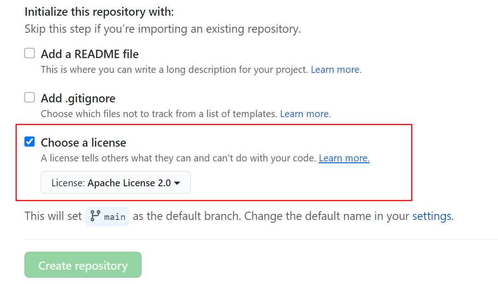

---

layout: post 
title:  博客搭建记录
date: 2021-03-22 
tags: gitub，jekyll

---

# 安装 jekyll

- window需要先安装``rubyinstaller`此处为[官网](https://rubyinstaller.org/downloads/)，但下载很慢，这里是我已经下载好的[百度网盘](https://pan.baidu.com/s/1V950shxdBMJwM5EBElYfsw )

- 将镜像改为国内的，不然非常卡顿

  ```java
  $ gem sources --remove https://rubygems.org/
  $ gem sources -a https://gems.ruby-china.org/
  $ gem sources -l
  *** CURRENT SOURCES ***
  https://gems.ruby-china.org/
  ```

# 部署到GitHub

##  1.新建仓库 注意仓库名

.jpg)


## 2.要勾选协议 不然后期有bug

